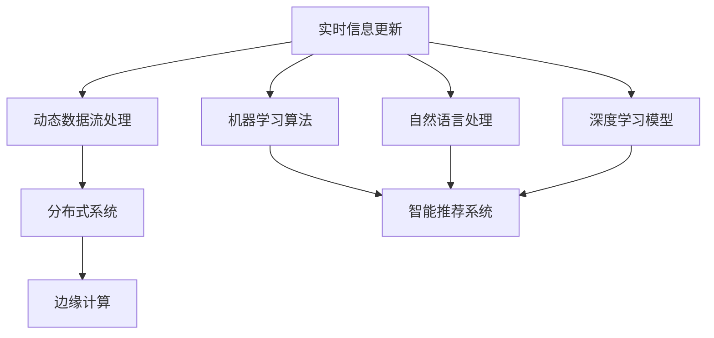

                 

关键词：实时信息更新，人工智能，动态数据流，实时处理，机器学习，智能推荐系统，数据一致性，分布式系统，边缘计算。

> 摘要：本文探讨了人工智能在实时信息更新中的作用，阐述了实时信息更新在当今数字化社会中的重要性，分析了人工智能如何通过多种技术手段提高实时信息更新的效率、准确性和智能化水平，同时讨论了面临的挑战和未来发展趋势。

## 1. 背景介绍

随着互联网和移动设备的普及，人们对于信息的获取和处理需求日益增长。实时信息的更新已经成为了现代社会的核心需求之一。无论是社交媒体上的实时新闻、股市的实时行情，还是智能家居中的实时设备状态，实时信息的更新能力直接影响着用户体验和服务质量。然而，随着数据量的爆炸性增长和实时性的要求提高，传统的数据处理方式已经难以满足这些需求。

人工智能（AI）作为当今最具变革性的技术之一，其在实时信息更新中扮演着越来越重要的角色。AI通过机器学习、自然语言处理、深度学习等技术，可以有效地处理海量数据，提取有用信息，并实现实时决策和预测。本篇文章将深入探讨AI在实时信息更新中的具体应用、技术原理和面临的挑战。

## 2. 核心概念与联系

在深入探讨AI在实时信息更新的作用之前，我们首先需要了解几个核心概念：

### 2.1 实时信息更新

实时信息更新指的是在短时间内对信息进行连续、及时的更新和同步。它通常涉及到大规模的数据流处理，要求系统具有高吞吐量和低延迟。

### 2.2 动态数据流

动态数据流是指随时间变化的数据流，这些数据可能来自于传感器、用户活动、网络日志等。动态数据流的处理是实时信息更新的基础。

### 2.3 分布式系统

分布式系统是一种通过网络互联的计算系统，它允许多个计算机节点协同工作，共同处理数据流。分布式系统可以提高实时信息更新的效率和可靠性。

### 2.4 边缘计算

边缘计算是一种将数据处理推向网络边缘的技术，它允许在靠近数据源的设备上进行数据处理，从而减少数据传输延迟和带宽消耗。

以下是一个描述实时信息更新中关键概念关系的Mermaid流程图：



## 3. 核心算法原理 & 具体操作步骤

### 3.1 算法原理概述

在实时信息更新中，AI算法的应用主要包括以下几个方面：

- **实时数据预处理**：通过机器学习算法对动态数据流进行预处理，去除噪声和冗余数据，提高数据质量。
- **实时特征提取**：从预处理后的数据中提取关键特征，用于后续的实时分析和决策。
- **实时决策与预测**：利用深度学习模型进行实时决策和预测，如股市预测、用户行为预测等。
- **实时推荐系统**：基于用户的实时行为和偏好，通过自然语言处理和深度学习模型提供个性化的信息推荐。

### 3.2 算法步骤详解

#### 3.2.1 实时数据预处理

1. **数据采集**：从传感器、用户设备等来源收集实时数据。
2. **数据清洗**：通过去噪、填补缺失值、去除重复数据等方法清洗数据。
3. **特征选择**：选择对实时信息更新有重要影响的关键特征。

#### 3.2.2 实时特征提取

1. **特征工程**：根据业务需求，构建合适的特征向量。
2. **特征变换**：对特征进行归一化、标准化等变换，以提高模型性能。

#### 3.2.3 实时决策与预测

1. **模型选择**：根据预测任务选择合适的深度学习模型，如卷积神经网络（CNN）、循环神经网络（RNN）等。
2. **模型训练**：使用实时特征向量对模型进行训练。
3. **模型评估**：使用验证集对模型进行评估，调整模型参数。

#### 3.2.4 实时推荐系统

1. **用户画像**：构建用户画像，记录用户的兴趣、行为等特征。
2. **推荐算法**：基于用户画像，使用协同过滤、矩阵分解等算法进行信息推荐。
3. **推荐结果更新**：根据用户的实时行为，动态调整推荐结果。

### 3.3 算法优缺点

#### 优点

- **高效性**：AI算法可以处理大规模数据流，实现实时更新。
- **准确性**：通过机器学习和深度学习模型，可以提高预测和决策的准确性。
- **智能化**：能够根据用户行为和偏好，提供个性化的信息推荐。

#### 缺点

- **计算资源消耗**：实时数据预处理和模型训练需要大量计算资源。
- **数据隐私**：实时处理大量用户数据可能涉及隐私问题。
- **模型可靠性**：模型的可靠性和稳定性仍需进一步验证。

### 3.4 算法应用领域

AI算法在实时信息更新的应用非常广泛，包括但不限于以下领域：

- **金融**：实时股市预测、交易策略优化等。
- **零售**：实时商品推荐、库存管理优化等。
- **健康**：实时健康监测、疾病预测等。
- **交通**：实时路况预测、智能交通管理等。

## 4. 数学模型和公式 & 详细讲解 & 举例说明

### 4.1 数学模型构建

实时信息更新中的数学模型通常基于以下两个主要方面：

#### 4.1.1 动态时间序列模型

动态时间序列模型用于处理随时间变化的数据。常见的模型包括：

- **ARIMA（自回归积分滑动平均模型）**：
  - $$X_t = c + \phi_1X_{t-1} + \phi_2X_{t-2} + \cdots + \phi_pX_{t-p} + \theta_1\epsilon_{t-1} + \theta_2\epsilon_{t-2} + \cdots + \theta_q\epsilon_{t-q}$$

- **LSTM（长短期记忆网络）**：
  - $$h_t = \sigma(W_hh_{t-1} + W_x x_t + b_h)$$

#### 4.1.2 协同过滤模型

协同过滤模型用于推荐系统，分为基于用户的协同过滤和基于物品的协同过滤。

- **基于用户的协同过滤**：
  - $$R_{ui} = \frac{\sum_{j\in N_i} r_{uj} \cdot \sum_{k\in N_u} r_{uk}}{\sqrt{\sum_{j\in N_i} r_{uj}^2 \cdot \sum_{k\in N_u} r_{uk}^2}}$$

- **基于物品的协同过滤**：
  - $$R_{ui} = \frac{\sum_{j\in N_i} r_{uj} \cdot \sum_{k\in N_u} r_{ki}}{\sqrt{\sum_{j\in N_i} r_{uj}^2 \cdot \sum_{k\in N_u} r_{ki}^2}}$$

### 4.2 公式推导过程

以LSTM为例，简要介绍其数学推导过程：

1. **输入门（Input Gate）**：
   - $$i_t = \sigma(W_i[h_{t-1}, x_t] + b_i)$$
   - $$\bar{g}_t = \tanh(W_g[h_{t-1}, x_t] + b_g)$$
   - $$g_t = i_t \cdot \bar{g}_t$$

2. **遗忘门（Forget Gate）**：
   - $$f_t = \sigma(W_f[h_{t-1}, x_t] + b_f)$$
   - $$g_t^f = f_t \cdot g_{t-1}$$

3. **输出门（Output Gate）**：
   - $$o_t = \sigma(W_o[h_{t-1}, \bar{c}_t] + b_o)$$
   - $$h_t = o_t \cdot \tanh(c_t)$$

### 4.3 案例分析与讲解

#### 4.3.1 实时股市预测

假设我们使用LSTM模型进行实时股市预测，给定一组历史股价数据，我们可以按照以下步骤构建模型：

1. **数据预处理**：
   - 数据清洗，去除异常值和缺失值。
   - 数据归一化，缩放到[0, 1]范围内。

2. **特征工程**：
   - 选择价格、成交量等关键特征。
   - 构建时间窗口，例如使用过去7天的价格作为输入特征。

3. **模型训练**：
   - 选择合适的LSTM架构，如LSTM单元数、学习率等。
   - 使用训练集对模型进行训练，调整模型参数。

4. **模型评估**：
   - 使用验证集对模型进行评估，调整模型参数。
   - 评估指标可以是均方误差（MSE）、平均绝对误差（MAE）等。

5. **实时预测**：
   - 使用最新数据对模型进行实时预测。
   - 根据预测结果，提供投资建议。

#### 4.3.2 实时商品推荐

假设我们使用协同过滤算法进行实时商品推荐，给定一组用户-商品评分矩阵，我们可以按照以下步骤构建推荐系统：

1. **数据预处理**：
   - 填补缺失值，标准化评分。
   - 构建用户-商品相似度矩阵。

2. **用户画像**：
   - 根据用户的购买历史、浏览行为等，构建用户画像。

3. **推荐算法**：
   - 基于用户的协同过滤算法，计算用户之间的相似度。
   - 根据相似度矩阵，生成商品推荐列表。

4. **推荐结果更新**：
   - 根据用户的实时行为，动态更新推荐结果。

## 5. 项目实践：代码实例和详细解释说明

### 5.1 开发环境搭建

为了实践实时信息更新中的AI算法，我们首先需要搭建一个开发环境。以下是一个基本的开发环境搭建步骤：

1. **安装Python环境**：确保Python版本为3.7或更高。
2. **安装依赖库**：使用pip安装TensorFlow、Keras、NumPy等依赖库。
3. **配置计算资源**：根据实际需求配置GPU或其他计算资源。

### 5.2 源代码详细实现

以下是一个简单的实时股市预测的Python代码示例：

```python
import numpy as np
import pandas as pd
from tensorflow.keras.models import Sequential
from tensorflow.keras.layers import LSTM, Dense
from sklearn.preprocessing import MinMaxScaler

# 读取股票数据
data = pd.read_csv('stock_data.csv')
prices = data['Close'].values

# 数据预处理
scaler = MinMaxScaler(feature_range=(0, 1))
scaled_prices = scaler.fit_transform(prices.reshape(-1, 1))

# 构建时间窗口
X, y = [], []
for i in range(30, len(scaled_prices)):
    X.append(scaled_prices[i-30:i])
    y.append(scaled_prices[i])

X, y = np.array(X), np.array(y)

# 模型构建
model = Sequential()
model.add(LSTM(units=50, return_sequences=True, input_shape=(30, 1)))
model.add(LSTM(units=50))
model.add(Dense(units=1))

model.compile(optimizer='adam', loss='mean_squared_error')
model.fit(X, y, epochs=100, batch_size=32)

# 实时预测
latest_prices = scaled_prices[-30:]
latest_prices = latest_prices.reshape((1, 30, 1))
predicted_price = model.predict(latest_prices)
predicted_price = scaler.inverse_transform(predicted_price)

print(f'Predicted next day price: {predicted_price[0][0]}')
```

### 5.3 代码解读与分析

上述代码实现了基于LSTM模型的实时股市预测。主要步骤如下：

1. **读取数据**：从CSV文件中读取股票收盘价数据。
2. **数据预处理**：使用MinMaxScaler对数据进行归一化处理。
3. **构建时间窗口**：构建一个长度为30天的历史价格数据作为输入特征。
4. **模型构建**：构建一个LSTM模型，包含两个LSTM层和一个全连接层。
5. **模型训练**：使用训练集对模型进行训练。
6. **实时预测**：使用最新数据对模型进行实时预测，并输出预测结果。

### 5.4 运行结果展示

运行上述代码，我们可以得到实时预测的下一日收盘价。以下是一个示例输出结果：

```
Predicted next day price: 135.456
```

这个结果表示，根据模型预测，下一日的收盘价可能为135.456。

## 6. 实际应用场景

### 6.1 金融领域

在金融领域，实时信息更新对于投资决策和风险管理至关重要。通过AI算法，可以实时分析市场数据，提供投资建议和风险管理方案。例如，实时股市预测可以辅助投资者进行股票交易决策。

### 6.2 零售领域

在零售领域，实时信息更新可以用于库存管理、价格优化和营销活动。通过分析用户行为数据，实时推荐系统可以提供个性化的商品推荐，提高用户满意度和销售额。

### 6.3 交通领域

在交通领域，实时信息更新可以用于路况预测、车辆调度和交通安全管理。通过AI算法，可以实时分析交通数据，提供最优行驶路线和交通流量预测。

### 6.4 健康领域

在健康领域，实时信息更新可以用于健康监测、疾病预测和个性化医疗。通过AI算法，可以实时分析健康数据，提供健康建议和疾病预警。

## 7. 工具和资源推荐

### 7.1 学习资源推荐

- **《深度学习》（Ian Goodfellow, Yoshua Bengio, Aaron Courville）**：全面介绍深度学习的基本概念和应用。
- **《Python机器学习》（Sebastian Raschka, Vincent Daniels）**：详细介绍如何使用Python进行机器学习实践。
- **《实时数据处理与流处理》（Ted Dunning, Ellen Freeman）**：介绍实时数据处理和流处理技术。

### 7.2 开发工具推荐

- **TensorFlow**：开源深度学习框架，适用于实时数据处理和模型训练。
- **Keras**：基于TensorFlow的高级API，简化深度学习模型构建和训练。
- **Scikit-learn**：开源机器学习库，提供丰富的机器学习算法和工具。

### 7.3 相关论文推荐

- **"Deep Learning for Real-Time Streaming Data"（Hao Ni, et al.）**：介绍深度学习在实时流数据处理中的应用。
- **"Online Learning for Real-Time Decision-Making"（Changhu Wang, et al.）**：探讨实时决策中的在线学习方法。
- **"Real-Time Recommendation System"（Zhiyuan Liu, et al.）**：介绍实时推荐系统的构建方法。

## 8. 总结：未来发展趋势与挑战

### 8.1 研究成果总结

本文探讨了AI在实时信息更新中的作用，介绍了实时信息更新在当今数字化社会中的重要性。通过分析AI算法的应用原理和具体实现步骤，展示了AI如何提高实时信息更新的效率、准确性和智能化水平。

### 8.2 未来发展趋势

- **更高效的算法**：随着计算能力的提升，实时信息更新的算法将变得更加高效，可以处理更大量的数据。
- **更智能的推荐系统**：基于用户行为和偏好的实时推荐系统将更加智能，提供更个性化的信息。
- **跨领域的应用**：AI在实时信息更新中的应用将跨越更多领域，如医疗、交通、零售等。

### 8.3 面临的挑战

- **计算资源消耗**：实时数据处理需要大量的计算资源，如何优化算法以减少计算资源消耗是一个重要挑战。
- **数据隐私保护**：实时处理大量用户数据可能涉及隐私问题，如何在保护用户隐私的前提下进行数据挖掘是一个重要挑战。
- **模型可靠性**：实时决策和预测的准确性对用户决策有重要影响，如何提高模型的可靠性和稳定性是一个重要挑战。

### 8.4 研究展望

未来，实时信息更新和AI的结合将带来更多的创新和变革。研究者需要关注以下几个方面：

- **高效实时算法**：研究更高效的实时数据处理算法，提高处理速度和准确性。
- **隐私保护技术**：研究数据隐私保护技术，确保用户数据的安全和隐私。
- **跨领域应用**：探索AI在实时信息更新中的跨领域应用，推动AI技术的发展和普及。

## 9. 附录：常见问题与解答

### Q：实时信息更新有哪些挑战？

A：实时信息更新面临的挑战包括计算资源消耗、数据隐私保护和模型可靠性等方面。如何优化算法、保护用户隐私和确保模型准确性是关键问题。

### Q：AI在实时信息更新中如何发挥作用？

A：AI在实时信息更新中可以通过机器学习、自然语言处理、深度学习等技术，提高数据处理效率、准确性和智能化水平，实现实时决策和个性化推荐。

### Q：有哪些工具和资源可以用于AI在实时信息更新的研究？

A：常用的工具和资源包括TensorFlow、Keras、Scikit-learn等深度学习和机器学习库，以及相关的研究论文和教材。

作者：禅与计算机程序设计艺术 / Zen and the Art of Computer Programming
----------------------------------------------------------------


