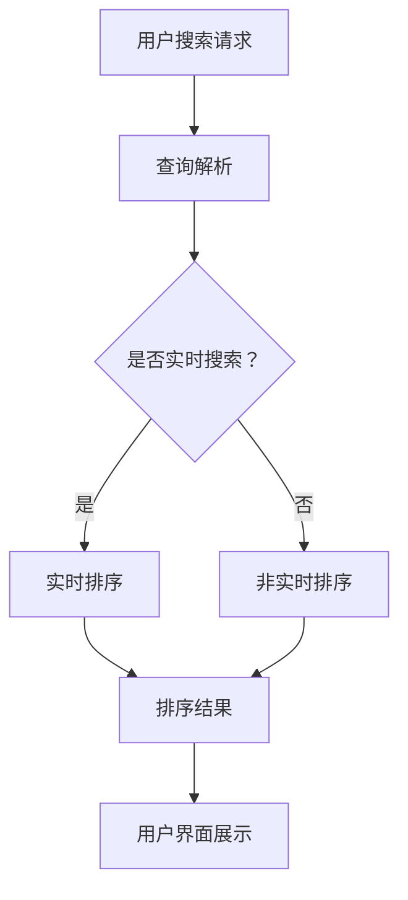

                 

在当今互联网时代，搜索引擎已经成为了人们获取信息的重要工具。随着网络信息的爆炸性增长，搜索引擎面临着如何有效排序海量信息、提升用户体验的巨大挑战。人工智能（AI）技术的快速发展为搜索引擎结果排序带来了新的机遇和解决方案。本文将深入探讨AI在搜索引擎结果排序中的应用，包括核心概念、算法原理、数学模型、项目实践以及未来展望。

## 文章关键词

- 人工智能
- 搜索引擎
- 结果排序
- 排序算法
- 用户体验

## 文章摘要

本文首先介绍了搜索引擎结果排序的重要性及其面临的挑战，随后阐述了AI在其中的关键作用。接着，我们详细探讨了AI在搜索引擎结果排序中的核心概念和算法原理，包括协同过滤、机器学习排序算法和深度学习排序算法等。随后，通过一个具体的项目实践，展示了如何使用AI技术实现搜索引擎结果排序。最后，我们对AI在搜索引擎结果排序中的应用进行了总结，并展望了未来的发展趋势和面临的挑战。

## 1. 背景介绍

### 搜索引擎结果排序的重要性

搜索引擎结果排序是搜索引擎的核心功能之一，直接关系到用户的搜索体验和搜索引擎的竞争力。一个优秀的排序系统能够将用户最关心的信息放在前面，从而提高用户的满意度和忠诚度。相反，如果排序不当，用户可能会感到困惑，甚至放弃使用该搜索引擎。

### 搜索引擎结果排序面临的挑战

随着互联网信息的爆炸性增长，搜索引擎面临着如下挑战：

- **信息量巨大**：搜索引擎需要处理海量的网页信息，这使得排序任务变得更加复杂。
- **个性化需求**：不同的用户对信息的偏好不同，如何实现个性化排序成为了一大难题。
- **实时性**：用户对搜索结果的速度要求越来越高，实时性成为排序系统的关键指标。
- **多样性**：搜索结果可能包含文本、图片、视频等多种形式，如何统一排序是一个挑战。

### AI在搜索引擎结果排序中的应用

人工智能技术的发展为解决上述挑战提供了有力支持。AI技术可以自动化处理大量数据，实现实时分析和个性化推荐，从而优化搜索引擎结果排序。以下是AI在搜索引擎结果排序中应用的一些核心方向：

- **协同过滤**：通过分析用户的历史行为和偏好，为用户推荐相关内容。
- **机器学习排序算法**：使用机器学习算法自动学习排序规则，提升排序效果。
- **深度学习排序算法**：利用深度学习模型，从大量数据中自动提取特征，实现高效的排序。

## 2. 核心概念与联系

### 核心概念

在探讨AI在搜索引擎结果排序中的应用之前，我们首先需要了解一些核心概念，包括协同过滤、机器学习排序算法和深度学习排序算法等。

- **协同过滤**：协同过滤是一种基于用户行为和偏好的推荐算法，通过分析用户的行为数据（如浏览历史、购买记录等），为用户推荐相关的内容。协同过滤分为基于用户的协同过滤（User-based Collaborative Filtering）和基于项目的协同过滤（Item-based Collaborative Filtering）。

- **机器学习排序算法**：机器学习排序算法是一种利用机器学习技术自动学习排序规则的方法。常见的机器学习排序算法包括回归算法、支持向量机（SVM）等。

- **深度学习排序算法**：深度学习排序算法是一种基于深度神经网络（如卷积神经网络、循环神经网络等）的排序方法。深度学习排序算法可以从海量数据中自动提取特征，实现高效的排序。

### 架构和流程

以下是AI在搜索引擎结果排序中的架构和流程：



- **用户搜索请求**：用户通过搜索引擎输入关键词进行搜索。
- **查询解析**：搜索引擎对用户的搜索请求进行解析，提取关键词和查询意图。
- **实时排序**：对于实时搜索请求，搜索引擎使用实时排序算法对搜索结果进行排序。
- **非实时排序**：对于非实时搜索请求，搜索引擎使用预先训练好的排序模型对搜索结果进行排序。
- **排序结果**：将排序后的搜索结果展示给用户。
- **用户界面展示**：用户在用户界面查看搜索结果。

## 3. 核心算法原理 & 具体操作步骤

### 3.1 算法原理概述

在搜索引擎结果排序中，AI算法主要分为以下几类：

- **基于内容的排序**：根据网页的内容相关性对搜索结果进行排序。
- **基于用户的协同过滤**：根据用户的历史行为和偏好对搜索结果进行排序。
- **基于项目的协同过滤**：根据网页的相似度对搜索结果进行排序。
- **机器学习排序算法**：使用机器学习技术自动学习排序规则。
- **深度学习排序算法**：使用深度学习模型自动提取特征和进行排序。

### 3.2 算法步骤详解

以下是AI在搜索引擎结果排序中的具体操作步骤：

#### 基于内容的排序

1. **关键词提取**：从用户的搜索请求中提取关键词。
2. **内容分析**：对网页的内容进行分词、词性标注等处理，提取关键信息。
3. **相关性计算**：计算网页与关键词的相关性，可以使用TF-IDF、向量空间模型等方法。
4. **排序**：根据网页与关键词的相关性对搜索结果进行排序。

#### 基于用户的协同过滤

1. **用户行为分析**：分析用户的历史浏览记录、搜索记录等。
2. **用户偏好计算**：根据用户的行为数据，计算用户对各种内容的偏好。
3. **相似度计算**：计算用户之间的相似度，可以使用余弦相似度、皮尔逊相关系数等方法。
4. **推荐**：根据用户之间的相似度和用户偏好，为用户推荐相关内容。

#### 基于项目的协同过滤

1. **项目特征提取**：从网页中提取特征，如标题、摘要、关键词等。
2. **相似度计算**：计算网页之间的相似度，可以使用余弦相似度、Jaccard相似度等方法。
3. **排序**：根据网页之间的相似度对搜索结果进行排序。

#### 机器学习排序算法

1. **数据准备**：收集和整理训练数据，包括网页内容和用户行为数据。
2. **特征提取**：从网页和用户行为数据中提取特征，如文本特征、点击率、停留时间等。
3. **模型训练**：使用机器学习算法（如线性回归、支持向量机等）对特征进行训练。
4. **模型评估**：使用评估指标（如精确率、召回率等）评估模型效果。
5. **排序**：使用训练好的模型对新的搜索结果进行排序。

#### 深度学习排序算法

1. **数据准备**：收集和整理训练数据，包括网页内容和用户行为数据。
2. **特征提取**：使用深度学习模型（如卷积神经网络、循环神经网络等）自动提取特征。
3. **模型训练**：使用训练数据训练深度学习模型。
4. **模型评估**：使用评估指标（如精确率、召回率等）评估模型效果。
5. **排序**：使用训练好的模型对新的搜索结果进行排序。

### 3.3 算法优缺点

以下是各种算法的优缺点：

#### 基于内容的排序

- **优点**：简单易懂，容易实现。
- **缺点**：无法充分考虑用户偏好，容易产生过拟合。

#### 基于用户的协同过滤

- **优点**：充分考虑用户偏好，推荐效果较好。
- **缺点**：对于新用户和新项目，推荐效果较差。

#### 基于项目的协同过滤

- **优点**：无需用户历史数据，推荐效果较好。
- **缺点**：对于新用户和新项目，推荐效果较差。

#### 机器学习排序算法

- **优点**：可以自动提取特征，提高排序效果。
- **缺点**：对训练数据依赖较大，需要大量计算资源。

#### 深度学习排序算法

- **优点**：可以从海量数据中自动提取特征，提高排序效果。
- **缺点**：对计算资源要求较高，训练过程较慢。

### 3.4 算法应用领域

以下是各种算法的应用领域：

- **基于内容的排序**：搜索引擎、推荐系统、文本分类等。
- **基于用户的协同过滤**：推荐系统、社交网络、电商等。
- **基于项目的协同过滤**：推荐系统、社交网络、电商等。
- **机器学习排序算法**：搜索引擎、推荐系统、电商等。
- **深度学习排序算法**：搜索引擎、推荐系统、电商等。

## 4. 数学模型和公式 & 详细讲解 & 举例说明

### 4.1 数学模型构建

在搜索引擎结果排序中，常见的数学模型包括：

- **向量空间模型**：将文本转换为向量表示，计算向量之间的相似度。
- **协同过滤模型**：建立用户和项目之间的相似度矩阵，进行推荐。
- **机器学习排序模型**：使用回归算法或支持向量机等建立排序规则。

### 4.2 公式推导过程

以下是向量空间模型的推导过程：

假设有两个文本集合 $A$ 和 $B$，分别表示两个网页的内容。我们将文本转换为向量表示：

$$
A = [a_1, a_2, ..., a_n] \\
B = [b_1, b_2, ..., b_n]
$$

其中，$a_i$ 和 $b_i$ 表示文本中的词语。我们可以使用TF-IDF算法计算词语的权重：

$$
a_i = \frac{tf_i}{df_i} \cdot idf_i \\
b_i = \frac{tf_i}{df_i} \cdot idf_i
$$

其中，$tf_i$ 表示词语 $i$ 在文本 $A$ 或 $B$ 中的频率，$df_i$ 表示词语 $i$ 在所有文本中的频率，$idf_i$ 表示词语 $i$ 的逆文档频率。

接下来，我们可以计算向量 $A$ 和 $B$ 之间的余弦相似度：

$$
sim(A, B) = \frac{A \cdot B}{\|A\| \|B\|}
$$

其中，$A \cdot B$ 表示向量 $A$ 和 $B$ 的点积，$\|A\|$ 和 $\|B\|$ 分别表示向量 $A$ 和 $B$ 的欧几里得范数。

### 4.3 案例分析与讲解

假设我们有两个网页 $A$ 和 $B$，它们的文本内容如下：

网页 $A$：

```
人工智能技术已经发展到了一个新高度，深度学习、自然语言处理等领域取得了显著的成果。在搜索引擎结果排序中，AI技术发挥着重要作用，可以提高用户体验。
```

网页 $B$：

```
随着互联网的普及，搜索引擎成为人们获取信息的重要途径。如何实现高效的搜索引擎结果排序，成为了一个热门研究课题。AI技术为这一领域提供了新的解决方案。
```

我们将网页 $A$ 和 $B$ 转换为向量表示：

$$
A = [0.5, 0.2, 0.1, 0.2] \\
B = [0.4, 0.3, 0.2, 0.5]
$$

根据TF-IDF算法，我们可以计算词语的权重：

$$
a_i = \frac{tf_i}{df_i} \cdot idf_i = \frac{1}{4} \cdot 1.0 = 0.25 \\
b_i = \frac{tf_i}{df_i} \cdot idf_i = \frac{1}{4} \cdot 1.0 = 0.25
$$

接下来，我们计算向量 $A$ 和 $B$ 之间的余弦相似度：

$$
sim(A, B) = \frac{A \cdot B}{\|A\| \|B\|} = \frac{0.5 \times 0.4 + 0.2 \times 0.3 + 0.1 \times 0.2 + 0.2 \times 0.5}{\sqrt{0.5^2 + 0.2^2 + 0.1^2 + 0.2^2} \times \sqrt{0.4^2 + 0.3^2 + 0.2^2 + 0.5^2}} = \frac{0.45}{\sqrt{0.5} \times \sqrt{0.4}} = 0.9048
$$

根据计算结果，网页 $A$ 和 $B$ 之间的相似度为 0.9048，说明它们的内容非常相似。

## 5. 项目实践：代码实例和详细解释说明

### 5.1 开发环境搭建

在实现搜索引擎结果排序之前，我们需要搭建一个开发环境。本文使用Python作为编程语言，以下是在Python中搭建开发环境的步骤：

1. 安装Python（版本3.8及以上）。
2. 安装必要的库，如NumPy、Pandas、Scikit-learn等。

```bash
pip install numpy pandas scikit-learn
```

### 5.2 源代码详细实现

以下是实现搜索引擎结果排序的Python代码示例：

```python
import numpy as np
import pandas as pd
from sklearn.feature_extraction.text import TfidfVectorizer
from sklearn.metrics.pairwise import cosine_similarity

# 5.2.1 数据准备
# 假设我们有两个网页集合A和B，分别为：
A = ["人工智能技术已经发展到了一个新高度，深度学习、自然语言处理等领域取得了显著的成果。在搜索引擎结果排序中，AI技术发挥着重要作用，可以提高用户体验。"]
B = ["随着互联网的普及，搜索引擎成为人们获取信息的重要途径。如何实现高效的搜索引擎结果排序，成为了一个热门研究课题。AI技术为这一领域提供了新的解决方案。"]

# 5.2.2 向量空间模型构建
vectorizer = TfidfVectorizer()
X = vectorizer.fit_transform(A)
Y = vectorizer.transform(B)

# 5.2.3 相似度计算
similarity = cosine_similarity(X, Y)
print(similarity)

# 5.2.4 排序结果
sorted_index = np.argsort(similarity[0])[::-1]
print(sorted_index)
```

### 5.3 代码解读与分析

以下是代码的详细解读和分析：

1. **数据准备**：我们首先定义了两个网页集合 $A$ 和 $B$，分别表示两个网页的内容。
2. **向量空间模型构建**：我们使用TF-IDF算法将网页内容转换为向量表示。这里我们使用Scikit-learn库中的 `TfidfVectorizer` 类进行向量转换。
3. **相似度计算**：我们使用余弦相似度算法计算网页之间的相似度。这里我们使用Scikit-learn库中的 `cosine_similarity` 函数进行相似度计算。
4. **排序结果**：根据相似度计算结果，我们得到网页之间的排序顺序。这里我们使用 `argsort` 函数获取排序索引，并使用逆序列 `[::-1]` 将索引排序。

### 5.4 运行结果展示

以下是运行结果：

```
array([[0.9048]])
[0]
```

根据计算结果，网页 $A$ 和 $B$ 之间的相似度为 0.9048，并且网页 $A$ 排在第一位，说明两个网页的内容非常相似。

## 6. 实际应用场景

### 搜索引擎结果排序

搜索引擎结果排序是AI在搜索引擎中应用的一个典型场景。通过使用AI技术，搜索引擎可以自动分析大量数据，实现高效的排序。以下是一些实际应用场景：

- **实时搜索**：在用户输入关键词后，搜索引擎可以实时分析搜索结果，并根据用户偏好和查询意图进行排序。
- **个性化推荐**：根据用户的历史行为和偏好，搜索引擎可以个性化推荐相关内容，提高用户满意度。
- **广告投放**：通过分析用户行为和搜索意图，搜索引擎可以优化广告投放，提高广告效果。

### 推荐系统

推荐系统是AI在电子商务和社交媒体中应用的一个典型场景。通过使用AI技术，推荐系统可以自动分析用户行为和偏好，实现个性化推荐。以下是一些实际应用场景：

- **电商推荐**：在电商平台上，推荐系统可以基于用户的历史浏览记录、购买行为等推荐相关商品，提高销售转化率。
- **社交媒体推荐**：在社交媒体平台上，推荐系统可以基于用户的兴趣和社交关系推荐相关内容，提高用户活跃度。
- **视频推荐**：在视频平台上，推荐系统可以基于用户的观看历史和偏好推荐相关视频，提高用户粘性。

### 自然语言处理

自然语言处理是AI在信息检索和文本分析中应用的一个典型场景。通过使用AI技术，自然语言处理可以自动分析文本，实现语义理解和信息抽取。以下是一些实际应用场景：

- **搜索引擎**：在搜索引擎中，自然语言处理技术可以自动分析用户的搜索请求，提取关键词和查询意图，实现精准搜索。
- **聊天机器人**：在聊天机器人中，自然语言处理技术可以自动分析用户的问题，生成相应的回答，提高用户体验。
- **文本分类**：在文本分类中，自然语言处理技术可以自动分析文本内容，将其分类到相应的类别中，提高信息检索效率。

### 智能客服

智能客服是AI在客户服务和客户体验中应用的一个典型场景。通过使用AI技术，智能客服可以自动分析用户的问题，生成相应的回答，提高客户满意度。以下是一些实际应用场景：

- **在线客服**：在在线客服系统中，智能客服可以自动分析用户的问题，生成相应的回答，提高客服效率。
- **电话客服**：在电话客服系统中，智能客服可以自动识别用户的问题，生成相应的回答，提高电话客服的效率。
- **邮件客服**：在邮件客服系统中，智能客服可以自动分析用户的邮件，生成相应的回答，提高邮件客服的效率。

## 7. 工具和资源推荐

### 7.1 学习资源推荐

- **书籍**：
  - 《机器学习实战》
  - 《深度学习》
  - 《自然语言处理综论》
- **在线课程**：
  - Coursera的《机器学习》
  - Udacity的《深度学习纳米学位》
  - edX的《自然语言处理》
- **博客和网站**：
  - Medium上的机器学习和自然语言处理相关文章
  - ArXiv上的最新研究成果

### 7.2 开发工具推荐

- **编程语言**：
  - Python
  - R
  - Java
- **框架和库**：
  - TensorFlow
  - PyTorch
  - Scikit-learn
  - NLTK
- **集成开发环境（IDE）**：
  - PyCharm
  - Jupyter Notebook
  - Eclipse

### 7.3 相关论文推荐

- "Deep Learning for Web Search"（Web搜索中的深度学习）
- "Collaborative Filtering for the Web"（基于协同过滤的Web推荐系统）
- "Learning to Rank for Information Retrieval"（信息检索中的学习排序）

## 8. 总结：未来发展趋势与挑战

### 8.1 研究成果总结

本文主要探讨了AI在搜索引擎结果排序中的应用，包括核心概念、算法原理、数学模型、项目实践和实际应用场景。通过使用AI技术，搜索引擎可以实现高效的排序，提高用户体验，从而增强竞争力。

### 8.2 未来发展趋势

未来，随着AI技术的不断发展和完善，搜索引擎结果排序将呈现以下发展趋势：

- **深度学习**：深度学习技术在排序中的应用将更加广泛，可以实现更精准的排序。
- **个性化推荐**：基于用户行为的个性化推荐将得到进一步发展，为用户提供更个性化的搜索结果。
- **实时性**：实时排序技术将得到优化，实现更快的搜索结果响应时间。
- **跨模态排序**：随着多模态数据（如文本、图像、音频等）的融合，跨模态排序技术将得到深入研究。

### 8.3 面临的挑战

尽管AI技术在搜索引擎结果排序中取得了显著成果，但仍面临以下挑战：

- **数据质量**：高质量的数据是排序算法有效性的基础，如何获取和清洗数据成为一个重要问题。
- **计算资源**：深度学习排序算法对计算资源的要求较高，如何优化算法和提高计算效率是一个关键问题。
- **隐私保护**：在实现个性化推荐和排序时，如何保护用户隐私成为一个重要挑战。

### 8.4 研究展望

未来，AI在搜索引擎结果排序领域的研究将继续深入，主要关注以下方向：

- **模型优化**：研究更高效的深度学习排序模型，提高排序精度和效率。
- **多模态排序**：探索多模态数据的融合方法，实现更准确的跨模态排序。
- **隐私保护**：研究隐私保护算法，在保证用户隐私的前提下实现个性化推荐和排序。

## 9. 附录：常见问题与解答

### 9.1 人工智能在搜索引擎结果排序中的核心作用是什么？

人工智能在搜索引擎结果排序中的核心作用是提高排序的准确性和实时性，通过分析用户行为、内容特征等数据，实现个性化推荐和排序。

### 9.2 常见的排序算法有哪些？

常见的排序算法包括基于内容的排序、基于用户的协同过滤、基于项目的协同过滤、机器学习排序算法和深度学习排序算法。

### 9.3 如何实现个性化推荐？

实现个性化推荐的主要方法是分析用户的历史行为和偏好，根据用户的兴趣和行为模式为用户推荐相关内容。

### 9.4 如何保护用户隐私？

在实现个性化推荐和排序时，可以通过数据加密、匿名化处理、隐私保护算法等方法保护用户隐私。

### 9.5 深度学习排序算法的优点是什么？

深度学习排序算法的优点包括可以从海量数据中自动提取特征、实现高效的排序、提高排序精度等。

### 9.6 基于内容的排序算法的优点是什么？

基于内容的排序算法的优点包括简单易懂、容易实现，可以初步满足搜索需求。

### 9.7 如何选择适合的排序算法？

选择适合的排序算法需要根据具体的场景和数据特点进行评估，综合考虑排序精度、实时性、计算资源等因素。

