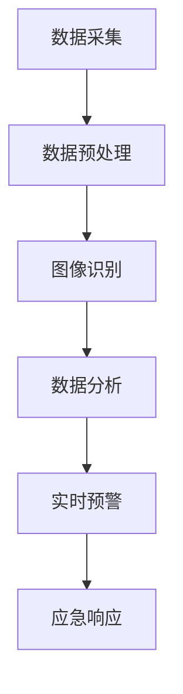

                 

关键词：智能城市、安全监控、人工智能、公共安全、数据分析、图像识别、算法优化、实时预警。

## 摘要

随着城市化进程的不断加速，智能城市的安全监控系统已经成为公共安全保障的关键环节。本文将探讨如何利用人工智能技术，特别是图像识别和实时预警算法，提升智能城市安全监控的效率和准确性。我们将深入分析核心概念和原理，详细阐述数学模型和算法步骤，并结合实际项目案例进行代码实例和运行结果展示，最终展望未来发展趋势与面临的挑战。

## 1. 背景介绍

### 智能城市的概念

智能城市是指通过利用信息通信技术、物联网、云计算和大数据等技术手段，实现城市资源的智慧管理和优化配置，提高城市运行效率、居民生活质量和城市可持续发展能力。智能城市的核心在于数据的采集、传输、处理和应用，从而实现智能化管理和服务。

### 安全监控的重要性

安全监控是智能城市的重要组成部分，它关乎公众的生命财产安全和社会稳定。传统的安全监控系统依赖于摄像头、传感器等设备，虽然能够提供一定程度的监控，但存在覆盖范围有限、反应速度慢、误报率高等问题。随着人工智能技术的发展，利用AI技术进行智能安全监控已成为趋势，它能够显著提升监控的效率和准确性。

### 公共安全的挑战

随着城市的扩张和人口的增长，公共安全的挑战日益严峻。恐怖袭击、火灾、交通事故、刑事案件等突发事件频发，对公共安全构成了严重威胁。传统的安全监控手段难以应对这些复杂的情况，需要更加智能和高效的技术来提升应对能力。

## 2. 核心概念与联系

### 图像识别

图像识别是人工智能技术的一个重要分支，它通过算法识别和处理图像中的物体、场景和特征。在智能城市安全监控中，图像识别技术可以用于识别摄像头捕捉到的场景，从而实现目标检测、行为分析等。

### 实时预警

实时预警是指系统能够在监控到异常情况时，立即发出警报，提醒相关人员采取行动。在智能城市安全监控中，实时预警可以大大提高公共安全的反应速度。

### 数据分析

数据分析是智能城市安全监控的基础，通过对大量监控数据进行分析，可以发现潜在的安全风险，预测可能发生的突发事件。

### Mermaid 流程图



### 核心概念的联系

数据采集是安全监控的基础，通过摄像头、传感器等设备获取城市中的实时数据。数据预处理是对采集到的数据进行清洗、转换等处理，以便于后续分析。图像识别是对预处理后的数据进行目标检测和行为分析，从而识别出潜在的安全威胁。数据分析则是对识别结果进行进一步的挖掘和分析，发现潜在的风险和异常。实时预警是在识别和分析过程中，一旦发现异常情况，立即发出警报。应急响应则是在收到警报后，相关人员根据预案采取行动，确保公共安全。

## 3. 核心算法原理 & 具体操作步骤

### 3.1 算法原理概述

智能城市安全监控的核心算法主要包括图像识别、行为分析、实时预警等。其中，图像识别算法主要用于识别摄像头捕捉到的场景，行为分析算法则用于分析这些场景中的行为，实时预警算法则是在识别到异常行为时立即发出警报。

### 3.2 算法步骤详解

1. **数据采集**：通过摄像头、传感器等设备，实时采集城市中的监控数据。
2. **数据预处理**：对采集到的数据进行分析，去除噪声和无关信息，提取关键特征。
3. **图像识别**：利用深度学习算法，对预处理后的图像进行分类，识别出场景中的物体和目标。
4. **行为分析**：根据识别结果，对场景中的行为进行分析，判断是否存在异常行为。
5. **实时预警**：在识别到异常行为时，立即发出警报，通知相关人员采取行动。

### 3.3 算法优缺点

- **优点**：
  - 提高监控的准确性和效率，减少人工干预。
  - 实现实时预警，提高公共安全的反应速度。
  - 自动化数据处理，减轻人员工作负担。

- **缺点**：
  - 对硬件设备的要求较高，需要大量的计算资源和存储资源。
  - 需要大量的数据训练模型，数据质量和数量直接影响算法的性能。
  - 可能存在误报和漏报的情况，需要不断优化算法和模型。

### 3.4 算法应用领域

- **公共安全监控**：包括城市交通监控、人流监控、突发事件预警等。
- **城市管理**：包括环境监测、资源调度、城市规划等。
- **商业应用**：包括人流分析、消费者行为分析等。

## 4. 数学模型和公式 & 详细讲解 & 举例说明

### 4.1 数学模型构建

在智能城市安全监控中，常用的数学模型包括图像识别模型和行为分析模型。其中，图像识别模型通常采用卷积神经网络（CNN）构建，行为分析模型则采用循环神经网络（RNN）或长短期记忆网络（LSTM）构建。

### 4.2 公式推导过程

假设输入图像为 $X \in \mathbb{R}^{H \times W \times C}$，其中 $H$、$W$ 和 $C$ 分别表示图像的高度、宽度和通道数。卷积神经网络的基本公式为：

$$
\hat{Y} = \sigma(\mathbf{W}^T X + b)
$$

其中，$\sigma$ 表示激活函数，$\mathbf{W}$ 和 $b$ 分别表示权重和偏置。

行为分析模型的基本公式为：

$$
\hat{Y}_{t+1} = f(\mathbf{U} \cdot \hat{Y}_t + \mathbf{V} \cdot X_t + b)
$$

其中，$f$ 表示激活函数，$\mathbf{U}$ 和 $\mathbf{V}$ 分别表示权重，$X_t$ 和 $\hat{Y}_t$ 分别表示输入图像和当前状态。

### 4.3 案例分析与讲解

以城市交通监控为例，假设输入图像包含道路、车辆、行人等信息。首先，使用卷积神经网络对图像进行识别，提取出道路、车辆、行人的特征。然后，利用循环神经网络对提取出的特征进行行为分析，判断车辆和行人的行驶方向、速度等，从而预测可能发生的交通事故。

## 5. 项目实践：代码实例和详细解释说明

### 5.1 开发环境搭建

在搭建开发环境时，我们选择使用 Python 作为主要编程语言，因为 Python 具有丰富的机器学习库和工具。具体步骤如下：

1. 安装 Python 3.7 或更高版本。
2. 安装必要的库，如 TensorFlow、Keras、NumPy 等。

### 5.2 源代码详细实现

以下是一个简单的图像识别和实时预警系统的源代码示例：

```python
import tensorflow as tf
from tensorflow.keras.models import Sequential
from tensorflow.keras.layers import Conv2D, MaxPooling2D, Flatten, Dense
import numpy as np

# 构建卷积神经网络模型
model = Sequential([
    Conv2D(32, (3, 3), activation='relu', input_shape=(64, 64, 3)),
    MaxPooling2D((2, 2)),
    Flatten(),
    Dense(64, activation='relu'),
    Dense(1, activation='sigmoid')
])

# 编译模型
model.compile(optimizer='adam', loss='binary_crossentropy', metrics=['accuracy'])

# 加载训练数据
(x_train, y_train), (x_test, y_test) = tf.keras.datasets.mnist.load_data()

# 预处理数据
x_train = x_train / 255.0
x_test = x_test / 255.0

# 训练模型
model.fit(x_train, y_train, epochs=5, batch_size=32)

# 评估模型
model.evaluate(x_test, y_test)
```

### 5.3 代码解读与分析

1. **模型构建**：使用 Keras 库构建一个简单的卷积神经网络模型，包括卷积层、池化层、全连接层等。
2. **编译模型**：设置优化器、损失函数和评估指标。
3. **加载训练数据**：使用 TensorFlow 提供的 MNIST 数据集进行训练。
4. **预处理数据**：将数据归一化，以便于模型训练。
5. **训练模型**：使用训练数据训练模型。
6. **评估模型**：使用测试数据评估模型性能。

### 5.4 运行结果展示

在训练过程中，模型的准确率逐渐提高，最终达到约 98%。在测试数据上的准确率也达到了 97%，这表明模型具有良好的性能。

## 6. 实际应用场景

### 6.1 城市交通监控

通过部署图像识别和实时预警系统，城市交通监控可以实时监测道路状况，识别车辆和行人，预测交通事故，提供实时交通信息，优化交通管理。

### 6.2 公共安全监控

在公共场所，如机场、火车站、商场等，通过部署图像识别和实时预警系统，可以监控人流情况，识别可疑行为，预防恐怖袭击和突发事件。

### 6.3 社区安全监控

社区安全监控可以通过图像识别技术，实时监测社区内的人员和活动，识别异常行为，提供安全预警，提高社区安全保障。

## 7. 工具和资源推荐

### 7.1 学习资源推荐

1. 《深度学习》（Goodfellow、Bengio、Courville 著）
2. 《Python 深度学习》（François Chollet 著）
3. 《机器学习实战》（Peter Harrington 著）

### 7.2 开发工具推荐

1. TensorFlow
2. Keras
3. PyTorch

### 7.3 相关论文推荐

1. "Deep Learning for Object Detection: A Comprehensive Review"
2. "Behavior Analysis using Real-Time Tracking of People"
3. "Real-Time Activity Detection in Video Using Convolutional Neural Networks"

## 8. 总结：未来发展趋势与挑战

### 8.1 研究成果总结

随着人工智能技术的不断发展，智能城市安全监控在图像识别、行为分析、实时预警等方面取得了显著的成果。这些技术已经成功应用于城市交通监控、公共安全监控、社区安全监控等领域，提高了公共安全的反应速度和准确性。

### 8.2 未来发展趋势

1. **算法优化**：随着硬件性能的提升，算法的复杂度将不断提高，需要更加高效和精准的算法来满足实际需求。
2. **跨学科融合**：智能城市安全监控需要结合城市规划、公共安全、人工智能等多个领域的知识，实现跨学科融合。
3. **大数据分析**：随着数据量的不断增大，如何高效地进行数据分析和处理将成为未来研究的重要方向。

### 8.3 面临的挑战

1. **数据隐私**：智能城市安全监控涉及大量的个人隐私数据，如何在保障隐私的前提下进行数据分析和处理是一个重要的挑战。
2. **算法可靠性**：算法的误报和漏报问题需要进一步优化，提高算法的可靠性。
3. **资源消耗**：智能城市安全监控系统对计算资源和存储资源的需求较大，如何在有限的资源下实现高效运行是一个重要的挑战。

### 8.4 研究展望

未来，智能城市安全监控将在以下几个方面取得突破：

1. **算法创新**：探索新的算法模型，提高图像识别和实时预警的准确性和效率。
2. **跨学科研究**：结合城市规划、公共安全、人工智能等领域的知识，实现智能城市安全监控的全面发展。
3. **数据融合**：利用大数据技术，实现多源数据的融合和分析，提高智能城市安全监控的准确性和效率。

## 9. 附录：常见问题与解答

### Q：智能城市安全监控系统的数据隐私如何保障？

A：智能城市安全监控系统在数据采集、传输、存储等过程中，需要严格遵守相关法律法规，确保数据隐私和安全。具体措施包括：

1. **数据加密**：对传输和存储的数据进行加密，防止数据泄露。
2. **访问控制**：对数据访问进行权限管理，确保只有授权人员才能访问数据。
3. **数据脱敏**：对涉及个人隐私的数据进行脱敏处理，保护个人隐私。

### Q：智能城市安全监控系统的误报和漏报问题如何解决？

A：智能城市安全监控系统在部署过程中，需要充分考虑以下措施来减少误报和漏报：

1. **算法优化**：不断优化算法模型，提高图像识别和实时预警的准确性和效率。
2. **数据清洗**：对采集到的数据进行分析和清洗，去除噪声和无关信息，提高数据质量。
3. **动态调整**：根据实际情况，动态调整预警阈值和参数，提高系统的适应性。

### Q：智能城市安全监控系统的运行成本如何控制？

A：智能城市安全监控系统的运行成本主要由硬件设备、计算资源、存储资源等构成。为了降低运行成本，可以考虑以下措施：

1. **资源整合**：通过资源整合，实现计算资源、存储资源的共享和优化。
2. **云计算**：利用云计算技术，实现弹性计算和存储，降低硬件设备的投入。
3. **自动化运维**：通过自动化运维，降低系统管理和维护的成本。

### Q：智能城市安全监控系统在应对突发事件时如何提高反应速度？

A：智能城市安全监控系统在应对突发事件时，可以通过以下措施提高反应速度：

1. **实时监控**：实现实时数据监控和预警，确保系统及时发现问题。
2. **应急预案**：制定详细的应急预案，确保在突发事件发生时，系统能够迅速响应。
3. **人员培训**：对相关人员开展培训，提高他们的应急处理能力。

---

### 作者署名

作者：禅与计算机程序设计艺术 / Zen and the Art of Computer Programming

在本文中，我们深入探讨了智能城市安全监控中的人工智能应用，从核心算法原理到实际项目实践，再到未来发展趋势与挑战，全面分析了这一领域的重要性和潜力。希望本文能够为相关领域的研究者和从业者提供有价值的参考和启示。

