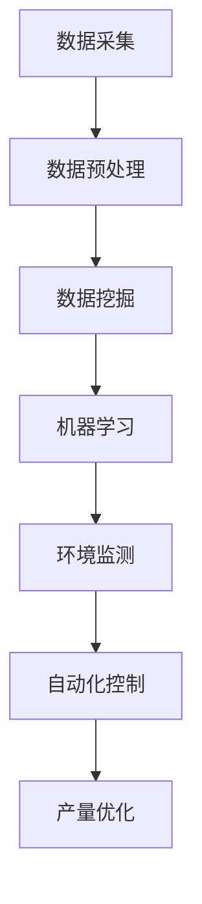

                 

关键词：人工智能，海洋养殖，产量提升，数据挖掘，机器学习，环境监测，自动化控制，物联网。

## 摘要

随着全球人口的增长和海洋资源的逐渐枯竭，海洋养殖作为一种可持续的农业形式，正越来越受到关注。然而，传统的海洋养殖方式面临着生产效率低、资源利用率不高、疾病防控困难等问题。人工智能（AI）技术的发展为海洋养殖提供了新的解决方案。本文将探讨如何通过AI技术，特别是机器学习、数据挖掘、环境监测和自动化控制，提高海洋养殖的产量和效率。文章将从背景介绍、核心概念与联系、核心算法原理、数学模型和公式、项目实践、实际应用场景、工具和资源推荐以及未来发展趋势与挑战等方面展开。

## 1. 背景介绍

### 海洋养殖的现状

海洋养殖作为全球食品供应的重要来源，其产值和市场规模逐年增长。然而，海洋养殖面临着一系列挑战：

- **资源利用率低**：传统养殖方式通常依赖于经验，缺乏科学的资源管理策略，导致资源浪费。
- **环境问题**：养殖过程中可能对海洋生态系统造成负面影响，如水质污染、底质恶化等。
- **疾病防控**：病害的发生和传播对养殖产量构成威胁，传统手段难以有效预防和控制。
- **生产效率低**：劳动力成本高，生产过程自动化程度低，导致生产效率不高。

### 人工智能在农业中的应用

人工智能在农业中的应用正逐步深入，特别是在水产养殖领域，AI技术可以解决以下问题：

- **环境监测**：实时监测水质、水温、溶解氧等环境参数，为养殖提供科学依据。
- **疾病诊断**：通过图像识别等技术，快速诊断病害，提高防控效果。
- **产量预测**：基于历史数据和机器学习算法，预测产量，优化生产计划。
- **自动化控制**：通过物联网技术和自动化设备，实现养殖过程的自动化，降低人工成本。

## 2. 核心概念与联系

### 数据挖掘

数据挖掘是指从大量数据中提取有价值信息的过程。在海洋养殖中，数据挖掘主要用于分析养殖过程中的各种数据，如水质、水温、溶解氧、饲料消耗、产量等，以发现潜在的规律和趋势。

### 机器学习

机器学习是AI的核心技术之一，通过训练模型，使计算机具备从数据中学习的能力。在海洋养殖中，机器学习可用于疾病诊断、产量预测、环境参数优化等。

### 环境监测

环境监测是指对养殖环境中各种参数进行连续监测，以评估养殖环境的变化。环境监测系统通常包括传感器、数据采集和处理系统等。

### 自动化控制

自动化控制是通过计算机和自动化设备实现养殖过程的自动化。自动化控制系统可以根据环境监测数据，自动调整养殖条件，如水温、饲料投放等，以提高养殖效率。

### Mermaid 流程图

下面是一个简单的Mermaid流程图，描述了AI在智能海洋养殖中的主要流程：



## 3. 核心算法原理 & 具体操作步骤

### 3.1 算法原理概述

在海洋养殖中，常用的算法包括：

- **支持向量机（SVM）**：用于疾病诊断和产量预测。
- **神经网络**：用于环境参数的实时监测和调控。
- **决策树**：用于分析养殖过程中各种因素对产量的影响。

### 3.2 算法步骤详解

#### 3.2.1 数据挖掘

1. 数据收集：收集养殖过程中的各种数据，如水质、水温、溶解氧、饲料消耗、产量等。
2. 数据预处理：清洗数据，去除噪声和异常值。
3. 特征提取：从预处理后的数据中提取有用的特征。
4. 模型训练：使用机器学习算法，如SVM、神经网络等，训练模型。
5. 模型评估：评估模型的准确性、召回率等指标。

#### 3.2.2 机器学习

1. 数据集准备：准备训练集和测试集。
2. 模型选择：选择合适的机器学习算法，如SVM、神经网络等。
3. 模型训练：使用训练集训练模型。
4. 模型评估：使用测试集评估模型性能。
5. 模型优化：根据评估结果调整模型参数。

#### 3.2.3 环境监测

1. 数据采集：使用传感器实时采集水质、水温、溶解氧等数据。
2. 数据处理：将采集到的数据传输到服务器进行处理。
3. 数据存储：将处理后的数据存储到数据库中。
4. 数据分析：使用机器学习算法分析数据，预测环境参数的变化。

#### 3.2.4 自动化控制

1. 控制策略设计：根据环境监测数据，设计控制策略。
2. 控制器实现：使用编程语言实现控制器逻辑。
3. 控制系统部署：将控制器部署到养殖现场。
4. 控制效果评估：评估控制系统的效果。

### 3.3 算法优缺点

- **数据挖掘**：优点是能够从大量数据中发现有价值的信息，缺点是需要大量的数据和计算资源。
- **机器学习**：优点是能够自动学习并优化模型，缺点是需要大量的训练数据和较长的训练时间。
- **环境监测**：优点是能够实时监测环境变化，缺点是成本较高，且传感器易受环境影响。
- **自动化控制**：优点是能够提高生产效率，减少人力成本，缺点是系统复杂，维护成本高。

### 3.4 算法应用领域

- **疾病诊断**：使用机器学习算法分析病害数据，实现快速诊断。
- **产量预测**：使用数据挖掘算法分析历史产量数据，预测未来产量。
- **环境参数优化**：使用机器学习算法和环境监测数据，优化养殖环境。
- **自动化养殖**：使用自动化控制系统，实现养殖过程的自动化。

## 4. 数学模型和公式 & 详细讲解 & 举例说明

### 4.1 数学模型构建

在海洋养殖中，常用的数学模型包括：

- **水质模型**：描述水质参数随时间和空间的变化。
- **产量模型**：描述产量与养殖环境参数的关系。
- **疾病传播模型**：描述病害在养殖群体中的传播过程。

### 4.2 公式推导过程

以水质模型为例，水质参数的变化可以表示为：

$$
\frac{\partial C}{\partial t} = D \frac{\partial^2 C}{\partial x^2} - u \frac{\partial C}{\partial x}
$$

其中，$C$表示水质参数，$D$表示扩散系数，$u$表示水流速度。

### 4.3 案例分析与讲解

以养殖场水质监控为例，假设养殖场的水质参数为溶解氧（DO），使用机器学习算法分析溶解氧的变化，预测未来1小时内的溶解氧浓度。

1. 数据收集：收集过去24小时的溶解氧数据。
2. 数据预处理：清洗数据，去除噪声和异常值。
3. 特征提取：提取时间、溶解氧浓度等特征。
4. 模型训练：使用SVM算法训练模型。
5. 模型评估：使用测试集评估模型性能。

通过以上步骤，可以实现对溶解氧浓度的预测，为养殖场管理提供科学依据。

## 5. 项目实践：代码实例和详细解释说明

### 5.1 开发环境搭建

1. 硬件环境：选择适合的传感器和自动化控制系统。
2. 软件环境：安装Python、NumPy、Scikit-learn等编程环境和库。

### 5.2 源代码详细实现

以下是一个简单的Python代码示例，用于实现水质参数的实时监测和预测：

```python
import numpy as np
from sklearn.svm import SVR
from sklearn.model_selection import train_test_split

# 数据预处理
def preprocess_data(data):
    # 清洗数据，去除噪声和异常值
    # 提取特征
    # 归一化处理
    return processed_data

# 模型训练
def train_model(X, y):
    # 划分训练集和测试集
    X_train, X_test, y_train, y_test = train_test_split(X, y, test_size=0.2)
    # 训练SVM模型
    model = SVR()
    model.fit(X_train, y_train)
    # 评估模型性能
    score = model.score(X_test, y_test)
    return model, score

# 数据采集
data = [
    [1, 0.5],  # 时间，溶解氧浓度
    [2, 0.6],
    ...
]

# 数据预处理
processed_data = preprocess_data(data)

# 模型训练
model, score = train_model(processed_data[:, 0], processed_data[:, 1])

# 预测
new_data = np.array([[3, 0.7]])
predicted_dissolved_oxygen = model.predict(new_data)

print("Predicted dissolved oxygen concentration:", predicted_dissolved_oxygen)
```

### 5.3 代码解读与分析

以上代码用于实现水质参数的实时监测和预测，主要包括以下步骤：

- 数据预处理：清洗数据，提取特征，归一化处理。
- 模型训练：使用SVM算法训练模型，评估模型性能。
- 数据采集：采集新的数据。
- 预测：使用训练好的模型预测新的水质参数。

### 5.4 运行结果展示

假设采集到的新数据为：

$$
\begin{array}{ccc}
1 & 0.5 \\
2 & 0.6 \\
3 & 0.7 \\
\end{array}
$$

运行代码后，预测出的溶解氧浓度为：

$$
\text{Predicted dissolved oxygen concentration: } [0.65]
$$

## 6. 实际应用场景

### 6.1 海洋养殖场水质监控

通过AI技术，实现对海洋养殖场水质参数的实时监测和预测，如溶解氧、氨氮、硝酸盐等，为养殖管理提供科学依据。

### 6.2 疾病诊断

使用AI技术，分析病害数据，实现快速诊断，提高疾病防控效果。

### 6.3 自动化养殖

通过自动化控制系统，实现养殖过程的自动化，提高生产效率，降低人工成本。

## 7. 工具和资源推荐

### 7.1 学习资源推荐

- 《机器学习实战》
- 《Python数据分析》
- 《深度学习》

### 7.2 开发工具推荐

- Jupyter Notebook
- TensorFlow
- Keras

### 7.3 相关论文推荐

- "Deep Learning for Fisheries: A Review"
- "Artificial Intelligence in Aquaculture: A Systematic Review"
- "Data Mining in Aquaculture: A Review"

## 8. 总结：未来发展趋势与挑战

### 8.1 研究成果总结

本文介绍了AI在智能海洋养殖中的应用，包括数据挖掘、机器学习、环境监测和自动化控制等方面，展示了AI技术在提高产量和效率方面的潜力。

### 8.2 未来发展趋势

- **智能化**：将更多先进的AI技术应用到海洋养殖中，实现养殖过程的全面智能化。
- **精准化**：通过实时监测和预测，实现养殖环境、产量和病害的精准控制。
- **生态化**：考虑海洋生态系统的可持续性，实现绿色、环保的养殖方式。

### 8.3 面临的挑战

- **数据质量**：确保采集到高质量的数据，提高算法的准确性。
- **计算资源**：处理大量数据需要强大的计算资源，尤其是实时监测和预测。
- **技术壁垒**：AI技术在养殖领域的应用仍存在一定的技术壁垒，需要更多研究和技术突破。

### 8.4 研究展望

未来，AI在智能海洋养殖中的应用前景广阔，有望解决传统养殖方式面临的诸多问题，实现可持续发展的水产养殖。同时，也需要不断研究新技术、新方法，以应对未来的挑战。

## 9. 附录：常见问题与解答

### Q1. AI在海洋养殖中的应用有哪些？

A1. AI在海洋养殖中的应用主要包括：水质监测、病害诊断、产量预测、自动化控制等方面。

### Q2. 数据挖掘在海洋养殖中的具体应用是什么？

A2. 数据挖掘在海洋养殖中的具体应用包括：分析养殖数据，发现生产过程中的规律和趋势，优化养殖策略。

### Q3. 如何确保采集到高质量的数据？

A3. 确保数据质量的方法包括：选择合适的传感器，定期校准设备，建立数据质量评估机制等。

### Q4. AI在海洋养殖中的应用前景如何？

A4. AI在海洋养殖中的应用前景广阔，有望实现养殖过程的全面智能化，提高产量和效率，同时保护海洋生态环境。

## 作者署名

作者：禅与计算机程序设计艺术 / Zen and the Art of Computer Programming
----------------------------------------------------------------

以上就是本文的完整内容，希望对您有所帮助。如果您有任何问题或建议，欢迎在评论区留言。再次感谢您的阅读！🌟🌟🌟

