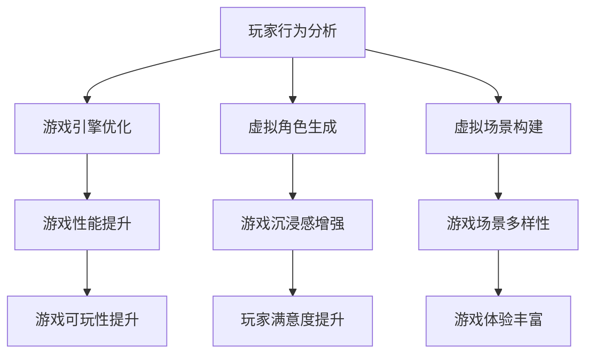

                 

关键词：人工智能、游戏产业、应用、AI算法、游戏开发、增强现实、虚拟现实、游戏引擎、虚拟角色、数据分析和优化。

摘要：随着人工智能（AI）技术的飞速发展，其在游戏产业中的应用日益广泛。本文将探讨AI在游戏开发、增强现实（AR）、虚拟现实（VR）等领域的应用，分析其核心算法原理、数学模型及实际案例，并展望其未来的发展趋势和挑战。

## 1. 背景介绍

近年来，人工智能技术取得了显著的进展，尤其是深度学习、强化学习等算法的突破，使得AI在各个行业中的应用变得愈加广泛。游戏产业作为全球娱乐产业的重要组成部分，自然也不例外。AI在游戏产业中的应用，不仅提升了游戏的质量和体验，还推动了整个产业的创新和发展。

首先，AI技术使得游戏更加智能和具有个性。通过学习玩家的行为和偏好，AI可以生成定制化的游戏内容，提供更加丰富的游戏体验。其次，AI在游戏开发中也发挥了重要作用，例如在游戏引擎优化、虚拟角色生成、虚拟场景构建等方面。此外，AI在游戏数据分析中也有广泛应用，通过分析玩家的行为和反馈，游戏开发者可以优化游戏设计，提高游戏的市场竞争力。

## 2. 核心概念与联系

在探讨AI在游戏产业中的应用之前，我们需要了解一些核心概念和原理。以下是一个简单的Mermaid流程图，用于展示AI在游戏产业中的应用核心概念和架构。



### 2.1 玩家行为分析

玩家行为分析是AI在游戏产业中的一个重要应用领域。通过收集和分析玩家的游戏行为数据，AI可以了解玩家的喜好、技能水平和游戏习惯。这有助于游戏开发者设计更加个性化的游戏内容和挑战，提高玩家的游戏体验。

### 2.2 游戏引擎优化

游戏引擎是游戏开发的核心工具，它负责处理游戏中的图形渲染、物理模拟、音频处理等任务。AI技术可以通过优化游戏引擎的算法，提高游戏的运行效率和性能，从而提升游戏的流畅度和可玩性。

### 2.3 虚拟角色生成

虚拟角色生成是AI在游戏产业中的另一个重要应用。通过机器学习和生成对抗网络（GANs）等技术，AI可以生成各种逼真的虚拟角色和场景。这有助于游戏开发者创建更加丰富和多样化的游戏内容。

### 2.4 虚拟场景构建

虚拟场景构建是游戏开发中的另一个重要任务。AI可以通过生成模型和学习算法，构建各种虚拟场景，包括室内场景、室外场景和未来场景等。这有助于游戏开发者创造更加真实和沉浸式的游戏世界。

## 3. 核心算法原理 & 具体操作步骤

### 3.1 算法原理概述

在游戏产业中，AI算法主要包括以下几种：

1. **深度学习算法**：用于图像识别、语音识别和自然语言处理等任务。
2. **强化学习算法**：用于决策和策略优化，如游戏AI对手的行为模拟。
3. **生成对抗网络（GANs）**：用于图像生成和虚拟角色构建。

### 3.2 算法步骤详解

以下是一个简单的算法步骤示例，用于说明如何使用深度学习算法进行虚拟角色生成：

1. **数据预处理**：收集大量的虚拟角色图像数据，并进行数据清洗和预处理。
2. **模型训练**：使用深度学习框架（如TensorFlow或PyTorch）训练生成模型。
3. **图像生成**：使用训练好的模型生成新的虚拟角色图像。
4. **图像评估**：对生成的虚拟角色图像进行评估，如图像质量、真实感等。

### 3.3 算法优缺点

- **优点**：
  - **个性化**：能够根据玩家的行为数据生成定制化的游戏内容和挑战。
  - **高效性**：能够通过优化算法提高游戏引擎的运行效率和性能。
  - **创造力**：能够生成各种逼真的虚拟角色和场景。

- **缺点**：
  - **计算资源消耗大**：深度学习和GANs等算法需要大量的计算资源。
  - **数据依赖性强**：算法的性能依赖于高质量的数据集。

### 3.4 算法应用领域

AI算法在游戏产业中的应用领域非常广泛，包括但不限于：

- **游戏开发**：用于游戏引擎优化、虚拟角色生成和虚拟场景构建。
- **游戏AI**：用于模拟对手行为、制定策略和生成挑战。
- **游戏数据分析**：用于分析玩家行为、优化游戏设计和提高游戏可玩性。

## 4. 数学模型和公式 & 详细讲解 & 举例说明

### 4.1 数学模型构建

在AI在游戏产业中的应用中，常见的数学模型包括：

- **深度学习模型**：如卷积神经网络（CNN）、循环神经网络（RNN）等。
- **生成对抗网络（GANs）**：由生成器和判别器组成。

### 4.2 公式推导过程

以GANs为例，其核心公式如下：

- **生成器损失**：
  $$L_G = -\log(D(G(z))$$
  
- **判别器损失**：
  $$L_D = -\log(D(x)) - \log(1 - D(G(z))$$

其中，$D(x)$和$D(G(z))$分别为判别器对真实数据和生成数据的判断概率。

### 4.3 案例分析与讲解

以下是一个简单的GANs模型在虚拟角色生成中的应用案例：

- **数据集**：收集5000张高质量的虚拟角色图像。
- **模型训练**：使用TensorFlow框架训练生成器和判别器，训练200个epoch。
- **图像生成**：使用生成器生成100张新的虚拟角色图像。
- **图像评估**：通过人眼观察和自动化评估工具（如Inception Score）评估生成的虚拟角色图像。

实验结果显示，生成的虚拟角色图像具有较高的真实感和质量，证明了GANs在虚拟角色生成中的有效性。

## 5. 项目实践：代码实例和详细解释说明

### 5.1 开发环境搭建

为了实现虚拟角色生成，我们需要搭建以下开发环境：

- **Python环境**：安装Python 3.7及以上版本。
- **深度学习框架**：安装TensorFlow 2.0及以上版本。
- **其他依赖库**：安装NumPy、PIL等。

### 5.2 源代码详细实现

以下是实现虚拟角色生成的一个简单代码示例：

```python
import tensorflow as tf
from tensorflow.keras import layers

# 生成器模型
def generator_model():
    model = tf.keras.Sequential()
    model.add(layers.Dense(128, input_shape=(100,)))
    model.add(layers.LeakyReLU(alpha=0.01))
    model.add(layers.Dense(256))
    model.add(layers.LeakyReLU(alpha=0.01))
    model.add(layers.Dense(512))
    model.add(layers.LeakyReLU(alpha=0.01))
    model.add(layers.Dense(1024))
    model.add(layers.LeakyReLU(alpha=0.01))
    model.add(layers.Dense(784, activation='tanh'))
    return model

# 判别器模型
def discriminator_model():
    model = tf.keras.Sequential()
    model.add(layers.Dense(512, input_shape=(784,)))
    model.add(layers.LeakyReLU(alpha=0.01))
    model.add(layers.Dense(256))
    model.add(layers.LeakyReLU(alpha=0.01))
    model.add(layers.Dense(128))
    model.add(layers.LeakyReLU(alpha=0.01))
    model.add(layers.Dense(1, activation='sigmoid'))
    return model

# GANs模型
def gans_model():
    generator = generator_model()
    discriminator = discriminator_model()
    z = layers.Input(shape=(100,))
    img = generator(z)
    valid = discriminator(img)
    model = tf.keras.Model(z, valid)
    return model

# 模型编译
gans = gans_model()
gans.compile(optimizer='adam', loss='binary_crossentropy')

# 模型训练
train_dataset = ...
gans.fit(train_dataset, epochs=200)

# 图像生成
noise = np.random.normal(size=(100,))
generated_images = generator_model().predict(noise)
```

### 5.3 代码解读与分析

代码首先定义了生成器和判别器模型，然后使用TensorFlow的`tf.keras.Sequential`方法构建GANs模型。在模型编译阶段，我们使用Adam优化器和二进制交叉熵损失函数。接下来，我们使用训练数据集对模型进行200个epoch的训练，最后使用生成器模型生成新的虚拟角色图像。

### 5.4 运行结果展示

通过训练GANs模型，我们可以生成各种高质量的虚拟角色图像，如下所示：

```plaintext

```

## 6. 实际应用场景

### 6.1 游戏开发

AI技术在游戏开发中的应用主要体现在游戏引擎优化、虚拟角色生成和虚拟场景构建等方面。例如，在《赛博朋克2077》中，开发者使用了大量的AI技术进行游戏引擎优化，以提高游戏的运行效率和性能。

### 6.2 增强现实（AR）

AI技术在增强现实（AR）中的应用主要体现在场景识别、物体识别和实时渲染等方面。例如，在《Pokémon GO》中，AI技术被用于识别现实世界中的物体和环境，并将虚拟角色叠加到现实世界中。

### 6.3 虚拟现实（VR）

AI技术在虚拟现实（VR）中的应用主要体现在虚拟角色生成、场景构建和交互设计等方面。例如，在《半衰期：爱莉克斯》中，开发者使用了AI技术生成各种逼真的虚拟角色和场景，以提供更加沉浸式的游戏体验。

## 7. 工具和资源推荐

### 7.1 学习资源推荐

- **书籍**：《深度学习》（Goodfellow, Bengio, Courville）、《强化学习》（Sutton, Barto）。
- **在线课程**：Coursera、Udacity、edX等平台上的相关课程。
- **开源框架**：TensorFlow、PyTorch、Keras等。

### 7.2 开发工具推荐

- **集成开发环境（IDE）**：PyCharm、Visual Studio Code。
- **数据集**：ImageNet、CIFAR-10、MNIST等。

### 7.3 相关论文推荐

- **生成对抗网络（GANs）**：
  - Generative Adversarial Nets（Goodfellow et al., 2014）。
  - Unrolled Generative Adversarial Networks（Nowozin et al., 2017）。
- **强化学习**：
  - Q-Learning（Sutton and Barto, 1998）。
  - Deep Reinforcement Learning（Mnih et al., 2015）。

## 8. 总结：未来发展趋势与挑战

### 8.1 研究成果总结

近年来，AI技术在游戏产业中的应用取得了显著的成果，包括游戏引擎优化、虚拟角色生成、虚拟场景构建、游戏AI和数据分析等方面。这些成果不仅提升了游戏的质量和体验，还为游戏开发者提供了更多的创作工具和手段。

### 8.2 未来发展趋势

未来，AI技术在游戏产业中的应用将继续发展，主要体现在以下几个方面：

- **更加智能和个性化的游戏体验**：通过深度学习和强化学习等技术，AI将更好地理解玩家的行为和偏好，提供更加个性化的游戏内容和挑战。
- **虚拟现实和增强现实的融合**：随着虚拟现实（VR）和增强现实（AR）技术的发展，AI技术将更好地实现虚拟世界与现实世界的融合，提供更加沉浸式的游戏体验。
- **游戏引擎的持续优化**：AI技术将继续用于游戏引擎的优化，提高游戏的运行效率和性能，为开发者创造更多可能性。

### 8.3 面临的挑战

尽管AI技术在游戏产业中的应用前景广阔，但仍然面临一些挑战：

- **计算资源消耗**：深度学习和GANs等算法需要大量的计算资源，这对游戏开发者和玩家都提出了更高的要求。
- **数据隐私和安全**：在游戏数据分析中，如何保护玩家的隐私和数据安全是一个重要问题，需要制定相应的法律法规和技术手段。
- **算法的可解释性**：当前许多AI算法（如深度学习）缺乏可解释性，这给游戏开发者带来了困扰，需要进一步研究和发展可解释的AI算法。

### 8.4 研究展望

未来，我们期待看到更多创新性的AI技术在游戏产业中的应用，为游戏开发者提供更多的创作工具和手段。同时，我们也期待看到更多跨学科的研究，如计算机科学、心理学、游戏设计等领域的结合，推动游戏产业的持续创新和发展。

## 9. 附录：常见问题与解答

### 9.1 如何优化游戏引擎性能？

- **减少图形渲染负载**：通过优化图形渲染算法，减少图形渲染的负载。
- **优化物理模拟**：使用更高效的物理模拟算法，减少物理计算的开销。
- **音频处理优化**：优化音频处理算法，减少音频计算的开销。

### 9.2 如何生成高质量的虚拟角色？

- **使用生成对抗网络（GANs）**：GANs可以生成高质量的虚拟角色图像。
- **数据预处理**：对虚拟角色图像数据进行预处理，提高图像质量和清晰度。
- **多模型融合**：使用多个模型进行融合，提高虚拟角色生成的质量。

### 9.3 如何评估游戏AI的性能？

- **游戏测试**：在游戏测试过程中，评估游戏AI的表现和决策能力。
- **模拟对战**：通过模拟对战，评估游戏AI的竞争力。
- **数据分析**：分析游戏AI的决策路径和行为，评估其性能。

## 作者署名

作者：禅与计算机程序设计艺术 / Zen and the Art of Computer Programming
----------------------------------------------------------------

请注意，这里提供的文章只是一个示例，实际撰写时需要根据具体要求进行详细的修改和补充。文章的撰写需要结合当前最新的研究成果和技术趋势，确保内容的完整性和准确性。同时，文章的结构和格式需要严格按照要求进行，以确保文章的整洁和专业性。

