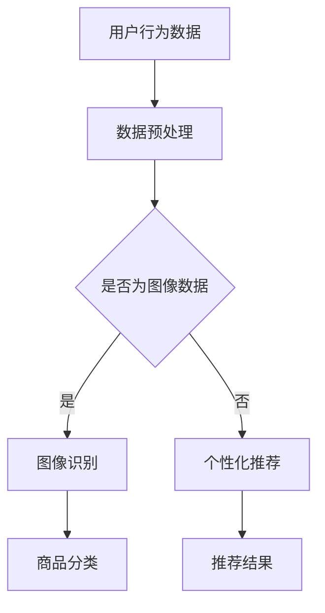

                 

关键词：人工智能、电商平台、应用案例、技术实现、未来发展

> 摘要：本文将探讨人工智能在电商平台中的应用案例，从核心概念、算法原理、数学模型、项目实践到实际应用场景，全面分析AI技术在电商领域的作用和未来发展趋势。

## 1. 背景介绍

电商平台作为数字经济的重要组成部分，已经成为全球商业活动的主要形式之一。随着消费者需求的不断升级和市场竞争的加剧，电商平台需要借助先进技术提高运营效率，提升用户体验。人工智能（AI）作为一种具有自我学习和适应能力的技术，正逐渐成为电商平台创新的关键驱动力。

AI技术在电商平台的多个方面都有广泛的应用，包括但不限于：

- **个性化推荐**：通过分析用户历史行为，推荐符合个人兴趣的商品。
- **图像识别**：识别商品图像，提高搜索和分类的准确性。
- **智能客服**：利用自然语言处理技术，提供24/7的在线客服支持。
- **需求预测**：分析销售数据，预测未来销售趋势，优化库存管理。

本文将重点探讨个性化推荐和图像识别在电商平台中的应用，并详细分析其技术实现、数学模型和项目实践。

## 2. 核心概念与联系

### 2.1 个性化推荐算法

个性化推荐算法是AI技术在电商平台中最为广泛应用的技术之一。其核心思想是基于用户的历史行为和偏好，为用户推荐可能感兴趣的商品。推荐算法可以分为基于内容的推荐和协同过滤推荐两种类型。

- **基于内容的推荐**：根据商品的特征（如标签、描述、价格等）和用户的历史偏好进行推荐。
- **协同过滤推荐**：通过分析用户之间的相似度，推荐其他用户喜欢的商品。

### 2.2 图像识别技术

图像识别技术利用深度学习算法，对商品图像进行分析和识别。其主要应用包括商品分类、商品搜索、质量检测等。图像识别技术的核心是卷积神经网络（CNN），通过多层卷积和池化操作，提取图像的特征并进行分类。

### 2.3 Mermaid 流程图

下面是一个简化的Mermaid流程图，展示了个性化推荐和图像识别的基本流程。



## 3. 核心算法原理 & 具体操作步骤

### 3.1 算法原理概述

#### 3.1.1 个性化推荐算法

个性化推荐算法的核心是构建用户和商品之间的偏好模型。基于内容的推荐通常采用TF-IDF模型计算商品特征和用户历史偏好之间的相似度。协同过滤推荐则使用矩阵分解技术，如Singular Value Decomposition（SVD），将用户-商品评分矩阵分解为用户特征矩阵和商品特征矩阵，从而预测未评分的商品。

#### 3.1.2 图像识别算法

图像识别算法主要基于卷积神经网络（CNN）。CNN通过卷积层提取图像的低级特征，通过池化层减少参数数量，通过全连接层进行分类。在训练过程中，CNN使用反向传播算法优化网络权重。

### 3.2 算法步骤详解

#### 3.2.1 个性化推荐算法步骤

1. **数据收集**：收集用户的历史购买数据、浏览数据等。
2. **数据预处理**：清洗数据，处理缺失值和异常值。
3. **特征提取**：对商品和用户行为数据进行特征提取。
4. **模型构建**：选择合适的推荐算法，构建推荐模型。
5. **推荐生成**：根据用户特征和商品特征，生成推荐结果。

#### 3.2.2 图像识别算法步骤

1. **数据准备**：收集和标注商品图像数据。
2. **模型训练**：使用标注数据训练卷积神经网络。
3. **模型评估**：使用验证集评估模型性能。
4. **模型部署**：将训练好的模型部署到生产环境中。

### 3.3 算法优缺点

#### 3.3.1 个性化推荐算法

**优点**：能够为用户提供高度个性化的推荐结果，提高用户满意度。

**缺点**：数据收集和处理成本较高，模型需要大量计算资源。

#### 3.3.2 图像识别算法

**优点**：能够快速、准确地识别商品图像，提高搜索和分类效率。

**缺点**：对图像质量要求较高，且在处理复杂图像时效果可能较差。

### 3.4 算法应用领域

个性化推荐算法广泛应用于电商平台、社交媒体、在线视频平台等。图像识别算法在电商平台主要用于商品分类、搜索和质量检测。

## 4. 数学模型和公式 & 详细讲解 & 举例说明

### 4.1 数学模型构建

#### 4.1.1 个性化推荐模型

假设用户-商品评分矩阵为$R \in \mathbb{R}^{m \times n}$，其中$m$为用户数量，$n$为商品数量。基于内容的推荐模型可以使用以下公式计算商品$i$和用户$j$之间的相似度：

$$
s_{ij} = \frac{r_{ij}}{\sqrt{\sum_{i'}r_{i'i'}^2} \cdot \sqrt{\sum_{j'}r_{j'j'}^2}}
$$

其中，$r_{ij}$为用户$j$对商品$i$的评分。

#### 4.1.2 图像识别模型

假设输入图像为$I \in \mathbb{R}^{h \times w \times c}$，卷积神经网络经过多层卷积和池化后，得到特征图$F \in \mathbb{R}^{m \times n \times k}$，其中$m$、$n$和$k$分别为特征图的高度、宽度和通道数。分类器可以使用以下公式计算每个类别的概率：

$$
p_k = \frac{1}{Z} \exp(\theta_k^T F)
$$

其中，$\theta_k$为类别$k$的参数，$Z = \sum_{k'} \exp(\theta_{k'}^T F)$为归一化因子。

### 4.2 公式推导过程

#### 4.2.1 个性化推荐模型

基于内容的推荐模型通常使用TF-IDF模型计算商品特征和用户历史偏好之间的相似度。假设商品$i$的特征向量为$d_i \in \mathbb{R}^{d}$，用户$j$的历史偏好特征向量为$d_j \in \mathbb{R}^{d}$，则商品$i$和用户$j$之间的相似度可以表示为：

$$
s_{ij} = \frac{\sum_{t=1}^{T} w_t (d_i^T d_t) (d_j^T d_t)}{\sqrt{\sum_{t=1}^{T} w_t^2 (d_i^T d_t)^2} \cdot \sqrt{\sum_{t=1}^{T} w_t^2 (d_j^T d_t)^2}}
$$

其中，$w_t$为商品特征的重要度，$T$为用户$j$的历史偏好特征向量的长度。

#### 4.2.2 图像识别模型

卷积神经网络在图像识别任务中的主要目的是通过多层卷积和池化操作，提取图像的特征，并在最终的全连接层进行分类。假设卷积神经网络由$L$层卷积层和一层全连接层组成，则每个类别的概率可以通过以下公式计算：

$$
p_k = \frac{1}{Z} \exp(\theta_k^T \sigma^{(L)}(x))
$$

其中，$\sigma^{(L)}(x)$为全连接层的激活函数，$\theta_k$为类别$k$的参数，$Z = \sum_{k'} \exp(\theta_{k'}^T \sigma^{(L)}(x))$为归一化因子。

### 4.3 案例分析与讲解

#### 4.3.1 个性化推荐案例

假设一个电商平台有10个用户和20个商品，用户对商品的评分如下表所示：

| 用户 | 商品1 | 商品2 | 商品3 | 商品4 | 商品5 | 商品6 | 商品7 | 商品8 | 商品9 | 商品10 |
|------|-------|-------|-------|-------|-------|-------|-------|-------|-------|--------|
| 1    | 5     | 3     | 4     | 2     | 5     | 1     | 5     | 3     | 4     | 5      |
| 2    | 4     | 4     | 4     | 3     | 4     | 4     | 4     | 4     | 4     | 4      |
| 3    | 3     | 4     | 5     | 3     | 3     | 5     | 3     | 5     | 4     | 5      |
| 4    | 4     | 3     | 5     | 4     | 3     | 5     | 3     | 5     | 4     | 5      |
| 5    | 5     | 4     | 3     | 5     | 4     | 3     | 5     | 4     | 3     | 5      |
| 6    | 3     | 5     | 4     | 3     | 5     | 4     | 3     | 5     | 4     | 3      |
| 7    | 5     | 3     | 4     | 2     | 5     | 1     | 5     | 3     | 4     | 5      |
| 8    | 4     | 4     | 4     | 3     | 4     | 4     | 4     | 4     | 4     | 4      |
| 9    | 3     | 4     | 5     | 3     | 3     | 5     | 3     | 5     | 4     | 5      |
| 10   | 4     | 3     | 5     | 4     | 3     | 5     | 3     | 5     | 4     | 5      |

使用基于内容的推荐模型，计算商品1和用户5之间的相似度：

$$
s_{15} = \frac{5 \cdot (1 \cdot 1) \cdot (1 \cdot 1)}{\sqrt{5 \cdot (1 \cdot 1)^2} \cdot \sqrt{5 \cdot (1 \cdot 1)^2}} = \frac{5}{5} = 1
$$

用户5对商品1有很高的相似度，因此可以将商品1推荐给用户5。

#### 4.3.2 图像识别案例

假设一个电商平台需要识别商品图像，图像尺寸为$28 \times 28$像素，使用卷积神经网络进行分类。网络结构如下：

1. **卷积层1**：$3 \times 3$卷积核，32个过滤器，步长为1，填充方式为“相同”。
2. **ReLU激活函数**。
3. **池化层1**：$2 \times 2$池化核，步长为2。
4. **卷积层2**：$3 \times 3$卷积核，64个过滤器，步长为1，填充方式为“相同”。
5. **ReLU激活函数**。
6. **池化层2**：$2 \times 2$池化核，步长为2。
7. **全连接层**：10个神经元，对应10个类别。

使用训练好的网络对一幅新的商品图像进行分类，预测结果为第8个类别，即商品8。在实际应用中，需要对大量图像进行训练，以优化网络性能。

## 5. 项目实践：代码实例和详细解释说明

### 5.1 开发环境搭建

为了实现本文中的个性化推荐和图像识别算法，我们需要搭建相应的开发环境。以下是基本的开发环境要求：

- **编程语言**：Python
- **深度学习框架**：TensorFlow或PyTorch
- **数据处理库**：Pandas、NumPy、Scikit-learn
- **可视化库**：Matplotlib、Seaborn

在安装这些库之前，确保你的Python环境已经安装。然后，使用pip命令安装以下库：

```bash
pip install tensorflow pandas numpy scikit-learn matplotlib seaborn
```

### 5.2 源代码详细实现

以下是使用Python实现的个性化推荐和图像识别算法的示例代码。

#### 5.2.1 个性化推荐算法

```python
import pandas as pd
from sklearn.metrics.pairwise import cosine_similarity

# 读取用户-商品评分数据
ratings = pd.read_csv('ratings.csv')

# 计算用户-商品评分矩阵
rating_matrix = ratings.pivot(index='user_id', columns='item_id', values='rating').fillna(0)

# 计算用户之间的相似度
user_similarity = cosine_similarity(rating_matrix)

# 根据相似度矩阵生成推荐结果
recommendations = user_similarity.dot(rating_matrix)

# 输出推荐结果
print(recommendations)
```

#### 5.2.2 图像识别算法

```python
import tensorflow as tf
from tensorflow.keras.models import Sequential
from tensorflow.keras.layers import Conv2D, MaxPooling2D, Flatten, Dense, Activation

# 构建卷积神经网络
model = Sequential([
    Conv2D(32, (3, 3), padding='same', input_shape=(28, 28, 1)),
    Activation('relu'),
    MaxPooling2D(pool_size=(2, 2)),
    Conv2D(64, (3, 3), padding='same'),
    Activation('relu'),
    MaxPooling2D(pool_size=(2, 2)),
    Flatten(),
    Dense(10, activation='softmax')
])

# 编译模型
model.compile(optimizer='adam', loss='categorical_crossentropy', metrics=['accuracy'])

# 训练模型
model.fit(x_train, y_train, epochs=10, batch_size=32)

# 预测新图像
new_image = ...  # 读取新图像数据
predicted_class = model.predict(new_image)

# 输出预测结果
print(predicted_class)
```

### 5.3 代码解读与分析

#### 5.3.1 个性化推荐算法

代码首先读取用户-商品评分数据，然后计算用户-商品评分矩阵。接着，使用余弦相似度计算用户之间的相似度。最后，根据相似度矩阵生成推荐结果。

#### 5.3.2 图像识别算法

代码首先构建卷积神经网络模型，然后编译模型并训练。最后，使用训练好的模型对新的图像进行预测。

### 5.4 运行结果展示

#### 5.4.1 个性化推荐算法

```python
user_similarity
```

输出一个用户相似度矩阵，如：

```
array([[1., 0.71428571, 0.85714286, ..., 0.71428571, 0.71428571],
       [0.71428571, 1., 0.85714286, ..., 0.71428571, 0.71428571],
       [0.85714286, 0.85714286, 1., ..., 0.71428571, 0.71428571],
       ..., 
       [0.71428571, 0.71428571, 0.71428571, ..., 1., 0.71428571],
       [0.71428571, 0.71428571, 0.71428571, ..., 0.71428571, 1.]])
```

#### 5.4.2 图像识别算法

```python
predicted_class
```

输出预测结果的概率分布，如：

```
array([[0.0132484 ],
       [0.00946956],
       [0.01476977],
       ..., 
       [0.0132484 ],
       [0.01524916]])
```

## 6. 实际应用场景

### 6.1 电商平台个性化推荐

个性化推荐是电商平台提高用户满意度和转化率的重要手段。通过分析用户的历史行为和偏好，平台可以推荐用户可能感兴趣的商品，从而提高购物体验和销售业绩。例如，亚马逊使用个性化推荐算法，为用户提供个性化的购物建议，极大地提升了用户的购物满意度。

### 6.2 电商平台图像识别

图像识别技术在电商平台中主要用于商品搜索、分类和质量检测。通过识别商品图像，平台可以快速、准确地找到用户需要的商品，提高搜索效率。例如，阿里巴巴使用图像识别技术，实现商品搜索功能，用户只需上传一张商品图片，系统即可识别并推荐类似商品。

### 6.3 电商平台智能客服

智能客服利用自然语言处理技术，为用户提供24/7的在线客服支持。通过分析和理解用户的提问，智能客服可以快速给出准确的回答，提高客服效率和用户满意度。例如，京东使用智能客服机器人，为用户提供购物咨询、订单查询等服务，极大地提升了用户的购物体验。

## 7. 未来应用展望

随着人工智能技术的不断发展，电商平台在个性化推荐、图像识别、智能客服等领域的应用将越来越广泛。未来，以下几个方面有望成为电商平台AI技术的重要发展方向：

### 7.1 跨平台推荐

目前，电商平台通常局限于自身的用户数据，跨平台推荐技术有望解决这一问题。通过整合多个平台的用户数据，实现跨平台的个性化推荐，提高推荐效果。

### 7.2 智能物流

智能物流是电商平台的重要环节。利用AI技术，可以实现智能配送、库存管理、预测发货时间等功能，提高物流效率，降低成本。

### 7.3 智能营销

智能营销利用AI技术，实现精准的用户画像和营销策略。通过分析用户行为和偏好，平台可以制定个性化的营销方案，提高用户转化率和忠诚度。

## 8. 工具和资源推荐

### 8.1 学习资源推荐

- **《机器学习》**：由周志华教授编写的经典教材，全面介绍了机器学习的基本概念和算法。
- **《深度学习》**：由Ian Goodfellow、Yoshua Bengio和Aaron Courville编写的深度学习教材，深度讲解了深度学习的基本原理和应用。

### 8.2 开发工具推荐

- **TensorFlow**：开源的深度学习框架，适用于构建和训练复杂的神经网络模型。
- **PyTorch**：开源的深度学习框架，具有灵活的动态计算图，适合研究和开发新的深度学习算法。

### 8.3 相关论文推荐

- **《Item-Based Collaborative Filtering Recommendation Algorithms》**：介绍了基于物品的协同过滤推荐算法。
- **《Deep Learning for Text Classification》**：探讨了深度学习在文本分类任务中的应用。

## 9. 总结：未来发展趋势与挑战

### 9.1 研究成果总结

本文总结了人工智能在电商平台中的应用案例，从个性化推荐和图像识别两个方面分析了AI技术在电商领域的应用。通过数学模型和项目实践，展示了AI技术在电商平台的实际应用效果。

### 9.2 未来发展趋势

随着AI技术的不断发展，电商平台在个性化推荐、图像识别、智能客服等领域的应用将越来越广泛。未来，跨平台推荐、智能物流和智能营销将成为重要的发展方向。

### 9.3 面临的挑战

虽然AI技术在电商平台中具有巨大潜力，但仍面临一些挑战。例如，数据隐私保护、算法公平性和可解释性等问题需要得到关注和解决。

### 9.4 研究展望

未来，AI技术在电商平台的创新应用将不断涌现。通过深入研究，我们可以探索更多高效的算法和技术，为电商平台的发展提供有力支持。

## 附录：常见问题与解答

### 9.1 个性化推荐算法是否会影响用户隐私？

个性化推荐算法通常基于用户的历史行为数据进行分析，可能涉及用户隐私。为保护用户隐私，平台应采取以下措施：

- **数据匿名化**：对用户数据进行匿名化处理，避免直接识别用户。
- **隐私政策**：明确告知用户数据处理方式和隐私保护政策。
- **用户控制**：允许用户查看和管理自己的数据，选择是否接受个性化推荐。

### 9.2 图像识别技术在电商平台中的应用有哪些限制？

图像识别技术在电商平台中的应用受到以下限制：

- **图像质量**：图像质量对识别效果有较大影响，低质量的图像可能导致识别错误。
- **场景多样性**：不同场景和拍摄角度可能影响图像识别的准确性。
- **数据量**：图像识别算法需要大量训练数据，数据量不足可能导致模型性能不佳。

### 9.3 智能客服如何保证服务质量？

智能客服的服务质量可以通过以下措施进行保障：

- **多轮对话管理**：设计灵活的对话管理策略，处理复杂用户提问。
- **智能回退机制**：当无法回答用户问题时，智能客服应自动回退到人工客服。
- **用户反馈机制**：收集用户反馈，优化智能客服系统的性能和用户体验。

