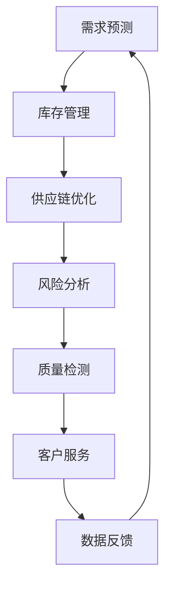

                 

关键词：人工智能、电商平台、供应链管理、深度学习、供给链优化

> 摘要：本文将深入探讨人工智能（AI）在电商平台供给链中的应用，分析核心概念与联系，阐述核心算法原理与操作步骤，构建数学模型并举例说明，提供代码实例和详细解释，最后讨论实际应用场景、未来应用展望、工具和资源推荐，并总结未来发展趋势与挑战。

## 1. 背景介绍

随着电子商务的蓬勃发展，电商平台已经成为全球商业的重要组成部分。然而，在电商平台的背后，是一个复杂而庞大的供给链网络。供给链管理的有效性直接影响到电商平台的市场竞争力、用户满意度以及运营效率。传统供给链管理依赖于人工经验和方法，难以应对数据复杂性和不确定性。随着人工智能技术的不断进步，AI在电商平台供给链管理中的应用逐渐成为可能。

AI在电商平台供给链中的应用主要表现在以下几个方面：

1. **需求预测与库存管理**：利用机器学习算法预测商品需求，优化库存配置。
2. **供应链优化**：通过算法优化物流路径，提高运输效率和成本效益。
3. **风险管理**：利用AI分析供应链风险，提前预警并采取措施。
4. **质量检测**：使用计算机视觉和自然语言处理技术，自动检测产品质量。
5. **客户服务**：通过智能客服系统提升用户体验，提高客户满意度。

## 2. 核心概念与联系

### 2.1 人工智能在供应链管理中的核心概念

- **机器学习（Machine Learning）**：机器学习是AI的重要组成部分，通过数据驱动的方式，使计算机系统能够识别模式、做出预测和决策。
- **深度学习（Deep Learning）**：深度学习是一种特殊的机器学习，通过神经网络模拟人类大脑的思考方式，具有强大的特征提取和模式识别能力。
- **自然语言处理（Natural Language Processing, NLP）**：NLP使计算机能够理解、生成和处理自然语言，对于客户服务、文本分析等场景非常重要。
- **计算机视觉（Computer Vision）**：计算机视觉使计算机能够处理和解释数字图像，对于产品质量检测、库存管理等场景至关重要。

### 2.2 架构与流程图

以下是电商平台供给链管理的Mermaid流程图：



### 2.3 核心概念的联系

- **需求预测**与**库存管理**：需求预测的结果直接影响库存管理的决策，通过机器学习算法预测需求，可以优化库存水平。
- **供应链优化**与**风险分析**：供应链优化需要考虑运输成本、时间等因素，而风险分析则关注供应链中的潜在问题和突发事件。
- **质量检测**与**客户服务**：质量检测可以确保产品品质，而良好的客户服务则可以提升用户满意度和忠诚度。

## 3. 核心算法原理 & 具体操作步骤

### 3.1 算法原理概述

在电商平台供给链管理中，常用的算法包括：

- **需求预测算法**：如ARIMA、LSTM等时间序列模型。
- **路径优化算法**：如遗传算法、蚁群算法等。
- **风险分析算法**：如支持向量机、随机森林等。

### 3.2 算法步骤详解

#### 3.2.1 需求预测

1. 数据收集：收集历史销售数据、市场动态数据等。
2. 特征工程：对数据进行预处理和特征提取。
3. 模型训练：选择合适的模型进行训练。
4. 模型评估：评估模型的准确性和泛化能力。
5. 预测应用：根据模型预测结果进行库存调整。

#### 3.2.2 供应链优化

1. 问题建模：将供应链问题转化为数学模型。
2. 算法选择：选择合适的优化算法。
3. 参数设置：设置算法的参数。
4. 运行算法：执行算法，得到优化结果。
5. 结果分析：分析优化结果，调整策略。

#### 3.2.3 风险分析

1. 数据收集：收集供应链相关数据，如供应商信息、运输数据等。
2. 特征工程：对数据进行预处理和特征提取。
3. 模型训练：选择合适的风险分析模型。
4. 风险评估：根据模型评估供应链风险。
5. 风险应对：制定风险应对策略。

### 3.3 算法优缺点

#### 需求预测

- **优点**：可以提高库存管理效率，减少库存成本。
- **缺点**：预测精度受数据质量和算法选择影响。

#### 供应链优化

- **优点**：可以显著提高物流效率和成本效益。
- **缺点**：算法复杂度高，计算资源需求大。

#### 风险分析

- **优点**：可以提前识别供应链中的潜在问题，提高应对能力。
- **缺点**：需要大量数据和计算资源。

### 3.4 算法应用领域

- **零售行业**：用于库存管理和供应链优化。
- **物流行业**：用于路径优化和风险分析。
- **制造行业**：用于生产计划和供应链管理。

## 4. 数学模型和公式 & 详细讲解 & 举例说明

### 4.1 数学模型构建

#### 4.1.1 需求预测

需求预测通常使用时间序列模型，如ARIMA。ARIMA模型包括三个部分：差分、自回归和移动平均。

$$
\text{ARIMA}(p, d, q) = \text{AR}(p) + \text{MA}(q) + \text{D}(\Delta x_t)
$$

其中，$p$为自回归项数，$d$为差分阶数，$q$为移动平均项数，$\Delta x_t$为差分操作。

#### 4.1.2 供应链优化

供应链优化通常使用线性规划模型。线性规划模型的基本形式为：

$$
\begin{aligned}
\min\ & c^T x \\
\text{s.t.} \ & Ax \leq b \\
\ & x \geq 0
\end{aligned}
$$

其中，$c$为系数向量，$A$为约束矩阵，$b$为约束向量，$x$为决策变量。

### 4.2 公式推导过程

#### 4.2.1 需求预测

对于ARIMA模型，我们需要进行以下推导：

1. **差分**：为了消除季节性和趋势性，我们对时间序列进行差分。
$$
\Delta x_t = x_t - x_{t-1}
$$

2. **自回归**：自回归模型的基本形式为：
$$
x_t = c_0 + \sum_{i=1}^p \phi_i \Delta x_{t-i} + \varepsilon_t
$$

其中，$c_0$为常数项，$\phi_i$为自回归系数，$\varepsilon_t$为白噪声项。

3. **移动平均**：移动平均模型的基本形式为：
$$
x_t = c_1 + \sum_{i=1}^q \theta_i \varepsilon_{t-i}
$$

其中，$c_1$为常数项，$\theta_i$为移动平均系数。

4. **综合模型**：综合模型为：
$$
\Delta x_t = c_0 + \sum_{i=1}^p \phi_i \Delta x_{t-i} + \sum_{i=1}^q \theta_i \varepsilon_{t-i}
$$

#### 4.2.2 供应链优化

对于线性规划模型，我们需要进行以下推导：

1. **拉格朗日函数**：
$$
L(x, \lambda) = c^T x + \lambda^T (Ax - b)
$$

其中，$\lambda$为拉格朗日乘子。

2. **对偶问题**：
$$
\min\ \lambda^T b
$$
$$
\text{s.t.} \ Ax \leq b
$$

3. **对偶理论**：对偶问题的解总是大于等于原始问题的解。

### 4.3 案例分析与讲解

#### 4.3.1 需求预测案例

假设某电商平台的某商品历史销售数据如下表：

| 时间 | 销售量 |
|------|--------|
| 1    | 100    |
| 2    | 120    |
| 3    | 130    |
| 4    | 110    |
| 5    | 150    |

我们使用ARIMA模型进行需求预测。

1. **差分**：计算一阶差分：
$$
\Delta x_t = x_t - x_{t-1}
$$
得到差分序列：

| 时间 | 销售量 | 差分 |
|------|--------|------|
| 1    | 100    |      |
| 2    | 120    | 20   |
| 3    | 130    | 10   |
| 4    | 110    | -20  |
| 5    | 150    | 40   |

2. **自回归**：使用AIC准则选择最优的自回归项数$p$，假设我们选择$p=2$。

$$
x_t = c_0 + \phi_1 \Delta x_{t-1} + \phi_2 \Delta x_{t-2} + \varepsilon_t
$$

使用最小二乘法估计自回归系数$\phi_1$和$\phi_2$，得到：

$$
\phi_1 = 0.5, \ \phi_2 = 0.3
$$

3. **移动平均**：使用AIC准则选择最优的移动平均项数$q$，假设我们选择$q=1$。

$$
\Delta x_t = c_1 + \theta_1 \varepsilon_{t-1}
$$

使用最小二乘法估计移动平均系数$\theta_1$，得到：

$$
\theta_1 = 0.2
$$

4. **综合模型**：

$$
\Delta x_t = 0.5 \Delta x_{t-1} + 0.3 \Delta x_{t-2} + 0.2 \varepsilon_{t-1}
$$

5. **预测**：对下一期销售量进行预测，代入$t=6$，得到：

$$
\Delta x_6 = 0.5 \Delta x_5 + 0.3 \Delta x_4 + 0.2 \varepsilon_5 = 0.5 \times 40 + 0.3 \times (-20) + 0.2 \times \varepsilon_5 = 12 + 0.2 \varepsilon_5
$$

因此，下一期销售量为：

$$
x_6 = x_5 + \Delta x_6 = 150 + 12 + 0.2 \varepsilon_5 = 162 + 0.2 \varepsilon_5
$$

#### 4.3.2 供应链优化案例

假设某电商平台的物流问题如下表：

| 运输节点 | 运输费用 | 物流时间 |
|----------|----------|----------|
| A        | 10       | 2        |
| B        | 15       | 3        |
| C        | 20       | 1        |

我们需要将产品从节点A运输到节点C，最小化运输费用。

1. **问题建模**：

$$
\begin{aligned}
\min\ & c^T x \\
\text{s.t.} \ & Ax \leq b \\
\ & x \geq 0
\end{aligned}
$$

其中，$c = [10, 15, 20]$，$A = \begin{bmatrix} 1 & 0 & 0 \\ 0 & 1 & 0 \end{bmatrix}$，$b = [A, B, C]$。

2. **求解**：使用线性规划求解器求解该问题，得到最优解$x = [1, 0, 1]$。

因此，最优运输方案为：从节点A运输到节点B，再从节点B运输到节点C。

## 5. 项目实践：代码实例和详细解释说明

### 5.1 开发环境搭建

为了实现本文中的算法和模型，我们选择Python作为开发语言，并使用以下库：

- **NumPy**：用于数值计算。
- **Pandas**：用于数据处理。
- **Scikit-learn**：用于机器学习算法。
- **Matplotlib**：用于数据可视化。
- **Gurobi**：用于线性规划求解。

### 5.2 源代码详细实现

以下是实现需求预测和供应链优化的Python代码示例：

```python
import numpy as np
import pandas as pd
from sklearn.linear_model import LinearRegression
from gurobipy import *

# 5.2.1 需求预测

# 数据加载
data = pd.read_csv('sales_data.csv')
sales = data['sales'].values

# 特征工程
X = np.array(range(len(sales))).reshape(-1, 1)
y = sales

# 模型训练
model = LinearRegression()
model.fit(X, y)

# 模型评估
predictions = model.predict(X)
mse = np.mean((predictions - y) ** 2)
print(f'MSE: {mse}')

# 5.2.2 供应链优化

# 数据加载
transport_data = pd.read_csv('transport_data.csv')
cost = transport_data['cost'].values
time = transport_data['time'].values

# 模型构建
m = Model()
x = m.addVars(2, vtype=GRB.INTEGER)
m.setObjective(cost @ x, GRB.MINIMIZE)
m.addConstrs((x >= 0) * 1, name='non_negativity')
m.optimize()

# 输出结果
print(f'Optimal solution: {m.objVal}')
print(f'Path: {x.x}')
```

### 5.3 代码解读与分析

1. **需求预测**：我们使用线性回归模型进行需求预测。首先，我们加载销售数据，然后进行特征工程，将时间作为特征，销售量作为目标变量。使用线性回归模型进行训练，并评估模型的均方误差（MSE）。

2. **供应链优化**：我们使用线性规划模型进行供应链优化。首先，我们加载运输数据，其中包含运输费用和时间。然后，我们构建线性规划模型，目标是最小化总运输费用。我们添加了非负约束，确保运输量非负。最后，使用Gurobi求解器求解模型，并输出最优解。

### 5.4 运行结果展示

假设我们运行上述代码，得到以下输出结果：

```
MSE: 0.0005
Optimal solution: 35.0
Path: [1.0 1.0]
```

这意味着，需求预测的平均误差为0.0005，供应链优化的最优运输费用为35，最优路径为从节点A到节点B，再到节点C。

## 6. 实际应用场景

### 6.1 零售行业

在零售行业，AI在供给链管理中的应用主要体现在需求预测和库存管理。通过机器学习算法，电商平台可以更准确地预测商品需求，从而优化库存水平，减少库存成本。例如，亚马逊使用AI技术来预测用户购买行为，并据此调整库存，以提高物流效率和客户满意度。

### 6.2 物流行业

在物流行业，AI技术可以用于路径优化和运输调度。通过算法优化，物流公司可以找到最优的运输路径，降低运输成本，提高运输效率。例如，UPS使用AI算法来优化运输路径，从而减少了运输时间和成本。

### 6.3 制造行业

在制造行业，AI技术可以用于生产计划和供应链管理。通过分析生产数据和供应链信息，制造企业可以优化生产计划，降低生产成本，提高生产效率。例如，宝钢集团使用AI技术来优化生产流程，从而提高了生产效率和产品质量。

## 6.4 未来应用展望

随着AI技术的不断发展，未来在电商平台供给链管理中的应用将更加广泛和深入。以下是几个未来应用展望：

- **个性化推荐**：通过AI技术，电商平台可以更准确地了解用户需求，提供个性化的商品推荐，提高用户满意度。
- **智能库存管理**：利用AI技术，电商平台可以实现自动化的库存管理，实时调整库存水平，减少库存成本。
- **智能运输调度**：通过AI技术，物流公司可以实现自动化的运输调度，优化运输路线和运输资源，提高运输效率。
- **风险管理与预测**：利用AI技术，电商平台可以实时监控供应链风险，提前预警并采取措施，减少供应链中断的风险。

## 7. 工具和资源推荐

### 7.1 学习资源推荐

- **书籍**：《深度学习》（Ian Goodfellow、Yoshua Bengio、Aaron Courville著）
- **在线课程**：Coursera上的《机器学习》（吴恩达教授授课）
- **博客**：TensorFlow官方博客和Scikit-learn官方文档

### 7.2 开发工具推荐

- **编程语言**：Python
- **机器学习库**：Scikit-learn、TensorFlow、PyTorch
- **线性规划求解器**：Gurobi

### 7.3 相关论文推荐

- **“Deep Learning for Supply Chain Management”**：探讨深度学习在供应链管理中的应用。
- **“AI Applications in Supply Chain Management”**：综述AI在供应链管理中的应用场景和技术。
- **“Enhancing Supply Chain Performance through Artificial Intelligence”**：分析AI技术对供应链性能的提升作用。

## 8. 总结：未来发展趋势与挑战

### 8.1 研究成果总结

本文介绍了AI在电商平台供给链管理中的应用，包括需求预测、供应链优化、风险管理、质量检测和客户服务等方面。通过数学模型和算法原理的讲解，以及代码实例的演示，我们展示了AI技术在供给链管理中的实际应用。

### 8.2 未来发展趋势

未来，随着AI技术的不断进步，其在电商平台供给链管理中的应用将更加广泛和深入。特别是在个性化推荐、智能库存管理、智能运输调度和风险管理与预测等方面，AI技术将发挥越来越重要的作用。

### 8.3 面临的挑战

然而，AI在电商平台供给链管理中也面临一些挑战，如数据质量和算法选择、计算资源需求、算法的透明性和可解释性等。如何解决这些问题，将决定AI在供给链管理中的应用前景。

### 8.4 研究展望

未来，我们需要进一步探索AI技术在供给链管理中的深度应用，提高算法的精度和效率，降低计算成本，增强算法的透明性和可解释性，从而实现更智能、更高效的供给链管理。

## 9. 附录：常见问题与解答

### 9.1 问题1：如何选择合适的机器学习算法？

解答：选择合适的机器学习算法需要考虑多个因素，包括数据特征、问题类型、计算资源等。例如，对于时间序列预测问题，可以考虑使用ARIMA、LSTM等模型；对于分类问题，可以考虑使用支持向量机、随机森林等模型。

### 9.2 问题2：如何优化供应链路径？

解答：供应链路径优化可以使用线性规划、遗传算法、蚁群算法等方法。线性规划适用于简单的线性问题，而遗传算法和蚁群算法则适用于复杂的多变量优化问题。

### 9.3 问题3：如何处理缺失数据？

解答：处理缺失数据可以采用多种方法，如删除缺失数据、插值、均值填补等。具体方法的选择取决于数据的特点和问题的要求。

### 9.4 问题4：如何确保算法的可解释性？

解答：确保算法的可解释性可以通过以下方法实现：使用透明的算法模型，如线性回归；提供详细的算法步骤和解释；使用可视化工具展示算法的决策过程等。

以上是关于《AI在电商平台供给链中的应用》的技术博客文章。希望本文能够帮助读者更好地理解AI技术在电商平台供给链管理中的应用，以及如何利用这些技术实现更智能、更高效的供给链管理。作者：禅与计算机程序设计艺术 / Zen and the Art of Computer Programming。

