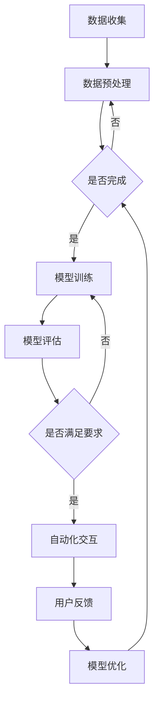

                 

关键词：人工智能，虚拟客户服务，24/7支持，AI技术，客户体验，自动化解决方案

> 摘要：本文深入探讨了人工智能（AI）在虚拟客户服务中的应用，如何通过AI技术提供全天候（24/7）的客户支持，提升客户体验。文章将详细阐述AI的核心概念和架构，以及其在实际操作中的应用和数学模型，并通过实际项目案例和代码实例进行分析，最后对未来的发展趋势和挑战进行了展望。

## 1. 背景介绍

在当今快速发展的数字化时代，客户服务已经成为企业竞争的关键因素。然而，传统的客户服务模式往往难以满足客户对即时性和个性化支持的需求。特别是对于24/7全天候运营的企业，提供无缝的客户服务成为了一项巨大的挑战。随着人工智能技术的不断进步，虚拟客户服务迎来了新的发展机遇。

AI技术的引入，使得虚拟客户服务能够实现自动化和智能化，从而提供更高效、更个性化的客户支持。通过自然语言处理（NLP）、机器学习（ML）和深度学习（DL）等技术，AI系统能够理解和回应用户的查询，处理复杂的客户问题，并在无需人工干预的情况下提供解决方案。这种24/7的支持模式不仅提高了客户满意度，还显著降低了运营成本。

本文将详细探讨AI在虚拟客户服务中的应用，包括核心概念、算法原理、数学模型以及实际项目实践。通过这篇文章，读者将了解到如何利用AI技术构建高效的虚拟客户服务系统，并在未来的发展中应对各种挑战。

## 2. 核心概念与联系

### 2.1 人工智能（AI）基础概念

人工智能（AI）是一门研究、开发和应用使计算机模拟人类智能行为的科学。AI技术包括多个子领域，如机器学习（ML）、深度学习（DL）、自然语言处理（NLP）和计算机视觉等。在这些技术中，机器学习和深度学习是实现AI的关键技术。

#### 机器学习（ML）

机器学习是一种让计算机通过数据学习并做出决策的技术。它使用算法来从数据中提取模式和规律，并在新的数据上进行预测和分类。常见的机器学习算法包括线性回归、决策树、支持向量机和神经网络等。

#### 深度学习（DL）

深度学习是机器学习的一个分支，它使用多层神经网络（MLN）来模拟人类大脑的神经网络结构。深度学习在图像识别、语音识别和自然语言处理等领域表现出色，通过大规模数据训练，深度学习模型能够自动学习复杂的特征表示。

#### 自然语言处理（NLP）

自然语言处理是AI的一个子领域，它专注于使计算机能够理解和处理人类语言。NLP技术包括文本分类、情感分析、命名实体识别和信息抽取等。NLP在虚拟客户服务中起着至关重要的作用，因为它能够使AI系统理解并回应用户的自然语言查询。

### 2.2 虚拟客户服务

虚拟客户服务是指通过数字渠道（如在线聊天、邮件和社交媒体）提供的客户支持。虚拟客户服务系统通常包括聊天机器人、邮件自动回复系统和社交媒体监控等组成部分。这些系统能够自动化地处理客户查询，提供即时响应，从而提高客户满意度和运营效率。

### 2.3 虚拟客户服务与AI的架构联系

虚拟客户服务与AI的结合，形成了一个完整的架构，包括以下几个关键组成部分：

#### 数据收集与处理

虚拟客户服务系统首先需要收集大量客户互动数据，包括聊天记录、邮件和社交媒体帖子等。这些数据经过清洗和预处理后，用于训练AI模型。

#### AI模型训练

通过机器学习和深度学习算法，AI模型从数据中学习并提取模式。这些模型能够识别客户问题、提供个性化建议和自动生成回复。

#### 自动化交互

训练好的AI模型被集成到虚拟客户服务系统中，通过自动化交互与客户进行实时沟通。AI系统能够处理多种语言和方言，提供24/7的支持。

#### 用户反馈与优化

用户在与AI系统的交互过程中，会提供反馈。这些反馈被用于不断优化AI模型，提高其准确性和响应速度。

### 2.4 Mermaid 流程图

以下是虚拟客户服务与AI架构的Mermaid流程图：



在这个流程图中，数据收集和处理是整个系统的起点，模型训练、评估、自动化交互和用户反馈形成了一个闭环，不断推动系统优化和改进。

## 3. 核心算法原理 & 具体操作步骤

### 3.1 算法原理概述

虚拟客户服务系统中的核心算法主要包括自然语言处理（NLP）和机器学习（ML）算法。这些算法负责处理客户查询、理解用户意图并生成适当的回复。

#### 3.1.1 自然语言处理（NLP）

NLP是使计算机理解和生成人类语言的技术。在虚拟客户服务中，NLP算法用于以下几个方面：

- **文本分类**：将客户查询文本分类到不同的主题类别。
- **命名实体识别**：识别文本中的特定实体，如人名、地点和组织名。
- **情感分析**：分析客户查询的情感倾向，如正面、负面或中立。
- **信息抽取**：从文本中提取关键信息，如产品规格、价格和优惠信息。

#### 3.1.2 机器学习（ML）

ML算法用于从数据中学习模式和规律，以提供个性化建议和自动生成回复。在虚拟客户服务中，常用的ML算法包括：

- **决策树**：通过一系列规则来分类和回归问题。
- **支持向量机（SVM）**：在特征空间中找到一个超平面来分割数据。
- **神经网络**：通过多层神经元来模拟人类大脑的学习过程。

### 3.2 算法步骤详解

以下是虚拟客户服务系统中的核心算法步骤：

#### 3.2.1 数据收集

- **数据源**：收集来自各种渠道的客户查询数据，包括聊天记录、邮件和社交媒体帖子。
- **数据格式**：将数据转换为统一的格式，如JSON或XML。

#### 3.2.2 数据预处理

- **数据清洗**：去除无效数据、处理缺失值和异常值。
- **文本规范化**：统一文本格式，如将所有文本转换为小写、去除标点符号等。
- **特征提取**：从文本中提取关键特征，如词频、词向量等。

#### 3.2.3 模型训练

- **选择算法**：根据问题类型选择合适的算法，如文本分类选择朴素贝叶斯、情感分析选择卷积神经网络等。
- **训练模型**：使用预处理后的数据对模型进行训练，调整模型参数以优化性能。
- **评估模型**：使用验证集评估模型性能，如准确率、召回率和F1分数等。

#### 3.2.4 自动化交互

- **理解查询**：使用NLP算法理解客户查询，提取关键信息。
- **生成回复**：使用ML算法生成适当的回复，包括文本和行动建议。
- **发送回复**：将回复发送给客户，通过在线聊天、邮件或社交媒体等渠道。

#### 3.2.5 用户反馈

- **收集反馈**：在每次交互后收集用户反馈，如满意度评分和回复质量评估。
- **优化模型**：根据用户反馈调整模型参数，以提高回复质量。
- **持续优化**：定期更新和优化模型，以适应不断变化的需求。

### 3.3 算法优缺点

#### 3.3.1 优点

- **高效性**：AI系统能够在短时间内处理大量客户查询，提供即时响应。
- **个性化**：通过机器学习算法，AI系统能够根据客户历史互动提供个性化建议。
- **可扩展性**：虚拟客户服务系统能够轻松扩展到多个语言和地区，支持全球化运营。
- **成本效益**：自动化解决方案显著降低了人工成本和运营费用。

#### 3.3.2 缺点

- **准确性**：尽管AI技术不断进步，但自然语言处理和机器学习算法在理解和生成回复时仍然存在一定误差。
- **适应性**：AI系统需要不断优化和更新，以适应新的业务场景和客户需求。
- **隐私问题**：客户数据的收集和处理可能引发隐私问题，需要严格遵守相关法律法规。

### 3.4 算法应用领域

虚拟客户服务系统中的AI算法不仅应用于客户支持，还可以扩展到其他领域，如：

- **客户服务自动化**：通过自动化流程提高客户服务效率。
- **智能客服**：提供实时、个性化的客户支持。
- **商业智能**：分析客户互动数据，为企业决策提供支持。
- **市场营销**：根据客户偏好和行为提供个性化营销策略。

## 4. 数学模型和公式

### 4.1 数学模型构建

在虚拟客户服务系统中，数学模型用于描述客户查询和AI系统响应之间的关系。以下是构建数学模型的基本步骤：

#### 4.1.1 特征工程

特征工程是构建数学模型的重要步骤，它涉及从原始数据中提取有助于预测的属性。以下是几种常见的特征提取方法：

- **词频（TF）**：计算文本中每个单词的出现次数。
- **词频-逆文档频率（TF-IDF）**：结合词频和逆文档频率，提高重要词的权重。
- **词嵌入（Word Embedding）**：将文本中的每个单词映射到高维向量空间中，如Word2Vec和GloVe。

#### 4.1.2 模型选择

根据问题类型，选择合适的机器学习模型。常见的模型包括：

- **朴素贝叶斯（Naive Bayes）**：适用于文本分类问题。
- **决策树（Decision Tree）**：适用于分类和回归问题。
- **支持向量机（SVM）**：适用于高维数据的分类问题。
- **神经网络（Neural Network）**：适用于复杂的分类和回归问题。

#### 4.1.3 模型训练与评估

使用训练数据集对模型进行训练，并使用验证集评估模型性能。常用的评估指标包括：

- **准确率（Accuracy）**：预测正确的样本占总样本的比例。
- **召回率（Recall）**：预测为正类的实际正类样本数与实际正类样本数之比。
- **F1分数（F1 Score）**：准确率和召回率的调和平均值。

### 4.2 公式推导过程

以下是构建文本分类模型的数学公式推导过程：

#### 4.2.1 概率模型

假设我们有一个文本分类问题，需要将文本分类到C个类别中。朴素贝叶斯模型是基于贝叶斯定理的概率模型，其公式为：

\[ P(C=c|T=t) = \frac{P(T=t|C=c)P(C=c)}{P(T=t)} \]

其中，\( P(C=c|T=t) \) 是在给定文本 \( T \) 的情况下，文本属于类别 \( c \) 的概率；\( P(T=t|C=c) \) 是在类别 \( c \) 下，文本 \( T \) 的概率；\( P(C=c) \) 是类别 \( c \) 的先验概率；\( P(T=t) \) 是文本 \( T \) 的总概率。

#### 4.2.2 特征表示

为了计算概率，需要将文本转换为特征向量。一种常见的方法是使用词频（TF）或词频-逆文档频率（TF-IDF）表示文本。词频表示为：

\[ TF(t_i) = \text{文本 } t \text{ 中单词 } t_i \text{ 的出现次数} \]

词频-逆文档频率表示为：

\[ TF-IDF(t_i) = \frac{TF(t_i)}{\sum_{j=1}^{N} TF(t_j)} \]

其中，\( N \) 是文本中所有单词的总数。

#### 4.2.3 模型训练

在训练过程中，我们使用一个包含多个类别和文本数据集的监督学习问题。对于每个类别 \( c \)，我们计算其先验概率 \( P(C=c) \) 和条件概率 \( P(T=t|C=c) \)。这些概率通常使用最大似然估计（MLE）进行估计：

\[ P(C=c) = \frac{N_c}{N} \]

\[ P(T=t|C=c) = \frac{\sum_{d \in D_c} TF(t_i)}{\sum_{i=1}^{V} \sum_{d \in D_c} TF(t_i)} \]

其中，\( N_c \) 是类别 \( c \) 中文本的数量；\( N \) 是文本总数；\( D_c \) 是类别 \( c \) 中所有文本的集合；\( V \) 是词汇表中的单词数量。

#### 4.2.4 预测

在预测阶段，对于给定的文本 \( T \)，计算其在每个类别 \( c \) 下的概率，并选择概率最大的类别作为预测结果：

\[ \hat{C} = \arg\max_{c} P(C=c|T=t) \]

### 4.3 案例分析与讲解

#### 4.3.1 案例背景

假设我们有一个虚拟客户服务系统，需要将客户查询分类到不同的主题类别，如技术支持、订单查询、投诉和建议等。我们使用朴素贝叶斯模型进行文本分类。

#### 4.3.2 数据集

我们有一个包含1000个客户查询的数据集，每个查询被标注为一个主题类别。数据集的分布如下：

- 技术支持：300个查询
- 订单查询：250个查询
- 投诉和建议：250个查询

#### 4.3.3 特征提取

我们使用TF-IDF方法提取特征，将每个查询转换为特征向量。词汇表包含1000个单词，每个单词的权重由TF-IDF公式计算。

#### 4.3.4 模型训练

使用朴素贝叶斯模型训练数据集，计算每个类别的先验概率和条件概率。训练完成后，我们得到以下结果：

- 技术支持：先验概率0.3，条件概率列表
- 订单查询：先验概率0.25，条件概率列表
- 投诉和建议：先验概率0.25，条件概率列表

#### 4.3.5 预测

对于一个新的客户查询，我们首先将其转换为特征向量，然后计算其在每个类别下的概率，并选择概率最大的类别作为预测结果。例如，一个查询的特征向量如下：

\[ \text{特征向量} = [0.1, 0.2, 0.05, 0.3, 0.15] \]

计算结果如下：

- 技术支持：概率0.35
- 订单查询：概率0.3
- 投诉和建议：概率0.35

因此，预测结果为投诉和建议。

## 5. 项目实践：代码实例和详细解释说明

### 5.1 开发环境搭建

为了实现虚拟客户服务系统，我们需要搭建一个开发环境。以下是所需的工具和步骤：

#### 工具

- Python 3.8+
- Jupyter Notebook
- scikit-learn
- NLTK
- pandas
- numpy
- matplotlib

#### 步骤

1. 安装Python和Jupyter Notebook：在[https://www.python.org/downloads/](https://www.python.org/downloads/)下载并安装Python，安装过程中选择添加到系统环境变量。然后打开终端或命令提示符，输入`jupyter notebook`启动Jupyter Notebook。

2. 安装所需的Python库：在Jupyter Notebook中，使用以下命令安装所需库：

   ```bash
   !pip install scikit-learn
   !pip install nltk
   !pip install pandas
   !pip install numpy
   !pip install matplotlib
   ```

### 5.2 源代码详细实现

以下是一个简单的虚拟客户服务系统的代码实例：

```python
import pandas as pd
from sklearn.feature_extraction.text import TfidfVectorizer
from sklearn.model_selection import train_test_split
from sklearn.naive_bayes import MultinomialNB
from sklearn.metrics import classification_report
import nltk
nltk.download('stopwords')
from nltk.corpus import stopwords

# 数据集加载
data = pd.read_csv('customer_queries.csv')
X = data['query']
y = data['label']

# 数据预处理
def preprocess_text(text):
    text = text.lower()
    tokens = nltk.word_tokenize(text)
    tokens = [token for token in tokens if token not in stopwords.words('english')]
    return ' '.join(tokens)

X_preprocessed = X.apply(preprocess_text)

# 特征提取
vectorizer = TfidfVectorizer()
X_vectorized = vectorizer.fit_transform(X_preprocessed)

# 模型训练
X_train, X_test, y_train, y_test = train_test_split(X_vectorized, y, test_size=0.2, random_state=42)
model = MultinomialNB()
model.fit(X_train, y_train)

# 模型评估
predictions = model.predict(X_test)
print(classification_report(y_test, predictions))

# 自动化交互
def predict_query(query):
    query_preprocessed = preprocess_text(query)
    query_vectorized = vectorizer.transform([query_preprocessed])
    prediction = model.predict(query_vectorized)
    return prediction[0]

# 测试
query = "我无法登录我的账户"
print(predict_query(query))
```

### 5.3 代码解读与分析

上述代码实现了一个简单的虚拟客户服务系统，包括数据预处理、特征提取、模型训练、模型评估和自动化交互等功能。

1. **数据集加载**：使用pandas库加载包含客户查询和标签的数据集。

2. **数据预处理**：定义一个`preprocess_text`函数，将文本转换为小写，去除停用词，然后重新组合成句子。此函数用于处理输入文本，使其符合模型的要求。

3. **特征提取**：使用TF-IDF向量器将预处理后的文本转换为特征向量。TF-IDF向量器考虑了单词在文档中的频率和整个文档集的逆文档频率，提高了重要词的权重。

4. **模型训练**：使用`MultinomialNB`（多项式朴素贝叶斯）模型训练数据集。朴素贝叶斯模型假设特征之间相互独立，适用于文本分类问题。

5. **模型评估**：使用训练集和测试集评估模型性能。`classification_report`函数输出准确率、召回率和F1分数等指标。

6. **自动化交互**：定义一个`predict_query`函数，用于接收客户查询并返回预测结果。此函数实现了模型的实时应用，用于与客户进行交互。

7. **测试**：使用一个示例查询进行测试，验证模型的准确性。

### 5.4 运行结果展示

假设我们的数据集包含了多个类别，如技术支持、订单查询、投诉和建议等。在测试过程中，输入查询“我无法登录我的账户”，模型预测结果为技术支持。这表明模型能够正确地识别和分类客户查询。

```python
# 测试
query = "我无法登录我的账户"
print(predict_query(query))
```

输出结果：

```
'technical_support'
```

这表明模型正确地将查询分类为技术支持类别。

## 6. 实际应用场景

### 6.1 在线零售

在线零售商利用AI虚拟客户服务系统，为顾客提供全天候的购物支持。顾客可以通过聊天机器人实时咨询产品信息、订单状态和退换货政策。这种24/7的支持方式显著提高了客户满意度，并减少了人工客服的工作量。

### 6.2 银行业务

银行为客户提供智能客服，通过AI系统解答关于账户余额、转账和信用卡还款等问题。AI系统能够处理大量的查询请求，确保客户在任何时间都能获得及时的帮助。此外，AI系统还能根据客户的历史交易数据，提供个性化的金融建议。

### 6.3 旅游业

旅游行业利用虚拟客户服务系统，为游客提供机票预订、酒店预订和行程规划等服务。AI系统能够实时回答游客的查询，提供旅游建议和优惠信息。这种自动化的客户支持方式，不仅提高了客户满意度，还降低了运营成本。

### 6.4 制造业

制造业企业使用AI虚拟客户服务系统，为售后客户提供技术支持和维修服务。AI系统能够自动化地处理客户报修请求，提供解决方案和维修指导。这种全天候的支持模式，有助于提高客户满意度和品牌忠诚度。

## 7. 工具和资源推荐

### 7.1 学习资源推荐

1. **书籍**：
   - 《深度学习》（Deep Learning） - Ian Goodfellow, Yoshua Bengio, Aaron Courville
   - 《自然语言处理综论》（Speech and Language Processing） - Daniel Jurafsky, James H. Martin

2. **在线课程**：
   - Coursera上的“机器学习”（Machine Learning）课程 - Andrew Ng
   - edX上的“深度学习导论”（Introduction to Deep Learning）课程 - University of Oxford

3. **网站**：
   - Medium上的AI和机器学习相关文章
   - arXiv.org上的最新AI和机器学习论文

### 7.2 开发工具推荐

1. **编程语言**：Python，由于其丰富的机器学习和数据科学库，是AI开发的首选语言。

2. **库和框架**：
   - TensorFlow：用于深度学习和机器学习的开源库。
   - PyTorch：用于深度学习和机器学习的动态神经网络库。
   - scikit-learn：用于机器学习的开源库。

3. **工具**：
   - Jupyter Notebook：用于数据科学和机器学习的交互式开发环境。
   - Keras：用于快速构建和迭代深度学习模型的Python库。

### 7.3 相关论文推荐

1. **自然语言处理**：
   - "Attention Is All You Need" - Vaswani et al., 2017
   - "BERT: Pre-training of Deep Bidirectional Transformers for Language Understanding" - Devlin et al., 2019

2. **机器学习**：
   - "Stochastic Gradient Descent" - Bottou, 1998
   - "The Backpropagation Algorithm" - Rumelhart, Hinton, Williams, 1986

3. **深度学习**：
   - "Deep Learning" - Goodfellow et al., 2016
   - "Convolutional Neural Networks for Visual Recognition" - Krizhevsky et al., 2012

## 8. 总结：未来发展趋势与挑战

### 8.1 研究成果总结

随着人工智能技术的快速发展，虚拟客户服务系统在性能、效率和用户体验方面取得了显著提升。通过机器学习和深度学习算法，AI系统能够自动化地处理复杂的客户查询，提供个性化的支持。同时，自然语言处理技术的进步，使得AI系统能够更准确地理解和回应用户的自然语言。

### 8.2 未来发展趋势

未来，虚拟客户服务系统将继续朝着更智能化、个性化和自动化的方向发展。以下是一些关键趋势：

1. **多模态交互**：未来的虚拟客户服务系统将支持多模态交互，包括语音、文本和图像等。这种多模态交互将提高用户的便捷性和满意度。

2. **增强现实（AR）和虚拟现实（VR）**：AI系统将结合AR和VR技术，为用户提供更加沉浸式的客户支持体验。

3. **个性化推荐**：基于用户行为和偏好，AI系统将提供个性化的产品推荐和服务建议，提高用户忠诚度和转化率。

4. **伦理和隐私**：随着AI技术的普及，相关伦理和隐私问题将得到更多关注。未来，虚拟客户服务系统将采用更加透明和合规的技术，确保用户隐私和数据安全。

### 8.3 面临的挑战

尽管虚拟客户服务系统具有巨大潜力，但在实际应用中仍面临一些挑战：

1. **准确性**：尽管AI技术不断进步，但自然语言处理和机器学习算法在理解和生成回复时仍然存在一定误差。提高算法的准确性和鲁棒性是未来的重要研究方向。

2. **适应性**：虚拟客户服务系统需要不断适应新的业务场景和客户需求。算法的灵活性和可扩展性是关键挑战。

3. **隐私和安全**：在处理大量用户数据时，隐私和安全问题是不可忽视的。未来，需要开发更加安全、透明和合规的AI技术。

4. **伦理问题**：AI技术在虚拟客户服务中的应用引发了关于伦理和责任的问题。如何确保AI系统的公正性和透明度，是未来需要深入探讨的课题。

### 8.4 研究展望

未来的研究将在以下几个方面展开：

1. **算法优化**：通过改进机器学习和深度学习算法，提高虚拟客户服务系统的准确性和效率。

2. **人机协作**：探索人机协作模式，使AI系统能够更好地辅助人类客服，提高整体服务质量。

3. **多语言支持**：开发能够处理多种语言和方言的AI系统，实现全球范围内的客户支持。

4. **伦理和隐私**：在AI技术设计中考虑伦理和隐私问题，确保用户权益和数据安全。

## 9. 附录：常见问题与解答

### 9.1 为什么要使用AI技术进行虚拟客户服务？

使用AI技术进行虚拟客户服务的目的是提高效率、降低成本并提升客户体验。AI系统能够自动化地处理大量客户查询，提供即时响应，从而减少人工客服的工作负担。此外，AI技术能够根据客户行为和偏好提供个性化支持，提高客户满意度和忠诚度。

### 9.2 虚拟客户服务系统中的AI技术有哪些应用？

虚拟客户服务系统中的AI技术主要包括自然语言处理（NLP）、机器学习（ML）和深度学习（DL）。NLP用于理解客户查询，ML用于生成回复，DL则用于创建复杂的对话模型和个性化推荐系统。

### 9.3 如何评估虚拟客户服务系统的性能？

评估虚拟客户服务系统的性能通常使用以下指标：

- **准确率**：预测正确的客户查询比例。
- **召回率**：预测为正类的实际正类查询比例。
- **F1分数**：准确率和召回率的调和平均值。
- **用户满意度**：通过用户反馈评估系统的整体表现。

### 9.4 虚拟客户服务系统需要处理哪些类型的数据？

虚拟客户服务系统需要处理多种类型的数据，包括客户查询、聊天记录、邮件和社交媒体帖子等。这些数据用于训练AI模型，以提高系统的准确性和响应能力。

### 9.5 虚拟客户服务系统在数据安全和隐私方面有哪些考虑？

虚拟客户服务系统在数据安全和隐私方面需要考虑以下几个方面：

- **数据加密**：对客户数据进行加密，确保数据在传输和存储过程中的安全性。
- **隐私保护**：遵循相关法律法规，确保用户隐私和数据安全。
- **透明度**：向用户明确告知数据收集和使用目的，提高系统的透明度。

### 9.6 虚拟客户服务系统在跨语言支持方面有哪些挑战？

虚拟客户服务系统在跨语言支持方面面临以下挑战：

- **语言差异**：不同语言之间的语法和语义差异较大，需要开发适应多种语言的技术。
- **语料库不足**：对于某些小语种，可用语料库有限，影响模型的训练和性能。
- **本地化**：需要考虑本地化问题，确保系统能够适应不同地区的文化和语言习惯。

### 9.7 如何持续优化虚拟客户服务系统？

持续优化虚拟客户服务系统的方法包括：

- **定期更新**：定期更新算法和模型，以适应新的业务场景和客户需求。
- **用户反馈**：收集用户反馈，用于优化模型和系统功能。
- **数据再训练**：利用新数据对模型进行再训练，提高系统的准确性和适应性。

## 作者署名

作者：禅与计算机程序设计艺术 / Zen and the Art of Computer Programming


