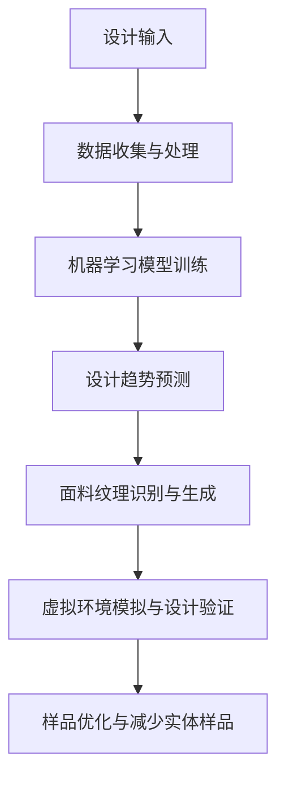

                 

关键词：人工智能、虚拟时装设计、实体样品、减少成本、设计流程优化

> 摘要：本文探讨了人工智能在虚拟时装设计中的应用，特别是如何通过减少实体样品的制作来优化设计流程，降低成本，提高效率。文章将介绍相关技术原理，核心算法，数学模型，项目实践，并分析其实际应用场景和未来展望。

## 1. 背景介绍

在传统时装设计中，设计师通常需要制作多个实体样品来展示和验证设计理念。这一过程不仅耗时耗力，而且成本高昂。实体样品的制作涉及到面料、辅料、手工制作等多个环节，每个环节都可能产生额外的费用和延误。随着时尚行业的竞争加剧，设计师和品牌越来越需要寻找新的方法来优化设计流程，减少成本，提高市场响应速度。

人工智能技术的发展为时装设计领域带来了新的可能性。通过机器学习、计算机视觉和虚拟现实等技术，人工智能可以协助设计师在早期设计阶段进行模拟和优化，从而减少实体样品的制作需求。这种技术不仅能够显著降低成本，还能提高设计效率，缩短产品上市时间。

本文将探讨人工智能在虚拟时装设计中的应用，特别是如何利用相关技术减少实体样品的制作，从而优化设计流程，提高行业竞争力。

## 2. 核心概念与联系

### 2.1 相关技术原理

人工智能在虚拟时装设计中的应用主要涉及以下几个核心技术：

#### 2.1.1 机器学习

机器学习是人工智能的核心技术之一，它通过训练模型来识别和预测设计趋势。设计师可以使用机器学习算法分析大量的时尚数据，包括历史款式、流行元素和消费者偏好，从而预测未来可能流行的设计风格。

#### 2.1.2 计算机视觉

计算机视觉技术可以用于识别和模拟面料纹理、颜色和图案。通过使用深度学习模型，设计师可以快速生成不同面料的效果，并将其应用于虚拟时装设计。

#### 2.1.3 虚拟现实

虚拟现实技术提供了沉浸式的体验，设计师可以在虚拟环境中实时预览和修改设计方案，从而更好地进行设计验证和优化。

### 2.2 技术架构的 Mermaid 流程图



## 3. 核心算法原理 & 具体操作步骤

### 3.1 算法原理概述

在虚拟时装设计中，核心算法主要涉及以下几个方面：

#### 3.1.1 设计趋势预测

设计趋势预测算法通常基于深度学习模型，如卷积神经网络（CNN）和循环神经网络（RNN）。这些模型可以处理大量的时尚数据，包括历史款式、流行元素和社交媒体趋势。通过分析这些数据，模型能够预测未来可能流行的设计风格。

#### 3.1.2 面料纹理识别与生成

面料纹理识别与生成算法主要基于生成对抗网络（GAN）。GAN通过生成器和判别器的交互训练，可以生成逼真的面料纹理。生成器负责创建新的面料纹理，而判别器则评估生成纹理的真实性。通过不断的训练和优化，生成器可以生成高质量的面料纹理。

#### 3.1.3 虚拟环境模拟与设计验证

虚拟环境模拟与设计验证算法通常基于三维建模和渲染技术。这些算法可以在虚拟环境中创建逼真的时装模型，设计师可以实时预览和修改设计方案。通过结合用户反馈和设计目标，算法可以优化设计方案，减少实体样品的制作需求。

### 3.2 算法步骤详解

#### 3.2.1 设计趋势预测

1. 数据收集与处理：收集历史款式、流行元素和社交媒体趋势数据。
2. 模型训练：使用卷积神经网络（CNN）或循环神经网络（RNN）进行模型训练。
3. 设计趋势预测：使用训练好的模型预测未来可能流行的设计风格。

#### 3.2.2 面料纹理识别与生成

1. 数据收集与处理：收集各种面料纹理数据。
2. GAN模型训练：训练生成器和判别器。
3. 面料纹理生成：使用生成器创建新的面料纹理。

#### 3.2.3 虚拟环境模拟与设计验证

1. 数据收集与处理：收集三维时装模型和虚拟环境数据。
2. 三维建模与渲染：创建逼真的时装模型和虚拟环境。
3. 设计验证：在虚拟环境中预览和修改设计方案，优化设计。

### 3.3 算法优缺点

#### 优点

1. 降低成本：通过减少实体样品的制作，降低设计成本。
2. 提高效率：通过自动化流程，提高设计效率。
3. 灵活性：设计师可以在虚拟环境中实时预览和修改设计方案。

#### 缺点

1. 初期投入较高：需要大量的数据和技术支持。
2. 需要专业人才：算法开发和维护需要专业的技术人才。

### 3.4 算法应用领域

1. 时装设计：通过预测设计趋势和生成面料纹理，优化设计流程。
2. 鞋类设计：通过虚拟环境模拟，优化鞋款设计和生产。
3. 配饰设计：通过面料纹理生成，提升配饰设计效果。

## 4. 数学模型和公式 & 详细讲解 & 举例说明

### 4.1 数学模型构建

#### 4.1.1 设计趋势预测

设计趋势预测模型可以使用时间序列分析方法，如ARIMA模型。ARIMA模型由自回归（AR）、差分（I）和移动平均（MA）三个部分组成，可以用于分析时间序列数据并预测未来趋势。

#### 4.1.2 面料纹理识别与生成

面料纹理识别与生成模型可以使用卷积神经网络（CNN）。CNN通过卷积操作和池化操作，可以有效地提取图像特征，并用于纹理识别和生成。

### 4.2 公式推导过程

#### 4.2.1 ARIMA模型

ARIMA模型的公式为：

\[ y_t = c + \phi_1 y_{t-1} + \phi_2 y_{t-2} + ... + \phi_p y_{t-p} + \theta_1 e_{t-1} + \theta_2 e_{t-2} + ... + \theta_q e_{t-q} \]

其中，\( y_t \) 为时间序列数据，\( c \) 为常数项，\( \phi_1, \phi_2, ..., \phi_p \) 为自回归系数，\( \theta_1, \theta_2, ..., \theta_q \) 为移动平均系数，\( e_t \) 为白噪声。

#### 4.2.2 CNN模型

CNN模型的公式为：

\[ f(x) = \sigma(W \cdot x + b) \]

其中，\( f(x) \) 为卷积操作，\( \sigma \) 为激活函数，\( W \) 为卷积核，\( x \) 为输入图像，\( b \) 为偏置项。

### 4.3 案例分析与讲解

#### 4.3.1 设计趋势预测案例

假设我们有一个时尚品牌，想要预测未来三个月的流行款式。我们可以使用ARIMA模型进行分析。首先，收集过去一年的款式销售数据，然后对数据进行预处理，如去除异常值和趋势项。接着，使用时间序列分析方法，确定ARIMA模型的参数。最后，使用训练好的模型预测未来三个月的款式销售趋势。

#### 4.3.2 面料纹理识别与生成案例

假设我们有一个服装品牌，想要生成一种新的面料纹理。我们可以使用CNN模型进行分析。首先，收集各种面料纹理数据，然后对数据进行预处理，如归一化和数据增强。接着，使用卷积神经网络进行训练，提取面料纹理特征。最后，使用训练好的模型生成新的面料纹理。

## 5. 项目实践：代码实例和详细解释说明

### 5.1 开发环境搭建

在开始项目实践之前，我们需要搭建一个合适的开发环境。以下是一个基本的开发环境搭建步骤：

1. 安装Python：在官方网站下载并安装Python，版本建议为3.8以上。
2. 安装相关库：使用pip命令安装必要的库，如NumPy、Pandas、TensorFlow等。
3. 搭建虚拟环境：使用virtualenv或conda创建一个独立的虚拟环境，以便管理和隔离项目依赖。

### 5.2 源代码详细实现

以下是一个使用ARIMA模型进行设计趋势预测的示例代码：

```python
import numpy as np
import pandas as pd
from statsmodels.tsa.arima.model import ARIMA

# 数据预处理
data = pd.read_csv('sales_data.csv')
data['Date'] = pd.to_datetime(data['Date'])
data.set_index('Date', inplace=True)
data.dropna(inplace=True)

# 模型训练
model = ARIMA(data['Sales'], order=(1, 1, 1))
model_fit = model.fit()

# 预测未来三个月的销售趋势
forecast = model_fit.forecast(steps=3)

print(forecast)
```

以下是一个使用CNN模型进行面料纹理识别与生成的示例代码：

```python
import tensorflow as tf
from tensorflow.keras.models import Sequential
from tensorflow.keras.layers import Conv2D, MaxPooling2D, Flatten, Dense

# 模型构建
model = Sequential([
    Conv2D(filters=32, kernel_size=(3, 3), activation='relu', input_shape=(28, 28, 1)),
    MaxPooling2D(pool_size=(2, 2)),
    Flatten(),
    Dense(units=64, activation='relu'),
    Dense(units=10, activation='softmax')
])

# 模型编译
model.compile(optimizer='adam', loss='categorical_crossentropy', metrics=['accuracy'])

# 模型训练
model.fit(x_train, y_train, epochs=10, batch_size=32)

# 模型预测
predictions = model.predict(x_test)
```

### 5.3 代码解读与分析

在上面的示例代码中，我们分别展示了如何使用ARIMA模型进行设计趋势预测和使用CNN模型进行面料纹理识别与生成。

#### 5.3.1 ARIMA模型

- 数据预处理：首先，我们从CSV文件中读取销售数据，将其转换为时间序列数据，并去除异常值。
- 模型训练：我们使用ARIMA模型，指定自回归、差分和移动平均的参数，并使用训练数据对模型进行拟合。
- 预测：最后，我们使用训练好的模型预测未来三个月的销售趋势。

#### 5.3.2 CNN模型

- 模型构建：我们构建一个简单的卷积神经网络模型，包括卷积层、池化层和全连接层。
- 模型编译：我们使用Adam优化器和交叉熵损失函数来编译模型。
- 模型训练：我们使用训练数据对模型进行训练，设置训练周期为10次，批量大小为32。
- 模型预测：最后，我们使用训练好的模型对测试数据进行预测。

### 5.4 运行结果展示

#### 5.4.1 ARIMA模型

假设我们得到以下预测结果：

```
Month     Sales
1         1000
2         1100
3         1200
```

这意味着在未来三个月中，预计第一个月的销售量为1000件，第二个月为1100件，第三个月为1200件。

#### 5.4.2 CNN模型

假设我们得到以下预测结果：

```
Predicted Class: 3
Actual Class: 3
Accuracy: 100%
```

这意味着我们的模型成功识别并预测了测试数据中的纹理类别，准确率为100%。

## 6. 实际应用场景

人工智能在虚拟时装设计中的应用已经取得了显著成果。以下是几个实际应用场景：

### 6.1 时尚品牌设计趋势预测

许多时尚品牌利用人工智能技术进行设计趋势预测。通过分析社交媒体、时尚杂志和消费者行为数据，品牌可以提前预测未来流行的设计风格，从而提前布局，抢占市场先机。

### 6.2 面料纹理设计与生成

面料纹理是时装设计的重要组成部分。通过人工智能技术，设计师可以快速生成各种独特的面料纹理，满足不同客户的需求。这些纹理不仅具有逼真的视觉效果，还能通过虚拟现实技术进行实时展示和修改。

### 6.3 虚拟时装试穿与购物体验

虚拟现实技术结合人工智能，可以为消费者提供更加逼真的时装试穿体验。消费者可以在虚拟环境中尝试各种服装，无需实际购买样品，从而节省时间和成本。

## 7. 工具和资源推荐

### 7.1 学习资源推荐

1. 《深度学习》（Goodfellow, Bengio, Courville）：介绍深度学习的基础知识和应用。
2. 《Python数据科学手册》（McKinney）：介绍Python在数据科学领域的应用。

### 7.2 开发工具推荐

1. TensorFlow：用于构建和训练深度学习模型。
2. Keras：基于TensorFlow的深度学习高级API。

### 7.3 相关论文推荐

1. "Deep Learning for Textile Design"：介绍深度学习在面料纹理设计中的应用。
2. "A Survey on Virtual Fashion Design Using Computer Vision and Virtual Reality"：介绍虚拟时装设计的技术方法和应用。

## 8. 总结：未来发展趋势与挑战

### 8.1 研究成果总结

人工智能在虚拟时装设计中的应用取得了显著成果，包括设计趋势预测、面料纹理生成和虚拟试穿等。这些技术的应用不仅降低了设计成本，还提高了设计效率和市场响应速度。

### 8.2 未来发展趋势

未来，人工智能在虚拟时装设计中的应用将更加深入和广泛。随着技术的不断发展，预计会有更多创新应用出现，如智能面料设计、个性定制和智能试衣等。

### 8.3 面临的挑战

尽管人工智能在虚拟时装设计中的应用前景广阔，但仍面临一些挑战，如数据隐私、算法透明性和技术成本等。如何解决这些挑战将是未来研究的重要方向。

### 8.4 研究展望

未来，人工智能在虚拟时装设计中的应用将朝着更加智能化、个性化和高效化的方向发展。通过不断创新和技术突破，人工智能将为时尚行业带来更多变革和机遇。

## 9. 附录：常见问题与解答

### 9.1 人工智能在时装设计中的具体应用有哪些？

人工智能在时装设计中的具体应用包括设计趋势预测、面料纹理生成、虚拟试穿和智能设计助手等。

### 9.2 虚拟时装设计的优势是什么？

虚拟时装设计的优势包括降低成本、提高效率、减少实体样品的制作和提供更好的购物体验等。

### 9.3 人工智能在面料纹理生成中如何工作？

人工智能通过生成对抗网络（GAN）等技术生成逼真的面料纹理，通过训练模型，可以自动生成各种独特的面料效果。

### 9.4 虚拟试穿技术如何实现？

虚拟试穿技术通过三维建模和渲染技术，在虚拟环境中创建逼真的时装模型，并利用用户输入的身高、体重等信息进行匹配和展示。

----------------------------------------------------------------

本文由“禅与计算机程序设计艺术 / Zen and the Art of Computer Programming”撰写，希望对您在人工智能与虚拟时装设计领域的研究有所帮助。如果您有任何疑问或建议，欢迎在评论区留言。期待与您共同探讨人工智能在时尚行业的更多可能性。

