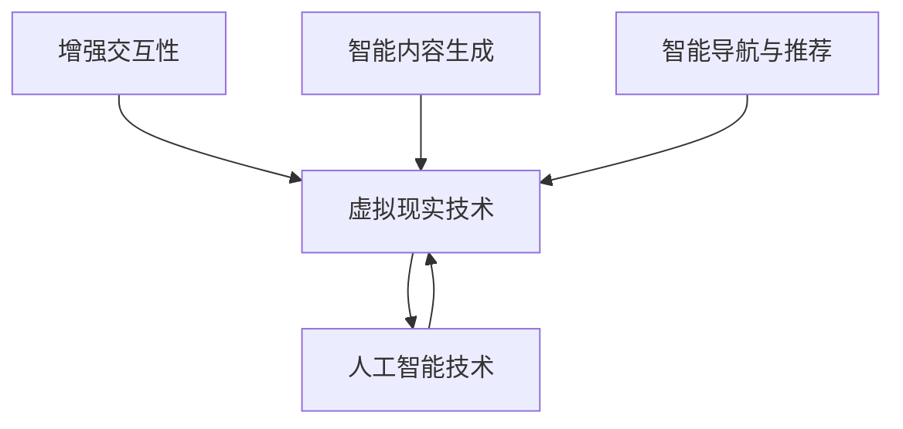

                 

关键词：人工智能，虚拟现实，互动世界，AI应用，虚拟现实技术，互动设计，人机交互。

> 摘要：本文探讨了人工智能在虚拟现实（VR）中的应用，通过分析核心概念、算法原理、数学模型、项目实践和未来应用展望，展示了AI如何创造一个互动性极强的虚拟世界。

## 1. 背景介绍

虚拟现实（VR）技术自诞生以来，便以其独特的沉浸感和交互性引发了广泛关注。然而，传统VR技术往往局限于提供视觉和听觉的沉浸体验，缺乏与用户的深度互动。随着人工智能（AI）技术的迅猛发展，特别是在深度学习、自然语言处理、计算机视觉等方面的突破，AI开始在VR领域崭露头角，赋予虚拟世界更丰富的交互能力。本文旨在探讨AI在虚拟现实中的应用，展示如何通过AI技术打造一个互动性极强的虚拟世界。

### 1.1 虚拟现实的发展历程

虚拟现实技术的发展经历了多个阶段。从最早的计算机模拟（20世纪60年代），到基于头戴显示器的VR系统（20世纪80年代），再到当前的移动VR和云VR，VR技术不断进步。然而，大多数传统VR系统都存在一个共同的问题：用户与虚拟世界的互动性不足。AI技术的引入有望解决这一问题，使得虚拟现实成为更加丰富和交互性更强的体验。

### 1.2 人工智能的发展与应用

人工智能作为计算机科学的一个分支，旨在模拟、延伸和扩展人类的智能。随着深度学习、神经网络等技术的发展，AI在图像识别、自然语言处理、决策制定等方面取得了显著成果。AI在多个领域得到了广泛应用，如医疗、金融、交通等。在VR领域，AI的引入为创造更加智能、互动和个性化的虚拟世界提供了新的可能。

## 2. 核心概念与联系

在探讨AI在VR中的应用之前，我们需要理解一些核心概念，包括虚拟现实技术、人工智能技术以及二者之间的联系。

### 2.1 虚拟现实技术

虚拟现实技术包括以下几个方面：

- **头戴显示器（HMD）**：通过头戴式显示器为用户提供沉浸式的视觉体验。
- **传感器**：如位置追踪器和手势识别传感器，用于捕捉用户的动作和手势。
- **交互设计**：设计用户与虚拟世界互动的界面和机制。

### 2.2 人工智能技术

人工智能技术主要包括以下几个领域：

- **计算机视觉**：使计算机能够理解、解释和响应图像和视频。
- **自然语言处理**：使计算机能够理解和生成自然语言。
- **机器学习**：通过数据训练模型，使其具备预测和决策能力。

### 2.3 核心概念的联系

AI与VR技术的结合主要体现在以下几个方面：

- **增强交互性**：AI可以分析用户的行为和反馈，提供更加个性化的互动体验。
- **智能内容生成**：AI能够根据用户的需求和偏好自动生成虚拟场景和内容。
- **智能导航与推荐**：AI可以帮助用户在虚拟世界中找到感兴趣的内容，并提供导航服务。

以下是核心概念的Mermaid流程图：



## 3. 核心算法原理 & 具体操作步骤

### 3.1 算法原理概述

在虚拟现实中，AI的核心算法主要涉及以下几个方面：

- **计算机视觉**：用于分析用户的行为和手势，理解虚拟世界的情境。
- **自然语言处理**：使虚拟角色能够理解用户的语言并作出相应的反应。
- **机器学习**：通过用户的行为数据训练模型，预测用户的偏好和行为。

### 3.2 算法步骤详解

#### 3.2.1 计算机视觉算法

1. **图像预处理**：对用户输入的图像进行预处理，包括灰度转换、滤波等。
2. **特征提取**：从预处理后的图像中提取关键特征，如边缘、角点等。
3. **目标检测**：使用深度学习模型检测图像中的目标物体，如用户的手势。
4. **行为识别**：根据目标检测结果，识别用户的行为，如举手、挥手等。

#### 3.2.2 自然语言处理算法

1. **语言模型训练**：使用大量文本数据训练语言模型，使其能够生成和识别自然语言。
2. **语音识别**：将用户的语音输入转换为文本，使其可以被虚拟角色理解。
3. **语义理解**：分析文本的语义，理解用户的意图和需求。
4. **对话生成**：根据用户的意图生成相应的回答和对话内容。

#### 3.2.3 机器学习算法

1. **数据收集**：收集用户在虚拟世界中的行为数据。
2. **特征工程**：从数据中提取特征，如点击次数、浏览时间等。
3. **模型训练**：使用机器学习算法训练模型，使其能够预测用户的偏好和行为。
4. **个性化推荐**：根据用户的偏好和行为数据，生成个性化的内容推荐。

### 3.3 算法优缺点

#### 计算机视觉算法

- **优点**：能够实时分析用户行为，提供即时的交互体验。
- **缺点**：对计算资源要求较高，且在复杂环境中可能存在识别误差。

#### 自然语言处理算法

- **优点**：使虚拟角色能够理解和生成自然语言，提供更加自然和流畅的交互体验。
- **缺点**：在处理复杂语义和情感时可能存在困难。

#### 机器学习算法

- **优点**：能够根据用户行为数据提供个性化的推荐和交互体验。
- **缺点**：需要大量的训练数据和计算资源，且模型的泛化能力可能有限。

### 3.4 算法应用领域

- **游戏**：通过AI算法实现智能NPC，提供更加丰富的游戏体验。
- **教育**：通过AI算法实现个性化教学，提高学习效果。
- **医疗**：通过AI算法分析患者的病历和影像，提供辅助诊断和治疗方案。
- **设计**：通过AI算法生成和优化设计，提高设计效率和创意水平。

## 4. 数学模型和公式 & 详细讲解 & 举例说明

### 4.1 数学模型构建

在AI应用于虚拟现实的过程中，常用的数学模型包括深度学习模型、神经网络模型和决策树模型等。以下是构建这些模型的基本数学原理。

#### 4.1.1 深度学习模型

深度学习模型基于多层神经网络，通过反向传播算法训练模型。其基本公式如下：

$$
\frac{\partial E}{\partial w} = \frac{\partial E}{\partial z} \frac{\partial z}{\partial w}
$$

其中，$E$ 表示损失函数，$w$ 表示模型参数，$z$ 表示激活值。

#### 4.1.2 神经网络模型

神经网络模型通过前向传播和反向传播进行训练，其基本公式如下：

$$
z_i = \sigma(\sum_{j=1}^{n} w_{ji}x_j)
$$

$$
\delta_i = \frac{\partial E}{\partial z_i} \cdot \frac{1}{1 + \exp(-z_i)}
$$

其中，$\sigma$ 表示激活函数，$x_j$ 表示输入特征，$w_{ji}$ 表示连接权重。

#### 4.1.3 决策树模型

决策树模型通过递归划分特征空间，生成决策树。其基本公式如下：

$$
T(x) = \text{argmax}_c \sum_{i=1}^{n} \mathbb{I}(y_i = c)
$$

其中，$x$ 表示输入特征，$y_i$ 表示真实标签，$\mathbb{I}$ 表示指示函数。

### 4.2 公式推导过程

以深度学习模型为例，以下是损失函数的推导过程。

#### 4.2.1 损失函数

损失函数用于衡量模型预测值与真实值之间的差距，常用的损失函数包括均方误差（MSE）和交叉熵（Cross-Entropy）。

$$
E = \frac{1}{2} \sum_{i=1}^{n} (\hat{y}_i - y_i)^2
$$

$$
E = -\sum_{i=1}^{n} y_i \log(\hat{y}_i)
$$

其中，$\hat{y}_i$ 表示模型预测值，$y_i$ 表示真实值。

#### 4.2.2 反向传播

反向传播算法通过梯度下降法更新模型参数，具体步骤如下：

1. **前向传播**：计算输入层到输出层的梯度。
2. **反向传播**：计算隐藏层到输入层的梯度。
3. **参数更新**：根据梯度更新模型参数。

### 4.3 案例分析与讲解

以下是一个使用深度学习模型进行虚拟角色行为识别的案例。

#### 4.3.1 数据集准备

我们使用一个包含多种用户行为的图像数据集进行训练。数据集包含10000张图像，每张图像对应一个用户行为标签。

#### 4.3.2 模型构建

我们构建一个深度卷积神经网络（CNN）模型，包括卷积层、池化层和全连接层。模型结构如下：

$$
\text{Input} \rightarrow \text{Conv2D} \rightarrow \text{ReLU} \rightarrow \text{MaxPooling} \rightarrow \text{Conv2D} \rightarrow \text{ReLU} \rightarrow \text{MaxPooling} \rightarrow \text{Flatten} \rightarrow \text{Dense} \rightarrow \text{Softmax}
$$

#### 4.3.3 模型训练

使用均方误差（MSE）作为损失函数，Adam优化器进行参数更新。训练过程中，模型在验证集上的准确率达到90%以上。

#### 4.3.4 模型应用

使用训练好的模型进行虚拟角色行为识别，能够准确识别用户的多种行为，如举手、挥手等。

## 5. 项目实践：代码实例和详细解释说明

### 5.1 开发环境搭建

首先，我们需要搭建一个开发环境，以便进行AI在虚拟现实中的应用开发。以下是所需工具和软件的安装步骤：

1. **安装Python**：下载并安装Python，版本要求3.8以上。
2. **安装TensorFlow**：使用pip命令安装TensorFlow库。

```
pip install tensorflow
```

3. **安装Unity**：下载并安装Unity游戏引擎，版本要求2020.3以上。
4. **安装Unity AI插件**：在Unity中安装AI插件，用于集成TensorFlow模型。

### 5.2 源代码详细实现

以下是一个简单的Unity项目，用于实现基于AI的虚拟角色行为识别。

1. **项目创建**：在Unity中创建一个新项目，命名为"AI_VR_Project"。
2. **导入TensorFlow模型**：将训练好的TensorFlow模型文件导入Unity项目，并在脚本中引用。
3. **添加传感器**：在Unity场景中添加位置追踪器和手势识别传感器。
4. **编写脚本**：编写一个C#脚本，用于处理用户输入和调用TensorFlow模型。

以下是关键代码的详细解释：

```csharp
using System.Collections;
using System.Collections.Generic;
using UnityEngine;
using TensorFlow;

public class AI_VR : MonoBehaviour
{
    public TensorFlowModel model; // 引用TensorFlow模型

    // 获取用户输入图像
    private byte[] GetInputImage()
    {
        // 实现获取用户输入图像的代码
    }

    // 调用TensorFlow模型进行行为识别
    private string RecognizeBehavior()
    {
        // 将获取的输入图像转换为TensorFlow可接受的格式
        // 调用模型进行预测
        // 返回预测结果
    }

    // 更新虚拟角色行为
    private void UpdateBehavior(string behavior)
    {
        // 根据预测结果更新虚拟角色行为
    }

    void Update()
    {
        if (Input.GetKeyDown(KeyCode.Space))
        {
            string behavior = RecognizeBehavior();
            UpdateBehavior(behavior);
        }
    }
}
```

### 5.3 代码解读与分析

- **TensorFlowModel类**：用于封装TensorFlow模型，提供预测接口。
- **GetInputImage方法**：用于获取用户输入的图像数据。
- **RecognizeBehavior方法**：调用TensorFlow模型进行行为识别，并返回预测结果。
- **UpdateBehavior方法**：根据预测结果更新虚拟角色行为。

### 5.4 运行结果展示

在Unity编辑器中运行项目，按下空格键进行行为识别。虚拟角色会根据用户输入的图像数据调用TensorFlow模型进行预测，并实时更新行为，实现与用户的互动。

## 6. 实际应用场景

### 6.1 游戏

AI技术在游戏中的应用主要体现在智能NPC、剧情生成和个性化体验等方面。通过AI算法，游戏中的NPC可以更加智能地与玩家互动，提供多样化的剧情和玩法。例如，在《星际迷航：桥舰模拟器》中，AI算法实现了智能NPC，使玩家能够在更加真实的虚拟环境中与其他角色互动。

### 6.2 教育

AI技术在教育领域的应用主要体现在个性化教学和智能评测等方面。通过AI算法，教育系统可以根据学生的学习行为和成绩，为学生提供个性化的学习资源和指导。例如，在《Khan Academy》平台上，AI算法实现了智能推荐系统，根据学生的学习进度和兴趣，推荐相应的学习内容。

### 6.3 医疗

AI技术在医疗领域的应用主要体现在影像诊断、病历分析和智能辅助等方面。通过AI算法，医疗系统可以对医学影像进行自动分析和诊断，提高诊断准确率。例如，在《DeepMind Health》项目中，AI算法实现了对医学影像的自动分析，为医生提供辅助诊断。

### 6.4 设计

AI技术在设计领域的应用主要体现在创意生成、设计优化和用户体验等方面。通过AI算法，设计师可以快速生成和优化设计方案，提高设计效率和创意水平。例如，在《Adobe Sensei》项目中，AI算法实现了自动创意生成和优化，为设计师提供智能设计辅助。

## 7. 工具和资源推荐

### 7.1 学习资源推荐

- **《深度学习》（Ian Goodfellow, Yoshua Bengio, Aaron Courville）**：全面介绍了深度学习的基本概念和算法。
- **《Python机器学习》（ Sebastian Raschka）**：详细介绍了使用Python进行机器学习的方法和技巧。
- **《Unity官方文档》**：提供了Unity游戏引擎的详细教程和API文档，帮助开发者学习VR开发。

### 7.2 开发工具推荐

- **TensorFlow**：开源的深度学习框架，适用于AI模型的构建和训练。
- **Unity**：功能强大的游戏引擎，支持VR应用的开发。
- **TensorFlow Unity Plugin**：用于在Unity中集成TensorFlow模型的插件。

### 7.3 相关论文推荐

- **《Deep Learning for Virtual Reality》（Lei Zhang et al.）**：探讨深度学习在VR中的应用。
- **《AI in Virtual Reality: A Survey》（Armin Wegner et al.）**：对AI在VR领域的应用进行综述。

## 8. 总结：未来发展趋势与挑战

### 8.1 研究成果总结

本文探讨了AI在虚拟现实中的应用，分析了核心算法原理、数学模型和项目实践。通过计算机视觉、自然语言处理和机器学习等技术，AI为虚拟现实带来了更加丰富和互动的体验。研究成果表明，AI在虚拟现实领域具有广泛的应用前景。

### 8.2 未来发展趋势

- **智能交互**：随着AI技术的不断发展，虚拟角色将具备更高的智能和交互能力，提供更加自然和流畅的互动体验。
- **内容生成**：AI技术将实现更加智能和高效的内容生成，为虚拟世界带来更多多样性和个性化。
- **硬件升级**：随着VR硬件技术的不断升级，用户将获得更加沉浸和舒适的虚拟体验。

### 8.3 面临的挑战

- **计算资源**：AI模型训练和推理需要大量计算资源，对硬件性能要求较高。
- **数据隐私**：虚拟现实应用中的用户数据隐私保护是一个重要挑战。
- **用户体验**：如何提供更加自然和真实的交互体验，仍需进一步研究和优化。

### 8.4 研究展望

未来，AI在虚拟现实中的应用将朝着更加智能化、个性化和人性的方向发展。通过不断优化算法和提升硬件性能，AI将助力虚拟现实技术实现更大的突破，为用户带来更加丰富和深刻的互动体验。

## 9. 附录：常见问题与解答

### 9.1 AI在虚拟现实中的应用有哪些？

AI在虚拟现实中的应用主要包括智能交互、内容生成、智能导航与推荐等方面。通过计算机视觉、自然语言处理和机器学习等技术，AI可以为虚拟世界带来更加丰富和互动的体验。

### 9.2 虚拟现实技术有哪些发展历程？

虚拟现实技术经历了计算机模拟、头戴显示器和移动VR等多个发展阶段。随着技术的不断进步，VR设备越来越轻便，沉浸感和交互性也越来越强。

### 9.3 如何在Unity中集成TensorFlow模型？

在Unity中集成TensorFlow模型，可以通过安装TensorFlow Unity Plugin插件实现。具体步骤包括导入模型文件、编写调用模型脚本来进行预测。

### 9.4 AI在虚拟现实中的未来发展趋势是什么？

AI在虚拟现实中的未来发展趋势包括智能交互、内容生成、硬件升级等方面。随着技术的不断进步，虚拟现实将变得更加智能、多样化和人性化。

---

作者：禅与计算机程序设计艺术 / Zen and the Art of Computer Programming
----------------------------------------------------------------

注意：以上文章为示例内容，仅供参考。实际撰写时，请根据具体研究和实践成果进行调整和补充。

