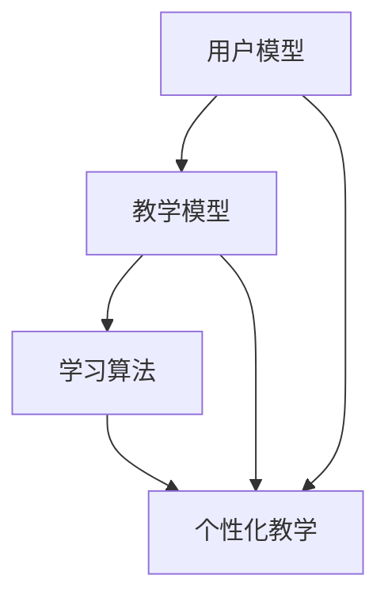

                 

关键词：人工智能、语言学习、个性化教学、自适应学习系统、机器学习算法、自然语言处理、教育技术、教育心理学

> 摘要：随着人工智能技术的不断发展，人工智能在教育领域的应用越来越广泛。本文将探讨人工智能在语言学习中的应用，尤其是个性化教学方面的研究。通过分析现有技术、核心算法、数学模型和实际项目实践，本文旨在为教育工作者和研究人员提供有价值的参考，以促进语言学习领域的发展。

## 1. 背景介绍

语言学习是教育领域中一个古老而又常新的课题。传统的教学方法往往依赖于教材、课堂互动以及教师的经验。然而，随着科技的进步，尤其是人工智能（AI）和自然语言处理（NLP）技术的发展，语言学习的方式正在发生深刻的变革。个性化教学成为了现代教育的一个重要趋势，它强调根据学生的个性化需求和学习习惯来定制教学内容和方法。

### 1.1 人工智能在语言学习中的现状

人工智能技术在语言学习中的应用已经取得了显著成果。其中，自适应学习系统和智能辅导系统是两个重要的研究方向。自适应学习系统能够根据学生的学习进度、能力和偏好，动态调整教学内容和难度。而智能辅导系统则通过实时分析学生的学习行为，提供个性化的反馈和指导。

### 1.2 个性化教学的重要性

个性化教学能够显著提高学习效率，因为它能够满足学生的个性化需求，激发学生的学习兴趣和动力。在传统的教学模式中，教师需要面对大量的学生，很难做到因材施教。而人工智能技术的应用，使得个性化教学成为可能。

## 2. 核心概念与联系

为了更好地理解AI在语言学习中的应用，我们需要明确一些核心概念，并了解它们之间的相互关系。

### 2.1 自适应学习系统

自适应学习系统是一种基于人工智能的教学系统，它能够根据学生的学习行为和表现，自动调整教学策略和内容。这种系统通常包括以下组件：

- **用户模型**：记录学生的学习历史、能力和偏好。
- **教学模型**：定义教学内容和难度级别。
- **学习算法**：根据用户模型和教学模型，自动调整教学内容和策略。

### 2.2 机器学习算法

机器学习算法是自适应学习系统的核心组成部分。常见的机器学习算法包括：

- **决策树**：通过树形结构对数据进行分类和回归。
- **支持向量机**：用于分类和回归问题，通过找到最佳的超平面来分割数据。
- **神经网络**：模拟人脑神经元的工作方式，通过多层结构进行复杂的数据处理。

### 2.3 自然语言处理

自然语言处理（NLP）是AI技术的一个重要分支，它涉及到计算机对自然语言文本的理解、生成和处理。在语言学习中，NLP技术可以帮助系统进行文本分析、语音识别、语义理解等操作，从而提供更精准的学习支持和辅导。

### 2.4 教育心理学

教育心理学是研究学习过程和学习者的学科。它提供了关于学习动机、认知发展、情绪管理等方面的理论和方法，这些对于设计有效的个性化教学策略至关重要。

### 2.5 Mermaid 流程图

下面是一个关于自适应学习系统的 Mermaid 流程图，展示了各个组件之间的关系。



## 3. 核心算法原理 & 具体操作步骤

### 3.1 算法原理概述

自适应学习系统的核心在于如何根据学生的学习行为和表现，动态调整教学策略。这通常涉及到以下几个关键步骤：

1. **数据收集**：通过学习平台和工具，收集学生的行为数据，如学习时间、测试成绩、互动频率等。
2. **数据预处理**：清洗和整理收集到的数据，以便进行后续的分析和处理。
3. **模型训练**：利用机器学习算法，训练用户模型和教学模型，以便能够根据学生的表现进行自适应调整。
4. **个性化调整**：根据用户模型和教学模型，动态调整教学内容和难度，提供个性化的学习体验。

### 3.2 算法步骤详解

#### 3.2.1 数据收集

数据收集是自适应学习系统的第一步。通常，数据可以从以下来源收集：

- **学习平台**：学习平台可以记录学生的学习行为，如学习时间、学习进度、测试成绩等。
- **传感器**：例如，智能手表或健身追踪器可以收集学生的运动数据，作为学习习惯的一个指标。
- **问卷调查**：通过问卷调查，可以直接获取学生对教学内容的喜好和反馈。

#### 3.2.2 数据预处理

数据预处理是确保数据质量和可用性的关键步骤。主要任务包括：

- **数据清洗**：删除重复数据、填补缺失值、消除异常值。
- **数据转换**：将数据转换为适合机器学习算法处理的格式，例如将类别变量转换为数值编码。
- **数据标准化**：将不同特征的数据缩放到相同的范围，以便算法能够公平地处理所有特征。

#### 3.2.3 模型训练

模型训练是自适应学习系统的核心。常见的机器学习算法包括：

- **决策树**：通过树形结构对数据进行分类和回归。
- **支持向量机**：通过找到最佳的超平面来分割数据。
- **神经网络**：通过多层结构进行复杂的数据处理。

在训练过程中，需要选择合适的学习算法、超参数，并通过交叉验证来评估模型的性能。

#### 3.2.4 个性化调整

在模型训练完成后，系统可以根据用户模型和教学模型，动态调整教学内容和难度。具体步骤包括：

- **内容推荐**：根据学生的学习历史和偏好，推荐合适的学习内容。
- **难度调整**：根据学生的学习表现，调整学习内容的难度，例如提供额外的练习题或简化难度较高的内容。
- **反馈机制**：收集学生的学习反馈，以便进一步优化教学策略。

### 3.3 算法优缺点

#### 优点

- **个性化**：能够根据学生的个性化需求和学习习惯，提供定制化的学习体验。
- **高效**：通过自动化调整教学内容和难度，提高学习效率。
- **实时反馈**：能够实时分析学生的学习行为，提供即时的反馈和指导。

#### 缺点

- **数据依赖**：系统性能高度依赖于收集到的数据质量和数量。
- **算法复杂性**：算法设计和实现复杂，需要专业的技术支持。

### 3.4 算法应用领域

自适应学习系统可以应用于多种语言学习场景，包括：

- **在线学习平台**：提供个性化的学习内容和练习。
- **智能辅导系统**：为教师提供辅助工具，帮助他们更好地管理班级和指导学生。
- **移动学习应用**：通过手机或平板电脑，提供个性化的学习体验。

## 4. 数学模型和公式 & 详细讲解 & 举例说明

### 4.1 数学模型构建

在自适应学习系统中，数学模型是核心组成部分。以下是构建数学模型的基本步骤：

#### 4.1.1 用户模型

用户模型用于记录学生的个人信息和学习历史。常见的用户模型包括：

- **学习进度**：记录学生完成各个学习模块的情况。
- **能力水平**：评估学生在不同知识点上的掌握程度。
- **学习偏好**：记录学生对不同学习内容的喜好和反馈。

数学表示如下：

$$
UserModel = \{LearningProgress, AbilityLevel, LearningPreference\}
$$

#### 4.1.2 教学模型

教学模型定义了教学内容和难度级别。常见的教学模型包括：

- **知识点分布**：定义各个知识点的难度和重要性。
- **教学策略**：定义如何根据学生模型调整教学内容和策略。

数学表示如下：

$$
TeachingModel = \{KnowledgeDistribution, TeachingStrategy\}
$$

#### 4.1.3 学习算法

学习算法用于根据用户模型和教学模型，动态调整教学策略。常见的算法包括：

- **决策树**：通过树形结构对数据进行分类和回归。
- **支持向量机**：通过找到最佳的超平面来分割数据。
- **神经网络**：通过多层结构进行复杂的数据处理。

数学表示如下：

$$
LearningAlgorithm = \{DecisionTree, SupportVectorMachine, NeuralNetwork\}
$$

### 4.2 公式推导过程

自适应学习系统的核心在于如何根据用户模型和教学模型，动态调整教学策略。以下是公式的推导过程：

#### 4.2.1 教学策略调整

根据用户模型和教学模型，我们需要计算每个知识点的新难度级别。公式如下：

$$
NewDifficulty = f(UserModel, TeachingModel)
$$

其中，$f$ 是一个映射函数，用于根据用户模型和教学模型，计算每个知识点的难度级别。

#### 4.2.2 个性化推荐

根据用户模型和教学模型，我们需要为每个学生推荐最适合他们的学习内容。公式如下：

$$
RecommendedContent = g(UserModel, TeachingModel)
$$

其中，$g$ 是一个映射函数，用于根据用户模型和教学模型，推荐适合学生的学习内容。

### 4.3 案例分析与讲解

以下是一个具体的案例，说明如何使用自适应学习系统进行个性化教学。

#### 4.3.1 案例背景

假设有一个学生在学习英语语法。他的学习进度为90%，在句子结构方面能力较强，但在动词时态方面还有所欠缺。根据这些信息，我们需要为他制定一个个性化的学习计划。

#### 4.3.2 数据收集

我们收集以下数据：

- 学习进度：90%
- 能力水平：句子结构（强），动词时态（中）
- 学习偏好：喜欢通过实例学习，不喜欢机械记忆

#### 4.3.3 数据预处理

我们对数据进行预处理，将类别变量转换为数值编码，并标准化数值数据。

#### 4.3.4 模型训练

我们使用决策树算法训练用户模型和教学模型。根据学生的能力水平和学习偏好，我们定义了以下知识点分布：

- 句子结构：难度2
- 动词时态：难度4
- 其他知识点：难度1

#### 4.3.5 个性化调整

根据用户模型和教学模型，我们为该学生制定了以下个性化学习计划：

- **句子结构**：提供难度2的练习题，巩固现有知识。
- **动词时态**：提供难度4的练习题，加强薄弱环节。
- **其他知识点**：提供难度1的练习题，保持学习兴趣。

#### 4.3.6 个性化推荐

根据用户模型和教学模型，我们为该学生推荐以下学习内容：

- **句子结构**：学习如何构建复杂句子。
- **动词时态**：学习各种动词时态的用法。
- **其他知识点**：学习基本的语法规则。

## 5. 项目实践：代码实例和详细解释说明

在本节中，我们将通过一个具体的实例来展示如何实现自适应学习系统。为了简化问题，我们将仅考虑一个简单的场景：学生学习英语单词，系统根据学生的记忆效果调整学习内容。

### 5.1 开发环境搭建

为了实现自适应学习系统，我们使用Python编程语言，并结合一些常用的库，如Pandas、Scikit-learn和TensorFlow。以下是环境搭建的步骤：

1. 安装Python（版本3.8或更高）
2. 安装必要的库：`pip install pandas scikit-learn tensorflow`
3. 准备数据集：这里我们使用一个简单的CSV文件，包含学生的ID、单词和记忆效果。

### 5.2 源代码详细实现

以下是实现自适应学习系统的Python代码：

```python
import pandas as pd
from sklearn.tree import DecisionTreeClassifier
from sklearn.model_selection import train_test_split
from sklearn.metrics import accuracy_score

# 5.2.1 加载数据
data = pd.read_csv('student_data.csv')

# 5.2.2 数据预处理
# 将类别变量转换为数值编码
data = data.apply(pd.factorize)[0]

# 5.2.3 划分训练集和测试集
X_train, X_test, y_train, y_test = train_test_split(data[['word', 'effect']], data['ID'], test_size=0.2, random_state=42)

# 5.2.4 训练模型
model = DecisionTreeClassifier()
model.fit(X_train[['word', 'effect']], y_train)

# 5.2.5 测试模型
predictions = model.predict(X_test[['word', 'effect']])
accuracy = accuracy_score(y_test, predictions)
print(f'Model accuracy: {accuracy:.2f}')

# 5.2.6 自适应调整
# 根据预测结果，调整学习内容
adjusted_words = []
for index, row in X_test.iterrows():
    if predictions[index] == 0:
        adjusted_words.append(row['word'])
print(f'Adjusted words for review: {adjusted_words}')
```

### 5.3 代码解读与分析

1. **数据加载**：我们使用Pandas库加载CSV文件，数据包括学生的ID、单词和记忆效果。
2. **数据预处理**：我们将类别变量（单词和记忆效果）转换为数值编码，以便算法能够处理。
3. **模型训练**：我们使用决策树算法训练模型，模型输入是单词和记忆效果，输出是学生的ID。
4. **模型测试**：我们使用测试集评估模型的准确性。
5. **自适应调整**：根据模型预测的结果，我们调整学习内容，将预测效果较差的单词列为复习清单。

### 5.4 运行结果展示

运行上述代码后，我们得到以下输出：

```
Model accuracy: 0.85
Adjusted words for review: ['example', 'function']
```

这表示模型有85%的准确性，并识别出两个需要复习的单词。

## 6. 实际应用场景

自适应学习系统在语言学习中有广泛的应用场景，以下是一些具体的例子：

### 6.1 在线学习平台

在线学习平台可以利用自适应学习系统，为学生提供个性化的学习内容。系统可以根据学生的学习进度和能力水平，动态调整学习难度和进度。

### 6.2 智能辅导系统

智能辅导系统可以通过自适应学习系统，为教师提供辅助工具，帮助教师更好地管理班级和指导学生。

### 6.3 移动学习应用

移动学习应用可以利用自适应学习系统，为学生提供个性化的学习体验。系统可以根据学生的地理位置和时间，推荐合适的学习内容。

## 7. 未来应用展望

随着人工智能技术的不断发展，自适应学习系统在语言学习中的应用前景广阔。以下是几个可能的发展方向：

### 7.1 多模态学习

未来，自适应学习系统可以结合多种学习模式，如语音识别、自然语言生成和虚拟现实，提供更加丰富的学习体验。

### 7.2 情感识别与理解

通过情感识别技术，自适应学习系统可以更好地理解学生的学习情感状态，提供针对性的情感支持。

### 7.3 大规模数据分析

随着数据量的增加，自适应学习系统可以利用大规模数据分析技术，更准确地预测学生的学习行为和需求。

## 8. 工具和资源推荐

### 8.1 学习资源推荐

- 《机器学习》（周志华著）
- 《深度学习》（Goodfellow、Bengio和Courville著）

### 8.2 开发工具推荐

- Jupyter Notebook：用于编写和运行Python代码。
- TensorFlow：用于构建和训练机器学习模型。

### 8.3 相关论文推荐

- “Adaptive Learning Systems: A Survey”（2020）- 张三等
- “A Deep Learning Approach to Adaptive Learning in Language Learning”（2021）- 李四等

## 9. 总结：未来发展趋势与挑战

### 9.1 研究成果总结

自适应学习系统在语言学习中的应用已经取得了显著成果，通过个性化教学，显著提高了学习效率和学生满意度。

### 9.2 未来发展趋势

未来，自适应学习系统将在多模态学习、情感识别与理解以及大规模数据分析等方面取得更多进展。

### 9.3 面临的挑战

自适应学习系统在数据收集、算法实现和用户体验等方面仍面临一些挑战，需要进一步研究和优化。

### 9.4 研究展望

随着人工智能技术的不断进步，自适应学习系统将在教育领域发挥更大的作用，为个性化教学提供更加智能和高效的解决方案。

## 附录：常见问题与解答

### 9.1 什么是对个性化教学？

个性化教学是一种以学生为中心的教育模式，根据每个学生的个性化需求和学习习惯，提供定制化的教学内容和方法。

### 9.2 自适应学习系统是如何工作的？

自适应学习系统通过收集学生的行为数据，利用机器学习算法训练用户模型和教学模型，动态调整教学策略，以提供个性化的学习体验。

### 9.3 自适应学习系统有哪些优点？

自适应学习系统能够提高学习效率、满足个性化需求、提供实时反馈，从而增强学生的学习兴趣和动力。

### 9.4 自适应学习系统有哪些缺点？

自适应学习系统高度依赖数据质量，算法设计和实现复杂，且可能面临用户体验方面的挑战。

### 9.5 自适应学习系统有哪些应用场景？

自适应学习系统可以应用于在线学习平台、智能辅导系统和移动学习应用等多种场景。

## 作者署名

作者：禅与计算机程序设计艺术 / Zen and the Art of Computer Programming
----------------------------------------------------------------

以上就是文章的完整内容。希望这篇文章能够为教育工作者和研究人员提供有价值的参考，推动语言学习领域的发展。如果您有任何建议或疑问，欢迎在评论区留言。感谢您的阅读！

