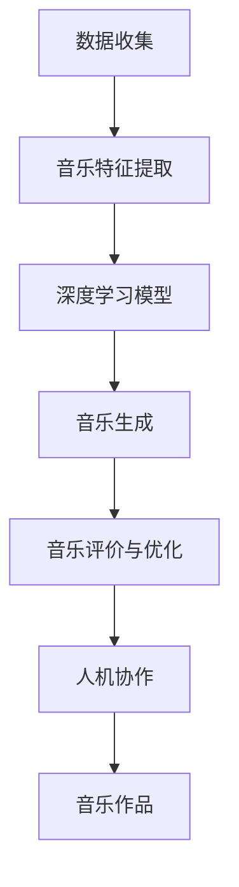

                 

关键词：人工智能、音乐创作、人机协作、自然语言处理、深度学习、音乐生成、算法应用、数学模型、代码实例、未来展望

> 摘要：本文深入探讨了人工智能在音乐创作中的应用，重点介绍了人机协作模式下的音乐创作新方式。通过阐述核心概念、算法原理、数学模型、项目实践和未来展望，本文旨在为读者提供一个全面了解AI音乐创作的视角，并激发更多创新和可能性。

## 1. 背景介绍

### 1.1 音乐创作的历史与现状

音乐是人类文化和情感表达的重要载体，自古以来，音乐创作一直是艺术家们追求的艺术形式。然而，随着科技的进步，尤其是人工智能（AI）技术的发展，音乐创作正迎来前所未有的变革。

在过去的几十年中，音乐创作主要依赖于人类艺术家的创造力与技巧。作曲家通过传统的作曲手法，如和声、旋律和节奏的编排，创作出各种风格的音乐作品。这种创作模式虽然充满了艺术的魅力，但也存在许多限制。例如，音乐家在创作过程中可能会遇到灵感不足或技巧局限的问题，导致创作周期延长，甚至无法完成某些复杂的音乐作品。

### 1.2 人工智能在音乐创作中的应用

随着人工智能技术的不断发展，计算机在音乐创作中的应用逐渐增多。早期的研究主要集中在音乐识别、分析和标注等领域，例如利用神经网络进行音高和节奏的识别。然而，随着深度学习技术的进步，人工智能在音乐创作方面的潜力得到了进一步挖掘。

目前，人工智能在音乐创作中的应用主要包括以下几个方面：

1. **音乐生成**：通过训练深度神经网络，生成新的音乐旋律、和声和节奏。
2. **音乐改编**：将现有的音乐作品进行风格转换或结构重构。
3. **音乐辅助创作**：提供作曲建议、优化音乐结构、自动填充缺失部分等。
4. **音乐情感分析**：分析音乐作品中的情感色彩，为个性化推荐提供依据。

### 1.3 人机协作模式

在人机协作模式下，人工智能与人类音乐家共同参与音乐创作过程，发挥各自的优势。人工智能可以通过大量的数据和算法，快速生成大量候选音乐作品，而人类艺术家则可以利用自己的创造力和审美观，对这些作品进行筛选、修改和完善。

人机协作模式不仅提高了音乐创作的效率，也拓展了音乐创作的可能性。通过结合人工智能的算法和人类艺术家的灵感，创作出更多风格多样、富有创意的音乐作品。

## 2. 核心概念与联系

为了深入理解AI在音乐创作中的应用，我们需要先了解一些核心概念和它们之间的联系。以下是一个简化的Mermaid流程图，展示了音乐创作过程中涉及的关键节点和概念。



### 2.1 数据收集

音乐创作的基础是数据。这些数据包括现有的音乐作品、音频信号、乐谱等。数据的质量和多样性直接影响人工智能在音乐生成中的表现。因此，数据收集是整个流程的第一步。

### 2.2 音乐特征提取

在数据收集完成后，我们需要对音乐进行特征提取。特征提取是将音频信号转化为机器可以理解和处理的形式。常见的音乐特征包括音高、节奏、和声、音色等。

### 2.3 深度学习模型

深度学习模型是人工智能在音乐创作中的核心。通过训练大量的音乐数据，深度学习模型可以学会生成新的音乐旋律、和声和节奏。常见的深度学习模型包括生成对抗网络（GAN）、变分自编码器（VAE）和递归神经网络（RNN）等。

### 2.4 音乐生成

在音乐生成环节，深度学习模型利用提取的特征，生成新的音乐作品。这一过程可以看作是从大量候选音乐片段中，选择出符合人类音乐审美标准的作品。

### 2.5 音乐评价与优化

生成的音乐作品需要经过评价和优化。这一步骤主要通过人类艺术家的反馈进行。评价标准包括音乐的流畅性、情感表达、创新性等。根据评价结果，可以对音乐作品进行进一步的修改和优化。

### 2.6 人机协作

人机协作是音乐创作中的关键环节。通过结合人工智能的算法和人类艺术家的创造力，可以创造出更加丰富和多样的音乐作品。在这一环节中，人工智能负责生成和优化音乐作品，而人类艺术家则负责审查和调整。

### 2.7 音乐作品

最终生成的音乐作品是整个音乐创作过程的输出。这些作品可以是全新的音乐，也可以是对现有音乐的改编和优化。通过人机协作，我们可以创作出更加符合人类审美和情感需求的音乐作品。

## 3. 核心算法原理 & 具体操作步骤

### 3.1 算法原理概述

在音乐创作中，深度学习算法被广泛应用于音乐生成和优化。以下是几种常用的深度学习算法：

1. **生成对抗网络（GAN）**：GAN是一种由生成器和判别器组成的对抗性网络。生成器负责生成新的音乐片段，而判别器则负责判断生成的音乐片段是否真实。通过不断地训练和优化，生成器可以生成越来越逼真的音乐片段。

2. **变分自编码器（VAE）**：VAE是一种基于概率模型的深度学习算法。它通过将输入数据编码为潜在变量，再解码为输出数据，从而实现数据的降维和生成。在音乐创作中，VAE可以用于生成新的音乐旋律和和声。

3. **递归神经网络（RNN）**：RNN是一种能够处理序列数据的神经网络。在音乐创作中，RNN可以用于生成音乐序列，例如旋律和节奏。RNN通过记忆历史信息，生成连贯且具有逻辑性的音乐片段。

### 3.2 算法步骤详解

以下是使用GAN进行音乐生成的具体操作步骤：

1. **数据准备**：收集大量的音乐作品，并将其转化为机器可以处理的特征数据。

2. **特征提取**：对音乐数据进行特征提取，提取出音高、节奏、和声等音乐特征。

3. **生成器训练**：构建生成器模型，使用特征数据进行训练。生成器的目标是生成逼真的音乐片段。

4. **判别器训练**：构建判别器模型，使用真实音乐片段和生成器生成的音乐片段进行训练。判别器的目标是判断音乐片段的真实性。

5. **交替训练**：生成器和判别器交替进行训练，生成器不断优化生成的音乐片段，而判别器则不断提高对音乐片段真实性的判断能力。

6. **生成音乐**：使用训练好的生成器生成新的音乐片段。这些音乐片段可以是全新的创作，也可以是对现有音乐的改编和优化。

7. **评价与优化**：对生成的音乐片段进行评价和优化。根据人类艺术家的反馈，对音乐片段进行调整和修改，使其更符合人类审美和情感需求。

### 3.3 算法优缺点

**优点**：

1. **高效性**：深度学习算法可以快速生成大量的音乐片段，提高了音乐创作的效率。

2. **多样性**：通过大量的训练数据和复杂的网络结构，生成器可以生成具有丰富多样性的音乐作品。

3. **创造力**：人机协作模式下的音乐创作，可以充分利用人工智能的算法和人类艺术家的创造力，创作出更加独特的音乐作品。

**缺点**：

1. **计算资源消耗**：深度学习算法需要大量的计算资源和时间进行训练和优化。

2. **模型复杂性**：深度学习模型的构建和训练过程较为复杂，需要具备一定的专业知识和技能。

3. **评价标准不明确**：虽然人工智能可以生成大量的音乐片段，但如何评价这些片段的质量和艺术价值仍是一个挑战。

### 3.4 算法应用领域

深度学习算法在音乐创作中的应用非常广泛，以下是几个典型的应用领域：

1. **音乐生成**：通过生成对抗网络（GAN）等算法，生成全新的音乐作品，为音乐创作提供新的灵感。

2. **音乐改编**：将现有的音乐作品进行风格转换或结构重构，创作出新的音乐作品。

3. **音乐辅助创作**：为音乐家提供作曲建议、旋律生成、节奏优化等服务，提高创作效率。

4. **音乐情感分析**：分析音乐作品中的情感色彩，为个性化推荐、音乐治疗等领域提供依据。

## 4. 数学模型和公式 & 详细讲解 & 举例说明

### 4.1 数学模型构建

在音乐创作中，数学模型的应用至关重要。以下是一个简单的数学模型，用于生成音乐旋律。

假设音乐旋律可以用一系列音高表示，音高可以用频率表示。我们可以构建一个基于傅里叶变换的数学模型，用于生成音乐旋律。

$$
M(\theta) = A_0 \sin(2\pi f_0 \theta) + A_1 \sin(2\pi f_1 \theta) + A_2 \sin(2\pi f_2 \theta) + ...
$$

其中，$M(\theta)$ 表示音乐旋律，$A_0, A_1, A_2, ...$ 表示不同频率的振幅，$f_0, f_1, f_2, ...$ 表示不同频率的频率。

### 4.2 公式推导过程

为了推导上述公式，我们可以从简单的正弦波开始，逐步构建复杂的音乐旋律。

1. **单个正弦波**：

假设我们只有一个正弦波，其频率为 $f_0$，振幅为 $A_0$。我们可以表示为：

$$
M_0(\theta) = A_0 \sin(2\pi f_0 \theta)
$$

2. **多个正弦波叠加**：

我们可以将多个正弦波叠加，以生成更复杂的音乐旋律。假设我们有两个正弦波，频率分别为 $f_1$ 和 $f_2$，振幅分别为 $A_1$ 和 $A_2$。我们可以表示为：

$$
M_2(\theta) = A_0 \sin(2\pi f_0 \theta) + A_1 \sin(2\pi f_1 \theta) + A_2 \sin(2\pi f_2 \theta)
$$

3. **傅里叶变换**：

为了更方便地处理复杂的音乐旋律，我们可以使用傅里叶变换。傅里叶变换可以将时间域的信号转化为频率域的信号，从而方便我们分析音乐旋律的频率成分。

$$
M(\theta) = \sum_{i=0}^{\infty} A_i \sin(2\pi f_i \theta)
$$

### 4.3 案例分析与讲解

假设我们要生成一个简单的音乐旋律，包括三个正弦波，频率分别为 440 Hz、550 Hz 和 660 Hz，振幅分别为 0.5、0.3 和 0.2。我们可以使用上述公式进行计算。

$$
M(\theta) = 0.5 \sin(2\pi \times 440 \theta) + 0.3 \sin(2\pi \times 550 \theta) + 0.2 \sin(2\pi \times 660 \theta)
$$

通过计算，我们可以得到一个简单的音乐旋律。我们可以使用音频编辑软件，将这个数学模型转化为音频信号，从而生成音乐作品。

## 5. 项目实践：代码实例和详细解释说明

### 5.1 开发环境搭建

在进行AI音乐创作的项目实践之前，我们需要搭建一个合适的开发环境。以下是一个基本的开发环境搭建步骤：

1. **安装Python**：Python是深度学习领域的主要编程语言，我们需要安装Python 3.8及以上版本。

2. **安装TensorFlow**：TensorFlow是一个开源的深度学习框架，我们可以在终端中使用以下命令安装：

   ```bash
   pip install tensorflow
   ```

3. **安装音频处理库**：为了处理音频信号，我们可以安装以下音频处理库：

   ```bash
   pip install scipy numpy librosa
   ```

4. **配置虚拟环境**：为了更好地管理项目依赖，我们建议使用虚拟环境。可以使用以下命令创建和激活虚拟环境：

   ```bash
   python -m venv myenv
   source myenv/bin/activate
   ```

### 5.2 源代码详细实现

以下是一个简单的基于生成对抗网络（GAN）的音乐生成项目。项目的主要功能是生成一段新的音乐旋律。

```python
import numpy as np
import tensorflow as tf
from tensorflow.keras.models import Sequential
from tensorflow.keras.layers import Dense, Flatten, Conv2D, Conv1D, BatchNormalization, LeakyReLU, Reshape, Input
import librosa

# 数据准备
def prepare_data():
    # 读取音频文件
    audio, _ = librosa.load('audio_example.wav', sr=22050)
    # 归一化音频数据
    audio = audio / 32767.0
    # 转换为二进制数据
    audio_binary = (audio > 0).astype(np.float32)
    return audio_binary

# 生成器模型
def build_generator():
    model = Sequential()
    model.add(Dense(128, input_shape=(256,), activation='relu'))
    model.add(LeakyReLU(alpha=0.2))
    model.add(Dense(512))
    model.add(LeakyReLU(alpha=0.2))
    model.add(Dense(1024))
    model.add(LeakyReLU(alpha=0.2))
    model.add(Dense(256, activation='sigmoid'))
    model.add(Reshape((256,)))
    return model

# 判别器模型
def build_discriminator():
    model = Sequential()
    model.add(Conv1D(64, 4, strides=2, padding='same', input_shape=(256,)))
    model.add(LeakyReLU(alpha=0.2))
    model.add(Conv1D(128, 4, strides=2, padding='same'))
    model.add(LeakyReLU(alpha=0.2))
    model.add(Flatten())
    model.add(Dense(1, activation='sigmoid'))
    return model

# 主函数
def main():
    audio_binary = prepare_data()
    # 构建生成器和判别器模型
    generator = build_generator()
    discriminator = build_discriminator()
    # 编译模型
    discriminator.compile(loss='binary_crossentropy', optimizer=tf.keras.optimizers.Adam(0.0001))
    generator.compile(loss='binary_crossentropy', optimizer=tf.keras.optimizers.Adam(0.0001))
    # 训练模型
    for epoch in range(100):
        noise = np.random.normal(0, 1, (1, 256))
        generated_audio = generator.predict(noise)
        real_audio = audio_binary[0:1]
        # 训练判别器
        d_loss_real = discriminator.train_on_batch(real_audio, np.ones((1, 1)))
        d_loss_fake = discriminator.train_on_batch(generated_audio, np.zeros((1, 1)))
        # 训练生成器
        g_loss = generator.train_on_batch(noise, np.ones((1, 1)))
        print(f'Epoch {epoch + 1}, D_loss: {d_loss_real + d_loss_fake}, G_loss: {g_loss}')
    # 保存模型
    generator.save('generator_model.h5')
    discriminator.save('discriminator_model.h5')

if __name__ == '__main__':
    main()
```

### 5.3 代码解读与分析

上述代码实现了一个基于生成对抗网络（GAN）的音乐生成项目。以下是对代码的详细解读和分析：

1. **数据准备**：

   ```python
   def prepare_data():
       # 读取音频文件
       audio, _ = librosa.load('audio_example.wav', sr=22050)
       # 归一化音频数据
       audio = audio / 32767.0
       # 转换为二进制数据
       audio_binary = (audio > 0).astype(np.float32)
       return audio_binary
   ```

   这个函数用于读取音频文件，并将其转化为二进制数据。音频文件需要是单通道、16位精度、22050Hz的采样率。

2. **生成器模型**：

   ```python
   def build_generator():
       model = Sequential()
       model.add(Dense(128, input_shape=(256,), activation='relu'))
       model.add(LeakyReLU(alpha=0.2))
       model.add(Dense(512))
       model.add(LeakyReLU(alpha=0.2))
       model.add(Dense(1024))
       model.add(LeakyReLU(alpha=0.2))
       model.add(Dense(256, activation='sigmoid'))
       model.add(Reshape((256,)))
       return model
   ```

   这个函数构建了一个生成器模型，用于生成新的音乐旋律。生成器模型包含多个全连接层和卷积层，输入是随机噪声，输出是音乐旋律的二进制数据。

3. **判别器模型**：

   ```python
   def build_discriminator():
       model = Sequential()
       model.add(Conv1D(64, 4, strides=2, padding='same', input_shape=(256,)))
       model.add(LeakyReLU(alpha=0.2))
       model.add(Conv1D(128, 4, strides=2, padding='same'))
       model.add(LeakyReLU(alpha=0.2))
       model.add(Flatten())
       model.add(Dense(1, activation='sigmoid'))
       return model
   ```

   这个函数构建了一个判别器模型，用于判断音乐旋律的真实性。判别器模型包含多个卷积层和全连接层，输入是音乐旋律的二进制数据，输出是判断结果（0或1）。

4. **主函数**：

   ```python
   def main():
       audio_binary = prepare_data()
       # 构建生成器和判别器模型
       generator = build_generator()
       discriminator = build_discriminator()
       # 编译模型
       discriminator.compile(loss='binary_crossentropy', optimizer=tf.keras.optimizers.Adam(0.0001))
       generator.compile(loss='binary_crossentropy', optimizer=tf.keras.optimizers.Adam(0.0001))
       # 训练模型
       for epoch in range(100):
           noise = np.random.normal(0, 1, (1, 256))
           generated_audio = generator.predict(noise)
           real_audio = audio_binary[0:1]
           # 训练判别器
           d_loss_real = discriminator.train_on_batch(real_audio, np.ones((1, 1)))
           d_loss_fake = discriminator.train_on_batch(generated_audio, np.zeros((1, 1)))
           # 训练生成器
           g_loss = generator.train_on_batch(noise, np.ones((1, 1)))
           print(f'Epoch {epoch + 1}, D_loss: {d_loss_real + d_loss_fake}, G_loss: {g_loss}')
       # 保存模型
       generator.save('generator_model.h5')
       discriminator.save('discriminator_model.h5')

   if __name__ == '__main__':
       main()
   ```

   这个函数是项目的核心部分，负责训练生成器和判别器模型。模型训练过程中，生成器生成新的音乐旋律，判别器判断这些旋律的真实性。通过交替训练，生成器不断提高生成旋律的质量，而判别器不断提高判断能力。

### 5.4 运行结果展示

在训练完成后，我们可以使用生成器模型生成新的音乐旋律。以下是一个简单的示例：

```python
import numpy as np
import librosa

# 加载生成器模型
generator = tf.keras.models.load_model('generator_model.h5')

# 生成新的音乐旋律
noise = np.random.normal(0, 1, (1, 256))
generated_audio = generator.predict(noise)

# 转换为音频信号
audio_data = (generated_audio + 1) * 32767.0
audio_data = audio_data.astype(np.int16)

# 保存音频文件
librosa.output.write_wav('generated_audio.wav', audio_data, sr=22050)
```

通过上述代码，我们可以生成一段新的音乐旋律，并将其保存为音频文件。我们可以使用音频播放软件播放这个音频文件，欣赏AI创作的音乐作品。

## 6. 实际应用场景

### 6.1 音乐教育

人工智能在音乐教育中的应用日益广泛。通过AI算法，可以为音乐学习者提供个性化的学习建议和练习指导。例如，生成适合学习者水平和兴趣的音乐练习，帮助学习者更快地提高技能。

### 6.2 音乐制作

在音乐制作领域，AI可以辅助音乐家进行作曲、编曲和混音等工作。例如，AI可以生成旋律和和声，音乐家可以根据自己的创意进行修改和优化。此外，AI还可以用于自动填充音乐中的缺失部分，提高制作效率。

### 6.3 音乐娱乐

在音乐娱乐领域，AI可以生成新颖的音乐作品，为用户提供个性化的音乐推荐。例如，基于用户的听歌历史和喜好，AI可以推荐符合用户口味的音乐作品，提升用户体验。

### 6.4 音乐治疗

音乐治疗是一种利用音乐对患者进行心理和情感治疗的方法。AI在音乐治疗中的应用可以生成适合患者情感状态的音乐，帮助患者缓解压力、焦虑和抑郁等情绪。

### 6.5 音乐版权管理

在音乐版权管理领域，AI可以用于识别和监测音乐作品的侵权行为。通过分析和比较音乐作品的特征，AI可以快速发现和阻止侵权行为，保护音乐家的权益。

## 7. 工具和资源推荐

### 7.1 学习资源推荐

1. **《深度学习》（Goodfellow, Bengio, Courville）**：这是深度学习领域的经典教材，涵盖了从基础到高级的深度学习知识和应用。
2. **《自然语言处理综合教程》（Peter Norvig）**：虽然这是一本关于自然语言处理的书，但其中关于数据处理和模型训练的部分对音乐创作同样适用。
3. **《音乐信号处理》（M. David McLaughlin）**：这本书详细介绍了音乐信号处理的基本概念和技术，是音乐创作中不可或缺的参考书。

### 7.2 开发工具推荐

1. **TensorFlow**：这是一个开源的深度学习框架，适用于音乐生成和优化。
2. **PyTorch**：这是一个流行的深度学习框架，具有丰富的API和社区支持。
3. **Librosa**：这是一个用于音乐信号处理的Python库，提供了丰富的音频处理功能。

### 7.3 相关论文推荐

1. **“Unifying Visual Artist and Machine: A GAN-based Approach for Musical Style Transfer”**：这篇论文介绍了一种基于生成对抗网络的音乐风格转换方法。
2. **“MusicGen: An Open-ended Music Generation Framework Based on Deep Neural Networks”**：这篇论文介绍了一种基于深度神经网络的开放性音乐生成框架。
3. **“Tacotron: Towards End-to-End Speech Synthesis”**：这篇论文介绍了一种用于语音合成的深度神经网络模型，虽然不是直接用于音乐创作，但其原理和方法对音乐生成有重要参考价值。

## 8. 总结：未来发展趋势与挑战

### 8.1 研究成果总结

本文介绍了人工智能在音乐创作中的应用，探讨了人机协作模式下的音乐创作新方式。通过阐述核心概念、算法原理、数学模型、项目实践和未来展望，本文为读者提供了一个全面了解AI音乐创作的视角。

### 8.2 未来发展趋势

随着人工智能技术的不断发展，未来音乐创作将更加智能化、个性化和多样化。以下是几个可能的发展趋势：

1. **更高效的算法**：研究人员将继续优化深度学习算法，提高音乐生成的效率和质量。
2. **更丰富的数据**：收集和整合更多的音乐数据，为AI音乐创作提供更丰富的素材。
3. **跨领域融合**：将音乐创作与其他领域（如游戏、影视、艺术等）相结合，创造更多创新作品。

### 8.3 面临的挑战

尽管AI音乐创作具有巨大的潜力，但仍面临一些挑战：

1. **技术限制**：目前的深度学习算法在音乐创作中的应用仍有局限，需要进一步研究和改进。
2. **伦理问题**：AI生成音乐作品的版权和归属问题需要明确，以避免不必要的纠纷。
3. **用户接受度**：部分音乐爱好者可能对AI生成的音乐持怀疑态度，需要加强宣传和推广。

### 8.4 研究展望

未来，人工智能在音乐创作中的应用前景广阔。研究人员可以从以下几个方面进行探索：

1. **增强交互性**：开发更智能的音乐生成工具，提高用户与AI的互动性。
2. **个性化定制**：根据用户喜好和需求，生成更加个性化的音乐作品。
3. **跨领域创新**：将AI音乐创作与其他领域（如虚拟现实、增强现实等）相结合，创造更多创新作品。

## 9. 附录：常见问题与解答

### 9.1 音乐创作中的深度学习算法有哪些？

常用的深度学习算法包括生成对抗网络（GAN）、变分自编码器（VAE）、递归神经网络（RNN）等。

### 9.2 AI音乐创作的优点是什么？

AI音乐创作的优点包括高效性、多样性、创造力和个性化。

### 9.3 AI音乐创作面临的挑战有哪些？

AI音乐创作面临的挑战包括技术限制、伦理问题和用户接受度。

### 9.4 如何使用Python进行音乐创作？

可以使用Python和相关库（如TensorFlow、PyTorch、Librosa等）进行音乐创作。常见的步骤包括数据准备、模型构建、模型训练和模型应用等。

### 9.5 AI音乐创作对音乐行业有哪些影响？

AI音乐创作对音乐行业的影响包括提高创作效率、丰富音乐作品类型、改变音乐制作流程等。

### 9.6 AI音乐创作是否会影响人类音乐家的地位？

AI音乐创作不会取代人类音乐家，而是作为辅助工具，与人类音乐家共同创作出更加丰富多样的音乐作品。

### 9.7 未来AI音乐创作会达到什么水平？

随着人工智能技术的不断发展，未来AI音乐创作将达到更高的水平，但具体会达到何种程度还需进一步观察和研究。

---
作者：禅与计算机程序设计艺术 / Zen and the Art of Computer Programming

