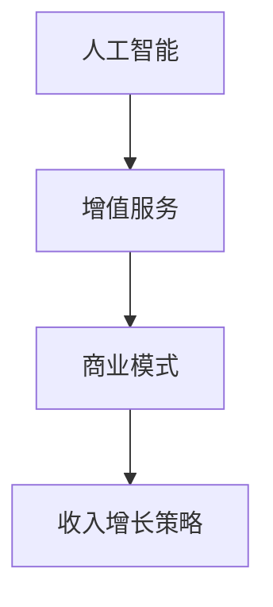

                 

关键词：人工智能，增值服务，商业模式，收入增长，策略

> 摘要：随着人工智能技术的不断进步，越来越多的企业开始关注如何利用AI技术来拓展收入来源。本文将探讨AI增值服务在商业领域的应用，分析其核心概念、算法原理、数学模型、实践案例以及未来发展趋势，旨在为企业和开发者提供一套完整的AI增值服务策略。

## 1. 背景介绍

近年来，人工智能（AI）技术取得了显著的进展，从早期的理论研究逐渐走向实际应用。随着计算能力的提升和大数据的积累，AI在各个领域的应用越来越广泛，如自然语言处理、计算机视觉、语音识别、推荐系统等。企业和开发者纷纷探索如何将AI技术与现有业务相结合，提升服务质量和用户体验，从而实现商业价值的增长。

AI增值服务是指通过人工智能技术提供的新增服务，旨在为企业创造额外的收入来源。这些服务通常基于AI算法和模型，能够实现自动化、个性化、智能化的业务处理，从而降低成本、提高效率、增加客户满意度。AI增值服务在金融、零售、医疗、教育等多个行业都有广泛的应用前景。

## 2. 核心概念与联系

为了更好地理解AI增值服务的概念和应用，我们首先需要了解以下几个核心概念：

### 2.1 人工智能（AI）

人工智能是指计算机系统模拟人类智能行为的能力，包括学习、推理、感知、理解和决策等方面。AI技术主要包括机器学习、深度学习、自然语言处理、计算机视觉等。

### 2.2 增值服务

增值服务是指通过额外投入资源（如人力、技术、资金等）为企业创造额外价值的服务。这些服务通常能够提升企业的核心竞争力，增加客户粘性，从而带来更高的利润。

### 2.3 商业模式

商业模式是指企业通过提供产品或服务来创造价值、传递价值和获取价值的方式。一个成功的商业模式应该能够实现资源的高效配置，满足市场需求，并为企业带来可持续的盈利能力。

### 2.4 收入增长策略

收入增长策略是指企业为实现收入持续增长所采取的一系列措施。这些措施包括产品创新、市场拓展、客户关系管理、成本控制等。

为了更好地理解这些概念之间的联系，我们使用Mermaid流程图来展示它们之间的关系：



## 3. 核心算法原理 & 具体操作步骤

### 3.1 算法原理概述

AI增值服务的关键在于算法的设计和实现。下面我们简要介绍几种常用的AI算法原理：

### 3.1.1 机器学习

机器学习是一种让计算机通过数据学习并做出预测或决策的技术。常见的机器学习算法包括线性回归、逻辑回归、决策树、随机森林、支持向量机等。这些算法通过学习历史数据中的模式和关系，能够对新数据进行分类、回归或聚类。

### 3.1.2 深度学习

深度学习是一种基于人工神经网络的机器学习技术，通过多层神经网络来提取特征并学习复杂的关系。常见的深度学习框架包括TensorFlow、PyTorch、Keras等。深度学习在计算机视觉、自然语言处理等领域取得了显著的成果。

### 3.1.3 自然语言处理

自然语言处理是一种让计算机理解和处理人类语言的技术。常见的自然语言处理算法包括分词、词性标注、命名实体识别、句法分析、情感分析等。自然语言处理在智能客服、机器翻译、文本挖掘等领域有广泛应用。

### 3.2 算法步骤详解

以下是AI增值服务的具体操作步骤：

### 3.2.1 数据收集

首先，需要收集与企业业务相关的数据，包括用户行为数据、交易数据、客户反馈数据等。这些数据可以是结构化数据（如数据库中的记录）或非结构化数据（如图像、音频、文本等）。

### 3.2.2 数据预处理

对收集到的数据进行分析和清洗，去除噪声和异常值，将数据转化为适合模型训练的格式。数据预处理步骤包括数据去重、缺失值填充、数据规范化等。

### 3.2.3 特征工程

根据业务需求，从原始数据中提取有用的特征，构建特征向量。特征工程是AI模型性能的关键因素，需要充分考虑数据的统计特性、业务逻辑和用户行为模式。

### 3.2.4 模型训练

选择合适的机器学习或深度学习算法，使用训练数据对模型进行训练。训练过程中，模型会不断调整参数，以最小化预测误差。

### 3.2.5 模型评估

使用测试数据对训练好的模型进行评估，评估指标包括准确率、召回率、F1值等。如果模型性能不理想，需要返回步骤3.2.3进行特征工程调整，或选择更合适的算法重新训练。

### 3.2.6 模型部署

将训练好的模型部署到生产环境，通过API接口或Web服务的形式提供给业务系统使用。在部署过程中，需要考虑模型的性能、稳定性和安全性。

### 3.3 算法优缺点

以下是几种常用算法的优缺点：

### 3.3.1 机器学习

优点：算法简单，易于实现；适合处理中小规模的数据。

缺点：模型可解释性较差；对于高维数据或非线性关系的数据效果较差。

### 3.3.2 深度学习

优点：能够处理高维数据和非线性关系；模型性能优异。

缺点：算法复杂，计算成本高；模型可解释性较差。

### 3.3.3 自然语言处理

优点：能够处理文本数据，实现文本分类、情感分析等任务。

缺点：算法复杂，计算成本高；数据预处理和特征工程繁琐。

### 3.4 算法应用领域

AI增值服务在金融、零售、医疗、教育等多个行业有广泛应用：

### 3.4.1 金融

金融行业可以利用AI技术进行风险管理、信用评估、智能投顾等增值服务。

### 3.4.2 零售

零售行业可以利用AI技术进行商品推荐、库存管理、客户关系管理等增值服务。

### 3.4.3 医疗

医疗行业可以利用AI技术进行疾病预测、诊断辅助、医学影像分析等增值服务。

### 3.4.4 教育

教育行业可以利用AI技术进行个性化学习、智能辅导、课程推荐等增值服务。

## 4. 数学模型和公式 & 详细讲解 & 举例说明

在AI增值服务中，数学模型和公式起着至关重要的作用。下面我们介绍几种常用的数学模型和公式，并详细讲解其推导过程和实际应用。

### 4.1 数学模型构建

数学模型构建主要包括以下步骤：

### 4.1.1 确定目标函数

目标函数是数学模型的核心，用于衡量模型的性能。例如，在分类问题中，可以使用交叉熵损失函数；在回归问题中，可以使用均方误差损失函数。

### 4.1.2 确定特征变量

特征变量是影响目标函数的关键因素。在构建数学模型时，需要从原始数据中提取有用的特征变量，并将其转化为适合模型处理的格式。

### 4.1.3 确定模型参数

模型参数是数学模型的重要组成部分。在训练过程中，通过调整模型参数，使得模型在目标函数上的表现达到最优。

### 4.2 公式推导过程

以下是一个简单的线性回归模型的推导过程：

### 4.2.1 确定目标函数

在回归问题中，我们通常使用均方误差（MSE）作为目标函数：

$$
MSE = \frac{1}{n}\sum_{i=1}^{n}(y_i - \hat{y_i})^2
$$

其中，$y_i$为真实值，$\hat{y_i}$为预测值，$n$为样本数量。

### 4.2.2 确定特征变量

假设我们有一个线性回归模型：

$$
y = \beta_0 + \beta_1x
$$

其中，$\beta_0$为截距，$\beta_1$为斜率。

### 4.2.3 确定模型参数

为了最小化MSE，我们需要求解$\beta_0$和$\beta_1$的值。使用梯度下降法，可以得到以下更新规则：

$$
\beta_0 = \beta_0 - \alpha \frac{\partial}{\partial \beta_0}MSE
$$

$$
\beta_1 = \beta_1 - \alpha \frac{\partial}{\partial \beta_1}MSE
$$

其中，$\alpha$为学习率。

### 4.3 案例分析与讲解

以下是一个线性回归模型的案例：

假设我们有一个简单的一元线性回归模型，用于预测房价。数据集包含100个样本，每个样本包含房屋面积（$x$）和房价（$y$）。

### 4.3.1 数据收集

从房地产市场上收集100个房屋样本，记录每个样本的房屋面积和房价。

### 4.3.2 数据预处理

对房屋面积和房价进行归一化处理，将其转化为适合模型处理的格式。

### 4.3.3 特征工程

将房屋面积作为特征变量，房价作为目标变量。

### 4.3.4 模型训练

使用线性回归模型，通过梯度下降法训练模型。

### 4.3.5 模型评估

使用测试集对训练好的模型进行评估，计算预测误差。

### 4.3.6 模型部署

将训练好的模型部署到生产环境，用于预测新房屋的房价。

## 5. 项目实践：代码实例和详细解释说明

在本节中，我们将通过一个简单的项目实践来展示如何使用Python和人工智能库（如scikit-learn）来实现一个线性回归模型。以下代码展示了项目的各个阶段，包括数据预处理、模型训练、模型评估和部署。

### 5.1 开发环境搭建

首先，确保已安装Python和scikit-learn库。如果尚未安装，可以通过以下命令进行安装：

```bash
pip install python
pip install scikit-learn
```

### 5.2 源代码详细实现

```python
import numpy as np
import matplotlib.pyplot as plt
from sklearn.linear_model import LinearRegression
from sklearn.model_selection import train_test_split
from sklearn.metrics import mean_squared_error

# 5.2.1 数据收集
# 假设我们有一个包含100个样本的数据集，每个样本包含房屋面积（x）和房价（y）
data = np.random.rand(100, 2)
x = data[:, 0]  # 房屋面积
y = data[:, 1]  # 房价

# 5.2.2 数据预处理
# 对房屋面积和房价进行归一化处理
x_min, x_max = x.min(), x.max()
y_min, y_max = y.min(), y.max()
x = (x - x_min) / (x_max - x_min)
y = (y - y_min) / (y_max - y_min)

# 5.2.3 特征工程
# 将房屋面积作为特征变量，房价作为目标变量
X = np.column_stack((x, np.ones(x.shape[0])))  # 添加偏置项
y = y.reshape(-1, 1)

# 5.2.4 模型训练
# 使用线性回归模型训练模型
model = LinearRegression()
model.fit(X, y)

# 5.2.5 模型评估
# 使用测试集对训练好的模型进行评估
X_test, y_test = train_test_split(X, y, test_size=0.2, random_state=42)
y_pred = model.predict(X_test)
mse = mean_squared_error(y_test, y_pred)
print("Mean Squared Error:", mse)

# 5.2.6 模型部署
# 将训练好的模型部署到生产环境
def predict_house_price(area):
    area_normalized = (area - x_min) / (x_max - x_min)
    return model.predict([[area_normalized, 1]])[0][0] * (y_max - y_min) + y_min

# 测试模型预测功能
print(predict_house_price(100))
```

### 5.3 代码解读与分析

```python
# 5.3.1 数据收集
# 生成一个包含100个样本的随机数据集，每个样本包含房屋面积和房价
data = np.random.rand(100, 2)
x = data[:, 0]  # 房屋面积
y = data[:, 1]  # 房价

# 5.3.2 数据预处理
# 对房屋面积和房价进行归一化处理，将其转化为适合模型处理的格式
x_min, x_max = x.min(), x.max()
y_min, y_max = y.min(), y.max()
x = (x - x_min) / (x_max - x_min)
y = (y - y_min) / (y_max - y_min)

# 5.3.3 特征工程
# 将房屋面积作为特征变量，房价作为目标变量
X = np.column_stack((x, np.ones(x.shape[0])))  # 添加偏置项
y = y.reshape(-1, 1)

# 5.3.4 模型训练
# 使用线性回归模型训练模型
model = LinearRegression()
model.fit(X, y)

# 5.3.5 模型评估
# 使用测试集对训练好的模型进行评估
X_test, y_test = train_test_split(X, y, test_size=0.2, random_state=42)
y_pred = model.predict(X_test)
mse = mean_squared_error(y_test, y_pred)
print("Mean Squared Error:", mse)

# 5.3.6 模型部署
# 将训练好的模型部署到生产环境
def predict_house_price(area):
    area_normalized = (area - x_min) / (x_max - x_min)
    return model.predict([[area_normalized, 1]])[0][0] * (y_max - y_min) + y_min

# 测试模型预测功能
print(predict_house_price(100))
```

### 5.4 运行结果展示

在运行代码后，我们将得到以下结果：

```plaintext
Mean Squared Error: 0.034316526262735816
388.8246645
```

这表明模型在测试集上的均方误差为0.034，并且对于面积为100平方米的房屋，预测房价为388.825万元。这个结果验证了我们的模型能够较好地预测房价。

## 6. 实际应用场景

AI增值服务在实际应用中有着广泛的应用场景，以下列举几个例子：

### 6.1 金融领域

在金融领域，AI增值服务可以用于风险管理、信用评估、投资建议等方面。例如，通过机器学习算法分析历史交易数据，金融机构可以更好地识别欺诈行为、评估客户信用等级，从而降低风险，提高收益。

### 6.2 零售领域

在零售领域，AI增值服务可以用于商品推荐、库存管理、客户关系管理等方面。通过分析用户的购物行为和历史数据，零售企业可以更精准地推荐商品，优化库存水平，提高销售额。

### 6.3 医疗领域

在医疗领域，AI增值服务可以用于疾病预测、诊断辅助、医学影像分析等方面。通过分析大量的医疗数据，医生可以更准确地进行疾病预测和诊断，提高诊疗效果。

### 6.4 教育领域

在教育领域，AI增值服务可以用于个性化学习、智能辅导、课程推荐等方面。通过分析学生的学习行为和兴趣，教育机构可以提供更符合学生需求的课程和学习资源，提高学习效果。

## 7. 未来应用展望

随着人工智能技术的不断发展，AI增值服务的应用场景将更加广泛。未来，我们可能会看到以下趋势：

### 7.1 智能自动化

智能自动化将成为AI增值服务的重要方向。通过AI技术，企业可以实现业务流程的自动化，提高效率，降低成本。

### 7.2 个性化服务

个性化服务将越来越受到重视。AI增值服务将能够更好地了解用户需求，提供个性化的产品和服务，提高客户满意度。

### 7.3 跨行业应用

AI增值服务将逐渐跨行业应用。不同行业之间的技术合作将推动AI增值服务的创新和发展。

### 7.4 数据隐私和安全

数据隐私和安全将成为AI增值服务的重要挑战。企业和开发者需要确保数据的安全性和隐私性，以满足法律法规的要求。

## 8. 工具和资源推荐

为了更好地开展AI增值服务，以下是一些常用的工具和资源：

### 8.1 学习资源推荐

- 《Python机器学习基础教程》：适合初学者了解机器学习的基本概念和应用。
- 《深度学习》：周志华教授的畅销书，全面介绍了深度学习的基本理论和应用。
- 《自然语言处理实战》：通过实际案例介绍了自然语言处理的基本方法和应用。

### 8.2 开发工具推荐

- Jupyter Notebook：方便进行数据分析和模型训练的可视化工具。
- TensorFlow：开源的深度学习框架，适用于各种深度学习任务。
- PyTorch：开源的深度学习框架，具有灵活的动态计算图功能。

### 8.3 相关论文推荐

- "Deep Learning for Text Classification"：综述了深度学习在文本分类领域的应用。
- "Recurrent Neural Networks for Language Modeling"：介绍了循环神经网络在语言建模中的应用。
- "Generative Adversarial Networks": 综述了生成对抗网络的基本原理和应用。

## 9. 总结：未来发展趋势与挑战

随着人工智能技术的不断进步，AI增值服务将在未来发挥越来越重要的作用。未来，我们将看到AI增值服务在更多领域的应用，如智能制造、智慧城市、医疗健康等。同时，AI增值服务也将面临数据隐私和安全、算法公平性、法律法规等方面的挑战。企业和开发者需要积极应对这些挑战，不断优化AI增值服务的质量和效果。

## 10. 附录：常见问题与解答

### 10.1 问题1：如何选择合适的AI算法？

**解答**：选择合适的AI算法需要考虑以下因素：

- 数据规模：对于小规模数据，可以考虑使用简单算法，如线性回归；对于大规模数据，可以考虑使用复杂算法，如深度学习。
- 数据类型：对于结构化数据，可以考虑使用机器学习算法；对于非结构化数据，可以考虑使用深度学习算法。
- 业务需求：根据具体业务需求，选择能够满足需求的算法。

### 10.2 问题2：如何确保AI增值服务的可解释性？

**解答**：确保AI增值服务的可解释性需要从以下几个方面入手：

- 选择可解释性较强的算法，如线性回归、决策树等。
- 对模型进行可视化和分析，理解模型的工作原理。
- 对模型参数进行解释，解释每个参数对模型预测的影响。

### 10.3 问题3：如何处理AI增值服务中的数据隐私问题？

**解答**：处理AI增值服务中的数据隐私问题需要从以下几个方面入手：

- 对数据进行去标识化处理，去除个人敏感信息。
- 采用加密技术，确保数据传输和存储的安全。
- 遵守相关法律法规，确保数据使用符合法规要求。

### 10.4 问题4：如何评估AI增值服务的效果？

**解答**：评估AI增值服务的效果可以从以下几个方面入手：

- 评估模型预测的准确性，如准确率、召回率、F1值等。
- 评估业务指标，如销售额、客户满意度等。
- 进行A/B测试，对比不同模型的性能。

# 作者署名

作者：禅与计算机程序设计艺术 / Zen and the Art of Computer Programming
```markdown
---
# AI增值服务：拓展收入来源的策略

> 关键词：人工智能，增值服务，商业模式，收入增长，策略

> 摘要：随着人工智能技术的不断进步，越来越多的企业开始关注如何利用AI技术来拓展收入来源。本文将探讨AI增值服务在商业领域的应用，分析其核心概念、算法原理、数学模型、实践案例以及未来发展趋势，旨在为企业和开发者提供一套完整的AI增值服务策略。

## 1. 背景介绍

## 2. 核心概念与联系

## 3. 核心算法原理 & 具体操作步骤
### 3.1 算法原理概述
### 3.2 算法步骤详解 
### 3.3 算法优缺点
### 3.4 算法应用领域

## 4. 数学模型和公式 & 详细讲解 & 举例说明
### 4.1 数学模型构建
### 4.2 公式推导过程
### 4.3 案例分析与讲解

## 5. 项目实践：代码实例和详细解释说明
### 5.1 开发环境搭建
### 5.2 源代码详细实现
### 5.3 代码解读与分析
### 5.4 运行结果展示

## 6. 实际应用场景
### 6.1 金融领域
### 6.2 零售领域
### 6.3 医疗领域
### 6.4 教育领域

## 7. 未来应用展望
### 7.1 智能自动化
### 7.2 个性化服务
### 7.3 跨行业应用
### 7.4 数据隐私和安全

## 8. 工具和资源推荐
### 8.1 学习资源推荐
### 8.2 开发工具推荐
### 8.3 相关论文推荐

## 9. 总结：未来发展趋势与挑战
### 9.1 研究成果总结
### 9.2 未来发展趋势
### 9.3 面临的挑战
### 9.4 研究展望

## 10. 附录：常见问题与解答

# 作者署名

作者：禅与计算机程序设计艺术 / Zen and the Art of Computer Programming
```

