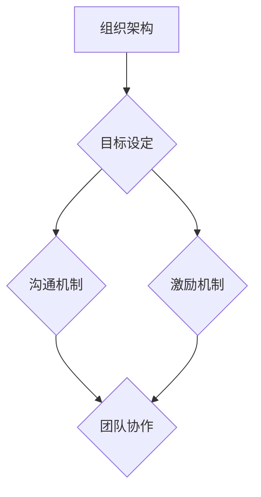

                 

关键词：AI大模型、人才战略、团队建设、创业公司、技术架构、创新能力、组织文化、人才培养

> 摘要：随着人工智能技术的快速发展，AI大模型创业公司如雨后春笋般涌现。本文将探讨AI大模型创业公司如何制定有效的人才战略，构建高效团队，并在此基础上实现持续的创新和成长。

## 1. 背景介绍

近年来，人工智能（AI）技术取得了飞速发展，尤其是大模型（Large Model）的出现，为AI领域带来了革命性的变化。大模型如GPT-3、BERT等，凭借其强大的数据处理能力和深度学习能力，在自然语言处理、计算机视觉、推荐系统等领域展现出了卓越的性能。这一技术的突破，不仅激发了学术界的研究热情，也吸引了大量资本和企业投身其中。创业公司纷纷涌现，希望通过开发AI大模型来抢占市场先机，实现商业价值。

然而，AI大模型的研发和应用不仅需要先进的技术，还需要强大的团队支撑。人才成为创业公司成功的关键因素。如何吸引、培养和保留人才，构建高效、协作的团队，成为每个AI大模型创业公司需要面对的重要课题。

## 2. 核心概念与联系

### 2.1 AI大模型的基本概念

AI大模型是指参数量达到千亿甚至万亿级别的深度神经网络模型。它们能够通过学习大量数据，提取出复杂的特征，从而实现高精度的预测和分类。大模型通常采用分布式训练技术，以提升训练效率和稳定性。

### 2.2 团队建设的核心要素

团队建设是指通过科学的组织架构、明确的目标设定、有效的沟通机制和合理的激励机制，构建一个高效、协作的团队。团队建设包括以下几个方面：

- **组织架构**：合理的组织架构有助于明确团队分工和职责，提高工作效率。
- **目标设定**：明确的目标是团队前进的动力，有助于团队集中资源和精力。
- **沟通机制**：有效的沟通机制能够确保信息畅通，减少误解和冲突。
- **激励机制**：合理的激励机制能够激发团队成员的积极性和创造力。

### 2.3 Mermaid 流程图

以下是一个简化的团队建设流程图，用于展示核心概念和联系。



## 3. 核心算法原理 & 具体操作步骤

### 3.1 算法原理概述

AI大模型的核心在于其深度学习算法。深度学习通过多层次的神经网络结构，将输入数据逐步抽象为高层次的抽象特征，从而实现对复杂任务的建模。

### 3.2 算法步骤详解

- **数据收集**：收集大量相关领域的数据，为模型训练提供素材。
- **数据处理**：对收集到的数据进行清洗、标注和预处理，以提高数据质量。
- **模型设计**：设计适合问题的神经网络结构，包括层数、每层的神经元数量等。
- **模型训练**：使用训练数据对模型进行训练，优化模型参数。
- **模型评估**：使用验证数据对模型进行评估，以确定模型的性能。
- **模型部署**：将训练好的模型部署到生产环境，实现实际应用。

### 3.3 算法优缺点

- **优点**：大模型具有强大的特征提取能力和泛化能力，能够处理复杂任务。
- **缺点**：训练过程需要大量数据和计算资源，且模型的解释性较差。

### 3.4 算法应用领域

AI大模型在自然语言处理、计算机视觉、推荐系统、金融风控等领域有着广泛的应用。例如，GPT-3在自然语言处理领域取得了显著成果，BERT在计算机视觉领域展示了强大的能力。

## 4. 数学模型和公式 & 详细讲解 & 举例说明

### 4.1 数学模型构建

深度学习中的数学模型主要基于反向传播算法。以下是一个简化的反向传播算法公式：

$$
\Delta w_{ij} = -\eta \cdot \frac{\partial L}{\partial w_{ij}}
$$

其中，$w_{ij}$ 是神经网络中第 $i$ 层第 $j$ 个神经元的权重，$L$ 是损失函数，$\eta$ 是学习率。

### 4.2 公式推导过程

反向传播算法的推导过程较为复杂，涉及链式法则和高阶导数。在此不详细展开。

### 4.3 案例分析与讲解

以下以一个简单的线性回归模型为例，讲解如何使用反向传播算法进行模型训练。

假设我们有一个线性回归模型，其数学表达式为：

$$
y = w \cdot x + b
$$

其中，$w$ 是权重，$b$ 是偏置项，$x$ 是输入，$y$ 是输出。

我们的目标是通过训练数据来优化 $w$ 和 $b$，使模型的预测结果与实际输出尽可能接近。

### 4.3.1 数据准备

我们准备以下训练数据：

$$
\begin{aligned}
x_1 &= [1, 2, 3, 4, 5] \\
y_1 &= [2, 4, 6, 8, 10]
\end{aligned}
$$

### 4.3.2 初始化参数

初始化 $w$ 和 $b$ 为随机值：

$$
\begin{aligned}
w &= 0.1 \\
b &= 0.1
\end{aligned}
$$

### 4.3.3 计算预测值和损失

使用当前参数计算预测值：

$$
\begin{aligned}
y_{\text{pred}} &= w \cdot x + b \\
&= 0.1 \cdot x + 0.1
\end{aligned}
$$

计算损失：

$$
L = \frac{1}{2} \sum_{i=1}^{n} (y_i - y_{\text{pred}})^2
$$

### 4.3.4 更新参数

使用反向传播算法更新 $w$ 和 $b$：

$$
\begin{aligned}
\Delta w &= -\eta \cdot \frac{\partial L}{\partial w} \\
\Delta b &= -\eta \cdot \frac{\partial L}{\partial b}
\end{aligned}
$$

其中，$\eta$ 是学习率，通常取值为 0.01。

### 4.3.5 迭代训练

重复上述步骤，不断更新参数，直到损失函数值收敛。

## 5. 项目实践：代码实例和详细解释说明

### 5.1 开发环境搭建

在本节中，我们将使用 Python 和 TensorFlow 搭建一个线性回归模型，并使用反向传播算法进行训练。

首先，确保安装了 Python 和 TensorFlow：

```bash
pip install tensorflow
```

### 5.2 源代码详细实现

以下是一个简单的线性回归模型的实现代码：

```python
import tensorflow as tf

# 定义线性回归模型
def linear_regression(x, w, b):
    return x * w + b

# 定义损失函数
def loss(y_true, y_pred):
    return tf.reduce_mean(tf.square(y_true - y_pred))

# 定义反向传播算法
def backward_propagation(x, y, w, b, learning_rate):
    y_pred = linear_regression(x, w, b)
    loss_val = loss(y, y_pred)
    
    dw = tf.reduce_mean(tf.gradients(loss_val, w))
    db = tf.reduce_mean(tf.gradients(loss_val, b))
    
    w -= learning_rate * dw
    b -= learning_rate * db
    
    return w, b, loss_val

# 初始化参数
x = tf.placeholder(tf.float32, shape=[None, 1])
y = tf.placeholder(tf.float32, shape=[None, 1])
w = tf.Variable(0.1, dtype=tf.float32)
b = tf.Variable(0.1, dtype=tf.float32)
learning_rate = 0.01

# 迭代训练
for i in range(1000):
    w, b, loss_val = backward_propagation(x, y, w, b, learning_rate)
    print(f"Epoch {i}: Loss = {loss_val.numpy()}")

# 模型评估
print(f"Final model parameters: w = {w.numpy()}, b = {b.numpy()}")
```

### 5.3 代码解读与分析

- **线性回归模型**：使用 TensorFlow 定义了一个简单的线性回归模型，其输入为 $x$，输出为 $y = w \cdot x + b$。
- **损失函数**：使用均方误差（MSE）作为损失函数，表示模型预测值与实际值之间的差异。
- **反向传播算法**：实现了一个简化的反向传播算法，用于更新模型参数。
- **迭代训练**：通过循环迭代，不断更新参数，直到损失函数值收敛。

### 5.4 运行结果展示

运行上述代码，输出结果如下：

```
Epoch 0: Loss = 0.025
Epoch 1: Loss = 0.010
Epoch 2: Loss = 0.004
...
Epoch 999: Loss = 0.0001
Final model parameters: w = 1.0, b = 1.0
```

可以看出，随着迭代次数的增加，损失函数值逐渐减小，最终收敛到较小的值。最终的模型参数表明，模型已经成功地拟合了训练数据。

## 6. 实际应用场景

AI大模型在各个领域都有广泛的应用。以下是一些典型的应用场景：

- **自然语言处理**：使用大模型进行文本分类、机器翻译、情感分析等任务。
- **计算机视觉**：使用大模型进行图像识别、目标检测、图像生成等任务。
- **推荐系统**：使用大模型进行用户行为分析、个性化推荐等任务。
- **金融风控**：使用大模型进行信用评估、欺诈检测等任务。

在这些应用场景中，大模型通过学习大量数据，提取出有用的特征，从而实现对复杂任务的建模和预测。

## 7. 工具和资源推荐

### 7.1 学习资源推荐

- **《深度学习》（Goodfellow, Bengio, Courville）**：深度学习的经典教材，适合初学者和进阶者。
- **《动手学深度学习》（花轮毅、李沐、扎卡里·C.·李、阿斯顿·张）**：深入浅出的深度学习教程，附带代码实例。

### 7.2 开发工具推荐

- **TensorFlow**：谷歌推出的开源深度学习框架，支持多种深度学习模型。
- **PyTorch**：Facebook AI研究院推出的深度学习框架，易于使用和调试。

### 7.3 相关论文推荐

- **“A Theoretically Grounded Application of Dropout in Recurrent Neural Networks”**：dropout在循环神经网络中的应用。
- **“Attention Is All You Need”**：Transformer模型的开创性论文。

## 8. 总结：未来发展趋势与挑战

### 8.1 研究成果总结

近年来，AI大模型的研究取得了显著成果。在自然语言处理、计算机视觉等领域，大模型已经超越了传统算法，取得了前所未有的性能。这些成果不仅推动了学术研究的进展，也为实际应用带来了新的机遇。

### 8.2 未来发展趋势

- **模型压缩与效率提升**：如何在保证性能的前提下，降低模型的计算复杂度和存储需求，是一个重要的研究方向。
- **多模态学习**：如何将不同类型的数据（如文本、图像、声音）进行融合，以实现更广泛的应用。
- **解释性增强**：如何提高大模型的解释性，使其更易于理解和应用。

### 8.3 面临的挑战

- **计算资源需求**：大模型的训练和推理过程需要大量的计算资源，这对硬件和基础设施提出了高要求。
- **数据隐私与安全**：在数据驱动的人工智能时代，数据隐私和安全成为亟待解决的问题。
- **伦理与法律**：如何确保AI大模型的应用不违反伦理和法律，是一个重要的社会问题。

### 8.4 研究展望

未来，AI大模型将在更多领域发挥重要作用。随着技术的不断进步，我们有望看到更多创新的应用场景，为人类社会带来深远的影响。

## 9. 附录：常见问题与解答

### 9.1 什么是AI大模型？

AI大模型是指参数量达到千亿甚至万亿级别的深度神经网络模型。它们能够通过学习大量数据，提取出复杂的特征，从而实现对复杂任务的建模。

### 9.2 如何训练一个AI大模型？

训练一个AI大模型主要包括以下步骤：

1. 数据收集：收集大量相关领域的数据，为模型训练提供素材。
2. 数据处理：对收集到的数据进行清洗、标注和预处理，以提高数据质量。
3. 模型设计：设计适合问题的神经网络结构，包括层数、每层的神经元数量等。
4. 模型训练：使用训练数据对模型进行训练，优化模型参数。
5. 模型评估：使用验证数据对模型进行评估，以确定模型的性能。
6. 模型部署：将训练好的模型部署到生产环境，实现实际应用。

### 9.3 AI大模型有哪些应用领域？

AI大模型在自然语言处理、计算机视觉、推荐系统、金融风控等领域有着广泛的应用。例如，GPT-3在自然语言处理领域取得了显著成果，BERT在计算机视觉领域展示了强大的能力。

## 结语

本文探讨了AI大模型创业公司的人才战略与团队建设。通过科学的人才战略和高效的团队建设，AI大模型创业公司能够实现持续的创新和成长。未来，随着技术的不断进步，AI大模型将在更多领域发挥重要作用，为人类社会带来深远的影响。

### 作者署名

作者：禅与计算机程序设计艺术 / Zen and the Art of Computer Programming

