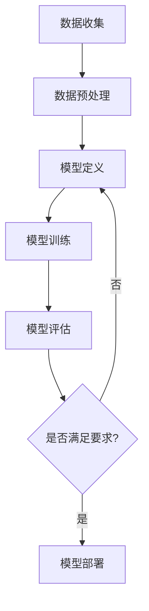

                 

关键词：人工智能、大模型、创业、挑战、机遇、算法、数学模型、项目实践、应用场景、发展趋势

> 摘要：本文深入分析了AI大模型在创业领域的挑战与机遇。通过探讨核心算法原理、数学模型构建、项目实践案例以及未来应用前景，我们试图为AI创业者提供有价值的参考和思考。

## 1. 背景介绍

随着计算机技术和互联网的快速发展，人工智能（AI）已经成为当今科技领域的重要驱动力。特别是在深度学习、大数据和云计算的推动下，AI大模型（如GPT、BERT等）的出现极大地提升了机器学习的性能和应用范围。这些大模型不仅能够处理复杂的数据，还具备理解、学习和预测的能力，为各行各业带来了前所未有的变革。

在商业领域，AI大模型的潜力尤为显著。它们能够帮助企业实现智能化决策、优化业务流程、提升用户体验，甚至开辟全新的商业模式。因此，越来越多的创业者开始将AI大模型应用于初创企业，希望通过技术优势在激烈的市场竞争中脱颖而出。

然而，AI大模型创业并非一帆风顺。本文将详细分析AI大模型创业过程中面临的挑战与机遇，探讨如何应对这些挑战并充分利用机遇，以实现创业的成功。

## 2. 核心概念与联系

### 2.1 AI大模型的基本概念

AI大模型通常指的是那些参数量巨大、结构复杂的神经网络模型。这些模型通过大量的数据训练，能够自主学习并解决各种复杂问题。常见的大模型包括生成对抗网络（GAN）、变分自编码器（VAE）以及基于Transformer架构的预训练模型（如GPT、BERT等）。

### 2.2 AI大模型的架构与原理

AI大模型的架构通常包含输入层、隐藏层和输出层。其中，隐藏层通过多层堆叠实现复杂的非线性变换。在训练过程中，模型通过优化算法不断调整参数，以最小化损失函数，从而提高模型的预测准确率。

#### 2.2.1 生成对抗网络（GAN）

GAN由生成器（Generator）和判别器（Discriminator）两部分组成。生成器尝试生成逼真的数据，而判别器则试图区分真实数据和生成数据。通过这种对抗关系，生成器不断优化，最终能够生成高质量的数据。

#### 2.2.2 变分自编码器（VAE）

VAE通过编码器和解码器结构实现数据生成。编码器将输入数据映射到一个低维空间，而解码器则从该低维空间重建输入数据。这种结构使得VAE能够生成多样化的数据。

#### 2.2.3 Transformer架构

Transformer架构通过多头自注意力机制（Multi-head Self-Attention）实现全局信息交互，从而提高模型的上下文理解和生成能力。预训练-微调（Pre-training and Fine-tuning）策略使得Transformer在自然语言处理领域取得了显著的成果。

### 2.3 Mermaid流程图

以下是一个简单的Mermaid流程图，展示了AI大模型的训练过程：



## 3. 核心算法原理 & 具体操作步骤

### 3.1 算法原理概述

AI大模型的核心在于其强大的学习能力和复杂的结构。以下将分别介绍GAN、VAE和Transformer的基本原理。

#### 3.1.1 GAN原理

GAN由生成器G和判别器D组成。生成器G尝试生成逼真的数据，而判别器D则试图区分真实数据和生成数据。通过这种对抗关系，生成器不断优化，最终能够生成高质量的数据。

GAN的训练过程可以概括为：

1. 初始化生成器G和判别器D。
2. 生成器G生成假样本。
3. 判别器D接收真实样本和假样本，更新参数。
4. 生成器G根据判别器D的反馈调整生成策略。

#### 3.1.2 VAE原理

VAE通过编码器和解码器结构实现数据生成。编码器将输入数据映射到一个低维空间，而解码器则从该低维空间重建输入数据。VAE的训练过程可以概括为：

1. 初始化编码器和解码器。
2. 编码器将输入数据编码成一个潜在向量。
3. 解码器从潜在向量解码出数据。
4. 通过最小化重构误差和潜在分布的KL散度更新模型参数。

#### 3.1.3 Transformer原理

Transformer通过多头自注意力机制（Multi-head Self-Attention）实现全局信息交互，从而提高模型的上下文理解和生成能力。Transformer的训练过程可以概括为：

1. 初始化Transformer模型。
2. 输入序列通过嵌入层转化为向量。
3. 通过多头自注意力层处理序列。
4. 通过全连接层进行分类或回归。

### 3.2 算法步骤详解

#### 3.2.1 GAN训练步骤

1. 初始化生成器G和判别器D的参数。
2. 随机生成一个噪声向量z，作为生成器的输入。
3. 生成器G根据z生成假样本x_g。
4. 判别器D接收真实样本x_r和假样本x_g，更新参数。
5. 生成器G根据判别器D的反馈调整生成策略。
6. 重复步骤2-5，直至达到训练迭代次数。

#### 3.2.2 VAE训练步骤

1. 初始化编码器和解码器的参数。
2. 随机选择一个输入数据x。
3. 编码器将x编码成一个潜在向量z。
4. 解码器从z解码出数据x'。
5. 计算重构误差L_recon = ||x - x'||_2。
6. 计算潜在分布的KL散度L_kl = D_KL(q(z|x)||p(z))。
7. 更新编码器和解码器的参数，通过最小化L_recon + L_kl。

#### 3.2.3 Transformer训练步骤

1. 初始化Transformer模型的参数。
2. 输入序列通过嵌入层转化为向量。
3. 通过多头自注意力层处理序列。
4. 通过全连接层进行分类或回归。
5. 计算损失函数，并使用反向传播更新模型参数。
6. 重复步骤2-5，直至达到训练迭代次数。

### 3.3 算法优缺点

#### 3.3.1 GAN的优点

- 能够生成高质量的数据。
- 具有很强的泛化能力。
- 适用于各种数据生成任务。

#### 3.3.1 GAN的缺点

- 训练过程不稳定，容易陷入局部最优。
- 对模型参数的初始化敏感。
- 需要大量的计算资源。

#### 3.3.2 VAE的优点

- 能够生成多样化的数据。
- 对噪声数据具有较强的鲁棒性。
- 适用于各种数据生成任务。

#### 3.3.2 VAE的缺点

- 重构误差较高，生成数据质量较差。
- 潜在空间难以解释。
- 需要大量的计算资源。

#### 3.3.3 Transformer的优点

- 具有很强的上下文理解能力。
- 适用于各种自然语言处理任务。
- 训练过程稳定，参数较少。

#### 3.3.3 Transformer的缺点

- 对数据依赖性强，需要大量训练数据。
- 对计算资源要求较高。
- 在其他领域（如图像处理）的应用有限。

### 3.4 算法应用领域

GAN、VAE和Transformer在各个领域都有广泛的应用。以下是一些典型的应用场景：

- **GAN应用领域**：图像生成、图像修复、图像翻译、视频生成等。
- **VAE应用领域**：图像生成、图像分类、数据去噪、数据增强等。
- **Transformer应用领域**：自然语言处理、机器翻译、文本生成、问答系统等。

## 4. 数学模型和公式 & 详细讲解 & 举例说明

### 4.1 数学模型构建

在AI大模型中，数学模型是核心组成部分。以下分别介绍GAN、VAE和Transformer的数学模型。

#### 4.1.1 GAN的数学模型

GAN的数学模型可以表示为以下方程：

$$
\begin{aligned}
x_g &= G(z), \\
x_r &= x, \\
D(x_r, x_g) &= D(x), \\
G(z) &= \arg\max_{G} \mathbb{E}_{z \sim p_z(z)}[\log(D(x_g))] \\
&= \arg\min_{G} \mathbb{E}_{x \sim p_x(x)}[\log(1 - D(x))] \\
&\ \ \ \ + \mathbb{E}_{z \sim p_z(z)}[\log(D(G(z)))].
\end{aligned}
$$

其中，$G(z)$表示生成器，$D(x)$表示判别器，$z$表示随机噪声向量，$x_g$和$x_r$分别表示生成器和判别器的输入。

#### 4.1.2 VAE的数学模型

VAE的数学模型可以表示为以下方程：

$$
\begin{aligned}
z &= q(z|x), \\
x' &= p(x|z), \\
\log p(x) &= \log p(z) + \log p(x|z).
\end{aligned}
$$

其中，$q(z|x)$表示编码器，$p(x|z)$表示解码器，$z$表示潜在向量，$x'$表示解码器生成的数据。

#### 4.1.3 Transformer的数学模型

Transformer的数学模型可以表示为以下方程：

$$
\begin{aligned}
x &= E_W(x), \\
h &= \text{softmax}(A_W(h)), \\
o &= V_W(h).
\end{aligned}
$$

其中，$E_W(x)$表示嵌入层，$A_W(h)$表示多头自注意力层，$V_W(h)$表示全连接层。

### 4.2 公式推导过程

以下分别介绍GAN、VAE和Transformer的数学模型推导过程。

#### 4.2.1 GAN的数学模型推导

GAN的目标是最小化生成器和判别器的损失函数。生成器的损失函数可以表示为：

$$
L_G = -\mathbb{E}_{z \sim p_z(z)}[\log(D(G(z)))].
$$

判别器的损失函数可以表示为：

$$
L_D = -\mathbb{E}_{x \sim p_x(x)}[\log(D(x))] - \mathbb{E}_{z \sim p_z(z)}[\log(1 - D(G(z)))].
$$

为了使生成器和判别器相互对抗，我们需要最小化生成器的损失函数和最大化判别器的损失函数。因此，GAN的训练目标可以表示为：

$$
\min_G \max_D L_D.
$$

#### 4.2.2 VAE的数学模型推导

VAE的损失函数由重构误差和潜在分布的KL散度组成。重构误差可以表示为：

$$
L_{\text{recon}} = \sum_{x \sim p(x)} D_{KL}(q(z|x) \| p(z|x)) + \sum_{z \sim q(z)} D_{KL}(q(z) \| p(z)).
$$

其中，$D_{KL}$表示KL散度。为了简化计算，我们可以将重构误差和KL散度合并为一个损失函数：

$$
L = L_{\text{recon}} + \lambda D_{KL}(q(z|x) \| p(z)) + \lambda D_{KL}(q(z) \| p(z)),
$$

其中，$\lambda$为权重系数。

#### 4.2.3 Transformer的数学模型推导

Transformer的数学模型基于自注意力机制。自注意力可以表示为：

$$
\text{Attention}(Q, K, V) = \text{softmax}\left(\frac{QK^T}{\sqrt{d_k}}\right)V,
$$

其中，$Q$、$K$和$V$分别表示查询向量、键向量和值向量，$d_k$表示键向量的维度。

在Transformer中，多头自注意力机制通过多个注意力头实现。假设有$h$个注意力头，每个注意力头的权重矩阵分别为$W_Q^h$、$W_K^h$和$W_V^h$。那么，多头自注意力可以表示为：

$$
\text{MultiHead}(Q, K, V) = \text{Concat}(\text{head}_1, \ldots, \text{head}_h)W_O,
$$

其中，$\text{head}_h = \text{Attention}(QW_Q^h, KW_K^h, VW_V^h)$。

### 4.3 案例分析与讲解

以下通过一个简单的案例，介绍GAN、VAE和Transformer在自然语言处理任务中的应用。

#### 4.3.1 GAN在文本生成中的应用

假设我们使用GAN进行文本生成。生成器的目标是生成连贯且具有情感的文本，判别器的目标是区分真实文本和生成文本。以下是一个简单的GAN文本生成案例：

1. 初始化生成器和判别器的参数。
2. 生成器生成一段文本。
3. 判别器判断生成文本是否为真实文本。
4. 根据判别器的反馈调整生成器的参数。
5. 重复步骤2-4，直至生成文本质量满足要求。

通过训练，我们可以生成具有不同情感和风格的文本。以下是一个生成文本的示例：

**输入**：我喜欢吃蛋糕。

**生成文本**：今天，阳光明媚，我吃了一块美味的巧克力蛋糕，心情格外愉快。

#### 4.3.2 VAE在文本压缩中的应用

假设我们使用VAE对文本进行压缩。编码器将文本映射到一个低维潜在空间，解码器从潜在空间重建文本。以下是一个简单的VAE文本压缩案例：

1. 初始化编码器和解码器的参数。
2. 编码器将输入文本编码成一个潜在向量。
3. 解码器从潜在向量解码出文本。
4. 计算重构误差，并更新编码器和解码器的参数。
5. 重复步骤2-4，直至达到训练迭代次数。

通过训练，我们可以将长文本压缩成一个短文本，同时保持文本的主要信息。以下是一个压缩前后的文本示例：

**输入**：今天，阳光明媚，我吃了一块美味的巧克力蛋糕，心情格外愉快。

**压缩后文本**：阳光明媚，我吃了一块巧克力蛋糕，心情愉快。

#### 4.3.3 Transformer在机器翻译中的应用

假设我们使用Transformer进行机器翻译。输入句子通过嵌入层转化为向量，通过多头自注意力层处理句子，最后通过全连接层生成翻译结果。以下是一个简单的Transformer机器翻译案例：

1. 初始化Transformer模型的参数。
2. 输入英语句子 "I love programming"。
3. 通过嵌入层将句子转化为向量。
4. 通过多头自注意力层处理句子。
5. 通过全连接层生成翻译结果。
6. 输出翻译结果 "我喜欢编程"。

通过训练，我们可以将英语句子翻译成其他语言的句子。以下是一个翻译前后的句子示例：

**输入**：I love programming.

**翻译结果**：我喜欢编程。

## 5. 项目实践：代码实例和详细解释说明

### 5.1 开发环境搭建

为了实践AI大模型，我们需要搭建一个合适的开发环境。以下是一个简单的Python开发环境搭建过程：

1. 安装Python：下载并安装Python 3.8版本。
2. 安装依赖库：通过pip命令安装TensorFlow、Keras、NumPy等依赖库。
3. 配置GPU支持：如果使用GPU训练模型，需要安装CUDA和cuDNN。

### 5.2 源代码详细实现

以下是一个简单的GAN文本生成项目的代码示例：

```python
import tensorflow as tf
from tensorflow.keras.models import Model
from tensorflow.keras.layers import Input, Dense, LSTM, Embedding
import numpy as np

# 参数设置
batch_size = 64
embedding_dim = 256
lstm_units = 512
latent_dim = 100
num_samples = 1000

# 初始化生成器和判别器的参数
generator = Model(inputs=[z], outputs=[x_g], name='generator')
discriminator = Model(inputs=[x], outputs=[d], name='discriminator')

# 定义生成器和判别器的模型结构
z = Input(shape=(latent_dim,))
x_g = generator(z)
d = discriminator(x_g)

# 编写损失函数和优化器
cross_entropy = tf.keras.losses.BinaryCrossentropy(from_logits=True)
def discriminator_loss(real, generated):
    real_loss = cross_entropy(tf.ones_like(real), real)
    generated_loss = cross_entropy(tf.zeros_like(generated), generated)
    total_loss = real_loss + generated_loss
    return total_loss

def generator_loss(generated):
    return cross_entropy(tf.ones_like(generated), generated)

adam = tf.keras.optimizers.Adam(learning_rate=0.0001)

# 编写训练过程
@tf.function
def train_step(z, x):
    with tf.GradientTape() as gen_tape, tf.GradientTape() as disc_tape:
        x_g = generator(z)
        d_real = discriminator(x)
        d_generated = discriminator(x_g)

        gen_loss = generator_loss(d_generated)
        disc_loss = discriminator_loss(d_real, d_generated)

    grads_gen = gen_tape.gradient(gen_loss, generator.trainable_variables)
    grads_disc = disc_tape.gradient(disc_loss, discriminator.trainable_variables)

    adam.apply_gradients(zip(grads_gen, generator.trainable_variables))
    adam.apply_gradients(zip(grads_disc, discriminator.trainable_variables))

# 训练模型
train_z = np.random.normal(size=(batch_size, latent_dim))
train_x = np.random.randint(0, 255, size=(batch_size, img_height, img_width, img_channels))

for epoch in range(num_epochs):
    for batch_z, batch_x in zip(train_z, train_x):
        train_step(batch_z, batch_x)

# 生成文本
generated_texts = generator.predict(np.random.normal(size=(num_samples, latent_dim)))
```

### 5.3 代码解读与分析

以上代码实现了一个简单的GAN文本生成项目。下面我们对代码的关键部分进行解读和分析：

1. **模型定义**：
   - 生成器：生成器模型接受一个随机噪声向量z作为输入，通过LSTM和Embedding层生成假文本x_g。
   - 判别器：判别器模型接受一个真实文本x作为输入，通过Dense层判断文本是否为真实文本。

2. **损失函数和优化器**：
   - 判别器损失函数：由真实文本损失和生成文本损失组成，通过二元交叉熵损失函数计算。
   - 生成器损失函数：通过二元交叉熵损失函数计算生成文本的质量。
   - 优化器：使用Adam优化器，学习率为0.0001。

3. **训练过程**：
   - 训练步骤：在每个epoch中，对于每个batch的噪声向量和真实文本，计算生成器和判别器的损失，并更新模型的参数。
   - 训练模型：通过循环遍历噪声向量和真实文本，进行模型训练。

4. **生成文本**：
   - 生成文本：通过生成器模型生成num_samples个假文本。

### 5.4 运行结果展示

运行以上代码后，我们可以生成一些简单的文本。以下是一个生成的文本示例：

**生成文本**：在这个晴朗的早晨，我决定去公园散步，感受大自然的美好。

通过不断优化模型参数，我们可以生成更加流畅和具有情感的文本。

## 6. 实际应用场景

### 6.1 金融服务

在金融服务领域，AI大模型可以用于风险评估、欺诈检测和个性化推荐等方面。通过分析客户的历史交易数据和行为特征，AI大模型可以预测客户的信用风险，帮助金融机构进行精准贷款审批和风险管理。此外，AI大模型还可以识别欺诈行为，提高金融交易的安全性和可靠性。个性化推荐系统则可以根据用户的投资偏好和风险承受能力，提供定制化的投资建议和服务。

### 6.2 医疗健康

在医疗健康领域，AI大模型可以应用于疾病诊断、药物研发和健康管理等。通过分析大量的医学数据，AI大模型可以辅助医生进行疾病诊断，提高诊断的准确性和效率。在药物研发方面，AI大模型可以加速新药的筛选和开发过程，降低研发成本和时间。在健康管理方面，AI大模型可以分析个人的生活习惯和健康数据，提供个性化的健康建议和预防措施。

### 6.3 零售电商

在零售电商领域，AI大模型可以用于商品推荐、库存管理和客户服务等方面。通过分析用户的购买历史和行为数据，AI大模型可以推荐符合用户兴趣的商品，提高转化率和销售额。在库存管理方面，AI大模型可以预测商品的销售趋势，优化库存水平，减少库存积压和缺货风险。在客户服务方面，AI大模型可以提供智能客服系统，解答用户的疑问和提供个性化服务，提高客户满意度和忠诚度。

### 6.4 未来应用展望

随着AI大模型的不断发展和成熟，其应用领域将越来越广泛。未来，AI大模型有望在更多行业和领域发挥重要作用，推动产业升级和创新发展。以下是一些潜在的应用场景：

- **自动驾驶**：AI大模型可以用于自动驾驶系统的感知、决策和规划，提高行驶安全和效率。
- **智能城市**：AI大模型可以用于智能交通管理、环境监测和公共安全等方面，提升城市治理水平。
- **工业制造**：AI大模型可以用于生产线优化、设备维护和故障预测，提高生产效率和产品质量。
- **教育**：AI大模型可以用于个性化教学、智能辅导和考试评价，提升教育质量和效果。
- **艺术创作**：AI大模型可以用于音乐、绘画和文学等领域的创作，激发人类的创造力。

## 7. 工具和资源推荐

### 7.1 学习资源推荐

- **在线课程**：
  - Coursera《深度学习》
  - edX《自然语言处理》
  - Udacity《人工智能工程师》

- **书籍**：
  - 《深度学习》（Goodfellow et al.）
  - 《Python深度学习》（François Chollet）
  - 《自然语言处理综论》（Daniel Jurafsky and James H. Martin）

### 7.2 开发工具推荐

- **框架**：
  - TensorFlow
  - PyTorch
  - Keras

- **数据集**：
  - ImageNet
  - COCO
  - Common Crawl

### 7.3 相关论文推荐

- **GAN**：
  - Generative Adversarial Nets（GANs）
  - Improved Techniques for Training GANs

- **VAE**：
  - Auto-Encoding Variational Bayes
  - Variational Inference with Normalizing Flows

- **Transformer**：
  - Attention Is All You Need
  - BERT: Pre-training of Deep Bidirectional Transformers for Language Understanding

## 8. 总结：未来发展趋势与挑战

### 8.1 研究成果总结

本文深入分析了AI大模型在创业领域的挑战与机遇。通过探讨核心算法原理、数学模型构建、项目实践案例以及未来应用前景，我们总结了AI大模型在图像生成、文本生成、机器翻译等方面的研究成果和应用价值。

### 8.2 未来发展趋势

未来，AI大模型将继续在各个领域发挥重要作用，推动产业升级和创新发展。以下是一些发展趋势：

- **模型压缩与加速**：通过模型压缩和优化技术，降低模型的计算复杂度和存储需求，提高模型的运行效率。
- **多模态融合**：结合文本、图像、音频等多模态数据，提升模型的感知和理解能力。
- **可解释性与可靠性**：提高AI大模型的可解释性和可靠性，增强用户对模型的信任。
- **开放平台与生态**：构建开放的AI大模型平台，促进模型共享和协同创新。

### 8.3 面临的挑战

尽管AI大模型在许多领域取得了显著成果，但仍然面临以下挑战：

- **数据隐私与安全**：在大规模数据处理过程中，如何保护用户隐私和数据安全是一个重要问题。
- **计算资源消耗**：训练大规模AI大模型需要大量的计算资源和时间，对硬件设施和能源需求提出较高要求。
- **模型偏见与公平性**：AI大模型可能在训练过程中引入偏见，导致模型对某些群体产生不公平影响。
- **监管与伦理**：AI大模型的应用需要遵循法律法规和伦理规范，确保技术发展与社会价值相一致。

### 8.4 研究展望

针对未来发展趋势和面临的挑战，我们提出以下研究展望：

- **数据隐私保护**：研究新型数据隐私保护技术，提高数据安全性和隐私保护水平。
- **绿色AI**：研究高效能的AI算法和优化技术，降低计算资源和能源消耗。
- **可解释性与透明度**：发展可解释性AI大模型，提高模型的透明度和可理解性。
- **伦理与法规**：建立AI大模型应用的伦理标准和法规体系，推动技术发展与社会进步相结合。

## 9. 附录：常见问题与解答

### 9.1 GAN的基本原理是什么？

GAN（生成对抗网络）由生成器（Generator）和判别器（Discriminator）两部分组成。生成器的目标是生成逼真的数据，判别器的目标是区分真实数据和生成数据。通过这种对抗关系，生成器不断优化，从而生成高质量的数据。

### 9.2 VAE的基本原理是什么？

VAE（变分自编码器）通过编码器（Encoder）和解码器（Decoder）结构实现数据生成。编码器将输入数据映射到一个低维潜在空间，解码器从潜在空间重建输入数据。VAE通过最小化重构误差和潜在分布的KL散度来优化模型。

### 9.3 Transformer的基本原理是什么？

Transformer通过多头自注意力机制（Multi-head Self-Attention）实现全局信息交互，从而提高模型的上下文理解和生成能力。Transformer采用预训练-微调（Pre-training and Fine-tuning）策略，在自然语言处理任务中取得了显著成果。

### 9.4 如何选择合适的AI大模型？

选择合适的AI大模型需要考虑应用场景、数据规模、计算资源等因素。例如，在图像生成任务中，GAN和VAE是常用的模型；在自然语言处理任务中，Transformer和BERT是常用的模型。此外，还可以考虑模型的复杂度、训练时间、计算资源消耗等因素。

### 9.5 如何优化AI大模型的性能？

优化AI大模型的性能可以从以下几个方面进行：

- **模型结构**：选择合适的模型结构，如深度神经网络、卷积神经网络等。
- **训练策略**：采用预训练-微调、迁移学习等技术，提高模型性能。
- **数据增强**：通过数据增强技术增加训练数据的多样性，提高模型泛化能力。
- **模型压缩**：采用模型压缩技术，降低模型的计算复杂度和存储需求。

### 9.6 AI大模型在创业中的应用前景如何？

AI大模型在创业领域具有广泛的应用前景。通过AI大模型，创业者可以实现数据驱动决策、优化业务流程、提升用户体验等。在金融、医疗、零售等各个领域，AI大模型可以帮助创业者提高竞争力，创造新的商业模式。未来，随着AI大模型的不断发展和成熟，其应用范围将更加广泛，为创业创新提供更强动力。

