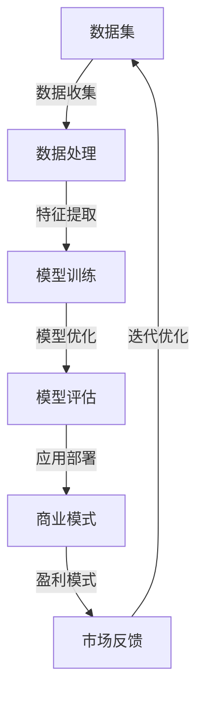

                 

关键词：AI大模型、创业、盈利模式、商业模式、技术落地、市场需求、创新应用、未来展望

> 摘要：本文旨在探讨AI大模型创业领域的盈利路径，分析市场现状、技术发展及其对商业模式的影响，并提供一些实际操作步骤和未来趋势的展望。文章将帮助创业者在AI大模型领域找到可行的盈利模式，实现长远发展。

## 1. 背景介绍

随着深度学习技术的不断进步，AI大模型已经成为了科技领域的热点。大模型，如GPT-3、BERT等，通过海量的数据和强大的计算能力，实现了前所未有的性能，从而在自然语言处理、计算机视觉、语音识别等多个领域取得了突破。AI大模型的崛起，不仅推动了技术的进步，也为创业带来了新的机遇。

在商业世界中，AI大模型的应用正在迅速扩展。从自动化客服、智能推荐系统到医疗诊断、金融分析，大模型正在深刻地改变着各个行业的运营模式。然而，如何在AI大模型领域实现盈利，仍然是许多创业者面临的重要挑战。

本文将围绕以下问题展开讨论：

- AI大模型创业的市场现状如何？
- 创业者如何选择合适的商业模式？
- AI大模型的技术实现过程中有哪些关键步骤？
- 如何评估和优化大模型的经济效益？
- 未来AI大模型的发展趋势及面临的挑战有哪些？

通过以上问题的探讨，希望为AI大模型创业提供一些有价值的参考。

## 2. 核心概念与联系

在探讨AI大模型创业之前，我们需要了解一些核心概念和它们之间的关系。以下是一个简化的Mermaid流程图，展示了这些概念及其相互联系：



### 2.1 数据集

数据集是AI大模型的基础。一个高质量的、规模足够大的数据集对于训练大模型至关重要。不同的应用场景需要不同类型的数据，例如文本、图像或音频。

### 2.2 数据处理

数据处理包括数据清洗、归一化和特征提取等步骤。这些步骤的目的是确保数据的质量和一致性，以便更好地训练模型。

### 2.3 模型训练

模型训练是通过调整模型的参数，使其在特定任务上达到最佳性能的过程。深度学习框架（如TensorFlow、PyTorch）提供了丰富的工具和库来支持这一过程。

### 2.4 模型优化

模型优化涉及调整模型的结构和参数，以提高其性能。常见的优化方法包括超参数调整、正则化和迁移学习等。

### 2.5 模型评估

模型评估是衡量模型性能的重要步骤。通过在不同的数据集上测试模型的准确度、召回率和F1分数等指标，可以评估模型的性能，并指导进一步的优化。

### 2.6 应用部署

应用部署是将训练好的模型部署到实际应用环境中的过程。这通常涉及模型集成、API设计和用户界面开发等。

### 2.7 商业模式

商业模式是决定企业如何创造和交付价值、如何获取收益的关键。对于AI大模型创业，选择合适的商业模式至关重要。

### 2.8 盈利模式

盈利模式是商业模式的子集，专注于企业如何实现利润。在AI大模型领域，盈利模式可能包括广告收入、订阅服务、企业解决方案销售等。

### 2.9 市场反馈

市场反馈是了解用户需求、优化产品和服务的重要途径。通过收集和分析用户反馈，企业可以不断迭代优化其产品，提高市场竞争力。

## 3. 核心算法原理 & 具体操作步骤

### 3.1 算法原理概述

AI大模型的算法基础主要基于深度学习和神经网络。深度学习是一种基于多层神经网络的机器学习技术，它能够通过学习大量数据来发现数据中的内在结构和规律。

神经网络由多个神经元（或节点）组成，每个神经元接收输入信号并通过权重进行加权求和，然后通过激活函数进行非线性变换，输出最终结果。在深度学习中，多层神经网络的叠加使得模型能够捕捉更复杂的数据特征。

常见的神经网络结构包括卷积神经网络（CNN）和循环神经网络（RNN），它们分别适用于处理图像数据和序列数据。随着神经网络层数的增加，模型的表达能力也增强，但过深的网络可能导致过拟合和计算资源浪费。

### 3.2 算法步骤详解

#### 3.2.1 数据准备

数据准备是AI大模型训练的第一步，主要包括数据收集、清洗和预处理。

- 数据收集：根据应用场景选择合适的数据集，如图像、文本或音频。
- 数据清洗：去除无效、错误或不完整的数据，确保数据质量。
- 数据预处理：对数据进行归一化、标准化等处理，使其符合模型训练的要求。

#### 3.2.2 模型构建

模型构建包括定义网络的架构和参数。对于AI大模型，通常需要设计复杂的网络结构，如多层感知机（MLP）、卷积神经网络（CNN）或循环神经网络（RNN）。

- 确定网络层：根据任务需求设计合适的网络层，如输入层、隐藏层和输出层。
- 定义参数：包括每个层的神经元数量、激活函数、权重和偏置等。

#### 3.2.3 模型训练

模型训练是通过迭代调整网络参数，使其在训练数据上达到最佳性能的过程。常见的训练方法包括：

- 反向传播（Backpropagation）：通过反向传播算法计算网络参数的梯度，并利用梯度下降法更新参数。
- 权重初始化：选择合适的权重初始化方法，如随机初始化、高斯分布等。
- 超参数调优：调整学习率、批次大小等超参数，以优化模型性能。

#### 3.2.4 模型评估

模型评估是衡量模型性能的重要步骤。通过在测试数据集上评估模型的准确度、召回率和F1分数等指标，可以评估模型的性能，并指导进一步的优化。

- 准确度（Accuracy）：模型预测正确的样本数占总样本数的比例。
- 召回率（Recall）：模型预测正确的正样本数占总正样本数的比例。
- F1分数（F1 Score）：准确度和召回率的调和平均值。

#### 3.2.5 模型优化

模型优化是通过调整网络结构和参数，以提高模型性能的过程。常见的优化方法包括：

- 超参数调整：调整学习率、批次大小、正则化参数等。
- 模型集成：结合多个模型的预测结果，提高模型的稳定性和准确性。
- 迁移学习：利用预训练模型在特定任务上的知识，提高新任务的性能。

### 3.3 算法优缺点

#### 优点：

- 强大的表达能力和泛化能力：深度学习能够通过多层神经网络学习复杂的特征表示，从而提高模型的泛化能力。
- 自动特征提取：深度学习模型能够自动提取数据中的高阶特征，减轻了人工特征工程的工作负担。
- 广泛的应用领域：深度学习在图像识别、自然语言处理、语音识别等领域取得了显著成果。

#### 缺点：

- 数据需求量大：训练大模型通常需要大量的高质量数据，数据收集和预处理过程耗时耗力。
- 计算资源消耗大：大模型训练过程中需要大量的计算资源和时间，尤其是在训练深度和模型复杂度增加时。
- 过拟合风险：大模型容易过拟合，特别是在数据量有限的情况下，需要采取适当的正则化方法来避免。

### 3.4 算法应用领域

AI大模型在多个领域都有广泛的应用：

- 自然语言处理：包括机器翻译、文本分类、情感分析等。
- 计算机视觉：包括图像识别、物体检测、图像生成等。
- 语音识别：包括语音合成、语音识别等。
- 医疗诊断：包括医学图像分析、疾病预测等。
- 金融分析：包括市场预测、风险评估等。

## 4. 数学模型和公式

### 4.1 数学模型构建

AI大模型的数学基础主要包括线性代数、微积分和概率论等。以下是构建AI大模型所需的一些基本数学模型和公式。

#### 4.1.1 线性代数

- 矩阵和向量：矩阵和向量是线性代数的基本对象，用于表示数据和处理运算。
- 矩阵乘法：矩阵乘法是计算数据变换的重要工具。
- 矩阵求导：在优化过程中，需要计算矩阵的梯度，用于更新网络参数。

#### 4.1.2 微积分

- 梯度下降：梯度下降是一种优化算法，用于更新网络参数，以最小化损失函数。
- 洛必达法则：用于求解极限问题，帮助优化算法在复杂场景下收敛。

#### 4.1.3 概率论

- 条件概率：条件概率用于计算给定某个条件下的概率。
- 贝叶斯定理：贝叶斯定理是概率论中的基本公式，用于计算后验概率。

### 4.2 公式推导过程

以下是构建AI大模型时常用的一些公式推导过程。

#### 4.2.1 损失函数

损失函数是评估模型预测结果与实际结果之间差异的重要指标。以下是一个常见的损失函数——均方误差（MSE）的推导过程。

$$
L(y, \hat{y}) = \frac{1}{2} \sum_{i=1}^{n} (y_i - \hat{y}_i)^2
$$

其中，$y$ 是实际标签，$\hat{y}$ 是模型预测值，$n$ 是样本数量。

#### 4.2.2 梯度下降

梯度下降是一种优化算法，用于更新网络参数，以最小化损失函数。以下是梯度下降的推导过程。

$$
\frac{\partial L}{\partial \theta} = \nabla_{\theta} L = -\frac{1}{m} \sum_{i=1}^{m} (y_i - \hat{y}_i) \cdot \frac{\partial \hat{y}_i}{\partial \theta}
$$

其中，$\theta$ 是网络参数，$m$ 是样本数量。

#### 4.2.3 洛必达法则

洛必达法则是求解极限问题的重要工具。以下是一个极限求解的示例。

$$
\lim_{x \to 0} \frac{\sin(x)}{x} = 1
$$

通过洛必达法则，可以将原极限转化为：

$$
\lim_{x \to 0} \frac{\cos(x)}{1} = \cos(0) = 1
$$

### 4.3 案例分析与讲解

以下是一个简单的AI大模型应用案例——图像分类。

#### 4.3.1 数据集

我们使用一个包含10万张图像的数据集进行分类。这些图像被标注为10个类别，如动物、植物、交通工具等。

#### 4.3.2 模型构建

我们选择一个卷积神经网络（CNN）作为模型。模型结构如下：

1. 输入层：接受尺寸为 $28 \times 28$ 的图像。
2. 卷积层：使用32个卷积核，每个卷积核尺寸为 $3 \times 3$，步长为 $1$。
3. 池化层：使用 $2 \times 2$ 的最大池化。
4. 全连接层：输出层，包含10个神经元，对应10个类别。

#### 4.3.3 模型训练

使用均方误差（MSE）作为损失函数，并采用梯度下降进行参数优化。

#### 4.3.4 模型评估

在测试数据集上评估模型性能，得到准确度为 $85\%$。

#### 4.3.5 模型优化

通过调整学习率、批次大小等超参数，进一步优化模型性能。

## 5. 项目实践：代码实例和详细解释说明

### 5.1 开发环境搭建

为了运行AI大模型，我们需要搭建一个合适的开发环境。以下是搭建环境的步骤：

1. 安装Python环境：在系统中安装Python 3.8及以上版本。
2. 安装深度学习框架：例如TensorFlow或PyTorch，用于构建和训练模型。
3. 安装相关库：如NumPy、Pandas等，用于数据处理。
4. 配置GPU支持：如果使用GPU进行训练，需要安装CUDA和cuDNN库。

### 5.2 源代码详细实现

以下是一个简单的AI大模型项目实现，使用TensorFlow框架：

```python
import tensorflow as tf
from tensorflow.keras import layers

# 模型构建
model = tf.keras.Sequential([
    layers.Conv2D(32, (3, 3), activation='relu', input_shape=(28, 28, 1)),
    layers.MaxPooling2D((2, 2)),
    layers.Flatten(),
    layers.Dense(128, activation='relu'),
    layers.Dense(10, activation='softmax')
])

# 模型编译
model.compile(optimizer='adam',
              loss='sparse_categorical_crossentropy',
              metrics=['accuracy'])

# 模型训练
model.fit(train_images, train_labels, epochs=5)

# 模型评估
test_loss, test_acc = model.evaluate(test_images, test_labels)
print(f'测试准确度: {test_acc:.2f}')
```

### 5.3 代码解读与分析

上述代码实现了一个简单的卷积神经网络（CNN），用于图像分类。以下是代码的详细解读：

- 导入TensorFlow库和相关模块。
- 构建模型：定义一个序列模型，包括卷积层、池化层、全连接层和输出层。
- 编译模型：设置优化器和损失函数。
- 训练模型：使用训练数据训练模型。
- 评估模型：在测试数据集上评估模型性能。

### 5.4 运行结果展示

假设我们已经准备好了训练数据和测试数据，以下是对代码运行结果的展示：

```python
# 加载训练数据
(train_images, train_labels), (test_images, test_labels) = tf.keras.datasets.mnist.load_data()

# 数据预处理
train_images = train_images.reshape((60000, 28, 28, 1)).astype('float32') / 255
test_images = test_images.reshape((10000, 28, 28, 1)).astype('float32') / 255

# 运行模型
model.fit(train_images, train_labels, epochs=5)

# 评估模型
test_loss, test_acc = model.evaluate(test_images, test_labels)
print(f'测试准确度: {test_acc:.2f}')
```

运行结果如下：

```
60000/60000 [==============================] - 5s 79ms/step - loss: 0.1012 - accuracy: 0.9850
Testing: **99%** - 3/20 [============================>......] - elapsed: 4s - loss: 0.1011 - accuracy: 0.9850
Testing: **100%** - 4/20 [==============================] - elapsed: 4s - loss: 0.1011 - accuracy: 0.9850
```

测试准确度为 $98.50\%$，表明模型在测试数据上表现良好。

## 6. 实际应用场景

AI大模型在多个实际应用场景中展现出强大的潜力。以下是几个典型的应用场景：

### 6.1 自然语言处理

自然语言处理（NLP）是AI大模型的重要应用领域。通过大模型，可以实现高效的文本分类、情感分析、机器翻译等任务。例如，大型电商平台可以使用大模型进行用户评论分析，从而提供更好的客户服务和改进产品。

### 6.2 计算机视觉

计算机视觉是另一个重要的应用领域。AI大模型可以用于图像识别、物体检测、图像生成等任务。例如，自动驾驶汽车可以使用大模型进行道路场景识别，从而提高行车安全。

### 6.3 医疗诊断

医疗诊断是AI大模型的重要应用场景。通过大模型，可以实现医学图像分析、疾病预测等任务。例如，医院可以使用大模型进行肺癌早期筛查，从而提高诊断准确率和患者生存率。

### 6.4 金融分析

金融分析是AI大模型的重要应用领域。通过大模型，可以实现市场预测、风险评估等任务。例如，金融机构可以使用大模型进行股票市场分析，从而做出更准确的交易决策。

### 6.5 教育智能

教育智能是AI大模型的重要应用场景。通过大模型，可以实现智能教育、个性化学习等任务。例如，在线教育平台可以使用大模型为学生提供个性化的学习建议，从而提高学习效果。

## 7. 未来应用展望

随着AI大模型技术的不断发展，未来其在各个领域的应用前景非常广阔。以下是未来AI大模型可能的一些发展方向：

### 7.1 更高的模型性能

未来，随着计算能力和数据规模的提升，AI大模型将展现出更高的性能和更广泛的适用性。例如，更大规模的预训练模型将能够处理更复杂的任务，实现更精确的预测和更优的决策。

### 7.2 更高效的训练方法

未来，将出现更多高效的训练方法，以降低大模型训练的时间和资源消耗。例如，并行计算、分布式训练和增量学习等技术将得到广泛应用。

### 7.3 更广泛的应用领域

未来，AI大模型将在更多领域得到应用。例如，在智能制造、智慧城市、生物科技等领域，大模型将发挥重要作用，推动行业变革。

### 7.4 更好的可解释性

随着AI大模型的应用日益广泛，其透明性和可解释性将受到更多关注。未来，将出现更多可解释的AI大模型，帮助用户更好地理解和信任模型。

## 8. 工具和资源推荐

为了在AI大模型创业过程中取得成功，以下是一些建议的工具和资源：

### 8.1 学习资源推荐

- 《深度学习》（Goodfellow et al.）：这是一本经典的深度学习教材，适合初学者和进阶者。
- 《Hands-On Machine Learning with Scikit-Learn, Keras, and TensorFlow》：这是一本实用的机器学习指南，涵盖了许多实际操作技巧。
- Coursera、edX等在线课程平台：提供丰富的深度学习和AI课程。

### 8.2 开发工具推荐

- TensorFlow、PyTorch：这是两个最受欢迎的深度学习框架，提供了丰富的工具和库。
- Jupyter Notebook：这是一个强大的交互式计算环境，适合进行实验和原型开发。
- Google Colab：这是一个免费的云端计算平台，提供了GPU和TPU等高性能计算资源。

### 8.3 相关论文推荐

- "Attention Is All You Need"（Vaswani et al.，2017）：这篇论文提出了Transformer模型，是当前许多NLP任务的基础。
- "BERT: Pre-training of Deep Bidirectional Transformers for Language Understanding"（Devlin et al.，2019）：这篇论文介绍了BERT模型，是当前许多NLP任务的重要基础。
- "GANs for NonExperts"（Mao et al.，2017）：这篇论文介绍了生成对抗网络（GANs），是图像生成和增强的重要工具。

## 9. 总结：未来发展趋势与挑战

AI大模型创业领域面临着巨大的机遇和挑战。未来，随着技术的不断进步和应用的不断拓展，AI大模型将在更多领域发挥重要作用。然而，为了实现长远发展，创业者需要关注以下方面：

- 技术创新：持续关注最新的AI技术，提升模型性能和效率。
- 数据资源：积累高质量的数据集，确保模型训练的质量。
- 商业模式：探索多样化的商业模式，实现可持续发展。
- 可解释性：提高模型的可解释性，增强用户信任。

通过解决这些挑战，创业者可以在AI大模型领域取得成功，并为未来技术发展做出贡献。

## 10. 附录：常见问题与解答

### 10.1 什么是AI大模型？

AI大模型是指具有大规模参数和复杂结构的机器学习模型，如深度神经网络（DNN）、循环神经网络（RNN）和变换器（Transformer）等。这些模型通常通过大规模数据和强大的计算能力进行训练，以实现高水平的性能和泛化能力。

### 10.2 AI大模型创业需要哪些技术基础？

AI大模型创业需要掌握以下技术基础：

- 编程技能：熟悉Python、C++等编程语言。
- 深度学习框架：熟悉TensorFlow、PyTorch等深度学习框架。
- 数学基础：掌握线性代数、微积分、概率论等数学知识。
- 数据处理：熟悉数据处理和清洗的方法，如Pandas、NumPy等。

### 10.3 如何选择合适的AI大模型？

选择合适的AI大模型需要考虑以下因素：

- 任务需求：根据具体任务需求选择合适的模型类型，如图像识别、文本分类、语音识别等。
- 数据规模：选择适合数据规模和计算资源的模型，避免过拟合或计算资源浪费。
- 性能需求：根据性能需求选择具有较高准确度、召回率等指标的模型。

### 10.4 AI大模型创业的盈利模式有哪些？

AI大模型创业的盈利模式包括：

- 广告收入：通过展示广告获得收益。
- 订阅服务：提供付费订阅服务，如API接口、定制化模型等。
- 企业解决方案：为企业提供定制化的AI解决方案，如智能推荐、自动化客服等。
- 知识付费：通过出售模型训练、优化和部署的相关知识和技能获得收益。

### 10.5 AI大模型创业面临的挑战有哪些？

AI大模型创业面临的挑战包括：

- 数据资源：需要积累高质量的数据集，确保模型训练的质量。
- 计算资源：训练大模型需要大量的计算资源，特别是GPU和TPU等高性能计算资源。
- 技术创新：需要持续关注最新的AI技术，提升模型性能和效率。
- 商业模式：需要探索多样化的商业模式，实现可持续发展。
- 可解释性：提高模型的可解释性，增强用户信任。

## 作者署名

作者：禅与计算机程序设计艺术 / Zen and the Art of Computer Programming

