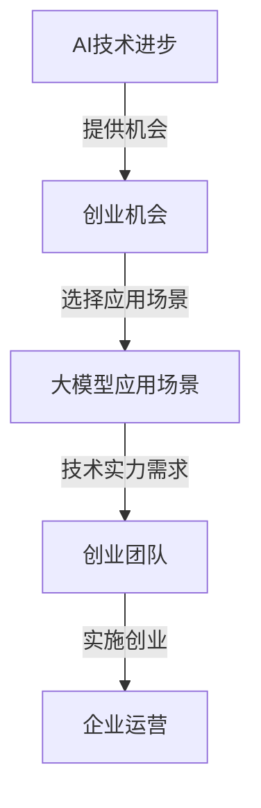

                 

关键词：人工智能，大模型，创业，挑战，策略，未来

> 摘要：随着人工智能技术的飞速发展，大型AI模型的应用已经成为创业领域的新热点。本文旨在探讨AI大模型创业所面临的挑战，并给出相应的应对策略，以期为创业者提供有益的参考。

## 1. 背景介绍

近年来，人工智能（AI）技术的快速发展极大地改变了各行各业的运作方式。特别是在深度学习领域，大型AI模型的诞生使得许多复杂问题的解决变得更加高效和精准。例如，自然语言处理（NLP）、计算机视觉（CV）和推荐系统等领域，大型AI模型的性能已经达到了前所未有的高度。这些模型不仅提升了企业的生产效率，还开辟了新的商业模式和市场机会。

在这样的背景下，越来越多的创业者开始关注AI大模型，并将其视为提升竞争力、开拓市场的利器。然而，AI大模型创业并非一帆风顺，创业者需要面对一系列挑战，包括技术、资金、市场和人才等方面。

## 2. 核心概念与联系

为了更好地理解AI大模型创业，首先需要了解以下几个核心概念：

- **人工智能（AI）**：一种模拟人类智能的技术，包括机器学习、深度学习、自然语言处理等子领域。
- **大模型（Large Model）**：指参数规模达到亿级甚至千亿级的深度学习模型。这些模型通常具有强大的表征能力和泛化能力。
- **创业**：指创业者创立新的企业，通过提供创新产品或服务来满足市场需求。

下面是AI大模型创业中的几个关键联系：

1. **AI技术进步与创业机会**：AI技术的进步为创业者提供了丰富的机会，使得原本复杂的问题可以通过AI模型得到高效解决。
2. **大模型的应用场景**：不同领域和应用场景对AI大模型的需求不同，创业者需要根据市场需求选择合适的应用场景。
3. **创业团队与技术实力**：创业者需要具备一定的技术实力，能够设计和实现高性能的AI大模型。

### Mermaid 流程图（此处省略具体节点内容，仅为示意）



## 3. 核心算法原理 & 具体操作步骤

### 3.1 算法原理概述

AI大模型的构建通常基于深度学习技术，特别是基于神经网络的结构。深度学习模型通过多层神经元的组合，实现对输入数据的复杂特征提取和表示。在这个过程中，模型的参数规模（如权重和偏置）至关重要。随着模型参数的增多，模型能够捕捉到输入数据的更多细节和特征，从而提高模型的泛化能力和表现。

### 3.2 算法步骤详解

1. **数据收集**：首先，需要收集大量高质量的数据。这些数据可以来自公开数据集、企业内部数据或第三方数据服务。
2. **数据处理**：对收集到的数据进行预处理，包括数据清洗、数据增强和数据归一化等步骤。
3. **模型设计**：根据应用场景设计合适的神经网络结构，包括选择合适的激活函数、损失函数和优化器。
4. **模型训练**：使用预处理后的数据对模型进行训练，通过迭代优化模型的参数。
5. **模型评估**：在验证集上评估模型的性能，通过交叉验证等技术确保模型的可重复性和鲁棒性。
6. **模型部署**：将训练好的模型部署到生产环境中，进行实时推理和应用。

### 3.3 算法优缺点

**优点**：
- **强大的表征能力**：大模型能够捕捉到输入数据的复杂特征，从而在多种任务上表现出色。
- **泛化能力强**：通过大规模数据训练，大模型具有良好的泛化能力，能够适应不同的应用场景。
- **自动化**：深度学习模型可以自动进行特征提取和模式识别，减少人为干预。

**缺点**：
- **计算资源需求大**：大模型需要大量的计算资源进行训练和推理，对硬件设施要求较高。
- **数据需求量大**：大模型的训练需要大量高质量的数据，数据收集和预处理是一个耗时且耗资源的过程。
- **模型解释性差**：深度学习模型通常被视为“黑盒子”，难以解释其内部决策过程。

### 3.4 算法应用领域

AI大模型在多个领域取得了显著的成果，主要包括：

- **自然语言处理（NLP）**：如机器翻译、文本生成、情感分析等。
- **计算机视觉（CV）**：如图像识别、目标检测、图像生成等。
- **推荐系统**：如个性化推荐、内容推荐等。
- **医疗健康**：如疾病诊断、药物研发等。
- **金融科技**：如风险控制、量化交易等。

## 4. 数学模型和公式 & 详细讲解 & 举例说明

### 4.1 数学模型构建

AI大模型的核心是神经网络，其数学基础主要包括线性代数、概率论和信息论。以下是神经网络中几个重要的数学模型和公式：

- **权重矩阵（W）**：表示神经网络中权重参数的矩阵。
- **激活函数（\( f \)）**：用于引入非线性，常见的有ReLU、Sigmoid、Tanh等。
- **损失函数（\( L \)）**：用于衡量模型预测值与真实值之间的差距，常见的有均方误差（MSE）、交叉熵（CE）等。
- **反向传播算法（Backpropagation）**：用于计算模型参数的梯度，用于后续的优化。

### 4.2 公式推导过程

以下是一个简单的多层感知机（MLP）神经网络的损失函数推导：

假设我们有输入向量 \( x \) 和对应的标签 \( y \)，模型输出为 \( \hat{y} \)，则损失函数可以表示为：

$$ L(\theta) = -\frac{1}{m} \sum_{i=1}^{m} y_i \log(\hat{y}_i) + (1 - y_i) \log(1 - \hat{y}_i) $$

其中，\( m \) 是样本数量，\( \theta \) 是模型参数。

### 4.3 案例分析与讲解

假设我们有一个二分类问题，数据集包含100个样本，每个样本有5个特征。我们的任务是预测样本属于类别0还是类别1。

1. **数据收集与预处理**：收集包含标签的数据，并进行标准化处理。
2. **模型设计**：设计一个包含一个输入层、一个隐藏层和一个输出层的MLP模型，选择ReLU作为激活函数。
3. **模型训练**：使用随机梯度下降（SGD）算法进行训练，训练过程使用交叉熵作为损失函数。
4. **模型评估**：在验证集上评估模型的性能，通过交叉验证确保模型的鲁棒性。

经过多次迭代训练，模型在验证集上的准确率达到90%。接下来，我们将模型部署到生产环境中，进行实时预测。

## 5. 项目实践：代码实例和详细解释说明

### 5.1 开发环境搭建

为了实现AI大模型，我们需要搭建一个合适的开发环境。以下是一个基本的Python环境搭建步骤：

1. 安装Python（版本3.8及以上）。
2. 安装依赖管理工具pip。
3. 安装深度学习框架（如TensorFlow、PyTorch）。
4. 安装其他必要的库（如NumPy、Pandas、Scikit-learn等）。

### 5.2 源代码详细实现

以下是一个简单的AI大模型实现示例，基于PyTorch框架：

```python
import torch
import torch.nn as nn
import torch.optim as optim

# 数据预处理
# ...

# 模型设计
class Model(nn.Module):
    def __init__(self):
        super(Model, self).__init__()
        self.fc1 = nn.Linear(in_features=5, out_features=10)
        self.fc2 = nn.Linear(in_features=10, out_features=2)
        self.relu = nn.ReLU()

    def forward(self, x):
        x = self.relu(self.fc1(x))
        x = self.fc2(x)
        return x

# 模型训练
model = Model()
criterion = nn.CrossEntropyLoss()
optimizer = optim.SGD(model.parameters(), lr=0.01)

for epoch in range(100):
    optimizer.zero_grad()
    outputs = model(inputs)
    loss = criterion(outputs, labels)
    loss.backward()
    optimizer.step()
```

### 5.3 代码解读与分析

上述代码首先进行了数据预处理，然后定义了一个简单的MLP模型，包括两个全连接层和ReLU激活函数。在训练过程中，使用交叉熵损失函数和随机梯度下降优化器对模型进行训练。

### 5.4 运行结果展示

在训练完成后，我们可以使用验证集评估模型的性能。以下是一个简单的性能评估代码示例：

```python
with torch.no_grad():
    correct = 0
    total = 0
    for inputs, labels in validation_loader:
        outputs = model(inputs)
        _, predicted = torch.max(outputs.data, 1)
        total += labels.size(0)
        correct += (predicted == labels).sum().item()

accuracy = 100 * correct / total
print(f'Validation Accuracy: {accuracy:.2f}%')
```

## 6. 实际应用场景

AI大模型在多个实际应用场景中展现了巨大的潜力，以下是一些典型的应用场景：

### 6.1 自然语言处理

自然语言处理（NLP）是AI大模型的重要应用领域之一。通过预训练大型语言模型（如BERT、GPT），可以实现对文本的语义理解、文本生成、机器翻译等任务的高效处理。例如，Google的BERT模型在多项NLP任务上取得了显著成果，包括问答系统、情感分析等。

### 6.2 计算机视觉

计算机视觉（CV）也是AI大模型的重要应用领域。通过训练大型图像识别模型，可以实现高效的图像分类、目标检测、图像生成等任务。例如，OpenAI的DALL-E模型利用GPT-3实现了高效的图像生成，创造出了令人惊叹的艺术作品。

### 6.3 推荐系统

推荐系统利用AI大模型可以更好地理解用户行为和偏好，从而提供个性化的推荐服务。例如，Netflix使用AI大模型为用户提供个性化的视频推荐，显著提升了用户体验和用户留存率。

### 6.4 医疗健康

在医疗健康领域，AI大模型可以用于疾病诊断、药物研发等任务。例如，Google的DeepMind团队使用AI大模型对医学影像进行分析，实现了对疾病的早期诊断和预测。

### 6.5 金融科技

在金融科技领域，AI大模型可以用于风险控制、量化交易等任务。例如，J.P. Morgan使用AI大模型实现了自动化的合约解析和交易策略制定，显著提升了交易效率。

## 7. 工具和资源推荐

为了更好地进行AI大模型创业，以下是一些推荐的工具和资源：

### 7.1 学习资源推荐

- **《深度学习》（Goodfellow, Bengio, Courville）**：深度学习领域的经典教材，适合初学者和进阶者。
- **Coursera、edX等在线课程**：提供丰富的AI和深度学习课程，适合自学。
- **Kaggle**：提供大量的AI和数据科学竞赛，是提升实战能力的绝佳平台。

### 7.2 开发工具推荐

- **TensorFlow、PyTorch**：最受欢迎的深度学习框架，支持多种编程语言和硬件平台。
- **Google Colab**：免费的云端GPU和TPU，适合快速原型开发和测试。
- **Docker**：容器化技术，方便部署和管理深度学习模型。

### 7.3 相关论文推荐

- **“Attention Is All You Need”**：提出Transformer模型，是NLP领域的重要突破。
- **“BERT: Pre-training of Deep Neural Networks for Language Understanding”**：BERT模型的详细介绍，是NLP领域的重要工作。
- **“GPT-3: Language Models are few-shot learners”**：介绍GPT-3模型的详细技术细节。

## 8. 总结：未来发展趋势与挑战

### 8.1 研究成果总结

AI大模型在多个领域取得了显著的成果，包括NLP、CV、推荐系统、医疗健康和金融科技等。大型AI模型的崛起不仅提升了行业的生产效率，还开辟了新的商业模式和市场机会。

### 8.2 未来发展趋势

随着技术的进步和应用的深入，AI大模型未来将继续在以下几个方面发展：

- **模型压缩与加速**：通过模型压缩和硬件加速技术，降低大模型的计算资源和存储需求。
- **多模态学习**：结合多种数据模

