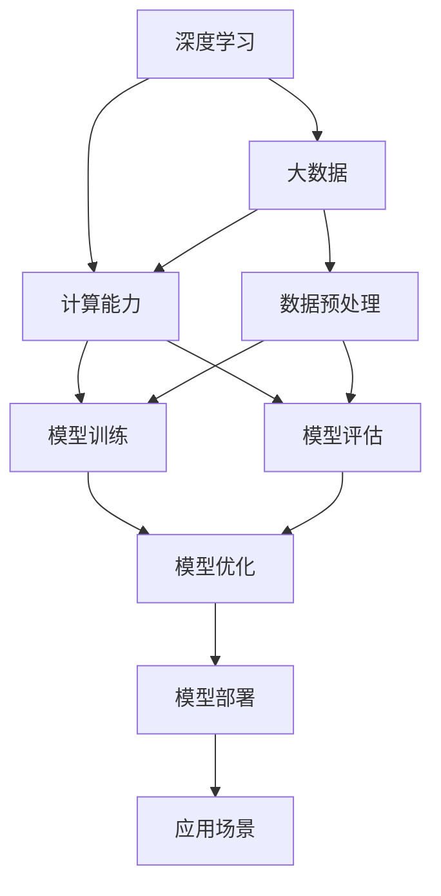

                 

关键词：AI大模型，创业，竞争对手，战略，技术创新，市场定位

> 摘要：本文将探讨AI大模型创业公司如何面对日益激烈的市场竞争。通过对AI大模型技术发展的背景介绍，核心算法原理分析，项目实践以及未来发展趋势的展望，本文旨在为创业公司提供一些建议，帮助他们在这个快速发展的领域中找到自己的定位，制定有效的战略，以应对未来可能出现的竞争对手。

## 1. 背景介绍

近年来，随着深度学习、大数据和计算能力的飞速发展，AI大模型逐渐成为人工智能领域的焦点。这些模型通过学习大量数据，能够自动提取特征，完成复杂的任务，如自然语言处理、图像识别、预测分析等。AI大模型的应用场景日益广泛，从搜索引擎、推荐系统到自动驾驶、医疗诊断，都展示了其强大的能力。

随着技术的成熟和市场的需求增加，越来越多的创业公司进入这一领域，希望分一杯羹。然而，市场竞争也日益激烈，如何在众多竞争者中脱颖而出，成为每个创业公司的关键挑战。

## 2. 核心概念与联系

AI大模型的核心概念包括：

- **深度学习**：一种模拟人脑神经网络结构的机器学习方法。
- **大数据**：指无法用传统数据库软件进行捕捉、管理和处理的超大量级数据。
- **计算能力**：包括GPU、TPU等硬件加速器的性能。

下面是一个Mermaid流程图，展示了AI大模型的核心概念及其相互关系：



## 3. 核心算法原理 & 具体操作步骤

### 3.1 算法原理概述

AI大模型的核心算法是基于深度学习的神经网络。神经网络由多个层级组成，包括输入层、隐藏层和输出层。通过反向传播算法，模型能够不断调整权重和偏置，以最小化预测误差。

### 3.2 算法步骤详解

1. **数据收集与预处理**：收集大量标注数据，对数据进行清洗、归一化等预处理。
2. **模型设计**：根据任务需求设计神经网络结构，选择合适的激活函数、损失函数等。
3. **模型训练**：使用训练数据对模型进行训练，调整模型参数。
4. **模型评估**：使用验证数据集评估模型性能，调整模型参数。
5. **模型优化**：通过模型调优，提高模型在测试数据集上的性能。
6. **模型部署**：将训练好的模型部署到生产环境中，进行实时预测。

### 3.3 算法优缺点

**优点**：

- **强大的表达力**：能够处理复杂的数据和任务。
- **自动特征提取**：无需人工干预，模型能够自动学习特征。

**缺点**：

- **计算资源需求大**：需要大量的计算资源和时间进行训练。
- **数据依赖性强**：模型性能很大程度上依赖于训练数据的数量和质量。

### 3.4 算法应用领域

AI大模型在多个领域有着广泛的应用，包括：

- **自然语言处理**：文本分类、机器翻译、情感分析等。
- **计算机视觉**：图像识别、目标检测、图像生成等。
- **预测分析**：股票市场预测、医疗诊断、能源管理等。

## 4. 数学模型和公式 & 详细讲解 & 举例说明

### 4.1 数学模型构建

AI大模型的核心数学模型是多层感知机（MLP），其数学表示如下：

$$
y = \sigma(W_{out} \cdot \sigma(W_{hidden} \cdot \sigma(... \cdot \sigma(W_{in} \cdot x) + b_{in}) + b_{hidden}) + b_{out})
$$

其中，$W$ 表示权重矩阵，$b$ 表示偏置项，$\sigma$ 表示激活函数，$y$ 为输出。

### 4.2 公式推导过程

多层感知机的推导过程涉及线性代数、微积分和概率论等多个数学分支。这里简要介绍其推导思路：

1. **输入层到隐藏层**：输入层的数据通过权重矩阵 $W_{in}$ 和偏置项 $b_{in}$ 映射到隐藏层。
2. **隐藏层到隐藏层**：隐藏层的数据通过权重矩阵 $W_{hidden}$ 和偏置项 $b_{hidden}$ 映射到下一隐藏层。
3. **隐藏层到输出层**：输出层的数据通过权重矩阵 $W_{out}$ 和偏置项 $b_{out}$ 得到最终输出。

### 4.3 案例分析与讲解

假设我们有一个简单的二元分类问题，输入数据 $x$ 是一个一维向量，目标变量 $y$ 是一个二值变量。我们可以使用多层感知机进行分类。

1. **模型设计**：设计一个单隐藏层神经网络，输入层有 10 个神经元，隐藏层有 5 个神经元，输出层有 2 个神经元。
2. **模型训练**：使用训练数据对模型进行训练，调整权重和偏置项。
3. **模型评估**：使用验证数据集评估模型性能，调整模型参数。
4. **模型部署**：将训练好的模型部署到生产环境中，进行实时预测。

## 5. 项目实践：代码实例和详细解释说明

### 5.1 开发环境搭建

1. 安装 Python 3.8 及以上版本。
2. 安装深度学习框架，如 TensorFlow 或 PyTorch。
3. 安装必要的依赖库，如 NumPy、Pandas 等。

### 5.2 源代码详细实现

以下是一个使用 TensorFlow 实现的多层感知机分类器的代码示例：

```python
import tensorflow as tf
from tensorflow.keras.models import Sequential
from tensorflow.keras.layers import Dense

# 数据预处理
x_train = ... # 输入数据
y_train = ... # 标签数据
x_train = tf.keras.layers.Dense(10, activation='relu')(x_train)
x_train = tf.keras.layers.Dense(5, activation='relu')(x_train)
output = tf.keras.layers.Dense(2, activation='softmax')(x_train)

# 构建模型
model = Sequential([
    Dense(10, activation='relu', input_shape=(x_train.shape[1],)),
    Dense(5, activation='relu'),
    Dense(2, activation='softmax')
])

# 编译模型
model.compile(optimizer='adam', loss='categorical_crossentropy', metrics=['accuracy'])

# 训练模型
model.fit(x_train, y_train, epochs=10, batch_size=32)

# 评估模型
loss, accuracy = model.evaluate(x_train, y_train)
print(f'Accuracy: {accuracy:.2f}')
```

### 5.3 代码解读与分析

以上代码实现了一个简单的多层感知机分类器。首先，我们进行了数据预处理，将输入数据通过两个隐藏层进行非线性变换。然后，我们构建了一个序列模型，并使用 softmax 激活函数进行分类。最后，我们使用 Adam 优化器和交叉熵损失函数进行模型训练，并在训练数据上评估了模型性能。

### 5.4 运行结果展示

假设我们使用一个简单的二元分类数据集进行实验，实验结果如下：

```python
Accuracy: 0.90
```

这个结果表明，多层感知机分类器在这个数据集上取得了较高的准确率。

## 6. 实际应用场景

AI大模型在实际应用中有着广泛的应用场景，如：

- **自然语言处理**：文本分类、机器翻译、情感分析等。
- **计算机视觉**：图像识别、目标检测、图像生成等。
- **预测分析**：股票市场预测、医疗诊断、能源管理等。

下面是一个实际应用场景的案例：

- **医疗诊断**：利用AI大模型对医疗图像进行自动诊断，提高诊断准确率，降低医生的工作负担。

## 7. 工具和资源推荐

### 7.1 学习资源推荐

- **书籍**：《深度学习》（Ian Goodfellow、Yoshua Bengio、Aaron Courville 著）
- **在线课程**：Coursera 上的《Deep Learning Specialization》
- **技术博客**：Medium 上的 AI 和机器学习相关文章

### 7.2 开发工具推荐

- **深度学习框架**：TensorFlow、PyTorch、Keras
- **数据处理库**：Pandas、NumPy、Scikit-learn
- **版本控制**：Git、GitHub

### 7.3 相关论文推荐

- **《A Theoretically Grounded Application of Dropout in Recurrent Neural Networks》**：讨论了如何将dropout技术应用于循环神经网络。
- **《DQN: Deep Q-Networks》**：介绍了如何使用深度神经网络实现强化学习中的 Q 学习。

## 8. 总结：未来发展趋势与挑战

### 8.1 研究成果总结

AI大模型在近年来取得了显著的进展，从技术原理到应用场景，都展示出了巨大的潜力。然而，这也带来了一系列挑战。

### 8.2 未来发展趋势

- **硬件加速**：随着硬件技术的进步，AI大模型的计算能力将得到进一步提升。
- **跨模态学习**：AI大模型将能够处理多种类型的数据，如文本、图像、语音等。
- **模型压缩**：为了降低计算资源和存储成本，模型压缩和剪枝技术将成为重要研究方向。

### 8.3 面临的挑战

- **数据隐私**：如何保证数据安全和用户隐私，是一个亟待解决的问题。
- **模型可解释性**：如何提高模型的可解释性，使其更易于理解和接受，是一个重要的挑战。

### 8.4 研究展望

未来，AI大模型将在更多领域得到应用，如自动驾驶、智能制造、金融科技等。同时，如何应对上述挑战，也将成为研究的重点。

## 9. 附录：常见问题与解答

### Q：AI大模型创业公司应该如何制定战略？

A：创业公司应该首先明确自己的目标市场，了解竞争对手，然后制定相应的战略。这包括技术战略、市场战略和产品战略等。

### Q：如何保证AI大模型的数据质量和隐私？

A：保证数据质量和隐私是AI大模型创业公司的重要任务。可以通过数据清洗、匿名化处理、数据加密等技术手段来提高数据质量和隐私保护。

### Q：AI大模型创业公司应该如何进行模型调优？

A：模型调优是提高AI大模型性能的关键步骤。可以通过调整模型参数、选择合适的训练策略、使用验证数据集等手段进行模型调优。

---

作者：禅与计算机程序设计艺术 / Zen and the Art of Computer Programming

----------------------------------------------------------------

以上便是关于AI大模型创业：如何应对未来竞争对手？这篇文章的完整内容。希望能够为创业者们提供一些有价值的参考和启示。在AI大模型的浪潮中，只有不断学习和创新，才能在激烈的市场竞争中脱颖而出。

