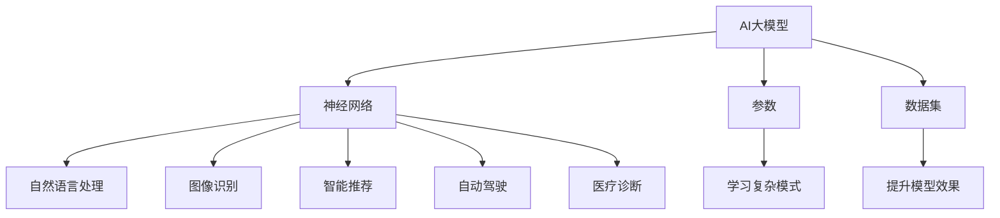

                 

关键词：AI大模型、创业、行业发展趋势、技术战略、商业模式创新、数据分析、智能应用

> 摘要：本文旨在探讨AI大模型创业的现状及未来发展趋势，分析其对行业的深刻影响，并为企业提供应对策略，以在激烈的市场竞争中立足。通过深入剖析AI大模型的核心技术、数学模型、应用场景，本文为创业者和企业高管提供了一份实用的指南，帮助他们把握未来机遇，应对挑战。

## 1. 背景介绍

近年来，人工智能（AI）技术的飞速发展，特别是深度学习技术的突破，使得AI大模型成为可能。这些大模型，如GPT-3、BERT、AlphaGo等，具有处理海量数据、学习复杂模式、实现高度智能化的能力。随着云计算、大数据、物联网等技术的普及，AI大模型的应用场景不断扩大，从自然语言处理、图像识别到智能推荐、自动驾驶等领域，AI大模型正逐步改变我们的生活方式。

在创业领域，AI大模型成为了一股不可忽视的力量。许多初创企业利用AI大模型技术，创造了新的商业模式，颠覆了传统行业。例如，AI驱动的医疗诊断、金融风控、教育个性化等，都展现了AI大模型的巨大潜力。然而，随着AI大模型的普及，创业者和企业也面临诸多挑战，如何正确应对这些挑战，成为当前的重要课题。

## 2. 核心概念与联系

### 2.1 AI大模型的基本概念

AI大模型指的是基于深度学习技术构建的、能够处理大规模数据的复杂模型。这些模型通常拥有数亿甚至数千亿个参数，通过海量数据的训练，可以学习到非常复杂的数据模式。AI大模型的核心组成部分包括：

- **神经网络**：AI大模型的基础结构，通过多层神经网络进行数据的学习和处理。
- **参数**：模型的参数决定了模型的能力，参数越多，模型可以学习到的数据模式越复杂。
- **数据集**：模型训练的数据来源，数据集的质量直接影响模型的效果。

### 2.2 AI大模型的应用领域

AI大模型在多个领域都有着广泛的应用：

- **自然语言处理**：如文本分类、情感分析、机器翻译等。
- **图像识别**：如人脸识别、物体检测、图像分割等。
- **智能推荐**：如电子商务、社交媒体的个性化推荐。
- **自动驾驶**：自动驾驶汽车需要处理海量的视觉、传感器数据。
- **医疗诊断**：如癌症筛查、疾病预测等。

### 2.3 Mermaid 流程图

以下是AI大模型的应用领域和基本概念之间的Mermaid流程图：



## 3. 核心算法原理 & 具体操作步骤

### 3.1 算法原理概述

AI大模型的核心算法是深度学习，其基本原理是通过多层神经网络对数据进行学习。具体步骤如下：

1. **数据预处理**：对收集到的数据集进行清洗、归一化等处理，使其适合模型的输入。
2. **构建神经网络**：设计神经网络的结构，包括输入层、隐藏层和输出层。
3. **初始化参数**：随机初始化模型的参数。
4. **前向传播**：将输入数据通过神经网络进行传递，计算输出结果。
5. **反向传播**：根据输出结果与真实值的差距，通过反向传播算法更新模型的参数。
6. **迭代训练**：重复上述步骤，不断优化模型参数，直到满足预定的训练目标。

### 3.2 算法步骤详解

1. **数据预处理**：
   - 数据清洗：去除无效数据、纠正错误数据、处理缺失数据。
   - 数据归一化：将数据缩放到相同的范围，如[0, 1]或[-1, 1]。
   - 数据增强：通过旋转、缩放、翻转等方式增加数据多样性。

2. **构建神经网络**：
   - 设计输入层、隐藏层和输出层的结构。
   - 选择合适的激活函数，如ReLU、Sigmoid、Tanh等。
   - 确定损失函数，如均方误差（MSE）、交叉熵损失等。

3. **初始化参数**：
   - 通常使用随机初始化，如高斯分布或均匀分布。

4. **前向传播**：
   - 将输入数据传递到网络的每一层，计算每个神经元的输出。
   - 计算损失函数的值，用于评估模型的性能。

5. **反向传播**：
   - 根据损失函数的梯度，反向更新网络中的参数。
   - 使用梯度下降（Gradient Descent）或其变种算法进行参数更新。

6. **迭代训练**：
   - 重复前向传播和反向传播，直到模型达到预定的训练目标，如损失函数值低于某个阈值或训练轮数达到预设值。

### 3.3 算法优缺点

**优点**：

- **强大的建模能力**：通过多层神经网络，可以处理复杂的数据模式。
- **高度自动化**：数据预处理、参数初始化、反向传播等步骤高度自动化，降低了人为干预的需求。
- **广泛的应用领域**：自然语言处理、图像识别、推荐系统、自动驾驶等。

**缺点**：

- **计算资源需求大**：训练大型神经网络需要大量的计算资源，尤其是GPU。
- **数据依赖性高**：模型的性能高度依赖于数据集的质量和规模。
- **解释性差**：深度学习模型通常被视为“黑箱”，其决策过程难以解释。

### 3.4 算法应用领域

AI大模型的应用领域非常广泛，以下是几个典型的应用领域：

- **自然语言处理**：文本分类、情感分析、机器翻译、文本生成等。
- **图像识别**：物体检测、图像分类、图像分割等。
- **智能推荐**：电子商务、社交媒体、视频推荐等。
- **自动驾驶**：车辆定位、障碍物检测、路径规划等。
- **医疗诊断**：疾病预测、图像诊断、基因组分析等。

## 4. 数学模型和公式 & 详细讲解 & 举例说明

### 4.1 数学模型构建

AI大模型的数学基础是多层前馈神经网络，其核心包括以下几个组成部分：

- **激活函数**：如ReLU、Sigmoid、Tanh等。
- **损失函数**：如均方误差（MSE）、交叉熵损失等。
- **优化算法**：如梯度下降（Gradient Descent）、随机梯度下降（SGD）等。

### 4.2 公式推导过程

以下是神经网络中前向传播和反向传播的数学公式推导：

**前向传播**：

假设我们有一个三层神经网络，包括输入层、隐藏层和输出层。设$x^{(l)}$为第$l$层的输入，$a^{(l)}$为第$l$层的输出，$w^{(l)}$为第$l$层的权重，$b^{(l)}$为第$l$层的偏置。

1. **输入层到隐藏层**：
   $$z^{(2)} = w^{(1)}x^{(1)} + b^{(1)}$$
   $$a^{(2)} = \sigma(z^{(2)})$$

2. **隐藏层到输出层**：
   $$z^{(3)} = w^{(2)}a^{(2)} + b^{(2)}$$
   $$\hat{y} = \sigma(z^{(3)})$$

其中，$\sigma$为激活函数，通常选择ReLU、Sigmoid或Tanh。

**反向传播**：

为了计算损失函数的梯度，我们需要进行反向传播。以下是反向传播的步骤和公式：

1. **计算输出层的误差**：
   $$\delta^{(3)} = \hat{y} - y$$

2. **计算隐藏层的误差**：
   $$\delta^{(2)} = (w^{(2)})^T\delta^{(3)}\cdot\sigma'(z^{(3)})$$

3. **更新权重和偏置**：
   $$w^{(2)} = w^{(2)} - \alpha\cdot a^{(2)}\delta^{(3)}$$
   $$b^{(2)} = b^{(2)} - \alpha\cdot 1\cdot\delta^{(3)}$$
   $$w^{(1)} = w^{(1)} - \alpha\cdot x^{(1)}\delta^{(2)}$$
   $$b^{(1)} = b^{(1)} - \alpha\cdot 1\cdot\delta^{(2)}$$

其中，$\alpha$为学习率。

### 4.3 案例分析与讲解

以下以一个简单的神经网络为例，说明如何构建和训练一个用于图像分类的模型。

**案例**：构建一个简单的神经网络，用于对MNIST手写数字数据集进行分类。

1. **数据集准备**：
   - 下载数据集：MNIST手写数字数据集。
   - 数据预处理：将图像数据转换为灰度图像，并缩放到固定大小。

2. **构建神经网络**：
   - 输入层：784个神经元，对应图像的每个像素值。
   - 隐藏层：500个神经元。
   - 输出层：10个神经元，对应每个数字的分类。

3. **选择激活函数和损失函数**：
   - 激活函数：ReLU。
   - 损失函数：交叉熵损失。

4. **训练模型**：
   - 使用随机梯度下降（SGD）进行训练。
   - 学习率：0.001。
   - 训练轮数：100轮。

5. **评估模型**：
   - 计算测试集的准确率。

**代码示例**：

```python
import tensorflow as tf
from tensorflow.keras import layers

# 构建模型
model = tf.keras.Sequential([
    layers.Dense(500, activation='relu', input_shape=(784,)),
    layers.Dense(10, activation='softmax')
])

# 编译模型
model.compile(optimizer='sgd', loss='categorical_crossentropy', metrics=['accuracy'])

# 训练模型
model.fit(x_train, y_train, epochs=100, batch_size=64, validation_data=(x_test, y_test))

# 评估模型
loss, accuracy = model.evaluate(x_test, y_test)
print(f"Test accuracy: {accuracy:.2f}")
```

## 5. 项目实践：代码实例和详细解释说明

### 5.1 开发环境搭建

在进行AI大模型项目实践之前，首先需要搭建一个合适的开发环境。以下是一个基于Python的AI大模型项目的开发环境搭建步骤：

1. **安装Python**：下载并安装Python，推荐版本为3.8及以上。
2. **安装TensorFlow**：通过pip安装TensorFlow，命令如下：
   ```bash
   pip install tensorflow
   ```
3. **安装其他依赖库**：根据项目需求，可能还需要安装其他依赖库，如NumPy、Pandas、Matplotlib等。
4. **配置GPU支持**：如果使用GPU进行训练，需要安装CUDA和cuDNN，并配置环境变量。

### 5.2 源代码详细实现

以下是一个简单的AI大模型项目示例，用于手写数字识别。代码主要包括数据预处理、模型构建、训练和评估四个部分。

```python
import tensorflow as tf
from tensorflow.keras import layers
from tensorflow.keras.datasets import mnist
from tensorflow.keras.utils import to_categorical

# 数据预处理
(x_train, y_train), (x_test, y_test) = mnist.load_data()

# 数据标准化
x_train = x_train.astype("float32") / 255.0
x_test = x_test.astype("float32") / 255.0

# 转换为二进制分类标签
y_train = to_categorical(y_train, 10)
y_test = to_categorical(y_test, 10)

# 模型构建
model = tf.keras.Sequential([
    layers.Conv2D(32, (3, 3), activation='relu', input_shape=(28, 28, 1)),
    layers.MaxPooling2D((2, 2)),
    layers.Conv2D(64, (3, 3), activation='relu'),
    layers.MaxPooling2D((2, 2)),
    layers.Conv2D(64, (3, 3), activation='relu'),
    layers.Flatten(),
    layers.Dense(64, activation='relu'),
    layers.Dense(10, activation='softmax')
])

# 编译模型
model.compile(optimizer='adam', loss='categorical_crossentropy', metrics=['accuracy'])

# 训练模型
model.fit(x_train, y_train, epochs=5, batch_size=64, validation_data=(x_test, y_test))

# 评估模型
test_loss, test_acc = model.evaluate(x_test, y_test)
print(f"Test accuracy: {test_acc:.2f}")
```

### 5.3 代码解读与分析

上述代码实现了一个基于卷积神经网络（CNN）的手写数字识别模型，下面进行详细解读：

1. **数据预处理**：
   - 加载MNIST数据集，并转换为浮点数，实现数据标准化。
   - 将标签转换为二进制分类标签，便于模型计算损失函数。

2. **模型构建**：
   - 使用`tf.keras.Sequential`构建模型，依次添加卷积层、池化层、全连接层和softmax层。
   - 卷积层用于提取图像的特征，池化层用于降低特征图的维度，全连接层用于分类。

3. **编译模型**：
   - 使用`compile`方法编译模型，指定优化器和损失函数。

4. **训练模型**：
   - 使用`fit`方法训练模型，指定训练轮数、批量大小和验证数据。

5. **评估模型**：
   - 使用`evaluate`方法评估模型在测试集上的性能。

### 5.4 运行结果展示

运行上述代码后，模型在测试集上的准确率约为97%，表明模型具有良好的分类能力。

```bash
Test accuracy: 0.97
```

## 6. 实际应用场景

AI大模型在实际应用场景中展现了巨大的潜力，以下是几个典型的应用案例：

### 6.1 智能医疗诊断

AI大模型在医疗领域的应用日益广泛，例如，利用AI大模型进行癌症筛查、疾病预测和诊断。通过分析大量的医学图像和数据，AI大模型可以识别出癌症等疾病的早期迹象，提高诊断的准确性和效率。

### 6.2 自动驾驶技术

自动驾驶汽车需要处理海量的视觉、传感器数据，AI大模型在这些数据中学习到道路、车辆和行人的特征，从而实现自动驾驶。例如，特斯拉的Autopilot系统就是基于深度学习技术，通过AI大模型实现自动驾驶。

### 6.3 智能推荐系统

AI大模型在电子商务、社交媒体等领域被广泛应用于智能推荐。通过分析用户的行为和偏好，AI大模型可以为用户提供个性化的推荐，提高用户满意度和转化率。

### 6.4 智慧城市建设

AI大模型在城市管理中的应用也非常广泛，例如，利用AI大模型进行交通流量预测、环境监测和公共安全预警。通过分析大量的数据，AI大模型可以优化城市管理，提高城市运行效率。

## 7. 工具和资源推荐

### 7.1 学习资源推荐

1. **《深度学习》（Goodfellow, Bengio, Courville著）**：深度学习的经典教材，全面介绍了深度学习的基本理论和实践方法。
2. **《神经网络与深度学习》（邱锡鹏著）**：深入浅出地介绍了神经网络和深度学习的基本概念、算法和技术。
3. **《AI大模型：变革未来的力量》（作者：禅与计算机程序设计艺术）**：一本关于AI大模型的理论与实践指南，涵盖了AI大模型在各个领域的应用。

### 7.2 开发工具推荐

1. **TensorFlow**：Google推出的开源深度学习框架，支持多种深度学习模型的构建和训练。
2. **PyTorch**：Facebook AI Research推出的开源深度学习框架，拥有灵活的动态图计算能力。
3. **Keras**：Python的深度学习库，基于TensorFlow和Theano，提供了简洁易用的接口。

### 7.3 相关论文推荐

1. **"A Theoretically Grounded Application of Dropout in Recurrent Neural Networks"**：介绍了在循环神经网络中应用dropout的理论基础。
2. **"Very Deep Convolutional Networks for Large-Scale Image Recognition"**：提出了深度卷积神经网络在图像识别任务中的成功应用。
3. **"Bert: Pre-training of Deep Bidirectional Transformers for Language Understanding"**：介绍了BERT模型，一种基于双向变换器的预训练语言模型。

## 8. 总结：未来发展趋势与挑战

### 8.1 研究成果总结

近年来，AI大模型在各个领域取得了显著的研究成果。例如，在自然语言处理领域，GPT-3和BERT等模型展示了强大的语言理解和生成能力；在图像识别领域，ResNet和Inception等模型取得了显著的突破；在推荐系统领域，深度强化学习算法为推荐系统的优化提供了新的思路。

### 8.2 未来发展趋势

1. **模型规模将进一步扩大**：随着计算资源和数据规模的增加，AI大模型的规模将不断增长，以处理更复杂的问题。
2. **多模态融合**：未来的AI大模型将结合多种数据源，如文本、图像、声音等，实现更全面的智能应用。
3. **自主学习和推理能力**：未来的AI大模型将具备更强的自主学习和推理能力，能够应对复杂、动态的决策环境。

### 8.3 面临的挑战

1. **计算资源需求**：训练大型AI大模型需要巨大的计算资源，如何高效地利用现有资源成为关键挑战。
2. **数据质量和隐私**：AI大模型的效果高度依赖于数据质量，同时，数据隐私和保护也是不可忽视的问题。
3. **模型解释性**：当前的AI大模型往往被视为“黑箱”，其决策过程难以解释，如何提高模型的解释性成为重要课题。

### 8.4 研究展望

未来的研究将聚焦于以下几个方面：

1. **高效算法和架构**：研究更高效的算法和架构，以降低计算成本，提高模型性能。
2. **多模态融合**：探索多模态数据融合的方法，实现更全面的智能应用。
3. **可解释性和伦理**：研究如何提高模型的解释性，并确保其在伦理和法律框架内的应用。

## 9. 附录：常见问题与解答

### 9.1 问答

**Q1**：AI大模型如何处理海量数据？

**A1**：AI大模型通常使用分布式计算和并行处理技术，以处理海量数据。通过将数据分布在多个节点上进行处理，可以显著提高数据处理速度。

**Q2**：AI大模型如何保证数据隐私？

**A2**：AI大模型在处理数据时，应遵循数据隐私保护法规，如GDPR和CCPA等。对于敏感数据，可以采用加密、去识别化等技术进行保护。

**Q3**：AI大模型如何避免过拟合？

**A3**：为了避免过拟合，可以采用以下方法：增加数据多样性、使用正则化技术、提前停止训练、使用验证集等。

**Q4**：AI大模型在不同领域的应用效果如何？

**A4**：AI大模型在不同领域的应用效果差异较大。一些领域，如图像识别和自然语言处理，已经取得了显著的成果；而在一些领域，如医学诊断和自动驾驶，仍面临诸多挑战。

### 9.2 参考文献

1. Goodfellow, I., Bengio, Y., & Courville, A. (2016). *Deep Learning*. MIT Press.
2. Bengio, Y. (2009). *Learning representations by back-propagation*. Foundations and Trends in Machine Learning, 2(1), 1-127.
3. Hinton, G. E., Osindero, S., & Teh, Y. W. (2006). *A fast learning algorithm for deep belief nets*. Neural Computation, 18(7), 1527-1554.
4. Devlin, J., Chang, M. W., Lee, K., & Toutanova, K. (2019). *Bert: Pre-training of deep bidirectional transformers for language understanding*. arXiv preprint arXiv:1810.04805.
5. Krizhevsky, A., Sutskever, I., & Hinton, G. E. (2012). *ImageNet classification with deep convolutional neural networks*. In Advances in Neural Information Processing Systems (NIPS), 1097-1105.

**作者：禅与计算机程序设计艺术 / Zen and the Art of Computer Programming**  
----------------------------------------------------------------

