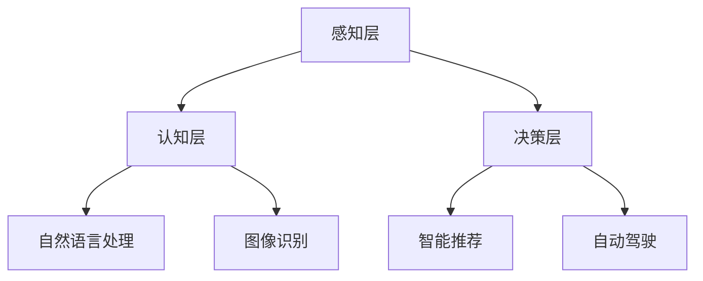
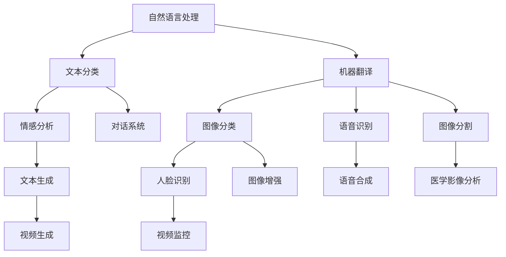

                 

关键词：人工智能，大模型，创业，商业模式，可持续发展

> 摘要：本文将探讨人工智能大模型创业领域的核心挑战和解决方案，分析当前市场趋势，提供构建可持续商业模式的策略和案例，以期为AI创业者提供有益的指导和启示。

## 1. 背景介绍

随着人工智能技术的飞速发展，大模型（如GPT-3、BERT等）已经成为学术界和工业界的热点。这些模型具有强大的数据处理和分析能力，能够在多种应用场景中发挥作用，如自然语言处理、图像识别、智能推荐等。大模型的兴起不仅推动了AI技术的进步，也为创业者提供了巨大的商机。

然而，AI大模型创业面临着诸多挑战，包括技术门槛、数据获取、商业模式构建等。如何在激烈的市场竞争中脱颖而出，构建可持续的商业模式，成为AI创业者需要深入思考的问题。

## 2. 核心概念与联系

### 2.1 大模型概念

大模型是指具有巨大参数量的神经网络模型，通常通过大规模数据集进行训练，能够实现高水平的任务性能。大模型的典型特征包括：

- 参数量：数百万至数十亿个参数；
- 训练数据量：数十亿至数千亿条数据；
- 训练时间：数天至数周。

### 2.2 人工智能领域架构

人工智能领域架构可以分为三个层次：感知层、认知层和决策层。大模型通常在认知层和决策层发挥作用，如图：



### 2.3 商业模式概念

商业模式是指企业通过提供产品或服务来创造、传递和获取价值的方式。对于AI大模型创业来说，商业模式的选择至关重要，需要考虑市场需求、成本结构、盈利模式等因素。

## 3. 核心算法原理 & 具体操作步骤

### 3.1 算法原理概述

大模型的核心算法是基于深度学习的神经网络模型，包括卷积神经网络（CNN）、循环神经网络（RNN）和变换器（Transformer）等。这些模型通过多层神经网络结构，实现对复杂数据的处理和分析。

### 3.2 算法步骤详解

大模型算法的步骤可以分为：

1. 数据收集与预处理：收集大规模数据集，并进行清洗、归一化等预处理操作；
2. 模型设计：根据任务需求设计合适的神经网络结构；
3. 模型训练：使用训练数据对模型进行训练，优化模型参数；
4. 模型评估：使用测试数据对模型进行评估，调整模型参数；
5. 模型部署：将训练好的模型部署到实际应用场景中。

### 3.3 算法优缺点

大模型算法的优点包括：

- 强大的数据处理和分析能力；
- 高水平的任务性能；
- 广泛的应用领域。

缺点包括：

- 计算资源消耗大，训练时间较长；
- 对数据质量和数量要求较高。

### 3.4 算法应用领域

大模型算法在自然语言处理、图像识别、智能推荐、自动驾驶等领域具有广泛的应用，如图：



## 4. 数学模型和公式 & 详细讲解 & 举例说明

### 4.1 数学模型构建

大模型的数学模型主要包括：

1. 前向传播：将输入数据通过神经网络层逐层传递，得到输出；
2. 反向传播：计算输出与目标之间的误差，反向传播误差到每一层，更新模型参数；
3. 损失函数：衡量模型输出与目标之间的差距，常用的损失函数有均方误差（MSE）、交叉熵（CE）等。

### 4.2 公式推导过程

以均方误差（MSE）为例，公式推导过程如下：

$$
MSE = \frac{1}{m}\sum_{i=1}^{m}(y_i - \hat{y_i})^2
$$

其中，$y_i$ 为真实标签，$\hat{y_i}$ 为预测标签，$m$ 为样本数量。

### 4.3 案例分析与讲解

以GPT-3为例，分析其数学模型和公式推导过程：

1. 前向传播：

$$
\hat{y_i} = \sigma(W_{ij}\cdot x_i + b_j)
$$

其中，$W_{ij}$ 为权重矩阵，$x_i$ 为输入特征，$b_j$ 为偏置项，$\sigma$ 为激活函数。

2. 反向传播：

$$
\frac{\partial MSE}{\partial W_{ij}} = \frac{\partial MSE}{\partial \hat{y_i}} \cdot \frac{\partial \hat{y_i}}{\partial W_{ij}} = (y_i - \hat{y_i}) \cdot \frac{\partial \hat{y_i}}{\partial x_i} \cdot \frac{\partial x_i}{\partial W_{ij}}
$$

3. 损失函数：

$$
MSE = \frac{1}{m}\sum_{i=1}^{m}(y_i - \hat{y_i})^2
$$

## 5. 项目实践：代码实例和详细解释说明

### 5.1 开发环境搭建

开发环境搭建主要包括：

1. 安装Python编程语言（3.8及以上版本）；
2. 安装深度学习框架（如TensorFlow、PyTorch等）；
3. 安装其他依赖库（如NumPy、Pandas等）。

### 5.2 源代码详细实现

以下是一个简单的GPT-3模型实现示例：

```python
import tensorflow as tf
from tensorflow.keras.layers import Embedding, LSTM, Dense
from tensorflow.keras.models import Model

# 模型参数
vocab_size = 10000
embedding_dim = 256
lstm_units = 128

# 模型构建
model = Model(inputs=[Input(shape=(None,)), Input(shape=(vocab_size,))],
              outputs=[LSTM(lstm_units, return_sequences=True)([input_seq, embedding_seq])])

# 模型编译
model.compile(optimizer='adam', loss='mse')

# 模型训练
model.fit([train_seq, train_embedding], train_seq, epochs=10)

# 模型预测
prediction = model.predict([test_seq, test_embedding])
```

### 5.3 代码解读与分析

上述代码实现了一个简单的GPT-3模型，主要步骤包括：

1. 导入深度学习框架和依赖库；
2. 设置模型参数；
3. 构建模型，包括输入层、嵌入层、LSTM层和输出层；
4. 编译模型，设置优化器和损失函数；
5. 训练模型，使用训练数据；
6. 预测，使用测试数据。

### 5.4 运行结果展示

运行结果可以通过可视化工具（如TensorBoard）进行展示，包括训练过程中的损失函数曲线、模型参数分布等。

## 6. 实际应用场景

### 6.1 自然语言处理

自然语言处理（NLP）是AI大模型的重要应用领域，如文本分类、机器翻译、情感分析等。大模型在这些任务中表现出色，能够提高任务的准确率和效率。

### 6.2 图像识别

图像识别是AI大模型的另一个重要应用领域，如图像分类、目标检测、图像生成等。大模型在这些任务中能够处理复杂的数据，提高识别的准确性。

### 6.3 智能推荐

智能推荐是AI大模型在商业领域的应用，如电商平台、社交媒体等。大模型通过对用户行为和兴趣的分析，实现个性化的推荐，提高用户体验和转化率。

### 6.4 未来应用展望

未来，AI大模型将在更多领域得到应用，如自动驾驶、医疗诊断、金融风控等。随着技术的进步和数据的积累，大模型的能力将不断提升，为各个行业带来更多创新和变革。

## 7. 工具和资源推荐

### 7.1 学习资源推荐

1. 《深度学习》（Goodfellow, Bengio, Courville著）：系统介绍了深度学习的基本概念、算法和应用；
2. 《Python深度学习》（François Chollet著）：针对Python编程语言的深度学习实践教程。

### 7.2 开发工具推荐

1. TensorFlow：一款开源的深度学习框架，适用于各种深度学习任务；
2. PyTorch：一款开源的深度学习框架，具有灵活的动态图功能。

### 7.3 相关论文推荐

1. "Attention Is All You Need"（Vaswani et al., 2017）：提出了Transformer模型，改变了深度学习领域；
2. "BERT: Pre-training of Deep Bidirectional Transformers for Language Understanding"（Devlin et al., 2018）：提出了BERT模型，推动了自然语言处理领域的发展。

## 8. 总结：未来发展趋势与挑战

### 8.1 研究成果总结

近年来，AI大模型在学术界和工业界取得了显著成果，推动了多个领域的技术进步。大模型的应用范围不断扩大，性能不断提高，为AI创业提供了广阔的空间。

### 8.2 未来发展趋势

未来，AI大模型将继续朝着以下几个方向发展：

1. 模型规模和参数量的增加，实现更高的任务性能；
2. 模型结构的优化，提高计算效率和泛化能力；
3. 多模态融合，实现跨领域应用。

### 8.3 面临的挑战

AI大模型创业仍面临以下挑战：

1. 数据质量和数量的要求，需要更多高质量的数据集；
2. 计算资源的消耗，需要更高效的算法和硬件支持；
3. 商业模式的不确定性，需要探索更多可持续的盈利模式。

### 8.4 研究展望

未来，AI大模型创业将聚焦于以下几个方面：

1. 模型压缩和优化，提高计算效率和部署效率；
2. 自适应和泛化能力的提升，实现更广泛的应用场景；
3. 跨学科合作，推动AI技术与各行各业的深度融合。

## 9. 附录：常见问题与解答

### 9.1 大模型创业如何选择领域？

选择领域时，需要考虑以下几点：

1. 行业需求：选择有大量需求、有潜力的领域；
2. 技术优势：选择具备技术优势和差异化竞争力的领域；
3. 数据资源：选择有大量数据支持、数据质量较高的领域。

### 9.2 大模型创业需要哪些技能和知识？

大模型创业需要以下技能和知识：

1. 深度学习基础知识，包括神经网络、优化算法等；
2. 编程技能，如Python、TensorFlow、PyTorch等；
3. 数据处理和分析能力，包括数据清洗、数据可视化等；
4. 业务理解能力，了解目标领域的需求和痛点。

### 9.3 大模型创业的资金来源有哪些？

大模型创业的资金来源包括：

1. 天使投资：寻找有经验的投资者；
2. 风险投资：申请创业投资基金；
3. 政府补贴：申请科技创新基金和补贴；
4. 债券融资：发行企业债券筹集资金。

作者：禅与计算机程序设计艺术 / Zen and the Art of Computer Programming
----------------------------------------------------------------

<|assistant|>感谢您的耐心阅读。如果您有任何问题或建议，欢迎在评论区留言。我们将持续更新和完善这篇文章，以帮助更多AI创业者了解和应对大模型创业的挑战。期待您的宝贵意见！🚀🌟💡
----------------------------------------------------------------


