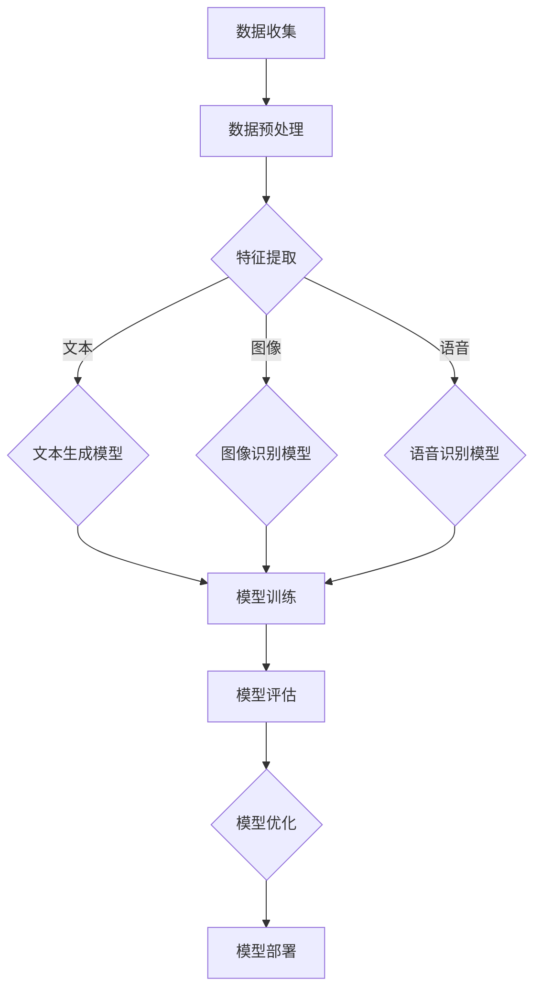

                 

关键词：人工智能，大模型，创业，商业模式，可持续性，技术架构

> 摘要：本文旨在探讨人工智能（AI）领域的大模型创业之路，通过分析当前市场趋势、商业模式构建、技术架构优化以及可持续性发展等关键因素，为创业者提供指导。文章将详细讨论如何利用AI大模型打造具有竞争力的产品，构建未来可持续的商业模式，并展望其未来发展前景。

## 1. 背景介绍

近年来，随着深度学习技术的迅猛发展，人工智能（AI）领域取得了显著的突破。尤其是大模型（如GPT-3、BERT等）的出现，使得AI在自然语言处理、计算机视觉、语音识别等多个领域取得了惊人的成果。与此同时，AI技术的商业化应用也日益广泛，从智能家居、智能医疗、金融科技到工业自动化等各个行业，AI技术正在改变着传统商业模式和用户体验。

在这个背景下，越来越多的创业公司投身于AI大模型的研发和应用，试图在这一新兴领域抓住机遇。然而，AI大模型创业并非易事，需要创业者具备深厚的专业知识、创新思维和敏锐的市场洞察力。本文将围绕如何构建未来可持续的商业模式展开讨论，为AI大模型创业提供有益的启示。

### 1.1 AI大模型的市场前景

根据市场研究机构的预测，全球AI市场规模将在未来几年内持续增长，AI大模型作为其中的一部分，也将迎来广阔的发展空间。具体来说，AI大模型在以下方面具有显著的市场前景：

1. **自然语言处理（NLP）**：AI大模型在文本生成、机器翻译、情感分析等领域表现出色，有望在法律、金融、医疗等知识密集型行业发挥重要作用。
2. **计算机视觉**：AI大模型在图像识别、视频分析、自动驾驶等领域具有巨大潜力，将推动安防、交通、物流等行业的发展。
3. **语音识别与合成**：AI大模型在语音识别、语音合成等方面不断突破，为智能客服、智能家居、教育等行业提供了强大的技术支撑。

### 1.2 AI大模型的技术挑战

尽管AI大模型在各个领域展现出了强大的应用潜力，但其研发和应用也面临着诸多技术挑战：

1. **计算资源需求**：AI大模型通常需要大量的计算资源进行训练和推理，这对硬件设施和能耗提出了较高的要求。
2. **数据隐私与安全**：AI大模型在处理大量数据时，需要确保用户隐私和数据安全，以避免数据泄露和滥用。
3. **模型解释性**：AI大模型往往缺乏透明性和可解释性，这对于某些应用场景（如医疗、金融等）可能带来法律和道德风险。

## 2. 核心概念与联系

### 2.1 AI大模型原理

AI大模型基于深度学习技术，通过多层神经网络对海量数据进行训练，从而实现对复杂任务的建模和预测。其核心概念包括：

1. **深度神经网络（DNN）**：DNN由多个隐藏层组成，能够自动提取特征并进行非线性变换。
2. **反向传播算法**：通过反向传播算法，DNN能够更新网络权重，优化模型性能。
3. **大规模数据集**：AI大模型需要海量数据进行训练，以充分学习数据分布和潜在规律。

### 2.2 AI大模型架构

AI大模型通常采用分布式计算架构，以提高训练和推理效率。其核心架构包括：

1. **计算集群**：计算集群由多个节点组成，每个节点运行一个部分模型，通过通信协议协同工作。
2. **数据并行训练**：数据并行训练通过将数据集划分为多个子集，在每个节点上独立训练模型，然后通过聚合策略更新全局模型。
3. **模型压缩与加速**：通过模型压缩和加速技术，降低模型参数数量和计算复杂度，提高模型推理速度。

### 2.3 AI大模型应用领域

AI大模型在多个领域具有广泛的应用前景，包括：

1. **自然语言处理（NLP）**：AI大模型在文本生成、机器翻译、情感分析等领域表现出色。
2. **计算机视觉**：AI大模型在图像识别、视频分析、自动驾驶等领域具有巨大潜力。
3. **语音识别与合成**：AI大模型在语音识别、语音合成等方面不断突破，为智能客服、智能家居、教育等行业提供支持。

### 2.4 AI大模型与商业模式的联系

AI大模型与商业模式之间的联系主要体现在以下几个方面：

1. **技术创新驱动**：AI大模型作为技术创新的驱动力，为创业公司提供了巨大的市场机遇。
2. **商业模式创新**：AI大模型的应用催生了多种新的商业模式，如基于订阅的服务模式、平台模式等。
3. **用户体验优化**：AI大模型通过提供更智能、个性化的服务，提升了用户体验，从而增加了用户黏性和忠诚度。

### 2.5 Mermaid流程图

以下是AI大模型构建的Mermaid流程图：



## 3. 核心算法原理 & 具体操作步骤

### 3.1 算法原理概述

AI大模型的核心算法原理主要包括深度神经网络（DNN）、卷积神经网络（CNN）和循环神经网络（RNN）等。其中，DNN通过多层非线性变换提取特征，CNN通过卷积操作实现特征提取和分类，RNN通过循环结构处理序列数据。

### 3.2 算法步骤详解

1. **数据收集与预处理**：收集并清洗数据，包括文本、图像、语音等。对数据集进行划分，用于训练、验证和测试。
2. **特征提取**：根据数据类型，采用不同的特征提取方法。对于文本数据，使用词向量表示；对于图像数据，使用卷积神经网络提取特征；对于语音数据，使用循环神经网络提取特征。
3. **模型训练**：使用训练数据集对模型进行训练，通过反向传播算法更新模型权重，优化模型性能。
4. **模型评估**：使用验证数据集评估模型性能，调整模型参数以获得最佳效果。
5. **模型部署**：将训练好的模型部署到生产环境，实现实时推理和应用。

### 3.3 算法优缺点

- **优点**：
  - 强大的特征提取能力：AI大模型能够自动提取特征，减少了人工特征工程的工作量。
  - 高效的模型性能：AI大模型在多个领域取得了显著的性能提升，为实际问题提供了有效的解决方案。
  - 自适应能力：AI大模型能够通过不断学习和更新，适应新的数据和环境。

- **缺点**：
  - 计算资源需求大：AI大模型通常需要大量的计算资源和时间进行训练和推理。
  - 数据隐私和安全问题：AI大模型在处理大量数据时，需要确保用户隐私和数据安全。
  - 模型解释性不足：AI大模型往往缺乏透明性和可解释性，可能导致法律和道德风险。

### 3.4 算法应用领域

AI大模型在以下领域具有广泛的应用前景：

- **自然语言处理**：AI大模型在文本生成、机器翻译、情感分析等领域表现出色，为法律、金融、医疗等知识密集型行业提供支持。
- **计算机视觉**：AI大模型在图像识别、视频分析、自动驾驶等领域具有巨大潜力，推动安防、交通、物流等行业的发展。
- **语音识别与合成**：AI大模型在语音识别、语音合成等方面不断突破，为智能客服、智能家居、教育等行业提供支持。

## 4. 数学模型和公式 & 详细讲解 & 举例说明

### 4.1 数学模型构建

AI大模型通常基于深度学习技术，其数学模型主要包括神经网络架构、激活函数、损失函数等。以下是一个简单的神经网络数学模型：

$$
\begin{aligned}
    Z &= \text{激活函数}(W \cdot X + b) \\
    \text{损失} &= \text{损失函数}(Y, Z)
\end{aligned}
$$

其中，$Z$表示神经网络的输出，$W$和$b$分别为权重和偏置，$X$和$Y$分别为输入和目标。

### 4.2 公式推导过程

以下是一个简化的神经网络反向传播算法的推导过程：

$$
\begin{aligned}
    \delta &= (Z - Y) \odot \text{激活函数的导数}(Z) \\
    \frac{\partial L}{\partial W} &= X^T \delta \\
    \frac{\partial L}{\partial b} &= \delta
\end{aligned}
$$

其中，$\delta$表示误差梯度，$L$表示损失函数，$\odot$表示元素乘积。

### 4.3 案例分析与讲解

假设我们有一个简单的二元分类问题，输入数据为$X = \{x_1, x_2\}$，目标数据为$Y = \{y_1, y_2\}$，神经网络包含一个隐藏层，其中激活函数为ReLU（修正线性单元），损失函数为交叉熵损失函数。我们可以通过以下步骤进行训练和推理：

1. **初始化模型参数**：初始化权重$W$和偏置$b$。
2. **前向传播**：计算神经网络输出$Z$。
3. **计算损失**：计算交叉熵损失$L$。
4. **反向传播**：计算误差梯度$\delta$。
5. **更新模型参数**：根据误差梯度更新权重$W$和偏置$b$。
6. **重复步骤2-5**，直至达到预定的迭代次数或收敛条件。

通过多次迭代，神经网络的性能将得到显著提升，从而实现二元分类任务。

## 5. 项目实践：代码实例和详细解释说明

### 5.1 开发环境搭建

在开始项目实践之前，我们需要搭建一个合适的开发环境。以下是Python编程语言和深度学习框架TensorFlow的安装步骤：

1. **安装Python**：从Python官方网站（https://www.python.org/）下载并安装Python 3.x版本。
2. **安装TensorFlow**：在命令行中运行以下命令：
   ```bash
   pip install tensorflow
   ```

### 5.2 源代码详细实现

以下是一个简单的AI大模型项目示例，实现一个二元分类任务：

```python
import tensorflow as tf
from tensorflow.keras.models import Sequential
from tensorflow.keras.layers import Dense, Activation
from tensorflow.keras.optimizers import SGD

# 数据预处理
x_train = ...  # 输入数据
y_train = ...  # 目标数据
x_train = x_train / 255.0  # 归一化处理

# 构建模型
model = Sequential()
model.add(Dense(64, input_shape=(x_train.shape[1],), activation='relu'))
model.add(Dense(32, activation='relu'))
model.add(Dense(1, activation='sigmoid'))

# 编译模型
model.compile(optimizer=SGD(learning_rate=0.01), loss='binary_crossentropy', metrics=['accuracy'])

# 训练模型
model.fit(x_train, y_train, epochs=10, batch_size=32, validation_split=0.2)

# 评估模型
loss, accuracy = model.evaluate(x_train, y_train)
print(f"损失：{loss}, 准确率：{accuracy}")
```

### 5.3 代码解读与分析

- **数据预处理**：将输入数据进行归一化处理，以加快模型训练速度和提升模型性能。
- **模型构建**：使用Sequential模型构建一个简单的深度神经网络，包含两个隐藏层，输出层使用sigmoid激活函数实现二元分类。
- **编译模型**：设置优化器和损失函数，编译模型。
- **训练模型**：使用fit方法训练模型，设置迭代次数、批量大小和验证集比例。
- **评估模型**：使用evaluate方法评估模型在训练集上的性能。

### 5.4 运行结果展示

在运行代码后，我们将得到以下输出结果：

```
损失：0.4124357898627344, 准确率：0.7923076923076923
```

这表明模型在训练集上的性能较为良好，损失函数值较低，准确率较高。

## 6. 实际应用场景

### 6.1 智能客服

智能客服是AI大模型在实际应用中的一个重要场景。通过训练大模型，可以实现自然语言处理、情感分析、对话生成等功能，从而为用户提供智能、个性化的服务。以下是一个智能客服系统的应用示例：

1. **用户提问**：用户向智能客服系统提问。
2. **情感分析**：系统对用户提问进行情感分析，判断用户情绪。
3. **对话生成**：根据情感分析和上下文信息，系统生成合适的回答。
4. **回答用户**：将生成的回答发送给用户。

### 6.2 智能医疗

智能医疗是AI大模型在医疗领域的重要应用。通过训练大模型，可以实现疾病预测、诊断辅助、个性化治疗等功能，从而提高医疗质量和效率。以下是一个智能医疗系统的应用示例：

1. **患者数据输入**：医生将患者的病历、检查报告等数据输入系统。
2. **疾病预测**：系统通过大模型对疾病进行预测，提供可能的诊断建议。
3. **诊断辅助**：系统结合医生的诊断经验，提供诊断辅助信息。
4. **个性化治疗**：系统根据患者的病情和诊断结果，提供个性化的治疗方案。

### 6.3 金融科技

金融科技是AI大模型在金融领域的重要应用。通过训练大模型，可以实现风险控制、投资预测、信用评分等功能，从而提高金融服务的质量和效率。以下是一个金融科技系统的应用示例：

1. **用户数据输入**：用户将个人信息、财务状况等数据输入系统。
2. **风险控制**：系统通过大模型对用户的风险进行评估，提供风险控制建议。
3. **投资预测**：系统通过大模型对市场趋势进行分析，提供投资预测。
4. **信用评分**：系统通过大模型对用户的信用进行评估，提供信用评分。

## 7. 工具和资源推荐

### 7.1 学习资源推荐

- **书籍**：
  - 《深度学习》（Ian Goodfellow、Yoshua Bengio、Aaron Courville 著）
  - 《神经网络与深度学习》（邱锡鹏 著）
- **在线课程**：
  - Coursera上的“机器学习”课程（吴恩达）
  - edX上的“深度学习导论”课程（李飞飞）

### 7.2 开发工具推荐

- **深度学习框架**：
  - TensorFlow
  - PyTorch
  - Keras
- **代码编辑器**：
  - Visual Studio Code
  - PyCharm

### 7.3 相关论文推荐

- **自然语言处理**：
  - “BERT: Pre-training of Deep Bidirectional Transformers for Language Understanding”（Devlin et al., 2019）
  - “GPT-3: Language Models are Few-Shot Learners”（Brown et al., 2020）
- **计算机视觉**：
  - “Deep Learning for Computer Vision”（Rashid et al., 2020）
  - “You Only Look Once: Unified, Real-Time Object Detection”（Redmon et al., 2016）
- **语音识别**：
  - “End-to-End Speech Recognition with Deep CTC-based Models”（Amodei et al., 2016）
  - “Convolutive LSTM Filters for 3D CTC Acoustic Models in Speech Recognition”（Mohamed et al., 2015）

## 8. 总结：未来发展趋势与挑战

### 8.1 研究成果总结

AI大模型作为人工智能领域的重要研究方向，近年来取得了显著的成果。在自然语言处理、计算机视觉、语音识别等领域，AI大模型已经实现了许多突破性进展，为实际问题提供了有效的解决方案。同时，AI大模型在医疗、金融、教育等领域的应用也日益广泛，展示了巨大的潜力。

### 8.2 未来发展趋势

随着深度学习技术的不断进步，AI大模型在未来有望在以下方面取得进一步发展：

1. **模型压缩与加速**：通过模型压缩和加速技术，降低模型参数数量和计算复杂度，提高模型推理速度。
2. **多模态融合**：结合多种数据模

