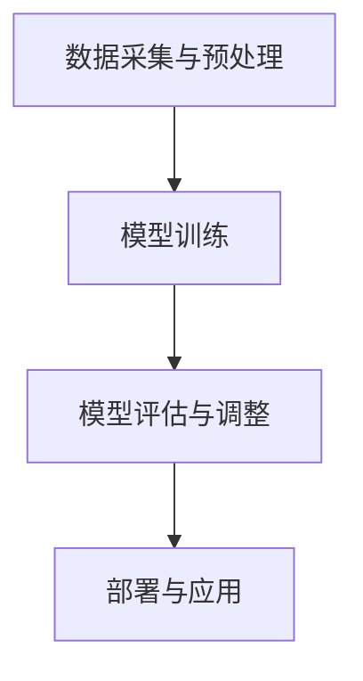

                 

关键词：人工智能大模型、创业挑战、机遇分析、技术发展、商业模式

摘要：本文将探讨人工智能大模型创业的现状、面临的挑战和潜在的机遇。通过对大模型技术的发展趋势、商业模式创新和实际应用场景的分析，旨在为创业者提供有价值的指导和建议。

## 1. 背景介绍

人工智能（AI）技术的迅猛发展，尤其是深度学习技术的突破，推动了人工智能大模型的出现。大模型，通常指的是具有数十亿甚至千亿参数的神经网络模型，这些模型在图像识别、自然语言处理、推荐系统等领域取得了显著成效。随着计算能力的提升和数据量的爆炸性增长，大模型的训练和部署变得越来越普及，也吸引了越来越多的创业者投身于这一领域。

AI大模型创业不仅需要深厚的技术积累，还需要敏锐的市场洞察和卓越的执行能力。创业者需要面对技术、市场、资金等多方面的挑战，同时也迎来了前所未有的机遇。本文将详细分析AI大模型创业的现状，探讨其面临的挑战和机遇，并给出相应的建议。

## 2. 核心概念与联系

### 2.1 大模型的定义与分类

大模型，通常指的是具有数十亿甚至千亿参数的神经网络模型。根据应用领域和模型复杂度，大模型可以分为以下几类：

1. **通用人工智能（AGI）模型**：这类模型旨在模拟人类智能，具备广泛的学习能力和跨领域知识。
2. **特定领域模型**：这类模型专注于某一特定领域，如医学、金融、教育等。
3. **跨领域模型**：这类模型具备跨领域知识，可以在多个领域内进行任务处理。

### 2.2 大模型的训练与优化

大模型的训练通常采用以下步骤：

1. **数据采集与预处理**：收集大规模的数据集，并进行清洗、归一化等预处理操作。
2. **模型训练**：使用梯度下降算法或其他优化算法，在训练数据上进行模型训练。
3. **模型评估与调整**：在验证集上评估模型性能，根据评估结果调整模型参数。

### 2.3 大模型的架构

大模型的架构通常包括以下几部分：

1. **输入层**：接收外部输入数据。
2. **隐藏层**：进行数据特征提取和变换。
3. **输出层**：生成预测结果或分类结果。

### 2.4 大模型的应用场景

大模型在多个领域都有广泛应用，包括：

1. **图像识别与处理**：如人脸识别、图像分类等。
2. **自然语言处理**：如机器翻译、文本分类、情感分析等。
3. **推荐系统**：如个性化推荐、商品推荐等。
4. **医学诊断**：如疾病预测、诊断辅助等。
5. **金融风控**：如欺诈检测、信用评分等。

### 2.5 Mermaid 流程图

以下是一个简化的大模型训练与优化的 Mermaid 流程图：



## 3. 核心算法原理 & 具体操作步骤

### 3.1 算法原理概述

大模型的训练主要依赖于深度学习技术，其核心算法是神经网络。神经网络通过多层神经元的组合，对输入数据进行特征提取和变换，最终生成预测结果。训练过程主要包括数据预处理、模型初始化、参数调整和模型优化。

### 3.2 算法步骤详解

1. **数据预处理**：包括数据清洗、归一化和特征提取。清洗数据是为了去除噪声和异常值；归一化是为了让数据在相同尺度范围内；特征提取是为了提取数据的关键特征。

2. **模型初始化**：初始化神经网络模型的参数，通常使用随机初始化或预训练模型。

3. **参数调整**：通过梯度下降算法或其他优化算法，不断调整模型参数，使模型在训练数据上的误差最小。

4. **模型优化**：使用验证集对模型进行评估，并根据评估结果调整模型结构或参数。

5. **模型部署**：将训练好的模型部署到生产环境中，进行实际应用。

### 3.3 算法优缺点

优点：

1. **强大的表达能力**：神经网络可以自适应地学习输入数据的特征，适用于多种复杂任务。
2. **高效的处理能力**：大模型可以处理大规模的数据集，提高计算效率和准确性。
3. **广泛的应用领域**：大模型在多个领域都有广泛应用，如图像识别、自然语言处理、推荐系统等。

缺点：

1. **计算资源需求高**：大模型需要大量的计算资源和存储空间，对硬件设备要求较高。
2. **训练时间较长**：大模型训练时间较长，需要耐心等待训练结果。
3. **数据依赖性强**：大模型对训练数据的质量和数量有较高要求，数据不足或质量差会导致模型性能下降。

### 3.4 算法应用领域

大模型在以下领域有广泛应用：

1. **图像识别与处理**：如人脸识别、图像分类等。
2. **自然语言处理**：如机器翻译、文本分类、情感分析等。
3. **推荐系统**：如个性化推荐、商品推荐等。
4. **医学诊断**：如疾病预测、诊断辅助等。
5. **金融风控**：如欺诈检测、信用评分等。

## 4. 数学模型和公式 & 详细讲解 & 举例说明

### 4.1 数学模型构建

大模型的数学基础主要是神经网络和深度学习。神经网络由多个神经元组成，每个神经元都是一个简单的函数。神经元之间的连接（权重）决定了输入数据在经过神经网络后的输出。

### 4.2 公式推导过程

以下是一个简单的神经网络模型的公式推导过程：

输入层：  
$$ x_i = \sum_{j=1}^{n} w_{ij} * x_j + b $$

其中，$x_i$ 是输入层第 $i$ 个神经元的输入，$w_{ij}$ 是输入层第 $i$ 个神经元与隐藏层第 $j$ 个神经元之间的连接权重，$b$ 是偏置项。

隐藏层：  
$$ h_j = \sigma(\sum_{i=1}^{m} w_{ij} * x_i + b) $$

其中，$h_j$ 是隐藏层第 $j$ 个神经元的输出，$\sigma$ 是激活函数，通常使用 sigmoid 或 ReLU 函数。

输出层：  
$$ y = \sigma(\sum_{j=1}^{k} w_{jk} * h_j + b) $$

其中，$y$ 是输出层第 $k$ 个神经元的输出。

### 4.3 案例分析与讲解

以下是一个简单的二分类问题：

假设我们有一个包含两个特征的数据集，要求预测每个数据点的类别（0或1）。使用一个单层神经网络进行分类。

输入层：  
$$ x_1 = 1, x_2 = 2 $$

隐藏层：  
$$ h_1 = \sigma(w_{11} * x_1 + w_{12} * x_2 + b) $$  
$$ h_2 = \sigma(w_{21} * x_1 + w_{22} * x_2 + b) $$

输出层：  
$$ y = \sigma(w_{31} * h_1 + w_{32} * h_2 + b) $$

如果 $y > 0.5$，则预测类别为1；否则，预测类别为0。

## 5. 项目实践：代码实例和详细解释说明

### 5.1 开发环境搭建

为了实现一个简单的AI大模型，我们选择使用Python编程语言，结合TensorFlow框架。首先，需要在本地环境安装Python和TensorFlow：

```bash
pip install python tensorflow
```

### 5.2 源代码详细实现

以下是一个简单的神经网络实现：

```python
import tensorflow as tf

# 定义输入层
x = tf.placeholder(tf.float32, shape=[None, 2])
y = tf.placeholder(tf.float32, shape=[None, 1])

# 定义隐藏层
weights = tf.Variable(tf.random_normal([2, 1]), name='weights')
biases = tf.Variable(tf.random_normal([1]), name='biases')
hidden_layer = tf.sigmoid(tf.matmul(x, weights) + biases)

# 定义输出层
predictions = tf.sigmoid(tf.matmul(hidden_layer, weights) + biases)

# 定义损失函数和优化器
loss = tf.reduce_mean(tf.nn.sigmoid_cross_entropy_with_logits(logits=predictions, labels=y))
optimizer = tf.train.GradientDescentOptimizer(learning_rate=0.1)
train_op = optimizer.minimize(loss)

# 训练模型
with tf.Session() as sess:
    sess.run(tf.global_variables_initializer())
    for i in range(1000):
        _, loss_val = sess.run([train_op, loss], feed_dict={x: X, y: y_})
        if i % 100 == 0:
            print('Step:', i, 'Loss:', loss_val)

    # 评估模型
    correct_predictions = tf.equal(predictions, y)
    accuracy = tf.reduce_mean(tf.cast(correct_predictions, tf.float32))
    print('Test Accuracy:', accuracy.eval({x: X_test, y: y_test}))
```

### 5.3 代码解读与分析

该代码实现了一个简单的神经网络，用于二分类问题。主要步骤包括：

1. **定义输入层和输出层**：使用TensorFlow的placeholder定义输入和输出。
2. **定义隐藏层**：使用tf.Variable定义权重和偏置，使用tf.sigmoid定义激活函数。
3. **定义损失函数和优化器**：使用tf.nn.sigmoid_cross_entropy_with_logits定义损失函数，使用tf.train.GradientDescentOptimizer定义优化器。
4. **训练模型**：在Session中运行优化器和损失函数，进行模型训练。
5. **评估模型**：计算模型在测试集上的准确率。

### 5.4 运行结果展示

假设训练集和测试集的数据分别为X和y，运行代码后，会输出每100步的训练损失和最终的测试准确率。

## 6. 实际应用场景

AI大模型在多个领域都有广泛的应用，以下是几个典型的应用场景：

### 6.1 图像识别与处理

图像识别与处理是AI大模型的重要应用领域。例如，人脸识别技术可以用于安全监控、身份验证等；图像分类技术可以用于医疗影像诊断、商品分类等。

### 6.2 自然语言处理

自然语言处理是AI大模型的另一个重要应用领域。例如，机器翻译技术可以用于跨语言交流、信息检索等；文本分类技术可以用于情感分析、新闻分类等。

### 6.3 推荐系统

推荐系统是AI大模型在商业领域的应用。例如，个性化推荐技术可以用于电商、社交媒体等，提高用户体验和商业转化率。

### 6.4 医学诊断

医学诊断是AI大模型在医疗领域的应用。例如，疾病预测技术可以用于疾病预防、诊断辅助等，提高医疗效率和质量。

### 6.5 金融风控

金融风控是AI大模型在金融领域的应用。例如，欺诈检测技术可以用于银行、支付等，降低金融风险。

## 7. 工具和资源推荐

### 7.1 学习资源推荐

1. **《深度学习》（Goodfellow et al.）**：这是一本经典的深度学习教材，适合初学者和进阶者。
2. **TensorFlow官方文档**：TensorFlow的官方文档提供了丰富的教程和API文档，是学习TensorFlow的好资源。
3. **机器学习课程**：Coursera、Udacity和edX等在线教育平台提供了丰富的机器学习和深度学习课程。

### 7.2 开发工具推荐

1. **Jupyter Notebook**：Jupyter Notebook是一款交互式的开发环境，适合编写和运行代码。
2. **Google Colab**：Google Colab是基于Google云服务的免费Jupyter Notebook平台，适合远程开发和协作。
3. **TensorBoard**：TensorBoard是TensorFlow的官方可视化工具，用于分析和调试模型。

### 7.3 相关论文推荐

1. **“A Theoretically Grounded Application of Dropout in Recurrent Neural Networks”**：该论文提出了一种改进的dropout方法，提高了RNN模型的性能。
2. **“Distributed Representations of Words and Phrases and their Compositional Meaning”**：该论文提出了词嵌入（word embeddings）的概念，为自然语言处理提供了新的思路。
3. **“Large-scale Language Modeling”**：该论文讨论了大规模语言模型的技术和方法，对于研究AI大模型具有重要的参考价值。

## 8. 总结：未来发展趋势与挑战

### 8.1 研究成果总结

近年来，AI大模型在技术、应用和商业模式等方面取得了显著进展。技术方面，深度学习、生成对抗网络（GAN）等技术不断突破；应用方面，图像识别、自然语言处理、推荐系统等领域取得了广泛应用；商业模式方面，AI大模型开始成为企业创新和竞争优势的重要来源。

### 8.2 未来发展趋势

1. **技术进步**：随着计算能力的提升和数据量的增长，AI大模型将变得更加普及和强大，有望在更多领域实现突破。
2. **跨领域融合**：AI大模型将在多个领域产生协同效应，推动跨领域技术融合和应用创新。
3. **产业升级**：AI大模型将推动传统产业的数字化、智能化升级，提高生产效率和质量。
4. **商业模式创新**：AI大模型将催生新的商业模式和生态系统，为企业带来更多机遇。

### 8.3 面临的挑战

1. **计算资源需求**：AI大模型对计算资源有较高要求，需要解决计算资源分配、优化和可持续利用等问题。
2. **数据质量和隐私**：AI大模型对数据质量和隐私有较高要求，需要解决数据质量保障、隐私保护和数据共享等问题。
3. **技术瓶颈**：AI大模型在算法、模型架构、优化方法等方面仍存在一定瓶颈，需要不断突破。
4. **法律法规**：随着AI大模型的应用普及，法律法规和伦理问题日益突出，需要制定相应的政策和规范。

### 8.4 研究展望

未来，AI大模型将在以下方面取得突破：

1. **算法创新**：探索新的算法和模型架构，提高模型性能和可解释性。
2. **数据处理**：发展新的数据处理技术和方法，提高数据处理效率和准确性。
3. **跨领域应用**：探索AI大模型在跨领域应用中的潜力，推动技术融合和创新。
4. **伦理和法规**：研究AI大模型的伦理和法律法规问题，制定相应的政策和规范。

## 9. 附录：常见问题与解答

### 9.1 什么是AI大模型？

AI大模型指的是具有数十亿甚至千亿参数的神经网络模型，如深度学习模型。

### 9.2 AI大模型有哪些应用领域？

AI大模型在图像识别、自然语言处理、推荐系统、医学诊断、金融风控等领域有广泛应用。

### 9.3 如何搭建AI大模型？

搭建AI大模型需要以下步骤：

1. 数据采集与预处理
2. 模型训练与优化
3. 模型评估与调整
4. 模型部署与应用

### 9.4 AI大模型有哪些挑战？

AI大模型面临的挑战包括计算资源需求、数据质量和隐私、技术瓶颈、法律法规等。

### 9.5 未来AI大模型有哪些发展趋势？

未来AI大模型的发展趋势包括技术进步、跨领域融合、产业升级、商业模式创新等。

### 9.6 如何应对AI大模型的挑战？

应对AI大模型挑战的方法包括优化计算资源利用、提高数据处理效率、加强算法研究、制定法律法规等。

### 作者署名

作者：禅与计算机程序设计艺术 / Zen and the Art of Computer Programming
----------------------------------------------------------------

以上就是完整的文章内容，希望能够满足您的要求。如有需要修改或补充的地方，请随时告诉我。谢谢！

