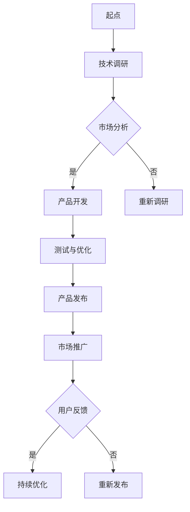

                 

关键词：AI大模型、创业、挑战、机遇、趋势、展望

> 摘要：随着人工智能技术的不断发展，AI大模型在各个领域展现出强大的潜力，成为企业创新和商业变革的重要驱动力。本文将深入探讨AI大模型创业的现状、面临的挑战以及未来的发展趋势和机遇。

## 1. 背景介绍

人工智能（AI）是计算机科学的一个分支，致力于通过机器模拟人类的智能行为，如学习、推理、解决问题等。在过去的几十年里，AI技术经历了从符号主义到连接主义，再到现代深度学习的转变。特别是深度学习技术的突破，使得AI大模型（如GPT、BERT等）在自然语言处理、计算机视觉、语音识别等领域取得了显著的成果。

AI大模型创业，指的是利用人工智能特别是大模型技术进行商业创新，开发具有市场前景的应用或服务。随着AI技术的成熟和商业化应用的广泛普及，越来越多的企业和创业者开始关注并投身于AI大模型创业领域。

### 1.1 AI大模型的发展历程

AI大模型的发展历程可以追溯到20世纪80年代，当时连接主义（如神经网络）开始崭露头角。然而，受限于计算资源和数据集的限制，AI大模型的发展一直较为缓慢。直到2012年，深度学习在ImageNet图像识别挑战赛中的突破性表现，标志着深度学习时代的到来。

此后，随着计算能力的提升、数据量的爆炸式增长以及优化算法的改进，AI大模型得到了迅速发展。特别是在自然语言处理领域，GPT、BERT等大模型的出现，极大地提升了机器理解和生成自然语言的能力。

### 1.2 AI大模型创业的现状

当前，AI大模型创业已经成为科技领域的一个热门话题。许多企业通过将AI大模型应用于不同的场景，实现了商业成功。例如，在金融领域，AI大模型被用于风险评估、欺诈检测和自动化交易等；在医疗领域，AI大模型用于疾病诊断、药物研发和个性化治疗等。

同时，许多创业者也在积极探索AI大模型的应用，希望通过创新性的产品和服务改变世界。然而，AI大模型创业也面临着一系列挑战，如数据隐私、安全性和算法伦理等。

## 2. 核心概念与联系

为了深入理解AI大模型创业，我们首先需要了解一些核心概念，并探讨它们之间的联系。

### 2.1 人工智能（AI）

人工智能是指由人制造出来的具有一定智能的系统，能够感知环境、学习、推理、规划、解决问题等。AI可以分为狭义AI和广义AI，狭义AI主要指基于算法和数据的自动化系统，而广义AI则包括具有高度智能的实体。

### 2.2 深度学习（Deep Learning）

深度学习是人工智能的一个重要分支，通过多层神经网络模拟人类大脑的学习过程。深度学习在图像识别、语音识别、自然语言处理等领域取得了显著成就。

### 2.3 大模型（Large Models）

大模型是指具有数百万甚至数十亿参数的神经网络模型，如GPT、BERT等。这些模型通常需要大量的数据训练，能够实现高度复杂的功能。

### 2.4 AI大模型创业

AI大模型创业是指利用深度学习和大模型技术进行商业创新，开发具有市场前景的应用或服务。这包括将AI大模型应用于金融、医疗、教育、娱乐等多个领域。

### 2.5 Mermaid 流程图

以下是一个展示AI大模型创业流程的Mermaid流程图：



### 2.6 Mermaid 流程节点说明

- 起点（A）：AI大模型创业的起点通常是技术的创新和应用。
- 技术调研（B）：在确定技术方向后，需要进行详细的技术调研，了解最新的研究进展和开源工具。
- 市场分析（C）：通过市场分析，确定产品的市场需求和潜在客户。
- 产品开发（D）：根据市场分析结果，开发具有市场竞争力的产品。
- 测试与优化（F）：在产品开发完成后，进行测试和优化，确保产品质量和稳定性。
- 产品发布（G）：将产品推向市场，进行市场推广。
- 市场推广（H）：通过广告、营销等方式，提高产品的知名度和市场占有率。
- 用户反馈（I）：收集用户反馈，了解产品的实际使用情况和用户需求。
- 持续优化（J）：根据用户反馈，对产品进行持续优化。
- 重新发布（K）：如果产品在市场推广中表现不佳，可能需要重新发布。

## 3. 核心算法原理 & 具体操作步骤

### 3.1 算法原理概述

AI大模型创业的核心算法是基于深度学习的，特别是基于神经网络的大模型。这些模型通过多层非线性变换，对大量数据进行学习和建模，从而实现高水平的智能功能。

### 3.2 算法步骤详解

#### 3.2.1 数据收集与预处理

1. 数据收集：从互联网、数据库、传感器等多个渠道收集数据。
2. 数据预处理：对数据进行清洗、归一化、去噪等处理，确保数据质量。

#### 3.2.2 模型训练

1. 模型设计：设计合适的神经网络架构，如CNN、RNN、Transformer等。
2. 模型训练：使用大量数据进行训练，调整网络参数，优化模型性能。

#### 3.2.3 模型评估与优化

1. 模型评估：使用验证集对模型进行评估，确保模型泛化能力。
2. 模型优化：根据评估结果，对模型进行调整和优化，提升性能。

#### 3.2.4 模型部署与应用

1. 模型部署：将训练好的模型部署到生产环境，如云平台、边缘计算设备等。
2. 模型应用：将模型应用于实际业务场景，如自然语言处理、图像识别等。

### 3.3 算法优缺点

#### 优点：

1. 高效性：深度学习大模型能够处理大量数据，实现高效的计算和预测。
2. 泛化能力：通过训练大量数据，大模型具有良好的泛化能力，能够适应不同的应用场景。
3. 灵活性：大模型可以通过调整网络架构、训练数据等，实现多种功能的集成和应用。

#### 缺点：

1. 计算资源需求：大模型通常需要大量的计算资源和存储空间，对硬件要求较高。
2. 数据依赖：大模型的性能很大程度上取决于训练数据的质量和数量，数据不足或质量差可能导致性能下降。
3. 隐私和安全：在数据处理过程中，可能涉及用户隐私信息，需要确保数据的安全性和隐私性。

### 3.4 算法应用领域

AI大模型在多个领域具有广泛的应用前景，如：

1. 自然语言处理：文本分类、情感分析、机器翻译等。
2. 计算机视觉：图像识别、目标检测、图像生成等。
3. 医疗诊断：疾病诊断、药物研发、个性化治疗等。
4. 金融科技：风险评估、欺诈检测、自动化交易等。
5. 教育领域：智能教学、个性化学习等。

## 4. 数学模型和公式 & 详细讲解 & 举例说明

### 4.1 数学模型构建

在AI大模型中，数学模型通常基于深度学习，尤其是基于神经网络的模型。以下是一个简单的神经网络模型：

$$
\text{输出} = \sigma(\text{权重} \cdot \text{输入} + \text{偏置})
$$

其中，$\sigma$ 是激活函数，通常使用sigmoid、ReLU或Tanh等。

### 4.2 公式推导过程

#### 4.2.1 前向传播

在神经网络的前向传播过程中，每个神经元将输入数据进行加权求和，然后通过激活函数得到输出。

$$
\text{输出} = \sigma(\sum_{i=1}^{n} w_i \cdot x_i + b)
$$

其中，$w_i$ 是权重，$x_i$ 是输入特征，$b$ 是偏置。

#### 4.2.2 反向传播

在反向传播过程中，根据输出误差，反向调整权重和偏置，以优化模型性能。

$$
\Delta w = \alpha \cdot \frac{\partial L}{\partial w} = \alpha \cdot (x \cdot \frac{\partial \sigma}{\partial z})
$$

$$
\Delta b = \alpha \cdot \frac{\partial L}{\partial b} = \alpha \cdot \frac{\partial \sigma}{\partial z}
$$

其中，$\alpha$ 是学习率，$L$ 是损失函数，$\sigma$ 是激活函数。

### 4.3 案例分析与讲解

#### 4.3.1 自然语言处理

以GPT模型为例，GPT是一种基于Transformer的预训练语言模型，用于自然语言处理任务。

1. 预训练：使用大量文本数据进行预训练，学习语言模式和结构。
2. 微调：在预训练的基础上，针对特定任务（如文本分类、问答等）进行微调。

#### 4.3.2 计算机视觉

以ResNet模型为例，ResNet是一种基于深度残差网络的图像识别模型。

1. 网络架构：ResNet通过引入残差连接，解决了深度神经网络训练困难的问题。
2. 损失函数：通常使用交叉熵损失函数来评估模型性能。

## 5. 项目实践：代码实例和详细解释说明

### 5.1 开发环境搭建

为了进行AI大模型创业，我们需要搭建一个高效的开发环境。以下是搭建环境的步骤：

1. 安装Python环境：使用Anaconda或Miniconda创建Python虚拟环境。
2. 安装深度学习框架：如TensorFlow、PyTorch等。
3. 安装其他依赖库：如NumPy、Pandas等。

### 5.2 源代码详细实现

以下是一个简单的基于TensorFlow的神经网络实现：

```python
import tensorflow as tf

# 定义模型
model = tf.keras.Sequential([
    tf.keras.layers.Dense(128, activation='relu', input_shape=(784,)),
    tf.keras.layers.Dense(10, activation='softmax')
])

# 编译模型
model.compile(optimizer='adam',
              loss='categorical_crossentropy',
              metrics=['accuracy'])

# 训练模型
model.fit(x_train, y_train, epochs=5)
```

### 5.3 代码解读与分析

以上代码实现了一个简单的神经网络模型，用于分类任务。其中：

- `Dense` 层：全连接层，用于加权和激活函数。
- `input_shape`：输入数据的形状。
- `compile`：编译模型，指定优化器和损失函数。
- `fit`：训练模型，指定训练数据和迭代次数。

### 5.4 运行结果展示

在训练完成后，我们可以使用以下代码进行模型评估：

```python
test_loss, test_acc = model.evaluate(x_test, y_test)
print(f"Test accuracy: {test_acc}")
```

运行结果将显示测试集上的准确率。

## 6. 实际应用场景

### 6.1 金融领域

AI大模型在金融领域具有广泛的应用，如：

1. 风险评估：利用大模型进行风险预测和评估，提高风险管理效率。
2. 欺诈检测：通过分析交易数据和用户行为，识别潜在的欺诈行为。
3. 自动化交易：基于AI大模型，实现自动化交易策略，提高交易成功率。

### 6.2 医疗领域

AI大模型在医疗领域具有重要的应用价值，如：

1. 疾病诊断：利用大模型对医学图像进行诊断，提高诊断准确率。
2. 药物研发：通过分析生物数据，预测药物的有效性和副作用。
3. 个性化治疗：根据患者数据和病情，制定个性化的治疗方案。

### 6.3 教育领域

AI大模型在教育领域也有着广泛的应用，如：

1. 智能教学：根据学生学习情况和知识点掌握程度，提供个性化的教学方案。
2. 作业批改：利用大模型自动批改学生作业，提高批改效率和准确性。
3. 学习分析：通过分析学生的学习行为和成绩，提供学习建议和改进方案。

## 7. 未来应用展望

### 7.1 自动驾驶

自动驾驶是AI大模型的一个重要应用领域。通过大模型，可以实现高精度的环境感知、决策规划和路径规划，提高自动驾驶的安全性、稳定性和舒适性。

### 7.2 智能家居

智能家居是AI大模型的另一个重要应用领域。通过大模型，可以实现智能化的家庭设备控制、能源管理、安全监控等，提高家庭生活的便利性和安全性。

### 7.3 健康医疗

AI大模型在健康医疗领域具有巨大的潜力，如疾病预测、智能诊断、个性化治疗等。通过大模型，可以实现更高效、精准的医疗服务，提高医疗资源的利用效率。

### 7.4 文化娱乐

AI大模型在文化娱乐领域也有着广泛的应用，如虚拟现实、游戏智能推荐、智能客服等。通过大模型，可以实现更丰富、多样化的文化娱乐体验。

## 8. 工具和资源推荐

### 8.1 学习资源推荐

1. 《深度学习》（Goodfellow、Bengio、Courville著）：深度学习领域的经典教材。
2. 《Python机器学习》（Sebastian Raschka著）：Python语言在机器学习领域的应用。
3. Coursera、edX等在线课程：提供丰富的机器学习、深度学习课程。

### 8.2 开发工具推荐

1. TensorFlow、PyTorch：两个最受欢迎的深度学习框架。
2. Jupyter Notebook：用于数据分析和模型训练的交互式环境。
3. Keras：基于TensorFlow和PyTorch的简化版深度学习库。

### 8.3 相关论文推荐

1. "A Theoretically Grounded Application of Dropout in Recurrent Neural Networks"（Glorot et al., 2014）
2. "Deep Residual Learning for Image Recognition"（He et al., 2016）
3. "Attention Is All You Need"（Vaswani et al., 2017）

## 9. 总结：未来发展趋势与挑战

### 9.1 研究成果总结

近年来，AI大模型在多个领域取得了显著的成果，如自然语言处理、计算机视觉、医疗诊断等。通过大量的数据和高效的算法，AI大模型能够实现高度复杂的任务，推动了许多领域的创新和发展。

### 9.2 未来发展趋势

1. 计算能力提升：随着硬件技术的发展，AI大模型的计算能力将不断提升，为更复杂的应用提供支持。
2. 数据资源扩展：更多的数据资源将开放，为AI大模型的训练提供更丰富的数据支持。
3. 跨学科融合：AI大模型与其他领域的融合，如生物学、心理学、社会学等，将推动更多创新应用。

### 9.3 面临的挑战

1. 数据隐私和安全：在AI大模型的应用过程中，涉及大量用户数据，需要确保数据的安全性和隐私性。
2. 算法透明性和可解释性：复杂的AI大模型缺乏透明性和可解释性，需要研究如何提高算法的可解释性。
3. 法律和伦理问题：AI大模型的应用需要遵守相关的法律和伦理规范，如人工智能伦理、算法公平性等。

### 9.4 研究展望

未来，AI大模型将在更多领域得到应用，推动社会和经济的快速发展。同时，需要解决一系列技术、法律和伦理问题，确保AI大模型的可持续发展。

## 10. 附录：常见问题与解答

### 10.1 什么是AI大模型？

AI大模型是指具有数百万甚至数十亿参数的神经网络模型，通过大量数据进行训练，能够实现高度复杂的任务。

### 10.2 AI大模型创业有哪些挑战？

AI大模型创业面临的挑战包括数据隐私、安全性、算法透明性和可解释性等。

### 10.3 如何选择AI大模型的框架？

选择AI大模型的框架应考虑模型的性能、易用性、社区支持等因素。

### 10.4 AI大模型创业需要哪些技能？

AI大模型创业需要掌握深度学习、神经网络、数据科学、软件开发等技能。

### 10.5 AI大模型创业的未来前景如何？

AI大模型创业具有广阔的前景，将推动多个领域的创新和发展，但也需要解决一系列技术和社会问题。

---

**作者：禅与计算机程序设计艺术 / Zen and the Art of Computer Programming**  
本文旨在探讨AI大模型创业的现状、挑战和未来发展趋势，为创业者提供有价值的参考。随着AI技术的不断进步，AI大模型创业将迎来更多的机遇和挑战。  


