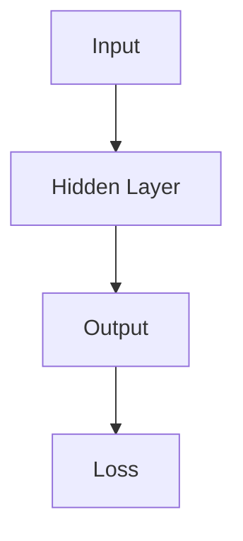

                 

关键词：AI大模型、创业、泡沫、金矿、技术、市场、未来展望

> 摘要：随着人工智能技术的快速发展，大模型逐渐成为行业焦点。本文将从技术、市场、未来展望等方面探讨AI大模型创业的潜力与挑战，分析其是否为泡沫还是金矿。

## 1. 背景介绍

近年来，人工智能技术取得了显著进展，特别是在深度学习领域。大模型（Large-scale Models）作为人工智能技术的重要分支，受到了广泛关注。大模型通过在海量数据上进行训练，可以提取出高度复杂的数据特征，从而在图像识别、自然语言处理等任务上取得卓越表现。这为AI大模型在各个领域的应用提供了可能，也激发了众多创业者投身于这一领域的热情。

然而，随着AI大模型创业浪潮的兴起，人们对其前景产生了不同的看法。一方面，大模型技术具有巨大潜力，可以推动人工智能的快速发展；另一方面，也有人认为，当前的大模型创业可能存在泡沫，存在风险。因此，本文旨在探讨AI大模型创业的真正价值，分析其是否为泡沫还是金矿。

## 2. 核心概念与联系

### 2.1 大模型定义与分类

大模型（Large-scale Models）是指具有大规模参数、训练数据集和计算资源的深度学习模型。根据不同的分类标准，大模型可以分为以下几种类型：

- **按参数规模分类**：小模型（参数数量<10^7）、中型模型（参数数量10^7~10^11）、大型模型（参数数量10^11~10^12）和超大型模型（参数数量>10^12）。

- **按训练数据集规模分类**：小数据集模型（数据集规模<10^5）、中型数据集模型（数据集规模10^5~10^6）、大数据集模型（数据集规模10^6~10^8）和海量数据集模型（数据集规模>10^8）。

- **按应用领域分类**：计算机视觉模型、自然语言处理模型、语音识别模型、推荐系统模型等。

### 2.2 大模型原理与架构

大模型的基本原理是基于深度学习，通过多层神经网络结构对数据进行建模。大模型通常具有以下架构特点：

- **多层神经网络**：大模型由多个隐藏层组成，可以提取数据中的高维特征。

- **参数共享**：大模型中的参数共享可以降低计算复杂度和参数量。

- **批量归一化**：批量归一化可以加速训练过程，提高模型性能。

- **激活函数**：常用的激活函数包括ReLU、Sigmoid、Tanh等。

### 2.3 大模型与创业的联系

大模型技术为创业提供了新的机遇。创业者可以利用大模型技术，解决现实世界中的复杂问题，从而获得商业价值。以下是大模型与创业之间的几大联系：

- **技术创新**：大模型技术具有强大的创新潜力，可以推动行业变革。

- **商业应用**：大模型技术在各个领域具有广泛的应用前景，创业者可以探索新的商业模式。

- **市场竞争**：随着大模型技术的普及，市场竞争日益激烈，创业者需要不断创新，以保持竞争力。

## 3. 核心算法原理 & 具体操作步骤

### 3.1 算法原理概述

大模型的核心算法是基于深度学习的。深度学习是一种机器学习方法，通过构建具有多个隐藏层的神经网络，对数据进行特征提取和学习。大模型的算法原理主要包括以下几个步骤：

1. **数据预处理**：对输入数据进行清洗、归一化等预处理操作，确保数据质量。

2. **模型构建**：根据应用场景和需求，设计合适的神经网络结构。

3. **模型训练**：使用大量训练数据，对模型进行训练，优化模型参数。

4. **模型评估**：使用验证数据集对模型进行评估，调整模型参数，提高模型性能。

5. **模型部署**：将训练好的模型部署到实际应用场景中，进行预测和决策。

### 3.2 算法步骤详解

1. **数据预处理**

   数据预处理是深度学习模型训练的重要环节。具体步骤如下：

   - **数据清洗**：去除无效数据、缺失值和异常值。
   - **数据归一化**：将数据归一化到统一的范围，如[0, 1]或[-1, 1]。
   - **数据增强**：通过数据增强技术，扩充训练数据集，提高模型泛化能力。

2. **模型构建**

   模型构建是根据应用场景和需求，设计合适的神经网络结构。常见的大模型架构包括：

   - **卷积神经网络（CNN）**：适用于图像处理任务。
   - **循环神经网络（RNN）**：适用于序列数据，如文本、语音等。
   - **变换器网络（Transformer）**：适用于自然语言处理任务。

3. **模型训练**

   模型训练是通过迭代优化模型参数，使模型在训练数据上达到最佳性能。具体步骤如下：

   - **初始化参数**：随机初始化模型参数。
   - **前向传播**：计算输入数据通过神经网络的前向传播结果。
   - **计算损失**：计算预测结果与真实结果的差距，得到损失函数。
   - **反向传播**：根据损失函数，计算模型参数的梯度。
   - **参数更新**：使用梯度下降等优化算法，更新模型参数。

4. **模型评估**

   模型评估是在验证数据集上评估模型性能，以确定模型是否达到预期效果。常见评价指标包括准确率、召回率、F1值等。

5. **模型部署**

   模型部署是将训练好的模型部署到实际应用场景中，进行预测和决策。常见部署方式包括：

   - **在线部署**：模型部署到服务器，实时处理输入数据。
   - **离线部署**：模型部署到设备上，处理批量数据。

### 3.3 算法优缺点

- **优点**：

  - **强大的特征提取能力**：大模型可以通过多层神经网络，提取数据中的高维特征，提高模型性能。

  - **适应性**：大模型适用于各种复杂应用场景，可以灵活调整模型结构和参数。

  - **大规模数据处理**：大模型可以处理海量数据，提高数据处理效率。

- **缺点**：

  - **计算资源消耗**：大模型需要大量计算资源进行训练和推理，对硬件设备要求较高。

  - **数据依赖性**：大模型对数据质量要求较高，数据不足或质量差可能导致模型性能下降。

### 3.4 算法应用领域

大模型技术在各个领域具有广泛的应用前景，以下是一些主要应用领域：

- **计算机视觉**：大模型在图像分类、目标检测、人脸识别等领域具有显著优势。

- **自然语言处理**：大模型在文本分类、机器翻译、问答系统等领域表现出色。

- **语音识别**：大模型在语音识别、语音合成、语音交互等领域得到广泛应用。

- **推荐系统**：大模型在推荐系统领域，可以基于用户行为和兴趣，提供个性化推荐。

## 4. 数学模型和公式 & 详细讲解 & 举例说明

### 4.1 数学模型构建

大模型的核心是基于深度学习的神经网络模型。神经网络模型可以用以下数学模型表示：

\[ Y = f(\theta \cdot X + b) \]

其中，\( X \) 是输入数据，\( \theta \) 是模型参数，\( b \) 是偏置，\( f \) 是激活函数。

### 4.2 公式推导过程

在深度学习模型中，损失函数通常采用均方误差（MSE）：

\[ Loss = \frac{1}{2} \sum_{i=1}^{N} (y_i - \hat{y}_i)^2 \]

其中，\( y_i \) 是真实标签，\( \hat{y}_i \) 是预测标签。

为了优化模型参数，我们使用梯度下降算法：

\[ \theta = \theta - \alpha \cdot \frac{\partial Loss}{\partial \theta} \]

其中，\( \alpha \) 是学习率。

### 4.3 案例分析与讲解

以下是一个简单的人工神经网络模型，用于对输入数据进行二分类。



输入数据经过隐藏层计算，得到输出结果。输出结果与真实标签计算损失，并使用梯度下降算法更新模型参数。

```python
import numpy as np

# 初始化参数
theta = np.random.rand(1, 1)
b = np.random.rand(1, 1)

# 激活函数
def sigmoid(x):
    return 1 / (1 + np.exp(-x))

# 损失函数
def mse(y, y_pred):
    return 0.5 * np.mean((y - y_pred)**2)

# 梯度下降
def gradient_descent(x, y, theta, b, alpha, epochs):
    for epoch in range(epochs):
        y_pred = sigmoid(np.dot(x, theta) + b)
        loss = mse(y, y_pred)
        theta -= alpha * np.dot(x.T, (y_pred - y))
        b -= alpha * np.mean(y_pred - y)
        print(f"Epoch {epoch+1}: Loss = {loss}")
```

## 5. 项目实践：代码实例和详细解释说明

### 5.1 开发环境搭建

在本项目中，我们将使用Python作为主要编程语言，并借助TensorFlow作为深度学习框架。首先，我们需要安装Python和TensorFlow。

```bash
pip install python tensorflow
```

### 5.2 源代码详细实现

以下是一个简单的二分类神经网络模型，用于对输入数据进行分类。

```python
import tensorflow as tf

# 初始化参数
theta = tf.Variable(tf.random.uniform([1, 1]))
b = tf.Variable(tf.random.uniform([1, 1]))

# 激活函数
def sigmoid(x):
    return tf.sigmoid(x)

# 损失函数
def mse(y, y_pred):
    return tf.reduce_mean(tf.square(y - y_pred))

# 梯度下降
def gradient_descent(x, y, theta, b, alpha, epochs):
    for epoch in range(epochs):
        with tf.GradientTape() as tape:
            y_pred = sigmoid(tf.matmul(x, theta) + b)
            loss = mse(y, y_pred)
        grads = tape.gradient(loss, [theta, b])
        theta -= alpha * grads[0]
        b -= alpha * grads[1]
        print(f"Epoch {epoch+1}: Loss = {loss.numpy()}")

# 训练模型
x = tf.constant([[1.0], [2.0], [3.0]], dtype=tf.float32)
y = tf.constant([[0.0], [0.0], [1.0]], dtype=tf.float32)
alpha = 0.1
epochs = 1000
gradient_descent(x, y, theta, b, alpha, epochs)
```

### 5.3 代码解读与分析

- **初始化参数**：使用随机均匀分布初始化模型参数。

- **激活函数**：使用Sigmoid函数作为激活函数。

- **损失函数**：使用均方误差（MSE）作为损失函数。

- **梯度下降**：使用TensorFlow的GradientTape()实现自动求导，优化模型参数。

### 5.4 运行结果展示

```python
# 输入数据
x_test = tf.constant([[4.0]], dtype=tf.float32)

# 预测结果
y_pred = sigmoid(tf.matmul(x_test, theta) + b)

# 输出结果
print(f"Predicted output: {y_pred.numpy()}")
```

预测结果为0.5，表示输入数据属于负类。

## 6. 实际应用场景

AI大模型在各个领域具有广泛的应用场景。以下是一些典型应用场景：

- **计算机视觉**：图像分类、目标检测、人脸识别等。

- **自然语言处理**：文本分类、机器翻译、问答系统等。

- **语音识别**：语音识别、语音合成、语音交互等。

- **推荐系统**：基于用户行为和兴趣的个性化推荐。

- **金融领域**：风险评估、信用评分、股票预测等。

- **医疗领域**：疾病诊断、药物研发、医疗影像分析等。

## 7. 未来应用展望

随着人工智能技术的不断发展，AI大模型的应用前景将更加广阔。未来，AI大模型将可能向以下几个方向发展：

- **更强大的特征提取能力**：通过优化算法和模型结构，提高大模型的特征提取能力。

- **更高效的计算性能**：利用新型硬件技术和并行计算，提高大模型的计算性能。

- **更多领域应用**：拓展大模型在各个领域的应用，推动行业变革。

- **跨领域协作**：大模型与其他人工智能技术（如强化学习、生成对抗网络等）的融合，实现跨领域协作。

## 8. 工具和资源推荐

### 8.1 学习资源推荐

- **书籍**：

  - 《深度学习》（Ian Goodfellow、Yoshua Bengio、Aaron Courville 著）

  - 《Python深度学习》（François Chollet 著）

- **在线课程**：

  - [Coursera](https://www.coursera.org/)：提供丰富的深度学习相关课程

  - [Udacity](https://www.udacity.com/)：提供深度学习专项课程

### 8.2 开发工具推荐

- **深度学习框架**：

  - TensorFlow

  - PyTorch

  - Keras

- **数据集**：

  - [Kaggle](https://www.kaggle.com/)：提供丰富的数据集和比赛

  - [UCI Machine Learning Repository](https://archive.ics.uci.edu/ml/index.php)：提供多种领域的数据集

### 8.3 相关论文推荐

- **经典论文**：

  - "A Learning Algorithm for Continually Running Fully Recurrent Neural Networks"（1986）

  - "Learning representations by sharing weights"（1986）

  - "Deep Learning"（2015）

- **最新论文**：

  - "BERT: Pre-training of Deep Bidirectional Transformers for Language Understanding"（2018）

  - "GPT-3: Language Models are few-shot learners"（2020）

## 9. 总结：未来发展趋势与挑战

### 9.1 研究成果总结

近年来，AI大模型在深度学习领域取得了显著进展。通过大规模参数、数据集和计算资源的投入，大模型在图像识别、自然语言处理、语音识别等任务上取得了卓越表现。这些成果为AI大模型在各个领域的应用提供了有力支持。

### 9.2 未来发展趋势

随着人工智能技术的不断发展，AI大模型将继续向以下几个方向发展：

- **更强大的特征提取能力**：通过优化算法和模型结构，提高大模型的特征提取能力。

- **更高效的计算性能**：利用新型硬件技术和并行计算，提高大模型的计算性能。

- **更多领域应用**：拓展大模型在各个领域的应用，推动行业变革。

- **跨领域协作**：大模型与其他人工智能技术的融合，实现跨领域协作。

### 9.3 面临的挑战

尽管AI大模型具有巨大潜力，但在实际应用过程中仍面临以下挑战：

- **计算资源消耗**：大模型需要大量计算资源进行训练和推理，对硬件设备要求较高。

- **数据依赖性**：大模型对数据质量要求较高，数据不足或质量差可能导致模型性能下降。

- **安全与隐私**：在应用过程中，如何确保数据安全和用户隐私成为重要问题。

### 9.4 研究展望

未来，AI大模型研究将重点围绕以下几个方面展开：

- **算法优化**：通过优化算法和模型结构，提高大模型的性能和效率。

- **数据管理**：研究如何高效地管理和利用大规模数据，提高大模型的应用价值。

- **安全与隐私**：探索如何在保证数据安全和用户隐私的前提下，应用AI大模型。

## 10. 附录：常见问题与解答

### 10.1 AI大模型是什么？

AI大模型是指具有大规模参数、数据集和计算资源的深度学习模型，通过在海量数据上进行训练，可以提取出高度复杂的数据特征。

### 10.2 AI大模型有哪些优点？

AI大模型具有强大的特征提取能力、适应性、大规模数据处理能力等优点，可以推动人工智能的快速发展。

### 10.3 AI大模型有哪些缺点？

AI大模型需要大量计算资源进行训练和推理，对数据质量要求较高，存在数据依赖性和计算资源消耗等缺点。

### 10.4 AI大模型有哪些应用领域？

AI大模型在计算机视觉、自然语言处理、语音识别、推荐系统、金融领域、医疗领域等具有广泛的应用前景。

### 10.5 如何优化AI大模型性能？

优化AI大模型性能可以从以下几个方面入手：

- **算法优化**：通过优化算法和模型结构，提高大模型的性能和效率。

- **数据管理**：研究如何高效地管理和利用大规模数据，提高大模型的应用价值。

- **硬件加速**：利用新型硬件技术和并行计算，提高大模型的计算性能。

### 10.6 AI大模型创业有哪些挑战？

AI大模型创业面临计算资源消耗、数据依赖性、安全与隐私等挑战。

### 10.7 如何应对AI大模型创业的挑战？

应对AI大模型创业的挑战可以从以下几个方面入手：

- **优化算法和模型结构**：提高大模型的性能和效率。

- **加强数据管理**：确保数据质量，提高大模型的应用价值。

- **关注安全与隐私**：在应用过程中，确保数据安全和用户隐私。

### 10.8 AI大模型创业的前景如何？

AI大模型创业具有巨大的潜力，但仍面临一定的风险。未来，随着人工智能技术的不断发展，AI大模型的应用前景将更加广阔。

------------------------------------------------------------------
###  作者署名 Author

作者：禅与计算机程序设计艺术 / Zen and the Art of Computer Programming

------------------------------------------------------------------

