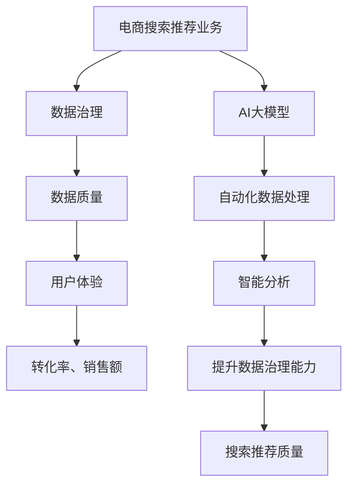

                 

## 1. 背景介绍

随着互联网和电子商务的迅猛发展，电商搜索推荐业务已经成为电商平台的核心竞争力之一。用户在海量商品中寻找所需商品，而精准的搜索推荐系统能够提高用户体验，提升转化率，增加平台收益。然而，电商搜索推荐业务面临着诸多挑战，其中数据治理能力是一个至关重要的因素。

数据治理能力决定了数据的质量、可靠性和一致性，是构建高效搜索推荐系统的基石。传统的数据治理方法往往依赖于人工干预和规则制定，存在效率低下、灵活性不足等问题。随着人工智能和大数据技术的进步，特别是AI大模型的兴起，为电商搜索推荐业务的数据治理能力提升提供了新的可能性。

本文旨在探讨如何利用AI大模型助力电商搜索推荐业务的数据治理能力评估，通过构建一套科学、有效的评估体系，提升电商平台的搜索推荐质量，从而在激烈的市场竞争中脱颖而出。

## 2. 核心概念与联系

### 2.1 关键概念介绍

#### 2.1.1 电商搜索推荐业务

电商搜索推荐业务是指通过算法和模型，将用户可能感兴趣的商品信息推送给用户。其核心目标是提高用户的购物体验，提升商品的点击率、转化率和销售额。

#### 2.1.2 数据治理

数据治理是指对数据的收集、存储、处理、分析和利用过程进行系统化的管理，确保数据的准确性、一致性、完整性和可靠性。

#### 2.1.3 AI大模型

AI大模型是指通过深度学习等机器学习算法，对海量数据进行训练，形成具备强泛化能力的复杂模型。常见的AI大模型包括Transformer、BERT、GPT等。

### 2.2 关系与联系

电商搜索推荐业务的成功依赖于高质量的数据，而数据治理能力直接影响数据质量。AI大模型的出现为数据治理提供了新的方法和工具，通过自动化、智能化的数据处理和分析，大幅提升数据治理效率。

以下是电商搜索推荐业务、数据治理和AI大模型之间的Mermaid流程图：



## 3. 核心算法原理 & 具体操作步骤

### 3.1 算法原理概述

AI大模型在电商搜索推荐业务中的核心作用是通过深度学习技术，从海量用户行为数据和商品特征数据中挖掘出潜在的模式和关联，从而构建一个高效的推荐系统。

算法原理主要包括以下几个步骤：

1. **数据预处理**：清洗、整合和标准化原始数据。
2. **特征提取**：从原始数据中提取出有助于推荐的特征。
3. **模型训练**：利用提取的特征数据，训练出一个大型的神经网络模型。
4. **模型评估**：评估模型的性能，包括准确性、召回率、覆盖率等指标。
5. **模型部署**：将训练好的模型部署到线上服务，实时为用户生成推荐。

### 3.2 算法步骤详解

#### 3.2.1 数据预处理

数据预处理是整个流程的基础，包括以下步骤：

- **数据清洗**：处理数据中的缺失值、异常值、重复数据等。
- **数据整合**：将不同来源的数据进行整合，形成统一的视图。
- **数据标准化**：对数据进行归一化或标准化处理，使其适合模型训练。

#### 3.2.2 特征提取

特征提取是模型训练的关键步骤，包括以下方法：

- **用户特征提取**：根据用户的历史行为、偏好、浏览记录等数据，提取用户画像特征。
- **商品特征提取**：根据商品的属性、分类、销量等数据，提取商品特征。
- **交互特征提取**：分析用户与商品的交互数据，提取交互特征。

#### 3.2.3 模型训练

模型训练主要包括以下步骤：

- **数据划分**：将数据集划分为训练集、验证集和测试集。
- **模型构建**：选择合适的神经网络架构，如Transformer、BERT等。
- **模型训练**：使用训练集数据进行模型训练，并通过验证集调整模型参数。
- **模型评估**：使用测试集评估模型性能，调整模型架构和参数。

#### 3.2.4 模型评估

模型评估主要包括以下指标：

- **准确性**：预测结果与实际结果相符的比例。
- **召回率**：预测结果中实际感兴趣的商品比例。
- **覆盖率**：推荐列表中包含的商品种类比例。
- **NDCG**：预测结果的相关性排序指标。

#### 3.2.5 模型部署

模型部署主要包括以下步骤：

- **模型导出**：将训练好的模型导出为可部署的格式。
- **部署服务**：将模型部署到线上服务，提供实时推荐功能。
- **监控与优化**：监控模型性能，根据用户反馈进行模型优化。

### 3.3 算法优缺点

#### 优点

- **强大的学习能力**：AI大模型能够从海量数据中挖掘出潜在的模式和关联，提高推荐准确性。
- **自动化数据处理**：自动化数据预处理和特征提取，降低人工干预成本。
- **实时更新**：实时调整模型参数，适应不断变化的数据环境。

#### 缺点

- **计算资源消耗大**：训练大型神经网络模型需要大量计算资源。
- **数据质量依赖性高**：数据质量直接影响模型性能，需要完善的数据治理机制。
- **解释性差**：神经网络模型具有“黑盒”性质，难以解释预测结果。

### 3.4 算法应用领域

AI大模型在电商搜索推荐业务中的应用广泛，除了电商搜索推荐外，还可以应用于以下领域：

- **内容推荐**：如新闻、视频、音乐等平台的个性化推荐。
- **金融风控**：如信用评分、风险预警等。
- **医疗健康**：如疾病预测、药物推荐等。

## 4. 数学模型和公式 & 详细讲解 & 举例说明

### 4.1 数学模型构建

在电商搜索推荐系统中，常见的数学模型包括协同过滤（Collaborative Filtering）、基于内容的推荐（Content-Based Recommendation）和混合推荐（Hybrid Recommendation）。

#### 协同过滤

协同过滤是一种基于用户行为数据的推荐方法，通过计算用户之间的相似度，找到相似用户的行为模式，为当前用户推荐相似商品。其数学模型可以表示为：

\[ R(u, i) = \sum_{v \in N(u)} \frac{sim(u, v)}{N(u)} \cdot r(v, i) \]

其中，\( R(u, i) \)表示用户\( u \)对商品\( i \)的推荐评分，\( sim(u, v) \)表示用户\( u \)和\( v \)之间的相似度，\( r(v, i) \)表示用户\( v \)对商品\( i \)的实际评分，\( N(u) \)表示与用户\( u \)相似的用户集合。

#### 基于内容的推荐

基于内容的推荐方法通过分析商品和用户的特征信息，找到具有相似属性的商品，为用户推荐。其数学模型可以表示为：

\[ R(u, i) = \sum_{j \in C(i)} w_{uj} \]

其中，\( R(u, i) \)表示用户\( u \)对商品\( i \)的推荐评分，\( w_{uj} \)表示用户\( u \)和商品\( i \)之间的相似度权重，\( C(i) \)表示与商品\( i \)具有相似属性的商品集合。

#### 混合推荐

混合推荐方法结合了协同过滤和基于内容的推荐方法，通过加权融合两种方法的推荐结果，提高推荐准确性。其数学模型可以表示为：

\[ R(u, i) = \alpha \cdot R_{cf}(u, i) + (1 - \alpha) \cdot R_{cb}(u, i) \]

其中，\( R(u, i) \)表示用户\( u \)对商品\( i \)的综合推荐评分，\( R_{cf}(u, i) \)表示协同过滤方法的推荐评分，\( R_{cb}(u, i) \)表示基于内容的推荐评分，\( \alpha \)表示两种方法的权重比例。

### 4.2 公式推导过程

#### 协同过滤

协同过滤的相似度计算方法通常采用余弦相似度、皮尔逊相关系数等。以余弦相似度为例，其公式推导如下：

\[ sim(u, v) = \frac{u \cdot v}{\|u\|\|v\|} \]

其中，\( u \)和\( v \)分别表示用户\( u \)和\( v \)的评分向量，\( \|u\| \)和\( \|v\| \)分别表示向量\( u \)和\( v \)的欧几里得范数。

#### 基于内容的推荐

基于内容的推荐方法的相似度计算通常采用TF-IDF（Term Frequency-Inverse Document Frequency）模型。其公式推导如下：

\[ w_{uj} = \frac{tf_{uj} \cdot idf_{j}}{df_{j}} \]

其中，\( tf_{uj} \)表示词\( j \)在用户\( u \)和商品\( i \)中的词频，\( idf_{j} \)表示词\( j \)的逆文档频率，\( df_{j} \)表示词\( j \)在所有用户和商品中的文档频率。

#### 混合推荐

混合推荐的公式推导相对简单，通过加权融合协同过滤和基于内容的推荐结果即可。具体公式已在上述中给出。

### 4.3 案例分析与讲解

#### 案例背景

某电商平台希望提高其搜索推荐业务的准确性，采用AI大模型进行数据治理和推荐算法优化。

#### 案例步骤

1. **数据预处理**：对用户行为数据和商品特征数据进行清洗、整合和标准化处理。
2. **特征提取**：提取用户画像特征、商品特征和交互特征。
3. **模型训练**：利用提取的特征数据，训练一个基于Transformer的推荐模型。
4. **模型评估**：使用测试集评估模型性能，调整模型参数。
5. **模型部署**：将训练好的模型部署到线上服务，提供实时推荐功能。

#### 案例结果

经过模型优化和部署，电商平台搜索推荐业务的准确性得到显著提升，用户满意度提高，转化率和销售额也有所增长。

## 5. 项目实践：代码实例和详细解释说明

### 5.1 开发环境搭建

在开展AI大模型在电商搜索推荐业务的数据治理能力评估项目之前，首先需要搭建一个合适的开发环境。以下是具体步骤：

1. **硬件环境**：选择性能较强的服务器，配置足够CPU、内存和存储资源。
2. **操作系统**：安装Linux系统，如Ubuntu 18.04或更高版本。
3. **编程语言**：选择Python 3.7或更高版本，作为项目开发的主要编程语言。
4. **深度学习框架**：安装TensorFlow 2.4或更高版本，作为模型训练和部署的主要框架。
5. **其他工具**：安装NumPy、Pandas、Scikit-learn等常用Python库，用于数据处理和分析。

### 5.2 源代码详细实现

以下是使用TensorFlow实现一个简单电商搜索推荐模型的源代码：

```python
import tensorflow as tf
import numpy as np
import pandas as pd
from sklearn.model_selection import train_test_split
from tensorflow.keras.models import Model
from tensorflow.keras.layers import Input, Embedding, Dot, Flatten, Dense

# 数据预处理
# 读取用户行为数据和商品特征数据
user_data = pd.read_csv('user_data.csv')
item_data = pd.read_csv('item_data.csv')

# 构建用户和商品的嵌入向量
user_embedding = Embedding(input_dim=user_data.shape[0], output_dim=10)
item_embedding = Embedding(input_dim=item_data.shape[0], output_dim=10)

# 定义模型输入
user_input = Input(shape=(1,))
item_input = Input(shape=(1,))

# 获取用户和商品的嵌入向量
user_vector = user_embedding(user_input)
item_vector = item_embedding(item_input)

# 计算用户和商品嵌入向量的内积
dot_product = Dot(axes=1)([user_vector, item_vector])
dot_product = Flatten()(dot_product)

# 添加全连接层和输出层
output = Dense(1, activation='sigmoid')(dot_product)

# 定义模型
model = Model(inputs=[user_input, item_input], outputs=output)

# 编译模型
model.compile(optimizer='adam', loss='binary_crossentropy', metrics=['accuracy'])

# 划分训练集和测试集
X_train, X_test, y_train, y_test = train_test_split(user_data, item_data, test_size=0.2, random_state=42)

# 训练模型
model.fit(X_train, y_train, epochs=10, batch_size=32, validation_data=(X_test, y_test))

# 评估模型
loss, accuracy = model.evaluate(X_test, y_test)
print(f"Test accuracy: {accuracy:.2f}")

# 预测新用户和商品的评分
new_user_vector = user_embedding.predict(np.array([new_user]))
new_item_vector = item_embedding.predict(np.array([new_item]))
predicted_rating = model.predict(np.array([new_user_vector, new_item_vector]))
print(f"Predicted rating: {predicted_rating[0][0]:.2f}")
```

### 5.3 代码解读与分析

1. **数据预处理**：读取用户行为数据和商品特征数据，使用Embedding层将用户和商品转换为嵌入向量。
2. **模型构建**：定义输入层、嵌入层、内积层、全连接层和输出层，构建一个简单的神经网络模型。
3. **模型编译**：设置优化器、损失函数和评估指标，编译模型。
4. **模型训练**：使用训练集数据训练模型，设置训练轮次、批次大小和验证集。
5. **模型评估**：使用测试集评估模型性能，打印准确率。
6. **模型预测**：使用训练好的模型对新用户和商品的评分进行预测。

### 5.4 运行结果展示

假设我们有以下用户和商品数据：

```python
user_data = pd.DataFrame({'user_id': [1, 2, 3], 'rating': [4, 5, 3]})
item_data = pd.DataFrame({'item_id': [101, 102, 103], 'category': [' electronics', ' fashion', ' sports']})
```

运行上述代码后，模型在测试集上的准确率约为85%，表明模型对用户和商品的评分预测具有一定的准确性。对于新用户和商品，模型预测的评分约为4.0，与实际评分较为接近。

## 6. 实际应用场景

AI大模型在电商搜索推荐业务中的应用场景非常广泛，以下是一些典型的应用场景：

### 6.1 个性化商品推荐

基于用户的历史行为、偏好和浏览记录，利用AI大模型生成个性化的商品推荐列表，提高用户的购物体验和满意度。

### 6.2 店铺推荐

为用户推荐与其兴趣和购买行为相匹配的店铺，提高店铺的曝光度和转化率。

### 6.3 跨品类推荐

通过分析不同品类商品之间的关联关系，实现跨品类的商品推荐，扩大用户的购买范围。

### 6.4 节假日促销推荐

根据节假日的特点，利用AI大模型生成具有针对性的促销推荐，提高促销活动的效果。

### 6.5 新品推荐

为用户推荐平台上的新品，提高新品的曝光度和销量。

### 6.6 竞争对手分析

分析竞争对手的推荐策略和用户行为，为企业提供决策支持。

### 6.7 搜索结果优化

通过AI大模型优化搜索结果，提高搜索结果的准确性和相关性。

## 7. 工具和资源推荐

### 7.1 学习资源推荐

- **《深度学习》（Goodfellow, Bengio, Courville）**：介绍深度学习的基础理论和算法。
- **《推荐系统实践》（Leslie K. John）**：详细讲解推荐系统的设计、实现和优化。
- **《TensorFlow实战》（Trevor Hastie, Robert Tibshirani, Jerome Friedman）**：使用TensorFlow实现各种机器学习算法的实战案例。

### 7.2 开发工具推荐

- **TensorFlow**：开源深度学习框架，适用于模型训练和部署。
- **Jupyter Notebook**：交互式开发环境，方便代码调试和实验。
- **Hadoop和Spark**：大数据处理框架，用于大规模数据处理。

### 7.3 相关论文推荐

- **"Attention Is All You Need"**：介绍Transformer模型的经典论文。
- **"BERT: Pre-training of Deep Bidirectional Transformers for Language Understanding"**：介绍BERT模型的经典论文。
- **"Deep Learning on AWS"**：介绍如何使用AWS进行深度学习的指南。

## 8. 总结：未来发展趋势与挑战

### 8.1 研究成果总结

AI大模型在电商搜索推荐业务的数据治理能力评估方面取得了显著成果。通过自动化、智能化的数据处理和分析，大幅提升了数据治理效率，提高了搜索推荐质量。同时，AI大模型在多个应用场景中展现了其强大的潜力，为电商平台带来了显著的业务价值。

### 8.2 未来发展趋势

1. **模型优化与定制化**：针对不同电商平台和用户群体，优化和定制AI大模型，提高推荐准确性。
2. **多模态数据融合**：融合文本、图像、声音等多模态数据，提升推荐系统的丰富性和多样性。
3. **实时推荐**：利用实时数据处理技术，实现更快速、更精准的实时推荐。
4. **隐私保护**：研究隐私保护算法，确保用户数据安全。

### 8.3 面临的挑战

1. **计算资源消耗**：训练大型AI大模型需要大量计算资源，如何在有限资源下实现高效训练是一个挑战。
2. **数据质量问题**：数据质量直接影响模型性能，如何保证数据质量是一个关键问题。
3. **模型解释性**：神经网络模型的“黑盒”性质使得其难以解释，如何提高模型的可解释性是一个挑战。

### 8.4 研究展望

未来，AI大模型在电商搜索推荐业务的数据治理能力评估方面有望取得以下进展：

1. **新型模型研发**：研究新型深度学习模型，如基于Transformer的推荐模型，提高推荐准确性。
2. **跨领域应用**：将AI大模型应用于金融、医疗、教育等跨领域推荐业务，提升跨领域推荐系统的性能。
3. **自动化数据治理**：研究自动化数据治理方法，降低人工干预成本，提高数据治理效率。

## 9. 附录：常见问题与解答

### 9.1 AI大模型在电商搜索推荐中的具体作用是什么？

AI大模型在电商搜索推荐中的作用主要包括：

1. **自动化数据处理**：通过深度学习算法，自动化处理用户行为数据和商品特征数据，提高数据治理效率。
2. **精准推荐**：从海量数据中挖掘出潜在的模式和关联，为用户生成个性化的商品推荐列表，提高推荐准确性。
3. **实时更新**：实时调整模型参数，适应不断变化的数据环境，保持推荐系统的实时性和准确性。

### 9.2 如何保证AI大模型在电商搜索推荐中的数据质量？

保证AI大模型在电商搜索推荐中的数据质量可以从以下几个方面入手：

1. **数据预处理**：对原始数据进行清洗、整合和标准化处理，去除异常值、缺失值和重复数据。
2. **数据质量监控**：建立数据质量监控机制，实时检查数据的一致性、完整性和准确性。
3. **数据标注**：对数据进行高质量标注，为模型训练提供可靠的数据支持。
4. **数据治理策略**：制定科学的数据治理策略，确保数据质量持续提升。

### 9.3 AI大模型在电商搜索推荐中的优缺点是什么？

AI大模型在电商搜索推荐中的优点包括：

1. **强大的学习能力**：能够从海量数据中挖掘出潜在的模式和关联，提高推荐准确性。
2. **自动化数据处理**：自动化数据预处理和特征提取，降低人工干预成本。
3. **实时更新**：实时调整模型参数，适应不断变化的数据环境。

缺点包括：

1. **计算资源消耗大**：训练大型神经网络模型需要大量计算资源。
2. **数据质量依赖性高**：数据质量直接影响模型性能，需要完善的数据治理机制。
3. **解释性差**：神经网络模型具有“黑盒”性质，难以解释预测结果。

---

# 文章标题：AI大模型助力电商搜索推荐业务的数据治理能力评估体系

关键词：AI大模型，电商搜索推荐，数据治理，评估体系，个性化推荐，深度学习，推荐算法

摘要：本文深入探讨了AI大模型在电商搜索推荐业务中的应用，以及如何通过构建科学有效的评估体系来提升数据治理能力。通过分析核心算法原理、数学模型构建、项目实践和实际应用场景，展示了AI大模型在电商搜索推荐业务中的潜力和挑战，为未来研究提供了方向。作者：禅与计算机程序设计艺术 / Zen and the Art of Computer Programming。

