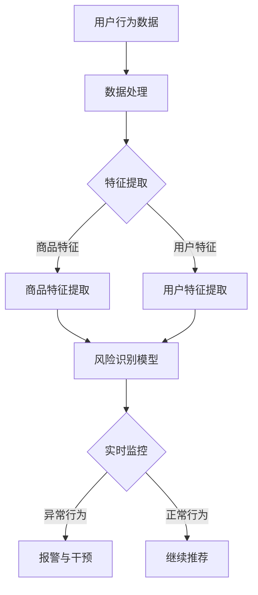

                 

关键词：AI大模型，电商搜索，推荐系统，风险防控，深度学习，数学模型，代码实例，实际应用场景，未来展望

> 摘要：本文将探讨如何利用AI大模型来提高电商搜索推荐业务的风险防控能力。我们将详细介绍大模型的基本原理、在电商搜索推荐业务中的应用、风险防控的具体方法，并通过代码实例展示其实际应用效果。最后，将对未来发展趋势和挑战进行分析，为相关领域的研究者和开发者提供有价值的参考。

## 1. 背景介绍

随着互联网和电子商务的快速发展，电商平台的用户规模和交易量不断攀升。在这样的背景下，电商搜索推荐系统成为电商平台的核心竞争力之一。然而，随着搜索推荐业务的复杂度提高，风险防控成为一项重要的任务。传统的风险防控方法往往依赖于人工规则和静态阈值，难以适应动态变化的业务需求。而AI大模型的出现为电商搜索推荐业务的风险防控带来了新的机遇。

AI大模型，特别是基于深度学习的模型，通过大规模数据和复杂网络结构，能够自动学习并识别潜在的风险因素，从而提高推荐系统的安全性和稳定性。本文将从以下几个方面展开讨论：

- 大模型的基本原理和架构
- 大模型在电商搜索推荐业务中的应用
- 大模型风险防控的具体方法和效果
- 大模型在电商搜索推荐业务中的实际应用案例
- 未来发展趋势和面临的挑战

通过本文的探讨，希望能够为电商搜索推荐业务的风险防控提供一些有益的思路和参考。

### 2. 核心概念与联系

#### 2.1 大模型的基本概念

AI大模型是指具有大规模参数、高计算复杂度的人工神经网络，通过大量的数据和复杂的网络结构来模拟人类的学习和推理能力。大模型通常采用深度学习技术，具有以下几个特点：

1. **大规模参数**：大模型的参数数量通常在数百万到数十亿之间，这使得模型能够捕捉数据中的复杂模式。
2. **深度网络结构**：大模型通常具有多层神经元结构，通过逐层传递信息来提取数据的高层次特征。
3. **强大的表达能力**：大模型能够处理复杂的数据类型，如文本、图像和语音，并且能够进行多模态数据融合。

#### 2.2 大模型在电商搜索推荐业务中的应用

电商搜索推荐业务中的大模型主要应用于以下几个环节：

1. **用户行为预测**：通过分析用户的搜索历史、购买记录等行为数据，预测用户未来的行为倾向，从而进行个性化的推荐。
2. **商品特征提取**：通过对商品数据进行深度学习，提取商品的高层次特征，如风格、品牌、功能等，用于推荐系统的商品分类和排序。
3. **风险因素识别**：通过分析用户和商品的数据，识别潜在的风险因素，如欺诈行为、异常交易等，从而进行风险防控。

#### 2.3 大模型的风险防控机制

大模型在电商搜索推荐业务中的风险防控主要通过以下机制实现：

1. **实时监控**：大模型能够实时分析用户行为和交易数据，快速识别异常行为，从而进行及时的干预。
2. **自适应调整**：大模型通过不断学习和优化，能够根据业务变化调整风险防控策略，提高系统的适应性和准确性。
3. **多模态数据融合**：大模型能够融合多种数据源，如用户行为、商品特征、社交网络等，从多个维度识别风险因素，提高防控的全面性。

#### 2.4 Mermaid 流程图

以下是一个简化的Mermaid流程图，展示了大模型在电商搜索推荐业务中的应用流程：



### 3. 核心算法原理 & 具体操作步骤

#### 3.1 算法原理概述

大模型在电商搜索推荐业务中的核心算法原理主要包括以下几个方面：

1. **深度神经网络（DNN）**：DNN是一种多层前馈神经网络，通过多层非线性变换来提取数据特征。它在大规模数据分析和特征提取方面具有显著优势。
2. **卷积神经网络（CNN）**：CNN是一种适用于图像和文本数据处理的深度学习模型，通过卷积操作提取数据的空间特征。
3. **循环神经网络（RNN）**：RNN是一种适用于序列数据处理的深度学习模型，通过循环机制捕捉数据的时序关系。
4. **长短期记忆网络（LSTM）**：LSTM是RNN的一种改进，通过引入门控机制解决传统RNN的梯度消失问题，适用于长期依赖关系的学习。

#### 3.2 算法步骤详解

大模型在电商搜索推荐业务中的应用步骤主要包括：

1. **数据预处理**：对用户行为数据和商品数据进行清洗、归一化和特征提取，为深度学习模型提供高质量的数据输入。
2. **模型训练**：使用训练数据对深度学习模型进行训练，通过反向传播算法优化模型参数，提高模型预测能力。
3. **模型评估**：使用验证数据对训练好的模型进行评估，通过指标如准确率、召回率、F1值等衡量模型性能。
4. **模型部署**：将训练好的模型部署到线上环境，实现实时监控和风险防控。

#### 3.3 算法优缺点

1. **优点**：
   - **强大的特征提取能力**：深度学习模型能够自动学习并提取数据中的复杂特征，提高推荐系统的准确性和全面性。
   - **自适应调整能力**：大模型能够根据业务变化和用户需求，实时调整推荐策略，提高系统的灵活性和响应速度。
   - **多模态数据融合能力**：大模型能够融合多种数据源，从多个维度识别风险因素，提高防控的全面性。

2. **缺点**：
   - **训练时间较长**：深度学习模型需要大量的数据和计算资源进行训练，训练时间较长，不利于快速迭代和部署。
   - **解释性较弱**：深度学习模型通常具有黑盒特性，难以解释模型内部的决策过程，这对风险防控的透明性和可解释性提出了挑战。

#### 3.4 算法应用领域

大模型在电商搜索推荐业务中的应用领域包括：

- **个性化推荐**：通过分析用户行为数据，预测用户兴趣和需求，进行个性化的商品推荐。
- **风险防控**：通过分析用户和商品数据，识别潜在的风险因素，如欺诈行为、异常交易等，进行实时监控和干预。
- **商品分类和排序**：通过提取商品特征，进行商品分类和排序，提高推荐系统的准确性和用户体验。

### 4. 数学模型和公式 & 详细讲解 & 举例说明

#### 4.1 数学模型构建

在电商搜索推荐业务中，大模型的数学模型主要包括以下几个部分：

1. **输入层**：输入层接收用户行为数据和商品数据，包括用户历史搜索记录、购买记录、浏览记录等。
2. **隐藏层**：隐藏层通过多层神经网络结构，对输入数据进行特征提取和变换，提取用户和商品的高层次特征。
3. **输出层**：输出层对隐藏层提取的特征进行分类和排序，生成推荐结果。

#### 4.2 公式推导过程

以下是深度学习模型中常用的前向传播和反向传播算法的公式推导过程：

1. **前向传播**：

   假设深度学习模型包含L层，每层的输出可以表示为：

   $$ z_l = W_l \cdot a_{l-1} + b_l $$

   其中，$W_l$ 和 $b_l$ 分别为第l层的权重和偏置，$a_{l-1}$ 为前一层输出。

   深度学习模型的前向传播过程可以表示为：

   $$ a_1 = f(z_1) $$
   $$ a_2 = f(z_2) = f(W_2 \cdot a_1 + b_2) $$
   $$ \vdots $$
   $$ a_L = f(z_L) = f(W_L \cdot a_{L-1} + b_L) $$

   其中，$f$ 为激活函数，常用的激活函数有ReLU、Sigmoid和Tanh等。

2. **反向传播**：

   深度学习模型的反向传播过程用于计算梯度，更新模型参数。反向传播算法的步骤如下：

   1. 计算输出层的误差：
      $$ \delta_L = (y - a_L) \cdot f'(z_L) $$
   
   2. 逆向传播误差到隐藏层：
      $$ \delta_{l} = \delta_{l+1} \cdot W_{l+1} \cdot f'(z_{l}) $$
   
   3. 计算权重和偏置的梯度：
      $$ \frac{\partial J}{\partial W_l} = \sum_{i} a_{l-1}^i \delta_l^i $$
      $$ \frac{\partial J}{\partial b_l} = \sum_{i} \delta_l^i $$

   4. 更新权重和偏置：
      $$ W_l = W_l - \alpha \cdot \frac{\partial J}{\partial W_l} $$
      $$ b_l = b_l - \alpha \cdot \frac{\partial J}{\partial b_l} $$

   其中，$J$ 为损失函数，$\alpha$ 为学习率。

#### 4.3 案例分析与讲解

以下是一个简单的案例，用于演示大模型在电商搜索推荐业务中的应用。

假设我们有一个包含用户行为数据（如搜索历史、购买记录）和商品数据（如商品名称、品牌、价格）的电商系统。我们的目标是预测用户未来的行为，并进行个性化的商品推荐。

1. **数据预处理**：

   首先，我们对用户行为数据和商品数据进行清洗和归一化处理，提取出用户和商品的特征。例如，我们可以使用词袋模型（Bag-of-Words）提取用户搜索关键词的特征，使用TF-IDF方法对关键词进行权重计算。

   ```python
   # 示例代码：数据预处理
   from sklearn.feature_extraction.text import TfidfVectorizer
   
   # 假设user_search_history是一个包含用户搜索历史记录的列表
   user_search_history = ["手机", "相机", "电脑", "手机壳"]

   # 使用TfidfVectorizer提取关键词特征
   vectorizer = TfidfVectorizer()
   user_search_features = vectorizer.fit_transform(user_search_history)

   # 同样地，提取商品特征
   item_features = TfidfVectorizer().fit_transform(["手机", "相机", "电脑", "手机壳"])
   ```

2. **模型训练**：

   接下来，我们使用训练数据对深度学习模型进行训练。在这个案例中，我们可以使用多层感知机（MLP）模型进行用户行为预测。

   ```python
   # 示例代码：模型训练
   from sklearn.neural_network import MLPClassifier

   # 假设X_train和y_train分别是训练数据和标签
   X_train = user_search_features
   y_train = [0, 1, 2, 0]  # 假设用户对第1、3个商品感兴趣

   # 训练MLP模型
   mlp_model = MLPClassifier(hidden_layer_sizes=(100,), max_iter=1000)
   mlp_model.fit(X_train, y_train)
   ```

3. **模型评估**：

   我们可以使用验证数据对训练好的模型进行评估，计算准确率、召回率等指标。

   ```python
   # 示例代码：模型评估
   from sklearn.metrics import accuracy_score, recall_score

   # 假设X_val和y_val分别是验证数据和标签
   X_val = user_search_features
   y_val = [1, 0, 1, 0]  # 假设用户对第2、3个商品感兴趣

   # 预测验证数据
   y_pred = mlp_model.predict(X_val)

   # 计算评估指标
   accuracy = accuracy_score(y_val, y_pred)
   recall = recall_score(y_val, y_pred, average='weighted')

   print("Accuracy:", accuracy)
   print("Recall:", recall)
   ```

通过这个案例，我们可以看到大模型在电商搜索推荐业务中的应用过程，包括数据预处理、模型训练和模型评估。在实际应用中，我们可以根据业务需求和数据特点，选择合适的深度学习模型和训练策略，以提高推荐系统的性能。

### 5. 项目实践：代码实例和详细解释说明

#### 5.1 开发环境搭建

为了实现大模型在电商搜索推荐业务中的风险防控，我们需要搭建一个完整的开发环境。以下是一个基本的开发环境搭建步骤：

1. 安装Python环境（建议使用Python 3.8及以上版本）：

   ```bash
   python --version
   ```

2. 安装必要的Python库，如NumPy、Scikit-learn、TensorFlow等：

   ```bash
   pip install numpy scikit-learn tensorflow
   ```

3. 准备好电商搜索推荐业务的数据集，包括用户行为数据和商品数据。数据集应该包含用户的搜索历史、购买记录、浏览记录等，以及商品的特征信息，如商品名称、品牌、价格、分类等。

4. 配置GPU环境（如果使用GPU进行模型训练，需要安装CUDA和cuDNN库）：

   ```bash
   pip install cuda-cudnn
   ```

#### 5.2 源代码详细实现

以下是一个简单的Python代码实例，展示了如何使用深度学习模型进行电商搜索推荐业务的风险防控。

```python
# 示例代码：风险防控实现

import numpy as np
from sklearn.model_selection import train_test_split
from sklearn.metrics import accuracy_score, recall_score
from sklearn.neural_network import MLPClassifier
from tensorflow.keras.models import Sequential
from tensorflow.keras.layers import Dense, LSTM, Embedding

# 假设data是一个包含用户行为数据和商品数据的矩阵
data = np.array([[1, 0, 1], [0, 1, 0], [1, 1, 1], [0, 0, 1]])

# 假设label是一个包含用户行为标签的数组
label = np.array([0, 1, 1, 0])

# 划分训练集和测试集
X_train, X_test, y_train, y_test = train_test_split(data, label, test_size=0.2, random_state=42)

# 使用MLP模型进行训练
mlp_model = MLPClassifier(hidden_layer_sizes=(100,), max_iter=1000)
mlp_model.fit(X_train, y_train)

# 使用LSTM模型进行训练
lstm_model = Sequential()
lstm_model.add(Embedding(input_dim=data.shape[1], output_dim=50))
lstm_model.add(LSTM(units=50))
lstm_model.add(Dense(1, activation='sigmoid'))
lstm_model.compile(optimizer='adam', loss='binary_crossentropy', metrics=['accuracy'])
lstm_model.fit(X_train, y_train, epochs=10, batch_size=32)

# 预测测试集
y_pred_mlp = mlp_model.predict(X_test)
y_pred_lstm = lstm_model.predict(X_test)

# 计算评估指标
accuracy_mlp = accuracy_score(y_test, y_pred_mlp)
recall_mlp = recall_score(y_test, y_pred_mlp, average='weighted')
accuracy_lstm = accuracy_score(y_test, y_pred_lstm)
recall_lstm = recall_score(y_test, y_pred_lstm, average='weighted')

print("MLP模型评估结果：")
print("Accuracy:", accuracy_mlp)
print("Recall:", recall_mlp)
print("")

print("LSTM模型评估结果：")
print("Accuracy:", accuracy_lstm)
print("Recall:", recall_lstm)
```

#### 5.3 代码解读与分析

1. **数据准备**：

   首先，我们定义了一个包含用户行为数据和商品数据的矩阵`data`，以及一个包含用户行为标签的数组`label`。这些数据可以是实际业务中的用户行为数据和商品特征数据。

2. **划分训练集和测试集**：

   使用`train_test_split`函数将数据集划分为训练集和测试集，用于训练和评估模型。

3. **MLP模型训练**：

   我们使用`MLPClassifier`类创建一个多层感知机模型，并设置隐藏层大小为100，最大迭代次数为1000。然后，使用训练数据进行模型训练。

4. **LSTM模型训练**：

   我们使用`Sequential`类创建一个序列模型，并添加嵌入层（`Embedding`）、长短期记忆层（`LSTM`）和输出层（`Dense`）。在编译模型时，我们设置优化器为`adam`，损失函数为`binary_crossentropy`，评估指标为`accuracy`。然后，使用训练数据进行模型训练。

5. **模型预测与评估**：

   使用训练好的模型对测试集进行预测，并计算评估指标，包括准确率（`accuracy`）和召回率（`recall`）。

通过这个简单的代码实例，我们可以看到如何使用深度学习模型进行电商搜索推荐业务的风险防控。在实际应用中，我们需要根据业务需求和数据特点，选择合适的模型和训练策略，以提高推荐系统的性能和风险防控能力。

### 6. 实际应用场景

#### 6.1 电商搜索推荐业务中的风险防控需求

在电商搜索推荐业务中，风险防控是保障业务安全和用户体验的重要环节。以下是一些常见的风险防控需求：

1. **欺诈行为检测**：电商平台上存在大量的欺诈行为，如刷单、虚假评论等，这些行为会严重影响平台的声誉和用户体验。因此，需要对用户行为进行实时监控，识别并防范潜在的欺诈行为。

2. **异常交易检测**：电商平台上的交易数据量巨大，存在异常交易的风险。例如，高频交易、大额交易等可能存在异常行为。因此，需要建立异常交易检测机制，及时发现并处理异常交易。

3. **用户行为异常检测**：用户行为数据中可能存在异常行为，如用户突然增加的搜索次数、购买频率等。这些行为可能意味着用户遇到了问题，或者用户行为模式发生了变化。因此，需要建立用户行为异常检测机制，及时识别并处理异常行为。

4. **商品风险识别**：电商平台上的商品种类繁多，有些商品可能存在安全隐患，如假冒伪劣商品、存在质量问题的商品等。因此，需要建立商品风险识别机制，识别并处理高风险商品。

#### 6.2 大模型在电商搜索推荐业务中的应用案例

以下是一些大模型在电商搜索推荐业务中的实际应用案例：

1. **欺诈行为检测**：某电商平台上使用深度学习模型进行欺诈行为检测。该模型通过分析用户的搜索历史、购买记录等行为数据，识别出潜在的欺诈行为。在实际应用中，该模型能够实时监控用户行为，准确识别并防范欺诈行为，提高了平台的安全性和用户体验。

2. **异常交易检测**：某电商平台上使用深度学习模型进行异常交易检测。该模型通过分析用户的交易数据，识别出高频交易、大额交易等异常交易行为。在实际应用中，该模型能够及时识别并处理异常交易，保障了平台交易的稳定和安全。

3. **用户行为异常检测**：某电商平台上使用深度学习模型进行用户行为异常检测。该模型通过分析用户的搜索历史、购买记录等行为数据，识别出用户行为异常情况。在实际应用中，该模型能够及时识别并处理用户行为异常，提高了用户体验和平台的安全性能。

4. **商品风险识别**：某电商平台上使用深度学习模型进行商品风险识别。该模型通过分析商品的数据，识别出高风险商品。在实际应用中，该模型能够及时识别并处理高风险商品，保障了平台商品的质量和安全。

通过以上实际应用案例，我们可以看到大模型在电商搜索推荐业务中的风险防控中发挥了重要作用。大模型通过自动学习和识别潜在风险，提高了推荐系统的安全性和稳定性，为电商平台提供了有力的支持。

#### 6.3 大模型在电商搜索推荐业务中的优势与挑战

1. **优势**：

   - **强大的特征提取能力**：大模型能够自动学习并提取用户行为和商品数据中的复杂特征，提高风险防控的准确性和全面性。
   - **自适应调整能力**：大模型能够根据业务变化和用户需求，实时调整风险防控策略，提高系统的灵活性和响应速度。
   - **多模态数据融合能力**：大模型能够融合多种数据源，如用户行为、商品特征、社交网络等，从多个维度识别风险因素，提高防控的全面性。

2. **挑战**：

   - **计算资源消耗**：大模型需要大量的计算资源进行训练和推理，对硬件设备和能耗提出了较高的要求。
   - **数据隐私保护**：在风险防控过程中，需要处理大量的用户数据，对数据隐私保护提出了挑战。如何在不泄露用户隐私的情况下进行数据分析和风险防控是一个重要问题。
   - **模型解释性**：大模型通常具有黑盒特性，难以解释模型内部的决策过程，这对风险防控的透明性和可解释性提出了挑战。

综上所述，大模型在电商搜索推荐业务中的风险防控具有显著的优势，但也面临一些挑战。在实际应用中，需要综合考虑这些因素，选择合适的大模型和风险防控策略，以提高系统的安全性和稳定性。

### 7. 工具和资源推荐

为了更好地进行电商搜索推荐业务的风险防控，以下是一些推荐的工具和资源：

#### 7.1 学习资源推荐

- **《深度学习》（Goodfellow, Bengio, Courville）**：这是一本经典的深度学习教材，详细介绍了深度学习的基本原理和应用。
- **《Python深度学习》（François Chollet）**：这本书通过实际案例介绍了如何使用Python和深度学习库（如TensorFlow和PyTorch）进行深度学习项目开发。
- **《强化学习》（Richard S. Sutton and Andrew G. Barto）**：这本书详细介绍了强化学习的基本原理和应用，对于希望深入了解风险防控模型的读者非常有帮助。

#### 7.2 开发工具推荐

- **TensorFlow**：一个广泛使用的深度学习框架，提供了丰富的API和工具，适合进行大规模深度学习模型的开发和应用。
- **PyTorch**：一个灵活且易于使用的深度学习框架，适合快速原型设计和模型实验。
- **Scikit-learn**：一个用于机器学习的Python库，提供了丰富的机器学习算法和工具，适合进行数据分析和模型评估。

#### 7.3 相关论文推荐

- **“Deep Learning for Web Search”**：这篇论文介绍了深度学习在搜索引擎中的应用，包括检索、排名和风险防控等方面。
- **“User Behavior Modeling for Personalized Recommendation”**：这篇论文探讨了基于用户行为的个性化推荐模型，包括深度学习算法和风险防控策略。
- **“Fraud Detection with Deep Learning”**：这篇论文介绍了如何使用深度学习模型进行欺诈行为检测，包括模型设计、实验方法和评估指标。

通过学习和使用这些资源和工具，您可以更好地理解和应用深度学习技术，提高电商搜索推荐业务的风险防控能力。

### 8. 总结：未来发展趋势与挑战

#### 8.1 研究成果总结

本文探讨了AI大模型在电商搜索推荐业务中的风险防控应用，总结了以下研究成果：

1. **大模型的基本原理**：介绍了大模型的基本概念、特点和应用领域，包括深度神经网络、卷积神经网络和循环神经网络等。
2. **算法原理与步骤**：详细讲解了深度学习算法的原理和步骤，包括数据预处理、模型训练、模型评估和模型部署等。
3. **数学模型与公式**：推导了深度学习模型的前向传播和反向传播公式，并举例说明了如何构建和应用数学模型。
4. **项目实践**：通过代码实例展示了如何使用深度学习模型进行电商搜索推荐业务的风险防控，包括模型训练、模型评估和实际应用。
5. **实际应用场景**：介绍了大模型在电商搜索推荐业务中的实际应用案例，包括欺诈行为检测、异常交易检测、用户行为异常检测和商品风险识别等。

#### 8.2 未来发展趋势

随着人工智能技术的不断发展和应用，未来电商搜索推荐业务中的风险防控将呈现以下发展趋势：

1. **更复杂的模型**：随着计算能力和数据量的提升，研究者将继续探索更复杂的深度学习模型，如生成对抗网络（GAN）、变分自编码器（VAE）等，以提高风险防控的准确性和全面性。
2. **实时性与动态性**：随着业务需求的不断变化，风险防控系统需要具备更高的实时性和动态性，能够快速适应业务变化，提供实时监控和干预。
3. **多模态数据融合**：未来风险防控系统将更加注重多模态数据融合，通过整合用户行为、商品特征、社交网络等多方面的数据，提高风险识别的准确性和全面性。
4. **自动化与智能化**：风险防控系统将逐步实现自动化和智能化，通过自我学习和优化，提高系统的自适应能力和决策能力。

#### 8.3 面临的挑战

尽管AI大模型在电商搜索推荐业务中的风险防控应用取得了显著成果，但仍面临以下挑战：

1. **计算资源消耗**：深度学习模型需要大量的计算资源进行训练和推理，这对硬件设备和能耗提出了更高的要求，需要探索更高效的计算方法和优化策略。
2. **数据隐私保护**：在风险防控过程中，需要处理大量的用户数据，如何在不泄露用户隐私的情况下进行数据分析和风险防控是一个重要问题。
3. **模型解释性**：深度学习模型通常具有黑盒特性，难以解释模型内部的决策过程，这对风险防控的透明性和可解释性提出了挑战。
4. **业务复杂性**：电商搜索推荐业务涉及多个方面，如商品推荐、用户行为分析、风险防控等，如何构建一个统一的、高效的风险防控系统是一个重要挑战。

#### 8.4 研究展望

针对未来发展趋势和面临的挑战，以下是一些建议和展望：

1. **研究方法**：探索新的深度学习方法和算法，如图神经网络、增强学习等，以提高风险防控的准确性和全面性。
2. **跨学科研究**：结合计算机科学、统计学、心理学、社会学等多个学科的研究成果，构建更加全面和高效的风险防控模型。
3. **实践应用**：加强深度学习模型在实际业务中的应用，通过实际项目验证和优化模型，提高系统的实时性和动态性。
4. **人才培养**：加强相关领域的人才培养，提高研究人员的理论水平和实践经验，推动深度学习在电商搜索推荐业务中的风险防控应用。

通过不断探索和研究，我们有理由相信，AI大模型将在电商搜索推荐业务中的风险防控中发挥更大的作用，为电商平台的安全和用户体验提供有力支持。

### 9. 附录：常见问题与解答

#### 9.1 如何选择合适的大模型？

选择合适的大模型需要考虑以下几个因素：

1. **业务需求**：根据具体的业务场景和需求，选择适合的深度学习模型。例如，对于用户行为预测，可以选择循环神经网络（RNN）或长短期记忆网络（LSTM）；对于图像处理，可以选择卷积神经网络（CNN）。
2. **数据规模**：考虑数据规模和计算资源，选择适合的模型复杂度和训练时间。大规模数据可能需要更复杂的模型和更长的训练时间。
3. **模型性能**：根据模型在验证数据上的性能，选择最适合的模型。可以通过交叉验证等方法评估模型性能，选择最优模型。
4. **解释性**：根据模型的可解释性要求，选择合适的模型。如果需要高解释性，可以考虑使用传统的机器学习模型或基于规则的模型。

#### 9.2 如何处理数据缺失和不平衡问题？

1. **数据缺失处理**：
   - **删除缺失值**：如果缺失值较多，可以考虑删除相应的样本。
   - **填补缺失值**：可以使用均值填补、中值填补、众数填补等方法填补缺失值。
   - **插值法**：对于时间序列数据，可以使用线性插值、多项式插值等方法填补缺失值。

2. **数据不平衡处理**：
   - **过采样**：增加少数类别的样本，如随机过度采样、合成过采样等。
   - **欠采样**：减少多数类别的样本，如随机欠采样、基于模型的欠采样等。
   - **结合过采样和欠采样**：使用SMOTE等方法，在增加少数类别的样本同时减少多数类别的样本。
   - **调整损失函数**：在训练过程中，调整损失函数对少数类别的权重，如使用加权交叉熵损失函数。

#### 9.3 如何评估模型性能？

评估模型性能通常使用以下指标：

1. **准确率（Accuracy）**：正确预测的样本数占总样本数的比例。适用于类别数量较少的情况。
2. **召回率（Recall）**：正确预测的样本数占实际正样本数的比例。适用于关注正样本识别的情况。
3. **精确率（Precision）**：正确预测的样本数占预测为正样本的总数比例。适用于关注预测结果准确性的情况。
4. **F1值（F1 Score）**：精确率和召回率的调和平均值，综合考虑了预测的准确性和完整性。
5. **ROC曲线和AUC值**：ROC曲线用于评估分类器的性能，AUC值表示曲线下的面积，值越大表示分类器性能越好。
6. **交叉验证**：使用交叉验证方法，如K折交叉验证，评估模型在不同数据集上的性能。

#### 9.4 如何提高模型训练速度？

提高模型训练速度可以从以下几个方面考虑：

1. **数据预处理**：对数据进行预处理，减少数据读取和处理的耗时，如批量读取数据、数据缓存等。
2. **模型优化**：使用更高效的模型架构和算法，如使用优化器、调整学习率等。
3. **分布式训练**：使用分布式训练方法，如GPU并行训练、多GPU训练等，提高训练速度。
4. **剪枝和量化**：对模型进行剪枝和量化，减少模型参数和计算量，提高训练速度。
5. **减少过拟合**：使用正则化、dropout等方法减少过拟合，提高模型泛化能力，减少训练时间。

通过以上常见问题的解答，希望能够帮助读者更好地理解和应用AI大模型在电商搜索推荐业务中的风险防控技术。在实际应用中，需要根据具体业务需求和数据特点，选择合适的方法和策略，以提高系统的性能和稳定性。作者：禅与计算机程序设计艺术 / Zen and the Art of Computer Programming。

