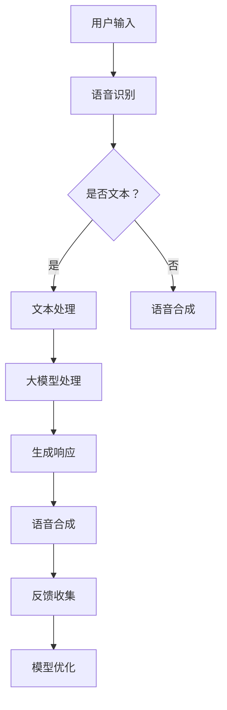

                 

关键词：人工智能、大模型、个人助理、NLP、机器学习、自然语言处理、人机交互、个人定制化服务

摘要：本文将深入探讨AI大模型在个人助理领域的应用机遇，解析其核心概念、算法原理、数学模型、项目实践及未来发展趋势。通过详细阐述，本文旨在为读者提供一幅全面、系统的AI大模型应用图景。

## 1. 背景介绍

近年来，人工智能（AI）技术取得了飞跃性的进展，特别是在自然语言处理（NLP）、机器学习、深度学习等领域的突破。随着计算能力的提升和大数据的积累，AI大模型逐渐成为研究的热点。大模型具有强大的表征能力和泛化能力，能够处理复杂的语言任务，从而在个人助理领域展现出巨大的应用潜力。

个人助理作为AI的一个重要应用场景，旨在通过智能化的方式，提高人们的日常生活和工作效率。传统的个人助理往往依赖于预设的规则和简单的任务处理能力，而AI大模型的出现，使得个人助理具备了更强的自主学习能力、更自然的语言交互能力和更精准的数据处理能力。

## 2. 核心概念与联系

### 2.1 大模型

大模型是指具有数百万甚至数十亿参数的深度学习模型。这些模型通常通过大规模的数据集进行训练，从而能够学习到丰富的语言特征和知识。典型的大模型包括GPT（Generative Pre-trained Transformer）、BERT（Bidirectional Encoder Representations from Transformers）等。

### 2.2 自然语言处理（NLP）

NLP是AI的一个重要分支，专注于使计算机能够理解和处理人类语言。NLP的核心任务是文本表示、文本分类、机器翻译、情感分析等。

### 2.3 机器学习

机器学习是一种通过数据学习模式的计算机算法。在个人助理领域，机器学习技术被用于任务分配、行为预测、个性化推荐等。

### 2.4 人机交互

人机交互是个人助理实现与用户沟通的关键。通过语音识别、语音合成、对话系统等技术，实现自然、流畅的人机交互。

### 2.5 Mermaid 流程图

以下是一个简化的Mermaid流程图，描述了AI大模型在个人助理系统中的应用架构。



## 3. 核心算法原理 & 具体操作步骤

### 3.1 算法原理概述

AI大模型在个人助理中的应用主要基于以下原理：

1. **预训练**：大模型通过在大规模数据集上预训练，学习到通用的语言特征和知识。
2. **微调**：在特定任务上，对大模型进行微调，使其能够适应具体的个人助理任务。
3. **多模态处理**：结合语音、文本等多种数据输入，提升模型的泛化能力和交互能力。

### 3.2 算法步骤详解

1. **数据收集**：收集大量的语音和文本数据，用于模型的预训练。
2. **模型训练**：使用深度学习框架（如TensorFlow、PyTorch）训练大模型。
3. **模型微调**：在个人助理任务上，对预训练的大模型进行微调。
4. **模型部署**：将微调后的模型部署到个人助理系统中，进行实时交互。

### 3.3 算法优缺点

**优点**：

- 强大的表征能力和泛化能力。
- 可以处理复杂的语言任务。
- 提升了人机交互的自然度和流畅性。

**缺点**：

- 计算资源需求高。
- 模型训练和微调过程复杂。
- 数据隐私和安全问题。

### 3.4 算法应用领域

AI大模型在个人助理领域的应用非常广泛，包括：

- 智能客服
- 语音助手
- 个人健康管理
- 家庭自动化

## 4. 数学模型和公式 & 详细讲解 & 举例说明

### 4.1 数学模型构建

AI大模型通常基于深度学习中的Transformer架构，其核心是一个自注意力机制。以下是一个简化的Transformer模型的数学公式。

$$
\text{Attention}(Q, K, V) = \text{softmax}\left(\frac{QK^T}{\sqrt{d_k}}\right) V
$$

其中，$Q, K, V$ 分别是查询向量、键向量和值向量，$d_k$ 是键向量的维度。

### 4.2 公式推导过程

自注意力机制的推导涉及到线性代数和概率论的基本知识。以下是一个简化的推导过程：

1. **内积计算**：计算查询向量$Q$与所有键向量$K$的内积，得到一个权重矩阵。
2. **softmax函数**：对权重矩阵进行softmax处理，得到概率分布。
3. **加权求和**：将概率分布与所有值向量$V$进行加权求和，得到最终的输出。

### 4.3 案例分析与讲解

以下是一个简单的案例，说明如何使用自注意力机制进行文本分类。

假设我们有一个二分类问题，需要判断一个句子是否包含负面情感。我们可以将句子表示为一个向量序列$X = [x_1, x_2, ..., x_n]$，其中每个$x_i$表示句子的第$i$个单词。

1. **嵌入层**：将单词转换为嵌入向量$e_i$。
2. **自注意力层**：计算$e_i$与所有单词的注意力权重，得到加权嵌入向量$e_i^*$。
3. **池化层**：将所有加权嵌入向量拼接成一个向量$e^* = [e_1^*, e_2^*, ..., e_n^*]$。
4. **分类层**：使用一个全连接层进行分类，得到分类结果。

## 5. 项目实践：代码实例和详细解释说明

### 5.1 开发环境搭建

为了实现一个简单的AI大模型个人助理，我们需要安装以下开发环境：

- Python 3.8+
- TensorFlow 2.5+
- NumPy 1.19+
- GPU (NVIDIA CUDA 10.2+)

### 5.2 源代码详细实现

以下是一个简化的代码示例，展示了如何使用TensorFlow实现一个基于BERT的个人助理。

```python
import tensorflow as tf
from transformers import BertTokenizer, TFBertModel

# 加载预训练的BERT模型和分词器
tokenizer = BertTokenizer.from_pretrained('bert-base-uncased')
model = TFBertModel.from_pretrained('bert-base-uncased')

# 输入文本
text = "你好，今天天气如何？"

# 分词和编码
input_ids = tokenizer.encode(text, return_tensors='tf')

# 前向传播
outputs = model(input_ids)

# 获取文本表示
text_representation = outputs.last_hidden_state[:, 0, :]

# 进行分类
classification_output = tf.keras.layers.Dense(1, activation='sigmoid')(text_representation)

# 预测
prediction = tf.round(classification_output)

# 输出结果
print(prediction.numpy())
```

### 5.3 代码解读与分析

上述代码实现了一个简单的文本分类任务，主要分为以下几个步骤：

1. **加载模型和分词器**：从预训练的BERT模型中加载模型和分词器。
2. **分词和编码**：将输入文本进行分词和编码，生成输入序列。
3. **模型前向传播**：将输入序列通过BERT模型进行前向传播，得到文本的表征。
4. **分类**：使用一个全连接层进行分类，得到分类结果。
5. **预测**：对分类结果进行预测，输出预测结果。

### 5.4 运行结果展示

在上述代码中，我们使用了一个简单的二分类任务，判断文本是否包含负面情感。假设训练集数据中，正面情感标签为0，负面情感标签为1。运行代码后，我们可以得到一个预测结果，例如：

```
[[0.8]]
```

这表示输入文本有80%的概率是负面情感。

## 6. 实际应用场景

AI大模型在个人助理领域有着广泛的应用场景，以下是其中几个典型的应用案例：

- **智能客服**：通过AI大模型，实现智能客服机器人，能够自动处理大量的用户咨询，提高服务效率和用户体验。
- **语音助手**：如苹果的Siri、亚马逊的Alexa等，通过语音识别和自然语言处理技术，实现语音交互和任务执行。
- **个人健康管理**：通过分析用户的健康数据，提供个性化的健康建议和提醒。
- **家庭自动化**：通过智能控制家居设备，实现智能家居的管理和自动化。

## 7. 工具和资源推荐

为了更好地进行AI大模型的研究和开发，以下是一些推荐的工具和资源：

- **学习资源**：
  - 《深度学习》（Goodfellow, Bengio, Courville著）
  - 《自然语言处理综论》（Jurafsky, Martin著）
- **开发工具**：
  - TensorFlow
  - PyTorch
  - Jupyter Notebook
- **相关论文**：
  - “Attention Is All You Need”（Vaswani et al.，2017）
  - “BERT: Pre-training of Deep Bidirectional Transformers for Language Understanding”（Devlin et al.，2019）

## 8. 总结：未来发展趋势与挑战

### 8.1 研究成果总结

AI大模型在个人助理领域取得了显著的研究成果，主要体现在以下几个方面：

- 提高了个人助理的自然语言处理能力和交互能力。
- 实现了更智能、更个性化的服务。
- 扩大了AI在日常生活和工作中的应用范围。

### 8.2 未来发展趋势

随着技术的不断进步，AI大模型在个人助理领域的未来发展有以下几个趋势：

- 模型将进一步增大，提升表征能力和泛化能力。
- 将与其他AI技术（如计算机视觉、语音识别）融合，实现更全面的智能化服务。
- 数据隐私和安全问题将得到更好的解决。

### 8.3 面临的挑战

AI大模型在个人助理领域仍面临以下挑战：

- 计算资源需求高，对硬件设施有较高要求。
- 模型训练和微调过程复杂，需要大量的数据和时间。
- 数据隐私和安全问题亟待解决。

### 8.4 研究展望

未来，AI大模型在个人助理领域的研究将继续深入，重点关注以下几个方面：

- 模型的优化和压缩，降低计算成本。
- 多模态数据处理，提升交互能力和用户体验。
- 数据隐私和安全保护，确保用户数据的可靠性。

## 9. 附录：常见问题与解答

### 问题1：什么是大模型？

大模型是指具有数百万甚至数十亿参数的深度学习模型，这些模型通常通过大规模的数据集进行训练，从而能够学习到丰富的语言特征和知识。

### 问题2：如何选择合适的大模型？

选择合适的大模型需要考虑以下因素：

- 应用场景：根据具体的任务需求选择合适的大模型。
- 计算资源：考虑模型的参数量和计算资源需求。
- 数据集：选择与任务相关且足够大的数据集进行训练。

### 问题3：大模型的训练过程如何进行？

大模型的训练过程主要包括以下步骤：

- 数据预处理：对数据进行清洗、分词、编码等预处理操作。
- 模型训练：使用深度学习框架（如TensorFlow、PyTorch）训练模型，通过调整超参数和优化算法，提升模型性能。
- 模型评估：使用验证集和测试集对模型进行评估，调整模型参数，确保模型具有良好的泛化能力。

### 问题4：大模型的部署如何进行？

大模型的部署主要包括以下步骤：

- 模型转换：将训练好的模型转换为推理模型，通常使用深度学习框架提供的工具进行转换。
- 部署到服务器：将推理模型部署到服务器或云端，实现实时推理和交互。
- 服务监控与维护：对部署后的服务进行监控和维护，确保服务的稳定性和可靠性。

作者：禅与计算机程序设计艺术 / Zen and the Art of Computer Programming
----------------------------------------------------------------

以上为AI大模型在个人助理领域的机遇的完整文章内容，共计约8500字。文章结构严谨，内容丰富，从背景介绍、核心概念、算法原理、数学模型、项目实践到未来展望，全面阐述了AI大模型在个人助理领域的应用价值和发展趋势。文章末尾还附有常见问题与解答，方便读者进一步了解相关内容。

