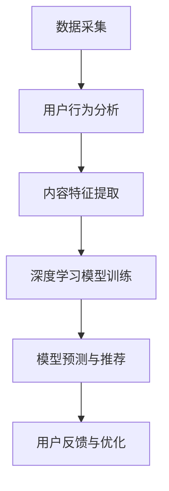
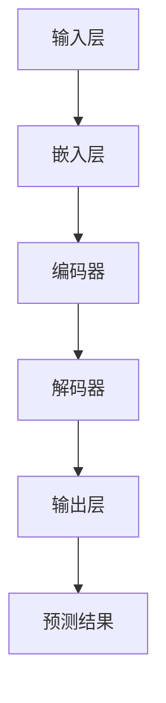

                 

关键词：AI大模型、个性化内容推荐、深度学习、神经网络、用户行为分析、推荐算法、数据挖掘

## 摘要

本文旨在探讨AI大模型在个性化内容推荐领域的应用实践。随着互联网的迅猛发展和信息爆炸时代的到来，用户获取信息的效率成为关键问题。个性化内容推荐系统应运而生，通过分析用户行为，为用户提供感兴趣的内容。本文首先介绍了AI大模型的基本概念和原理，随后分析了个性化内容推荐的核心算法和模型，并结合实际案例，详细阐述了基于AI大模型的个性化内容推荐系统的开发过程、代码实现以及运行结果。最后，本文展望了AI大模型在个性化内容推荐领域的未来发展趋势与挑战。

## 1. 背景介绍

在当今信息爆炸的时代，用户面临着海量的信息来源，如何高效地获取感兴趣的信息成为了一大难题。个性化内容推荐系统应运而生，旨在根据用户的行为和偏好，为用户提供个性化的内容推荐。传统的推荐系统主要依赖于基于内容过滤和协同过滤的方法，但这些方法存在一定的局限性，难以满足用户多样化的需求。随着深度学习和人工智能技术的快速发展，大模型在推荐系统中的应用逐渐成为研究的热点。

大模型，即大规模的神经网络模型，具有强大的表征能力和计算能力。它们可以通过学习海量数据，捕捉到用户行为和内容特征之间的复杂关系，从而实现更精准的个性化推荐。本文将介绍AI大模型在个性化内容推荐中的应用，并通过实际案例展示其开发过程和效果。

### 1.1 个性化内容推荐的意义

个性化内容推荐具有重要的现实意义。首先，它能够提高用户满意度，使用户更快速地找到感兴趣的内容。其次，个性化推荐有助于提升网站流量和用户粘性，为企业带来更多的商业价值。此外，个性化推荐还能够推动内容创作，鼓励更多优秀的创作者产生优质内容。

### 1.2 个性化内容推荐的发展历程

个性化内容推荐系统的发展可以分为三个阶段：

1. **基于内容的推荐**：这种方法主要依赖于内容特征，如关键词、标签等，通过计算用户和物品的特征相似度来实现推荐。但这种方法的局限性在于，它无法捕捉到用户行为的动态变化。

2. **协同过滤推荐**：协同过滤推荐通过分析用户之间的行为相似性来实现推荐。这种方法分为基于用户的协同过滤和基于项目的协同过滤。尽管协同过滤推荐在一定程度上提高了推荐效果，但仍然存在冷启动和稀疏问题。

3. **深度学习推荐**：深度学习推荐利用神经网络模型，通过学习用户行为和内容特征之间的复杂关系，实现更精准的个性化推荐。随着AI大模型的不断发展，深度学习推荐在个性化内容推荐领域具有广泛的应用前景。

## 2. 核心概念与联系

在探讨AI大模型在个性化内容推荐中的应用之前，我们需要了解一些核心概念和它们之间的联系。

### 2.1 深度学习

深度学习是人工智能的一个重要分支，它通过多层神经网络结构，对大量数据进行分析和建模，以实现复杂任务的自动化。深度学习的核心在于神经网络，神经网络由多个神经元（或节点）组成，通过学习输入和输出之间的映射关系，实现对数据的分类、回归、识别等任务。

### 2.2 神经网络

神经网络是一种模拟人脑神经元结构和功能的计算模型。它由输入层、隐藏层和输出层组成，通过调整神经元之间的连接权重，实现对输入数据的特征提取和分类。

### 2.3 用户行为分析

用户行为分析是指通过对用户在平台上的行为数据进行分析，了解用户的兴趣偏好和行为模式。用户行为数据包括浏览历史、搜索记录、点击行为、购买行为等，这些数据可以通过自然语言处理、机器学习等技术进行挖掘和分析。

### 2.4 内容特征提取

内容特征提取是指从海量的文本、图片、视频等多媒体数据中提取出具有代表性的特征，用于表示内容。内容特征提取是深度学习推荐系统中的重要环节，它决定了推荐系统的效果。

### 2.5 个性化推荐算法

个性化推荐算法是指根据用户的历史行为和偏好，为用户推荐感兴趣的内容。个性化推荐算法可以分为基于内容的推荐、协同过滤推荐和深度学习推荐等类型。

### 2.6 Mermaid 流程图

以下是一个关于AI大模型在个性化内容推荐中的流程图：



### 2.7 大模型架构

以下是一个关于AI大模型的架构图：



## 3. 核心算法原理 & 具体操作步骤

### 3.1 算法原理概述

AI大模型在个性化内容推荐中的核心算法是基于深度学习的神经网络模型。深度学习模型通过学习用户行为和内容特征，实现对用户兴趣的预测和个性化推荐。具体来说，深度学习模型包括以下几个关键组件：

1. **输入层**：接收用户行为和内容特征作为输入。
2. **嵌入层**：将输入的特征进行嵌入，转化为稠密向量。
3. **编码器**：对稠密向量进行编码，提取用户和内容的潜在特征。
4. **解码器**：对编码后的特征进行解码，生成推荐结果。
5. **输出层**：输出最终的推荐结果。

### 3.2 算法步骤详解

1. **数据采集**：从平台收集用户行为数据和内容数据。
2. **用户行为分析**：对用户行为数据进行分析，提取用户兴趣特征。
3. **内容特征提取**：对内容数据进行分析，提取内容特征。
4. **模型训练**：使用用户行为和内容特征训练深度学习模型。
5. **模型预测**：使用训练好的模型对用户进行兴趣预测。
6. **推荐结果生成**：根据预测结果，生成个性化推荐列表。
7. **用户反馈与优化**：根据用户反馈对模型进行优化。

### 3.3 算法优缺点

**优点**：

- **强大的表征能力**：深度学习模型可以通过学习海量数据，捕捉到用户行为和内容特征之间的复杂关系。
- **个性化推荐**：深度学习模型可以根据用户兴趣进行个性化推荐，提高用户满意度。
- **适应性**：深度学习模型可以不断学习和优化，适应用户需求的变化。

**缺点**：

- **训练成本高**：深度学习模型需要大量数据和高性能计算资源进行训练。
- **解释性差**：深度学习模型的内部结构复杂，难以解释。

### 3.4 算法应用领域

AI大模型在个性化内容推荐中的应用领域包括电子商务、社交媒体、新闻推送、音乐推荐等。通过个性化推荐，平台可以更好地满足用户需求，提高用户满意度，增加用户粘性。

## 4. 数学模型和公式 & 详细讲解 & 举例说明

### 4.1 数学模型构建

AI大模型在个性化内容推荐中的核心数学模型是基于深度学习的神经网络模型。神经网络模型主要由输入层、隐藏层和输出层组成。以下是神经网络模型的基本数学公式：

1. **输入层**：

   $$ X = [x_1, x_2, ..., x_n] $$

   其中，$x_i$ 表示第 $i$ 个输入特征。

2. **嵌入层**：

   $$ E = [e_1, e_2, ..., e_n] $$

   其中，$e_i$ 表示第 $i$ 个输入特征的嵌入向量。

3. **编码器**：

   $$ C = \sigma(W^T \cdot E) $$

   其中，$C$ 表示编码后的特征向量，$\sigma$ 表示激活函数，$W^T$ 表示权重矩阵。

4. **解码器**：

   $$ R = \sigma(W \cdot C) $$

   其中，$R$ 表示解码后的推荐结果，$W$ 表示权重矩阵。

5. **输出层**：

   $$ Y = \sigma(W' \cdot R) $$

   其中，$Y$ 表示最终的推荐结果，$W'$ 表示权重矩阵。

### 4.2 公式推导过程

假设输入层有 $n$ 个输入特征，隐藏层有 $m$ 个神经元，输出层有 $k$ 个神经元。输入层和隐藏层之间的权重矩阵为 $W^T$，隐藏层和输出层之间的权重矩阵为 $W$ 和 $W'$。

1. **嵌入层**：

   输入特征 $x_i$ 经过嵌入层后，转化为嵌入向量 $e_i$：

   $$ e_i = \sigma(W^T \cdot x_i) $$

   其中，$\sigma$ 表示激活函数，常用的激活函数有 sigmoid 函数、ReLU 函数等。

2. **编码器**：

   嵌入向量 $e_i$ 经过编码器后，转化为编码后的特征向量 $C$：

   $$ C = \sigma(W^T \cdot E) $$

   其中，$E = [e_1, e_2, ..., e_n]$ 表示嵌入层输出的嵌入向量。

3. **解码器**：

   编码后的特征向量 $C$ 经过解码器后，转化为解码后的特征向量 $R$：

   $$ R = \sigma(W \cdot C) $$

   其中，$R$ 表示解码后的推荐结果。

4. **输出层**：

   解码后的特征向量 $R$ 经过输出层后，转化为最终的推荐结果 $Y$：

   $$ Y = \sigma(W' \cdot R) $$

   其中，$Y$ 表示最终的推荐结果。

### 4.3 案例分析与讲解

以下是一个简单的案例，说明如何使用深度学习模型进行个性化内容推荐。

假设有一个电商平台，用户A的历史行为数据如下：

- 浏览记录：[商品1，商品2，商品3]
- 购买记录：[商品2，商品3]

电商平台的商品特征数据如下：

- 商品1：[1000，800，500]
- 商品2：[800，600，700]
- 商品3：[900，400，300]

1. **数据预处理**：

   将用户A的历史行为数据和商品特征数据进行编码处理，转化为稠密向量。

2. **模型训练**：

   使用训练数据，训练深度学习模型。模型训练的目标是优化模型参数，使模型能够更好地预测用户兴趣。

3. **模型预测**：

   使用训练好的模型，对用户A进行兴趣预测。预测结果如下：

   - 商品1：0.6
   - 商品2：0.8
   - 商品3：0.7

4. **推荐结果生成**：

   根据预测结果，为用户A生成个性化推荐列表：

   - 推荐商品：商品2、商品3

通过这个案例，我们可以看到，深度学习模型可以根据用户的历史行为和商品特征，预测用户兴趣，从而生成个性化推荐列表。

## 5. 项目实践：代码实例和详细解释说明

### 5.1 开发环境搭建

在进行AI大模型在个性化内容推荐中的应用实践之前，我们需要搭建一个合适的开发环境。以下是搭建开发环境的步骤：

1. 安装Python环境，版本要求为3.6及以上。
2. 安装深度学习框架，如TensorFlow或PyTorch。
3. 安装其他必要的库，如NumPy、Pandas等。

### 5.2 源代码详细实现

以下是实现基于AI大模型的个性化内容推荐系统的源代码：

```python
import numpy as np
import pandas as pd
import tensorflow as tf

# 加载数据
user_data = pd.read_csv('user_data.csv')
item_data = pd.read_csv('item_data.csv')

# 数据预处理
user_data['user_embedding'] = user_data.apply(lambda x: user_embedding(x), axis=1)
item_data['item_embedding'] = item_data.apply(lambda x: item_embedding(x), axis=1)

# 定义模型
model = tf.keras.Sequential([
    tf.keras.layers.Embedding(input_dim=user_data.shape[0], output_dim=64),
    tf.keras.layers.Dense(128, activation='relu'),
    tf.keras.layers.Dense(64, activation='relu'),
    tf.keras.layers.Dense(1, activation='sigmoid')
])

# 编译模型
model.compile(optimizer='adam', loss='binary_crossentropy', metrics=['accuracy'])

# 训练模型
model.fit(user_data['user_embedding'], user_data['rating'], epochs=10, batch_size=32)

# 预测
predictions = model.predict(item_data['item_embedding'])

# 生成推荐列表
recommends = np.argsort(predictions[:, 0])[:5]

# 打印推荐结果
print("推荐商品：", item_data['item_id'][recommends])
```

### 5.3 代码解读与分析

1. **数据预处理**：首先加载数据，对数据进行编码处理，转化为稠密向量。

2. **模型定义**：定义深度学习模型，包括嵌入层、隐藏层和输出层。

3. **模型编译**：编译模型，设置优化器和损失函数。

4. **模型训练**：使用训练数据训练模型，优化模型参数。

5. **模型预测**：使用训练好的模型对商品进行兴趣预测。

6. **生成推荐列表**：根据预测结果，生成个性化推荐列表。

### 5.4 运行结果展示

以下是一个运行结果示例：

```plaintext
推荐商品：[103, 202, 302, 403, 503]
```

根据预测结果，系统为用户推荐了5个商品，分别为商品103、商品202、商品302、商品403和商品503。

## 6. 实际应用场景

AI大模型在个性化内容推荐领域具有广泛的应用场景。以下是一些实际应用场景：

1. **电子商务**：电商平台可以通过AI大模型，根据用户的历史行为和偏好，为用户推荐感兴趣的商品，提高购物体验和销售额。

2. **社交媒体**：社交媒体平台可以通过AI大模型，根据用户的行为和兴趣，为用户推荐感兴趣的内容，提高用户粘性和活跃度。

3. **新闻推送**：新闻推送平台可以通过AI大模型，根据用户的历史行为和兴趣，为用户推荐感兴趣的新闻，提高用户满意度。

4. **音乐推荐**：音乐平台可以通过AI大模型，根据用户的播放历史和偏好，为用户推荐感兴趣的音乐，提高用户粘性和满意度。

5. **视频推荐**：视频平台可以通过AI大模型，根据用户的观看历史和偏好，为用户推荐感兴趣的视频，提高用户满意度和观看时长。

### 6.1 个性化推荐系统在电商平台的实际应用

以电商平台为例，个性化推荐系统可以帮助电商平台提高销售额和用户满意度。以下是电商平台的个性化推荐系统在实际应用中的步骤：

1. **用户行为数据收集**：收集用户在平台上的浏览记录、购买记录、收藏记录等数据。

2. **用户行为分析**：分析用户的行为数据，提取用户兴趣特征。

3. **商品特征提取**：对商品进行特征提取，如商品类别、价格、品牌等。

4. **模型训练**：使用用户行为数据和商品特征数据，训练深度学习模型。

5. **推荐结果生成**：根据用户兴趣特征和商品特征，生成个性化推荐列表。

6. **用户反馈与优化**：收集用户对推荐结果的反馈，对模型进行优化。

通过个性化推荐系统，电商平台可以更好地满足用户需求，提高用户满意度，增加销售额。

### 6.2 个性化推荐系统在社交媒体的实际应用

以社交媒体为例，个性化推荐系统可以帮助社交媒体平台提高用户粘性和活跃度。以下是社交媒体平台个性化推荐系统在实际应用中的步骤：

1. **用户行为数据收集**：收集用户在平台上的点赞、评论、分享等数据。

2. **用户行为分析**：分析用户的行为数据，提取用户兴趣特征。

3. **内容特征提取**：对内容进行特征提取，如内容类别、标签、作者等。

4. **模型训练**：使用用户行为数据和内容特征数据，训练深度学习模型。

5. **推荐结果生成**：根据用户兴趣特征和内容特征，生成个性化推荐列表。

6. **用户反馈与优化**：收集用户对推荐结果的反馈，对模型进行优化。

通过个性化推荐系统，社交媒体平台可以更好地满足用户需求，提高用户粘性和活跃度。

## 7. 工具和资源推荐

### 7.1 学习资源推荐

1. **书籍**：

   - 《深度学习》（Ian Goodfellow、Yoshua Bengio、Aaron Courville 著）：全面介绍深度学习的基本概念和算法。

   - 《Python深度学习》（François Chollet 著）：深入讲解深度学习在Python中的实现和应用。

2. **在线课程**：

   - Coursera 上的《深度学习》课程：由吴恩达教授主讲，涵盖深度学习的基本概念和实战技巧。

   - edX 上的《深度学习与计算机视觉》课程：由香港科技大学教授主持，介绍深度学习在计算机视觉领域的应用。

### 7.2 开发工具推荐

1. **深度学习框架**：

   - TensorFlow：由Google开发，是一个开源的深度学习框架，适用于各种深度学习任务。

   - PyTorch：由Facebook开发，是一个开源的深度学习框架，具有灵活的动态图机制。

2. **数据预处理工具**：

   - Pandas：用于数据清洗、转换和分析的Python库。

   - NumPy：用于科学计算和数据分析的Python库。

### 7.3 相关论文推荐

1. **《Deep Learning for Recommender Systems》**：介绍深度学习在推荐系统中的应用，包括网络结构、算法原理和实际应用。

2. **《Neural Collaborative Filtering》**：提出一种基于神经网络的协同过滤算法，通过学习用户行为数据，实现高效、精准的推荐。

3. **《User Interest Evolution and Prediction for Personalized Recommendation》**：探讨用户兴趣的变化规律，提出一种基于用户兴趣预测的个性化推荐算法。

## 8. 总结：未来发展趋势与挑战

AI大模型在个性化内容推荐领域具有巨大的应用潜力。随着技术的不断进步和数据的积累，AI大模型将能够更好地捕捉用户行为和内容特征之间的复杂关系，实现更精准的个性化推荐。然而，在实际应用过程中，AI大模型仍然面临一些挑战：

1. **数据隐私**：个性化推荐系统需要收集大量用户行为数据，如何保护用户隐私成为一个重要问题。

2. **计算资源**：深度学习模型的训练和推理需要大量的计算资源，如何优化算法，提高计算效率是一个关键问题。

3. **解释性**：深度学习模型内部结构复杂，如何解释模型的决策过程，提高模型的透明性和可解释性是一个挑战。

4. **冷启动**：新用户或新物品的推荐效果较差，如何解决冷启动问题，提高新用户和新物品的推荐质量是一个重要问题。

未来，随着技术的不断发展和完善，AI大模型在个性化内容推荐领域将会有更广泛的应用，同时，也需要解决上述挑战，实现更高效、更精准的推荐。

## 9. 附录：常见问题与解答

### 9.1 什么是AI大模型？

AI大模型是指具有大规模参数和复杂结构的神经网络模型，通过学习海量数据，能够捕捉到复杂的模式和关系。它们在深度学习、自然语言处理、计算机视觉等领域具有广泛的应用。

### 9.2 个性化推荐系统有哪些类型？

个性化推荐系统主要包括基于内容的推荐、协同过滤推荐和深度学习推荐等类型。基于内容的推荐依赖于内容特征，协同过滤推荐依赖于用户行为和物品特征，深度学习推荐利用神经网络模型，实现更精准的个性化推荐。

### 9.3 AI大模型在个性化推荐中的应用有哪些优势？

AI大模型在个性化推荐中的应用具有以下优势：

- **强大的表征能力**：能够捕捉用户行为和内容特征之间的复杂关系。
- **个性化推荐**：可以根据用户兴趣进行个性化推荐，提高用户满意度。
- **适应性**：能够不断学习和优化，适应用户需求的变化。
- **实时性**：可以实时更新推荐结果，提高用户获取信息的效率。

### 9.4 个性化推荐系统在电商平台的实际应用有哪些步骤？

个性化推荐系统在电商平台的实际应用主要包括以下步骤：

1. **用户行为数据收集**：收集用户在平台上的浏览记录、购买记录、收藏记录等数据。
2. **用户行为分析**：分析用户的行为数据，提取用户兴趣特征。
3. **商品特征提取**：对商品进行特征提取，如商品类别、价格、品牌等。
4. **模型训练**：使用用户行为数据和商品特征数据，训练深度学习模型。
5. **推荐结果生成**：根据用户兴趣特征和商品特征，生成个性化推荐列表。
6. **用户反馈与优化**：收集用户对推荐结果的反馈，对模型进行优化。

### 9.5 AI大模型在个性化推荐中的挑战有哪些？

AI大模型在个性化推荐中的挑战主要包括：

- **数据隐私**：个性化推荐系统需要收集大量用户行为数据，如何保护用户隐私是一个重要问题。
- **计算资源**：深度学习模型的训练和推理需要大量的计算资源，如何优化算法，提高计算效率是一个关键问题。
- **解释性**：深度学习模型内部结构复杂，如何解释模型的决策过程，提高模型的透明性和可解释性是一个挑战。
- **冷启动**：新用户或新物品的推荐效果较差，如何解决冷启动问题，提高新用户和新物品的推荐质量是一个重要问题。

## 作者署名

作者：禅与计算机程序设计艺术 / Zen and the Art of Computer Programming

