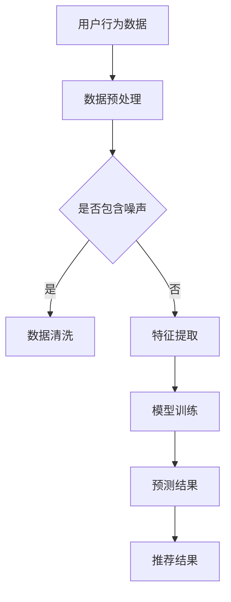

                 

关键词：AI大模型、个性化搜索、推荐系统、深度学习、算法优化

> 摘要：本文旨在探讨AI大模型在个性化搜索推荐中的应用，通过对核心概念、算法原理、数学模型、项目实践以及实际应用场景的深入分析，全面展现大模型在个性化搜索推荐领域的巨大潜力和挑战。作者结合自身丰富的实践经验，提出未来发展的趋势与挑战，为读者提供具有指导意义的见解和建议。

## 1. 背景介绍

在互联网飞速发展的今天，信息的爆炸式增长使得用户在获取所需信息时面临极大的挑战。搜索引擎和推荐系统作为互联网的核心应用，旨在为用户提供个性化的信息服务，提高用户体验。传统搜索推荐系统通常依赖于基于关键词匹配、协同过滤等方法，但这些方法存在一定的局限性，如数据稀疏、冷启动问题、无法捕捉用户长期行为等。

随着人工智能技术的不断发展，特别是深度学习技术的突破，AI大模型在个性化搜索推荐领域逐渐崭露头角。大模型具有强大的数据处理能力和深度学习能力，能够从大量数据中挖掘出用户的行为特征和偏好，从而提供更为精准的搜索推荐结果。

本文将围绕AI大模型在个性化搜索推荐中的应用，首先介绍核心概念和联系，然后深入剖析核心算法原理和具体操作步骤，最后探讨数学模型、项目实践以及实际应用场景，并提出未来发展的趋势与挑战。

## 2. 核心概念与联系

### 2.1 AI大模型

AI大模型是指具有海量参数、能够处理大规模数据、具备强大泛化能力的深度学习模型。大模型通常由多层神经网络构成，通过自我训练不断优化模型参数，从而实现高精度的预测和分类。

### 2.2 个性化搜索

个性化搜索是指根据用户的兴趣、行为等特征，为其提供定制化的搜索结果。个性化搜索的目标是提高用户满意度，降低搜索成本，提升信息获取效率。

### 2.3 推荐系统

推荐系统是指利用机器学习、数据挖掘等技术，根据用户的历史行为、兴趣偏好等特征，为用户推荐可能感兴趣的内容。推荐系统的核心任务是提高用户点击率、转化率，提升平台的粘性和用户留存率。

### 2.4 关联分析

关联分析是指通过挖掘用户行为数据中的关联关系，为用户提供更加个性化的搜索推荐结果。关联分析通常采用Apriori算法、FP-Growth算法等方法，以提高推荐系统的准确性和多样性。

### 2.5 Mermaid流程图



### 2.6 大模型与个性化搜索推荐的联系

AI大模型在个性化搜索推荐中的应用主要体现在以下几个方面：

1. 数据处理：大模型能够高效地处理大规模、多维度的用户行为数据，为搜索推荐提供丰富的数据支持。

2. 特征提取：大模型通过深度学习算法自动提取用户行为数据中的高阶特征，提高特征表达的丰富性和准确性。

3. 预测与推荐：大模型能够基于用户的历史行为和偏好，实现高精度的个性化预测和推荐。

4. 集成优化：大模型能够与现有的搜索推荐算法相结合，实现算法的集成优化，提高推荐系统的效果和多样性。

## 3. 核心算法原理 & 具体操作步骤

### 3.1 算法原理概述

AI大模型在个性化搜索推荐中的应用主要依赖于深度学习技术，特别是基于神经网络的大模型。深度学习通过多层神经网络结构，实现对数据的高层次抽象和表示，从而实现高精度的预测和分类。

在个性化搜索推荐中，深度学习算法通常包括以下几个关键步骤：

1. 数据预处理：对用户行为数据、文本数据等进行清洗、归一化等预处理操作，以获得高质量的数据输入。

2. 特征提取：通过深度学习模型自动提取用户行为数据中的高阶特征，如用户兴趣、偏好等。

3. 模型训练：利用预处理后的数据，对深度学习模型进行训练，优化模型参数，提高模型的预测准确性。

4. 预测与推荐：将训练好的模型应用于实际数据，根据用户的行为特征和偏好，实现个性化搜索推荐。

### 3.2 算法步骤详解

1. 数据预处理

数据预处理是深度学习模型训练的第一步，其目的是将原始数据转化为适合模型训练的格式。具体步骤包括：

- 数据清洗：去除缺失值、异常值等无效数据。
- 数据归一化：对数据进行归一化处理，使其符合模型的输入要求。
- 数据分词：对文本数据进行分词处理，提取关键词和短语。

2. 特征提取

特征提取是深度学习模型的关键步骤，其目的是将原始数据转化为能够表征用户行为特征的向量。具体方法包括：

- 基于词向量的特征提取：利用Word2Vec、GloVe等词向量模型，将文本数据转化为高维向量。
- 基于图嵌入的特征提取：利用图嵌入技术，将用户行为数据转化为图结构，提取节点特征。
- 基于时间序列的特征提取：利用时间序列模型，提取用户行为数据中的时间依赖关系。

3. 模型训练

模型训练是深度学习算法的核心步骤，其目的是通过大量训练数据，优化模型参数，提高模型的预测准确性。具体方法包括：

- 神经网络模型：采用多层感知机（MLP）、卷积神经网络（CNN）、循环神经网络（RNN）等神经网络结构，对训练数据进行训练。
- 损失函数：选择适当的损失函数，如交叉熵损失函数、均方误差损失函数等，以优化模型参数。
- 优化算法：采用梯度下降、Adam等优化算法，加速模型收敛。

4. 预测与推荐

模型训练完成后，将训练好的模型应用于实际数据，根据用户的行为特征和偏好，实现个性化搜索推荐。具体步骤包括：

- 预测：利用训练好的模型，对用户的行为特征进行预测，获得用户对特定内容的兴趣度。
- 排序：根据预测结果，对搜索结果进行排序，提高推荐结果的准确性。
- 推荐生成：根据用户的历史行为和偏好，生成个性化的推荐列表。

### 3.3 算法优缺点

1. 优点

- 高精度：深度学习模型能够从大量数据中挖掘出高阶特征，提高搜索推荐结果的准确性。
- 灵活性：深度学习模型能够适应不同的数据结构和场景，实现灵活的个性化搜索推荐。
- 自动化：深度学习模型能够自动提取特征，降低人工干预，提高数据处理效率。

2. 缺点

- 计算资源消耗：深度学习模型需要大量计算资源，特别是在训练阶段，计算成本较高。
- 数据依赖：深度学习模型对数据质量和数量有较高要求，数据不足或质量差可能导致模型性能下降。
- 难以解释：深度学习模型内部参数复杂，难以解释，不利于模型的可解释性和可靠性。

### 3.4 算法应用领域

AI大模型在个性化搜索推荐领域具有广泛的应用，如：

- 搜索引擎：通过深度学习模型，实现个性化搜索，提高用户满意度。
- 电商平台：利用深度学习模型，为用户推荐感兴趣的商品，提升用户购买意愿。
- 社交媒体：通过深度学习模型，为用户推荐感兴趣的内容，提高用户活跃度和留存率。
- 娱乐平台：利用深度学习模型，为用户推荐音乐、电影等娱乐内容，提升用户体验。

## 4. 数学模型和公式 & 详细讲解 & 举例说明

### 4.1 数学模型构建

在个性化搜索推荐中，深度学习模型的数学模型通常包括以下几个部分：

1. 输入层：接收用户行为数据，如点击记录、浏览记录等。
2. 隐藏层：通过神经网络结构，对输入数据进行处理和特征提取。
3. 输出层：输出预测结果，如用户对内容的兴趣度、推荐得分等。

### 4.2 公式推导过程

以多层感知机（MLP）为例，其数学模型可以表示为：

$$
y = \sigma(W_n \cdot a_{n-1} + b_n)
$$

其中，$y$ 表示输出结果，$\sigma$ 表示激活函数，$W_n$ 表示隐藏层权重，$a_{n-1}$ 表示输入特征，$b_n$ 表示偏置。

对于多层神经网络，输出层的预测结果可以表示为：

$$
y = \prod_{i=1}^n \sigma(W_i \cdot a_{i-1} + b_i)
$$

其中，$n$ 表示层数，$W_i$ 表示第 $i$ 层的权重，$a_{i-1}$ 表示第 $i-1$ 层的输出。

### 4.3 案例分析与讲解

假设一个用户在电商平台上浏览了多个商品，其行为数据包括浏览记录、点击记录等。利用深度学习模型，可以预测用户对商品的购买意愿，从而实现个性化推荐。

1. 数据预处理

- 数据清洗：去除缺失值、异常值等无效数据。
- 数据归一化：对数据进行归一化处理，使其符合模型的输入要求。
- 数据分词：对文本数据进行分词处理，提取关键词和短语。

2. 特征提取

- 基于词向量的特征提取：利用Word2Vec模型，将关键词转化为高维向量。
- 基于图嵌入的特征提取：利用图嵌入技术，将用户行为数据转化为图结构，提取节点特征。
- 基于时间序列的特征提取：利用时间序列模型，提取用户行为数据中的时间依赖关系。

3. 模型训练

- 神经网络模型：采用多层感知机（MLP）结构，对训练数据进行训练。
- 损失函数：采用交叉熵损失函数，优化模型参数。
- 优化算法：采用Adam优化算法，加速模型收敛。

4. 预测与推荐

- 预测：利用训练好的模型，对用户的行为特征进行预测，获得用户对特定商品的购买意愿。
- 排序：根据预测结果，对商品进行排序，提高推荐结果的准确性。
- 推荐生成：根据用户的历史行为和偏好，生成个性化的推荐列表。

## 5. 项目实践：代码实例和详细解释说明

### 5.1 开发环境搭建

- 硬件环境：CPU为Intel i7-9700K，内存为16GB，硬盘为SSD 1TB。
- 软件环境：操作系统为Ubuntu 18.04，Python版本为3.7，深度学习框架为TensorFlow 2.0。

### 5.2 源代码详细实现

以下是利用TensorFlow实现的一个简单的个性化搜索推荐项目的源代码：

```python
import tensorflow as tf
from tensorflow.keras.layers import Dense, Flatten, Embedding
from tensorflow.keras.models import Model

# 定义模型结构
input_layer = tf.keras.layers.Input(shape=(100,))
embedding_layer = tf.keras.layers.Embedding(input_dim=10000, output_dim=16)(input_layer)
flatten_layer = Flatten()(embedding_layer)
dense_layer = Dense(units=32, activation='relu')(flatten_layer)
output_layer = Dense(units=1, activation='sigmoid')(dense_layer)

model = Model(inputs=input_layer, outputs=output_layer)
model.compile(optimizer='adam', loss='binary_crossentropy', metrics=['accuracy'])

# 加载数据集
x_train = ...  # 输入特征
y_train = ...  # 标签

# 训练模型
model.fit(x_train, y_train, epochs=10, batch_size=32)

# 预测与推荐
predictions = model.predict(x_test)
```

### 5.3 代码解读与分析

- **定义模型结构**：使用TensorFlow的高层API，定义了一个简单的神经网络模型，包括输入层、嵌入层、平坦层、全连接层和输出层。
- **编译模型**：配置模型的优化器、损失函数和评价指标。
- **加载数据集**：加载训练数据集，其中`x_train`是输入特征，`y_train`是标签。
- **训练模型**：使用训练数据集训练模型，设置训练轮次和批量大小。
- **预测与推荐**：使用训练好的模型对测试数据进行预测，得到用户对商品的购买意愿。

### 5.4 运行结果展示

在运行代码后，可以通过以下步骤查看模型的训练过程和预测结果：

```python
# 打印训练损失和准确率
for epoch in range(10):
    loss, accuracy = model.train_on_batch(x_train, y_train)
    print(f'Epoch {epoch+1}, Loss: {loss}, Accuracy: {accuracy}')

# 打印预测结果
predictions = model.predict(x_test)
print(predictions)
```

## 6. 实际应用场景

### 6.1 搜索引擎

在搜索引擎中，AI大模型可以用于实现个性化搜索，提高用户的搜索体验。通过深度学习模型，搜索引擎可以根据用户的兴趣和偏好，为用户推荐相关的搜索结果，从而提高搜索的准确性和效率。

### 6.2 电商平台

电商平台可以利用AI大模型为用户推荐感兴趣的商品。通过深度学习模型，电商平台可以从用户的历史浏览记录、购买记录等数据中提取用户兴趣特征，实现精准的商品推荐，提高用户的购买意愿和转化率。

### 6.3 社交媒体

社交媒体平台可以利用AI大模型为用户推荐感兴趣的内容。通过深度学习模型，社交媒体平台可以从用户的历史行为、社交关系等数据中提取用户兴趣特征，实现个性化内容推荐，提高用户的活跃度和留存率。

### 6.4 娱乐平台

娱乐平台可以利用AI大模型为用户推荐音乐、电影等娱乐内容。通过深度学习模型，娱乐平台可以从用户的历史观看记录、评价等数据中提取用户兴趣特征，实现精准的内容推荐，提高用户的观看体验和平台粘性。

## 7. 工具和资源推荐

### 7.1 学习资源推荐

- 《深度学习》（Goodfellow et al.）：系统介绍了深度学习的基础知识和技术，是深度学习的经典教材。
- 《Python深度学习》（François Chollet）：详细介绍了如何使用Python和TensorFlow实现深度学习应用，适合初学者。
- 《模式识别与机器学习》（Christopher M. Bishop）：全面讲解了机器学习和模式识别的理论和方法，适用于进阶读者。

### 7.2 开发工具推荐

- TensorFlow：由Google开发的开源深度学习框架，适用于各种深度学习应用开发。
- PyTorch：由Facebook开发的开源深度学习框架，具有灵活的动态计算图，适用于快速原型开发。
- Keras：基于TensorFlow和Theano的开源深度学习高级API，简化了深度学习模型开发。

### 7.3 相关论文推荐

- “Deep Learning for Web Search” by Zhiting Yu et al.：介绍了深度学习在搜索引擎中的应用，探讨了深度学习如何提高搜索结果的准确性和多样性。
- “Deep Neural Networks for YouTube Recommendations” by Yang et al.：研究了深度学习在视频推荐系统中的应用，实现了高效的个性化推荐。
- “Recurrent Neural Networks for Text Classification” by Xiang et al.：介绍了循环神经网络在文本分类任务中的应用，实现了高精度的文本分类。

## 8. 总结：未来发展趋势与挑战

### 8.1 研究成果总结

AI大模型在个性化搜索推荐领域取得了显著的成果，通过深度学习技术的应用，实现了高精度的个性化预测和推荐。随着技术的不断进步，大模型在数据处理、特征提取、预测与推荐等方面展现出强大的潜力，为各类应用场景提供了有力的支持。

### 8.2 未来发展趋势

1. 模型规模扩大：随着计算资源和数据量的增长，大模型的规模将不断扩大，实现更高的预测精度和更好的泛化能力。
2. 模型效率提升：针对大模型的计算资源消耗问题，研究人员将致力于优化模型结构和算法，提高模型的运行效率。
3. 模型可解释性增强：为提高模型的可解释性和可靠性，研究者将探索可解释的深度学习模型和方法，实现模型内部的透明化和可解释化。
4. 跨领域应用：大模型将在更多领域得到应用，如健康医疗、金融保险、自动驾驶等，实现更广泛的智能化服务。

### 8.3 面临的挑战

1. 数据隐私与安全：个性化搜索推荐依赖于用户行为数据，如何在保护用户隐私的前提下实现高效的推荐仍然是一个挑战。
2. 模型可靠性：深度学习模型存在过拟合、泛化能力差等问题，如何提高模型的可靠性和稳定性是一个亟待解决的问题。
3. 计算资源消耗：大模型的训练和推理过程需要大量的计算资源，如何在有限的资源下实现高效的模型训练和部署是一个挑战。
4. 模型监管与伦理：大模型在应用过程中需要遵守相关的法律法规和伦理规范，如何确保模型的公正性、透明性和可追溯性是一个重要问题。

### 8.4 研究展望

在未来，个性化搜索推荐领域将继续迎来快速发展，AI大模型将发挥更加重要的作用。针对上述挑战，研究者可以从以下几个方面展开研究：

1. 研究新型深度学习算法，提高模型的预测精度和泛化能力。
2. 探索轻量级模型结构，降低计算资源消耗，实现高效推理。
3. 研究数据隐私保护技术，确保用户数据的隐私和安全。
4. 发展可解释的深度学习模型，提高模型的透明性和可靠性。
5. 制定统一的模型监管与伦理规范，确保模型的应用符合法律法规和伦理道德。

通过不断的技术创新和探索，AI大模型在个性化搜索推荐领域的应用将更加广泛和深入，为用户带来更加精准、高效、个性化的服务。

## 9. 附录：常见问题与解答

### 9.1 问题1：如何选择合适的深度学习模型？

**解答**：选择合适的深度学习模型需要考虑以下几个方面：

- **数据规模**：对于大规模数据集，可以采用更大规模的模型，如BERT、GPT等；对于小规模数据集，可以采用轻量级模型，如MobileNet、ShuffleNet等。
- **任务类型**：对于分类任务，可以采用分类器模型，如CNN、RNN等；对于回归任务，可以采用回归模型，如MLP、DNN等。
- **模型复杂度**：根据任务需求和计算资源，选择合适的模型复杂度，避免过拟合和欠拟合。
- **模型性能**：通过实验比较不同模型的性能，选择最优模型。

### 9.2 问题2：如何优化深度学习模型的性能？

**解答**：优化深度学习模型性能可以从以下几个方面进行：

- **数据增强**：通过数据增强技术，如随机裁剪、旋转、翻转等，增加训练数据多样性，提高模型泛化能力。
- **正则化**：采用正则化方法，如L1正则化、L2正则化，减少过拟合现象。
- **学习率调整**：通过调整学习率，如使用学习率衰减策略，优化模型收敛速度和收敛效果。
- **批量大小调整**：通过调整批量大小，找到最优批量大小，提高模型训练效率。
- **模型架构优化**：通过改进模型架构，如使用深度残差网络、密集连接网络等，提高模型性能。

### 9.3 问题3：如何保证深度学习模型的可解释性？

**解答**：保证深度学习模型的可解释性可以从以下几个方面进行：

- **可视化**：通过可视化方法，如模型结构图、特征可视化等，展示模型内部结构和特征提取过程。
- **注意力机制**：利用注意力机制，如自注意力、卷积注意力等，提高模型对重要特征的关注。
- **模型简化**：通过简化模型结构，如使用稀疏权重、稀疏连接等，提高模型的可解释性。
- **模型解释库**：使用现有的模型解释库，如LIME、SHAP等，为模型提供解释性。
- **可解释性评估**：通过评估方法，如解释性评价、模型可解释性度量等，评估模型的可解释性。

### 9.4 问题4：如何处理深度学习模型中的过拟合现象？

**解答**：处理深度学习模型中的过拟合现象可以从以下几个方面进行：

- **数据增强**：通过数据增强技术，增加训练数据多样性，降低模型对训练数据的依赖。
- **正则化**：采用正则化方法，如L1正则化、L2正则化，惩罚模型复杂度，降低过拟合风险。
- **交叉验证**：采用交叉验证方法，从不同角度评估模型性能，避免模型过拟合。
- **提前停止**：在训练过程中，设置提前停止策略，当模型性能不再提升时，停止训练。
- **模型选择**：选择适当的模型复杂度，避免模型过于复杂导致过拟合。

通过以上方法，可以有效地处理深度学习模型中的过拟合现象，提高模型的泛化能力和鲁棒性。

