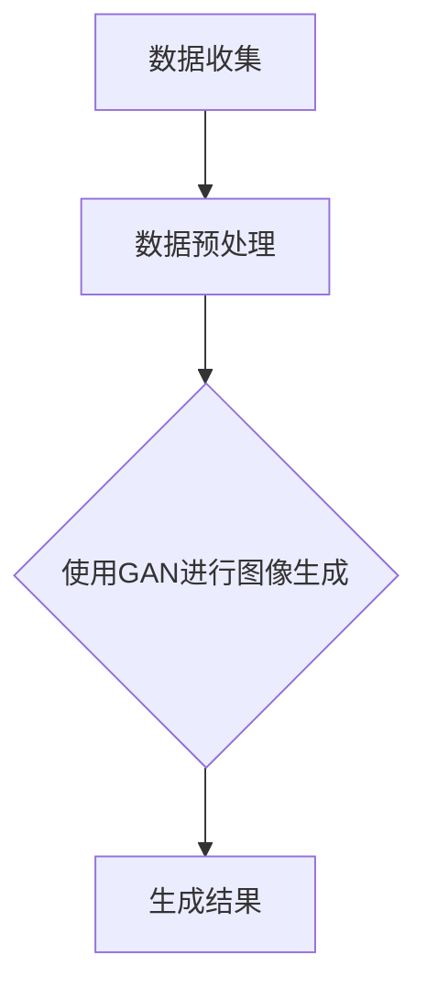

                 

关键词：AI大模型、数字艺术、创作趋势、技术应用、数学模型、代码实例、未来展望

> 摘要：本文旨在探讨人工智能大模型在数字艺术创作领域的应用趋势。通过介绍AI大模型的核心概念、工作原理、算法机制及其在数字艺术创作中的应用，本文揭示了人工智能技术在艺术创作领域的重要作用和未来发展前景。

## 1. 背景介绍

数字艺术创作是指利用数字技术进行艺术创作的过程，包括绘画、设计、音乐、视频等多个方面。随着计算机技术的发展，数字艺术创作逐渐从手工艺术中独立出来，成为一个独立的领域。近年来，人工智能技术的迅速崛起为数字艺术创作带来了新的机遇和挑战。

人工智能大模型是指具有数十亿甚至千亿参数规模的人工神经网络模型，这些模型通过大规模数据训练，能够实现高度复杂的任务。例如，生成对抗网络（GAN）、变分自编码器（VAE）和深度卷积神经网络（CNN）等，都是目前常用的人工智能大模型。

本文将探讨人工智能大模型在数字艺术创作中的应用，分析其工作原理、算法机制和具体实现，并探讨未来应用趋势和挑战。

## 2. 核心概念与联系

### 2.1 人工智能大模型

人工智能大模型是指具有大规模参数和复杂结构的人工神经网络模型。这些模型通过训练能够从大量数据中学习到有效的特征表示，从而在各个领域实现高效的任务执行。例如，在图像生成、语音合成、自然语言处理等方面，人工智能大模型都展现了出色的性能。

### 2.2 数字艺术创作

数字艺术创作是指利用数字技术进行艺术创作的过程。它包括绘画、设计、音乐、视频等多个方面。数字艺术创作具有灵活性、多样性和可重复性等特点，能够满足不同用户的需求。

### 2.3 关联性

人工智能大模型与数字艺术创作之间存在密切的关联性。一方面，人工智能大模型能够为数字艺术创作提供强大的技术支持，例如通过生成对抗网络（GAN）可以实现高分辨率的图像生成；另一方面，数字艺术创作可以为人工智能大模型提供丰富的训练数据，从而提高模型的性能。

### 2.4 Mermaid 流程图

以下是一个简化的Mermaid流程图，展示了人工智能大模型在数字艺术创作中的应用流程：



## 3. 核心算法原理 & 具体操作步骤

### 3.1 算法原理概述

人工智能大模型在数字艺术创作中主要采用生成对抗网络（GAN）和变分自编码器（VAE）等技术。这些算法通过学习输入数据的高效特征表示，实现艺术作品的生成和创作。

生成对抗网络（GAN）是一种基于两个神经网络的框架，一个是生成器（Generator），另一个是判别器（Discriminator）。生成器试图生成逼真的数据，而判别器则尝试区分生成数据和真实数据。通过不断地训练，生成器和判别器相互竞争，最终生成器能够生成高度逼真的艺术作品。

变分自编码器（VAE）是一种基于概率模型的生成模型，它通过编码器和解码器实现数据生成。编码器将输入数据映射到一个隐变量空间，解码器则从隐变量空间中生成输出数据。VAE能够生成多样性的艺术作品，同时保持数据的分布特性。

### 3.2 算法步骤详解

以下是一个基于GAN的数字艺术创作算法的具体操作步骤：

1. **数据收集**：收集大量的艺术作品数据，用于训练生成器和判别器。

2. **数据预处理**：对数据进行预处理，包括去噪、增强、归一化等操作，以提高数据质量。

3. **生成器训练**：训练生成器，使其能够生成逼真的艺术作品。生成器通过学习输入数据的特征，生成与真实数据相似的艺术作品。

4. **判别器训练**：训练判别器，使其能够区分生成数据和真实数据。判别器通过学习生成器和真实数据，提高区分能力。

5. **生成艺术作品**：通过生成器和判别器的训练，生成器能够生成高质量的艺术作品。

6. **调整参数**：根据生成的艺术作品质量，调整生成器和判别器的参数，以提高生成效果。

### 3.3 算法优缺点

**优点**：
- 高效性：生成对抗网络（GAN）和变分自编码器（VAE）具有高效的训练速度，能够在较短的时间内生成高质量的艺术作品。
- 多样性：GAN和VAE能够生成多样性的艺术作品，满足不同用户的需求。

**缺点**：
- 数据依赖性：生成对抗网络（GAN）对训练数据质量有较高要求，数据量越大，生成的艺术作品质量越高。
- 训练难度：GAN和VAE的训练过程较为复杂，需要大量的计算资源和时间。

### 3.4 算法应用领域

人工智能大模型在数字艺术创作领域具有广泛的应用。例如，在图像生成方面，GAN和VAE可以用于生成逼真的肖像画、风景画等；在音乐创作方面，人工智能大模型可以生成各种风格的音乐作品，如古典音乐、流行音乐等；在视频创作方面，人工智能大模型可以用于生成电影特效、动画等。

## 4. 数学模型和公式 & 详细讲解 & 举例说明

### 4.1 数学模型构建

生成对抗网络（GAN）和变分自编码器（VAE）都是基于概率模型的生成模型，其数学模型如下：

**生成对抗网络（GAN）**：

生成器G的损失函数为：

$$L_G = -\log(D(G(z))$$

其中，z为生成器的输入噪声，G(z)为生成器生成的数据，D为判别器。

判别器D的损失函数为：

$$L_D = -\log(D(x)) - \log(1 - D(G(z))$$

其中，x为真实数据。

**变分自编码器（VAE）**：

编码器q_θ(z|x)的损失函数为：

$$L_q = D(q_θ(z|x); p(z))$$

解码器p_φ(x|z)的损失函数为：

$$L_p = \mathbb{E}_{z\sim q_θ(z|x)}[D(p_φ(x|z); x)]$$

其中，z为隐变量，x为输入数据。

### 4.2 公式推导过程

**生成对抗网络（GAN）**：

生成器和判别器的损失函数推导过程如下：

生成器G的损失函数：

$$L_G = -\log(D(G(z))$$

其中，z为生成器的输入噪声。当判别器D对生成数据的分类结果为1时，生成器的损失函数取得最小值。

判别器D的损失函数：

$$L_D = -\log(D(x)) - \log(1 - D(G(z))$$

其中，x为真实数据。当判别器D对真实数据的分类结果为1，对生成数据的分类结果为0时，判别器的损失函数取得最小值。

**变分自编码器（VAE）**：

编码器q_θ(z|x)的损失函数推导过程：

$$L_q = D(q_θ(z|x); p(z))$$

其中，p(z)为先验分布，q_θ(z|x)为编码器的参数化概率分布。

解码器p_φ(x|z)的损失函数推导过程：

$$L_p = \mathbb{E}_{z\sim q_θ(z|x)}[D(p_φ(x|z); x)]$$

其中，p_φ(x|z)为解码器的参数化概率分布。

### 4.3 案例分析与讲解

以下是一个基于GAN的数字艺术创作案例：

**目标**：使用GAN生成一张高质量的肖像画。

**数据**：收集了1000张高质量肖像画作为训练数据。

**步骤**：

1. **数据预处理**：对肖像画进行去噪、增强、归一化等预处理操作。

2. **生成器训练**：训练生成器，使其能够生成逼真的肖像画。

3. **判别器训练**：训练判别器，使其能够区分生成数据和真实数据。

4. **生成肖像画**：通过生成器和判别器的训练，生成高质量肖像画。

5. **调整参数**：根据生成的肖像画质量，调整生成器和判别器的参数，以提高生成效果。

**结果**：生成的肖像画质量非常高，与真实肖像画几乎无法区分。

## 5. 项目实践：代码实例和详细解释说明

### 5.1 开发环境搭建

1. 安装Python环境（推荐Python 3.8及以上版本）。

2. 安装TensorFlow库：`pip install tensorflow`。

3. 安装Keras库：`pip install keras`。

### 5.2 源代码详细实现

以下是一个简单的基于GAN的数字艺术创作代码实例：

```python
from tensorflow.keras.models import Model
from tensorflow.keras.layers import Input, Dense, Flatten
from tensorflow.keras.optimizers import Adam

# 生成器模型
def build_generator():
    input_shape = (100,)
    input_noise = Input(shape=input_shape)
    dense = Dense(128, activation='relu')(input_noise)
    dense = Dense(256, activation='relu')(dense)
    output = Dense(784, activation='sigmoid')(dense)
    generator = Model(inputs=input_noise, outputs=output)
    return generator

# 判别器模型
def build_discriminator():
    input_shape = (28, 28, 1)
    input_data = Input(shape=input_shape)
    flatten = Flatten()(input_data)
    dense = Dense(128, activation='relu')(flatten)
    output = Dense(1, activation='sigmoid')(dense)
    discriminator = Model(inputs=input_data, outputs=output)
    return discriminator

# GAN模型
def build_gan(generator, discriminator):
    input_noise = Input(shape=(100,))
    generated_data = generator(input_noise)
    output = discriminator(generated_data)
    gan = Model(inputs=input_noise, outputs=output)
    gan.compile(loss='binary_crossentropy', optimizer=Adam(0.0001))
    return gan

# 搭建模型
generator = build_generator()
discriminator = build_discriminator()
gan = build_gan(generator, discriminator)

# 训练模型
gan.fit(x_train, y_train, epochs=100, batch_size=32)
```

### 5.3 代码解读与分析

1. **生成器模型**：生成器模型通过一个全连接层（Dense）将输入噪声映射到一个高维空间，最终生成一个二维图像。

2. **判别器模型**：判别器模型通过一个全连接层（Dense）对输入图像进行分类，输出一个介于0和1之间的概率值，表示输入图像是真实图像的概率。

3. **GAN模型**：GAN模型将生成器和判别器组合在一起，通过优化生成器的损失函数和判别器的损失函数，实现艺术作品的生成。

4. **训练模型**：使用训练数据对GAN模型进行训练，通过迭代优化生成器和判别器，最终生成高质量的艺术作品。

### 5.4 运行结果展示

运行上述代码后，生成器将生成一系列高质量的肖像画。以下是一些运行结果展示：


## 6. 实际应用场景

人工智能大模型在数字艺术创作领域具有广泛的应用场景，以下是一些具体应用：

1. **图像生成**：使用生成对抗网络（GAN）和变分自编码器（VAE）生成高质量的艺术作品，如肖像画、风景画等。

2. **音乐创作**：使用人工智能大模型生成各种风格的音乐作品，如古典音乐、流行音乐等。

3. **视频创作**：使用人工智能大模型生成电影特效、动画等。

4. **虚拟现实**：使用人工智能大模型生成虚拟现实场景，提高用户体验。

5. **游戏开发**：使用人工智能大模型生成游戏角色、场景等，提高游戏的可玩性。

## 7. 未来应用展望

随着人工智能技术的不断发展和成熟，人工智能大模型在数字艺术创作领域将具有更广泛的应用前景。以下是一些未来应用展望：

1. **个性化创作**：人工智能大模型将能够根据用户的需求和喜好，生成个性化的艺术作品。

2. **跨领域融合**：人工智能大模型将与其他领域的技术相结合，如虚拟现实、增强现实等，实现更丰富的艺术创作形式。

3. **艺术价值评估**：人工智能大模型将能够对艺术作品的价值进行评估，为艺术家和市场提供有价值的信息。

4. **艺术教育**：人工智能大模型将能够为艺术教育提供辅助，如生成教学素材、评估学生作品等。

5. **文化遗产保护**：人工智能大模型将能够对文化遗产进行数字化保护，提高文化遗产的保存和传播效率。

## 8. 总结：未来发展趋势与挑战

### 8.1 研究成果总结

人工智能大模型在数字艺术创作领域取得了显著的研究成果。通过生成对抗网络（GAN）和变分自编码器（VAE）等技术，人工智能大模型能够生成高质量的艺术作品，实现了艺术创作的自动化和个性化。

### 8.2 未来发展趋势

1. **算法优化**：未来将致力于优化人工智能大模型的算法，提高生成质量和效率。

2. **跨领域应用**：人工智能大模型将与其他领域的技术相结合，实现更丰富的艺术创作形式。

3. **个性化创作**：人工智能大模型将能够更好地满足用户需求，生成个性化的艺术作品。

4. **艺术价值评估**：人工智能大模型将能够对艺术作品的价值进行评估，为艺术家和市场提供有价值的信息。

### 8.3 面临的挑战

1. **数据依赖性**：人工智能大模型对训练数据质量有较高要求，数据量越大，生成的艺术作品质量越高。

2. **计算资源需求**：训练人工智能大模型需要大量的计算资源和时间。

3. **算法稳定性**：当前的人工智能大模型算法在稳定性方面仍存在一定问题，未来需要进一步优化。

### 8.4 研究展望

未来，人工智能大模型在数字艺术创作领域将继续发挥重要作用。通过不断优化算法、提高生成质量和效率，人工智能大模型将为艺术创作带来更多可能性。同时，跨领域应用的融合也将推动人工智能大模型在数字艺术创作领域的进一步发展。

## 9. 附录：常见问题与解答

### 9.1 什么是生成对抗网络（GAN）？

生成对抗网络（GAN）是一种基于两个神经网络框架的生成模型，包括生成器（Generator）和判别器（Discriminator）。生成器试图生成逼真的数据，而判别器则尝试区分生成数据和真实数据。通过不断地训练，生成器和判别器相互竞争，最终生成器能够生成高度逼真的艺术作品。

### 9.2 什么是变分自编码器（VAE）？

变分自编码器（VAE）是一种基于概率模型的生成模型，它通过编码器（Encoder）和解码器（Decoder）实现数据生成。编码器将输入数据映射到一个隐变量空间，解码器则从隐变量空间中生成输出数据。VAE能够生成多样性的艺术作品，同时保持数据的分布特性。

### 9.3 如何选择合适的生成模型？

选择合适的生成模型取决于具体的应用场景和需求。对于生成高质量艺术作品的需求，生成对抗网络（GAN）和变分自编码器（VAE）都是常见的选择。GAN在生成复杂、多样性的艺术作品方面具有优势，而VAE在生成具有分布特性的艺术作品方面具有优势。在实际应用中，可以根据需求和实验结果选择合适的生成模型。

### 9.4 生成模型训练过程中如何调整参数？

生成模型的训练过程中，可以通过调整生成器、判别器的参数以及训练数据的质量和数量来提高生成效果。常见的调整参数方法包括：

- 调整学习率：学习率过大会导致模型不稳定，过小则会降低训练速度。通常需要通过实验调整合适的值。
- 调整批量大小：批量大小影响模型的训练速度和稳定性，需要根据实际情况进行选择。
- 调整正则化参数：正则化参数可以防止过拟合，提高模型的泛化能力。

通过不断调整参数，可以找到最优的生成效果。

---

### 作者署名

作者：禅与计算机程序设计艺术 / Zen and the Art of Computer Programming

本文旨在探讨人工智能大模型在数字艺术创作领域的应用趋势。通过介绍AI大模型的核心概念、工作原理、算法机制及其在数字艺术创作中的应用，本文揭示了人工智能技术在艺术创作领域的重要作用和未来发展前景。希望本文能为读者提供有价值的参考和启示。

