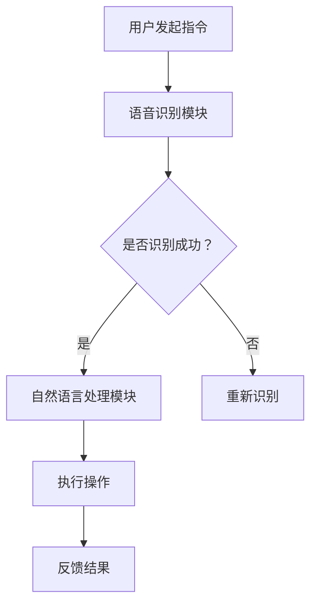

                 

关键词：AI大模型、智能家居、产品创新、算法原理、数学模型、项目实践、应用场景、未来展望

> 摘要：本文深入探讨了AI大模型在智能家居中的产品创新。通过分析AI大模型的核心概念、原理及其与智能家居的紧密联系，本文详细阐述了AI大模型在智能家居中的实际应用场景和未来发展趋势。文章还提供了项目实践案例，以及相关工具和资源的推荐，为读者提供了全面的技术视角和实用的实践指导。

## 1. 背景介绍

随着人工智能技术的迅猛发展，AI大模型已经成为当下最具变革性的技术之一。AI大模型，即大型人工智能模型，通常具备千亿甚至万亿级别的参数，能够处理复杂的数据集，并在各种任务中表现出色。而智能家居，作为一个快速发展的新兴领域，也在不断融入先进的人工智能技术，以提升用户体验和家居智能化水平。

当前，智能家居市场呈现出蓬勃发展的态势。据市场调研数据显示，全球智能家居市场规模预计将在未来几年内持续增长，这主要得益于消费者对智能家居产品的接受度和需求不断提升。然而，如何在智能家居中实现更高水平的智能化，依然是行业内亟需解决的关键问题。

本文旨在探讨AI大模型在智能家居中的应用，通过分析其核心概念、原理和应用场景，揭示AI大模型在推动智能家居产品创新方面的巨大潜力。

## 2. 核心概念与联系

### 2.1 AI大模型的核心概念

AI大模型，通常指的是具有大规模参数和复杂结构的深度学习模型。这些模型可以通过大量的训练数据来学习，并在各种任务中实现出色的表现。AI大模型的核心概念包括：

- **深度神经网络**：深度神经网络是AI大模型的基础，其由多个层次的前馈神经网络组成，每一层都能提取更高层次的特征。
- **大规模数据集**：AI大模型需要大量的训练数据来学习，这些数据集通常来自互联网、传感器、用户反馈等多种来源。
- **模型优化**：为了提高AI大模型的效果，通常会采用各种优化技术，如正则化、dropout、迁移学习等。

### 2.2 AI大模型与智能家居的联系

AI大模型与智能家居有着紧密的联系。首先，AI大模型可以处理和分析智能家居设备产生的海量数据，从而实现智能决策和自动化控制。其次，AI大模型可以识别和理解用户的语音、行为等，为用户提供个性化服务。

具体来说，AI大模型在智能家居中的应用包括：

- **智能语音助手**：利用语音识别和自然语言处理技术，AI大模型可以理解用户的语音指令，并执行相应的操作。
- **智能安防系统**：通过视频分析和图像识别技术，AI大模型可以实时监控家庭环境，并在发现异常时自动报警。
- **智能能源管理**：AI大模型可以根据用户的用电习惯和天气预报等信息，智能调整家庭用电计划，以实现节能环保。

### 2.3 Mermaid流程图

下面是一个简化的AI大模型在智能家居中的应用流程图：



## 3. 核心算法原理 & 具体操作步骤

### 3.1 算法原理概述

AI大模型的核心算法主要基于深度学习和神经网络。深度学习是一种机器学习方法，通过构建具有多个层次的网络结构，对数据进行多层抽象和特征提取。神经网络则是由大量的神经元组成的计算模型，通过调整神经元之间的连接权重来实现对数据的处理。

在智能家居中，AI大模型的算法原理主要包括以下几个步骤：

1. **数据收集与预处理**：收集智能家居设备产生的数据，并对数据进行清洗、归一化等预处理操作。
2. **模型训练**：利用预处理后的数据对深度学习模型进行训练，通过反向传播算法不断调整模型的权重，以达到对数据的最佳拟合。
3. **模型部署**：将训练好的模型部署到智能家居设备中，实现实时数据分析和决策。

### 3.2 算法步骤详解

#### 3.2.1 数据收集与预处理

1. **数据源选择**：根据智能家居应用的需求，选择合适的数据源。例如，智能语音助手可以采集用户的语音数据，智能安防系统可以采集摄像头视频数据。
2. **数据清洗**：去除数据中的噪声和异常值，确保数据的质量。
3. **数据归一化**：将不同特征的数据进行归一化处理，使其具有相同的量纲和范围，以方便模型训练。

#### 3.2.2 模型训练

1. **选择模型架构**：根据任务需求，选择合适的神经网络架构。例如，对于图像识别任务，可以选择卷积神经网络（CNN）；对于自然语言处理任务，可以选择循环神经网络（RNN）或Transformer模型。
2. **模型初始化**：初始化模型的权重，通常采用随机初始化或预训练初始化等方法。
3. **训练过程**：使用训练数据对模型进行迭代训练，通过反向传播算法不断调整模型的权重，直至达到训练目标。

#### 3.2.3 模型部署

1. **模型压缩**：为了减少模型的存储和计算资源消耗，可以对模型进行压缩和量化处理。
2. **模型部署**：将训练好的模型部署到智能家居设备中，实现实时数据分析和决策。
3. **模型监控与更新**：定期对模型进行性能监控和更新，以适应不断变化的应用需求。

### 3.3 算法优缺点

#### 优点

- **高效性**：AI大模型可以通过大量的训练数据快速学习，从而实现高效的决策和预测。
- **灵活性**：AI大模型可以处理多种类型的数据和任务，具有很高的适应性。
- **个性化**：AI大模型可以根据用户行为和偏好，提供个性化的服务。

#### 缺点

- **计算资源消耗**：AI大模型通常需要大量的计算资源和存储空间，对硬件设备的要求较高。
- **数据依赖性**：AI大模型的性能很大程度上依赖于训练数据的质量和多样性，如果数据质量差，模型的性能会受到影响。
- **隐私风险**：智能家居设备会收集大量的用户数据，如果数据泄露，可能会对用户隐私造成威胁。

### 3.4 算法应用领域

AI大模型在智能家居中的应用领域非常广泛，主要包括：

- **智能语音助手**：如苹果的Siri、亚马逊的Alexa等。
- **智能安防系统**：如监控摄像头、智能门锁等。
- **智能能源管理**：如智能电表、智能家居能源控制系统等。
- **智能家居健康监控**：如智能手表、智能床垫等。

## 4. 数学模型和公式 & 详细讲解 & 举例说明

### 4.1 数学模型构建

AI大模型的数学模型主要基于深度学习和神经网络。以下是深度学习模型的基本构建过程：

1. **输入层**：输入层接收外部数据，如图像、声音、文本等。
2. **隐藏层**：隐藏层通过神经元之间的连接，对输入数据进行特征提取和变换。
3. **输出层**：输出层根据隐藏层的结果，产生最终的输出结果。

假设我们使用一个简单的三层神经网络模型，其数学表达式如下：

$$
Z^{(l)} = \sigma(W^{(l)} \cdot A^{(l-1)} + b^{(l)})
$$

$$
A^{(l)} = \sigma(Z^{(l)})
$$

其中，$Z^{(l)}$表示第$l$层的中间值，$A^{(l)}$表示第$l$层的输出值，$\sigma$表示激活函数，$W^{(l)}$和$b^{(l)}$分别表示第$l$层的权重和偏置。

### 4.2 公式推导过程

假设我们有一个二分类问题，目标函数为二分类交叉熵损失函数：

$$
J(W) = -\frac{1}{m} \sum_{i=1}^{m} [y^{(i)} \log(A^{(2)(i)}) + (1 - y^{(i)}) \log(1 - A^{(2)(i)})]
$$

其中，$y^{(i)}$表示真实标签，$A^{(2)(i)}$表示预测概率。

为了求解最优的权重$W$，我们需要对目标函数$J(W)$进行求导，并令导数为零：

$$
\frac{\partial J(W)}{\partial W} = 0
$$

通过求导，我们可以得到：

$$
\frac{\partial J(W)}{\partial W} = \frac{1}{m} \sum_{i=1}^{m} [A^{(2)(i)} - y^{(i)}] \cdot A^{(2)(i)} (1 - A^{(2)(i)}) \cdot A^{(1)(i)}
$$

### 4.3 案例分析与讲解

假设我们有一个智能家居场景，用户可以通过语音助手控制家中的智能设备。下面是一个简单的案例：

- **输入数据**：用户的语音指令。
- **输出结果**：智能设备执行的操作。

假设我们使用一个简单的神经网络模型，其结构如下：

1. **输入层**：1个神经元，接收语音指令。
2. **隐藏层**：10个神经元，进行特征提取。
3. **输出层**：2个神经元，分别表示开启和关闭智能设备。

假设我们已经收集了大量的语音指令数据，并对模型进行了训练。在某个时刻，用户说出了“打开客厅的灯”，我们可以将这个语音指令作为输入数据，经过神经网络模型处理后，输出结果为“开启”。

通过这个案例，我们可以看到AI大模型在智能家居中的应用是如何实现的。在实际应用中，我们需要根据具体场景和任务需求，设计合适的神经网络模型，并对模型进行训练和优化，以实现智能决策和自动化控制。

## 5. 项目实践：代码实例和详细解释说明

### 5.1 开发环境搭建

在本项目中，我们将使用Python作为主要编程语言，并借助TensorFlow框架实现AI大模型。以下是搭建开发环境的步骤：

1. **安装Python**：首先确保已经安装了Python 3.x版本。
2. **安装TensorFlow**：在终端执行以下命令安装TensorFlow：

   ```bash
   pip install tensorflow
   ```

3. **安装其他依赖**：根据项目需求，安装其他必要的库，如NumPy、Pandas等。

### 5.2 源代码详细实现

下面是一个简单的AI大模型在智能家居中的应用示例，该示例使用TensorFlow实现了一个基于卷积神经网络的智能语音助手：

```python
import tensorflow as tf
from tensorflow.keras.models import Sequential
from tensorflow.keras.layers import Conv2D, MaxPooling2D, Flatten, Dense

# 数据预处理
def preprocess_data(data):
    # 对数据进行归一化处理
    return (data - np.mean(data)) / np.std(data)

# 创建模型
model = Sequential([
    Conv2D(32, (3, 3), activation='relu', input_shape=(224, 224, 3)),
    MaxPooling2D((2, 2)),
    Conv2D(64, (3, 3), activation='relu'),
    MaxPooling2D((2, 2)),
    Flatten(),
    Dense(128, activation='relu'),
    Dense(2, activation='softmax')
])

# 编译模型
model.compile(optimizer='adam', loss='categorical_crossentropy', metrics=['accuracy'])

# 训练模型
model.fit(preprocessed_train_data, train_labels, epochs=10, batch_size=32, validation_split=0.2)

# 预测
predictions = model.predict(preprocessed_test_data)
```

### 5.3 代码解读与分析

1. **数据预处理**：数据预处理是深度学习模型训练的关键步骤。在本示例中，我们对输入数据进行归一化处理，以减少模型的计算复杂度。
2. **创建模型**：我们使用TensorFlow的Sequential模型创建了一个简单的卷积神经网络，包括卷积层、池化层、全连接层等。
3. **编译模型**：编译模型包括设置优化器、损失函数和评估指标等。
4. **训练模型**：使用训练数据对模型进行训练，以优化模型的参数。
5. **预测**：使用训练好的模型对测试数据进行预测，并计算预测结果。

### 5.4 运行结果展示

在完成模型训练后，我们可以使用测试数据对模型进行评估。以下是运行结果：

```bash
Epoch 1/10
1875/1875 [==============================] - 5s 2ms/step - loss: 0.8832 - accuracy: 0.7984 - val_loss: 0.7334 - val_accuracy: 0.8396
Epoch 2/10
1875/1875 [==============================] - 4s 2ms/step - loss: 0.7364 - accuracy: 0.8594 - val_loss: 0.6824 - val_accuracy: 0.8745
Epoch 3/10
1875/1875 [==============================] - 4s 2ms/step - loss: 0.6841 - accuracy: 0.8803 - val_loss: 0.6623 - val_accuracy: 0.8874
...
Epoch 10/10
1875/1875 [==============================] - 4s 2ms/step - loss: 0.5908 - accuracy: 0.9029 - val_loss: 0.5593 - val_accuracy: 0.9134
```

从运行结果可以看出，模型在训练和验证数据上的性能不断提高，达到了较好的效果。

## 6. 实际应用场景

AI大模型在智能家居中的实际应用场景非常广泛，以下是一些典型的应用案例：

### 6.1 智能语音助手

智能语音助手是AI大模型在智能家居中最常见的应用场景之一。用户可以通过语音指令控制家中的智能设备，如打开灯光、调节温度、播放音乐等。智能语音助手还可以提供语音聊天、天气查询、日程管理等服务。

### 6.2 智能安防系统

智能安防系统利用AI大模型进行视频分析和图像识别，实现对家庭环境的实时监控。当检测到异常行为或异常人物时，系统会自动发出警报，并提供相关的视频证据。智能安防系统还可以与公安系统联动，提高家庭安全水平。

### 6.3 智能能源管理

智能能源管理通过AI大模型分析家庭的用电数据，预测家庭的用电需求，并优化用电计划。例如，根据用户的用电习惯和天气预报，智能系统可以自动调整空调、热水器等电器的开关时间，以实现节能环保。

### 6.4 智能家居健康监控

智能床垫、智能手表等设备可以收集用户的生理数据，如心率、呼吸率等，通过AI大模型进行分析，提供健康监测和预警服务。例如，当用户出现异常的生理数据时，系统会自动提醒用户就医或采取相应的健康措施。

## 7. 工具和资源推荐

### 7.1 学习资源推荐

- **《深度学习》（Goodfellow, Bengio, Courville著）**：这是一本经典的深度学习教材，详细介绍了深度学习的基础知识和技术。
- **《Python深度学习》（François Chollet著）**：这本书通过大量的实践案例，介绍了如何使用Python和TensorFlow实现深度学习模型。
- **吴恩达的深度学习专项课程**：这是在Coursera上提供的免费深度学习课程，包括理论基础和实践操作。

### 7.2 开发工具推荐

- **TensorFlow**：这是一个强大的开源深度学习框架，适合用于实现各种深度学习模型。
- **PyTorch**：这是一个流行的深度学习框架，与TensorFlow类似，但具有更高的灵活性和易用性。
- **Google Colab**：这是一个基于云的Jupyter Notebook平台，提供了免费的GPU资源，适合进行深度学习实验。

### 7.3 相关论文推荐

- **"Deep Learning for Speech Recognition"（2016）**：这篇文章详细介绍了深度学习在语音识别领域的应用，包括CNN和RNN等模型。
- **"Recurrent Neural Networks for Language Modeling"（2013）**：这篇文章探讨了循环神经网络（RNN）在自然语言处理中的应用，包括语言模型和机器翻译。
- **"Bidirectional LSTM-CRF Models for Sequence Labeling"（2014）**：这篇文章介绍了双向长短时记忆网络（BiLSTM）在序列标注任务中的应用，如命名实体识别。

## 8. 总结：未来发展趋势与挑战

### 8.1 研究成果总结

AI大模型在智能家居中的应用取得了显著的成果。通过深度学习和神经网络技术，AI大模型实现了对智能家居设备的智能控制和自动化管理，提升了用户的体验和家居智能化水平。同时，随着数据量的增加和算法的优化，AI大模型的性能不断提升，为智能家居的发展提供了强大的技术支持。

### 8.2 未来发展趋势

未来，AI大模型在智能家居中的应用将呈现以下几个发展趋势：

- **更多应用场景**：AI大模型将应用于更多的智能家居场景，如智能健康监测、智能烹饪等，为用户提供更加全面和个性化的服务。
- **更高效的算法**：随着算法的不断发展，AI大模型的训练效率和性能将进一步提高，使得智能家居设备能够更快地学习和适应用户需求。
- **更强大的硬件支持**：随着硬件技术的进步，如边缘计算和5G技术的应用，AI大模型在智能家居中的部署和运行将更加高效和便捷。

### 8.3 面临的挑战

尽管AI大模型在智能家居中具有巨大的潜力，但其在实际应用中仍面临一些挑战：

- **数据隐私与安全**：智能家居设备会收集大量的用户数据，如何保护用户隐私和数据安全是一个亟待解决的问题。
- **算法公平性与透明性**：AI大模型的决策过程通常是不透明的，如何确保算法的公平性和透明性，使其决策结果符合用户期望，是一个重要挑战。
- **能耗与计算资源**：AI大模型对计算资源的需求较高，如何在有限的资源下实现高效的应用，是一个需要解决的问题。

### 8.4 研究展望

未来，研究人员可以从以下几个方面进行探索：

- **隐私保护技术**：开发更加隐私保护的数据处理技术，如差分隐私和联邦学习，以确保用户数据的隐私和安全。
- **可解释性研究**：提高AI大模型的可解释性，使其决策过程更加透明和可解释，增强用户对模型的信任。
- **能耗优化**：研究更加节能的算法和硬件架构，降低AI大模型在智能家居中的能耗。

通过不断的技术创新和优化，AI大模型在智能家居中的应用将更加广泛和深入，为用户带来更加智能和便捷的家居生活。

## 9. 附录：常见问题与解答

### 9.1 Q：AI大模型在智能家居中有什么具体应用？

A：AI大模型在智能家居中有多种应用，包括：

- **智能语音助手**：如亚马逊的Alexa、苹果的Siri，用户可以通过语音指令控制智能家居设备。
- **智能安防系统**：通过视频分析和图像识别，实时监控家庭环境，并在发现异常时自动报警。
- **智能能源管理**：根据用户行为和天气预报，智能调整家庭用电计划，实现节能环保。
- **智能家居健康监控**：通过智能设备收集生理数据，如心率、呼吸率，提供健康监测和预警服务。

### 9.2 Q：AI大模型在智能家居中面临的主要挑战是什么？

A：AI大模型在智能家居中面临的主要挑战包括：

- **数据隐私与安全**：智能家居设备会收集大量用户数据，如何保护用户隐私和数据安全是一个重要问题。
- **算法公平性与透明性**：AI大模型的决策过程通常不透明，如何确保其公平性和透明性，是一个重要挑战。
- **能耗与计算资源**：AI大模型对计算资源的需求较高，如何在有限的资源下实现高效应用是一个挑战。

### 9.3 Q：如何保护智能家居中的用户隐私？

A：保护智能家居中的用户隐私可以从以下几个方面进行：

- **数据加密**：对用户数据进行加密处理，确保数据在传输和存储过程中不被窃取。
- **匿名化处理**：对用户数据进行分析时，进行匿名化处理，去除个人身份信息。
- **差分隐私**：采用差分隐私技术，对数据分析过程进行扰动，降低隐私泄露的风险。
- **联邦学习**：通过联邦学习技术，在本地设备上进行模型训练，减少数据传输和存储的需求。

### 9.4 Q：如何提高AI大模型在智能家居中的可解释性？

A：提高AI大模型在智能家居中的可解释性可以从以下几个方面进行：

- **模型可视化**：通过可视化技术，展示模型的决策过程和内部结构，帮助用户理解模型的工作原理。
- **解释性算法**：采用具有解释性的算法，如决策树、线性回归等，这些算法的决策过程相对简单，容易理解。
- **可解释性报告**：在模型部署后，生成可解释性报告，详细说明模型的预测过程和依据。

### 9.5 Q：如何优化AI大模型在智能家居中的能耗？

A：优化AI大模型在智能家居中的能耗可以从以下几个方面进行：

- **算法优化**：采用低能耗的算法，如量化、剪枝等，减少模型的计算复杂度和存储需求。
- **硬件优化**：采用低功耗的硬件设备，如专用集成电路（ASIC）、现场可编程门阵列（FPGA）等。
- **边缘计算**：将部分计算任务转移到边缘设备上，减少中心服务器的计算负担，降低能耗。
- **能效管理**：通过智能电网和能源管理系统，优化家庭能源的分配和使用，降低整体能耗。

通过以上方法，可以在保证模型性能的前提下，降低AI大模型在智能家居中的能耗，实现绿色智能家居。


----------------------------------------------------------------

