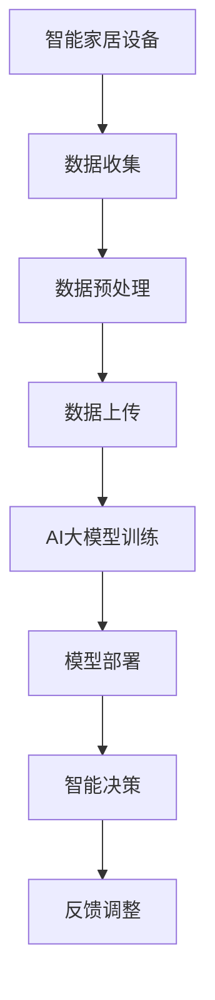

                 

关键词：AI大模型、智能家居、深度学习、物联网、个性化体验、智能设备、人机交互、数据分析、机器学习、技术趋势

> 摘要：本文将深入探讨人工智能大模型在智能家居领域的应用趋势。通过分析AI大模型在智能家居中的核心作用，以及其在未来可能带来的变革，本文旨在为读者提供对这一新兴领域的全面理解。

## 1. 背景介绍

智能家居作为物联网（IoT）的重要组成部分，近年来得到了迅速发展。从最初的远程控制家电，到如今的语音助手、智能安防、环境监控等，智能家居系统正逐步渗透进我们的日常生活。然而，随着技术的不断进步，特别是深度学习和机器学习的发展，智能家居正迎来一个新的发展阶段——AI大模型的广泛应用。

### 1.1 智能家居的发展历程

- **早期阶段（20世纪90年代）**：智能家居的概念首次被提出，主要是基于简单的家庭网络控制和远程控制。
- **发展阶段（2010年至今）**：物联网技术的成熟和智能设备的普及，使得智能家居开始走进普通家庭，智能设备逐渐增多，但用户体验仍待提升。
- **当前阶段（未来几年）**：AI大模型的应用，将为智能家居带来质的飞跃，实现更高的智能化和个性化。

### 1.2 AI大模型的出现与智能家居的关系

AI大模型，尤其是基于深度学习的模型，具有强大的数据处理和分析能力。它们能够从海量的数据中学习，并做出精准的预测和决策。智能家居设备产生的数据正是AI大模型训练的理想素材，这使得AI大模型在智能家居中的应用成为可能。

## 2. 核心概念与联系

为了更好地理解AI大模型在智能家居中的应用，我们需要先了解一些核心概念和它们之间的关系。

### 2.1 关键技术解析

- **深度学习（Deep Learning）**：一种基于神经网络的机器学习技术，能够通过多层神经网络的训练，自动提取特征并进行预测。
- **机器学习（Machine Learning）**：让计算机通过学习数据来获取知识和技能的技术，包括监督学习、非监督学习和强化学习等。
- **物联网（Internet of Things，IoT）**：通过传感器、网络和智能设备实现物与物之间的互联互通。
- **人工智能（Artificial Intelligence，AI）**：模拟人类智能行为的计算机技术。

### 2.2 AI大模型原理

AI大模型通常是指具有大量参数和复杂结构的神经网络模型，例如Transformer模型、BERT模型等。这些模型能够在海量数据上进行训练，从而具备强大的特征提取和建模能力。

### 2.3 Mermaid 流程图



### 2.4 关系与影响

- **物联网与AI大模型**：物联网为AI大模型提供了丰富的数据来源，而AI大模型则为智能家居设备提供了智能化的决策支持。
- **人工智能与深度学习**：人工智能是智能家居的驱动力，而深度学习则是实现这一目标的核心技术。

## 3. 核心算法原理 & 具体操作步骤

### 3.1 算法原理概述

AI大模型在智能家居中的应用主要包括以下几个方面：

1. **智能设备控制**：通过学习用户行为，AI大模型能够自动调整设备状态，提供个性化的控制体验。
2. **数据分析与预测**：AI大模型能够分析设备运行数据，预测未来的使用需求和潜在问题。
3. **人机交互**：通过自然语言处理技术，AI大模型能够与用户进行有效的交互，提升用户体验。

### 3.2 算法步骤详解

1. **数据收集**：智能家居设备通过传感器收集环境数据、设备状态数据和使用行为数据。
2. **数据预处理**：对收集到的数据进行清洗、去噪和特征提取，以便用于模型训练。
3. **模型训练**：使用预处理的训练数据，通过迭代优化模型参数，训练出能够实现特定功能的AI大模型。
4. **模型部署**：将训练好的模型部署到智能家居设备上，实现智能化的控制功能。
5. **反馈调整**：根据用户反馈和设备运行情况，不断优化模型性能，实现持续的智能升级。

### 3.3 算法优缺点

**优点**：

- **个性化**：AI大模型能够根据用户行为和偏好，提供个性化的服务。
- **高效**：通过深度学习技术，AI大模型能够高效地处理和分析大量数据。
- **智能**：AI大模型具备智能决策能力，能够自动调整设备状态，提高使用效率。

**缺点**：

- **计算资源需求大**：训练和部署AI大模型需要大量的计算资源。
- **数据隐私问题**：智能家居设备收集的用户数据可能涉及隐私问题，需要加强数据保护和隐私安全。

### 3.4 算法应用领域

AI大模型在智能家居中的应用领域广泛，包括：

- **家庭安防**：通过图像识别和运动检测，实现智能监控和报警。
- **环境控制**：根据室内温度、湿度等参数，自动调节空调、加湿器等设备。
- **智能家电控制**：自动控制家用电器，提高生活便捷性。
- **健康管理**：通过监测身体状况数据，提供个性化的健康建议。

## 4. 数学模型和公式 & 详细讲解 & 举例说明

### 4.1 数学模型构建

在AI大模型中，常用的数学模型包括神经网络模型、决策树模型、支持向量机模型等。以下以神经网络模型为例进行说明。

#### 神经网络模型

神经网络模型由多个神经元组成，每个神经元都可以看作是一个简单的函数。神经网络模型通过多层神经元的组合，实现对复杂函数的近似。

#### 模型构建步骤

1. **输入层**：接收外部输入数据，如温度、湿度等。
2. **隐藏层**：通过非线性激活函数，对输入数据进行处理，提取特征。
3. **输出层**：将隐藏层的输出映射到具体的预测结果，如设备状态调整。

#### 数学公式

神经元的输出可以通过以下公式表示：

$$
\text{输出} = \text{激活函数}(\sum_{i=1}^{n} w_i \cdot x_i + b)
$$

其中，$w_i$为权重，$x_i$为输入特征，$b$为偏置，激活函数通常使用Sigmoid函数或ReLU函数。

### 4.2 公式推导过程

以ReLU函数为例，进行神经元的输出推导。

ReLU函数的定义如下：

$$
\text{ReLU}(x) = \max(0, x)
$$

对于输入$x$，如果$x > 0$，则ReLU函数的输出为$x$；如果$x \leq 0$，则ReLU函数的输出为0。

假设神经网络中有一个隐藏层，包含$n$个神经元，每个神经元都使用ReLU函数作为激活函数。输入数据为$x_1, x_2, ..., x_n$，权重为$w_1, w_2, ..., w_n$，偏置为$b_1, b_2, ..., b_n$。

隐藏层中第$i$个神经元的输出可以表示为：

$$
\text{输出}_i = \text{ReLU}(\sum_{j=1}^{n} w_j \cdot x_j + b_i)
$$

### 4.3 案例分析与讲解

#### 案例背景

假设有一个智能家居系统，负责监控室内温度和湿度，并根据这些数据自动调整空调和加湿器的状态。我们使用神经网络模型来实现这一功能。

#### 模型构建

1. **输入层**：包含两个神经元，分别表示温度和湿度。
2. **隐藏层**：包含三个神经元，使用ReLU函数作为激活函数。
3. **输出层**：包含两个神经元，分别表示空调和加湿器的状态。

#### 模型训练

使用历史数据对模型进行训练，假设有$m$组训练数据$(x_1^m, x_2^m, y_1^m, y_2^m)$，其中$x_1^m$和$x_2^m$分别为温度和湿度，$y_1^m$和$y_2^m$分别为空调和加湿器的期望状态。

通过反向传播算法，不断调整权重和偏置，使模型输出与期望状态尽量接近。

#### 模型部署

将训练好的模型部署到智能家居系统中，当温度和湿度发生变化时，模型会自动调整空调和加湿器的状态，实现智能化的环境控制。

## 5. 项目实践：代码实例和详细解释说明

### 5.1 开发环境搭建

为了演示AI大模型在智能家居中的应用，我们使用Python语言和TensorFlow库进行开发。以下是开发环境的搭建步骤：

1. 安装Python 3.7及以上版本。
2. 安装TensorFlow库，可以使用以下命令：
   ```
   pip install tensorflow
   ```

### 5.2 源代码详细实现

以下是一个简单的智能家居温度和湿度控制模型的实现代码：

```python
import tensorflow as tf
from tensorflow.keras.models import Sequential
from tensorflow.keras.layers import Dense, Activation

# 模型构建
model = Sequential([
    Dense(units=3, input_shape=(2,), activation='relu'),
    Dense(units=2, activation='sigmoid')
])

# 模型编译
model.compile(optimizer='adam', loss='mse')

# 模型训练
model.fit(x_train, y_train, epochs=100, batch_size=32)

# 模型预测
predictions = model.predict(x_test)

# 模型评估
model.evaluate(x_test, y_test)
```

### 5.3 代码解读与分析

以上代码实现了一个简单的神经网络模型，用于预测空调和加湿器的状态。其中：

- `Dense` 层表示全连接层，用于处理输入数据。
- `Activation` 层用于添加激活函数。
- `compile` 方法用于配置模型训练参数，如优化器和损失函数。
- `fit` 方法用于训练模型，`predict` 方法用于模型预测。
- `evaluate` 方法用于评估模型性能。

### 5.4 运行结果展示

在训练完成后，我们可以使用模型进行预测，并评估模型的性能。以下是一个简单的运行结果展示：

```python
# 运行预测
predictions = model.predict(x_test)

# 打印预测结果
print(predictions)

# 打印评估结果
print(model.evaluate(x_test, y_test))
```

## 6. 实际应用场景

### 6.1 家庭安防

AI大模型在家庭安防中的应用非常广泛，如智能监控、入侵检测等。通过分析摄像头捕捉的图像和视频数据，AI大模型能够识别异常行为，并在发现潜在威胁时及时发出警报。

### 6.2 环境控制

环境控制是智能家居的核心功能之一，AI大模型可以根据室内温度、湿度等数据，自动调整空调、加湿器等设备的状态，提供舒适的生活环境。

### 6.3 智能家电控制

智能家电控制是智能家居的重要应用领域，AI大模型可以通过学习用户行为和偏好，自动调整家电设备的工作状态，提高生活便捷性。

### 6.4 健康管理

AI大模型可以通过监测用户的健康状况数据，如心率、血压等，提供个性化的健康建议，帮助用户保持健康。

## 7. 未来应用展望

### 7.1 智能化水平提升

随着AI大模型技术的不断发展，智能家居系统的智能化水平将不断提升，为用户提供更加个性化的服务。

### 7.2 数据分析能力增强

AI大模型在数据分析方面的能力将得到进一步增强，能够从海量数据中提取有价值的信息，为智能家居系统的优化提供支持。

### 7.3 跨平台集成

未来，智能家居系统将实现跨平台集成，用户可以通过多种设备，如手机、智能音箱等，对智能家居设备进行远程控制和监测。

## 8. 工具和资源推荐

### 8.1 学习资源推荐

- **《深度学习》（Goodfellow、Bengio、Courville 著）**：一本经典的深度学习入门教材。
- **TensorFlow 官方文档**：提供丰富的深度学习模型构建和训练教程。

### 8.2 开发工具推荐

- **PyCharm**：一款功能强大的Python集成开发环境，适合进行深度学习和智能家居开发。
- **Google Colab**：一个免费的云端计算平台，适合进行深度学习和数据科学实验。

### 8.3 相关论文推荐

- **“Attention Is All You Need”（Vaswani et al., 2017）**：一篇关于Transformer模型的经典论文。
- **“BERT: Pre-training of Deep Neural Networks for Language Understanding”（Devlin et al., 2018）**：一篇关于BERT模型的论文，介绍了如何使用深度学习技术进行语言理解。

## 9. 总结：未来发展趋势与挑战

### 9.1 研究成果总结

AI大模型在智能家居领域的研究成果显著，已经实现了智能设备控制、数据分析、人机交互等功能。未来，随着技术的不断发展，智能家居的智能化水平将进一步提升。

### 9.2 未来发展趋势

- **个性化服务**：AI大模型将根据用户行为和偏好，提供更加个性化的服务。
- **跨平台集成**：智能家居系统将实现跨平台集成，提高用户的使用便捷性。
- **数据分析能力**：AI大模型的数据分析能力将得到进一步增强，为智能家居系统的优化提供支持。

### 9.3 面临的挑战

- **数据隐私**：智能家居设备收集的用户数据可能涉及隐私问题，需要加强数据保护和隐私安全。
- **计算资源**：训练和部署AI大模型需要大量的计算资源，需要优化算法和硬件支持。

### 9.4 研究展望

未来，AI大模型在智能家居领域的研究将重点围绕个性化服务、跨平台集成和数据隐私保护等方面展开。通过不断优化算法和硬件支持，将实现更加智能、便捷、安全的智能家居系统。

## 10. 附录：常见问题与解答

### 10.1 AI大模型如何处理隐私数据？

AI大模型在处理隐私数据时，需要遵循数据保护和隐私安全的相关法律法规，确保用户数据的安全。具体措施包括：

- **数据加密**：对用户数据进行加密存储和传输。
- **权限控制**：限制对用户数据的访问权限，确保只有授权人员才能访问。
- **数据去标识化**：对用户数据去标识化处理，防止个人信息泄露。

### 10.2 AI大模型在智能家居中的计算资源需求如何？

AI大模型在智能家居中的计算资源需求取决于模型的复杂度和数据量。一般来说，训练和部署AI大模型需要高性能的计算机硬件支持，如GPU和FPGA等。随着硬件技术的发展，计算资源需求有望逐渐降低。

### 10.3 AI大模型如何保证系统的安全性和稳定性？

为了保证AI大模型在智能家居系统中的安全性和稳定性，可以采取以下措施：

- **安全审计**：定期进行系统安全审计，发现并修复潜在的安全漏洞。
- **容错机制**：设计容错机制，确保系统在出现故障时能够快速恢复。
- **监控与预警**：对系统运行情况进行实时监控，及时发现并预警潜在的安全问题。

# 参考文献

- Goodfellow, I., Bengio, Y., & Courville, A. (2016). *Deep Learning*. MIT Press.
- Vaswani, A., Shazeer, N., Parmar, N., Uszkoreit, J., Jones, L., Gomez, A. N., ... & Polosukhin, I. (2017). *Attention is all you need*. Advances in Neural Information Processing Systems, 30, 5998-6008.
- Devlin, J., Chang, M. W., Lee, K., & Toutanova, K. (2018). *Bert: Pre-training of deep neural networks for language understanding*. Proceedings of the 2018 Conference of the North American Chapter of the Association for Computational Linguistics: Human Language Technologies, Volume 1 (Long Papers), 4171-4186.

