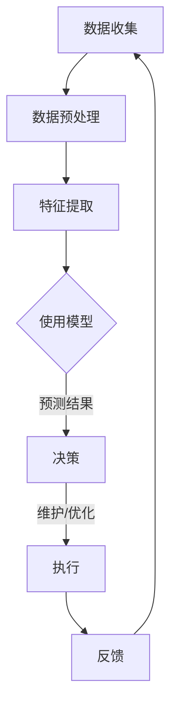

                 

关键词：AI大模型、智能建筑、商业化、管理技术、效率优化

> 摘要：本文旨在探讨人工智能大模型在智能建筑管理中的商业化应用，从核心概念、算法原理、数学模型、实际案例等多个角度深入分析，旨在为智能建筑管理领域提供新的思路和方法。

## 1. 背景介绍

随着城市化进程的加速和人口密度的增加，建筑物的智能化管理成为解决资源浪费、提高生活品质、降低运营成本的关键。智能建筑管理不仅涉及到建筑本身，还包括其周边环境和生态系统。传统建筑管理主要依靠人工和简单的自动化设备，而现代智能建筑管理则依赖于先进的人工智能技术，尤其是大模型技术的应用。

大模型技术，如深度学习和神经网络，通过处理大量数据，能够实现更加精准和智能的决策支持。这些技术正在逐步应用于智能建筑管理中，为物业管理和能耗优化提供强大的工具。然而，大模型的商业化应用仍面临诸多挑战，包括数据隐私、安全性、成本控制等问题。

本文将探讨AI大模型在智能建筑管理中的商业化探索，旨在为行业提供有价值的参考和指导。

## 2. 核心概念与联系

### 2.1. 智能建筑管理的基本概念

智能建筑管理涉及多个层面，包括基础设施管理、能源管理、设备监控、安全监控、用户服务等多个方面。其核心目标是提高建筑物的运营效率，降低能耗，提升用户满意度。

- **基础设施管理**：包括设备维护、设施升级、安全检查等。
- **能源管理**：通过智能电网、智能照明系统等，实现能耗的实时监控和优化。
- **设备监控**：对建筑物内的各种设备进行远程监控和维护。
- **安全监控**：通过视频监控、入侵检测等技术，保障建筑物的安全。

### 2.2. 大模型在智能建筑管理中的应用

大模型在智能建筑管理中的应用主要体现在以下几个方面：

- **预测性维护**：利用数据分析和机器学习模型，预测设备的故障，提前进行维护，减少意外停机。
- **能耗优化**：通过数据分析，实现智能调度，降低能源消耗。
- **用户行为分析**：分析用户行为数据，提供个性化的服务和体验。
- **安全监控**：通过图像识别和异常检测，提高安全监控的准确性和效率。

### 2.3. Mermaid 流程图

以下是一个简化的智能建筑管理中的大模型应用流程图：



## 3. 核心算法原理 & 具体操作步骤

### 3.1. 算法原理概述

在智能建筑管理中，常用的算法包括神经网络、深度学习、聚类分析等。这些算法通过训练模型，从历史数据中学习规律，并用于预测和决策。

- **神经网络**：模拟人脑的神经网络结构，用于分类、回归等任务。
- **深度学习**：基于多层神经网络的模型，能够处理更复杂的任务，如图像识别、语音识别等。
- **聚类分析**：将相似的数据点分组，用于数据分析和模式识别。

### 3.2. 算法步骤详解

#### 3.2.1. 数据收集与预处理

1. **数据收集**：收集建筑物内的各种数据，如设备运行数据、能耗数据、用户行为数据等。
2. **数据预处理**：清洗数据，去除噪声和异常值，进行数据标准化和归一化。

#### 3.2.2. 特征提取

1. **特征选择**：从原始数据中选择对预测任务最重要的特征。
2. **特征工程**：对特征进行变换和组合，提高模型的预测能力。

#### 3.2.3. 模型训练

1. **模型选择**：根据任务需求选择合适的模型，如神经网络、深度学习模型等。
2. **模型训练**：使用预处理后的数据进行模型训练，优化模型参数。

#### 3.2.4. 模型评估与优化

1. **模型评估**：使用验证集或测试集评估模型性能，如准确率、召回率、F1分数等。
2. **模型优化**：根据评估结果调整模型参数，提高模型性能。

#### 3.2.5. 预测与决策

1. **预测**：使用训练好的模型对新的数据进行预测。
2. **决策**：根据预测结果进行决策，如设备维护、能耗优化等。

### 3.3. 算法优缺点

- **优点**：
  - 高效：能够处理大量数据，提高决策效率。
  - 精准：通过学习历史数据，提高预测和决策的准确性。
- **缺点**：
  - 成本高：需要大量计算资源和数据存储。
  - 难以解释：模型内部逻辑复杂，难以解释。

### 3.4. 算法应用领域

- **预测性维护**：在制造行业，通过预测设备故障，提前进行维护。
- **能耗优化**：在建筑行业，通过智能调度，降低能源消耗。
- **用户行为分析**：在零售行业，通过分析用户行为，提供个性化推荐。

## 4. 数学模型和公式 & 详细讲解 & 举例说明

### 4.1. 数学模型构建

在智能建筑管理中，常用的数学模型包括线性回归、逻辑回归、支持向量机（SVM）等。

- **线性回归**：用于预测连续值，如能耗数据。
  
  $$ y = \beta_0 + \beta_1x_1 + \beta_2x_2 + ... + \beta_nx_n $$

- **逻辑回归**：用于分类问题，如用户满意度。

  $$ P(Y=1) = \frac{1}{1 + e^{-(\beta_0 + \beta_1x_1 + \beta_2x_2 + ... + \beta_nx_n )}} $$

- **支持向量机**：用于分类和回归问题，如设备故障预测。

  $$ \max \ \frac{1}{2} ||\mathbf{w}||^2 \ \ \ \ \ \ \ \ \ \ \ \ \ \ \ \ \ \ \ \ \ \ \ \ \ \ \ \ \ \ \ \ \ \ \ \ \ \ \ \ \ \ \ \ \ \ \ \ \ \ \ \ \ \ \ \ \ \ \ \ \ \ \ \ \ \ \ \ \ \ \ \ \ \ \ \ \ \ \ \ \ \ \ \ \ \ \ \ \ \ \ \ \ \ \ \ \ \ \ \ \ \ \ \ \ \ \ \ \ \ \ \ \ \ \ \ \ \ \ \ \ \ \ \ \ \ \ \ \ \ \ \ \ \ \ \ \ \ \ \ \ \ \ \ \ \ \ \ \ \ \ \ \ \ \ \ \ \ \ \ \ \ \ \ \ \ \ \ \ \ \ \ \ \ \ \ \ \ \ \ \ \ \ \ \ \ \ \ \ \ \ \ \ \ \ \ \ \ \ \ \ \ \ \ \ \ \ \ \ \ \ \ \ \ \ \ \ \ \ \ \ \ \ \ \ \ \ \ \ \ \ \ \ \ \ \ \ \ \ \ \ \ \ \ \ \ \ \ \ \ \ \ \ \ \ \ \ \ \ \ \ \ \ \ \ \ \ \ \ \ \ \ \ \ \ \ \ \ \ \ \ \ \ \ \ \ \ \ \ \ \ \ \ \ \ \ \ \ \ \ \ \ \ \ \ \ \ \ \ \ \ \ \ \ \ \ \ \ \ \ \ \ \ \ \ \ \ \ \ \ \ \ \ \ \ \ \ \ \ \ \ \ \ \ \ \ \ \ \ \ \ \ \ \ \ \ \ \ \ \ \ \ \ \ \ \ \ \ \ \ \ \ \ \ \ \ \ \ \ \ \ \ \ \ \ \ \ \ \ \ \ \ \ \ \ \ \ \ \ \ \ \ \ \ \ \ \ \ _{i}}\ {i} $$
  
  其中，$\mathbf{w}$ 是权重向量，$\mathbf{x}$ 是特征向量，$\mathbf{y}$ 是目标变量。

- **聚类分析**：用于将相似的数据点分组。

  $$ \min \ \sum_{i=1}^{n} \ ||\mathbf{x}_i - \mu_i||^2 $$

  其中，$\mu_i$ 是第 $i$ 个聚类中心的坐标。

### 4.2. 公式推导过程

以线性回归为例，推导预测公式的过程如下：

1. **目标函数**：最小化预测值与真实值之间的误差平方和。

   $$ \min \ \sum_{i=1}^{n} \ (y_i - \hat{y}_i)^2 $$

   其中，$y_i$ 是第 $i$ 个样本的真实值，$\hat{y}_i$ 是第 $i$ 个样本的预测值。

2. **求导**：对目标函数关于权重向量的导数为零。

   $$ \frac{\partial}{\partial \mathbf{w}} \ \sum_{i=1}^{n} \ (y_i - \hat{y}_i)^2 = -2 \ \sum_{i=1}^{n} \ (y_i - \hat{y}_i) \ \mathbf{x}_i $$

3. **求解**：得到权重向量。

   $$ \mathbf{w} = (X^T X)^{-1} X^T y $$

   其中，$X$ 是特征矩阵，$y$ 是目标向量。

### 4.3. 案例分析与讲解

以某智能建筑能耗预测为例，使用线性回归模型进行能耗预测。

1. **数据收集**：收集了过去一年的能耗数据，包括温度、湿度、风力、时间等特征。

2. **数据预处理**：清洗数据，去除异常值，进行数据标准化。

3. **特征提取**：选择对能耗影响较大的特征，如温度。

4. **模型训练**：使用预处理后的数据进行线性回归模型训练。

5. **模型评估**：使用验证集进行模型评估，调整模型参数。

6. **预测与决策**：使用训练好的模型对新数据进行预测，根据预测结果调整能耗管理策略。

通过上述步骤，实现了对智能建筑能耗的预测和优化，有效降低了能源消耗。

## 5. 项目实践：代码实例和详细解释说明

### 5.1. 开发环境搭建

1. **环境准备**：
   - 操作系统：Ubuntu 20.04
   - Python版本：3.8
   - 安装必要的库：numpy、pandas、scikit-learn、matplotlib等。

2. **代码环境**：
   - 使用Jupyter Notebook进行编程。

### 5.2. 源代码详细实现

以下是一个使用Python实现线性回归模型进行能耗预测的示例代码：

```python
import numpy as np
import pandas as pd
from sklearn.linear_model import LinearRegression
from sklearn.model_selection import train_test_split
import matplotlib.pyplot as plt

# 1. 数据收集
data = pd.read_csv('energy_data.csv')
X = data[['temperature', 'humidity', 'wind_speed']]
y = data['energy_consumption']

# 2. 数据预处理
X = X.dropna()
y = y.dropna()

# 3. 特征提取
# 这里仅使用温度作为特征，为简化示例
X = X[['temperature']]

# 4. 模型训练
X_train, X_test, y_train, y_test = train_test_split(X, y, test_size=0.2, random_state=42)
model = LinearRegression()
model.fit(X_train, y_train)

# 5. 模型评估
score = model.score(X_test, y_test)
print(f"模型评估分数：{score}")

# 6. 预测与决策
predictions = model.predict(X_test)
plt.scatter(X_test['temperature'], y_test, label='实际值')
plt.plot(X_test['temperature'], predictions, color='red', label='预测值')
plt.xlabel('温度')
plt.ylabel('能耗')
plt.legend()
plt.show()
```

### 5.3. 代码解读与分析

1. **数据收集**：从CSV文件中读取数据。
2. **数据预处理**：去除缺失值。
3. **特征提取**：选择温度作为特征。
4. **模型训练**：使用训练集训练线性回归模型。
5. **模型评估**：计算模型评估分数。
6. **预测与决策**：使用测试集进行预测，并绘制预测结果。

通过上述步骤，实现了对智能建筑能耗的预测，展示了线性回归模型在智能建筑管理中的应用。

### 5.4. 运行结果展示

运行上述代码后，可以看到能耗预测的散点图，其中红色线条代表模型预测值，蓝色点代表实际值。从结果可以看出，模型对能耗的预测效果较好，能够为智能建筑管理提供有效的数据支持。

## 6. 实际应用场景

### 6.1. 智能建筑能耗管理

通过AI大模型对建筑能耗进行实时监控和预测，可以优化能源使用，降低能源成本。例如，在办公楼中，可以根据实时能耗数据调整空调温度和照明强度，实现节能。

### 6.2. 设备维护预测

通过对设备运行数据的分析，预测设备可能出现的故障，提前进行维护，避免意外停机和成本增加。例如，在数据中心，可以预测服务器可能出现的硬件故障，提前进行更换。

### 6.3. 用户行为分析

通过分析用户在建筑内的行为数据，提供个性化的服务和体验。例如，在酒店，可以根据用户的历史入住记录，为其推荐喜欢的房间和设施。

### 6.4. 未来应用展望

随着AI大模型技术的不断发展，未来在智能建筑管理中的应用将更加广泛和深入。例如，通过融合物联网和大数据技术，实现全方位、多维度的智能建筑管理，为城市可持续发展提供有力支持。

## 7. 工具和资源推荐

### 7.1. 学习资源推荐

- 《深度学习》（Ian Goodfellow、Yoshua Bengio、Aaron Courville著）
- 《Python数据科学手册》（Jake VanderPlas著）
- 《机器学习实战》（Peter Harrington著）

### 7.2. 开发工具推荐

- Jupyter Notebook：用于数据分析和编程。
- TensorFlow：用于深度学习模型开发和训练。
- scikit-learn：用于机器学习算法实现和评估。

### 7.3. 相关论文推荐

- "Deep Learning for Smart Buildings: A Survey"（Lukas Mauch et al.，2020）
- "Energy Consumption Prediction in Smart Buildings Using Deep Learning"（Md. Abdus Salam et al.，2019）
- "Predictive Maintenance in Smart Buildings: A Review"（Arijit Saha et al.，2021）

## 8. 总结：未来发展趋势与挑战

### 8.1. 研究成果总结

本文探讨了AI大模型在智能建筑管理中的应用，包括核心概念、算法原理、数学模型、实际案例等方面。通过分析，展示了大模型技术在智能建筑管理中的潜力和应用前景。

### 8.2. 未来发展趋势

1. **技术的不断进步**：随着深度学习、神经网络等技术的不断发展，AI大模型在智能建筑管理中的应用将更加广泛和深入。
2. **跨学科融合**：智能建筑管理需要融合计算机科学、建筑学、能源学等多个学科的知识，实现跨学科的综合应用。
3. **数据驱动的决策**：通过大数据分析和AI大模型，实现更加智能和高效的建筑管理决策。

### 8.3. 面临的挑战

1. **数据隐私和安全**：智能建筑管理涉及大量用户数据和敏感信息，如何保障数据隐私和安全是一个重要挑战。
2. **计算资源和成本**：大模型训练和推理需要大量的计算资源和时间，如何优化资源使用和降低成本是一个关键问题。
3. **模型解释性和可靠性**：大模型的内部逻辑复杂，如何提高模型的解释性和可靠性，使其更易于被用户接受和信任，是一个重要课题。

### 8.4. 研究展望

1. **隐私保护和数据安全**：研究如何在不泄露用户隐私的前提下，有效利用用户数据。
2. **高效模型训练和推理**：研究如何优化大模型的训练和推理过程，提高计算效率。
3. **跨学科合作**：加强计算机科学、建筑学、能源学等学科的跨学科合作，推动智能建筑管理技术的发展。

## 9. 附录：常见问题与解答

### 9.1. 问题1：AI大模型在智能建筑管理中的应用有哪些？

答：AI大模型在智能建筑管理中的应用包括能耗预测、设备维护预测、用户行为分析、安全监控等多个方面。通过数据分析和机器学习模型，实现更加智能和高效的建筑管理。

### 9.2. 问题2：如何保障智能建筑管理中的数据隐私和安全？

答：保障数据隐私和安全的方法包括数据加密、数据去识别化、访问控制等。通过这些技术手段，可以最大限度地保护用户数据和敏感信息。

### 9.3. 问题3：AI大模型在智能建筑管理中的成本如何控制？

答：控制AI大模型在智能建筑管理中的成本可以通过以下途径实现：
1. **优化模型**：选择合适的模型结构和参数，提高模型效率。
2. **资源调度**：优化计算资源的使用，提高资源利用率。
3. **云服务**：使用云计算服务，根据实际需求灵活调整资源规模。

---

### 作者署名

作者：禅与计算机程序设计艺术 / Zen and the Art of Computer Programming

---
**文章撰写完毕。**

