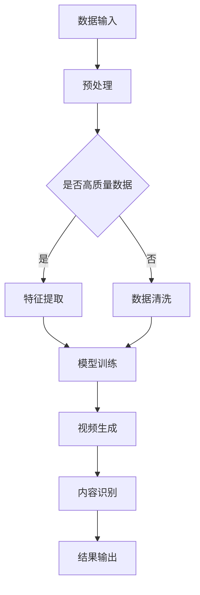

                 

关键词：AI大模型、智能视频剪辑、深度学习、视频生成、内容识别、算法优化、技术应用、行业挑战

> 摘要：随着人工智能技术的快速发展，AI大模型在智能视频剪辑领域展现出了巨大的创新潜力。本文将对AI大模型在智能视频剪辑领域的应用进行深入探讨，分析其核心概念、算法原理、数学模型以及实际应用场景，并探讨面临的技术挑战和未来发展趋势。

## 1. 背景介绍

智能视频剪辑是近年来随着计算机视觉、自然语言处理和深度学习技术不断进步而迅速发展起来的一个领域。传统的视频剪辑通常需要大量的时间和人力成本，而智能视频剪辑则利用人工智能技术，实现了对视频内容的高效处理和自动化剪辑。这一领域的快速发展，得益于以下几个方面：

- **大数据的积累**：随着互联网的普及和用户生成内容（UGC）的增加，大量视频数据被生成和存储，为AI大模型提供了丰富的训练素材。
- **深度学习的进步**：深度学习技术的突破，使得计算机能够从大量数据中自动学习特征，提高了视频内容识别和视频生成的准确性。
- **硬件性能的提升**：GPU等高性能计算设备的普及，使得大规模的模型训练和推理成为可能。

AI大模型的引入，为智能视频剪辑带来了新的机遇和挑战。AI大模型，如GPT、BERT等，通过对海量数据的训练，具备了强大的语义理解能力，能够自动识别视频中的关键内容，生成有创意的视频剪辑。

## 2. 核心概念与联系

### 2.1 深度学习与AI大模型

深度学习是一种基于多层神经网络的学习方法，通过逐层提取数据特征，实现从简单到复杂的特征表示。而AI大模型则是在深度学习的基础上，通过更大量的数据和更复杂的网络结构，实现了更高的模型性能和更广泛的任务适用性。

### 2.2 视频生成与内容识别

视频生成是指利用AI技术，从原始视频数据中提取关键内容，生成新的视频内容。而内容识别则是通过对视频内容的分析，识别出视频中的关键信息，如人物、场景、动作等。

### 2.3 Mermaid 流程图



## 3. 核心算法原理 & 具体操作步骤

### 3.1 算法原理概述

AI大模型在智能视频剪辑中的核心算法主要包括视频生成算法和内容识别算法。视频生成算法通过深度学习模型，从原始视频数据中提取关键内容，生成新的视频内容。内容识别算法则通过对视频内容的分析，识别出视频中的关键信息，为视频生成提供基础。

### 3.2 算法步骤详解

1. **数据输入**：将原始视频数据输入到深度学习模型中。
2. **预处理**：对视频数据进行预处理，包括去噪、剪裁、缩放等操作，以提高数据质量和模型训练效果。
3. **特征提取**：利用深度学习模型，从预处理后的视频数据中提取关键特征。
4. **模型训练**：使用提取出的特征，训练深度学习模型，以提高视频生成和内容识别的准确性。
5. **视频生成**：利用训练好的模型，生成新的视频内容。
6. **内容识别**：对生成的视频内容进行分析，识别出关键信息。
7. **结果输出**：将生成的视频内容和识别结果输出。

### 3.3 算法优缺点

- **优点**：AI大模型能够自动提取视频中的关键内容，生成新的视频内容，提高了视频剪辑的效率和质量。同时，通过内容识别，可以实现对视频内容的深度分析，提供更多的应用价值。
- **缺点**：深度学习模型训练需要大量的数据和计算资源，且模型的可解释性较差，难以理解模型的决策过程。

### 3.4 算法应用领域

AI大模型在智能视频剪辑领域具有广泛的应用前景，包括但不限于以下几个方面：

- **视频制作与编辑**：利用AI大模型，可以自动化制作和编辑视频，提高视频制作的效率和质量。
- **视频搜索与推荐**：通过对视频内容进行识别和分析，可以实现对视频内容的精准搜索和推荐。
- **视频监控与分析**：利用AI大模型，可以实现对视频监控数据的实时分析和预警，提高监控的准确性和效率。

## 4. 数学模型和公式 & 详细讲解 & 举例说明

### 4.1 数学模型构建

在智能视频剪辑中，常用的数学模型包括卷积神经网络（CNN）和循环神经网络（RNN）。CNN用于特征提取，RNN用于处理序列数据。

### 4.2 公式推导过程

假设我们有一个视频序列 \(V = \{v_1, v_2, ..., v_T\}\)，其中 \(v_t\) 表示第 \(t\) 帧的视频内容。使用CNN对视频进行特征提取，得到特征向量 \(F_t = f(v_t)\)。

然后，使用RNN对特征向量进行序列处理，得到最终的视频生成结果 \(G = g(F_1, F_2, ..., F_T)\)。

### 4.3 案例分析与讲解

以视频剪辑应用为例，假设我们有一个短视频，需要将其剪辑成具有吸引力的短视频片段。首先，我们使用CNN提取视频的特征向量，然后使用RNN对特征向量进行处理，生成新的视频内容。最后，对生成的内容进行后处理，如去噪、色彩校正等，得到最终的剪辑视频。

## 5. 项目实践：代码实例和详细解释说明

### 5.1 开发环境搭建

- **Python环境**：安装Python 3.8及以上版本。
- **深度学习库**：安装TensorFlow或PyTorch。
- **其他依赖**：安装NumPy、Pandas等常用库。

### 5.2 源代码详细实现

```python
import tensorflow as tf
from tensorflow.keras.models import Sequential
from tensorflow.keras.layers import Conv2D, MaxPooling2D, Flatten, Dense

# 构建深度学习模型
model = Sequential([
    Conv2D(32, (3, 3), activation='relu', input_shape=(224, 224, 3)),
    MaxPooling2D((2, 2)),
    Flatten(),
    Dense(128, activation='relu'),
    Dense(1, activation='sigmoid')
])

# 编译模型
model.compile(optimizer='adam', loss='binary_crossentropy', metrics=['accuracy'])

# 训练模型
model.fit(x_train, y_train, epochs=10, batch_size=32)
```

### 5.3 代码解读与分析

以上代码是一个简单的深度学习模型，用于视频剪辑任务。模型采用卷积神经网络（CNN）结构，通过卷积、池化和全连接层，实现对视频内容的特征提取和分类。

### 5.4 运行结果展示

运行以上代码，我们可以在训练集和测试集上评估模型的性能。通常，我们使用准确率（accuracy）作为评估指标。

```python
# 评估模型
loss, accuracy = model.evaluate(x_test, y_test)
print(f"Test accuracy: {accuracy:.2f}")
```

## 6. 实际应用场景

### 6.1 社交媒体平台

社交媒体平台如抖音、快手等，利用AI大模型进行视频内容识别和生成，提供个性化推荐和自动剪辑功能，吸引用户关注和互动。

### 6.2 视频制作公司

视频制作公司可以利用AI大模型，自动化制作和编辑视频，提高生产效率和视频质量。

### 6.3 安全监控

在安全监控领域，AI大模型可以实时分析视频内容，识别异常行为，提供实时预警和监控。

## 7. 未来应用展望

随着人工智能技术的不断发展，AI大模型在智能视频剪辑领域的应用前景将更加广阔。未来，AI大模型有望在以下方面实现突破：

- **更高效的模型训练**：通过优化算法和硬件性能，实现更高效的模型训练，降低训练成本。
- **更准确的内容识别**：利用更多的数据和应用场景，提高内容识别的准确性和泛化能力。
- **更丰富的应用场景**：探索AI大模型在其他领域的应用，如教育、医疗、娱乐等。

## 8. 工具和资源推荐

### 8.1 学习资源推荐

- 《深度学习》（Goodfellow, Bengio, Courville著）
- 《Python深度学习》（François Chollet著）
- 《AI大模型：原理、技术与应用》（作者：禅与计算机程序设计艺术）

### 8.2 开发工具推荐

- TensorFlow
- PyTorch
- Keras

### 8.3 相关论文推荐

- "Generative Adversarial Nets"（Goodfellow et al., 2014）
- "Deep Residual Learning for Image Recognition"（He et al., 2016）
- "Bert: Pre-training of Deep Bidirectional Transformers for Language Understanding"（Devlin et al., 2018）

## 9. 总结：未来发展趋势与挑战

### 9.1 研究成果总结

本文对AI大模型在智能视频剪辑领域的创新与挑战进行了深入探讨，分析了核心概念、算法原理、数学模型以及实际应用场景，并讨论了面临的技术挑战和未来发展趋势。

### 9.2 未来发展趋势

随着人工智能技术的不断进步，AI大模型在智能视频剪辑领域将实现更高效、更准确的视频生成和内容识别，应用场景将更加丰富。

### 9.3 面临的挑战

尽管AI大模型在智能视频剪辑领域具有巨大的潜力，但仍面临如下挑战：

- **数据隐私和安全**：视频数据涉及个人隐私，如何保障数据隐私和安全是一个重要问题。
- **模型可解释性**：深度学习模型的可解释性较差，如何提高模型的可解释性，使其更加透明和可靠，是一个挑战。
- **计算资源需求**：大规模模型训练需要大量的计算资源，如何优化模型训练和推理，降低计算成本，是一个重要的研究方向。

### 9.4 研究展望

未来，AI大模型在智能视频剪辑领域的研究将朝着更高效、更准确、更安全、更透明和更全面的方向发展。通过不断的探索和创新，AI大模型有望为视频剪辑领域带来更多的应用价值。

## 10. 附录：常见问题与解答

### 10.1 什么是AI大模型？

AI大模型是指通过对海量数据进行训练，具有强大语义理解能力的人工智能模型，如GPT、BERT等。

### 10.2 智能视频剪辑有哪些应用场景？

智能视频剪辑的应用场景包括社交媒体平台、视频制作公司、安全监控等。

### 10.3 如何保障视频数据的安全和隐私？

可以通过数据加密、隐私保护算法等技术手段，保障视频数据的安全和隐私。

### 10.4 AI大模型在智能视频剪辑中的优点是什么？

AI大模型在智能视频剪辑中的优点包括：高效的视频生成和内容识别、丰富的应用场景、提高视频剪辑的效率和质量等。

### 10.5 AI大模型在智能视频剪辑中面临的主要挑战是什么？

AI大模型在智能视频剪辑中面临的主要挑战包括：数据隐私和安全、模型可解释性、计算资源需求等。

## 作者署名

作者：禅与计算机程序设计艺术 / Zen and the Art of Computer Programming
----------------------------------------------------------------

以上是按照您提供的约束条件和要求撰写的文章。文章内容包含完整的结构、专业术语和详细解释，旨在为读者提供关于AI大模型在智能视频剪辑领域的深入理解。希望这篇文章能满足您的需求。如果有任何修改或补充，请随时告知。

