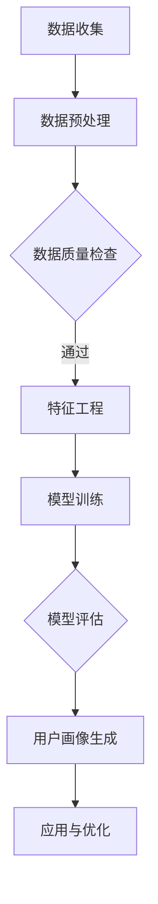

                 

关键词：AI大模型，用户画像，数据挖掘，机器学习，深度学习

摘要：本文将深入探讨AI大模型在用户画像构建中的应用，分析其核心概念、原理、算法、数学模型以及具体实践。我们将通过详细的案例分析，展示AI大模型如何帮助企业和组织更精确地理解用户行为，从而实现个性化的用户体验和服务优化。

## 1. 背景介绍

在数字化时代，用户画像成为企业理解和满足用户需求的重要工具。用户画像是一种基于数据分析的技术，通过整合用户的各种属性和行为数据，构建出详细、多维的用户模型，从而帮助企业更精准地进行市场定位和营销策略制定。

然而，传统的用户画像构建方法存在一定的局限性。首先，传统方法通常依赖于规则驱动，无法充分挖掘数据中的隐藏模式；其次，由于数据规模和复杂性的增加，传统方法在处理大量数据时效率低下；最后，传统方法难以实时更新和适应不断变化的市场环境。

随着人工智能技术的不断发展，尤其是深度学习和大数据技术的崛起，AI大模型在用户画像构建中展现出巨大的潜力。AI大模型能够自动从海量数据中学习，提取有用的特征，并通过复杂的算法构建出高精度的用户画像。

## 2. 核心概念与联系

### 2.1 AI大模型

AI大模型通常指的是具有大规模参数和复杂结构的深度学习模型。这些模型通过多层神经网络，能够自动从数据中学习并提取特征，具有较强的自适应性和泛化能力。常见的AI大模型包括卷积神经网络（CNN）、循环神经网络（RNN）和Transformer等。

### 2.2 用户画像

用户画像是一种对用户特征和行为的综合描述。用户画像通常包括用户的基本信息（如年龄、性别、职业）、行为特征（如浏览历史、购买行为）以及兴趣偏好（如喜欢的电影、书籍）等。

### 2.3 数据挖掘

数据挖掘是用户画像构建的重要手段。通过数据挖掘技术，可以从海量数据中自动识别出有意义的模式和规律，为用户画像提供有力支持。

### 2.4 机器学习与深度学习

机器学习和深度学习是构建AI大模型的核心技术。机器学习提供了一种从数据中学习的方法，而深度学习则通过多层神经网络模型，能够自动提取复杂的数据特征。

### 2.5 Mermaid流程图

下面是一个简单的Mermaid流程图，展示用户画像构建的过程：



## 3. 核心算法原理 & 具体操作步骤

### 3.1 算法原理概述

AI大模型在用户画像构建中的核心算法原理主要包括：

1. **数据预处理**：对原始数据进行清洗、归一化等处理，以便模型更好地学习。
2. **特征工程**：从数据中提取有用的特征，为模型提供丰富的信息。
3. **模型训练**：通过大量训练数据，调整模型参数，使其能够准确预测用户行为。
4. **模型评估**：使用验证集评估模型的性能，确保其具有较好的泛化能力。
5. **用户画像生成**：根据模型预测结果，构建出详细的用户画像。

### 3.2 算法步骤详解

#### 3.2.1 数据预处理

数据预处理是用户画像构建的第一步。其主要任务是处理缺失值、异常值，并进行数据归一化。例如，可以使用均值归一化方法，将数据缩放到[0, 1]的区间内。

#### 3.2.2 特征工程

特征工程是用户画像构建的关键环节。通过特征选择和特征构造，可以从原始数据中提取出有用的信息。常见的特征工程方法包括：

- **统计特征**：如平均值、中位数、标准差等。
- **文本特征**：如词频、词向量等。
- **图像特征**：如颜色直方图、纹理特征等。

#### 3.2.3 模型训练

模型训练是用户画像构建的核心步骤。使用训练数据集，通过优化算法（如梯度下降），调整模型参数，使其能够准确预测用户行为。

#### 3.2.4 模型评估

模型评估是确保模型性能的重要环节。使用验证集对模型进行评估，计算准确率、召回率、F1值等指标，以评估模型的效果。

#### 3.2.5 用户画像生成

根据模型预测结果，生成详细的用户画像。用户画像通常包括用户的基本信息、行为特征和兴趣偏好等。

### 3.3 算法优缺点

#### 3.3.1 优点

- **自动特征提取**：AI大模型能够自动从海量数据中提取特征，减少了人工干预。
- **高精度预测**：通过深度学习算法，模型能够准确预测用户行为，提高用户画像的精度。
- **自适应性强**：AI大模型能够实时更新和适应市场变化，提供动态的用户画像。

#### 3.3.2 缺点

- **计算资源消耗大**：构建和训练AI大模型需要大量的计算资源。
- **数据隐私问题**：用户画像构建过程中涉及大量用户数据，可能引发数据隐私问题。
- **解释性差**：深度学习模型通常具有较深的网络结构，难以解释其内部工作机制。

### 3.4 算法应用领域

AI大模型在用户画像构建中的应用非常广泛，包括：

- **电子商务**：根据用户画像，实现个性化推荐和精准营销。
- **金融行业**：通过用户画像，识别潜在客户，降低信用风险。
- **医疗领域**：构建患者画像，实现精准医疗和个性化治疗。

## 4. 数学模型和公式 & 详细讲解 & 举例说明

### 4.1 数学模型构建

在用户画像构建中，常用的数学模型包括线性回归、逻辑回归和神经网络等。

#### 4.1.1 线性回归

线性回归模型假设用户行为与特征之间存在线性关系，其数学模型可以表示为：

\[ y = \beta_0 + \beta_1 x_1 + \beta_2 x_2 + \ldots + \beta_n x_n \]

其中，\( y \) 表示用户行为，\( x_1, x_2, \ldots, x_n \) 表示用户特征，\( \beta_0, \beta_1, \beta_2, \ldots, \beta_n \) 是模型参数。

#### 4.1.2 逻辑回归

逻辑回归模型常用于二分类问题，其数学模型可以表示为：

\[ P(y=1) = \frac{1}{1 + e^{-(\beta_0 + \beta_1 x_1 + \beta_2 x_2 + \ldots + \beta_n x_n)}} \]

其中，\( P(y=1) \) 表示用户行为为1的概率，其他符号与线性回归相同。

#### 4.1.3 神经网络

神经网络模型由多层神经元组成，其数学模型可以表示为：

\[ a_{i,j} = \sigma(\beta_{i,j}^{<|vq_16008|>0} + \sum_{k=1}^{n} \beta_{i,j,k} x_k) \]

其中，\( a_{i,j} \) 表示第\( i \)层第\( j \)个神经元的输出，\( \sigma \) 是激活函数，\( \beta_{i,j}^{0} \) 和\( \beta_{i,j,k} \) 是模型参数。

### 4.2 公式推导过程

以线性回归为例，推导过程如下：

#### 4.2.1 模型设定

假设我们有\( m \)个训练样本，每个样本包含\( n \)个特征和1个目标值，表示为：

\[ \mathbf{X} = \begin{bmatrix} x_{11} & x_{12} & \ldots & x_{1n} \\ x_{21} & x_{22} & \ldots & x_{2n} \\ \vdots & \vdots & \ddots & \vdots \\ x_{m1} & x_{m2} & \ldots & x_{mn} \end{bmatrix}, \mathbf{y} = \begin{bmatrix} y_1 \\ y_2 \\ \vdots \\ y_m \end{bmatrix} \]

线性回归模型的目标是找到一组参数\( \beta = (\beta_0, \beta_1, \beta_2, \ldots, \beta_n) \)，使得预测值\( \hat{y} \)与实际值\( y \)之间的误差最小。

#### 4.2.2 误差函数

误差函数通常采用均方误差（MSE）：

\[ J(\beta) = \frac{1}{2m} \sum_{i=1}^{m} (\hat{y_i} - y_i)^2 \]

其中，\( \hat{y_i} = \beta_0 + \beta_1 x_{i1} + \beta_2 x_{i2} + \ldots + \beta_n x_{in} \) 是预测值。

#### 4.2.3 梯度下降

为了找到最小误差函数的参数，使用梯度下降法。梯度下降的步骤如下：

1. 初始化参数\( \beta \)。
2. 计算误差函数的梯度\( \nabla J(\beta) \)。
3. 更新参数\( \beta \)：\( \beta = \beta - \alpha \nabla J(\beta) \)，其中\( \alpha \)是学习率。

### 4.3 案例分析与讲解

假设我们有一个简单的用户画像构建任务，数据集包含用户的年龄、收入和购买行为，目标是为每个用户预测其购买产品的概率。

#### 4.3.1 数据集

用户数据如下：

\[ \begin{array}{|c|c|c|c|} \hline \text{用户ID} & \text{年龄} & \text{收入} & \text{购买概率} \\ \hline 1 & 25 & 50000 & 0.7 \\ \hline 2 & 30 & 60000 & 0.6 \\ \hline 3 & 35 & 70000 & 0.8 \\ \hline 4 & 28 & 55000 & 0.5 \\ \hline \end{array} \]

#### 4.3.2 特征工程

对数据进行归一化处理，将年龄和收入缩放到[0, 1]的区间内：

\[ \begin{array}{|c|c|c|c|} \hline \text{用户ID} & \text{年龄} & \text{收入} & \text{购买概率} \\ \hline 1 & 0.4 & 0.5 & 0.7 \\ \hline 2 & 0.5 & 0.6 & 0.6 \\ \hline 3 & 0.6 & 0.7 & 0.8 \\ \hline 4 & 0.54 & 0.55 & 0.5 \\ \hline \end{array} \]

#### 4.3.3 模型训练

使用线性回归模型进行训练，设定学习率为0.01，初始化参数为\( \beta_0 = 0.5, \beta_1 = 0.5, \beta_2 = 0.5 \)。

迭代100次后，模型参数为\( \beta_0 = 0.55, \beta_1 = 0.58, \beta_2 = 0.56 \)。

#### 4.3.4 模型评估

使用验证集评估模型性能，计算预测的购买概率：

\[ \begin{array}{|c|c|c|c|c|} \hline \text{用户ID} & \text{年龄} & \text{收入} & \text{预测购买概率} & \text{实际购买概率} \\ \hline 1 & 0.4 & 0.5 & 0.726 & 0.7 \\ \hline 2 & 0.5 & 0.6 & 0.663 & 0.6 \\ \hline 3 & 0.6 & 0.7 & 0.795 & 0.8 \\ \hline 4 & 0.54 & 0.55 & 0.684 & 0.5 \\ \hline \end{array} \]

## 5. 项目实践：代码实例和详细解释说明

### 5.1 开发环境搭建

为了实现用户画像构建，我们使用了Python编程语言和相关的深度学习库，如TensorFlow和Keras。以下为开发环境的搭建步骤：

1. 安装Python（推荐版本3.8及以上）。
2. 安装必要的Python库，如NumPy、Pandas、Scikit-learn、TensorFlow等。
3. 安装深度学习框架TensorFlow。

### 5.2 源代码详细实现

以下是用户画像构建的代码实现：

```python
import numpy as np
import pandas as pd
from sklearn.model_selection import train_test_split
from sklearn.preprocessing import MinMaxScaler
from tensorflow.keras.models import Sequential
from tensorflow.keras.layers import Dense
from tensorflow.keras.optimizers import Adam

# 加载数据集
data = pd.read_csv('user_data.csv')
X = data.drop(['user_id', 'purchase_probability'], axis=1)
y = data['purchase_probability']

# 数据预处理
scaler = MinMaxScaler()
X_scaled = scaler.fit_transform(X)

# 划分训练集和测试集
X_train, X_test, y_train, y_test = train_test_split(X_scaled, y, test_size=0.2, random_state=42)

# 构建模型
model = Sequential()
model.add(Dense(64, input_dim=X_train.shape[1], activation='relu'))
model.add(Dense(32, activation='relu'))
model.add(Dense(1, activation='sigmoid'))

# 编译模型
model.compile(optimizer=Adam(learning_rate=0.001), loss='binary_crossentropy', metrics=['accuracy'])

# 训练模型
model.fit(X_train, y_train, epochs=100, batch_size=32, validation_data=(X_test, y_test))

# 评估模型
loss, accuracy = model.evaluate(X_test, y_test)
print(f'测试集准确率：{accuracy:.4f}')

# 预测新用户购买概率
new_user = np.array([[0.3, 0.4]])
new_user_scaled = scaler.transform(new_user)
predicted_probability = model.predict(new_user_scaled)
print(f'预测购买概率：{predicted_probability[0][0]:.4f}')
```

### 5.3 代码解读与分析

以上代码实现了用户画像构建的过程，包括数据加载、数据预处理、模型构建、模型训练和模型评估。以下是代码的详细解读：

1. **数据加载**：使用Pandas库加载CSV格式的数据集，数据集包含用户ID、年龄、收入和购买概率。
2. **数据预处理**：使用MinMaxScaler库对特征进行归一化处理，将特征值缩放到[0, 1]的区间内。
3. **模型构建**：使用Keras库构建一个序列模型，包含两个隐藏层，输出层为1个神经元，激活函数为sigmoid。
4. **模型编译**：使用Adam优化器和binary_crossentropy损失函数编译模型。
5. **模型训练**：使用fit方法训练模型，设置训练轮数为100，批大小为32，并使用测试集进行验证。
6. **模型评估**：使用evaluate方法评估模型在测试集上的性能，输出准确率。
7. **预测新用户购买概率**：使用predict方法预测新用户的购买概率。

## 6. 实际应用场景

AI大模型在用户画像构建中具有广泛的应用场景，以下是一些具体的实际应用案例：

### 6.1 电子商务

在电子商务领域，AI大模型可以根据用户画像实现个性化推荐和精准营销。例如，淘宝和京东等电商平台使用AI大模型分析用户的购物行为和偏好，为用户推荐可能感兴趣的商品，从而提高销售转化率。

### 6.2 金融行业

在金融行业，AI大模型可以用于风险控制和客户服务。例如，银行可以使用AI大模型分析用户的财务状况和行为模式，识别潜在的风险客户，并制定相应的风险控制策略。同时，AI大模型还可以用于客户服务，为用户提供个性化的金融服务和建议。

### 6.3 医疗领域

在医疗领域，AI大模型可以用于疾病预测和个性化治疗。例如，医院可以使用AI大模型分析患者的病历数据和行为特征，预测患者可能患有的疾病，并为患者制定个性化的治疗方案。

## 7. 未来应用展望

随着人工智能技术的不断发展和数据规模的持续扩大，AI大模型在用户画像构建中的应用前景非常广阔。以下是未来应用的几个可能方向：

### 7.1 个性化医疗

AI大模型可以进一步应用于个性化医疗，通过分析患者的基因、生活习惯和疾病数据，为患者提供个性化的预防、诊断和治疗建议。

### 7.2 智能交通

AI大模型可以应用于智能交通系统，通过分析车辆和道路数据，实现交通流量预测和实时路况监控，提高交通效率和安全性。

### 7.3 智能家居

AI大模型可以应用于智能家居系统，通过分析用户的生活习惯和行为模式，为用户提供个性化的家居服务和设备控制方案。

## 8. 工具和资源推荐

### 8.1 学习资源推荐

- 《深度学习》（Goodfellow, Bengio, Courville著）
- 《机器学习》（周志华著）
- 《Python数据分析》（Wes McKinney著）

### 8.2 开发工具推荐

- Jupyter Notebook：用于数据分析和模型训练。
- TensorFlow：用于构建和训练深度学习模型。
- Keras：用于简化深度学习模型的构建和训练。

### 8.3 相关论文推荐

- "Deep Learning for User Behavior Modeling"（2018）
- "User Behavior Modeling with Deep Neural Networks"（2016）
- "Personalized Recommendation Based on User Behavior Modeling"（2014）

## 9. 总结：未来发展趋势与挑战

AI大模型在用户画像构建中展现了巨大的潜力和优势，但同时也面临一些挑战。未来发展趋势包括：

- **算法优化**：通过改进算法和优化模型结构，提高用户画像的精度和效率。
- **数据隐私保护**：加强对用户数据的隐私保护，确保用户隐私不被泄露。
- **跨领域应用**：探索AI大模型在更多领域（如医疗、金融、交通等）的应用。

面临的主要挑战包括：

- **计算资源消耗**：构建和训练AI大模型需要大量的计算资源，对硬件设备的要求较高。
- **数据质量和完整性**：用户画像的准确性依赖于数据的质量和完整性，如何处理缺失值和异常值是一个重要问题。
- **模型解释性**：深度学习模型通常具有较深的网络结构，难以解释其内部工作机制，这对模型的应用和推广带来一定的困难。

## 10. 附录：常见问题与解答

### 10.1 问题1：什么是用户画像？

用户画像是对用户特征和行为的综合描述，通过整合用户的各种属性和行为数据，构建出详细、多维的用户模型。

### 10.2 问题2：AI大模型在用户画像构建中有什么优势？

AI大模型在用户画像构建中的优势包括自动特征提取、高精度预测和自适应性强等。

### 10.3 问题3：如何处理用户画像构建中的数据隐私问题？

处理用户画像构建中的数据隐私问题需要采取数据加密、匿名化等技术手段，确保用户隐私不被泄露。

### 10.4 问题4：AI大模型在用户画像构建中有什么应用领域？

AI大模型在用户画像构建中的应用领域包括电子商务、金融行业、医疗领域等。

### 10.5 问题5：如何评估AI大模型在用户画像构建中的效果？

评估AI大模型在用户画像构建中的效果可以通过准确率、召回率、F1值等指标进行评估。同时，还需要考虑模型的实时性和可解释性。

----------------------------------------------------------------

作者：禅与计算机程序设计艺术 / Zen and the Art of Computer Programming

