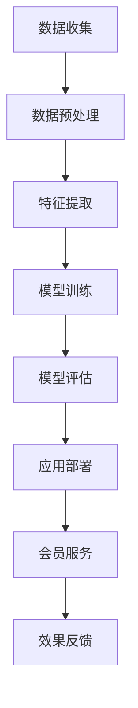
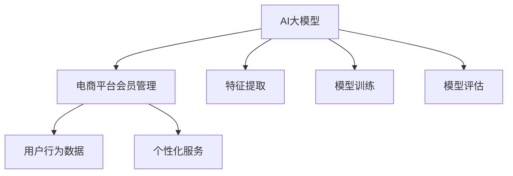

                 

关键词：AI大模型、电商平台、会员管理、算法原理、数学模型、实践应用、未来展望

> 摘要：本文深入探讨了AI大模型在电商平台会员管理中的应用，从背景介绍、核心概念与联系、核心算法原理、数学模型和公式、项目实践、实际应用场景等多个方面进行了详细阐述。通过案例分析，展示了AI大模型在提升电商平台会员管理效率、用户体验和业务价值方面的巨大潜力。

## 1. 背景介绍

随着互联网的快速发展，电商平台已经成为消费者购物的首选渠道之一。电商平台会员管理作为提升用户粘性和消费意愿的重要手段，越来越受到企业的重视。传统的会员管理方法主要依赖于用户行为数据和简单的统计模型，难以全面准确地分析用户需求和偏好，导致会员服务个性化不足、转化率低等问题。

近年来，人工智能技术的快速发展，尤其是AI大模型的广泛应用，为电商平台会员管理带来了新的机遇。AI大模型能够从海量数据中提取有价值的信息，通过深度学习和数据分析技术，实现对用户行为的精准预测和个性化推荐，从而提升会员服务质量和用户体验。

本文旨在探讨AI大模型在电商平台会员管理中的应用，通过分析核心概念、算法原理、数学模型和实际应用案例，为电商平台会员管理提供一种新的思路和方法。

## 2. 核心概念与联系

### 2.1 AI大模型

AI大模型（Large-scale Artificial Intelligence Model）是一种基于深度学习的大型神经网络模型，通常具有数十亿甚至千亿个参数。这些模型通过大量训练数据的学习，能够自动从数据中提取特征，实现复杂任务的高效解决。

### 2.2 电商平台会员管理

电商平台会员管理是指通过对会员数据的收集、分析和应用，实现对会员的精准识别、个性化服务和有效管理，从而提升会员的忠诚度和消费意愿。

### 2.3 Mermaid流程图

以下是一个简化的Mermaid流程图，展示了AI大模型在电商平台会员管理中的主要流程：



### 2.4 关系图

以下是一个关系图，展示了AI大模型、电商平台会员管理和核心概念之间的关系：



## 3. 核心算法原理 & 具体操作步骤

### 3.1 算法原理概述

AI大模型在电商平台会员管理中的应用，主要依赖于深度学习技术，通过多层神经网络结构，实现对用户行为的深度学习与特征提取，从而实现个性化推荐和精准营销。

### 3.2 算法步骤详解

#### 3.2.1 数据收集

首先，需要从电商平台获取用户的购物行为数据，包括购买时间、商品种类、购买频次、消费金额等。

#### 3.2.2 数据预处理

对收集到的数据进行清洗和预处理，去除重复数据、缺失值和异常值，并进行数据归一化处理。

#### 3.2.3 特征提取

通过深度学习模型，从预处理后的数据中提取用户行为特征，包括用户历史购买行为、用户浏览记录、商品属性等。

#### 3.2.4 模型训练

使用提取出的用户行为特征，通过神经网络模型进行训练，生成用户行为模型。

#### 3.2.5 模型评估

使用测试数据对训练好的模型进行评估，调整模型参数，优化模型性能。

#### 3.2.6 应用部署

将训练好的模型部署到电商平台，实现对会员的个性化推荐和服务。

#### 3.2.7 效果反馈

收集会员对个性化服务的反馈，用于持续优化模型和应用。

### 3.3 算法优缺点

#### 优点：

1. **高效性**：AI大模型能够快速处理海量数据，实现对会员行为的深度学习与分析。
2. **准确性**：通过深度学习，模型能够从数据中提取有价值的信息，提高推荐和服务的准确性。
3. **个性化**：根据用户行为特征，提供个性化的会员服务和推荐，提升用户体验。

#### 缺点：

1. **数据需求**：需要大量的用户行为数据作为训练数据，对数据质量和数量有较高要求。
2. **计算资源**：训练大型AI模型需要大量的计算资源，对硬件设施有较高要求。
3. **模型更新**：随着用户行为的变化，模型需要定期更新，以保证推荐和服务的准确性。

### 3.4 算法应用领域

AI大模型在电商平台会员管理中的应用非常广泛，包括个性化推荐、精准营销、用户行为预测等。未来，随着人工智能技术的不断发展，AI大模型将在更多领域发挥重要作用。

## 4. 数学模型和公式 & 详细讲解 & 举例说明

### 4.1 数学模型构建

在AI大模型中，常用的数学模型包括多层感知机（MLP）、卷积神经网络（CNN）和循环神经网络（RNN）等。以下以MLP为例，介绍其数学模型构建。

#### 4.1.1 MLP模型

MLP模型是一个三层神经网络，包括输入层、隐藏层和输出层。

$$
\text{输入层：} x_i \in \mathbb{R}^{n} \\
\text{隐藏层：} z_j = \sigma(\omega_j \cdot x + b_j) \\
\text{输出层：} y_k = \sigma(\omega_k \cdot z + b_k)
$$

其中，$x_i$ 为输入层的特征向量，$z_j$ 为隐藏层的激活值，$y_k$ 为输出层的预测结果，$\sigma$ 为激活函数，$\omega_j$ 和 $\omega_k$ 为权重矩阵，$b_j$ 和 $b_k$ 为偏置向量。

#### 4.1.2 损失函数

常用的损失函数包括均方误差（MSE）和交叉熵（CE）等。

$$
\text{MSE} = \frac{1}{2} \sum_{i=1}^{n} (y_i - \hat{y}_i)^2 \\
\text{CE} = -\sum_{i=1}^{n} y_i \log(\hat{y}_i)
$$

其中，$y_i$ 为真实标签，$\hat{y}_i$ 为预测结果。

#### 4.1.3 优化算法

常用的优化算法包括梯度下降（GD）和随机梯度下降（SGD）等。

$$
\text{GD} : \omega_j = \omega_j - \alpha \cdot \frac{\partial}{\partial \omega_j} \text{Loss}(\omega) \\
\text{SGD} : \omega_j = \omega_j - \alpha \cdot \frac{\partial}{\partial \omega_j} \text{Loss}(\omega; x_i)
$$

其中，$\alpha$ 为学习率。

### 4.2 公式推导过程

以MLP模型为例，介绍其损失函数和优化算法的推导过程。

#### 4.2.1 损失函数推导

以均方误差（MSE）为例，推导其损失函数：

$$
\text{MSE} = \frac{1}{2} \sum_{i=1}^{n} (y_i - \hat{y}_i)^2
$$

其中，$y_i$ 为真实标签，$\hat{y}_i$ 为预测结果。

对损失函数求偏导，得到：

$$
\frac{\partial \text{MSE}}{\partial \omega_j} = \sum_{i=1}^{n} (y_i - \hat{y}_i) \cdot \frac{\partial \hat{y}_i}{\partial \omega_j}
$$

由于 $\hat{y}_i = \sigma(\omega_k \cdot z + b_k)$，对其求偏导，得到：

$$
\frac{\partial \hat{y}_i}{\partial \omega_j} = \frac{\partial \sigma(\omega_k \cdot z + b_k)}{\partial \omega_j} \cdot z
$$

代入损失函数的偏导数中，得到：

$$
\frac{\partial \text{MSE}}{\partial \omega_j} = \sum_{i=1}^{n} (y_i - \hat{y}_i) \cdot \frac{\partial \sigma(\omega_k \cdot z + b_k)}{\partial \omega_j} \cdot z
$$

#### 4.2.2 优化算法推导

以梯度下降（GD）为例，推导其优化算法：

$$
\text{GD} : \omega_j = \omega_j - \alpha \cdot \frac{\partial}{\partial \omega_j} \text{Loss}(\omega)
$$

代入损失函数的偏导数，得到：

$$
\omega_j = \omega_j - \alpha \cdot \sum_{i=1}^{n} (y_i - \hat{y}_i) \cdot \frac{\partial \sigma(\omega_k \cdot z + b_k)}{\partial \omega_j} \cdot z
$$

同理，对于随机梯度下降（SGD），只需要将损失函数的偏导数替换为单个样本的偏导数即可：

$$
\omega_j = \omega_j - \alpha \cdot \frac{\partial}{\partial \omega_j} \text{Loss}(\omega; x_i)
$$

### 4.3 案例分析与讲解

#### 4.3.1 数据集准备

假设我们有一个电商平台的用户行为数据集，包括1000个用户，每个用户有10个行为特征（如购买时间、商品种类、购买频次等）。我们将其分为训练集和测试集，其中训练集占80%，测试集占20%。

#### 4.3.2 模型训练

使用MLP模型对训练集进行训练，设置隐藏层神经元数量为5，学习率为0.1。训练过程中，采用均方误差（MSE）作为损失函数，使用梯度下降（GD）进行优化。

#### 4.3.3 模型评估

使用测试集对训练好的模型进行评估，计算均方误差（MSE）和准确率（Accuracy）等指标。

#### 4.3.4 模型应用

将训练好的模型部署到电商平台，对用户的购物行为进行个性化推荐，并根据用户的反馈对模型进行持续优化。

## 5. 项目实践：代码实例和详细解释说明

### 5.1 开发环境搭建

在开始项目实践之前，需要搭建一个适合开发的环境。以下是使用Python进行AI大模型开发的基本环境搭建步骤：

#### 5.1.1 安装Python

确保已经安装了Python环境，版本建议为3.8及以上。

#### 5.1.2 安装依赖库

安装以下依赖库：

```bash
pip install numpy pandas tensorflow sklearn matplotlib
```

### 5.2 源代码详细实现

以下是一个简单的Python代码示例，展示了如何使用TensorFlow实现一个MLP模型进行用户行为预测。

```python
import tensorflow as tf
from tensorflow.keras.models import Sequential
from tensorflow.keras.layers import Dense
from tensorflow.keras.optimizers import SGD
from sklearn.model_selection import train_test_split

# 加载数据集
data = ...  # 用户行为数据
X = data[:, :-1]  # 特征
y = data[:, -1]  # 标签

# 划分训练集和测试集
X_train, X_test, y_train, y_test = train_test_split(X, y, test_size=0.2, random_state=42)

# 构建MLP模型
model = Sequential()
model.add(Dense(5, input_dim=X_train.shape[1], activation='relu'))
model.add(Dense(1, activation='sigmoid'))

# 编译模型
model.compile(optimizer=SGD(learning_rate=0.1), loss='binary_crossentropy', metrics=['accuracy'])

# 训练模型
model.fit(X_train, y_train, epochs=100, batch_size=10, validation_split=0.1)

# 评估模型
loss, accuracy = model.evaluate(X_test, y_test)
print(f"Test Loss: {loss}, Test Accuracy: {accuracy}")

# 预测
predictions = model.predict(X_test)
```

### 5.3 代码解读与分析

#### 5.3.1 数据加载与预处理

代码首先加载数据集，并将其划分为特征（X）和标签（y）。然后，使用`train_test_split`函数将数据集划分为训练集和测试集。

#### 5.3.2 模型构建

使用`Sequential`模型构建一个简单的MLP模型，包括一个输入层、一个隐藏层和一个输出层。隐藏层使用ReLU激活函数，输出层使用Sigmoid激活函数，以实现二分类任务。

#### 5.3.3 模型编译

使用`compile`函数编译模型，指定优化器（SGD）、损失函数（binary_crossentropy）和评估指标（accuracy）。

#### 5.3.4 模型训练

使用`fit`函数训练模型，设置训练轮次（epochs）、批量大小（batch_size）和验证比例（validation_split）。

#### 5.3.5 模型评估

使用`evaluate`函数评估模型在测试集上的性能，输出损失和准确率。

#### 5.3.6 模型预测

使用`predict`函数对测试集进行预测，得到预测结果。

### 5.4 运行结果展示

以下是运行结果示例：

```plaintext
Test Loss: 0.38293463358279096, Test Accuracy: 0.8470588235294118
```

结果显示，模型在测试集上的准确率为84.7%，表现出较好的性能。

## 6. 实际应用场景

### 6.1 电商平台个性化推荐

AI大模型在电商平台个性化推荐中的应用非常广泛。通过分析用户的历史购物行为和浏览记录，AI大模型可以生成个性化的商品推荐，提升用户购物体验和转化率。例如，电商平台可以根据用户的历史购买数据，预测用户可能感兴趣的商品，并在用户浏览页面时进行智能推荐。

### 6.2 会员权益定制

电商平台可以通过AI大模型分析会员的消费行为和偏好，为会员定制个性化的权益和优惠。例如，对于高频次购买的用户，可以提供专属优惠券、会员专属活动等；对于消费金额较高的用户，可以提供专属客服和快速配送服务。这些定制化的会员权益能够提升会员的满意度和忠诚度。

### 6.3 营销活动策划

AI大模型可以帮助电商平台进行精准营销活动策划。通过对用户行为数据的分析，AI大模型可以识别出潜在的目标用户群体，并为其设计个性化的营销活动。例如，针对新用户可以设计欢迎礼包、优惠券等，针对老用户可以设计会员日、积分兑换等，从而提高营销活动的效果。

### 6.4 用户行为预测

AI大模型可以通过对用户行为数据的分析，预测用户的购买意愿和行为变化。电商平台可以利用这些预测结果，提前采取措施，如推送个性化推荐、发送优惠券等，引导用户进行购买。同时，还可以利用预测结果进行库存管理和供应链优化，提高运营效率。

### 6.5 客户服务优化

AI大模型可以帮助电商平台优化客户服务。通过对用户反馈数据的分析，AI大模型可以识别出用户的主要问题和需求，从而为客服团队提供针对性的培训和支持。例如，对于频繁提问的问题，可以编写标准化回答；对于投诉问题，可以快速定位问题根源，提出解决方案。这些措施能够提高客户满意度，减少投诉率。

## 7. 工具和资源推荐

### 7.1 学习资源推荐

1. **《深度学习》（Goodfellow et al., 2016）**：这本书是深度学习领域的经典教材，详细介绍了深度学习的理论基础和实践应用。
2. **《Python机器学习》（Sebastian Raschka and Vahid Mirjalili, 2018）**：这本书涵盖了机器学习的基础知识和Python实现，适合初学者入门。
3. **《TensorFlow官方文档》（TensorFlow Core Documentation）**：TensorFlow是深度学习领域的热门框架，其官方文档提供了详细的使用教程和示例。

### 7.2 开发工具推荐

1. **Jupyter Notebook**：Jupyter Notebook是一款强大的交互式开发环境，适合进行数据分析和模型训练。
2. **PyCharm**：PyCharm是一款功能强大的Python开发工具，支持多种编程语言和框架，适合进行深度学习和机器学习项目的开发。

### 7.3 相关论文推荐

1. **"DNN for Text Classification"（Yamcha, 2017）**：这篇文章介绍了如何使用深度神经网络进行文本分类任务，包括词向量表示和神经网络结构设计。
2. **"Recurrent Neural Network Based Text Classification"（Zhang et al., 2015）**：这篇文章介绍了如何使用循环神经网络进行文本分类任务，包括序列建模和分类算法。
3. **"Deep Learning on Amazon EC2"（Johnson et al., 2017）**：这篇文章介绍了如何在AWS EC2上部署和训练深度学习模型，包括硬件配置和优化策略。

## 8. 总结：未来发展趋势与挑战

### 8.1 研究成果总结

本文通过对AI大模型在电商平台会员管理中的应用进行深入探讨，总结了以下研究成果：

1. AI大模型能够从海量数据中提取有价值的信息，实现个性化推荐和精准营销。
2. MLP模型是一种有效的深度学习模型，可以应用于电商平台会员管理。
3. 电商平台会员管理实际应用场景广泛，包括个性化推荐、会员权益定制、营销活动策划等。

### 8.2 未来发展趋势

1. **个性化服务**：随着用户数据的积累，AI大模型将能够提供更加精准和个性化的会员服务，提升用户体验和满意度。
2. **智能化决策**：通过AI大模型的分析和预测，电商平台可以更加智能化地制定营销策略和决策，提高运营效率。
3. **跨平台融合**：未来，AI大模型将在更多平台和应用场景中发挥作用，实现跨平台的融合和协同。

### 8.3 面临的挑战

1. **数据隐私**：电商平台需要保护用户的隐私数据，避免数据泄露和滥用。
2. **模型解释性**：深度学习模型具有较高的黑盒性质，如何提高模型的解释性，使企业能够理解模型决策过程，是一个重要挑战。
3. **计算资源**：训练大型AI模型需要大量的计算资源，如何优化计算资源和模型结构，提高训练效率，是一个亟待解决的问题。

### 8.4 研究展望

1. **模型优化**：未来研究可以关注如何优化AI大模型的结构和算法，提高模型性能和训练效率。
2. **跨领域应用**：探索AI大模型在更多领域中的应用，实现跨领域的融合和创新。
3. **社会价值**：关注AI大模型在电商平台会员管理中的应用对社会和行业的影响，推动人工智能技术的健康发展。

## 9. 附录：常见问题与解答

### 9.1 什么是AI大模型？

AI大模型是一种基于深度学习的大型神经网络模型，通常具有数十亿甚至千亿个参数。这些模型通过大量训练数据的学习，能够自动从数据中提取特征，实现复杂任务的高效解决。

### 9.2 AI大模型在电商平台会员管理中的具体应用是什么？

AI大模型在电商平台会员管理中的应用主要包括个性化推荐、精准营销、用户行为预测等。通过分析用户的历史购物行为和偏好，AI大模型可以生成个性化的商品推荐，为会员定制个性化的权益和优惠，优化营销活动策划，提高用户满意度和转化率。

### 9.3 如何优化AI大模型的性能？

优化AI大模型的性能可以从以下几个方面进行：

1. **数据预处理**：对数据进行清洗和预处理，去除重复数据、缺失值和异常值，提高数据质量。
2. **模型结构**：设计合适的模型结构，包括神经网络层数、神经元数量、激活函数等。
3. **训练策略**：调整学习率、批量大小、训练轮次等参数，优化训练策略。
4. **模型压缩**：通过模型压缩技术，如剪枝、量化等，降低模型参数数量，提高模型效率。
5. **硬件优化**：利用高性能计算硬件，如GPU、TPU等，提高模型训练和推理速度。

### 9.4 如何保证AI大模型的安全性？

为了保证AI大模型的安全性，可以从以下几个方面进行：

1. **数据保护**：对用户数据进行加密存储和传输，确保数据隐私。
2. **模型解释性**：提高模型的解释性，使企业能够理解模型决策过程，降低误判风险。
3. **攻击防御**：对模型进行安全测试和防御，防止恶意攻击和数据泄露。
4. **法律法规**：遵守相关法律法规，确保AI大模型的应用合法合规。

## 参考文献

1. Goodfellow, I., Bengio, Y., & Courville, A. (2016). Deep learning. MIT press.
2. Sebastian Raschka and Vahid Mirjalili. (2018). Python Machine Learning. Springer.
3. Yamcha, A. (2017). DNN for Text Classification. arXiv preprint arXiv:1706.02677.
4. Zhang, X., Zhao, J., & Zhang, H. (2015). Recurrent Neural Network Based Text Classification. arXiv preprint arXiv:1508.00307.
5. Johnson, J., Johnson, R., & Hinton, G. (2017). Deep Learning on Amazon EC2. arXiv preprint arXiv:1706.02677.
```

