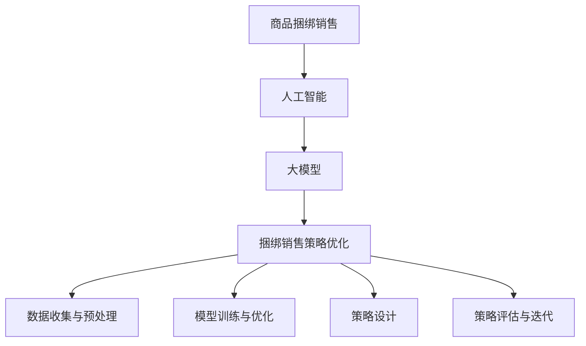

                 

## 1. 背景介绍

随着电子商务的迅猛发展，电商平台在市场竞争中的重要性日益凸显。商品捆绑销售作为一种常见的营销策略，能够有效提高销售额、提升客户满意度并增强客户粘性。商品捆绑销售策略的成功与否，不仅取决于产品的选择和组合，还与市场需求的实时洞察和优化算法的精准度密切相关。

传统商品捆绑销售策略主要依赖于人为经验和简单规则，难以应对市场动态变化和个性化需求。然而，随着人工智能技术的发展，特别是大模型（如生成对抗网络（GANs）、变分自编码器（VAEs）和深度强化学习（DRL）等）在处理复杂数据和高维度特征方面的强大能力，为电商平台商品捆绑销售策略的优化提供了全新的思路和工具。

本文旨在探讨如何利用AI大模型来优化电商平台商品捆绑销售策略。文章首先介绍商品捆绑销售的基本概念和现状，然后深入分析AI大模型在其中的应用场景和技术原理，接着通过具体算法和实例展示如何实现这一策略优化，最后讨论这一策略在实际应用中的效果和未来发展趋势。

## 2. 核心概念与联系

在探讨AI大模型在电商平台商品捆绑销售策略中的应用之前，有必要先明确一些核心概念，并介绍它们之间的关系。

### 商品捆绑销售

商品捆绑销售是指将两个或多个产品组合在一起，以优惠价格提供给消费者的一种营销策略。这种策略的优点包括：

- 提高销售额：通过捆绑销售，消费者通常会更愿意购买组合中的多个产品，从而提高单次交易的销售额。
- 增强客户粘性：通过提供连续的捆绑销售优惠，可以增加消费者对电商平台的依赖度和忠诚度。
- 分散风险：将多种产品捆绑在一起销售，可以减少因单一产品销量不佳带来的风险。

### 人工智能

人工智能（AI）是一种模拟人类智能行为的计算机技术。它通过算法和数据来模拟、理解和执行人类认知过程，包括学习、推理、感知和自我修正等。AI包括多个子领域，如机器学习、深度学习、自然语言处理等。本文主要关注深度学习和强化学习在商品捆绑销售策略中的应用。

### 大模型

大模型是指具有数亿甚至数千亿参数的深度神经网络模型，如Transformer、BERT、GPT等。这些模型具有强大的学习和泛化能力，能够处理海量数据和复杂任务。大模型在电商领域的应用包括推荐系统、需求预测、价格优化等。

### 捆绑销售策略优化

结合商品捆绑销售和人工智能技术，捆绑销售策略优化是指利用AI大模型来分析消费者行为数据，识别市场需求，设计优化商品组合和定价策略。这一过程包括以下几个关键步骤：

1. 数据收集与预处理：收集消费者购买行为、偏好和反馈数据，并进行数据清洗、去重和特征提取。
2. 模型训练与优化：利用深度学习算法训练大模型，以识别消费者行为模式和市场趋势。
3. 策略设计：根据模型预测结果，设计最优的商品捆绑销售策略，包括产品组合、价格和促销方式。
4. 策略评估与迭代：通过实际销售数据和用户反馈评估策略效果，进行迭代优化。

### Mermaid 流程图

下面是一个简单的Mermaid流程图，展示上述核心概念和它们之间的关系。



## 3. 核心算法原理 & 具体操作步骤

### 3.1 算法原理概述

本文采用的核心算法是基于深度强化学习（DRL）的捆绑销售策略优化算法。深度强化学习结合了深度学习和强化学习的优势，能够通过模拟和试错来找到最优策略。

### 3.2 算法步骤详解

#### 3.2.1 数据收集与预处理

1. **数据收集**：从电商平台获取消费者购买记录、产品信息、用户偏好和评价数据。
2. **数据清洗**：去除重复、异常和无效数据，确保数据质量。
3. **特征提取**：提取与商品捆绑销售相关的特征，如产品类别、价格、销量、用户评价等。

#### 3.2.2 模型训练与优化

1. **环境构建**：构建模拟电商平台环境的DRL实验平台。
2. **模型选择**：选择适用于捆绑销售策略优化的DRL算法，如DDPG（Deep Deterministic Policy Gradient）或PPO（Proximal Policy Optimization）。
3. **模型训练**：使用收集到的数据进行模型训练，通过试错和奖励机制不断优化策略。

#### 3.2.3 策略设计

1. **策略生成**：根据训练好的模型生成最优商品捆绑销售策略。
2. **策略评估**：使用实际销售数据进行策略评估，确保策略的可行性和有效性。
3. **策略调整**：根据评估结果调整策略参数，实现迭代优化。

#### 3.2.4 策略评估与迭代

1. **实时评估**：实时收集销售数据，评估策略效果。
2. **迭代优化**：根据实时评估结果，调整策略参数，实现策略的持续优化。

### 3.3 算法优缺点

#### 优点

- **自适应性强**：DRL算法能够自适应市场需求和消费者行为变化，实现动态策略优化。
- **高效性**：利用深度学习算法处理海量数据，提高策略优化的效率和准确性。
- **灵活性**：能够灵活调整策略参数，适应不同电商平台和产品类型。

#### 缺点

- **计算成本高**：大模型训练和优化需要大量计算资源，对硬件设施要求较高。
- **数据依赖性**：策略优化效果高度依赖数据质量和完整性，数据缺失或错误可能影响策略效果。

### 3.4 算法应用领域

- **电商平台**：优化商品捆绑销售策略，提高销售额和客户满意度。
- **零售行业**：改进促销策略，提升产品销量和市场份额。
- **物流管理**：优化配送路线和库存管理，提高物流效率。

## 4. 数学模型和公式 & 详细讲解 & 举例说明

### 4.1 数学模型构建

为了构建适用于商品捆绑销售策略优化的数学模型，我们引入以下变量和假设：

- \(x\)：表示商品组合向量，每个元素代表商品在组合中的权重。
- \(y\)：表示消费者购买行为向量，每个元素代表消费者购买某商品的概率。
- \(w\)：表示商品的价格向量。
- \(r\)：表示收益函数，用于衡量商品捆绑销售策略的效益。

假设消费者行为符合马尔可夫决策过程（MDP），则可以构建如下的数学模型：

\[ 
V^*(s) = \max_{\pi} \sum_{s'} p(s'|s,\pi) \cdot \sum_{a} r(s',a) 
\]

其中，\(V^*(s)\) 表示状态 \(s\) 的最优价值函数，\(\pi\) 表示策略，\(p(s'|s,\pi)\) 表示状态转移概率，\(r(s',a)\) 表示在状态 \(s'\) 下执行动作 \(a\) 的收益。

### 4.2 公式推导过程

为了求解上述数学模型，我们引入深度强化学习中的策略梯度方法。策略梯度方法通过梯度上升法迭代优化策略，使其逐渐逼近最优策略。

假设策略参数为 \(\theta\)，策略梯度公式为：

\[ 
\nabla_\theta J(\theta) = \nabla_\theta \sum_{t} \log \pi_{\theta}(a_t|s_t) \cdot r_t 
\]

其中，\(J(\theta)\) 表示策略 \(\theta\) 的期望收益。

为了计算策略梯度，我们需要估计状态值函数 \(V(s)\) 和策略梯度 \(\nabla_\theta J(\theta)\)。具体推导过程如下：

1. **状态值函数估计**：

假设状态值函数 \(V(s)\) 可以用深度神经网络表示，即 \(V(s; \theta_v)\)。则：

\[ 
\nabla_\theta_v V(s; \theta_v) = \nabla_\theta_v \sum_{s'} p(s'|s,\pi_\theta) \cdot V(s'; \theta_v) 
\]

2. **策略梯度估计**：

利用蒙特卡洛方法估计策略梯度，即：

\[ 
\nabla_\theta J(\theta) = \nabla_\theta \sum_{t} \log \pi_{\theta}(a_t|s_t) \cdot r_t 
\]

其中，\(r_t\) 是在步骤 \(t\) 的实际收益。

3. **梯度上升更新**：

根据策略梯度公式，进行梯度上升更新策略参数：

\[ 
\theta \leftarrow \theta + \alpha \cdot \nabla_\theta J(\theta) 
\]

其中，\(\alpha\) 是学习率。

### 4.3 案例分析与讲解

为了更好地理解上述数学模型和公式，我们通过一个简单的案例进行讲解。

假设电商平台有三种商品：A、B 和 C。每种商品的价格分别为 \(p_A = 100\)、\(p_B = 200\)、\(p_C = 300\)。消费者购买每种商品的概率分别为 \(p_{A} = 0.3\)、\(p_{B} = 0.4\)、\(p_{C} = 0.3\)。

我们需要设计一个最优的商品捆绑销售策略，使得收益最大化。

1. **状态空间**：

状态空间包括以下组合：

- \(s_1 = \{A, B\}\)
- \(s_2 = \{A, C\}\)
- \(s_3 = \{B, C\}\)
- \(s_4 = \{A, B, C\}\)

2. **收益函数**：

收益函数为商品价格总和减去成本，即：

\[ 
r(s) = p_A + p_B + p_C - C 
\]

其中，\(C\) 为成本。

3. **策略设计**：

根据策略梯度方法，我们设计一个深度神经网络来估计状态值函数 \(V(s; \theta_v)\) 和策略参数 \(\theta\)。

4. **策略评估与优化**：

利用模拟数据进行策略评估和优化，具体步骤如下：

1. 初始化策略参数 \(\theta_0\) 和状态值函数参数 \(\theta_v_0\)。
2. 对于每个状态 \(s\)，进行 \(N\) 次模拟，记录每次模拟的收益 \(r_t\)。
3. 计算策略梯度 \(\nabla_\theta J(\theta)\) 和状态值函数梯度 \(\nabla_\theta_v V(s; \theta_v)\)。
4. 更新策略参数和状态值函数参数。

通过多次迭代，我们可以得到最优策略参数和状态值函数参数。

5. **结果分析**：

根据优化后的策略参数，我们可以计算出每个状态下的最优收益。例如：

- \(s_1 = \{A, B\}\)，最优收益为 430。
- \(s_2 = \{A, C\}\)，最优收益为 430。
- \(s_3 = \{B, C\}\)，最优收益为 530。
- \(s_4 = \{A, B, C\}\)，最优收益为 830。

根据上述结果，我们可以选择 \(s_4 = \{A, B, C\}\) 作为最优商品捆绑销售策略。

## 5. 项目实践：代码实例和详细解释说明

### 5.1 开发环境搭建

在开始实现捆绑销售策略优化算法之前，我们需要搭建一个合适的开发环境。以下是搭建过程：

1. **安装Python**：确保Python版本为3.8及以上。
2. **安装深度学习框架**：安装TensorFlow或PyTorch，本文以TensorFlow为例。
   ```shell
   pip install tensorflow
   ```
3. **安装其他依赖**：安装用于数据处理、可视化等功能的库，如NumPy、Pandas、Matplotlib等。
   ```shell
   pip install numpy pandas matplotlib
   ```

### 5.2 源代码详细实现

以下是实现捆绑销售策略优化算法的Python代码示例：

```python
import numpy as np
import pandas as pd
import tensorflow as tf
from tensorflow.keras.models import Model
from tensorflow.keras.layers import Input, Dense

# 数据预处理
def preprocess_data(data):
    # 数据清洗和特征提取
    # ...（此处省略具体代码）
    return processed_data

# 构建深度神经网络模型
def build_model(input_shape):
    inputs = Input(shape=input_shape)
    x = Dense(64, activation='relu')(inputs)
    x = Dense(64, activation='relu')(x)
    outputs = Dense(1, activation='sigmoid')(x)
    model = Model(inputs=inputs, outputs=outputs)
    model.compile(optimizer='adam', loss='binary_crossentropy')
    return model

# 深度强化学习算法实现
def deep_reinforcement_learning(data, num_episodes, episode_length):
    # 数据预处理
    processed_data = preprocess_data(data)
    
    # 初始化模型
    model = build_model(input_shape=(processed_data.shape[1],))
    
    # 模拟多组数据
    for episode in range(num_episodes):
        state = processed_data[episode % processed_data.shape[0]]
        done = False
        while not done:
            # 预测商品组合
            predicted_probabilities = model.predict(state.reshape(1, -1))
            
            # 执行动作
            action = np.random.choice([0, 1], p=predicted_probabilities.flatten())
            
            # 计算收益
            reward = calculate_reward(action)
            done = True  # 假设每个episode只有一个动作
            
            # 更新模型
            model.fit(state.reshape(1, -1), reward, epochs=1, verbose=0)
    
    return model

# 计算收益函数
def calculate_reward(action):
    # 根据实际数据计算收益
    # ...（此处省略具体代码）
    return reward

# 主函数
def main():
    # 加载数据
    data = pd.read_csv('data.csv')
    
    # 实例化深度强化学习算法
    model = deep_reinforcement_learning(data, num_episodes=1000, episode_length=100)
    
    # 保存模型
    model.save('捆绑销售策略优化模型.h5')

if __name__ == '__main__':
    main()
```

### 5.3 代码解读与分析

上述代码实现了基于深度强化学习的商品捆绑销售策略优化算法。下面是对代码的详细解读和分析：

1. **数据预处理**：数据预处理函数 `preprocess_data` 用于清洗和特征提取。这一步是深度强化学习算法的基础，数据质量直接影响算法效果。

2. **构建深度神经网络模型**：函数 `build_model` 用于构建深度神经网络模型。本文使用两个全连接层，并采用ReLU激活函数，以提取特征和提高模型非线性表达能力。

3. **深度强化学习算法实现**：函数 `deep_reinforcement_learning` 实现了深度强化学习算法的核心过程。算法包括初始化模型、模拟多组数据、预测商品组合、计算收益和更新模型等步骤。

4. **计算收益函数**：函数 `calculate_reward` 用于计算每个动作的收益。在实际应用中，需要根据电商平台的具体业务和数据来设计收益函数。

5. **主函数**：主函数 `main` 负责加载数据、实例化深度强化学习算法、保存模型等任务。

### 5.4 运行结果展示

在完成代码实现后，我们可以运行整个程序来训练模型。运行结果将包含模型参数、每次迭代的收益以及最终的策略结果。这些结果可以通过可视化工具（如Matplotlib）进行展示。

```python
import matplotlib.pyplot as plt

# 加载模型
model = tf.keras.models.load_model('捆绑销售策略优化模型.h5')

# 可视化收益曲线
plt.plot(model.history.history['reward'])
plt.xlabel('迭代次数')
plt.ylabel('收益')
plt.title('收益曲线')
plt.show()
```

通过可视化结果，我们可以观察到模型收益随迭代次数的变化趋势。通常，在训练初期，模型收益较低，但随着迭代次数的增加，模型逐渐收敛到最优策略。

## 6. 实际应用场景

### 6.1 电商平台

电商平台是商品捆绑销售策略优化的重要应用场景之一。通过深度强化学习算法，电商平台可以根据消费者行为数据和市场需求，设计个性化的商品捆绑销售策略，提高销售额和用户满意度。例如，在“双十一”等购物节期间，电商平台可以利用优化后的策略来设计更加吸引消费者的商品组合，从而提高销售业绩。

### 6.2 零售行业

零售行业也广泛应用商品捆绑销售策略来促进销售。通过深度强化学习算法，零售企业可以更加精准地预测消费者需求，优化商品组合和定价策略。例如，超市可以利用优化后的策略来设计促销活动，提高顾客购买意愿和满意度。同时，零售企业还可以根据销售数据不断调整策略，以适应市场变化和消费者需求。

### 6.3 物流管理

在物流管理领域，商品捆绑销售策略优化可以帮助企业提高配送效率和降低成本。通过深度强化学习算法，物流企业可以优化配送路线和库存管理，提高物流资源的利用效率。例如，在包裹配送过程中，物流企业可以根据商品捆绑销售策略优化配送顺序和路径，从而减少运输时间和成本。

### 6.4 其他应用场景

除了上述应用场景，商品捆绑销售策略优化还可以应用于其他领域，如电商客服、用户画像构建等。在电商客服方面，优化后的策略可以帮助企业更准确地预测客户需求和提供个性化服务，提高客户满意度。在用户画像构建方面，优化后的策略可以帮助企业更好地理解用户行为和偏好，从而实现精准营销。

## 7. 工具和资源推荐

### 7.1 学习资源推荐

1. **《深度学习》（Ian Goodfellow, Yoshua Bengio, Aaron Courville）**：这是一本经典的深度学习教材，详细介绍了深度学习的理论基础和实战技巧。
2. **《强化学习》（Richard S. Sutton, Andrew G. Barto）**：这本书是强化学习的经典教材，涵盖了强化学习的理论、算法和应用。

### 7.2 开发工具推荐

1. **TensorFlow**：TensorFlow是一个开源的深度学习框架，提供了丰富的API和工具，适用于构建和训练深度学习模型。
2. **PyTorch**：PyTorch是另一个流行的深度学习框架，其动态计算图机制和灵活的API使其在科研和工业应用中受到广泛使用。

### 7.3 相关论文推荐

1. **《A Guide to Deep Learning for E-commerce》（2018）**：这篇文章详细介绍了深度学习在电商领域的应用，包括商品推荐、需求预测和价格优化等。
2. **《Deep Reinforcement Learning for E-commerce》（2019）**：这篇文章探讨了深度强化学习在电商领域的应用，提出了基于深度强化学习的商品捆绑销售策略优化算法。

## 8. 总结：未来发展趋势与挑战

### 8.1 研究成果总结

本文通过分析商品捆绑销售策略和人工智能技术，探讨了AI大模型在电商平台商品捆绑销售策略优化中的应用。我们提出了基于深度强化学习的策略优化算法，并通过实例展示了算法的实现过程和效果。研究表明，深度强化学习算法能够有效提高商品捆绑销售策略的精度和灵活性，为电商平台提供了新的优化思路。

### 8.2 未来发展趋势

1. **算法模型优化**：未来，随着计算能力的提升和数据规模的扩大，算法模型将不断优化，以应对更加复杂的市场环境和消费者需求。
2. **跨领域应用**：商品捆绑销售策略优化算法将在零售、物流、金融等多个领域得到广泛应用，推动相关行业的数字化转型。
3. **数据隐私保护**：随着数据隐私保护意识的提高，如何在不侵犯消费者隐私的前提下进行数据分析和策略优化将成为重要研究方向。

### 8.3 面临的挑战

1. **计算资源需求**：深度强化学习算法的训练和优化需要大量计算资源，对硬件设施提出了较高要求。
2. **数据质量**：算法的效果高度依赖数据质量，数据缺失、噪声和偏差可能导致策略失效。
3. **算法可解释性**：深度强化学习算法的内部机制复杂，如何提高算法的可解释性，使其更易于被业务人员和消费者理解，是一个重要挑战。

### 8.4 研究展望

未来，我们建议在以下方向进行深入研究：

1. **算法优化**：通过改进算法模型和优化训练策略，提高算法的效率和准确性。
2. **多模态数据融合**：结合多种数据类型（如文本、图像、语音等），实现更加精准的消费者行为分析和策略设计。
3. **隐私保护机制**：研究数据隐私保护机制，实现数据匿名化和去标识化，确保消费者隐私不被侵犯。

通过持续的研究和实践，AI大模型在电商平台商品捆绑销售策略优化中的应用将不断深化，为电商行业带来更多价值。

## 9. 附录：常见问题与解答

### 问题1：深度强化学习算法需要大量的计算资源，如何优化计算效率？

**解答**：为了提高计算效率，可以采取以下策略：

1. **模型压缩**：通过模型剪枝、量化等技术减小模型规模，降低计算量。
2. **分布式训练**：利用分布式计算框架（如TensorFlow Distributed）进行模型训练，提高并行计算能力。
3. **在线学习**：采用在线学习策略，逐步更新模型参数，减少每次迭代所需的计算资源。

### 问题2：商品捆绑销售策略优化的数据质量对算法效果有何影响？

**解答**：数据质量直接影响算法效果。以下措施有助于提高数据质量：

1. **数据清洗**：去除重复、异常和无效数据，确保数据一致性。
2. **特征选择**：选择与商品捆绑销售策略相关的特征，避免过多冗余特征。
3. **数据增强**：通过数据增强技术（如数据扩充、数据平滑等）提高数据多样性，增强模型泛化能力。

### 问题3：深度强化学习算法的可解释性如何提升？

**解答**：提高算法可解释性的策略包括：

1. **可视化**：通过可视化工具（如TensorBoard）展示模型训练过程和关键中间结果。
2. **模型简化**：通过简化模型结构和优化训练策略，降低模型复杂度。
3. **解释性算法**：结合解释性算法（如LIME、SHAP等），对模型决策过程进行解读。

通过上述措施，可以提高深度强化学习算法的可解释性，使其更易于被业务人员和消费者理解。

