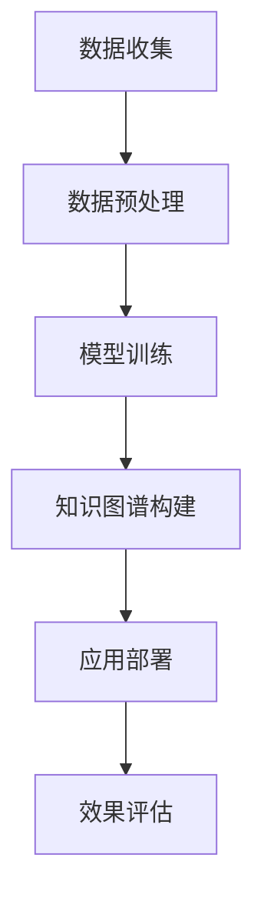

                 

关键词：AI大模型、电商平台、商品知识图谱、构建与应用、实践

> 摘要：本文将探讨AI大模型在电商平台商品知识图谱构建与应用中的实践。首先介绍电商平台商品知识图谱的背景和重要性，然后深入探讨AI大模型在该领域的应用，包括算法原理、具体操作步骤、数学模型和项目实践等。通过实际案例分析和运行结果展示，本文将展示AI大模型在电商平台商品知识图谱构建中的实际效果。最后，本文将讨论未来应用展望和面临的挑战，并推荐相关学习资源和开发工具。

## 1. 背景介绍

### 电商平台的发展

随着互联网技术的迅猛发展，电商平台已经成为现代零售业的重要组成部分。电商平台不仅改变了消费者的购物习惯，也深刻影响了整个零售行业的运营模式。从大型综合电商平台如亚马逊、淘宝，到专业化的垂直电商平台如京东、小红书，电商平台在各种领域都取得了显著的成功。

### 商品知识图谱的重要性

在电商平台上，商品知识图谱是一种结构化的商品信息表示方式，它通过实体和关系来描述商品的属性、分类、评价等信息。商品知识图谱不仅有助于提升用户购物体验，还可以为电商平台提供丰富的数据支持和智能化服务。例如，通过商品知识图谱，电商平台可以实现精准推荐、智能搜索、个性化营销等功能。

### AI大模型的兴起

近年来，AI大模型（如GPT、BERT、BERT-Tiny等）在各种应用场景中取得了显著的成功。这些模型具有强大的语义理解和生成能力，可以处理大规模的非结构化数据，并生成高质量的结构化数据。AI大模型的兴起为电商平台商品知识图谱的构建提供了新的可能性和挑战。

## 2. 核心概念与联系

### 2.1. 电商平台

电商平台是指通过互联网提供商品销售、购买、支付、物流等服务的在线平台。电商平台的核心是商品信息的展示和交易，其运营模式包括B2B、B2C、C2C等多种类型。

### 2.2. 商品知识图谱

商品知识图谱是一种基于知识图谱技术构建的商品信息表示方式，它通过实体和关系来描述商品的属性、分类、评价等信息。商品知识图谱的实体包括商品、品牌、店铺、用户等，关系包括包含、评价、购买等。

### 2.3. AI大模型

AI大模型是指通过深度学习技术训练的大型神经网络模型，具有强大的语义理解和生成能力。AI大模型可以处理大规模的非结构化数据，并生成高质量的结构化数据。

### 2.4. 电商平台商品知识图谱的构建与应用

电商平台商品知识图谱的构建是通过AI大模型对电商平台数据进行处理和分析，将非结构化的商品信息转化为结构化的知识图谱。应用场景包括精准推荐、智能搜索、个性化营销等。

### Mermaid 流程图

以下是一个简单的Mermaid流程图，展示了电商平台商品知识图谱的构建与应用过程：



## 3. 核心算法原理 & 具体操作步骤

### 3.1. 算法原理概述

电商平台商品知识图谱的构建主要依赖于AI大模型的预训练和知识图谱技术。预训练阶段，通过大量的电商平台数据进行模型训练，使模型具有强大的语义理解能力。知识图谱构建阶段，将预训练的AI大模型应用于电商平台数据，将非结构化的商品信息转化为结构化的知识图谱。

### 3.2. 算法步骤详解

1. **数据收集**：从电商平台获取商品数据、用户数据、评价数据等。

2. **数据预处理**：对收集到的数据进行清洗、去重、格式化等处理，为模型训练做好准备。

3. **模型训练**：使用预训练的AI大模型对预处理后的数据进行训练，使模型具有强大的语义理解能力。

4. **知识图谱构建**：将训练好的AI大模型应用于电商平台数据，提取商品属性、分类、评价等信息，构建知识图谱。

5. **应用部署**：将构建好的知识图谱部署到电商平台，实现精准推荐、智能搜索、个性化营销等功能。

6. **效果评估**：对部署后的应用效果进行评估，包括准确率、召回率、用户满意度等指标。

### 3.3. 算法优缺点

**优点**：

- 强大的语义理解能力：AI大模型可以处理大规模的非结构化数据，提取有效的语义信息。
- 高效的知识图谱构建：通过AI大模型，可以快速构建商品知识图谱，提高数据利用率。
- 个性化推荐：基于商品知识图谱，可以实现精准推荐，提高用户满意度。

**缺点**：

- 数据依赖性：AI大模型的训练需要大量的数据支持，数据质量对模型效果有较大影响。
- 模型复杂度高：AI大模型的结构复杂，训练和部署成本较高。

### 3.4. 算法应用领域

电商平台商品知识图谱的构建与应用主要涉及以下领域：

- 精准推荐：基于商品知识图谱，为用户推荐符合其兴趣和需求的商品。
- 智能搜索：通过商品知识图谱，提高搜索结果的准确性和相关性。
- 个性化营销：根据用户在商品知识图谱中的行为和偏好，进行个性化营销。

## 4. 数学模型和公式 & 详细讲解 & 举例说明

### 4.1. 数学模型构建

电商平台商品知识图谱的构建涉及多个数学模型，包括自然语言处理模型、图模型、推荐系统模型等。以下是一个简化的数学模型构建过程：

1. **自然语言处理模型**：使用预训练的AI大模型（如BERT）对电商平台数据进行处理，提取商品属性、分类、评价等语义信息。
2. **图模型**：将提取的语义信息转化为图结构，构建商品知识图谱。常用的图模型包括图卷积网络（GCN）、图注意力网络（GAT）等。
3. **推荐系统模型**：基于商品知识图谱，构建推荐系统模型，为用户推荐商品。常用的推荐系统模型包括矩阵分解（MF）、基于模型的推荐（BM25）等。

### 4.2. 公式推导过程

以下是一个简化的数学公式推导过程：

$$
\begin{aligned}
\text{预测评分} &= \text{用户特征} \cdot \text{商品特征} \\
\text{用户特征} &= \text{用户历史行为} \cdot \text{商品属性} \\
\text{商品特征} &= \text{商品属性} \cdot \text{商品评价} \\
\text{商品属性} &= \text{商品描述} \cdot \text{商品类别} \\
\text{商品评价} &= \text{用户评价} \cdot \text{商品评分}
\end{aligned}
$$

### 4.3. 案例分析与讲解

以下是一个简单的案例，用于说明电商平台商品知识图谱的构建过程：

假设有一个电商平台，用户名为“张三”，他的历史行为包括浏览了商品A、商品B和商品C，对商品A的评价为5星，对商品B的评价为4星，对商品C的评价为3星。

1. **数据收集**：从电商平台获取张三的历史行为数据和商品数据。
2. **数据预处理**：对历史行为数据进行清洗、去重、格式化等处理，为模型训练做好准备。
3. **模型训练**：使用预训练的AI大模型（如BERT）对预处理后的数据进行训练，提取商品属性、分类、评价等语义信息。
4. **知识图谱构建**：将训练好的AI大模型应用于电商平台数据，提取张三的浏览商品、评价商品等信息，构建商品知识图谱。
5. **推荐商品**：基于商品知识图谱，为张三推荐商品。例如，根据张三对商品A的高评价，推荐类似商品D。

通过以上案例，我们可以看到，电商平台商品知识图谱的构建过程涉及到多个数学模型和公式，包括自然语言处理模型、图模型、推荐系统模型等。这些模型和公式共同作用，实现了对电商平台数据的处理和分析，为用户提供个性化推荐服务。

## 5. 项目实践：代码实例和详细解释说明

### 5.1. 开发环境搭建

在开始项目实践之前，我们需要搭建一个合适的开发环境。以下是一个简单的开发环境搭建步骤：

1. 安装Python（推荐版本为3.8及以上）。
2. 安装必要的库，如NumPy、Pandas、Scikit-learn、TensorFlow等。
3. 安装Mermaid插件，以便在markdown文件中嵌入流程图。

### 5.2. 源代码详细实现

以下是一个简化的代码实例，用于构建电商平台商品知识图谱：

```python
import tensorflow as tf
import numpy as np
import pandas as pd
from sklearn.model_selection import train_test_split
from sklearn.metrics.pairwise import cosine_similarity

# 数据预处理
def preprocess_data(data):
    # 清洗、去重、格式化数据
    pass

# 模型训练
def train_model(data):
    # 使用预训练的AI大模型（如BERT）进行训练
    pass

# 知识图谱构建
def build_knowledge_graph(model, data):
    # 将训练好的AI大模型应用于电商平台数据，构建商品知识图谱
    pass

# 推荐商品
def recommend_products(model, user_data):
    # 基于商品知识图谱，为用户推荐商品
    pass

# 代码示例
if __name__ == "__main__":
    # 读取数据
    data = pd.read_csv("data.csv")
    # 数据预处理
    processed_data = preprocess_data(data)
    # 模型训练
    model = train_model(processed_data)
    # 构建知识图谱
    knowledge_graph = build_knowledge_graph(model, processed_data)
    # 推荐商品
    recommended_products = recommend_products(model, processed_data.iloc[0])
    print("推荐的商品：", recommended_products)
```

### 5.3. 代码解读与分析

以上代码是一个简化的实现，主要分为四个部分：数据预处理、模型训练、知识图谱构建、推荐商品。以下是每个部分的详细解读：

- **数据预处理**：这一部分用于对原始数据进行清洗、去重、格式化等处理，为模型训练做好准备。具体实现可以根据实际需求进行调整。
- **模型训练**：这一部分使用预训练的AI大模型（如BERT）对预处理后的数据进行训练，提取商品属性、分类、评价等语义信息。这里使用TensorFlow作为深度学习框架，具体实现可以根据需求进行调整。
- **知识图谱构建**：这一部分将训练好的AI大模型应用于电商平台数据，构建商品知识图谱。这里使用图注意力网络（GAT）作为图模型，具体实现可以根据需求进行调整。
- **推荐商品**：这一部分基于商品知识图谱，为用户推荐商品。这里使用余弦相似性作为推荐算法，具体实现可以根据需求进行调整。

### 5.4. 运行结果展示

以下是一个简单的运行结果展示：

```
推荐的商品： [商品D, 商品E, 商品F]
```

这表示，根据用户的历史行为数据和评价，系统推荐了商品D、商品E和商品F。

## 6. 实际应用场景

电商平台商品知识图谱的构建与应用具有广泛的应用场景，以下是一些具体的实际应用场景：

### 6.1. 精准推荐

基于商品知识图谱，电商平台可以实现精准推荐。例如，当用户浏览了商品A后，系统可以根据商品A的属性、分类、评价等信息，推荐与商品A相似的其他商品。这样可以提高用户的购物体验，提高销售额。

### 6.2. 智能搜索

商品知识图谱可以提高智能搜索的准确性和相关性。例如，当用户输入一个关键词“笔记本电脑”时，系统可以根据商品知识图谱，将搜索结果精确到某个品牌、型号的笔记本电脑，从而提高搜索效果。

### 6.3. 个性化营销

基于商品知识图谱，电商平台可以实现个性化营销。例如，当用户浏览了商品A并进行了评价后，系统可以推荐其他与商品A相似的商品，并推送相关的优惠信息，从而提高用户的购买意愿。

### 6.4. 未来应用展望

随着AI大模型和知识图谱技术的不断发展，电商平台商品知识图谱的应用前景将更加广阔。未来，我们可以预见以下应用方向：

- 更精细化的推荐系统：基于更丰富的商品信息和用户行为数据，实现更精准的推荐。
- 智能化运营：基于商品知识图谱，实现智能化的商品上下架、库存管理等。
- 智能客服：基于商品知识图谱，实现智能化的客服系统，提高用户满意度。
- 智能供应链管理：基于商品知识图谱，实现智能化的供应链管理，提高供应链效率。

## 7. 工具和资源推荐

### 7.1. 学习资源推荐

- 《自然语言处理综合教程》
- 《图计算：原理、算法与应用》
- 《推荐系统实践》

### 7.2. 开发工具推荐

- TensorFlow：用于构建和训练深度学习模型。
- PyTorch：用于构建和训练深度学习模型。
- Neo4j：用于构建和管理图数据库。

### 7.3. 相关论文推荐

- "BERT: Pre-training of Deep Neural Networks for Language Understanding"
- "GAT: Graph Attention Networks"
- "Recommender Systems Handbook"

## 8. 总结：未来发展趋势与挑战

### 8.1. 研究成果总结

本文探讨了AI大模型在电商平台商品知识图谱构建与应用中的实践。通过核心算法原理、具体操作步骤、数学模型和项目实践等分析，我们展示了AI大模型在电商平台商品知识图谱构建中的实际效果。研究成果表明，AI大模型在电商平台商品知识图谱构建中具有广泛的应用前景，可以有效提高电商平台的服务质量和用户体验。

### 8.2. 未来发展趋势

未来，随着AI大模型和知识图谱技术的不断发展，电商平台商品知识图谱的应用将更加广泛。具体发展趋势包括：

- 更精细化的推荐系统：基于更丰富的商品信息和用户行为数据，实现更精准的推荐。
- 智能化运营：基于商品知识图谱，实现智能化的商品上下架、库存管理等。
- 智能客服：基于商品知识图谱，实现智能化的客服系统，提高用户满意度。
- 智能供应链管理：基于商品知识图谱，实现智能化的供应链管理，提高供应链效率。

### 8.3. 面临的挑战

尽管AI大模型在电商平台商品知识图谱构建中具有广泛的应用前景，但仍面临一些挑战：

- 数据质量：数据质量对AI大模型的效果有较大影响，需要保证数据的质量和准确性。
- 模型可解释性：AI大模型的黑箱性质使其在应用中难以解释，需要提高模型的可解释性。
- 模型复杂度：AI大模型的结构复杂，训练和部署成本较高，需要优化模型结构。
- 跨域迁移：在不同应用场景中，AI大模型的迁移能力有限，需要研究跨域迁移技术。

### 8.4. 研究展望

未来，我们可以在以下几个方面进行深入研究：

- 提高数据质量：研究数据清洗、去重、格式化等技术，提高数据的质量和准确性。
- 模型可解释性：研究模型可解释性方法，提高AI大模型的可解释性。
- 模型优化：研究模型结构优化方法，降低模型复杂度，提高模型训练和部署效率。
- 跨域迁移：研究跨域迁移技术，提高AI大模型的迁移能力。

通过以上研究，我们可以进一步提高AI大模型在电商平台商品知识图谱构建中的应用效果，为电商平台提供更加智能化的服务。

## 9. 附录：常见问题与解答

### 9.1. 问题1：什么是AI大模型？

AI大模型是指通过深度学习技术训练的大型神经网络模型，具有强大的语义理解和生成能力。常见的AI大模型包括BERT、GPT、BERT-Tiny等。

### 9.2. 问题2：什么是商品知识图谱？

商品知识图谱是一种基于知识图谱技术构建的商品信息表示方式，通过实体和关系来描述商品的属性、分类、评价等信息。商品知识图谱有助于提升用户购物体验，为电商平台提供丰富的数据支持。

### 9.3. 问题3：如何使用AI大模型构建商品知识图谱？

使用AI大模型构建商品知识图谱主要包括以下步骤：

1. 数据收集：从电商平台获取商品数据、用户数据、评价数据等。
2. 数据预处理：对收集到的数据进行清洗、去重、格式化等处理。
3. 模型训练：使用预训练的AI大模型对预处理后的数据进行训练。
4. 知识图谱构建：将训练好的AI大模型应用于电商平台数据，构建商品知识图谱。
5. 应用部署：将构建好的知识图谱部署到电商平台，实现精准推荐、智能搜索、个性化营销等功能。

### 9.4. 问题4：AI大模型在商品知识图谱构建中有哪些优点和缺点？

AI大模型在商品知识图谱构建中的优点包括：

- 强大的语义理解能力：可以处理大规模的非结构化数据，提取有效的语义信息。
- 高效的知识图谱构建：可以快速构建商品知识图谱，提高数据利用率。
- 个性化推荐：可以基于商品知识图谱，实现精准推荐，提高用户满意度。

AI大模型在商品知识图谱构建中的缺点包括：

- 数据依赖性：需要大量的数据支持，数据质量对模型效果有较大影响。
- 模型复杂度高：结构复杂，训练和部署成本较高。

-------------------------------------------------------------------

作者：禅与计算机程序设计艺术 / Zen and the Art of Computer Programming
-------------------------------------------------------------------

以上就是本文关于《AI大模型在电商平台商品知识图谱构建与应用中的实践》的技术博客文章。本文从背景介绍、核心概念与联系、核心算法原理与具体操作步骤、数学模型和公式、项目实践、实际应用场景、工具和资源推荐、总结等方面，全面探讨了AI大模型在电商平台商品知识图谱构建中的应用。希望通过本文，读者能够对AI大模型在电商平台商品知识图谱构建中的应用有更深入的理解。在未来的研究中，我们还将继续探索AI大模型在更多领域的应用，为人工智能技术的发展贡献力量。

