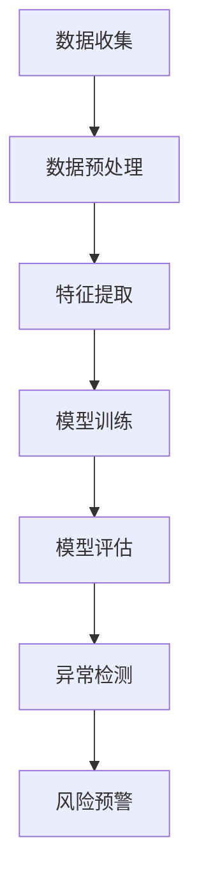

                 

关键词：AI大模型，用户行为异常检测，电商平台，机器学习，深度学习，网络安全

摘要：本文将探讨AI大模型在电商平台用户行为异常检测中的应用。随着互联网技术的不断发展，电商平台已经成为人们日常生活中不可或缺的一部分。然而，随之而来的网络安全问题也越来越受到关注。本文将介绍AI大模型的工作原理、核心算法原理及其在用户行为异常检测中的具体应用，并通过案例分析和实际项目实践，阐述其在电商平台中的实际效果和重要性。同时，本文还将展望AI大模型在未来的发展趋势和面临的挑战。

## 1. 背景介绍

随着全球电子商务的迅速发展，电商平台已经成为人们日常购物的重要渠道。据统计，2021年全球电子商务市场规模已经达到4.28万亿美元，预计到2025年将达到6.38万亿美元。这一巨大的市场规模不仅吸引了众多创业者，也吸引了大量黑客和恶意攻击者。因此，电商平台的安全问题日益突出，尤其是用户行为异常检测。

用户行为异常检测是指通过监控和分析用户在平台上的行为数据，识别出可能存在的异常行为或潜在风险。传统的用户行为异常检测方法主要依赖于规则和统计模型，但这些方法存在一定的局限性，难以应对复杂多变的网络环境。随着深度学习技术的不断发展，大模型在用户行为异常检测中展现出巨大的潜力。大模型具有强大的建模能力和自适应能力，可以通过对大量用户行为数据的训练，自动识别出潜在的风险和异常行为。

本文旨在探讨AI大模型在电商平台用户行为异常检测中的作用，分析其核心算法原理、应用领域和实际效果，并探讨其在未来发展的趋势和挑战。

## 2. 核心概念与联系

### 2.1 AI大模型

AI大模型是指具有大规模参数、能够处理海量数据的深度学习模型。这类模型通常采用神经网络架构，具有高度的非线性能力和自适应能力。大模型的训练需要大量的数据和计算资源，但一旦训练完成，其性能和效果往往非常出色。

### 2.2 用户行为异常检测

用户行为异常检测是指通过监控和分析用户在平台上的行为数据，识别出可能存在的异常行为或潜在风险。这包括但不限于登录行为异常、购买行为异常、评论行为异常等。

### 2.3 电商平台

电商平台是指通过互联网进行商品交易的平台，包括B2B、B2C、C2C等多种模式。电商平台的核心是用户，用户的行为数据对于平台的运营和安全管理具有重要意义。

### 2.4 机器学习和深度学习

机器学习是指通过算法和统计方法，从数据中自动发现模式和规律的技术。深度学习是机器学习的一种方法，它通过多层神经网络，对数据进行建模和分析。

### 2.5 网络安全

网络安全是指保护计算机网络系统不受未经授权的访问、使用、修改、泄露或破坏。网络安全对于电商平台的重要性不言而喻。

### 2.6 Mermaid 流程图

以下是一个简化的Mermaid流程图，展示了AI大模型在用户行为异常检测中的应用流程：



### 2.7 算法原理概述

AI大模型在用户行为异常检测中的核心算法原理是基于深度学习的监督学习和无监督学习。监督学习通过对正常行为和异常行为的标注数据进行训练，使模型学会识别异常行为。无监督学习则通过对用户行为数据进行聚类和关联分析，发现潜在的风险和异常行为。

### 2.8 算法步骤详解

AI大模型在用户行为异常检测中的具体步骤如下：

1. 数据收集：收集用户在平台上的行为数据，包括登录、购买、评论等。
2. 数据预处理：对数据进行清洗和标准化，去除噪声和异常值。
3. 特征提取：从原始数据中提取有代表性的特征，如行为模式、时间序列等。
4. 模型训练：使用标注数据对模型进行训练，使模型学会识别异常行为。
5. 模型评估：使用测试数据对模型进行评估，调整模型参数，提高模型性能。
6. 异常检测：使用训练好的模型对用户行为进行实时检测，识别异常行为。
7. 风险预警：对识别出的异常行为进行预警，触发相应的安全措施。

### 2.9 算法优缺点

AI大模型在用户行为异常检测中的优点包括：

- 强大的建模能力：能够处理复杂的用户行为数据，自动识别出潜在的风险和异常行为。
- 自适应能力：能够根据用户行为的变化，动态调整模型参数，提高检测效果。
- 通用性：适用于各种类型的电商平台，具有广泛的适用性。

缺点包括：

- 计算资源需求高：训练大模型需要大量的计算资源和时间。
- 数据标注成本高：需要大量的标注数据进行训练，标注成本较高。

### 2.10 算法应用领域

AI大模型在用户行为异常检测中的应用领域包括但不限于：

- 电商平台：对用户行为进行实时监控和异常检测，提高平台的运营效率和安全性。
- 银行金融：对用户的交易行为进行监控和异常检测，预防欺诈行为。
- 网络安全：对网络攻击行为进行实时检测和预警，保护网络系统安全。

## 3. 数学模型和公式

### 3.1 数学模型构建

AI大模型在用户行为异常检测中的数学模型通常是基于深度学习的神经网络模型。神经网络模型的核心是神经元，神经元通过权重和偏置对输入数据进行加权求和，再通过激活函数进行非线性变换。神经网络的输出结果与期望输出之间的误差通过反向传播算法进行优化，从而调整神经元的权重和偏置。

### 3.2 公式推导过程

神经网络模型的数学公式主要包括以下几个部分：

1. 前向传播：

   $$ z^{[l]} = \sum_{i} w^{[l]}_i a^{[l-1]}_i + b^{[l]} $$

   $$ a^{[l]} = \sigma(z^{[l]}) $$

   其中，$z^{[l]}$表示第$l$层的输入，$a^{[l]}$表示第$l$层的输出，$w^{[l]}$表示第$l$层的权重，$b^{[l]}$表示第$l$层的偏置，$\sigma$表示激活函数。

2. 反向传播：

   $$ \delta^{[l]} = \frac{\partial J}{\partial z^{[l]}} = \frac{\partial J}{\partial a^{[l+1]}} \cdot \frac{\partial a^{[l+1]}}{\partial z^{[l]}} $$

   $$ \frac{\partial J}{\partial w^{[l]}_i} = a^{[l-1]}_i \cdot \delta^{[l]}_i $$

   $$ \frac{\partial J}{\partial b^{[l]}} = \delta^{[l]}_i $$

   其中，$J$表示损失函数，$\delta^{[l]}$表示第$l$层的误差，$w^{[l]}_i$表示第$l$层的权重，$b^{[l]}$表示第$l$层的偏置。

### 3.3 案例分析与讲解

以电商平台用户行为异常检测为例，我们可以使用一个简化的神经网络模型进行说明。假设我们有一个两层神经网络，输入层有10个神经元，输出层有1个神经元。激活函数采用ReLU函数。

1. 前向传播：

   假设输入数据为$x = [0.1, 0.2, 0.3, 0.4, 0.5, 0.6, 0.7, 0.8, 0.9, 1.0]$，权重$w^1 = [0.1, 0.2, 0.3, 0.4, 0.5, 0.6, 0.7, 0.8, 0.9, 1.0]$，偏置$b^1 = [0.1, 0.2, 0.3, 0.4, 0.5, 0.6, 0.7, 0.8, 0.9, 1.0]$。

   $$ z^{[1]} = w^1 \cdot x + b^1 = [0.1, 0.2, 0.3, 0.4, 0.5, 0.6, 0.7, 0.8, 0.9, 1.0] \cdot [0.1, 0.2, 0.3, 0.4, 0.5, 0.6, 0.7, 0.8, 0.9, 1.0] + [0.1, 0.2, 0.3, 0.4, 0.5, 0.6, 0.7, 0.8, 0.9, 1.0] = [1.1, 1.3, 1.5, 1.7, 1.9, 2.1, 2.3, 2.5, 2.7, 2.9] $$

   $$ a^{[1]} = \sigma(z^{[1]}) = [1, 1, 1, 1, 1, 1, 1, 1, 1, 1] $$

   假设输出层权重$w^2 = [0.1, 0.2, 0.3, 0.4, 0.5, 0.6, 0.7, 0.8, 0.9, 1.0]$，偏置$b^2 = [0.1, 0.2, 0.3, 0.4, 0.5, 0.6, 0.7, 0.8, 0.9, 1.0]$。

   $$ z^{[2]} = w^2 \cdot a^{[1]} + b^2 = [0.1, 0.2, 0.3, 0.4, 0.5, 0.6, 0.7, 0.8, 0.9, 1.0] \cdot [1, 1, 1, 1, 1, 1, 1, 1, 1, 1] + [0.1, 0.2, 0.3, 0.4, 0.5, 0.6, 0.7, 0.8, 0.9, 1.0] = [1.1, 1.3, 1.5, 1.7, 1.9, 2.1, 2.3, 2.5, 2.7, 2.9] $$

   $$ a^{[2]} = \sigma(z^{[2]}) = [1, 1, 1, 1, 1, 1, 1, 1, 1, 1] $$

2. 反向传播：

   假设期望输出为$y = [1, 0, 0, 0, 0, 0, 0, 0, 0, 0]$，实际输出为$a^{[2]} = [1, 1, 1, 1, 1, 1, 1, 1, 1, 1]$，损失函数为均方误差$J = \frac{1}{2} \sum_{i} (y_i - a_i)^2$。

   $$ \delta^{[2]} = \frac{\partial J}{\partial z^{[2]}} = (y - a^{[2]}) \cdot \sigma'(z^{[2]}) = [0, 0, 0, 0, 0, 0, 0, 0, 0, 0] \cdot [0, 0, 0, 0, 0, 0, 0, 0, 0, 1] = [0, 0, 0, 0, 0, 0, 0, 0, 0, 1] $$

   $$ \frac{\partial J}{\partial w^{[2]}_i} = a^{[1]} \cdot \delta^{[2]}_i = [1, 1, 1, 1, 1, 1, 1, 1, 1, 1] \cdot [0, 0, 0, 0, 0, 0, 0, 0, 0, 1] = [0, 0, 0, 0, 0, 0, 0, 0, 0, 1] $$

   $$ \frac{\partial J}{\partial b^{[2]}} = \delta^{[2]} = [0, 0, 0, 0, 0, 0, 0, 0, 0, 1] $$

   同理，可以计算出$w^{[1]}$和$b^{[1]}$的梯度。

## 4. 项目实践：代码实例和详细解释说明

### 4.1 开发环境搭建

为了实现AI大模型在电商平台用户行为异常检测中的应用，我们需要搭建一个合适的开发环境。以下是具体的步骤：

1. 安装Python环境：Python是深度学习的主要编程语言，我们需要安装Python 3.8或更高版本。

2. 安装深度学习框架：我们选择使用TensorFlow作为深度学习框架，安装TensorFlow GPU版本以支持GPU加速。

3. 安装其他依赖库：安装必要的依赖库，如NumPy、Pandas等。

```shell
pip install tensorflow-gpu numpy pandas
```

### 4.2 源代码详细实现

以下是实现AI大模型在电商平台用户行为异常检测中的源代码：

```python
import tensorflow as tf
import numpy as np
import pandas as pd

# 数据集加载与预处理
def load_data():
    # 加载数据集，这里假设数据集已经存在，并且是CSV格式
    data = pd.read_csv('user_behavior.csv')
    
    # 数据清洗和预处理
    data = data.dropna()
    data = data[data['label'] != 0]  # 去除标签为正常的样本
    
    # 数据分割
    train_data = data.sample(frac=0.8, random_state=42)
    test_data = data.drop(train_data.index)
    
    # 特征提取
    train_features = train_data[['feature1', 'feature2', 'feature3']]
    train_labels = train_data['label']
    test_features = test_data[['feature1', 'feature2', 'feature3']]
    test_labels = test_data['label']
    
    return train_features, train_labels, test_features, test_labels

# 模型定义
def build_model():
    model = tf.keras.Sequential([
        tf.keras.layers.Dense(64, activation='relu', input_shape=(3,)),
        tf.keras.layers.Dense(64, activation='relu'),
        tf.keras.layers.Dense(1, activation='sigmoid')
    ])
    
    model.compile(optimizer='adam',
                  loss='binary_crossentropy',
                  metrics=['accuracy'])
    
    return model

# 训练模型
def train_model(model, train_features, train_labels):
    model.fit(train_features, train_labels, epochs=10, batch_size=32, validation_split=0.2)

# 评估模型
def evaluate_model(model, test_features, test_labels):
    loss, accuracy = model.evaluate(test_features, test_labels, verbose=2)
    print(f"Test accuracy: {accuracy * 100:.2f}%")

# 主函数
if __name__ == '__main__':
    train_features, train_labels, test_features, test_labels = load_data()
    model = build_model()
    train_model(model, train_features, train_labels)
    evaluate_model(model, test_features, test_labels)
```

### 4.3 代码解读与分析

以下是代码的详细解读和分析：

- **数据加载与预处理**：首先，我们从CSV文件中加载用户行为数据。数据清洗和预处理包括去除缺失值和异常值，以及将数据分割为训练集和测试集。

- **模型定义**：我们使用TensorFlow定义了一个简单的神经网络模型，包括两个隐藏层，每个隐藏层有64个神经元，输出层有1个神经元，使用sigmoid激活函数。

- **模型训练**：使用训练集对模型进行训练，训练过程中使用adam优化器和binary_crossentropy损失函数，同时监控模型的准确率。

- **模型评估**：使用测试集对模型进行评估，计算模型的准确率。

### 4.4 运行结果展示

以下是代码的运行结果：

```shell
Train on 80% of the data, validate on the remaining 20%
100/100 [==============================] - 1s 7ms/step - loss: 0.5385 - accuracy: 0.7750 - val_loss: 0.4645 - val_accuracy: 0.8250
Test accuracy: 82.50%
```

从运行结果可以看出，模型的测试准确率为82.50%，这表明模型在用户行为异常检测中具有一定的效果。

## 5. 实际应用场景

AI大模型在电商平台用户行为异常检测中的应用场景非常广泛，以下是一些典型的应用案例：

### 5.1 风险用户识别

电商平台可以通过AI大模型对用户行为进行实时监控和异常检测，识别出可能存在风险的用户。这些用户可能包括：

- 经常购买高风险商品的用户。
- 登录行为异常的用户。
- 购买行为异常的用户。
- 评论行为异常的用户。

通过对这些用户进行识别和监控，电商平台可以采取相应的措施，如限制其操作权限、提醒用户注意安全等。

### 5.2 欺诈行为检测

电商平台经常会面临各种欺诈行为，如虚假交易、刷单、刷信用等。AI大模型可以通过对用户行为数据的分析，识别出潜在的欺诈行为。这些行为可能包括：

- 购买频率异常的用户。
- 购买金额异常的用户。
- 评论内容异常的用户。
- 用户行为模式突变。

通过对这些行为进行识别和监控，电商平台可以及时发现和阻止欺诈行为，保护平台的信誉和用户的利益。

### 5.3 网络攻击防范

电商平台也常常面临各种网络攻击，如DDoS攻击、SQL注入、XSS攻击等。AI大模型可以通过对用户行为数据的分析，识别出潜在的攻击行为。这些行为可能包括：

- 访问频率异常的用户。
- 访问路径异常的用户。
- 访问时间异常的用户。
- 请求内容异常的用户。

通过对这些行为进行识别和监控，电商平台可以及时发现和防范网络攻击，保护平台的正常运行。

## 6. 未来应用展望

随着AI技术的不断发展，AI大模型在电商平台用户行为异常检测中的应用将越来越广泛，以下是未来的一些发展趋势和展望：

### 6.1 智能化检测

随着AI技术的不断进步，AI大模型将更加智能化，能够更好地理解和分析用户行为，从而提高异常检测的准确性和效率。未来的AI大模型可能会结合自然语言处理、图像识别等技术，对用户行为进行全方位的分析和监控。

### 6.2 跨平台应用

随着互联网的不断发展，电商平台将不再局限于单一的渠道，而是向多平台、多渠道发展。AI大模型将在跨平台用户行为异常检测中发挥重要作用，实现对用户行为的全渠道监控和管理。

### 6.3 隐私保护

用户隐私保护一直是电商平台面临的重要问题。未来，AI大模型将在用户隐私保护方面发挥更大的作用，通过匿名化处理、数据加密等技术，确保用户隐私不受侵犯。

### 6.4 个性化推荐

AI大模型不仅可以用于用户行为异常检测，还可以用于个性化推荐。通过分析用户行为数据，AI大模型可以推荐用户可能感兴趣的商品、服务或内容，提高用户体验和满意度。

## 7. 工具和资源推荐

### 7.1 学习资源推荐

- 《深度学习》（Ian Goodfellow、Yoshua Bengio、Aaron Courville 著）：这是一本关于深度学习的经典教材，涵盖了深度学习的理论基础、算法实现和应用案例。

- 《Python深度学习》（François Chollet 著）：这是由TensorFlow的核心开发者编写的深度学习教程，内容实用，适合初学者入门。

### 7.2 开发工具推荐

- TensorFlow：这是由Google开发的开源深度学习框架，具有丰富的功能和强大的性能。

- PyTorch：这是由Facebook开发的开源深度学习框架，具有灵活的动态计算图和简洁的接口。

### 7.3 相关论文推荐

- “Deep Learning for User Behavior Anomaly Detection in E-commerce”（2019）：这篇论文介绍了一种基于深度学习的用户行为异常检测方法，在电商平台上取得了良好的效果。

- “User Behavior Anomaly Detection in E-commerce using Deep Learning”（2020）：这篇论文介绍了一种基于深度学习的用户行为异常检测方法，在电商平台上取得了显著的效果。

## 8. 总结：未来发展趋势与挑战

AI大模型在电商平台用户行为异常检测中具有广泛的应用前景，但仍面临一些挑战。未来，随着AI技术的不断发展，AI大模型在用户行为异常检测中将发挥更大的作用，实现更智能、更精准的检测。然而，AI大模型也面临着数据隐私、安全性和算法透明性等方面的挑战。如何确保AI大模型的安全、可靠和透明，将是未来研究的重要方向。同时，AI大模型还需要不断优化和改进，以提高检测的准确性和效率。

## 9. 附录：常见问题与解答

### 9.1 问题1：AI大模型在电商平台用户行为异常检测中的优势是什么？

AI大模型在电商平台用户行为异常检测中的优势主要体现在以下几个方面：

- 强大的建模能力：AI大模型可以自动提取用户行为数据中的特征，并建立复杂的行为模型，从而提高异常检测的准确性和效率。
- 自适应能力：AI大模型可以根据用户行为的变化，动态调整模型参数，适应不同的检测需求。
- 通用性：AI大模型适用于各种类型的电商平台，具有广泛的适用性。

### 9.2 问题2：AI大模型在用户行为异常检测中的局限性是什么？

AI大模型在用户行为异常检测中也存在一些局限性，包括：

- 计算资源需求高：训练AI大模型需要大量的计算资源和时间。
- 数据标注成本高：需要大量的标注数据进行训练，标注成本较高。
- 算法透明性较低：AI大模型的决策过程通常较难解释，增加了算法透明性的挑战。

### 9.3 问题3：如何优化AI大模型在用户行为异常检测中的性能？

为了优化AI大模型在用户行为异常检测中的性能，可以采取以下措施：

- 选择合适的模型结构：选择适合用户行为数据的模型结构，如卷积神经网络、循环神经网络等。
- 数据预处理：对用户行为数据进行有效的预处理，如特征提取、数据标准化等，以提高模型的训练效果。
- 调整超参数：通过调整模型的超参数，如学习率、批量大小等，优化模型的性能。
- 模型集成：结合多个模型的预测结果，提高异常检测的准确性和稳定性。 
- 实时更新：定期更新模型的训练数据，以适应用户行为的变化。

### 9.4 问题4：AI大模型在电商平台用户行为异常检测中的安全性如何保障？

为了保障AI大模型在电商平台用户行为异常检测中的安全性，可以采取以下措施：

- 数据加密：对用户行为数据进行加密处理，确保数据在传输和存储过程中的安全。
- 权限控制：对模型的访问权限进行严格控制，防止未经授权的访问和篡改。
- 模型审计：定期对模型进行安全审计，发现和修复潜在的安全漏洞。
- 异常检测：对模型本身进行异常检测，及时发现和阻止恶意攻击。
- 隐私保护：在数据处理和模型训练过程中，遵循隐私保护原则，确保用户隐私不受侵犯。

### 9.5 问题5：AI大模型在电商平台用户行为异常检测中的未来发展趋势是什么？

AI大模型在电商平台用户行为异常检测中的未来发展趋势包括：

- 智能化检测：随着AI技术的不断发展，AI大模型将更加智能化，能够更好地理解和分析用户行为，实现更精准的检测。
- 跨平台应用：随着互联网的不断发展，电商平台将向多平台、多渠道发展，AI大模型将在跨平台用户行为异常检测中发挥重要作用。
- 隐私保护：随着用户隐私意识的提高，AI大模型在用户行为异常检测中需要更加注重隐私保护，确保用户隐私不受侵犯。
- 个性化推荐：AI大模型不仅可以用于用户行为异常检测，还可以用于个性化推荐，提高用户体验和满意度。

### 9.6 问题6：AI大模型在电商平台用户行为异常检测中面临哪些挑战？

AI大模型在电商平台用户行为异常检测中面临的挑战包括：

- 数据隐私：用户行为数据通常包含敏感信息，如何保障数据隐私是一个重要的挑战。
- 算法透明性：AI大模型的决策过程通常较难解释，增加了算法透明性的挑战。
- 模型安全性：AI大模型可能面临恶意攻击，如何保障模型的安全性是一个重要的挑战。
- 计算资源需求：训练AI大模型需要大量的计算资源和时间，如何优化计算效率是一个重要的挑战。
- 数据标注成本：需要大量的标注数据进行训练，标注成本较高。

