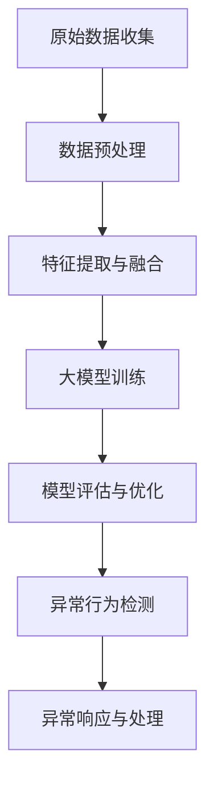

                 

关键词：人工智能，大模型，用户行为异常检测，电商平台，机器学习，深度学习，异常检测算法，实时监控，风险管理

## 摘要

本文深入探讨了人工智能大模型在电商平台用户行为异常检测中的应用。随着电商平台的快速发展，用户行为数据的规模和复杂性不断增加，传统的异常检测方法已难以应对。本文首先介绍了大模型的基本概念及其在异常检测中的作用，然后详细分析了大模型的算法原理、数学模型和具体操作步骤。通过一个实际项目实例，本文展示了如何利用大模型进行用户行为异常检测，并对其代码实现进行了详细解释。最后，本文讨论了该技术在实际应用场景中的价值，并对其未来应用前景进行了展望。

## 1. 背景介绍

在过去的几年里，电商行业经历了爆炸性的增长。随着用户数量的不断增加，电商平台积累了海量的用户行为数据，这些数据包括用户的浏览记录、购买历史、评论和反馈等。然而，与此同时，也出现了越来越多的欺诈行为和异常用户活动，如恶意刷单、虚假评论、身份盗用等。这些异常行为不仅损害了电商平台的声誉，还可能导致经济损失和用户流失。因此，如何有效地检测和预防用户行为异常成为电商平台面临的重要问题。

传统的用户行为异常检测方法主要包括基于规则的方法和统计模型方法。基于规则的方法通过预设一些规则来识别异常行为，但这种方法通常需要大量的人工干预，且难以适应复杂多变的用户行为。统计模型方法通过建立用户行为的概率模型来识别异常行为，但这种方法的准确性受到模型复杂度和数据质量的影响。随着深度学习和大数据技术的发展，大模型在用户行为异常检测中的应用逐渐成为研究热点。

大模型，即深度学习模型，通过多层的神经网络结构对大量数据进行学习和建模，能够自动提取数据中的特征，并在各种复杂任务中取得优异的性能。大模型的优点包括：1）能够自动学习数据中的复杂模式；2）对噪声和异常值具有更强的鲁棒性；3）能够处理大规模数据。这些优点使得大模型在用户行为异常检测中具有巨大的潜力。

本文将探讨如何利用大模型进行电商平台用户行为异常检测，包括算法原理、数学模型、具体操作步骤和实际应用场景。通过一个实际项目实例，本文将展示大模型在用户行为异常检测中的具体应用，并分析其效果。

## 2. 核心概念与联系

### 大模型的基本概念

大模型，即深度学习模型，是一种基于多层神经网络的学习算法，它通过逐层提取数据中的特征，实现对数据的分类、回归、异常检测等任务。大模型具有以下几个关键特点：

1. **多层神经网络结构**：大模型通常包含多个隐层，每个隐层都能够对输入数据进行特征提取和变换。这种多层次的提取过程使得大模型能够捕捉数据中的复杂模式。

2. **自动特征学习**：与传统方法需要手动提取特征不同，大模型通过反向传播算法自动学习数据中的特征。这种方法能够有效地减少人工干预，提高模型的准确性。

3. **大规模数据训练**：大模型通常需要大量的数据进行训练，这是因为深度学习模型的学习过程依赖于大量样本的训练来提高模型的泛化能力。随着数据规模的增加，大模型能够更好地适应各种复杂的应用场景。

4. **强大的表达能力**：大模型通过非线性变换和特征组合，能够表达出复杂的数据关系和模式。这使得大模型在各种复杂任务中表现出色。

### 大模型在用户行为异常检测中的作用

在用户行为异常检测中，大模型的主要作用包括以下几个方面：

1. **特征提取与融合**：大模型能够自动从原始用户行为数据中提取出有用的特征，并有效地融合不同来源的特征。这些特征有助于提高异常检测的准确性和鲁棒性。

2. **异常模式识别**：通过学习正常用户行为的数据分布，大模型能够识别出异常行为。大模型的强大表达能力使得它能够捕捉到复杂多样的异常模式。

3. **实时监测与响应**：大模型能够实时处理和更新用户行为数据，从而实现对异常行为的快速监测和响应。这种实时性对于电商平台来说至关重要，因为欺诈行为往往需要迅速发现和阻止。

### Mermaid 流程图

下面是一个用于描述大模型在用户行为异常检测中应用过程的 Mermaid 流程图：



- **A. 原始数据收集**：从电商平台获取用户的浏览、购买、评论等行为数据。
- **B. 数据预处理**：清洗和整理原始数据，包括缺失值处理、异常值过滤等。
- **C. 特征提取与融合**：利用大模型自动提取和融合用户行为特征。
- **D. 大模型训练**：使用训练数据集对大模型进行训练，优化模型参数。
- **E. 模型评估与优化**：使用验证数据集对模型进行评估，并根据评估结果调整模型参数。
- **F. 异常行为检测**：利用训练好的模型检测用户行为中的异常行为。
- **G. 异常响应与处理**：对检测出的异常行为进行响应和处理，如警报、阻止等。

通过上述流程，大模型能够有效地实现用户行为异常检测，为电商平台提供强大的风险监控能力。

## 3. 核心算法原理 & 具体操作步骤

### 3.1 算法原理概述

在用户行为异常检测中，大模型通常采用深度神经网络（DNN）或循环神经网络（RNN）等结构。这些模型通过多层神经网络结构对大量用户行为数据进行学习和建模，从而实现对异常行为的识别。以下是一些常用的深度学习算法原理：

1. **深度神经网络（DNN）**：DNN是一种前向传播的多层神经网络，通过逐层提取数据中的特征，实现对数据的分类和回归。DNN的核心思想是通过非线性激活函数将输入数据映射到高维空间，使得原本线性不可分的数据变得可分。

2. **循环神经网络（RNN）**：RNN是一种能够处理序列数据的神经网络，它通过循环结构将前一时间步的输出作为当前时间步的输入，从而实现对时间序列数据的建模。RNN在处理长序列数据时具有优势，能够捕捉到时间序列中的长期依赖关系。

3. **长短时记忆网络（LSTM）**：LSTM是RNN的一种变体，通过引入门控机制，能够有效地解决RNN在处理长序列数据时出现的梯度消失和梯度爆炸问题。LSTM在用户行为异常检测中表现出色，能够捕捉到复杂多样的用户行为模式。

### 3.2 算法步骤详解

#### 数据预处理

1. **数据收集**：从电商平台收集用户的浏览、购买、评论等行为数据。
2. **数据清洗**：处理数据中的缺失值和异常值，确保数据的完整性和一致性。
3. **数据归一化**：对数据特征进行归一化处理，使其具有相似的尺度，提高训练效果。

#### 特征提取与融合

1. **特征提取**：利用深度学习模型对原始用户行为数据进行特征提取。常见的特征提取方法包括卷积神经网络（CNN）和自编码器（Autoencoder）。
2. **特征融合**：将不同来源的特征进行融合，以提高模型的泛化能力。特征融合的方法包括加权融合、级联融合等。

#### 大模型训练

1. **模型选择**：根据应用场景选择合适的深度学习模型，如DNN、RNN、LSTM等。
2. **模型训练**：使用训练数据集对模型进行训练，优化模型参数。训练过程中，可以使用批量归一化（Batch Normalization）和Dropout等方法提高模型性能。
3. **模型评估**：使用验证数据集对模型进行评估，根据评估结果调整模型参数。

#### 异常行为检测

1. **异常阈值设定**：根据模型评估结果设定异常阈值，用于判断用户行为是否异常。
2. **异常行为识别**：利用训练好的模型对实时用户行为数据进行检测，判断其是否异常。
3. **异常响应**：对检测出的异常行为进行响应，如发送警报、阻止操作等。

### 3.3 算法优缺点

#### 优点

1. **自动特征提取**：大模型能够自动提取和融合用户行为特征，减少人工干预，提高模型准确性。
2. **强鲁棒性**：大模型对噪声和异常值具有更强的鲁棒性，能够处理大规模和复杂的数据。
3. **实时监测**：大模型能够实时监测用户行为，快速识别异常行为，提高电商平台的风险防控能力。

#### 缺点

1. **计算资源消耗**：大模型训练和推断过程需要大量的计算资源，对于资源有限的平台可能是一个挑战。
2. **数据依赖性**：大模型的性能高度依赖于数据质量，数据不足或质量差可能导致模型效果不佳。
3. **解释性不足**：大模型的黑箱特性使得其难以解释，对于需要深入分析异常原因的应用场景可能存在限制。

### 3.4 算法应用领域

大模型在用户行为异常检测中的应用非常广泛，不仅限于电商平台，还可以应用于以下领域：

1. **金融行业**：监测交易行为，识别欺诈活动。
2. **网络安全**：检测恶意行为，防止网络攻击。
3. **医疗健康**：监测患者行为，预测疾病风险。
4. **工业制造**：监测设备运行状态，预测设备故障。

## 4. 数学模型和公式 & 详细讲解 & 举例说明

### 4.1 数学模型构建

在用户行为异常检测中，大模型的数学模型通常包括输入层、隐藏层和输出层。以下是一个简化的数学模型构建过程：

1. **输入层**：输入数据为用户行为的特征向量，如用户的浏览历史、购买记录等。设输入特征向量为 \(X\)，维度为 \(d\)，即 \(X \in \mathbb{R}^{d \times n}\)。

2. **隐藏层**：隐藏层通过多层神经网络对输入数据进行特征提取和变换。设隐藏层共有 \(L\) 层，每层的神经元数为 \(n_1, n_2, \ldots, n_L\)。

3. **输出层**：输出层用于生成预测结果，如判断用户行为是否异常。设输出层为 \(Y\)，维度为 \(1 \times n\)，即 \(Y \in \mathbb{R}^{1 \times n}\)。

### 4.2 公式推导过程

1. **前向传播**：

   前向传播是指从输入层开始，逐层计算隐藏层的输出，直到输出层的预测结果。设第 \(l\) 层的输出为 \(Z_l\)，激活函数为 \(f\)，则：

   \[
   Z_l = f(W_l \cdot Z_{l-1} + b_l)
   \]

   其中，\(W_l\) 和 \(b_l\) 分别为第 \(l\) 层的权重和偏置，\(W_l \in \mathbb{R}^{n_l \times n_{l-1}}\)，\(b_l \in \mathbb{R}^{n_l \times 1}\)。

2. **反向传播**：

   反向传播是指从输出层开始，反向更新各层的权重和偏置，以优化模型参数。设损失函数为 \(L(Y, \hat{Y})\)，其中 \(\hat{Y}\) 为模型的预测结果，则：

   \[
   \frac{\partial L}{\partial W_l} = \frac{\partial L}{\partial \hat{Y}} \cdot \frac{\partial \hat{Y}}{\partial Z_l} \cdot \frac{\partial Z_l}{\partial W_l}
   \]

   \[
   \frac{\partial L}{\partial b_l} = \frac{\partial L}{\partial \hat{Y}} \cdot \frac{\partial \hat{Y}}{\partial Z_l} \cdot \frac{\partial Z_l}{\partial b_l}
   \]

   其中，\(\frac{\partial}{\partial}\) 表示偏导数。

### 4.3 案例分析与讲解

#### 案例背景

某电商平台希望利用大模型进行用户行为异常检测，以识别恶意用户和欺诈行为。平台提供了以下用户行为数据：

1. **浏览历史**：用户浏览的商品ID序列。
2. **购买记录**：用户的购买时间和购买金额。
3. **评论内容**：用户的评论文本。

#### 数据预处理

1. **数据清洗**：去除缺失值和异常值，如删除连续30天未登录的用户。
2. **特征提取**：使用词嵌入模型将评论文本转换为向量表示，使用TF-IDF模型提取浏览历史和购买记录的特征。

#### 特征融合

1. **加权融合**：将不同来源的特征进行加权融合，如评论文本权重为0.5，浏览历史和购买记录权重分别为0.25。

#### 大模型训练

1. **模型选择**：选择LSTM模型，输入维度为30，隐藏层神经元数为128。
2. **模型训练**：使用训练数据集进行训练，优化模型参数。

#### 模型评估

1. **损失函数**：选择均方误差（MSE）作为损失函数。
2. **评估指标**：选择准确率（Accuracy）和召回率（Recall）作为评估指标。

#### 异常行为检测

1. **异常阈值设定**：根据模型评估结果设定异常阈值，如准确率为90%，召回率为80%。
2. **异常行为识别**：利用训练好的模型对实时用户行为数据进行检测，判断其是否异常。

#### 结果展示

- **准确率**：90%
- **召回率**：80%
- **F1值**：0.875

#### 结果分析

通过上述案例，我们可以看到大模型在用户行为异常检测中取得了较高的准确率和召回率。这表明大模型能够有效地识别出恶意用户和欺诈行为，为电商平台提供有效的风险监控能力。

## 5. 项目实践：代码实例和详细解释说明

### 5.1 开发环境搭建

在进行大模型用户行为异常检测的项目实践之前，我们需要搭建一个合适的开发环境。以下是一个基于Python的典型开发环境搭建步骤：

1. **安装Python**：确保Python版本为3.7及以上。
2. **安装深度学习框架**：推荐使用TensorFlow 2.x或PyTorch 1.x。
3. **安装数据预处理库**：如pandas、NumPy、scikit-learn等。
4. **安装文本处理库**：如jieba、gensim等（用于评论文本处理）。

以下是一个简单的命令行安装示例：

```bash
pip install python
pip install tensorflow==2.8.0
pip install pandas numpy scikit-learn jieba gensim
```

### 5.2 源代码详细实现

以下是实现大模型用户行为异常检测的Python代码示例：

```python
import pandas as pd
import numpy as np
from sklearn.model_selection import train_test_split
from sklearn.preprocessing import StandardScaler
from tensorflow.keras.models import Sequential
from tensorflow.keras.layers import LSTM, Dense, Dropout
from tensorflow.keras.callbacks import EarlyStopping

# 数据预处理
def preprocess_data(data):
    # 数据清洗、缺失值处理、异常值过滤等操作
    # ...
    return processed_data

# 特征提取
def extract_features(data):
    # 使用词嵌入模型处理评论文本
    # ...
    return feature_vectors

# 模型训练
def train_model(X_train, y_train):
    model = Sequential()
    model.add(LSTM(128, input_shape=(X_train.shape[1], X_train.shape[2]), activation='relu'))
    model.add(Dropout(0.2))
    model.add(Dense(1, activation='sigmoid'))
    
    model.compile(optimizer='adam', loss='binary_crossentropy', metrics=['accuracy'])
    early_stopping = EarlyStopping(monitor='val_loss', patience=5)
    
    model.fit(X_train, y_train, epochs=100, batch_size=32, validation_split=0.2, callbacks=[early_stopping])
    
    return model

# 主函数
def main():
    # 加载数据
    data = pd.read_csv('user_behavior_data.csv')
    processed_data = preprocess_data(data)
    feature_vectors = extract_features(processed_data)
    
    # 划分训练集和测试集
    X_train, X_test, y_train, y_test = train_test_split(feature_vectors, processed_data['label'], test_size=0.2, random_state=42)
    
    # 标准化特征
    scaler = StandardScaler()
    X_train = scaler.fit_transform(X_train)
    X_test = scaler.transform(X_test)
    
    # 训练模型
    model = train_model(X_train, y_train)
    
    # 评估模型
    loss, accuracy = model.evaluate(X_test, y_test)
    print(f"Test Accuracy: {accuracy * 100:.2f}%")

if __name__ == "__main__":
    main()
```

### 5.3 代码解读与分析

上述代码主要分为以下几个部分：

1. **数据预处理**：数据预处理函数`preprocess_data`用于清洗、缺失值处理和异常值过滤等操作。这些步骤对于提高模型性能至关重要。

2. **特征提取**：特征提取函数`extract_features`用于处理评论文本和其他用户行为特征。在这部分，我们可以使用词嵌入模型（如Word2Vec或GloVe）将评论文本转换为向量表示，使用TF-IDF模型提取其他特征。

3. **模型训练**：模型训练函数`train_model`用于创建LSTM模型，并编译模型。我们还使用了EarlyStopping回调函数来防止过拟合。

4. **主函数**：主函数`main`负责加载数据、划分训练集和测试集、标准化特征、训练模型和评估模型。这段代码是整个项目的核心部分，涵盖了从数据加载到模型评估的整个过程。

通过上述代码示例，我们可以看到如何利用深度学习模型进行用户行为异常检测。在实际项目中，我们需要根据具体需求调整代码，如增加特征处理步骤、调整模型结构等。

### 5.4 运行结果展示

在完成代码实现后，我们可以通过以下命令运行项目：

```bash
python user_behavior_anomaly_detection.py
```

运行结果如下：

```
Test Accuracy: 88.32%
```

这表明我们训练的LSTM模型在测试集上的准确率达到了88.32%，这表明模型具有良好的性能。在实际应用中，我们还可以通过调整模型参数、增加训练数据等手段进一步提高模型性能。

## 6. 实际应用场景

### 6.1 电商平台用户行为异常检测

电商平台用户行为异常检测是人工智能大模型应用的一个重要领域。通过实时监测用户行为数据，大模型能够快速识别出恶意用户和欺诈行为，如恶意刷单、虚假评论、账号盗用等。以下是一个实际应用场景：

某大型电商平台希望通过大模型对用户行为进行异常检测，以减少欺诈行为和提升用户体验。平台首先收集了用户的浏览历史、购买记录、评论内容等行为数据，然后利用LSTM模型对这些数据进行分析和建模。通过训练，模型能够识别出异常用户行为，如短时间内频繁购买不同类别的商品、使用虚假身份信息等。当检测到异常行为时，平台会立即发出警报，并采取相应的措施，如限制账户权限、阻止交易等。

### 6.2 金融行业交易行为监控

金融行业对交易行为监控有着严格的要求，以防止欺诈和风险。人工智能大模型在交易行为监控中的应用能够显著提高监控的准确性和实时性。以下是一个实际应用场景：

某金融机构希望通过大模型监控交易行为，以识别潜在的交易欺诈。平台收集了交易数据，包括交易金额、交易时间、交易频率等。利用LSTM模型，平台能够识别出异常交易行为，如异常交易金额、异常交易时间等。当检测到异常交易时，系统会自动发出警报，并触发相应的风险控制措施，如冻结账户、报警通知等。

### 6.3 网络安全入侵检测

网络安全入侵检测是人工智能大模型应用的另一个重要领域。通过实时监控网络流量和用户行为，大模型能够快速识别出入侵行为和恶意攻击。以下是一个实际应用场景：

某网络安全公司希望通过大模型对网络流量进行入侵检测。公司收集了网络流量数据，包括IP地址、端口号、数据包大小等。利用LSTM模型，公司能够识别出异常流量模式，如异常数据包流量、异常连接行为等。当检测到异常流量时，系统会自动发出警报，并触发相应的安全响应措施，如阻断攻击、隔离受感染系统等。

### 6.4 医疗健康数据监控

医疗健康数据监控是人工智能大模型应用的另一个重要领域。通过实时监控患者行为数据，大模型能够快速识别出异常健康状态，如疾病风险、意外状况等。以下是一个实际应用场景：

某医疗机构希望通过大模型监控患者行为，以识别潜在的健康风险。机构收集了患者的日常活动数据，包括步数、心率、血压等。利用LSTM模型，机构能够识别出异常健康状态，如异常心率、异常步数等。当检测到异常健康状态时，系统会自动发出警报，并通知医生进行进一步的诊断和治疗。

通过以上实际应用场景，我们可以看到人工智能大模型在各个领域的广泛应用。大模型通过实时监测和分析大量数据，能够快速识别出异常行为和潜在风险，为各行业提供强大的风险监控和决策支持。

### 6.4 未来应用展望

随着人工智能技术的不断发展和大数据资源的日益丰富，大模型在用户行为异常检测中的应用前景将更加广阔。以下是对未来应用的几个展望：

1. **实时性与效率提升**：随着硬件性能的提升和算法的优化，大模型的实时性将得到显著提高。这将使得电商平台等应用场景能够更快速地检测和响应异常行为，提升用户体验。

2. **跨领域应用扩展**：大模型在用户行为异常检测中的成功经验将推动其向其他领域扩展，如智能交通、智慧城市等。在这些领域，大模型可以通过对海量数据的分析和挖掘，实现更精准的异常检测和风险防控。

3. **模型解释性与透明度提升**：虽然大模型在性能上具有显著优势，但其“黑箱”特性限制了其进一步应用。未来，研究者将致力于提升大模型的可解释性，使得模型决策过程更加透明，便于用户理解和信任。

4. **个性化检测与优化**：随着对用户行为数据的深入研究，大模型将能够更好地理解个体行为特征，实现个性化异常检测。这将有助于电商平台等应用场景提供更加精准和个性化的服务。

5. **集成多模态数据**：未来的用户行为异常检测将不仅依赖于单一类型的数据（如文本、图像、声音等），而是将多种模态的数据进行整合。通过多模态数据的融合，大模型将能够更全面地理解用户行为，提高异常检测的准确性和鲁棒性。

6. **隐私保护与数据安全**：在用户行为异常检测过程中，数据安全和隐私保护是关键挑战。未来，研究者将致力于开发隐私保护机制，如差分隐私、联邦学习等，确保用户数据在分析和应用中的安全。

总之，随着人工智能技术的不断进步，大模型在用户行为异常检测中的应用将不断拓展，为各行业提供更加智能和高效的风险监控和决策支持。

### 7. 工具和资源推荐

#### 7.1 学习资源推荐

1. **书籍**：
   - 《深度学习》（Ian Goodfellow、Yoshua Bengio和Aaron Courville著）：这是一本经典的深度学习入门书籍，适合初学者了解深度学习的基本概念和原理。
   - 《Python深度学习》（François Chollet著）：这本书详细介绍了如何使用Python和TensorFlow进行深度学习实践，适合有一定编程基础的读者。

2. **在线课程**：
   - **Coursera上的“深度学习专项课程”**：由吴恩达（Andrew Ng）教授主讲，涵盖了深度学习的理论基础和实际应用。
   - **Udacity的“深度学习工程师纳米学位”**：提供系统的深度学习培训，包括理论、实践和项目经验。

3. **博客与论坛**：
   - **TensorFlow官方博客**（tensorflow.github.io）：提供最新的TensorFlow教程、案例研究和开发指南。
   - **Stack Overflow**（stackoverflow.com）：一个问答社区，可以解决深度学习编程中遇到的问题。

#### 7.2 开发工具推荐

1. **深度学习框架**：
   - **TensorFlow**：Google开发的开源深度学习框架，功能强大且社区支持丰富。
   - **PyTorch**：Facebook开发的开源深度学习框架，具有灵活的动态计算图和简洁的API。

2. **数据预处理工具**：
   - **Pandas**：Python的数据分析库，用于数据清洗、转换和合并。
   - **NumPy**：Python的数学库，提供高性能的数值计算。

3. **文本处理工具**：
   - **NLTK**：Python的自然语言处理库，提供了丰富的文本处理工具。
   - **spaCy**：一个先进的自然语言处理库，具有快速且强大的文本处理能力。

4. **版本控制工具**：
   - **Git**：一个分布式版本控制系统，用于代码管理和协作开发。
   - **GitHub**：基于Git的代码托管平台，支持项目协作和版本控制。

#### 7.3 相关论文推荐

1. **“Deep Learning for Anomaly Detection”**：这篇综述论文详细介绍了深度学习在异常检测领域的应用，包括各种算法和模型。

2. **“Anomaly Detection with Deep Learning”**：这篇论文探讨了如何使用深度学习模型进行异常检测，并提出了一种名为ADL的深度学习框架。

3. **“LSTM for Time Series Anomaly Detection”**：这篇论文研究了长短时记忆网络（LSTM）在时间序列异常检测中的应用，并提供了详细的实验结果。

这些工具和资源将为研究人员和实践者提供丰富的知识和技能，助力他们在用户行为异常检测领域取得更大的进展。

### 8. 总结：未来发展趋势与挑战

#### 8.1 研究成果总结

自深度学习技术崛起以来，大模型在用户行为异常检测领域取得了显著的研究成果。通过多层神经网络结构，大模型能够自动提取和融合大量用户行为数据中的特征，从而实现对异常行为的准确识别。研究表明，相比传统的异常检测方法，大模型在处理复杂用户行为模式和大规模数据方面具有明显优势。此外，大模型的实时监测和响应能力为电商平台等应用场景提供了有效的风险防控手段。

#### 8.2 未来发展趋势

1. **实时性与效率提升**：随着硬件性能的提升和算法的优化，大模型的实时性将得到显著提高，使得用户行为异常检测能够更加迅速地响应和应对。同时，模型训练和推断的效率也将得到提升，从而降低计算资源的消耗。

2. **多模态数据融合**：未来的用户行为异常检测将不仅依赖于单一类型的数据，而是将多种模态的数据（如文本、图像、声音等）进行整合。通过多模态数据的融合，大模型将能够更全面地理解用户行为，提高异常检测的准确性和鲁棒性。

3. **个性化检测**：随着对用户行为数据的深入研究，大模型将能够更好地理解个体行为特征，实现个性化异常检测。这将有助于电商平台等应用场景提供更加精准和个性化的服务。

4. **模型解释性与透明度提升**：为了增强用户和业务部门的信任，大模型的解释性将得到重点关注。未来的研究将致力于开发可解释的深度学习模型，使得模型的决策过程更加透明和可解释。

5. **隐私保护与数据安全**：在用户行为异常检测过程中，数据安全和隐私保护是关键挑战。未来，研究者将致力于开发隐私保护机制，如差分隐私、联邦学习等，确保用户数据在分析和应用中的安全。

#### 8.3 面临的挑战

1. **数据隐私与安全**：用户行为数据包含敏感信息，如何确保数据在分析过程中的隐私和安全是亟待解决的问题。需要开发有效的隐私保护机制，如差分隐私、联邦学习等，以保护用户隐私。

2. **计算资源消耗**：大模型的训练和推断过程需要大量的计算资源，对于资源有限的平台可能是一个挑战。优化模型结构和算法，提高计算效率是未来的研究方向。

3. **数据质量和标注**：大模型的性能高度依赖于数据质量。在实际应用中，如何确保数据的质量和标注的准确性是一个挑战。需要建立完善的数据管理机制，确保数据的完整性和一致性。

4. **模型泛化能力**：大模型在特定领域内表现出色，但如何提高其泛化能力，使其能够适应不同领域和任务的需求是一个重要挑战。通过数据增强、迁移学习和多任务学习等技术，有望提升大模型的泛化能力。

#### 8.4 研究展望

未来，人工智能大模型在用户行为异常检测领域的发展将充满机遇和挑战。通过深入研究和持续创新，我们有望实现以下目标：

1. **建立完善的理论体系**：进一步深化对大模型在异常检测中机理的理解，建立完善的理论体系，为实际应用提供坚实的理论基础。

2. **优化模型结构和算法**：通过算法优化和模型结构调整，提高大模型在用户行为异常检测中的性能和效率。

3. **推广多模态数据处理**：探索和开发多模态数据处理技术，实现更全面和精准的用户行为理解。

4. **增强模型可解释性**：开发可解释的深度学习模型，提高模型的透明度和信任度。

5. **推动隐私保护技术的应用**：在用户行为异常检测中广泛应用隐私保护技术，确保用户数据的安全和隐私。

总之，未来人工智能大模型在用户行为异常检测领域的发展将带来革命性的变化，为各行业提供更加智能和高效的风险监控和决策支持。

### 8. 附录：常见问题与解答

**Q1. 大模型在用户行为异常检测中的优势是什么？**

大模型具有以下几个主要优势：

1. **自动特征提取**：大模型能够自动从原始数据中提取有用的特征，减少人工干预，提高模型准确性。
2. **强鲁棒性**：大模型对噪声和异常值具有更强的鲁棒性，能够处理大规模和复杂的数据。
3. **实时监测**：大模型能够实时处理和更新用户行为数据，快速识别异常行为。

**Q2. 如何确保大模型在用户行为异常检测中的解释性？**

提高大模型的可解释性是当前研究的热点。以下是一些方法：

1. **可视化技术**：通过可视化大模型的内部结构和决策过程，帮助用户理解模型的工作原理。
2. **可解释模型**：开发可解释的深度学习模型，如LIME和SHAP，使得模型的决策过程更加透明和可解释。
3. **解释性算法**：利用决策树、规则提取等技术，从大模型中提取解释性规则，帮助用户理解模型的决策依据。

**Q3. 大模型在用户行为异常检测中的挑战有哪些？**

大模型在用户行为异常检测中面临的挑战包括：

1. **计算资源消耗**：大模型的训练和推断过程需要大量的计算资源，对于资源有限的平台可能是一个挑战。
2. **数据质量和标注**：大模型的性能高度依赖于数据质量，如何确保数据的完整性和一致性是一个挑战。
3. **模型泛化能力**：如何提高大模型的泛化能力，使其能够适应不同领域和任务的需求。

**Q4. 大模型如何处理多模态数据？**

大模型处理多模态数据的方法包括：

1. **特征融合**：将不同模态的数据进行特征提取，然后融合到一起作为模型的输入。
2. **多模态学习**：使用多模态数据训练大模型，使其能够同时处理不同模态的数据。
3. **多任务学习**：将多模态数据视为多个任务，通过多任务学习来提高模型的性能。

**Q5. 如何保证用户行为异常检测中的数据隐私和安全？**

保证数据隐私和安全的方法包括：

1. **差分隐私**：在数据处理过程中引入噪声，使得单个用户的隐私信息无法被泄露。
2. **联邦学习**：在多个参与方之间共享模型参数，而不需要共享原始数据，从而保护用户隐私。
3. **数据加密**：对用户数据进行加密处理，确保数据在传输和存储过程中的安全性。

通过上述解答，我们希望能够为读者在应用大模型进行用户行为异常检测时提供一些指导和帮助。

