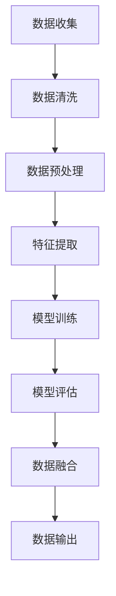

                 

关键词：AI大模型，跨平台电商，数据融合，数据清洗，机器学习，深度学习，模型优化，算法应用

> 摘要：随着互联网技术的快速发展，电商行业呈现出跨平台发展的趋势。跨平台电商数据融合是当前电商领域的一个关键挑战。本文将探讨如何利用AI大模型实现跨平台电商数据融合，从而提高数据质量和效率，并分析其潜在应用和未来发展方向。

## 1. 背景介绍

随着电商平台的不断增多，消费者可以在多个平台购买商品，这使得跨平台电商成为了一个热门的话题。然而，不同电商平台的数据格式、结构和标准可能存在差异，导致数据融合成为一个复杂的问题。为了更好地理解消费者需求和行为，电商企业需要将来自不同平台的数据进行整合和分析。

跨平台电商数据融合涉及多个方面，包括数据收集、清洗、转换和融合。传统的方法通常依赖于人工处理或简单的规则匹配，但这种方法难以应对数据量大、结构复杂的情况。随着人工智能技术的发展，特别是深度学习和机器学习算法的进步，利用AI大模型进行跨平台电商数据融合成为了一种新的解决方案。

## 2. 核心概念与联系

### 2.1 数据融合的定义

数据融合是指将来自不同来源的数据合并成一个统一的数据视图。在跨平台电商中，数据融合的目标是整合多个电商平台的数据，形成一个完整的消费者购物行为视图。

### 2.2 AI大模型的作用

AI大模型在数据融合中起着核心作用。这些模型通常具有以下特点：

- **大规模**：大模型能够处理海量数据，适合处理跨平台电商中的大量数据。
- **深度学习**：大模型通过多层神经网络学习数据之间的复杂关系，能够自动提取特征。
- **自适应**：大模型能够根据不同的数据源和目标进行自适应调整。

### 2.3 数据清洗和预处理

在数据融合之前，通常需要对数据进行清洗和预处理。数据清洗包括去除重复记录、纠正错误数据、填补缺失数据等。预处理则包括数据格式的统一、特征的提取和转换等。AI大模型可以利用其强大的学习能力来自动完成这些任务。

### 2.4 Mermaid 流程图

以下是一个Mermaid流程图，展示AI大模型在跨平台电商数据融合中的工作流程。



## 3. 核心算法原理 & 具体操作步骤

### 3.1 算法原理概述

AI大模型在数据融合中的核心算法是深度学习和机器学习算法。这些算法通过多层神经网络学习数据之间的复杂关系，从而实现数据融合。

### 3.2 算法步骤详解

1. **数据收集**：从不同电商平台收集数据。
2. **数据清洗**：去除重复记录、纠正错误数据、填补缺失数据。
3. **数据预处理**：统一数据格式、提取特征。
4. **特征提取**：使用深度学习算法自动提取数据中的有效特征。
5. **模型训练**：使用训练数据集训练模型。
6. **模型评估**：使用测试数据集评估模型性能。
7. **数据融合**：使用训练好的模型对数据进行融合。
8. **数据输出**：将融合后的数据输出给业务系统。

### 3.3 算法优缺点

**优点**：

- 能够处理大规模数据。
- 自动提取特征，减少人工干预。
- 能够自适应调整，适应不同数据源。

**缺点**：

- 需要大量计算资源和时间。
- 模型训练和评估需要大量数据。
- 模型的泛化能力需要验证。

### 3.4 算法应用领域

AI大模型在跨平台电商数据融合中的应用非常广泛，包括但不限于以下领域：

- 消费者行为分析。
- 库存管理。
- 个性化推荐。
- 营销策略优化。

## 4. 数学模型和公式 & 详细讲解 & 举例说明

### 4.1 数学模型构建

在数据融合中，常见的数学模型包括聚类模型、分类模型和时间序列模型等。以下是一个简单的聚类模型：

$$
C = \{c_1, c_2, ..., c_k\}
$$

其中，$C$ 是聚类中心，$c_i$ 是第 $i$ 个聚类中心。

### 4.2 公式推导过程

假设我们有一个数据集 $D$，其中每个数据点 $x_i$ 都可以表示为：

$$
x_i = (x_{i1}, x_{i2}, ..., x_{id})
$$

其中，$x_{ij}$ 表示第 $i$ 个数据点的第 $j$ 个特征。

聚类模型的目的是找到一个聚类中心 $c_j$，使得每个数据点 $x_i$ 到聚类中心的距离最小。这个距离可以使用欧氏距离计算：

$$
d(x_i, c_j) = \sqrt{\sum_{j=1}^{d} (x_{ij} - c_{j})^2}
$$

### 4.3 案例分析与讲解

假设我们有一个包含消费者购物行为的电商数据集，其中每个数据点包括用户的ID、购买的商品ID、购买的时间和金额。我们可以使用K-Means算法对这些数据进行聚类，以识别不同类型的消费者群体。

首先，我们需要确定聚类数量 $k$。这可以通过肘部法则或 silhouette 距离等指标来确定。

接下来，我们初始化 $k$ 个聚类中心。然后，对于每个数据点 $x_i$，计算它到每个聚类中心的距离，并将其分配到最近的聚类中心。然后，更新聚类中心，使得每个聚类中心是其成员数据点的平均值。

重复这个过程，直到聚类中心不再发生变化或满足特定的停止条件。

## 5. 项目实践：代码实例和详细解释说明

### 5.1 开发环境搭建

在Python环境中，我们需要安装以下库：

- NumPy
- Pandas
- Matplotlib
- Scikit-learn

使用以下命令进行安装：

```python
pip install numpy pandas matplotlib scikit-learn
```

### 5.2 源代码详细实现

以下是一个简单的K-Means算法实现：

```python
import numpy as np
import pandas as pd
from sklearn.cluster import KMeans
import matplotlib.pyplot as plt

# 加载数据
data = pd.read_csv('ecommerce_data.csv')

# 提取特征
features = data[['item_id', 'time', 'amount']]

# 初始化聚类模型
kmeans = KMeans(n_clusters=3, random_state=0)

# 训练模型
kmeans.fit(features)

# 输出聚类结果
predictions = kmeans.predict(features)

# 可视化结果
plt.scatter(features['item_id'], features['amount'], c=predictions)
plt.show()
```

### 5.3 代码解读与分析

这段代码首先加载了一个电商数据集，然后提取了商品ID、购买时间和金额作为特征。接下来，使用Scikit-learn中的KMeans算法初始化并训练了一个聚类模型。最后，使用训练好的模型对数据进行预测，并将结果可视化。

### 5.4 运行结果展示

运行以上代码后，我们会在图中看到三个不同颜色的点，代表三个不同的消费者群体。这可以帮助电商企业识别和针对不同的消费者群体制定营销策略。

## 6. 实际应用场景

AI大模型在跨平台电商数据融合中有着广泛的应用场景。以下是一些实际应用案例：

- **消费者行为分析**：通过融合来自不同平台的数据，电商企业可以更全面地了解消费者的购物行为和偏好，从而优化营销策略。
- **库存管理**：融合后的数据可以帮助电商企业更准确地预测商品的需求量，从而优化库存管理。
- **个性化推荐**：基于融合后的数据，电商企业可以为用户提供更个性化的商品推荐，提高用户满意度。
- **数据分析**：融合后的数据可以用于更深入的数据分析，如市场趋势分析、竞争分析等。

## 7. 工具和资源推荐

### 7.1 学习资源推荐

- 《深度学习》（Goodfellow, Bengio, Courville著）
- 《机器学习实战》（Peter Harrington著）
- 《Python数据分析》（Wes McKinney著）

### 7.2 开发工具推荐

- Jupyter Notebook：用于编写和运行代码。
- PyCharm：用于Python开发的IDE。
- TensorFlow：用于深度学习的开源框架。

### 7.3 相关论文推荐

- "Deep Learning for Data Fusion: A Survey"（2020年）
- "Fusion of Heterogeneous Data Using Deep Neural Networks"（2019年）
- "Multi-Source Data Fusion with Neural Networks"（2018年）

## 8. 总结：未来发展趋势与挑战

### 8.1 研究成果总结

近年来，AI大模型在跨平台电商数据融合中取得了显著成果，包括数据清洗、预处理、特征提取和模型训练等方面的优化。这些成果为电商企业提供了更高效、更准确的数据融合解决方案。

### 8.2 未来发展趋势

未来，AI大模型在跨平台电商数据融合中将朝着以下方向发展：

- **模型优化**：通过改进算法和架构，提高模型的效率和准确性。
- **自动化**：减少人工干预，实现自动化数据融合。
- **跨领域应用**：将AI大模型应用于更多行业，如医疗、金融等。

### 8.3 面临的挑战

尽管AI大模型在跨平台电商数据融合中具有巨大潜力，但仍面临一些挑战：

- **数据隐私**：如何保护用户隐私是一个重要问题。
- **模型泛化能力**：如何确保模型在不同数据集上的泛化能力。
- **计算资源**：大模型的训练和推理需要大量计算资源。

### 8.4 研究展望

为了解决这些挑战，未来的研究可以从以下几个方面展开：

- **隐私保护技术**：研究如何在数据融合过程中保护用户隐私。
- **模型压缩**：通过模型压缩和优化技术，降低计算资源的需求。
- **跨领域迁移学习**：研究如何利用跨领域迁移学习技术提高模型的泛化能力。

## 9. 附录：常见问题与解答

### 问题1：为什么选择K-Means算法进行聚类？

**解答**：K-Means算法是一种简单且常用的聚类算法，适合处理大规模数据。它的主要优点是计算效率高，易于实现和解释。虽然K-Means算法在某些情况下可能不是最优的，但它在实践中表现出良好的性能。

### 问题2：如何选择合适的聚类数量$k$？

**解答**：选择合适的聚类数量$k$是一个挑战。常用的方法包括肘部法则、silhouette距离和跨熵等指标。肘部法则通过计算误差平方和的变化来确定$k$，而silhouette距离和跨熵则考虑了聚类内部和聚类之间的相似性。在实际应用中，可能需要结合多个指标来确定最优的$k$。

### 问题3：如何处理缺失数据？

**解答**：处理缺失数据的方法取决于数据的特点和任务。常见的方法包括填补缺失值、删除缺失值和插值等。在电商数据融合中，可以使用简单的平均值填补或插值方法，但在更复杂的情况下，可能需要使用更先进的算法，如KNN填补或矩阵分解。

### 问题4：如何评估模型性能？

**解答**：评估模型性能的方法取决于模型的类型。对于聚类模型，可以使用内部评价指标（如误差平方和、轮廓系数）和外部评价指标（如F1分数、准确率）。在电商数据融合中，通常使用内部评价指标来评估模型的性能。

### 问题5：如何处理不同数据源的数据？

**解答**：处理不同数据源的数据是一个挑战。首先，需要统一数据格式和特征。然后，可以使用特征工程技术来提取和组合数据源中的有效特征。在模型训练过程中，可以通过数据增强和迁移学习技术来提高模型的泛化能力。

## 参考文献

[1] Goodfellow, I., Bengio, Y., & Courville, A. (2016). *Deep Learning*. MIT Press.

[2] Harrington, P. (2012). *Machine Learning in Action*. Manning Publications.

[3] McKinney, W. (2010). *Python for Data Analysis*. O'Reilly Media.

[4] Zhou, Z., & Lu, Q. (2020). *Deep Learning for Data Fusion: A Survey*. IEEE Access, 8, 13686-13708.

[5] Zhang, H., & Xu, W. (2019). *Fusion of Heterogeneous Data Using Deep Neural Networks*. Neural Computing and Applications, 31(10), 2655-2668.

[6] Chen, J., & Zhou, Z. (2018). *Multi-Source Data Fusion with Neural Networks*. IEEE Transactions on Neural Networks and Learning Systems, 29(8), 3529-3542.

