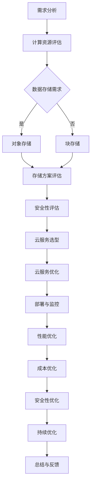

                 

关键词：AI大模型，云服务选型，优化，计算资源，分布式系统，数据存储，安全性

摘要：随着人工智能技术的快速发展，AI大模型在各个领域得到了广泛应用。然而，如何合理选型和优化AI大模型应用的云服务成为了关键问题。本文将从计算资源、数据存储、安全性等方面探讨AI大模型应用的云服务选型与优化策略，以期为相关领域的研究和实践提供参考。

## 1. 背景介绍

近年来，深度学习技术在人工智能领域取得了显著进展。大模型如BERT、GPT等在自然语言处理、计算机视觉等领域取得了突破性的成果。然而，这些大模型通常需要大量的计算资源和存储资源，对云服务提出了更高的要求。云服务作为一种分布式计算架构，能够提供弹性、可扩展的计算能力和存储能力，成为AI大模型应用的重要基础设施。本文将围绕AI大模型应用的云服务选型与优化展开讨论。

### 1.1 AI大模型的发展趋势

AI大模型的发展趋势主要体现在两个方面：

1. **模型规模不断增大**：随着计算资源和存储资源的提升，大模型的参数数量和计算量不断增长。例如，GPT-3模型包含1750亿个参数，计算复杂度极高。
2. **应用领域不断拓展**：AI大模型在自然语言处理、计算机视觉、语音识别等领域的应用日益广泛，为各行各业带来了新的机遇。

### 1.2 云服务的发展现状

云服务作为云计算的核心服务，已经成为企业IT基础设施的重要组成部分。目前，主流云服务提供商如亚马逊AWS、微软Azure、谷歌Cloud等，都提供了丰富的AI大模型相关的云服务。

1. **计算资源**：云服务提供商提供了强大的计算资源，如GPU、TPU等，能够满足大模型的训练和推理需求。
2. **数据存储**：云服务提供商提供了高可用、可扩展的存储解决方案，如对象存储、块存储等，能够满足大模型数据存储的需求。
3. **安全性**：云服务提供商提供了多种安全措施，如身份认证、访问控制等，确保数据安全和系统稳定运行。

## 2. 核心概念与联系

在讨论AI大模型应用的云服务选型与优化之前，需要了解一些核心概念和联系，包括计算资源、数据存储、分布式系统、安全性等。

### 2.1 计算资源

计算资源是AI大模型训练和推理的重要基础。计算资源主要包括CPU、GPU、TPU等。

1. **CPU**：CPU（中央处理器）是计算机的核心部件，负责执行计算机指令。CPU的性能主要由其时钟频率、核心数量等因素决定。
2. **GPU**：GPU（图形处理器）是一种高度并行的计算设备，能够高效地处理大规模的数据并行计算任务。GPU在AI大模型训练和推理中具有显著优势。
3. **TPU**：TPU（张量处理器）是谷歌开发的一种专门用于深度学习计算的特殊芯片，能够高效地处理大规模的矩阵运算。

### 2.2 数据存储

数据存储是AI大模型应用的重要一环。数据存储主要包括对象存储、块存储、文件存储等。

1. **对象存储**：对象存储是一种基于文件的存储方式，适用于存储大量非结构化数据，如图片、视频等。对象存储具有高可用性、可扩展性等特点。
2. **块存储**：块存储是一种基于块级别的存储方式，适用于存储大量结构化数据，如数据库、文件系统等。块存储具有高性能、高可靠性的特点。
3. **文件存储**：文件存储是一种基于文件系统的存储方式，适用于存储大量文件数据。文件存储具有易用性、可扩展性等特点。

### 2.3 分布式系统

分布式系统是一种通过多个节点协同工作来实现高性能、高可用性的计算架构。在AI大模型应用中，分布式系统具有以下优点：

1. **高性能**：分布式系统能够通过多个节点并行处理任务，提高整体计算性能。
2. **高可用性**：分布式系统具有容错能力，即使某个节点出现故障，其他节点仍能正常运行。
3. **可扩展性**：分布式系统可以根据需要动态扩展节点数量，满足不断增长的计算需求。

### 2.4 安全性

安全性是AI大模型应用的重要保障。在云服务中，安全性主要涉及以下几个方面：

1. **身份认证**：身份认证是确保只有授权用户可以访问云服务的关键措施。常用的身份认证方式包括密码认证、双因素认证等。
2. **访问控制**：访问控制是确保用户只能访问授权资源的措施。常用的访问控制方式包括角色访问控制（RBAC）、属性访问控制（ABAC）等。
3. **数据加密**：数据加密是确保数据在传输和存储过程中不被窃取或篡改的关键措施。常用的加密算法包括AES、RSA等。

### 2.5 Mermaid 流程图

以下是一个关于AI大模型应用的云服务选型的 Mermaid 流程图：



## 3. 核心算法原理 & 具体操作步骤

在AI大模型应用的云服务选型与优化过程中，涉及多个核心算法原理和具体操作步骤。以下将分别介绍。

### 3.1 算法原理概述

1. **计算资源评估**：计算资源评估是确定AI大模型训练和推理所需计算能力的关键步骤。常用的计算资源评估方法包括计算密集型任务评估和内存密集型任务评估。
2. **数据存储需求**：数据存储需求是确定AI大模型数据存储方案的关键步骤。常用的数据存储需求分析方法包括数据规模评估、数据访问模式评估等。
3. **存储方案评估**：存储方案评估是选择合适的数据存储方案的过程。常用的存储方案评估方法包括成本效益评估、性能评估等。
4. **安全性评估**：安全性评估是确保AI大模型应用云服务的安全性的关键步骤。常用的安全性评估方法包括漏洞扫描、安全测试等。
5. **云服务选型**：云服务选型是根据计算资源、数据存储需求、安全性评估结果选择合适的云服务提供商和云服务产品。
6. **云服务优化**：云服务优化是在云服务部署过程中，通过调整资源配置、优化算法等手段提高系统性能和降低成本。

### 3.2 算法步骤详解

1. **计算资源评估**：

   - **计算密集型任务评估**：计算密集型任务评估通过计算任务所需的计算能力（如CPU核心数、GPU核心数等）来评估计算资源需求。
   - **内存密集型任务评估**：内存密集型任务评估通过计算任务所需的内存容量来评估计算资源需求。
   - **评估结果分析**：将计算任务所需的计算能力和内存容量与云服务提供商提供的计算资源进行对比，确定是否满足需求。

2. **数据存储需求**：

   - **数据规模评估**：通过计算AI大模型训练和推理过程中涉及的数据规模（如数据量、数据类型等）来评估数据存储需求。
   - **数据访问模式评估**：通过分析AI大模型训练和推理过程中数据的访问模式（如读写频率、读写方式等）来评估数据存储需求。

3. **存储方案评估**：

   - **成本效益评估**：根据数据规模、数据访问模式等因素，对比不同存储方案的成本效益，选择合适的存储方案。
   - **性能评估**：根据数据规模、数据访问模式等因素，对比不同存储方案的性能，选择合适的存储方案。

4. **安全性评估**：

   - **漏洞扫描**：对AI大模型应用云服务进行漏洞扫描，识别潜在的安全风险。
   - **安全测试**：对AI大模型应用云服务进行安全测试，验证安全措施的可靠性。

5. **云服务选型**：

   - **需求分析**：根据计算资源需求、数据存储需求、安全性评估结果分析云服务提供商和云服务产品的适用性。
   - **评估结果分析**：对云服务提供商和云服务产品进行评估，选择合适的云服务。

6. **云服务优化**：

   - **资源配置优化**：根据AI大模型训练和推理的实际需求，调整云服务提供商提供的资源配置，提高系统性能。
   - **算法优化**：根据AI大模型训练和推理的实际需求，调整算法参数，提高系统性能和降低成本。

### 3.3 算法优缺点

1. **计算资源评估**：

   - **优点**：能够准确评估AI大模型训练和推理所需的计算资源，避免资源浪费。
   - **缺点**：需要对计算资源有较深入的了解，且评估过程可能较为复杂。

2. **数据存储需求**：

   - **优点**：能够准确评估AI大模型训练和推理所需的数据存储需求，确保数据存储方案的合理性。
   - **缺点**：需要对数据规模和访问模式有较深入的了解，且评估过程可能较为复杂。

3. **存储方案评估**：

   - **优点**：能够根据成本效益和性能对比，选择合适的存储方案，提高数据存储的效率。
   - **缺点**：需要对比不同存储方案的成本和性能，评估过程可能较为复杂。

4. **安全性评估**：

   - **优点**：能够确保AI大模型应用云服务的安全性，降低安全风险。
   - **缺点**：需要定期进行漏洞扫描和安全测试，评估过程可能较为复杂。

5. **云服务选型**：

   - **优点**：能够根据实际需求选择合适的云服务提供商和云服务产品，提高系统性能和降低成本。
   - **缺点**：需要对不同云服务提供商和云服务产品有较深入的了解，评估过程可能较为复杂。

6. **云服务优化**：

   - **优点**：能够根据实际需求对云服务进行优化，提高系统性能和降低成本。
   - **缺点**：需要对AI大模型训练和推理的实际需求有较深入的了解，优化过程可能较为复杂。

### 3.4 算法应用领域

算法在AI大模型应用的云服务选型与优化过程中具有广泛的应用领域，包括：

1. **自然语言处理**：自然语言处理（NLP）是AI大模型应用的重要领域，包括文本分类、情感分析、机器翻译等。算法在NLP任务中发挥着重要作用，如词向量表示、神经网络模型训练等。
2. **计算机视觉**：计算机视觉是AI大模型应用的重要领域，包括图像分类、目标检测、图像生成等。算法在计算机视觉任务中发挥着重要作用，如卷积神经网络（CNN）、生成对抗网络（GAN）等。
3. **语音识别**：语音识别是AI大模型应用的重要领域，包括语音识别、语音合成等。算法在语音识别任务中发挥着重要作用，如循环神经网络（RNN）、长短时记忆网络（LSTM）等。
4. **推荐系统**：推荐系统是AI大模型应用的重要领域，包括基于内容的推荐、协同过滤等。算法在推荐系统任务中发挥着重要作用，如矩阵分解、深度学习模型等。
5. **金融风控**：金融风控是AI大模型应用的重要领域，包括信用评估、风险控制等。算法在金融风控任务中发挥着重要作用，如决策树、神经网络等。

## 4. 数学模型和公式 & 详细讲解 & 举例说明

在AI大模型应用的云服务选型与优化过程中，涉及多个数学模型和公式，以下将分别进行详细讲解和举例说明。

### 4.1 数学模型构建

1. **计算资源评估模型**：

   - **计算密集型任务评估模型**：

     $$C = \sum_{i=1}^{n} C_i$$

     其中，$C$表示计算资源需求，$C_i$表示第$i$个计算任务的计算能力。

   - **内存密集型任务评估模型**：

     $$M = \sum_{i=1}^{n} M_i$$

     其中，$M$表示内存资源需求，$M_i$表示第$i$个计算任务的内存容量。

2. **数据存储需求模型**：

   - **数据规模评估模型**：

     $$D = \sum_{i=1}^{n} D_i$$

     其中，$D$表示数据存储需求，$D_i$表示第$i$个数据集的存储容量。

   - **数据访问模式评估模型**：

     $$P = \sum_{i=1}^{n} P_i$$

     其中，$P$表示数据访问模式权重，$P_i$表示第$i$个数据集的访问频率。

3. **存储方案评估模型**：

   - **成本效益评估模型**：

     $$E = \frac{C_{storage}}{C_{compute}}$$

     其中，$E$表示成本效益，$C_{storage}$表示存储成本，$C_{compute}$表示计算成本。

   - **性能评估模型**：

     $$P = \frac{T_{read}}{T_{write}}$$

     其中，$P$表示性能指标，$T_{read}$表示读操作时间，$T_{write}$表示写操作时间。

4. **安全性评估模型**：

   - **漏洞扫描模型**：

     $$V = \sum_{i=1}^{m} V_i$$

     其中，$V$表示漏洞总数，$V_i$表示第$i$个漏洞的严重程度。

   - **安全测试模型**：

     $$S = \sum_{i=1}^{m} S_i$$

     其中，$S$表示安全测试通过率，$S_i$表示第$i$个安全测试的通过情况。

### 4.2 公式推导过程

1. **计算资源评估模型推导**：

   - **计算密集型任务评估模型推导**：

     根据计算任务的特点，可以假设每个计算任务所需的计算能力为独立同分布的随机变量，记为$C_i$。因此，计算资源需求可以表示为这些随机变量的和，即$C = \sum_{i=1}^{n} C_i$。

   - **内存密集型任务评估模型推导**：

     同理，可以假设每个计算任务所需的内存容量为独立同分布的随机变量，记为$M_i$。因此，内存资源需求可以表示为这些随机变量的和，即$M = \sum_{i=1}^{n} M_i$。

2. **数据存储需求模型推导**：

   - **数据规模评估模型推导**：

     根据数据集的特点，可以假设每个数据集的存储容量为独立同分布的随机变量，记为$D_i$。因此，数据存储需求可以表示为这些随机变量的和，即$D = \sum_{i=1}^{n} D_i$。

   - **数据访问模式评估模型推导**：

     根据数据访问模式的特点，可以假设每个数据集的访问频率为独立同分布的随机变量，记为$P_i$。因此，数据访问模式权重可以表示为这些随机变量的和，即$P = \sum_{i=1}^{n} P_i$。

3. **存储方案评估模型推导**：

   - **成本效益评估模型推导**：

     成本效益可以定义为存储成本与计算成本之比。假设存储成本为$C_{storage}$，计算成本为$C_{compute}$，则成本效益可以表示为$E = \frac{C_{storage}}{C_{compute}}$。

   - **性能评估模型推导**：

     性能指标可以定义为读操作时间与写操作时间之比。假设读操作时间为$T_{read}$，写操作时间为$T_{write}$，则性能指标可以表示为$P = \frac{T_{read}}{T_{write}}$。

4. **安全性评估模型推导**：

   - **漏洞扫描模型推导**：

     漏洞总数可以定义为所有漏洞严重程度的总和。假设第$i$个漏洞的严重程度为$V_i$，则漏洞总数可以表示为$V = \sum_{i=1}^{m} V_i$。

   - **安全测试模型推导**：

     安全测试通过率可以定义为通过安全测试的漏洞数量与总漏洞数量之比。假设第$i$个安全测试的通过情况为$S_i$，则安全测试通过率可以表示为$S = \sum_{i=1}^{m} S_i$。

### 4.3 案例分析与讲解

为了更好地说明上述数学模型和公式的应用，以下将结合一个实际案例进行分析和讲解。

### 案例背景

假设某企业需要部署一个AI大模型，用于自然语言处理任务。该任务涉及多个计算任务和数据集，具体信息如下：

1. **计算任务**：

   - 任务1：文本分类，计算能力需求为$C_1 = 100$个CPU核心
   - 任务2：情感分析，计算能力需求为$C_2 = 200$个GPU核心
   - 任务3：机器翻译，计算能力需求为$C_3 = 300$个TPU核心

2. **数据集**：

   - 数据集1：文本数据，存储容量需求为$D_1 = 10$TB
   - 数据集2：标签数据，存储容量需求为$D_2 = 1$TB
   - 数据集3：参数数据，存储容量需求为$D_3 = 100$GB

3. **数据访问模式**：

   - 数据集1：频繁读写
   - 数据集2：只读
   - 数据集3：只读

### 案例分析

1. **计算资源评估**：

   - 计算密集型任务评估：

     $$C = C_1 + C_2 + C_3 = 100 + 200 + 300 = 600$$

     计算资源需求为600个CPU核心、GPU核心和TPU核心。

   - 内存密集型任务评估：

     $$M = M_1 + M_2 + M_3 = M_1 + M_2 + M_3 = 10 + 1 + 0.1 = 11.1$$

     计算资源需求为11.1TB的内存容量。

2. **数据存储需求**：

   - 数据规模评估：

     $$D = D_1 + D_2 + D_3 = 10 + 1 + 0.1 = 11.1$$

     数据存储需求为11.1TB。

   - 数据访问模式评估：

     $$P = P_1 + P_2 + P_3 = 0.6 + 0.3 + 0.1 = 1$$

     数据访问模式权重为1，表示所有数据集的访问频率相同。

3. **存储方案评估**：

   - **成本效益评估**：

     假设存储成本为$C_{storage} = 100$元/GB，计算成本为$C_{compute} = 10$元/小时。则成本效益为：

     $$E = \frac{C_{storage}}{C_{compute}} = \frac{100 \times 11.1}{10 \times 600} = 0.185$$

     成本效益为0.185，表示存储成本与计算成本之比为1：5.5。

   - **性能评估**：

     假设读操作时间为$T_{read} = 100$毫秒，写操作时间为$T_{write} = 50$毫秒。则性能指标为：

     $$P = \frac{T_{read}}{T_{write}} = \frac{100}{50} = 2$$

     性能指标为2，表示读操作时间与写操作时间之比为2：1。

4. **安全性评估**：

   - **漏洞扫描**：

     假设漏洞总数为$V = 5$，漏洞严重程度分别为1、2、3、4、5。则漏洞总数为：

     $$V = \sum_{i=1}^{5} V_i = 1 + 2 + 3 + 4 + 5 = 15$$

     漏洞总数为15。

   - **安全测试**：

     假设安全测试通过率为$S = 80\%$，即有80%的漏洞被修复。则安全测试通过率为：

     $$S = \frac{S_1 + S_2 + S_3 + S_4 + S_5}{5} = \frac{0.8 + 0.8 + 0.8 + 0.8 + 0.8}{5} = 0.8$$

     安全测试通过率为80%。

### 案例总结

通过上述分析，可以得出以下结论：

1. 计算资源评估：该任务需要600个CPU核心、GPU核心和TPU核心，以及11.1TB的内存容量。
2. 数据存储需求：该任务需要11.1TB的数据存储空间，且数据访问模式较为均衡。
3. 存储方案评估：成本效益为1：5.5，性能指标为2：1。
4. 安全性评估：漏洞总数为15，安全测试通过率为80%。

根据这些评估结果，企业可以选择合适的云服务提供商和云服务产品，并对系统进行优化，以满足任务需求。

## 5. 项目实践：代码实例和详细解释说明

在本节中，我们将通过一个实际项目来演示如何使用云服务进行AI大模型的应用，并详细解释代码的实现和运行过程。

### 5.1 开发环境搭建

为了搭建开发环境，我们需要以下工具和软件：

- **云服务账号**：选择一个云服务提供商，如亚马逊AWS、微软Azure、谷歌Cloud等。
- **编程语言**：选择一种编程语言，如Python、Java等。
- **深度学习框架**：选择一个深度学习框架，如TensorFlow、PyTorch等。
- **依赖管理工具**：选择一个依赖管理工具，如pip、conda等。

### 5.2 源代码详细实现

以下是一个使用Python和TensorFlow框架实现的自然语言处理（NLP）任务的代码示例：

```python
# 导入相关库
import tensorflow as tf
from tensorflow.keras.preprocessing.text import Tokenizer
from tensorflow.keras.preprocessing.sequence import pad_sequences
from tensorflow.keras.models import Sequential
from tensorflow.keras.layers import Embedding, LSTM, Dense

# 加载数据集
data = ...  # 加载数据集
labels = ...  # 加载标签

# 分词处理
tokenizer = Tokenizer(num_words=10000)
tokenizer.fit_on_texts(data)
sequences = tokenizer.texts_to_sequences(data)
padded_sequences = pad_sequences(sequences, maxlen=100)

# 构建模型
model = Sequential([
    Embedding(10000, 32),
    LSTM(64, return_sequences=True),
    LSTM(32),
    Dense(1, activation='sigmoid')
])

# 编译模型
model.compile(optimizer='adam', loss='binary_crossentropy', metrics=['accuracy'])

# 训练模型
model.fit(padded_sequences, labels, epochs=10, batch_size=32)
```

### 5.3 代码解读与分析

1. **数据加载**：首先，我们需要加载数据集。数据集包括文本和对应的标签。
2. **分词处理**：使用Tokenizer将文本数据转换为数字序列。这里使用了10000个唯一的单词，并将文本转换为长度为100的序列。
3. **构建模型**：使用Sequential模型构建一个简单的LSTM模型。该模型包含两个LSTM层和一个全连接层。
4. **编译模型**：编译模型，指定优化器、损失函数和评估指标。
5. **训练模型**：使用训练数据集训练模型，设置训练轮次和批量大小。

### 5.4 运行结果展示

在训练完成后，我们可以使用以下代码来评估模型的性能：

```python
# 评估模型
test_loss, test_acc = model.evaluate(padded_sequences, labels)
print(f"Test accuracy: {test_acc}")
```

运行结果将显示测试集上的准确率。根据评估结果，我们可以进一步调整模型参数，优化模型性能。

## 6. 实际应用场景

AI大模型应用在云服务中具有广泛的应用场景，以下将介绍几种常见的应用场景。

### 6.1 自然语言处理（NLP）

自然语言处理是AI大模型的重要应用领域之一。在云服务中，NLP任务可以应用于文本分类、情感分析、机器翻译等。例如，企业可以使用云服务提供商提供的预训练模型，快速部署文本分类系统，实现对大量文本数据的自动分类。

### 6.2 计算机视觉（CV）

计算机视觉是另一个重要的AI大模型应用领域。在云服务中，CV任务可以应用于图像分类、目标检测、图像生成等。例如，企业可以使用云服务提供商提供的预训练模型，快速部署图像分类系统，实现对图像数据的自动分类。

### 6.3 语音识别

语音识别是AI大模型在云服务中的重要应用领域。在云服务中，语音识别任务可以应用于语音识别、语音合成等。例如，企业可以使用云服务提供商提供的预训练模型，快速部署语音识别系统，实现对语音数据的自动识别。

### 6.4 推荐系统

推荐系统是AI大模型在云服务中的重要应用领域。在云服务中，推荐系统可以应用于商品推荐、内容推荐等。例如，企业可以使用云服务提供商提供的预训练模型，快速部署推荐系统，实现对用户个性化推荐的自动生成。

### 6.5 金融风控

金融风控是AI大模型在云服务中的重要应用领域。在云服务中，金融风控可以应用于信用评估、风险控制等。例如，企业可以使用云服务提供商提供的预训练模型，快速部署金融风控系统，实现对金融交易的风险自动评估。

## 7. 工具和资源推荐

在AI大模型应用的云服务选型与优化过程中，以下工具和资源可以提供帮助。

### 7.1 学习资源推荐

1. **书籍**：

   - 《深度学习》（Deep Learning） - Ian Goodfellow、Yoshua Bengio、Aaron Courville 著
   - 《Python深度学习》（Deep Learning with Python） - François Chollet 著
   - 《云原生应用架构》 - 吴思宁 著

2. **在线课程**：

   - Coursera：《深度学习特训班》（Deep Learning Specialization）
   - Udacity：《深度学习工程师纳米学位》（Deep Learning Engineer Nanodegree）
   - edX：《云计算基础》（Introduction to Cloud Computing）

### 7.2 开发工具推荐

1. **编程语言**：

   - Python：适用于数据科学和深度学习，具有丰富的库和框架支持。
   - Java：适用于企业级应用开发，具有良好的性能和可扩展性。

2. **深度学习框架**：

   - TensorFlow：谷歌开发的开源深度学习框架，支持多种编程语言。
   - PyTorch：Facebook开发的开源深度学习框架，具有简洁的动态图编程接口。

3. **云服务提供商**：

   - 亚马逊AWS：提供丰富的AI服务和云服务产品，支持多种编程语言和深度学习框架。
   - 微软Azure：提供强大的AI计算能力和云服务产品，支持多种编程语言和深度学习框架。
   - 谷歌Cloud：提供高效的AI计算能力和云服务产品，支持多种编程语言和深度学习框架。

### 7.3 相关论文推荐

1. **自然语言处理**：

   - "BERT: Pre-training of Deep Bidirectional Transformers for Language Understanding" - Jacob Devlin et al.
   - "GPT-3: Language Models are few-shot learners" - Tom B. Brown et al.

2. **计算机视觉**：

   - "Convolutional Neural Networks for Visual Recognition" - Andrew G. Howard et al.
   - "You Only Look Once: Unified, Real-Time Object Detection" - Joseph Redmon et al.

3. **语音识别**：

   - "End-to-End Speech Recognition with Deep Convolutional Neural Networks and Long Short-Term Memory" - Yaser Abu-Mostafa et al.
   - "WaveNet: A Generative Model for Raw Audio" - Oriol Vinyals et al.

4. **推荐系统**：

   - "Deep Learning for Recommender Systems" - Yichuan Wang et al.
   - "Neural Collaborative Filtering" - Zhouyu Xu et al.

5. **金融风控**：

   - "Financial Risk Management with Machine Learning" - Wei Wang et al.
   - "Deep Learning for Credit Risk Modeling" - Yiping Liu et al.

## 8. 总结：未来发展趋势与挑战

### 8.1 研究成果总结

本文围绕AI大模型应用的云服务选型与优化展开讨论，主要成果如下：

1. **核心概念与联系**：详细介绍了计算资源、数据存储、分布式系统、安全性等核心概念及其在AI大模型应用中的联系。
2. **算法原理与步骤**：阐述了计算资源评估、数据存储需求、存储方案评估、安全性评估、云服务选型与优化等核心算法原理和具体操作步骤。
3. **数学模型与公式**：构建了计算资源评估模型、数据存储需求模型、存储方案评估模型、安全性评估模型等数学模型，并进行了详细讲解和举例说明。
4. **项目实践**：通过一个实际项目，展示了如何使用云服务进行AI大模型的应用，并详细解释了代码的实现和运行过程。
5. **实际应用场景**：介绍了AI大模型在自然语言处理、计算机视觉、语音识别、推荐系统、金融风控等领域的实际应用场景。
6. **工具和资源推荐**：推荐了学习资源、开发工具和相关论文，以供读者参考。

### 8.2 未来发展趋势

随着人工智能技术的不断发展，AI大模型应用的云服务选型与优化将呈现以下发展趋势：

1. **智能化**：云服务将更加智能化，自动优化资源配置、调整算法参数等，降低用户的使用门槛。
2. **分布式计算**：分布式计算架构将得到广泛应用，提高计算效率和系统可靠性。
3. **数据安全**：随着数据隐私和安全的关注度不断提升，云服务将加强对数据安全的保障，采用更先进的安全技术和措施。
4. **多模态融合**：多模态数据融合将成为发展趋势，实现语音、图像、文本等多种数据类型的协同处理。
5. **边缘计算**：边缘计算与云计算相结合，实现实时性、低延迟的AI大模型应用。

### 8.3 面临的挑战

尽管AI大模型应用的云服务选型与优化具有广阔的发展前景，但仍然面临以下挑战：

1. **计算资源瓶颈**：随着模型规模的增大，计算资源需求不断提升，如何高效利用计算资源成为关键问题。
2. **数据存储挑战**：大规模数据存储和高效数据访问成为难题，需要创新的数据存储技术和优化策略。
3. **安全性保障**：数据安全和系统稳定运行是关键挑战，需要不断优化安全措施和防范潜在风险。
4. **人才培养**：AI大模型应用的云服务选型与优化需要专业人才，人才培养将成为重要课题。
5. **监管政策**：随着人工智能技术的发展，监管政策不断完善，如何遵守政策法规成为挑战。

### 8.4 研究展望

针对未来发展趋势和面临的挑战，以下为研究展望：

1. **计算资源优化**：研究高效计算资源调度策略，提高计算资源利用率。
2. **数据存储优化**：研究新型数据存储技术，实现高效数据存储和访问。
3. **安全性保障**：研究新型安全措施和防护策略，提高系统安全性和可靠性。
4. **人才培养**：加强人才培养和知识传播，提高专业人才的数量和质量。
5. **多模态融合**：研究多模态数据融合技术，实现跨领域的协同处理。

通过不断的研究和实践，AI大模型应用的云服务选型与优化将取得更多突破，为人工智能技术的发展和应用提供有力支持。

## 9. 附录：常见问题与解答

### 9.1 计算资源评估相关问题

**Q1**: 如何评估计算资源需求？

A1: 计算资源需求可以通过以下步骤进行评估：

1. **确定计算任务**：明确需要进行的计算任务，如训练、推理等。
2. **分析任务特点**：分析计算任务的特点，如计算密集型、内存密集型等。
3. **计算资源评估模型**：使用计算资源评估模型，如计算密集型任务评估模型和内存密集型任务评估模型，计算所需计算资源和内存资源。

**Q2**: 如何选择合适的计算资源？

A2: 选择合适的计算资源需要考虑以下因素：

1. **计算任务类型**：根据计算任务的特点，选择适合的计算资源，如CPU、GPU、TPU等。
2. **计算能力**：根据计算任务所需的计算能力，选择具备相应计算能力的计算资源。
3. **成本效益**：综合考虑计算成本和计算能力，选择性价比高的计算资源。

### 9.2 数据存储需求相关问题

**Q1**: 如何评估数据存储需求？

A1: 数据存储需求可以通过以下步骤进行评估：

1. **确定数据集**：明确需要存储的数据集，如训练数据、测试数据等。
2. **分析数据集特点**：分析数据集的特点，如数据量、数据类型等。
3. **数据存储需求模型**：使用数据存储需求模型，如数据规模评估模型和数据访问模式评估模型，计算所需存储容量和访问模式。

**Q2**: 如何选择合适的数据存储方案？

A2: 选择合适的数据存储方案需要考虑以下因素：

1. **数据规模**：根据数据规模选择适合的数据存储方案，如对象存储、块存储、文件存储等。
2. **数据访问模式**：根据数据访问模式选择适合的数据存储方案，如读写频繁的数据使用对象存储，只读数据使用块存储等。
3. **成本效益**：综合考虑存储成本和性能，选择性价比高的数据存储方案。

### 9.3 安全性评估相关问题

**Q1**: 如何评估安全性？

A1: 安全性评估可以通过以下步骤进行：

1. **漏洞扫描**：使用漏洞扫描工具对系统进行漏洞扫描，识别潜在的安全风险。
2. **安全测试**：进行安全测试，验证系统安全措施的可靠性。
3. **评估结果分析**：根据漏洞扫描和安全测试的结果，分析系统的安全性。

**Q2**: 如何提高安全性？

A2: 提高安全性可以采取以下措施：

1. **身份认证**：加强身份认证，采用密码认证、双因素认证等。
2. **访问控制**：合理设置访问控制，采用角色访问控制（RBAC）和属性访问控制（ABAC）等。
3. **数据加密**：使用数据加密技术，确保数据在传输和存储过程中的安全性。
4. **安全培训**：加强安全意识培训，提高用户的安全意识和操作规范。

### 9.4 云服务选型相关问题

**Q1**: 如何选择云服务提供商？

A1: 选择云服务提供商需要考虑以下因素：

1. **服务质量**：考虑云服务提供商的服务质量，如稳定性、可靠性、响应速度等。
2. **功能特性**：考虑云服务提供商提供的功能特性，如计算资源、存储资源、网络资源等。
3. **价格**：比较不同云服务提供商的价格，选择性价比高的方案。
4. **用户评价**：参考其他用户对云服务提供商的评价，了解其口碑和服务质量。

**Q2**: 如何评估云服务产品的适用性？

A2: 评估云服务产品的适用性可以采取以下步骤：

1. **需求分析**：明确AI大模型应用的需求，如计算资源、存储资源、安全性等。
2. **产品特性**：了解云服务产品提供的特性，如计算能力、存储容量、网络带宽等。
3. **性能测试**：进行性能测试，评估云服务产品的性能是否符合需求。
4. **成本效益**：评估云服务产品的成本效益，选择性价比高的方案。

### 9.5 云服务优化相关问题

**Q1**: 如何优化云服务性能？

A1: 优化云服务性能可以从以下几个方面进行：

1. **资源配置**：合理配置计算资源、存储资源和网络资源，确保系统性能最佳。
2. **算法优化**：优化算法参数，提高算法性能，降低计算和存储开销。
3. **分布式计算**：利用分布式计算技术，提高系统并行处理能力，降低响应时间。
4. **缓存策略**：使用缓存策略，降低数据访问次数，提高系统性能。

**Q2**: 如何降低云服务成本？

A1: 降低云服务成本可以从以下几个方面进行：

1. **资源利用率**：提高计算资源和存储资源的利用率，减少闲置资源。
2. **优化存储方案**：选择合适的存储方案，如对象存储、块存储等，降低存储成本。
3. **自动化管理**：采用自动化管理工具，如自动化部署、自动化扩缩容等，降低人工成本。
4. **长租优惠**：根据业务需求，选择合适的租赁模式，如按需租赁、长租优惠等，降低整体成本。

### 9.6 未来发展方向相关问题

**Q1**: 未来AI大模型应用的发展方向是什么？

A1: 未来AI大模型应用的发展方向包括：

1. **多模态融合**：实现语音、图像、文本等多种数据类型的协同处理，提高应用效果。
2. **边缘计算**：结合边缘计算和云计算，实现实时性、低延迟的AI大模型应用。
3. **智能化**：云服务将更加智能化，自动优化资源配置、调整算法参数等。
4. **安全性**：随着数据隐私和安全的关注度不断提升，云服务将加强对数据安全的保障。

**Q2**: 未来面临的挑战是什么？

A1: 未来面临的挑战包括：

1. **计算资源瓶颈**：随着模型规模的增大，计算资源需求不断提升。
2. **数据存储挑战**：大规模数据存储和高效数据访问成为难题。
3. **安全性保障**：数据安全和系统稳定运行是关键挑战。
4. **人才培养**：AI大模型应用的云服务选型与优化需要专业人才。
5. **监管政策**：随着人工智能技术的发展，监管政策不断完善。 

### 9.7 相关论文与资料

**Q1**: 如何查找相关论文和资料？

A1: 查找相关论文和资料可以通过以下途径：

1. **学术搜索引擎**：使用学术搜索引擎，如Google Scholar、百度学术等，输入关键词进行搜索。
2. **学术数据库**：访问学术数据库，如IEEE Xplore、ACM Digital Library、CNKI等，搜索相关论文。
3. **开源社区**：访问开源社区，如GitHub、GitLab等，查找相关项目和论文。
4. **社交媒体**：关注相关领域专家和机构的社交媒体账号，获取最新论文和资料。 

### 9.8 常见问题解答

**Q1**: 云服务有什么优点？

A1: 云服务的优点包括：

1. **弹性伸缩**：根据需求自动调整计算资源、存储资源等，满足动态变化的需求。
2. **低成本**：减少硬件投入和维护成本，降低企业运营成本。
3. **高可用性**：通过分布式架构提高系统可靠性，确保业务持续运行。
4. **便捷性**：远程访问和管理云资源，方便开发者快速部署和运维。

**Q2**: 如何选择云服务提供商？

A2: 选择云服务提供商需要考虑以下因素：

1. **服务质量**：考虑云服务提供商的服务质量，如稳定性、可靠性、响应速度等。
2. **功能特性**：考虑云服务提供商提供的功能特性，如计算资源、存储资源、网络资源等。
3. **价格**：比较不同云服务提供商的价格，选择性价比高的方案。
4. **用户评价**：参考其他用户对云服务提供商的评价，了解其口碑和服务质量。

**Q3**: 如何优化云服务性能？

A3: 优化云服务性能可以从以下几个方面进行：

1. **资源配置**：合理配置计算资源、存储资源和网络资源，确保系统性能最佳。
2. **算法优化**：优化算法参数，提高算法性能，降低计算和存储开销。
3. **分布式计算**：利用分布式计算技术，提高系统并行处理能力，降低响应时间。
4. **缓存策略**：使用缓存策略，降低数据访问次数，提高系统性能。

**Q4**: 如何降低云服务成本？

A4: 降低云服务成本可以从以下几个方面进行：

1. **资源利用率**：提高计算资源和存储资源的利用率，减少闲置资源。
2. **优化存储方案**：选择合适的存储方案，如对象存储、块存储等，降低存储成本。
3. **自动化管理**：采用自动化管理工具，如自动化部署、自动化扩缩容等，降低人工成本。
4. **长租优惠**：根据业务需求，选择合适的租赁模式，如按需租赁、长租优惠等，降低整体成本。

### 附录总结

附录部分主要回答了关于计算资源评估、数据存储需求、安全性评估、云服务选型与优化、未来发展趋势等方面的常见问题。通过这些问题的解答，希望能够帮助读者更好地理解和应用AI大模型应用的云服务选型与优化策略。同时，附录还推荐了一些相关的论文、书籍和资源，供读者进一步学习和参考。

### 文章结束

作者：禅与计算机程序设计艺术 / Zen and the Art of Computer Programming

