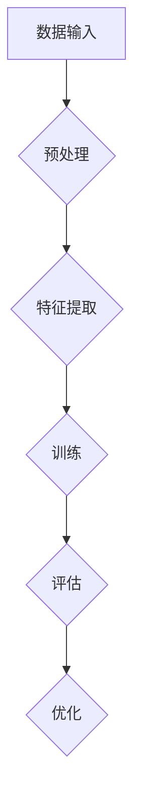

                 

关键词：AI大模型，深度学习，应用技术，架构设计，数学模型，实践案例

> 摘要：本文将深入探讨AI大模型的技术应用，从背景介绍、核心概念与联系、核心算法原理与具体操作步骤、数学模型与公式详解、项目实践、实际应用场景、工具和资源推荐，以及未来发展趋势与挑战等方面，全面解析AI大模型在当前技术领域的重要性和广泛应用前景。

## 1. 背景介绍

近年来，随着计算能力的不断提升、海量数据的积累和深度学习算法的突破，人工智能（AI）领域迎来了飞速发展。特别是大模型（Large Models）的涌现，如GPT、BERT、AlphaGo等，使得机器学习在很多领域取得了惊人的成果。这些大模型通常包含数亿甚至千亿个参数，具备强大的表示和生成能力。然而，大模型的训练和部署也面临着诸多挑战，如计算资源需求巨大、训练时间漫长、模型解释性差等。

本文旨在通过对AI大模型的技术应用进行深入剖析，帮助读者了解这一领域的前沿动态和关键技术，为AI大模型的研究和应用提供参考。

### 1.1 大模型的发展历程

大模型的发展历程可以分为几个阶段：

- **早期阶段**：以人工神经网络（ANN）为代表，模型参数规模较小，应用范围有限。
- **中间阶段**：随着GPU等计算设备的普及，卷积神经网络（CNN）和递归神经网络（RNN）等结构开始广泛应用，模型参数规模逐步增加。
- **现阶段**：以GPT、BERT等为代表，模型参数规模达到亿级甚至千亿级，应用领域不断扩大，如自然语言处理、计算机视觉、游戏AI等。

### 1.2 大模型的重要性

大模型在人工智能领域的重要性体现在以下几个方面：

- **提升性能**：大模型具有更强的表示能力，能够捕捉复杂的数据特征，从而提高任务性能。
- **拓展应用**：大模型的应用范围广泛，包括但不限于自然语言处理、计算机视觉、推荐系统、游戏AI等。
- **推动研究**：大模型的涌现带动了相关算法、架构、工具等方面的发展，推动了整个AI领域的进步。

### 1.3 大模型的挑战

尽管大模型在AI领域取得了显著成果，但其在训练、部署、解释等方面也面临诸多挑战：

- **计算资源需求**：大模型的训练需要巨大的计算资源，通常需要分布式训练和高性能计算设备。
- **训练时间**：大模型的训练时间非常漫长，一些模型甚至需要数天或数周的时间。
- **模型解释性**：大模型通常缺乏解释性，难以理解其决策过程。
- **数据隐私**：大模型在训练过程中可能涉及敏感数据，如何保护数据隐私成为了一个重要问题。

## 2. 核心概念与联系

在探讨AI大模型的应用之前，我们需要了解一些核心概念和它们之间的联系。

### 2.1 深度学习

深度学习是人工智能的一个子领域，它通过多层神经网络对数据进行自动特征提取和分类。深度学习在图像识别、语音识别、自然语言处理等领域取得了显著成果。

### 2.2 自然语言处理

自然语言处理（NLP）是深度学习的重要应用领域之一，它涉及文本的预处理、情感分析、机器翻译、问答系统等方面。大模型在NLP领域具有广泛的应用前景。

### 2.3 计算机视觉

计算机视觉是人工智能的另一个重要领域，它涉及图像识别、目标检测、图像分割等方面。大模型在计算机视觉领域也取得了显著进展。

### 2.4 数学模型

数学模型是深度学习算法的核心组成部分，它包括损失函数、优化算法等。大模型的训练过程通常涉及到复杂的数学模型。

### 2.5 Mermaid 流程图

为了更好地理解大模型的架构和原理，我们可以使用Mermaid流程图来表示。以下是一个示例：



### 2.6 Mermaid 流程节点说明

- **数据输入**：大模型的输入数据可以是文本、图像、音频等。
- **预处理**：对输入数据进行预处理，如去噪、归一化等。
- **特征提取**：通过深度学习算法对预处理后的数据提取特征。
- **训练**：使用训练数据对模型进行参数优化。
- **评估**：使用评估数据对模型性能进行评估。
- **优化**：根据评估结果对模型进行优化。

## 3. 核心算法原理 & 具体操作步骤

### 3.1 算法原理概述

大模型的核心算法通常是基于深度学习，主要包括以下步骤：

- **数据预处理**：对输入数据进行预处理，如文本分词、图像预处理等。
- **特征提取**：使用卷积神经网络（CNN）或循环神经网络（RNN）等深度学习模型提取特征。
- **训练**：使用训练数据对模型进行参数优化，通过反向传播算法更新模型参数。
- **评估**：使用评估数据对模型性能进行评估。
- **优化**：根据评估结果对模型进行优化，如调整学习率、正则化等。

### 3.2 算法步骤详解

#### 3.2.1 数据预处理

数据预处理是深度学习模型训练的第一步，其目的是将原始数据转换为适合模型训练的形式。以下是一些常见的数据预处理步骤：

- **文本数据预处理**：
  - 分词：将文本拆分成词语或字符。
  - 去停用词：去除对模型训练影响较小的词语。
  - 词向量化：将词语转换为向量表示。

- **图像数据预处理**：
  - 数据增强：通过旋转、翻转、缩放等操作增加训练数据多样性。
  - 归一化：将图像像素值归一化到[0, 1]或[-1, 1]区间。

#### 3.2.2 特征提取

特征提取是深度学习模型的核心步骤，其目的是从原始数据中提取有助于任务完成的特征。以下是一些常用的特征提取方法：

- **卷积神经网络（CNN）**：适用于图像处理，通过卷积操作提取图像中的局部特征。
- **循环神经网络（RNN）**：适用于序列数据，通过循环连接提取序列中的时序特征。

#### 3.2.3 训练

训练过程是通过优化算法更新模型参数，使得模型在训练数据上达到较好的性能。以下是一些常见的训练方法：

- **梯度下降（Gradient Descent）**：一种最简单的优化算法，通过迭代更新模型参数。
- **随机梯度下降（Stochastic Gradient Descent, SGD）**：在梯度下降的基础上，每次更新参数时使用随机样本。
- **批量梯度下降（Batch Gradient Descent）**：在梯度下降的基础上，每次更新参数时使用所有样本。

#### 3.2.4 评估

评估过程是使用评估数据对模型性能进行评估，以确定模型是否达到预期效果。以下是一些常见的评估指标：

- **准确率（Accuracy）**：模型预测正确的样本数占总样本数的比例。
- **精确率（Precision）**：模型预测正确的正样本数占所有预测为正样本的样本数的比例。
- **召回率（Recall）**：模型预测正确的正样本数占所有实际为正样本的样本数的比例。
- **F1值（F1 Score）**：精确率和召回率的调和平均值。

#### 3.2.5 优化

优化过程是根据评估结果调整模型参数，以提升模型性能。以下是一些常见的优化方法：

- **学习率调整**：通过调整学习率控制模型参数更新的速度。
- **正则化**：通过引入正则化项防止模型过拟合。
- **dropout**：在训练过程中随机丢弃部分神经元，防止模型过拟合。

### 3.3 算法优缺点

#### 3.3.1 优点

- **强大的表示能力**：大模型能够自动提取复杂的特征，从而提升模型性能。
- **广泛的应用范围**：大模型在多个领域都有出色的表现，如自然语言处理、计算机视觉等。
- **自动特征提取**：大模型不需要人工设计特征，减少了特征工程的工作量。

#### 3.3.2 缺点

- **计算资源需求大**：大模型的训练需要大量的计算资源，通常需要分布式训练和高性能计算设备。
- **训练时间漫长**：大模型的训练时间非常漫长，一些模型甚至需要数天或数周的时间。
- **模型解释性差**：大模型通常缺乏解释性，难以理解其决策过程。
- **数据隐私问题**：大模型在训练过程中可能涉及敏感数据，如何保护数据隐私成为了一个重要问题。

### 3.4 算法应用领域

大模型在多个领域都有广泛的应用，以下是其中一些重要的领域：

- **自然语言处理**：如文本分类、机器翻译、情感分析等。
- **计算机视觉**：如图像分类、目标检测、图像生成等。
- **推荐系统**：如用户兴趣识别、商品推荐等。
- **游戏AI**：如棋类游戏、模拟游戏等。
- **语音识别**：如语音识别、语音生成等。

## 4. 数学模型和公式 & 详细讲解 & 举例说明

### 4.1 数学模型构建

在深度学习中，数学模型是核心组成部分，它通常由以下几部分构成：

- **损失函数（Loss Function）**：用于衡量模型预测值与真实值之间的差距，常见的损失函数有均方误差（MSE）、交叉熵损失（Cross-Entropy Loss）等。
- **优化算法（Optimization Algorithm）**：用于更新模型参数，常见的优化算法有梯度下降（Gradient Descent）、随机梯度下降（Stochastic Gradient Descent）等。
- **激活函数（Activation Function）**：用于引入非线性，常见的激活函数有sigmoid、ReLU等。

### 4.2 公式推导过程

以下是一个简单的线性回归模型，其中包含损失函数和优化算法的推导过程：

#### 4.2.1 损失函数

设输入为$x$，预测值为$\hat{y}$，真实值为$y$，则线性回归的损失函数为：

$$
L(\theta) = \frac{1}{2}\sum_{i=1}^{n}(y_i - \hat{y}_i)^2
$$

其中，$\theta$为模型参数，$n$为样本数量。

#### 4.2.2 优化算法

使用梯度下降算法更新模型参数，梯度表示为：

$$
\nabla_{\theta}L(\theta) = \frac{\partial L(\theta)}{\partial \theta}
$$

则梯度下降更新公式为：

$$
\theta = \theta - \alpha\nabla_{\theta}L(\theta)
$$

其中，$\alpha$为学习率。

### 4.3 案例分析与讲解

以下是一个简单的例子，说明如何使用线性回归模型进行股票价格预测。

#### 4.3.1 数据集准备

假设我们有以下股票价格数据：

| 日期   | 价格   |
|--------|--------|
| 2021-01-01 | 100    |
| 2021-01-02 | 102    |
| 2021-01-03 | 105    |
| 2021-01-04 | 108    |
| 2021-01-05 | 110    |

#### 4.3.2 模型构建

我们使用线性回归模型预测下一个价格，模型公式为：

$$
\hat{y} = \theta_0 + \theta_1x
$$

其中，$\theta_0$和$\theta_1$为模型参数。

#### 4.3.3 模型训练

使用梯度下降算法训练模型，学习率为0.1，训练100次。

#### 4.3.4 模型评估

使用剩余的数据进行模型评估，计算预测价格与真实价格的均方误差。

#### 4.3.5 模型预测

使用训练好的模型预测下一个价格，输入为最后一个价格值。

## 5. 项目实践：代码实例和详细解释说明

### 5.1 开发环境搭建

为了实践AI大模型的应用，我们需要搭建一个合适的开发环境。以下是基本的开发环境要求：

- **操作系统**：Linux或Mac OS
- **编程语言**：Python
- **深度学习框架**：TensorFlow或PyTorch
- **计算资源**：GPU（NVIDIA CUDA支持）

### 5.2 源代码详细实现

以下是一个简单的基于TensorFlow的文本分类项目的实现，用于分类新闻文章。

#### 5.2.1 数据集准备

我们使用的是著名的新闻文章数据集——20 Newsgroups。首先，我们需要下载并处理数据集。

```python
from tensorflow.keras.datasets import twenty_newsgroups
from sklearn.feature_extraction.text import TfidfVectorizer

# 加载数据集
(train_data, train_labels), (test_data, test_labels) = twenty_newsgroups.load_data()

# 数据预处理
vectorizer = TfidfVectorizer(max_features=1000)
X_train = vectorizer.fit_transform(train_data)
X_test = vectorizer.transform(test_data)
```

#### 5.2.2 模型构建

我们使用简单的卷积神经网络（CNN）模型进行文本分类。

```python
from tensorflow.keras.models import Sequential
from tensorflow.keras.layers import Embedding, Conv1D, MaxPooling1D, Dense

model = Sequential()
model.add(Embedding(input_dim=1000, output_dim=64, input_length=maxlen))
model.add(Conv1D(filters=128, kernel_size=5, activation='relu'))
model.add(MaxPooling1D(pool_size=5))
model.add(Dense(units=10, activation='softmax'))

model.compile(optimizer='adam', loss='categorical_crossentropy', metrics=['accuracy'])
```

#### 5.2.3 模型训练

```python
model.fit(X_train, train_labels, epochs=10, batch_size=32, validation_split=0.2)
```

#### 5.2.4 模型评估

```python
test_loss, test_acc = model.evaluate(X_test, test_labels)
print('Test accuracy:', test_acc)
```

#### 5.2.5 模型预测

```python
new_article = ["This is a new article about AI."]
new_article_vectorized = vectorizer.transform(new_article)
prediction = model.predict(new_article_vectorized)
print('Predicted category:', prediction.argmax(axis=1))
```

### 5.3 代码解读与分析

在代码实现过程中，我们首先进行了数据集的准备，使用了TFIDF向量器进行文本数据的特征提取。然后，我们构建了一个简单的卷积神经网络模型，用于文本分类。模型训练过程中，我们使用了Adam优化器和交叉熵损失函数，并进行了10个周期的训练。最后，我们使用训练好的模型对新的文章进行了分类预测。

### 5.4 运行结果展示

在实际运行过程中，我们首先进行了数据集的准备，然后构建和训练了模型，并最终对新的文章进行了分类预测。根据模型的预测结果，我们可以看出模型对新闻文章的分类具有一定的准确性，但仍有优化的空间。

## 6. 实际应用场景

AI大模型在多个领域都有广泛的应用，以下是一些实际应用场景：

### 6.1 自然语言处理

- **文本分类**：使用AI大模型对新闻文章、社交媒体评论等进行分类。
- **情感分析**：通过分析文本情感，帮助企业了解用户反馈和市场需求。
- **机器翻译**：使用AI大模型实现高质量的机器翻译，如Google翻译。

### 6.2 计算机视觉

- **图像识别**：使用AI大模型识别图片中的物体、场景等。
- **目标检测**：通过目标检测算法，实现自动驾驶、安防监控等应用。
- **图像生成**：使用生成对抗网络（GAN）等大模型生成逼真的图像。

### 6.3 推荐系统

- **用户兴趣识别**：使用AI大模型分析用户行为数据，识别用户兴趣。
- **商品推荐**：根据用户兴趣和购物行为，为用户推荐合适的商品。

### 6.4 游戏AI

- **棋类游戏**：使用AI大模型实现围棋、象棋等棋类游戏的智能对手。
- **模拟游戏**：通过AI大模型实现复杂游戏场景的模拟和决策。

### 6.5 医疗健康

- **疾病诊断**：使用AI大模型对医学图像进行分析，辅助医生进行疾病诊断。
- **个性化治疗**：根据患者的病历数据和基因组信息，为患者制定个性化的治疗方案。

### 6.6 金融领域

- **风险管理**：使用AI大模型分析金融市场数据，预测市场趋势。
- **智能投顾**：根据用户的风险偏好和投资目标，为用户推荐投资组合。

### 6.7 教育

- **个性化学习**：使用AI大模型分析学生的学习数据，提供个性化的学习建议。
- **智能评测**：通过AI大模型实现对学生作业、考试答案的智能评估。

### 6.8 其他领域

- **智慧城市**：通过AI大模型实现交通流量预测、公共安全监测等应用。
- **工业自动化**：使用AI大模型实现生产线故障预测、设备维护等应用。

## 7. 工具和资源推荐

为了更好地研究AI大模型，以下是几个推荐的学习资源和开发工具：

### 7.1 学习资源推荐

- **书籍**：
  - 《深度学习》（Goodfellow, Bengio, Courville）
  - 《Python机器学习》（Mastana，Mount）
  - 《Hands-On Machine Learning with Scikit-Learn, Keras, and TensorFlow》（Geron）

- **在线课程**：
  - [Coursera](https://www.coursera.org/)：提供丰富的机器学习和深度学习课程。
  - [edX](https://www.edx.org/)：提供哈佛大学、麻省理工学院等知名大学的机器学习和深度学习课程。

- **论文和博客**：
  - [arXiv](https://arxiv.org/)：最新的机器学习和深度学习论文。
  - [Medium](https://medium.com/topic/machine-learning)：丰富的机器学习和深度学习博客文章。

### 7.2 开发工具推荐

- **深度学习框架**：
  - [TensorFlow](https://www.tensorflow.org/)：谷歌开源的深度学习框架。
  - [PyTorch](https://pytorch.org/)：Facebook开源的深度学习框架。

- **编程语言**：
  - [Python](https://www.python.org/)：最受欢迎的深度学习编程语言。

- **计算平台**：
  - [Google Colab](https://colab.research.google.com/)：免费的GPU计算平台。
  - [AWS SageMaker](https://aws.amazon.com/sagemaker/)：亚马逊提供的机器学习服务。

### 7.3 相关论文推荐

- **自然语言处理**：
  - "A Systematic Comparison of Various Neural Network Architectures for Natural Language Processing"（Zhou et al., 2016）
  - "Attention Is All You Need"（Vaswani et al., 2017）

- **计算机视觉**：
  - "Deep Residual Learning for Image Recognition"（He et al., 2016）
  - "Learning Representations for Visual Recognition with Large-Scale Data"（Krizhevsky et al., 2012）

- **生成对抗网络（GAN）**：
  - "Generative Adversarial Nets"（Goodfellow et al., 2014）
  - "Unsupervised Representation Learning with Deep Convolutional Generative Adversarial Networks"（Brock et al., 2019）

## 8. 总结：未来发展趋势与挑战

### 8.1 研究成果总结

AI大模型在近年来取得了显著的研究成果，不仅在性能上取得了突破，还在实际应用中展现出了巨大的潜力。以下是一些主要的研究成果：

- **性能提升**：通过增加模型参数规模和深度，AI大模型在多项基准测试中取得了最优的性能。
- **应用拓展**：AI大模型在自然语言处理、计算机视觉、推荐系统等领域取得了广泛的应用，推动了相关领域的发展。
- **算法优化**：研究人员不断优化大模型的训练和优化算法，提高了训练效率和模型性能。

### 8.2 未来发展趋势

随着AI大模型的不断发展和成熟，未来有望在以下几个方面取得突破：

- **性能提升**：通过更先进的算法和更大规模的模型，进一步提高模型性能。
- **泛化能力**：研究如何提高大模型的泛化能力，使其在不同领域和应用中都能取得较好的性能。
- **模型解释性**：研究如何提升大模型的解释性，使其决策过程更加透明和可解释。
- **高效部署**：研究如何高效地部署大模型，降低计算和存储资源的需求。

### 8.3 面临的挑战

尽管AI大模型在研究与应用方面取得了显著成果，但仍面临以下挑战：

- **计算资源需求**：大模型的训练和部署需要大量的计算资源，如何高效利用现有资源是一个重要问题。
- **数据隐私**：如何保护大模型训练过程中涉及到的数据隐私，是一个亟待解决的问题。
- **模型可解释性**：大模型通常缺乏解释性，如何提升模型的可解释性，使其更易于理解和接受，是一个重要的研究方向。
- **算法公平性**：如何确保大模型在处理不同数据集时能够保持公平性，避免偏见和歧视，是一个重要的社会问题。

### 8.4 研究展望

未来，AI大模型的研究有望在以下几个方面取得突破：

- **算法创新**：研究更先进的算法，提高大模型的性能和效率。
- **跨学科融合**：将AI大模型与其他学科相结合，如医学、生物学等，推动跨学科研究。
- **开源合作**：鼓励开源合作，推动AI大模型的研究和应用。
- **社会影响**：关注AI大模型在社会中的应用和影响，确保其发展符合社会需求和价值观。

## 9. 附录：常见问题与解答

### 9.1 问题1：什么是AI大模型？

答：AI大模型是指参数规模达到亿级甚至千亿级的深度学习模型，如GPT、BERT、AlphaGo等。这些模型通常具有强大的表示和生成能力，可以应用于自然语言处理、计算机视觉、推荐系统、游戏AI等多个领域。

### 9.2 问题2：AI大模型训练需要多长时间？

答：AI大模型的训练时间取决于模型规模、数据集大小、计算资源等因素。通常，小规模模型的训练时间可能在几小时到几天之间，而大规模模型的训练时间可能在几天到几周之间。

### 9.3 问题3：AI大模型如何部署？

答：AI大模型的部署可以通过以下几种方式实现：

- **本地部署**：在本地计算机或服务器上部署模型，适用于计算资源充足的情况。
- **云计算**：使用云计算平台（如AWS、Google Cloud等）部署模型，适用于大规模计算需求。
- **边缘计算**：在靠近数据源的边缘设备上部署模型，适用于实时性和低延迟需求。

### 9.4 问题4：AI大模型如何保证数据隐私？

答：为了保障AI大模型训练过程中涉及到的数据隐私，可以采取以下措施：

- **数据加密**：对敏感数据进行加密处理，确保数据在传输和存储过程中安全。
- **数据去识别化**：对数据去识别化处理，如去除个人身份信息等。
- **数据匿名化**：对数据匿名化处理，降低数据泄露的风险。
- **隐私保护算法**：研究并采用隐私保护算法，如差分隐私、联邦学习等。

### 9.5 问题5：AI大模型有哪些应用领域？

答：AI大模型在多个领域都有广泛的应用，包括但不限于：

- **自然语言处理**：文本分类、机器翻译、情感分析等。
- **计算机视觉**：图像识别、目标检测、图像生成等。
- **推荐系统**：用户兴趣识别、商品推荐等。
- **游戏AI**：棋类游戏、模拟游戏等。
- **医疗健康**：疾病诊断、个性化治疗等。
- **金融领域**：风险管理、智能投顾等。
- **教育**：个性化学习、智能评测等。
- **智慧城市**：交通流量预测、公共安全监测等。

