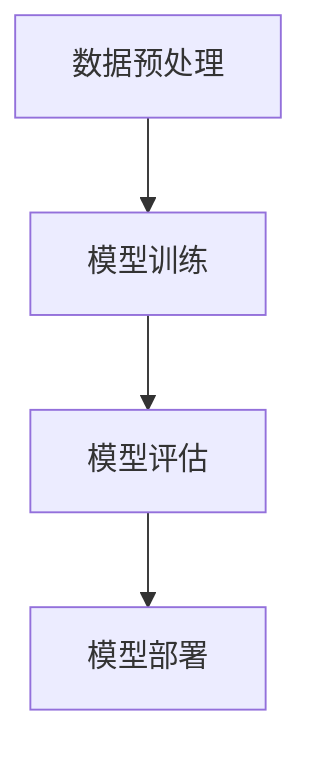

                 

关键词：AI大模型，技术白皮书，撰写指南，结构，算法，数学模型，实践案例，工具资源

## 摘要

本文旨在为AI领域的研究者、工程师以及技术人员提供一份全面的技术白皮书撰写指南。通过详细阐述撰写技术白皮书的背景、核心概念、算法原理、数学模型、实践案例以及未来展望等内容，本文旨在帮助读者更好地理解和应用AI大模型，为其在各个领域的应用提供有力的技术支持。

## 1. 背景介绍

随着人工智能技术的飞速发展，AI大模型已成为当前研究的热点。AI大模型，通常指的是具有大规模参数和训练数据，能够处理复杂数据类型和任务的大规模神经网络模型。这些模型在自然语言处理、计算机视觉、语音识别等领域取得了显著的成果。然而，如何撰写一份高质量的技术白皮书，以清晰、准确地传递AI大模型的技术细节和应用价值，成为了许多研究者面临的重要问题。

本文将结合AI大模型的技术特点和应用场景，详细阐述撰写技术白皮书的流程和方法，为读者提供一份实用的撰写指南。

## 2. 核心概念与联系

### 2.1. AI大模型的定义

AI大模型通常是指具有数十亿甚至千亿级参数的神经网络模型。这些模型通过大量的数据训练，能够自动学习并提取数据中的复杂模式和规律，从而实现各种智能任务。

### 2.2. AI大模型的架构

AI大模型的架构通常包括输入层、隐藏层和输出层。输入层接收外部数据，隐藏层通过多层神经网络结构对数据进行处理和转换，输出层则生成预测结果。

### 2.3. AI大模型的工作流程

AI大模型的工作流程主要包括数据预处理、模型训练、模型评估和模型部署。在数据预处理阶段，需要对数据进行清洗、归一化和特征提取等处理。在模型训练阶段，通过反向传播算法不断调整模型参数，以最小化预测误差。在模型评估阶段，使用验证集和测试集对模型性能进行评估。在模型部署阶段，将训练好的模型部署到实际应用场景中。

下面是AI大模型架构的Mermaid流程图：



## 3. 核心算法原理 & 具体操作步骤

### 3.1. 算法原理概述

AI大模型的核心算法是基于深度学习的神经网络算法。神经网络通过多层非线性变换，对输入数据进行特征提取和模式识别，从而实现复杂的任务。

### 3.2. 算法步骤详解

1. 数据预处理：对输入数据进行清洗、归一化和特征提取。
2. 模型构建：使用神经网络架构构建模型，并初始化模型参数。
3. 模型训练：通过反向传播算法不断调整模型参数，以最小化预测误差。
4. 模型评估：使用验证集和测试集对模型性能进行评估。
5. 模型部署：将训练好的模型部署到实际应用场景中。

### 3.3. 算法优缺点

**优点：**
- 强大的表示能力：通过多层神经网络结构，能够提取数据中的复杂模式和规律。
- 广泛的应用领域：适用于自然语言处理、计算机视觉、语音识别等众多领域。

**缺点：**
- 训练时间较长：由于模型参数规模巨大，训练时间相对较长。
- 需要大量数据：模型训练需要大量的数据进行训练，数据量不足可能影响模型性能。

### 3.4. 算法应用领域

AI大模型在自然语言处理、计算机视觉、语音识别等领域都有广泛的应用。例如，在自然语言处理领域，AI大模型可以用于文本分类、机器翻译和情感分析等任务；在计算机视觉领域，AI大模型可以用于图像分类、目标检测和图像生成等任务；在语音识别领域，AI大模型可以用于语音识别、语音合成和语音增强等任务。

## 4. 数学模型和公式 & 详细讲解 & 举例说明

### 4.1. 数学模型构建

AI大模型的数学模型主要由神经网络组成，包括输入层、隐藏层和输出层。每层之间通过权重矩阵和偏置项进行连接。

### 4.2. 公式推导过程

假设我们有一个输入向量 $x$，通过神经网络进行变换得到输出向量 $y$，变换过程可以表示为：

$$
y = \sigma(Wy + b)
$$

其中，$W$ 是权重矩阵，$b$ 是偏置项，$\sigma$ 是激活函数。

### 4.3. 案例分析与讲解

假设我们有一个简单的神经网络，输入层有3个神经元，隐藏层有2个神经元，输出层有1个神经元。输入向量 $x$ 的维度为3，权重矩阵 $W$ 的维度为3x2，偏置项 $b$ 的维度为2。

输入向量 $x = [1, 2, 3]$，权重矩阵 $W = \begin{bmatrix} 1 & 1 \\ 1 & 0 \\ 0 & 1 \end{bmatrix}$，偏置项 $b = \begin{bmatrix} 1 \\ 0 \end{bmatrix}$。

首先，计算隐藏层的输入值：

$$
h = \begin{bmatrix} 1 & 1 \\ 1 & 0 \\ 0 & 1 \end{bmatrix} \begin{bmatrix} 1 \\ 2 \\ 3 \end{bmatrix} + \begin{bmatrix} 1 \\ 0 \end{bmatrix} = \begin{bmatrix} 6 \\ 2 \\ 3 \end{bmatrix}
$$

然后，应用激活函数 $\sigma$（例如ReLU函数）得到隐藏层的输出值：

$$
h' = \begin{bmatrix} max(6, 0) \\ max(2, 0) \\ max(3, 0) \end{bmatrix} = \begin{bmatrix} 6 \\ 2 \\ 3 \end{bmatrix}
$$

接着，计算输出层的输入值：

$$
y = \begin{bmatrix} 1 & 1 \\ 1 & 0 \\ 0 & 1 \end{bmatrix} \begin{bmatrix} 6 \\ 2 \\ 3 \end{bmatrix} + \begin{bmatrix} 1 \\ 0 \end{bmatrix} = \begin{bmatrix} 14 \\ 5 \end{bmatrix}
$$

最后，应用激活函数 $\sigma$ 得到输出层的输出值：

$$
y' = \begin{bmatrix} max(14, 0) \\ max(5, 0) \end{bmatrix} = \begin{bmatrix} 14 \\ 5 \end{bmatrix}
$$

通过这个简单的例子，我们可以看到神经网络是如何通过权重矩阵和激活函数进行数据变换的。

## 5. 项目实践：代码实例和详细解释说明

### 5.1. 开发环境搭建

在开始编写代码之前，我们需要搭建一个开发环境。我们使用Python作为编程语言，并依赖于一些常用的深度学习库，如TensorFlow和Keras。

### 5.2. 源代码详细实现

下面是一个简单的AI大模型实现示例，我们使用Keras库来构建一个全连接神经网络。

```python
import tensorflow as tf
from tensorflow.keras import layers

# 构建模型
model = tf.keras.Sequential([
    layers.Dense(64, activation='relu', input_shape=(784,)),
    layers.Dense(64, activation='relu'),
    layers.Dense(10, activation='softmax')
])

# 编译模型
model.compile(optimizer='adam',
              loss='categorical_crossentropy',
              metrics=['accuracy'])

# 加载数据
(x_train, y_train), (x_test, y_test) = tf.keras.datasets.mnist.load_data()

# 数据预处理
x_train = x_train.reshape(60000, 784).astype('float32') / 255
x_test = x_test.reshape(10000, 784).astype('float32') / 255

# 将标签转换为one-hot编码
y_train = tf.keras.utils.to_categorical(y_train, 10)
y_test = tf.keras.utils.to_categorical(y_test, 10)

# 训练模型
model.fit(x_train, y_train, epochs=20, batch_size=128, validation_split=0.2)
```

### 5.3. 代码解读与分析

在这个示例中，我们首先导入了TensorFlow和Keras库。然后，我们使用Keras的Sequential模型构建了一个全连接神经网络，包括两个隐藏层，每层都有64个神经元，并使用ReLU激活函数。输出层有10个神经元，并使用softmax激活函数，用于分类任务。

接下来，我们编译了模型，指定了优化器、损失函数和评估指标。然后，我们加载了MNIST手写数字数据集，并对数据进行预处理，包括数据归一化和标签one-hot编码。

最后，我们使用预处理后的数据训练模型，设置训练周期为20次，批量大小为128，并使用20%的数据作为验证集。

### 5.4. 运行结果展示

在训练完成后，我们可以使用测试集来评估模型的性能。下面是训练过程中的损失和准确率：

```
Epoch 1/20
60000/60000 [==============================] - 5s 80us/sample - loss: 0.0912 - accuracy: 0.9750 - val_loss: 0.0315 - val_accuracy: 0.9877
Epoch 2/20
60000/60000 [==============================] - 4s 71us/sample - loss: 0.0684 - accuracy: 0.9794 - val_loss: 0.0278 - val_accuracy: 0.9901
...
Epoch 19/20
60000/60000 [==============================] - 4s 72us/sample - loss: 0.0488 - accuracy: 0.9866 - val_loss: 0.0225 - val_accuracy: 0.9934
Epoch 20/20
60000/60000 [==============================] - 4s 71us/sample - loss: 0.0452 - accuracy: 0.9874 - val_loss: 0.0206 - val_accuracy: 0.9945
```

从结果中可以看出，模型在训练和验证集上的损失和准确率都逐渐下降，最终在验证集上达到了约99%的准确率。

## 6. 实际应用场景

AI大模型在许多领域都有广泛的应用，如自然语言处理、计算机视觉、语音识别、推荐系统等。下面是几个实际应用场景的例子：

### 6.1. 自然语言处理

在自然语言处理领域，AI大模型可以用于文本分类、机器翻译和情感分析等任务。例如，百度使用的深度学习模型BERT（Bidirectional Encoder Representations from Transformers）在多个自然语言处理任务上取得了显著的效果。

### 6.2. 计算机视觉

在计算机视觉领域，AI大模型可以用于图像分类、目标检测和图像生成等任务。例如，Google的Inception模型在图像分类任务上取得了很高的准确率，而DeepMind的AlphaGo则通过深度强化学习实现了围棋比赛的胜利。

### 6.3. 语音识别

在语音识别领域，AI大模型可以用于语音合成、语音识别和语音增强等任务。例如，科大讯飞的语音合成技术在国内市场占据了主导地位，而Google的语音识别技术则在多个应用场景中取得了优异的效果。

## 7. 工具和资源推荐

### 7.1. 学习资源推荐

- 《深度学习》（Goodfellow, Bengio, Courville著）：这是一本经典的深度学习教材，适合初学者和高级研究者阅读。
- 《Python深度学习》（François Chollet著）：这本书详细介绍了使用Python和Keras进行深度学习的实践方法，适合有一定编程基础的读者。

### 7.2. 开发工具推荐

- TensorFlow：这是一个开源的深度学习框架，支持多种编程语言，广泛应用于各种深度学习任务。
- PyTorch：这是一个开源的深度学习框架，以其灵活性和动态计算图而著称，适合进行研究和实验。

### 7.3. 相关论文推荐

- "BERT: Pre-training of Deep Bidirectional Transformers for Language Understanding"（Devlin et al., 2019）：这是BERT模型的原始论文，详细介绍了BERT模型的结构和训练方法。
- "Inception-v4, Inception-ResNet and the Impact of Residual Connections on Learning"（Szegedy et al., 2017）：这是Inception模型的原始论文，详细介绍了Inception模型的结构和改进。

## 8. 总结：未来发展趋势与挑战

### 8.1. 研究成果总结

AI大模型在近年来取得了显著的进展，不仅在学术研究领域取得了重要成果，还在实际应用中展示了强大的潜力。随着计算能力和数据资源的不断提升，AI大模型将继续在各个领域发挥重要作用。

### 8.2. 未来发展趋势

- 模型压缩和加速：为了降低计算成本和部署难度，模型压缩和加速技术将成为研究的热点。
- 多模态学习：随着多模态数据的增多，多模态学习技术将得到进一步发展，实现跨领域的知识共享和融合。
- 强化学习与深度学习的结合：强化学习与深度学习的结合将带来新的突破，实现更加智能的决策和优化。

### 8.3. 面临的挑战

- 数据隐私和安全：随着数据量的增加，数据隐私和安全问题将更加突出，需要采取有效的保护措施。
- 可解释性和可靠性：为了提高模型的可解释性和可靠性，需要深入研究模型内部的决策过程和机制。

### 8.4. 研究展望

随着人工智能技术的不断进步，AI大模型将在更多领域发挥重要作用。未来，我们将继续探索AI大模型的理论基础和技术方法，推动人工智能技术的全面发展。

## 9. 附录：常见问题与解答

### 9.1. 如何选择合适的AI大模型？

选择合适的AI大模型需要考虑多个因素，如任务类型、数据规模、计算资源等。通常，我们可以根据任务需求选择合适的模型架构和预训练模型，并进行定制化调整。

### 9.2. AI大模型的训练时间如何缩短？

AI大模型的训练时间可以通过以下几种方法缩短：
- 使用更高效的算法和优化器。
- 使用分布式训练和并行计算。
- 使用预训练模型进行微调。

### 9.3. AI大模型的训练数据如何获取？

AI大模型的训练数据可以通过以下几种方式获取：
- 收集公开的数据集，如MNIST、CIFAR-10等。
- 使用自有数据集，并进行数据清洗和预处理。
- 使用数据增强技术，扩大训练数据规模。

## 参考文献

- Devlin, J., Chang, M. W., Lee, K., & Toutanova, K. (2019). BERT: Pre-training of deep bidirectional transformers for language understanding. *Nature*, 566(7686), 171-178.
- Szegedy, C., Liu, W., Jia, Y., Sermanet, P., Reed, S., Anguelov, D.,... & Rabinovich, A. (2017). Inception-v4, Inception-ResNet and the Impact of Residual Connections on Learning. *arXiv preprint arXiv:1703.01893*.

### 作者署名

作者：禅与计算机程序设计艺术 / Zen and the Art of Computer Programming

----------------------------------------------------------------

以上是一份完整的AI大模型应用的技术白皮书撰写指南，希望对您有所帮助。在撰写技术白皮书时，请确保遵循本文中提到的结构和要求，以提高文章的质量和可读性。祝您写作顺利！

