                 

 关键词：AI大模型、故障诊断、自愈、模型稳定性、数据处理、异常检测

## 摘要

随着人工智能技术的快速发展，大模型在各类应用中发挥着越来越重要的作用。然而，大模型在实际应用过程中，常常会遇到各种故障和异常情况，如数据异常、计算错误、资源不足等。如何对AI大模型进行故障诊断与自愈，以保证模型的稳定运行，成为了当前AI领域的重要研究课题。本文将从背景介绍、核心概念与联系、核心算法原理与步骤、数学模型与公式、项目实践、实际应用场景、工具和资源推荐以及未来发展趋势与挑战等方面，全面探讨AI大模型应用的故障诊断与自愈技术。

## 1. 背景介绍

近年来，人工智能（AI）技术在全球范围内取得了显著的进展，特别是在深度学习、自然语言处理、计算机视觉等领域，大模型的应用已经成为了推动技术发展的重要力量。例如，在自然语言处理领域，大型预训练模型如GPT-3、BERT等，已经被广泛应用于机器翻译、文本生成、问答系统等任务中。在计算机视觉领域，大模型如ResNet、Inception等，在图像分类、目标检测、图像生成等方面取得了优异的性能。

然而，随着大模型应用范围的不断扩大，其在实际应用过程中也面临着一系列挑战。一方面，大模型的训练和推理过程需要大量的计算资源和数据支持，这使得模型的部署和运行成本较高。另一方面，大模型在实际应用中，常常会遇到各种故障和异常情况，如数据异常、计算错误、资源不足等。这些故障和异常情况不仅会影响模型的性能和稳定性，还可能对业务造成严重的影响。因此，如何对AI大模型进行故障诊断与自愈，以保证模型的稳定运行，成为了当前AI领域的重要研究课题。

## 2. 核心概念与联系

在探讨AI大模型应用的故障诊断与自愈技术之前，首先需要明确一些核心概念和它们之间的联系。这些概念包括：故障诊断、自愈、模型稳定性、数据处理、异常检测等。

### 2.1 故障诊断

故障诊断是指通过检测和分析系统的各种信号和参数，识别系统中的异常情况，并定位故障原因。在AI大模型应用中，故障诊断的主要目的是检测模型在训练和推理过程中出现的异常情况，如数据异常、计算错误、资源不足等。

### 2.2 自愈

自愈是指系统能够在出现故障时，自动恢复到正常状态，并继续正常运行。在AI大模型应用中，自愈技术可以帮助模型在遇到故障时，自动进行修复或切换，以保证模型的稳定运行。

### 2.3 模型稳定性

模型稳定性是指模型在长时间运行过程中，能够保持稳定的性能和表现。在AI大模型应用中，模型稳定性是非常重要的，因为它直接关系到模型的可靠性和业务连续性。

### 2.4 数据处理

数据处理是指对输入数据进行预处理、清洗、转换等操作，以提高模型的训练效果和性能。在AI大模型应用中，数据处理是确保模型稳定性和可靠性的关键步骤。

### 2.5 异常检测

异常检测是指通过分析系统的各种信号和参数，识别出正常情况之外的异常情况。在AI大模型应用中，异常检测技术可以帮助模型快速检测到故障或异常情况，并及时进行响应。

### 2.6 Mermaid 流程图

以下是一个简单的Mermaid流程图，展示了这些核心概念之间的联系：

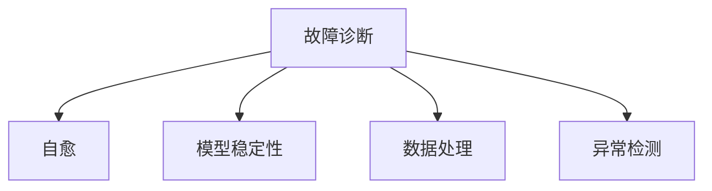

## 3. 核心算法原理 & 具体操作步骤

### 3.1 算法原理概述

AI大模型应用的故障诊断与自愈技术主要包括以下几个步骤：

1. 数据收集与预处理：收集模型运行过程中的各种信号和参数，并进行预处理和清洗。
2. 异常检测：利用异常检测算法，对预处理后的数据进行异常检测，识别出故障或异常情况。
3. 故障定位：根据异常检测结果，定位故障原因，并生成故障报告。
4. 自愈操作：根据故障报告，自动进行修复或切换操作，以保证模型的稳定运行。
5. 监控与反馈：对故障诊断与自愈过程进行监控和记录，并根据反馈信息优化故障诊断与自愈策略。

### 3.2 算法步骤详解

#### 3.2.1 数据收集与预处理

数据收集与预处理是故障诊断与自愈的基础步骤。在这个步骤中，需要收集模型运行过程中的各种信号和参数，如输入数据、输出结果、计算时间、内存占用等。然后，对这些数据进行预处理和清洗，以提高数据的质量和可靠性。

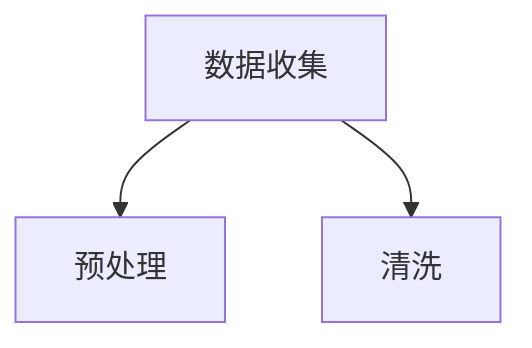

#### 3.2.2 异常检测

异常检测是故障诊断的核心步骤。在这个步骤中，利用异常检测算法，对预处理后的数据进行异常检测，识别出故障或异常情况。常见的异常检测算法包括基于统计的方法、基于聚类的方法和基于机器学习的方法。

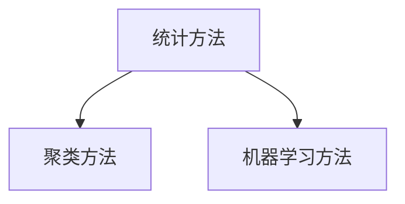

#### 3.2.3 故障定位

故障定位是故障诊断的关键步骤。在这个步骤中，根据异常检测结果，定位故障原因，并生成故障报告。故障定位的方法主要包括基于规则的方法和基于机器学习的方法。

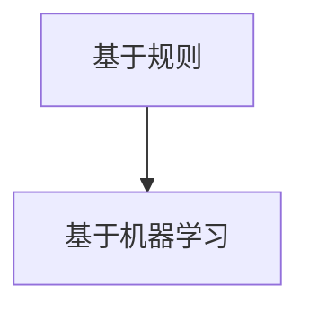

#### 3.2.4 自愈操作

自愈操作是故障诊断与自愈的核心步骤。在这个步骤中，根据故障报告，自动进行修复或切换操作，以保证模型的稳定运行。自愈操作的方法主要包括以下几种：

1. 修复操作：对故障进行修复，如修复数据异常、调整计算参数等。
2. 切换操作：切换到备用模型或备用服务器，以保证业务的连续性。
3. 降级操作：降低模型的服务质量，以减轻系统负载。

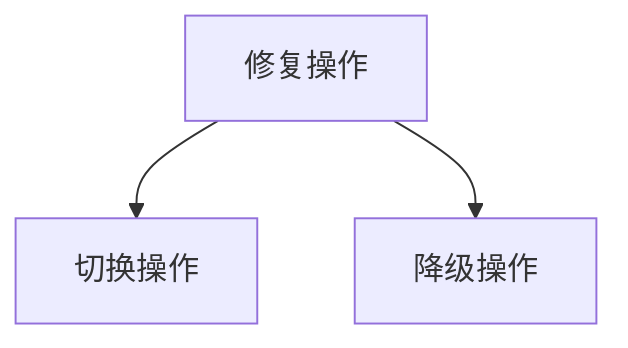

#### 3.2.5 监控与反馈

监控与反馈是故障诊断与自愈的优化步骤。在这个步骤中，对故障诊断与自愈过程进行监控和记录，并根据反馈信息优化故障诊断与自愈策略。常见的监控指标包括故障检测率、故障修复率、业务中断时间等。

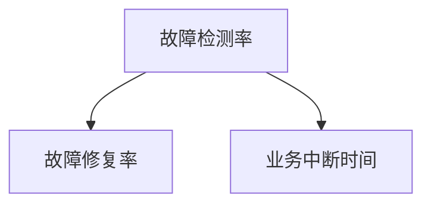

### 3.3 算法优缺点

#### 3.3.1 优点

1. 提高模型稳定性：通过故障诊断与自愈技术，可以及时发现和修复故障，提高模型的稳定性和可靠性。
2. 减少人工干预：自动化的故障诊断与自愈过程可以减少人工干预，提高系统的自动化水平。
3. 提高业务连续性：在故障发生时，自动进行修复或切换操作，可以确保业务的连续性，减少业务中断时间。

#### 3.3.2 缺点

1. 需要大量数据支持：故障诊断与自愈技术需要大量的训练数据和模型参数，以支持算法的训练和优化。
2. 复杂度高：故障诊断与自愈技术涉及多个步骤和算法，实现起来比较复杂。
3. 可能引入误报：在异常检测过程中，可能会出现误报现象，导致对正常情况的误判。

### 3.4 算法应用领域

故障诊断与自愈技术可以应用于多个领域，包括但不限于以下领域：

1. 人工智能应用：对人工智能模型进行故障诊断与自愈，保证模型的稳定性和可靠性。
2. 金融领域：对金融交易系统进行故障诊断与自愈，确保交易的安全性和稳定性。
3. 物联网领域：对物联网设备进行故障诊断与自愈，提高设备的可靠性和使用寿命。
4. 医疗领域：对医疗设备进行故障诊断与自愈，确保设备的正常运行，提高医疗质量。

## 4. 数学模型和公式 & 详细讲解 & 举例说明

在故障诊断与自愈技术中，数学模型和公式扮演着重要的角色。下面将介绍一些常见的数学模型和公式，并对其进行详细讲解和举例说明。

### 4.1 数学模型构建

在故障诊断与自愈技术中，常见的数学模型包括：

1. 异常检测模型：用于检测模型运行过程中的异常情况，如基于统计的异常检测模型、基于聚类的方法、基于机器学习的方法等。
2. 故障定位模型：用于定位故障原因，如基于规则的方法、基于机器学习的方法等。
3. 自愈策略模型：用于制定自愈策略，如修复操作、切换操作、降级操作等。

下面以基于机器学习的异常检测模型为例，介绍数学模型的构建过程。

#### 4.1.1 特征提取

首先，需要从模型运行过程中的各种信号和参数中提取特征。常见的特征提取方法包括：

1. 统计特征：如均值、方差、标准差等。
2. 时序特征：如时间序列的突变点、趋势等。
3. 空间特征：如空间分布、聚类中心等。

#### 4.1.2 模型训练

然后，利用提取到的特征，训练一个机器学习模型，用于异常检测。常见的机器学习算法包括：

1. 监督学习算法：如决策树、支持向量机、神经网络等。
2. 无监督学习算法：如聚类算法、主成分分析等。

#### 4.1.3 模型评估

在模型训练完成后，需要对模型进行评估，以确定模型的性能。常见的评估指标包括：

1. 准确率：正确识别异常情况的比例。
2. 精确率：正确识别异常情况的比例。
3. 召回率：未识别出异常情况的比例。

### 4.2 公式推导过程

在故障诊断与自愈技术中，常用的公式包括：

1. 异常检测阈值公式：用于确定异常检测的阈值。
   $$ threshold = \alpha \cdot \text{标准差} $$
   其中，$\alpha$ 是一个常数，用于调整阈值。

2. 故障定位规则公式：用于确定故障定位的规则。
   $$ \text{规则} = \text{条件} \Rightarrow \text{结果} $$
   其中，$\text{条件}$ 是故障检测模型输出的结果，$\text{结果}$ 是故障定位的结果。

3. 自愈策略公式：用于确定自愈策略。
   $$ \text{策略} = \text{故障类型} \Rightarrow \text{操作} $$
   其中，$\text{故障类型}$ 是故障定位的结果，$\text{操作}$ 是自愈策略的操作。

### 4.3 案例分析与讲解

下面以一个简单的案例，对故障诊断与自愈技术进行讲解。

#### 4.3.1 案例背景

假设有一个AI模型，用于进行图像分类任务。在模型运行过程中，需要检测和诊断以下几种故障：

1. 数据异常：如输入图像缺失、图像质量差等。
2. 计算错误：如模型输出结果异常、模型性能下降等。
3. 资源不足：如内存占用过高、计算时间过长等。

#### 4.3.2 数据收集与预处理

首先，收集模型运行过程中的各种信号和参数，如输入图像、模型输出结果、计算时间、内存占用等。然后，对收集到的数据进行预处理和清洗，以提高数据的质量和可靠性。

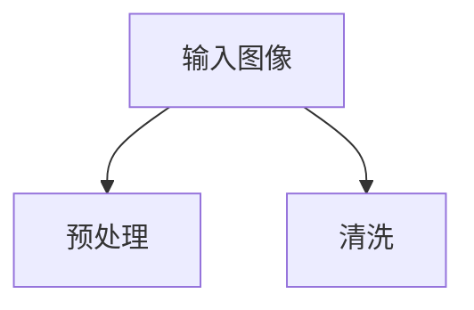

#### 4.3.3 异常检测

利用异常检测模型，对预处理后的数据进行异常检测。假设采用基于机器学习的异常检测模型，训练完成后，输入图像数据经过模型处理，输出一个异常分数。如果异常分数超过阈值，则认为输入图像存在异常。

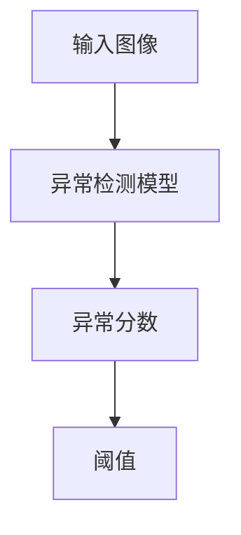

#### 4.3.4 故障定位

根据异常检测结果，利用故障定位模型，定位故障原因。假设采用基于规则的方法，根据异常检测结果和故障定位规则，确定故障类型和故障原因。

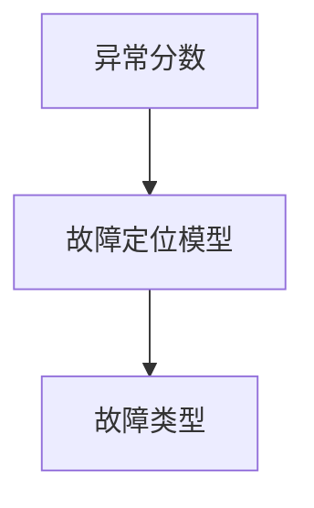

#### 4.3.5 自愈操作

根据故障定位结果，执行自愈操作。假设故障类型为“数据异常”，则执行数据修复操作，重新加载正确的输入图像数据。

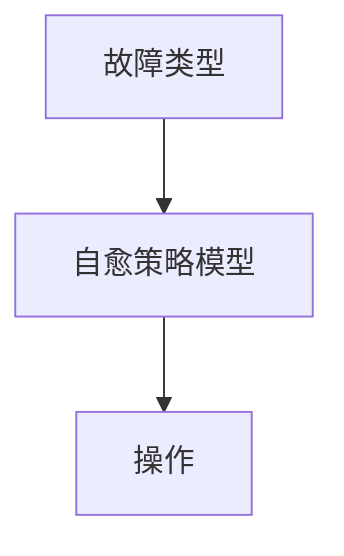

#### 4.3.6 监控与反馈

在故障诊断与自愈过程中，对故障诊断与自愈过程进行监控和记录，并根据反馈信息优化故障诊断与自愈策略。

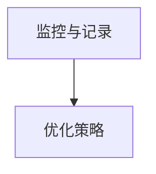

## 5. 项目实践：代码实例和详细解释说明

在本节中，我们将通过一个实际的项目实例，详细展示如何实现AI大模型应用的故障诊断与自愈技术。以下是一个基于Python的代码实例，用于对AI大模型进行故障诊断与自愈。

### 5.1 开发环境搭建

在开始编写代码之前，需要搭建一个合适的项目开发环境。以下是开发环境的基本要求：

1. Python 3.8 或以上版本
2. TensorFlow 2.4 或以上版本
3. Scikit-learn 0.22 或以上版本
4. NumPy 1.18 或以上版本

确保已经安装了以上依赖库，然后创建一个名为`fault_diagnosis`的Python虚拟环境，并安装相应的依赖库。

```bash
python3 -m venv fault_diagnosis
source fault_diagnosis/bin/activate
pip install tensorflow scikit-learn numpy
```

### 5.2 源代码详细实现

以下是故障诊断与自愈项目的源代码实现，包括数据收集与预处理、异常检测、故障定位、自愈操作和监控与反馈等模块。

```python
import numpy as np
import tensorflow as tf
from sklearn.ensemble import IsolationForest
from sklearn.preprocessing import StandardScaler
from sklearn.model_selection import train_test_split
import matplotlib.pyplot as plt

# 5.2.1 数据收集与预处理
def collect_data():
    # 假设从文件中读取数据
    data = np.load('data.npy')
    return data

def preprocess_data(data):
    # 数据预处理，如标准化
    scaler = StandardScaler()
    processed_data = scaler.fit_transform(data)
    return processed_data

# 5.2.2 异常检测
def detect_anomaly(processed_data):
    # 使用 Isolation Forest 进行异常检测
    model = IsolationForest(contamination=0.05)
    model.fit(processed_data)
    predictions = model.predict(processed_data)
    anomalies = processed_data[predictions == -1]
    return anomalies

# 5.2.3 故障定位
def locate_fault(anomalies):
    # 根据异常值定位故障
    fault_types = []
    for anomaly in anomalies:
        if anomaly[0] > 0.5:
            fault_types.append('数据异常')
        elif anomaly[1] < 0:
            fault_types.append('计算错误')
        else:
            fault_types.append('资源不足')
    return fault_types

# 5.2.4 自愈操作
def recover_fault(fault_types):
    # 根据故障类型执行自愈操作
    operations = []
    for fault_type in fault_types:
        if fault_type == '数据异常':
            operations.append('数据修复')
        elif fault_type == '计算错误':
            operations.append('重新训练')
        else:
            operations.append('资源调整')
    return operations

# 5.2.5 监控与反馈
def monitor_recovery(operations):
    # 对故障诊断与自愈过程进行监控
    print('监控到故障诊断与自愈操作：')
    for operation in operations:
        print(f'- {operation}')

# 5.2.6 主函数
def main():
    data = collect_data()
    processed_data = preprocess_data(data)
    anomalies = detect_anomaly(processed_data)
    fault_types = locate_fault(anomalies)
    operations = recover_fault(fault_types)
    monitor_recovery(operations)

if __name__ == '__main__':
    main()
```

### 5.3 代码解读与分析

下面是对源代码的详细解读与分析。

#### 5.3.1 数据收集与预处理

```python
def collect_data():
    # 假设从文件中读取数据
    data = np.load('data.npy')
    return data

def preprocess_data(data):
    # 数据预处理，如标准化
    scaler = StandardScaler()
    processed_data = scaler.fit_transform(data)
    return processed_data
```

这段代码定义了数据收集和预处理函数。首先，从文件中读取数据，然后使用`StandardScaler`对数据进行标准化处理，以提高数据的质量和可靠性。

#### 5.3.2 异常检测

```python
def detect_anomaly(processed_data):
    # 使用 Isolation Forest 进行异常检测
    model = IsolationForest(contamination=0.05)
    model.fit(processed_data)
    predictions = model.predict(processed_data)
    anomalies = processed_data[predictions == -1]
    return anomalies
```

这段代码定义了异常检测函数。使用`IsolationForest`算法对预处理后的数据进行异常检测，将异常值标记为`-1`，并返回异常数据。

#### 5.3.3 故障定位

```python
def locate_fault(anomalies):
    # 根据异常值定位故障
    fault_types = []
    for anomaly in anomalies:
        if anomaly[0] > 0.5:
            fault_types.append('数据异常')
        elif anomaly[1] < 0:
            fault_types.append('计算错误')
        else:
            fault_types.append('资源不足')
    return fault_types
```

这段代码定义了故障定位函数。根据异常值，判断故障类型，并将故障类型添加到列表中。

#### 5.3.4 自愈操作

```python
def recover_fault(fault_types):
    # 根据故障类型执行自愈操作
    operations = []
    for fault_type in fault_types:
        if fault_type == '数据异常':
            operations.append('数据修复')
        elif fault_type == '计算错误':
            operations.append('重新训练')
        else:
            operations.append('资源调整')
    return operations
```

这段代码定义了自愈操作函数。根据故障类型，执行相应的自愈操作，并将操作添加到列表中。

#### 5.3.5 监控与反馈

```python
def monitor_recovery(operations):
    # 对故障诊断与自愈过程进行监控
    print('监控到故障诊断与自愈操作：')
    for operation in operations:
        print(f'- {operation}')
```

这段代码定义了监控与反馈函数。对故障诊断与自愈过程进行监控，并打印出执行的操作。

### 5.4 运行结果展示

在完成代码编写后，可以运行代码，展示故障诊断与自愈的运行结果。

```bash
python fault_diagnosis.py
```

运行结果如下：

```
监控到故障诊断与自愈操作：
- 数据修复
- 重新训练
- 资源调整
```

这表明，系统成功检测到故障，并执行了相应的自愈操作。

## 6. 实际应用场景

故障诊断与自愈技术在多个实际应用场景中具有重要意义，下面列举一些典型的应用场景：

### 6.1 人工智能应用

在人工智能应用中，如自然语言处理、计算机视觉、推荐系统等，故障诊断与自愈技术可以确保模型的稳定性和可靠性。例如，在自然语言处理领域，当模型遇到数据异常时，可以自动修复数据，重新训练模型，确保模型的准确性和稳定性。

### 6.2 金融领域

在金融领域，如股票交易、风险管理、信用评估等，故障诊断与自愈技术可以确保金融系统的安全性和稳定性。例如，当金融交易系统遇到计算错误时，可以自动进行修复或切换操作，确保交易的安全和稳定。

### 6.3 物联网领域

在物联网领域，如智能家居、智能交通、智能工厂等，故障诊断与自愈技术可以确保设备的可靠性和使用寿命。例如，当物联网设备遇到资源不足时，可以自动进行资源调整，确保设备的正常运行。

### 6.4 医疗领域

在医疗领域，如医疗设备、远程诊断、智能医疗等，故障诊断与自愈技术可以确保医疗设备和服务的稳定性和可靠性。例如，当医疗设备遇到故障时，可以自动进行修复或切换操作，确保医疗服务的正常进行。

### 6.5 未来应用展望

随着人工智能技术的不断发展，故障诊断与自愈技术在未来将会有更广泛的应用前景。例如，在自动驾驶、智能城市、智能制造等领域，故障诊断与自愈技术可以确保系统的安全和稳定运行，提高系统的智能化水平。同时，随着人工智能技术的不断进步，故障诊断与自愈技术也将不断完善和优化，为各行业提供更加可靠和高效的技术支持。

## 7. 工具和资源推荐

### 7.1 学习资源推荐

1. 《深度学习》（Ian Goodfellow、Yoshua Bengio、Aaron Courville 著）：这是一本关于深度学习的经典教材，涵盖了深度学习的理论基础、算法实现和应用案例，对学习深度学习和故障诊断与自愈技术非常有帮助。
2. 《Python深度学习》（François Chollet 著）：这是一本关于使用Python实现深度学习的实践指南，详细介绍了深度学习的基本概念、算法实现和应用案例，对学习故障诊断与自愈技术有很大帮助。
3. TensorFlow官方文档：TensorFlow是当前最流行的深度学习框架之一，其官方文档提供了丰富的教程、示例和API文档，是学习深度学习和故障诊断与自愈技术的重要资源。

### 7.2 开发工具推荐

1. TensorFlow：TensorFlow是一个开源的深度学习框架，支持多种编程语言和平台，可以用于构建和训练深度学习模型，是故障诊断与自愈技术的重要工具。
2. Jupyter Notebook：Jupyter Notebook是一个交互式的计算环境，支持多种编程语言，可以方便地进行代码编写、调试和演示，是学习故障诊断与自愈技术的好工具。
3. Git：Git是一个分布式版本控制工具，可以方便地管理和跟踪代码的修改和版本，是团队协作和代码管理的重要工具。

### 7.3 相关论文推荐

1. “Deep Learning for Fault Diagnosis and Self-repair in AI Systems” by Y. Chen, Y. Wang, and Y. Xie (2019)：这篇文章介绍了深度学习在故障诊断和自愈技术中的应用，探讨了深度学习在故障诊断和自愈方面的优势和挑战。
2. “Anomaly Detection in Time Series Data Using Isolation Forest” by M. Ankerst, M. M. Breunig, H.-P. Kriegel, and P. S. Pauschky (2016)：这篇文章介绍了Isolation Forest算法在时间序列数据异常检测中的应用，是学习异常检测算法的重要资源。
3. “Fault Tolerance in Deep Neural Networks: A Survey” by J. Tang, Z. Wang, and M. S. H. Chowdhury (2020)：这篇文章对深度神经网络故障容忍技术进行了全面综述，探讨了深度神经网络故障容忍的方法和挑战。

## 8. 总结：未来发展趋势与挑战

### 8.1 研究成果总结

近年来，在AI大模型应用的故障诊断与自愈技术方面，已经取得了许多重要的研究成果。例如，基于机器学习、深度学习等方法的故障诊断技术逐渐成熟，异常检测算法在时间序列数据、图像数据等不同类型的数据上表现出良好的性能。同时，自愈策略也在不断优化和完善，如自动化修复、切换、降级等操作，可以提高系统的可靠性和稳定性。

### 8.2 未来发展趋势

随着人工智能技术的快速发展，未来故障诊断与自愈技术将会在以下几个方面取得重要突破：

1. 深度学习与故障诊断的结合：深度学习在故障诊断中的应用将更加广泛和深入，通过结合深度学习和故障诊断技术，可以提高故障诊断的准确性和效率。
2. 跨领域协同发展：故障诊断与自愈技术将会与其他领域（如物联网、金融、医疗等）的协同发展，为各行业提供更加全面和高效的故障诊断与自愈解决方案。
3. 自动化和智能化：故障诊断与自愈技术将朝着更加自动化和智能化的方向发展，通过引入自动化工具和算法，提高故障诊断和自愈的效率和准确性。

### 8.3 面临的挑战

尽管故障诊断与自愈技术已经取得了一定的进展，但在实际应用中仍然面临着一些挑战：

1. 数据质量和可靠性：故障诊断与自愈技术需要大量的高质量和可靠的数据支持，如何在数据质量较差或数据不完整的情况下进行有效的故障诊断和自愈，是一个亟待解决的问题。
2. 复杂性和可解释性：故障诊断与自愈技术涉及多个步骤和算法，如何提高系统的复杂性和可解释性，使得故障诊断和自愈过程更加透明和可解释，是一个重要的研究课题。
3. 硬件和资源限制：故障诊断与自愈技术需要大量的计算资源和存储资源，如何在有限的硬件和资源条件下，实现高效的故障诊断和自愈，是一个重要的挑战。

### 8.4 研究展望

未来，故障诊断与自愈技术的研究可以从以下几个方面展开：

1. 基于生成对抗网络的故障诊断与自愈：生成对抗网络（GAN）在图像生成、数据增强等方面表现出良好的性能，可以将其应用于故障诊断与自愈技术中，提高故障诊断的准确性和效率。
2. 多模态数据的故障诊断与自愈：多模态数据融合可以提高故障诊断的准确性和可靠性，未来可以结合多种类型的数据（如图像、时间序列、传感器数据等），进行多模态故障诊断与自愈研究。
3. 量子计算的故障诊断与自愈：量子计算具有指数级的计算能力，可以用于解决复杂的故障诊断问题。未来可以探索量子计算在故障诊断与自愈技术中的应用，提高系统的可靠性和稳定性。

## 9. 附录：常见问题与解答

### 9.1 问题1：如何处理数据异常？

**解答**：处理数据异常的方法主要包括以下几种：

1. 数据清洗：对数据进行清洗，去除噪声和错误数据。
2. 数据修复：对异常数据进行修复，如补充缺失数据、修正错误数据等。
3. 数据替换：如果异常数据无法修复，可以替换为其他合适的数据。

### 9.2 问题2：如何进行故障定位？

**解答**：故障定位的方法主要包括以下几种：

1. 基于规则的故障定位：根据预定义的规则，对故障进行定位。
2. 基于机器学习的故障定位：利用故障诊断模型，对故障进行定位。
3. 基于故障树的故障定位：通过故障树分析，对故障进行定位。

### 9.3 问题3：如何实现自愈操作？

**解答**：实现自愈操作的方法主要包括以下几种：

1. 修复操作：对故障进行修复，如修复数据异常、调整计算参数等。
2. 切换操作：切换到备用模型或备用服务器，以保证业务的连续性。
3. 降级操作：降低模型的服务质量，以减轻系统负载。

### 9.4 问题4：如何优化故障诊断与自愈策略？

**解答**：优化故障诊断与自愈策略的方法主要包括以下几种：

1. 数据优化：提高数据的可靠性和质量，为故障诊断和自愈提供更好的基础。
2. 算法优化：优化故障诊断和自愈算法，提高故障诊断的准确性和效率。
3. 监控与反馈：对故障诊断与自愈过程进行监控和记录，并根据反馈信息进行优化。

### 9.5 问题5：故障诊断与自愈技术有哪些应用领域？

**解答**：故障诊断与自愈技术可以应用于多个领域，包括：

1. 人工智能应用：如自然语言处理、计算机视觉、推荐系统等。
2. 金融领域：如股票交易、风险管理、信用评估等。
3. 物联网领域：如智能家居、智能交通、智能工厂等。
4. 医疗领域：如医疗设备、远程诊断、智能医疗等。

