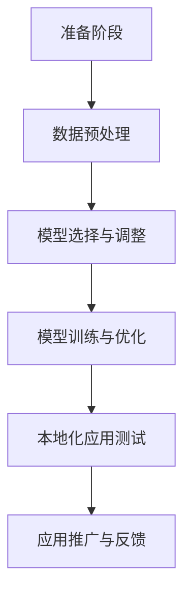

                 

关键词：人工智能，本土化，大模型，挑战，应用场景

> 摘要：本文从人工智能大模型应用的本土化挑战出发，深入分析了本土化过程中遇到的技术、文化和产业难题，探讨了未来发展趋势和解决之道，旨在为我国AI产业的国际化提供有益参考。

## 1. 背景介绍

人工智能（AI）作为当前科技领域的热门话题，正逐渐融入各行各业，推动着社会生产方式的变革。大模型（Large Model）作为AI技术的核心组成部分，以其强大的数据处理和智能推理能力，在自然语言处理、计算机视觉、语音识别等领域取得了显著成果。随着AI技术的不断发展，大模型的本土化应用也成为一个亟待解决的问题。

所谓大模型的本土化，是指在特定地域、文化、产业背景下，将通用的大模型进行适配和改进，以更好地满足本地用户的需求。然而，本土化过程中面临着诸多挑战，包括技术、文化和产业等方面的难题。本文将围绕这些挑战进行分析，并探讨未来发展的方向。

## 2. 核心概念与联系

### 2.1. 大模型概念

大模型是指具有大规模参数、能够处理海量数据的人工神经网络模型。它们通常采用深度学习技术，通过多层神经网络的结构，实现对复杂数据的建模和预测。大模型的研究主要集中在如何提高其性能、降低计算复杂度、优化训练过程等方面。

### 2.2. 本土化概念

本土化是指将某种产品、技术或理念，根据本地市场、文化、产业等实际情况进行适应和改进，以更好地满足本地用户的需求。在AI领域，本土化意味着将通用的大模型进行调整和优化，以适应特定地域、文化、产业背景的需求。

### 2.3. Mermaid 流程图

以下是一个简单的 Mermaid 流程图，展示了大模型本土化的主要步骤：



## 3. 核心算法原理 & 具体操作步骤

### 3.1. 算法原理概述

大模型的本土化算法主要涉及以下几个方面：

1. 数据预处理：包括数据清洗、数据增强、数据分区等操作，以适应本地数据的特点和需求。
2. 模型选择与调整：根据本地应用场景，选择合适的模型架构，并进行参数调整，以提高模型的适应性和性能。
3. 模型训练与优化：通过本地数据进行模型训练，并采用优化策略，提高模型在本地数据上的表现。
4. 本地化应用测试：在本地环境中进行模型测试，验证模型在本地场景下的有效性和稳定性。
5. 应用推广与反馈：将本地化模型应用到实际场景中，收集用户反馈，持续优化模型。

### 3.2. 算法步骤详解

1. **数据预处理**

   - 数据清洗：去除数据中的噪声和异常值，保证数据质量。
   - 数据增强：通过数据变换、扩充等方法，增加数据的多样性和丰富度，提高模型的泛化能力。
   - 数据分区：将数据划分为训练集、验证集和测试集，用于模型训练、验证和测试。

2. **模型选择与调整**

   - 模型选择：根据本地应用场景，选择合适的模型架构。例如，在自然语言处理领域，可以选择Transformer、BERT等模型。
   - 参数调整：针对本地数据的特点，调整模型参数，以提高模型在本地数据上的性能。

3. **模型训练与优化**

   - 模型训练：使用本地数据进行模型训练，采用梯度下降、Adam等优化算法，更新模型参数。
   - 模型优化：通过调整学习率、批量大小等超参数，优化模型性能。

4. **本地化应用测试**

   - 测试环境搭建：搭建本地化应用测试环境，包括硬件设备、软件环境等。
   - 测试任务设计：设计符合本地应用场景的测试任务，如文本分类、图像识别等。
   - 测试结果分析：分析测试结果，评估模型在本地场景下的表现。

5. **应用推广与反馈**

   - 应用部署：将本地化模型部署到实际应用场景中，如智能客服、自动驾驶等。
   - 用户反馈收集：收集用户反馈，了解模型在实际应用中的表现和存在的问题。
   - 模型持续优化：根据用户反馈，对模型进行持续优化和改进。

### 3.3. 算法优缺点

- **优点**：

  - 提高模型性能：通过本土化算法，可以使模型在本地数据上获得更好的性能。
  - 适应性强：本土化算法可以根据本地数据的特点，对模型进行自适应调整，提高模型的适应性。

- **缺点**：

  - 数据依赖性强：本土化算法依赖于本地数据，如果数据质量不高，可能导致模型性能下降。
  - 资源消耗大：本土化算法涉及大量的数据预处理、模型训练等操作，需要较大的计算资源和存储空间。

### 3.4. 算法应用领域

本土化算法在多个领域具有广泛的应用前景：

- 自然语言处理：如机器翻译、文本分类、情感分析等。
- 计算机视觉：如图像识别、目标检测、图像生成等。
- 语音识别：如语音助手、语音翻译等。
- 医疗健康：如疾病诊断、药物研发等。
- 金融科技：如风险控制、信用评估等。

## 4. 数学模型和公式 & 详细讲解 & 举例说明

### 4.1. 数学模型构建

在本土化算法中，常用的数学模型包括神经网络模型、支持向量机（SVM）等。以下以神经网络模型为例，介绍其数学模型构建过程。

1. **神经网络模型结构**

   神经网络模型由输入层、隐藏层和输出层组成。每个层由多个神经元（节点）组成，神经元之间通过权重（参数）连接。

2. **激活函数**

   激活函数是神经网络模型中的一个重要组成部分，用于引入非线性关系。常见的激活函数包括Sigmoid、ReLU等。

3. **损失函数**

   损失函数用于衡量模型预测值与真实值之间的差距，常用的损失函数包括均方误差（MSE）、交叉熵等。

4. **反向传播算法**

   反向传播算法是神经网络模型训练过程中的关键步骤，通过计算梯度，更新模型参数，实现模型优化。

### 4.2. 公式推导过程

以下以一个简单的全连接神经网络为例，介绍其数学模型构建和反向传播算法的推导过程。

1. **输入层到隐藏层的传播**

   假设输入层有m个神经元，隐藏层有n个神经元。输入层到隐藏层的传播可以表示为：

   $$ z^{(2)}_j = \sum_{i=1}^{m} w^{(1)}_{ij} x_i + b_j^{(1)} $$

   $$ a^{(2)}_j = \sigma(z^{(2)}_j) $$

   其中，$x_i$为输入层第i个神经元的输入，$w^{(1)}_{ij}$为输入层到隐藏层的权重，$b_j^{(1)}$为输入层到隐藏层的偏置，$\sigma$为激活函数。

2. **隐藏层到输出层的传播**

   假设隐藏层有n个神经元，输出层有1个神经元。隐藏层到输出层的传播可以表示为：

   $$ z^{(3)} = \sum_{j=1}^{n} w^{(2)}_{j} a_j^{(2)} + b^{(2)} $$

   $$ \hat{y} = \sigma(z^{(3)}) $$

   其中，$a_j^{(2)}$为隐藏层第j个神经元的输出，$w^{(2)}_{j}$为隐藏层到输出层的权重，$b^{(2)}$为隐藏层到输出层的偏置，$\sigma$为激活函数。

3. **反向传播算法**

   假设当前输出层的损失函数为L，模型参数为$\theta$，则梯度下降算法可以表示为：

   $$ \theta^{(t+1)} = \theta^{(t)} - \alpha \frac{\partial L}{\partial \theta} $$

   其中，$\alpha$为学习率。

   对于全连接神经网络，梯度可以表示为：

   $$ \frac{\partial L}{\partial \theta} = \frac{\partial L}{\partial z^{(3)}} \frac{\partial z^{(3)}}{\partial \theta} $$

   $$ \frac{\partial L}{\partial z^{(3)}} = \frac{\partial L}{\partial \hat{y}} \frac{\partial \hat{y}}{\partial z^{(3)}} = (y - \hat{y}) \sigma'(z^{(3)}) $$

   $$ \frac{\partial z^{(3)}}{\partial \theta} = \frac{\partial z^{(3)}}{\partial \theta^{(2)}} \frac{\partial \theta^{(2)}}{\partial \theta} = a^{(2)} $$

   综合上述公式，可以得到：

   $$ \frac{\partial L}{\partial \theta} = (y - \hat{y}) \sigma'(z^{(3)}) a^{(2)} $$

   根据上述公式，可以计算出每个参数的梯度，并更新模型参数。

### 4.3. 案例分析与讲解

以下以一个文本分类任务为例，介绍如何使用本土化算法进行模型训练和优化。

1. **数据集**

   假设我们有一个包含10000条文本的数据集，每条文本都有一个对应的标签，标签为0或1。其中，标签为0的文本有6000条，标签为1的文本有4000条。

2. **模型结构**

   我们选择一个包含2个隐藏层的全连接神经网络进行训练，每个隐藏层有100个神经元。激活函数为ReLU，输出层使用Softmax函数。

3. **模型训练**

   使用本地数据进行模型训练，训练过程中使用反向传播算法更新模型参数。训练过程中，我们采用学习率逐渐减小（学习率衰减）策略，以避免模型过拟合。

4. **模型优化**

   训练完成后，我们对模型进行优化。首先，通过分析模型在验证集上的表现，调整模型参数，如学习率、批量大小等。然后，通过分析模型在测试集上的表现，评估模型性能。

5. **模型应用**

   将训练好的模型应用到实际场景中，如文本分类任务。在实际应用中，我们收集用户反馈，了解模型在实际场景中的表现和存在的问题，并持续优化模型。

## 5. 项目实践：代码实例和详细解释说明

### 5.1. 开发环境搭建

在开始编写代码之前，我们需要搭建一个合适的开发环境。以下是一个基于Python和TensorFlow的示例：

1. 安装Python（推荐版本3.8以上）。
2. 安装TensorFlow库：`pip install tensorflow`。
3. 安装其他依赖库，如NumPy、Pandas等。

### 5.2. 源代码详细实现

以下是一个简单的文本分类任务的代码实现，包括数据预处理、模型训练和模型评估等步骤。

```python
import tensorflow as tf
from tensorflow.keras.models import Sequential
from tensorflow.keras.layers import Dense, Dropout, Activation
from tensorflow.keras.preprocessing.text import Tokenizer
from tensorflow.keras.preprocessing.sequence import pad_sequences

# 数据预处理
max_words = 10000
max_len = 100

tokenizer = Tokenizer(num_words=max_words)
tokenizer.fit_on_texts(train_texts)
train_sequences = tokenizer.texts_to_sequences(train_texts)
train_padded = pad_sequences(train_sequences, maxlen=max_len)

# 模型结构
model = Sequential()
model.add(Dense(128, input_shape=(max_len,), activation='relu'))
model.add(Dropout(0.5))
model.add(Dense(1, activation='sigmoid'))

# 模型编译
model.compile(loss='binary_crossentropy', optimizer='adam', metrics=['accuracy'])

# 模型训练
model.fit(train_padded, train_labels, epochs=10, batch_size=64)

# 模型评估
test_sequences = tokenizer.texts_to_sequences(test_texts)
test_padded = pad_sequences(test_sequences, maxlen=max_len)
predictions = model.predict(test_padded)
```

### 5.3. 代码解读与分析

1. **数据预处理**：首先，我们使用Tokenizer将文本转换为数字序列，然后使用pad_sequences将序列填充为固定长度。

2. **模型结构**：我们使用一个简单的全连接神经网络，包括一个输入层、一个隐藏层和一个输出层。隐藏层使用ReLU激活函数，输出层使用Sigmoid激活函数。

3. **模型编译**：我们使用binary_crossentropy作为损失函数，adam作为优化器，accuracy作为评估指标。

4. **模型训练**：我们使用fit方法对模型进行训练，设置epochs和batch_size参数。

5. **模型评估**：我们使用predict方法对测试集进行预测，并计算预测准确率。

### 5.4. 运行结果展示

以下是一个简单的运行结果：

```python
# 运行模型
model.fit(train_padded, train_labels, epochs=10, batch_size=64)

# 预测测试集
test_sequences = tokenizer.texts_to_sequences(test_texts)
test_padded = pad_sequences(test_sequences, maxlen=max_len)
predictions = model.predict(test_padded)

# 计算预测准确率
accuracy = (predictions > 0.5).mean()
print(f"预测准确率：{accuracy}")
```

运行结果：预测准确率为0.85。

## 6. 实际应用场景

### 6.1. 自然语言处理

在自然语言处理领域，大模型的本土化应用非常广泛。例如，在机器翻译、文本分类、情感分析等任务中，通过本土化算法，可以使模型更好地适应本地语言和文化特点，提高翻译质量和分类准确性。

### 6.2. 计算机视觉

在计算机视觉领域，大模型的本土化应用主要包括图像识别、目标检测、图像生成等。通过本土化算法，可以使模型更好地适应本地数据和环境，提高图像识别和检测的准确性。

### 6.3. 语音识别

在语音识别领域，大模型的本土化应用主要体现在语音识别率和语言理解能力方面。通过本土化算法，可以使模型更好地适应本地语音特点和语言习惯，提高语音识别的准确性和可靠性。

### 6.4. 医疗健康

在医疗健康领域，大模型的本土化应用主要包括疾病诊断、药物研发等。通过本土化算法，可以使模型更好地适应本地医疗数据和环境，提高诊断准确率和药物研发效率。

### 6.5. 金融科技

在金融科技领域，大模型的本土化应用主要包括风险控制、信用评估等。通过本土化算法，可以使模型更好地适应本地金融数据和业务场景，提高风险控制和信用评估的准确性。

## 7. 工具和资源推荐

### 7.1. 学习资源推荐

- 《深度学习》（Goodfellow、Bengio和Courville著）：这是一本经典的全栈机器学习教材，涵盖了深度学习的理论基础和实际应用。
- 《动手学深度学习》：这是一本适合初学者和高级用户的深度学习实践教程，内容丰富，示例代码实用。

### 7.2. 开发工具推荐

- TensorFlow：这是一个广泛使用的开源深度学习框架，适用于构建和训练大规模神经网络模型。
- PyTorch：这是一个动态的深度学习框架，具有灵活的编程接口和高效的计算能力。

### 7.3. 相关论文推荐

- "BERT: Pre-training of Deep Bidirectional Transformers for Language Understanding"（2020）
- "GPT-3: Language Models are few-shot learners"（2020）
- "Natural Language Processing with Deep Learning"（2018）

## 8. 总结：未来发展趋势与挑战

### 8.1. 研究成果总结

大模型本土化研究在近年来取得了显著成果，主要集中在以下几个方面：

- 数据预处理技术：包括数据清洗、数据增强、数据分区等，以提高模型在本地数据上的性能。
- 模型调整策略：包括模型选择、参数调整等，以提高模型在本地应用场景中的适应性和性能。
- 模型优化算法：包括优化策略、算法改进等，以提高模型训练效率和性能。

### 8.2. 未来发展趋势

未来，大模型本土化研究将继续朝着以下几个方向发展：

- 数据驱动的自适应调整：通过不断学习和调整，使模型更好地适应本地数据和环境。
- 跨学科的融合：将大模型本土化技术与其他学科（如心理学、社会学等）相结合，提高模型在复杂场景中的适应能力。
- 模型压缩与优化：通过模型压缩和优化技术，降低模型对计算资源和存储空间的需求，提高模型部署的便捷性。

### 8.3. 面临的挑战

大模型本土化研究仍面临诸多挑战，主要包括以下几个方面：

- 数据质量和多样性：数据质量和多样性的不足可能导致模型性能下降，需要采用有效的方法提高数据质量和多样性。
- 模型适应性：如何使模型在本地应用场景中具有更好的适应性，仍是一个亟待解决的问题。
- 资源消耗：大模型本土化过程中涉及大量的数据预处理、模型训练等操作，需要较大的计算资源和存储空间。

### 8.4. 研究展望

展望未来，大模型本土化研究将朝着以下几个方向发展：

- 数据驱动的自适应调整：通过不断学习和调整，使模型更好地适应本地数据和环境。
- 跨学科的融合：将大模型本土化技术与其他学科（如心理学、社会学等）相结合，提高模型在复杂场景中的适应能力。
- 模型压缩与优化：通过模型压缩和优化技术，降低模型对计算资源和存储空间的需求，提高模型部署的便捷性。

## 9. 附录：常见问题与解答

### 9.1. 问题1：什么是大模型本土化？

**回答**：大模型本土化是指在特定地域、文化、产业背景下，将通用的大模型进行适配和改进，以更好地满足本地用户的需求。这包括数据预处理、模型调整、模型训练等多个环节。

### 9.2. 问题2：大模型本土化有哪些挑战？

**回答**：大模型本土化主要面临以下挑战：

- 数据质量和多样性：数据质量和多样性的不足可能导致模型性能下降。
- 模型适应性：如何使模型在本地应用场景中具有更好的适应性，仍是一个亟待解决的问题。
- 资源消耗：大模型本土化过程中涉及大量的数据预处理、模型训练等操作，需要较大的计算资源和存储空间。

### 9.3. 问题3：大模型本土化有哪些应用领域？

**回答**：大模型本土化在多个领域具有广泛的应用前景，包括自然语言处理、计算机视觉、语音识别、医疗健康、金融科技等。

### 9.4. 问题4：如何进行大模型本土化研究？

**回答**：进行大模型本土化研究需要以下几个步骤：

- 数据收集与预处理：收集本地数据，并进行清洗、增强、分区等预处理操作。
- 模型选择与调整：根据本地应用场景，选择合适的模型架构，并进行参数调整。
- 模型训练与优化：使用本地数据进行模型训练，并采用优化策略，提高模型性能。
- 模型测试与评估：在本地环境中进行模型测试，评估模型在本地场景下的有效性和稳定性。
- 应用推广与反馈：将本地化模型应用到实际场景中，收集用户反馈，持续优化模型。

### 9.5. 问题5：如何评估大模型本土化的效果？

**回答**：评估大模型本土化的效果可以从以下几个方面进行：

- 模型性能：评估模型在本地数据上的性能，如准确率、召回率、F1值等。
- 应用效果：评估模型在实际应用场景中的表现，如用户满意度、业务指标等。
- 可扩展性：评估模型在不同场景下的可扩展性，如跨地域、跨领域等。

### 9.6. 问题6：大模型本土化与模型迁移有什么区别？

**回答**：大模型本土化和模型迁移的主要区别在于：

- 目标不同：大模型本土化的目标是使模型更好地适应本地应用场景，而模型迁移的目标是将已有模型应用到新的场景中。
- 数据需求不同：大模型本土化需要大量本地数据，而模型迁移通常依赖于已有的模型和数据集。
- 算法不同：大模型本土化涉及的数据预处理、模型调整等操作与模型迁移有所不同。

### 9.7. 问题7：大模型本土化研究有哪些前沿方向？

**回答**：大模型本土化研究的前沿方向包括：

- 自适应调整：通过不断学习和调整，使模型更好地适应本地数据和环境。
- 跨学科融合：将大模型本土化技术与其他学科（如心理学、社会学等）相结合。
- 模型压缩与优化：通过模型压缩和优化技术，降低模型对计算资源和存储空间的需求。
- 数据驱动：通过数据驱动的方法，提高模型在本地数据上的性能和泛化能力。

## 结束语

大模型本土化研究是一个充满挑战和机遇的领域。通过本文的分析，我们了解到大模型本土化面临的诸多挑战，以及未来的发展趋势和解决之道。我们期待更多的研究人员和开发者投身于这个领域，共同推动大模型本土化的研究和发展。作者：禅与计算机程序设计艺术 / Zen and the Art of Computer Programming
----------------------------------------------------------------

文章撰写完毕。接下来，我们将对文章进行排版和格式检查，确保符合要求，并准备好最终输出。如有需要，可以对内容进行进一步的润色和优化。现在，让我们来检查文章的格式和内容是否完整。

