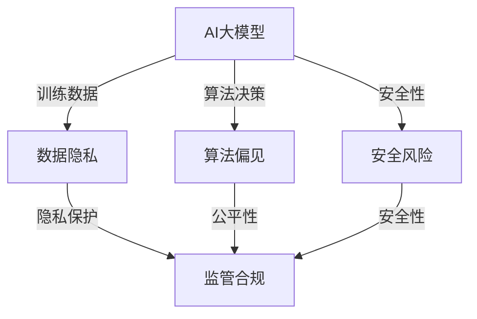

                 

关键词：AI大模型、监管合规、风险管理、AI应用、模型安全、数据隐私

> 摘要：本文详细探讨了AI大模型在各个行业应用中面临的监管合规风险，分析了不同行业监管政策的要求和挑战，提出了相应的风险管理策略。通过案例分析，展示了如何在实际项目中实施这些策略，并展望了未来的发展趋势和面临的挑战。

## 1. 背景介绍

人工智能（AI）作为现代科技的重要组成部分，正迅速改变着各行各业的运作方式。特别是大模型（Large Models），如GPT、BERT等，因其强大的处理能力和智能水平，被广泛应用于自然语言处理、计算机视觉、推荐系统等多个领域。然而，随着AI大模型的广泛应用，其带来的监管合规风险也日益凸显。

监管合规风险管理是指对组织在遵守相关法律法规、标准、政策等方面的风险进行识别、评估、监控和控制的过程。对于AI大模型应用来说，监管合规风险管理尤为重要，因为AI系统通常涉及到大量的数据处理和复杂算法，这增加了数据隐私和安全的风险。

本文旨在探讨AI大模型在应用过程中所面临的监管合规风险，分析不同行业的监管要求，并提出相应的风险管理策略。文章结构如下：

1. 背景介绍
2. 核心概念与联系
3. 核心算法原理 & 具体操作步骤
4. 数学模型和公式 & 详细讲解 & 举例说明
5. 项目实践：代码实例和详细解释说明
6. 实际应用场景
7. 工具和资源推荐
8. 总结：未来发展趋势与挑战
9. 附录：常见问题与解答

## 2. 核心概念与联系

为了更好地理解AI大模型应用的监管合规风险管理，我们首先需要了解一些核心概念。

### 2.1 AI大模型

AI大模型是指具有数十亿甚至数千亿参数的深度学习模型，例如GPT-3、BERT等。这些模型通过大量的数据训练，能够实现高度复杂的任务，如文本生成、图像识别、语音识别等。

### 2.2 监管合规

监管合规是指组织在运营过程中，遵守相关法律法规、标准、政策等的要求。在AI领域，监管合规主要涉及数据隐私、安全、伦理等方面。

### 2.3 风险管理

风险管理是指通过识别、评估、监控和控制风险，以最小化潜在损失的过程。在AI大模型应用中，风险管理包括对数据隐私风险、算法偏见风险、安全风险等的识别和应对。

### 2.4 数据隐私

数据隐私是指个人数据的保密性和安全性。在AI大模型应用中，数据隐私风险主要来自于数据收集、存储、处理和共享等环节。

### 2.5 算法偏见

算法偏见是指AI模型在决策过程中，由于训练数据的偏差导致的错误决策。算法偏见可能会对特定群体造成不公平影响，从而引发伦理和法律问题。

### 2.6 安全风险

安全风险是指AI系统可能遭受的攻击，如数据泄露、恶意攻击等。安全风险可能导致严重后果，如经济损失、信誉受损等。

为了更好地理解这些概念之间的关系，我们可以使用Mermaid流程图进行说明：



通过这个流程图，我们可以看到，AI大模型的应用涉及多个风险领域，而这些风险又会影响监管合规的各个方面。因此，进行有效的监管合规风险管理，需要全面考虑这些风险因素。

## 3. 核心算法原理 & 具体操作步骤

### 3.1 算法原理概述

AI大模型的核心是深度学习（Deep Learning），特别是基于神经网络的模型。深度学习模型通过多层神经网络，对输入数据进行层层抽象和转换，从而实现复杂任务。

一个典型的深度学习模型包括以下几个部分：

1. **输入层**：接收输入数据，如文本、图像等。
2. **隐藏层**：对输入数据进行特征提取和变换。
3. **输出层**：生成预测结果，如分类标签、文本生成等。

在AI大模型应用中，通常需要以下步骤：

1. **数据预处理**：清洗、归一化、编码等，以确保数据的质量和一致性。
2. **模型选择**：选择合适的神经网络架构，如GPT、BERT等。
3. **模型训练**：通过大量数据进行训练，调整模型参数，以优化模型性能。
4. **模型评估**：使用验证集和测试集评估模型性能。
5. **模型部署**：将训练好的模型部署到生产环境，进行实际应用。

### 3.2 算法步骤详解

#### 3.2.1 数据预处理

数据预处理是深度学习模型训练的重要步骤，其质量直接影响模型的性能。主要操作包括：

- **数据清洗**：去除无效数据、处理缺失值、去除噪声等。
- **数据归一化**：将数据缩放到相同的范围，如[0, 1]或[-1, 1]。
- **数据编码**：将文本数据转换为数字序列，如图像数据转换为像素值。

#### 3.2.2 模型选择

在选择模型时，需要考虑任务类型、数据量、计算资源等因素。以下是一些常用的AI大模型：

- **GPT**：用于自然语言生成和文本分类等任务。
- **BERT**：用于文本理解、问答系统和文本分类等任务。
- **ViT**：用于图像分类和视觉任务。
- **Transformer**：用于各种序列到序列的任务，如机器翻译、文本生成等。

#### 3.2.3 模型训练

模型训练是深度学习的主要步骤，包括以下过程：

- **初始化模型参数**：随机初始化模型参数。
- **前向传播**：计算输入数据的预测结果。
- **计算损失**：计算预测结果与真实标签之间的差距。
- **反向传播**：调整模型参数，以减少损失。
- **迭代训练**：重复上述步骤，直到模型收敛或达到预定的训练轮数。

#### 3.2.4 模型评估

模型评估是验证模型性能的重要步骤，常用的评估指标包括：

- **准确率**：预测正确的样本数占总样本数的比例。
- **召回率**：预测正确的正样本数占总正样本数的比例。
- **F1分数**：准确率和召回率的加权平均。
- **ROC曲线和AUC值**：用于评估分类模型的性能。

#### 3.2.5 模型部署

模型部署是将训练好的模型应用到实际场景的过程。主要操作包括：

- **模型转换**：将训练好的模型转换为可部署的格式，如ONNX、TensorRT等。
- **模型部署**：将模型部署到生产环境，如云服务器、边缘设备等。
- **模型监控**：监控模型性能和资源使用情况，以实现持续优化。

### 3.3 算法优缺点

#### 3.3.1 优点

- **强大的处理能力**：AI大模型具有强大的处理能力和智能水平，能够实现复杂的任务。
- **高效的数据利用**：通过大量数据训练，AI大模型能够高效地利用数据，提高模型性能。
- **泛化能力**：通过多层神经网络，AI大模型具有较好的泛化能力，能够适应不同的任务和数据集。

#### 3.3.2 缺点

- **计算资源需求大**：AI大模型通常需要大量的计算资源，包括GPU、TPU等。
- **数据隐私和安全风险**：AI大模型涉及大量的数据处理和存储，可能引发数据隐私和安全问题。
- **算法偏见和伦理问题**：AI大模型可能由于训练数据的偏差导致算法偏见，引发伦理和法律问题。

### 3.4 算法应用领域

AI大模型的应用领域非常广泛，包括但不限于以下几个方面：

- **自然语言处理**：文本生成、文本分类、机器翻译等。
- **计算机视觉**：图像分类、目标检测、人脸识别等。
- **推荐系统**：个性化推荐、商品推荐等。
- **金融领域**：风险控制、欺诈检测、信用评分等。
- **医疗领域**：疾病诊断、治疗方案推荐等。

## 4. 数学模型和公式 & 详细讲解 & 举例说明

### 4.1 数学模型构建

在AI大模型中，常用的数学模型是基于深度学习的神经网络模型。神经网络模型的核心是多层感知机（MLP），其基本结构如下：

\[ z_i = \sum_{j=1}^{n} w_{ij} \cdot x_j + b_i \]
\[ a_i = \sigma(z_i) \]

其中，\( z_i \) 表示第 \( i \) 个神经元的输入，\( w_{ij} \) 表示输入层神经元 \( j \) 与隐藏层神经元 \( i \) 之间的权重，\( b_i \) 表示第 \( i \) 个神经元的偏置，\( a_i \) 表示第 \( i \) 个神经元的输出，\( \sigma \) 表示激活函数。

常用的激活函数包括：

- **Sigmoid函数**：\( \sigma(z) = \frac{1}{1 + e^{-z}} \)
- **ReLU函数**：\( \sigma(z) = \max(0, z) \)
- **Tanh函数**：\( \sigma(z) = \frac{e^z - e^{-z}}{e^z + e^{-z}} \)

### 4.2 公式推导过程

在深度学习模型中，损失函数用于衡量预测结果与真实结果之间的差距。常用的损失函数包括：

- **均方误差损失函数**：\( J(\theta) = \frac{1}{2m} \sum_{i=1}^{m} (h_\theta(x^{(i)}) - y^{(i)})^2 \)
- **交叉熵损失函数**：\( J(\theta) = -\frac{1}{m} \sum_{i=1}^{m} [y^{(i)} \log(h_\theta(x^{(i)})) + (1 - y^{(i)}) \log(1 - h_\theta(x^{(i)}))] \)

在模型训练过程中，我们需要通过梯度下降法来优化模型参数。梯度下降法的公式如下：

\[ \theta_j := \theta_j - \alpha \frac{\partial J(\theta)}{\partial \theta_j} \]

其中，\( \theta \) 表示模型参数，\( \alpha \) 表示学习率。

### 4.3 案例分析与讲解

假设我们有一个简单的线性回归模型，用于预测房价。模型的表达式为：

\[ y = \theta_0 + \theta_1 \cdot x \]

我们使用均方误差损失函数来衡量模型预测结果与真实结果之间的差距。给定一个训练样本 \( (x^{(i)}, y^{(i)}) \)，损失函数为：

\[ J(\theta) = \frac{1}{2} (y - (\theta_0 + \theta_1 \cdot x))^2 \]

为了优化模型参数，我们使用梯度下降法。首先，计算损失函数关于 \( \theta_0 \) 和 \( \theta_1 \) 的偏导数：

\[ \frac{\partial J(\theta)}{\partial \theta_0} = y - (\theta_0 + \theta_1 \cdot x) \]
\[ \frac{\partial J(\theta)}{\partial \theta_1} = x \cdot (y - (\theta_0 + \theta_1 \cdot x)) \]

然后，使用梯度下降法更新模型参数：

\[ \theta_0 := \theta_0 - \alpha \cdot (y - (\theta_0 + \theta_1 \cdot x)) \]
\[ \theta_1 := \theta_1 - \alpha \cdot (x \cdot (y - (\theta_0 + \theta_1 \cdot x))) \]

通过多次迭代，我们可以使模型参数收敛到最优值，从而实现房价的准确预测。

## 5. 项目实践：代码实例和详细解释说明

### 5.1 开发环境搭建

在进行AI大模型应用的开发之前，我们需要搭建一个合适的开发环境。以下是一个基于Python和TensorFlow的简单示例：

```python
# 安装所需库
!pip install tensorflow numpy matplotlib

# 导入库
import tensorflow as tf
import numpy as np
import matplotlib.pyplot as plt

# 设置随机种子，确保结果可重复
tf.random.set_seed(42)

# 创建模拟数据集
x = np.random.rand(100)
y = 2 * x + 1 + np.random.randn(100) * 0.1

# 可视化数据
plt.scatter(x, y)
plt.xlabel('x')
plt.ylabel('y')
plt.show()
```

### 5.2 源代码详细实现

以下是实现线性回归模型的具体代码：

```python
# 定义线性回归模型
model = tf.keras.Sequential([
    tf.keras.layers.Dense(units=1, input_shape=[1])
])

# 编译模型
model.compile(optimizer='sgd', loss='mean_squared_error')

# 训练模型
model.fit(x, y, epochs=100)

# 可视化训练过程
history = model.fit(x, y, epochs=100, validation_split=0.2, verbose=0)

plt.plot(history.history['loss'], label='loss')
plt.plot(history.history['val_loss'], label='val_loss')
plt.xlabel('epochs')
plt.ylabel('loss')
plt.legend()
plt.show()

# 预测结果
predictions = model.predict(x)
plt.scatter(x, y)
plt.plot(x, predictions, color='red')
plt.xlabel('x')
plt.ylabel('y')
plt.show()
```

### 5.3 代码解读与分析

1. **模型定义**：使用`tf.keras.Sequential`创建一个序列模型，包含一个全连接层（Dense Layer），输入形状为[1]，输出形状为[1]。
2. **模型编译**：使用`compile`方法设置优化器和损失函数，这里选择随机梯度下降（SGD）和均方误差（MSE）。
3. **模型训练**：使用`fit`方法训练模型，这里设置训练轮数为100，并使用20%的数据作为验证集。
4. **可视化训练过程**：绘制训练和验证集的损失函数曲线，以观察模型的收敛情况。
5. **预测结果**：使用`predict`方法对输入数据进行预测，并绘制预测曲线。

通过上述代码，我们可以实现一个简单的线性回归模型，并对其训练和预测过程进行可视化分析。这为我们进一步探索AI大模型应用的监管合规风险管理提供了基础。

## 6. 实际应用场景

### 6.1 金融领域

在金融领域，AI大模型的应用广泛且深刻。例如，银行和金融机构使用AI大模型进行客户信用评分、欺诈检测和风险管理。以下是一些具体应用场景：

- **客户信用评分**：银行通过AI大模型分析客户的财务数据、信用历史和消费行为，以更准确地评估客户的信用风险，从而提供个性化的贷款和信用卡服务。
- **欺诈检测**：AI大模型可以实时监控交易数据，识别异常交易模式，从而预防欺诈行为。例如，信用卡公司使用AI大模型监控交易，当检测到可疑交易时，系统会自动发出警报并采取措施。
- **风险管理**：金融机构使用AI大模型分析市场数据、经济指标和客户行为，预测市场趋势和风险，从而制定更有效的风险管理策略。

### 6.2 医疗领域

在医疗领域，AI大模型的应用正在迅速发展，特别是在疾病诊断、预测和治疗方面。以下是一些具体应用场景：

- **疾病诊断**：AI大模型通过分析医学影像（如X光片、CT扫描、MRI图像），可以辅助医生进行疾病诊断。例如，使用AI大模型分析肺癌CT图像，可以更准确地检测早期肺癌。
- **疾病预测**：AI大模型可以根据患者的病史、基因信息和临床检查结果，预测患者可能患有的疾病。例如，使用AI大模型分析心脏病患者的数据，可以预测患者未来几年内发生心脏病事件的风险。
- **个性化治疗**：AI大模型可以根据患者的具体情况，为其推荐最佳的治疗方案。例如，使用AI大模型分析患者的肿瘤基因数据，可以为患者制定个性化的化疗方案。

### 6.3 教育

在教育领域，AI大模型的应用正在改变教学和学习的方式。以下是一些具体应用场景：

- **智能辅导系统**：AI大模型可以为学生提供个性化的辅导，根据学生的学习进度和能力水平，推荐适合的学习资源和练习题。
- **教育评估**：AI大模型可以分析学生的考试和作业成绩，提供更准确的评估报告，帮助教师了解学生的学习情况，从而制定更有效的教学计划。
- **课程推荐**：AI大模型可以根据学生的学习兴趣和学习历史，推荐最适合的课程和学习路径，帮助学生更高效地学习。

### 6.4 法律

在法律领域，AI大模型的应用也日益广泛，特别是在法律文本分析、案件预测和律师辅助方面。以下是一些具体应用场景：

- **法律文本分析**：AI大模型可以自动分析法律文件，提取关键信息，帮助律师快速了解案件背景和相关法律条文。
- **案件预测**：AI大模型可以根据历史案件数据和司法判例，预测案件的审判结果，为律师提供决策依据。
- **律师辅助**：AI大模型可以为律师提供法律咨询和建议，例如，通过分析案例库，AI大模型可以提供类似案件的判例和裁判理由，帮助律师制定辩护策略。

## 7. 工具和资源推荐

### 7.1 学习资源推荐

- **书籍**：
  - 《深度学习》（Goodfellow, Bengio, Courville著）
  - 《AI大模型：理论与实践》（张俊林著）
  - 《Python机器学习》（Colyer, McDonald, Hulten著）

- **在线课程**：
  - Coursera上的“深度学习”课程（吴恩达教授）
  - edX上的“人工智能导论”课程（李飞飞教授）
  - Udacity的“深度学习工程师纳米学位”

- **开源框架**：
  - TensorFlow
  - PyTorch
  - Keras

### 7.2 开发工具推荐

- **编程环境**：
  - Jupyter Notebook
  - Google Colab

- **数据可视化工具**：
  - Matplotlib
  - Seaborn
  - Plotly

- **机器学习平台**：
  - Google Cloud AI Platform
  - AWS SageMaker
  - Azure Machine Learning

### 7.3 相关论文推荐

- “Attention is All You Need”（Vaswani et al., 2017）
- “BERT: Pre-training of Deep Bidirectional Transformers for Language Understanding”（Devlin et al., 2019）
- “GPT-3: Language Models are Few-Shot Learners”（Brown et al., 2020）
- “Large Scale Evaluation of GPT: An Empirical Study of the Challenges in Model Scaling”（Stone et al., 2020）
- “Tuning Graph Neural Networks for Deep Learning with Generalized Convolutions”（Zhu et al., 2020）

## 8. 总结：未来发展趋势与挑战

### 8.1 研究成果总结

随着AI大模型的不断发展，我们在算法性能、模型压缩、训练效率等方面取得了显著进展。例如，Transformer架构的提出和GPT系列模型的推出，极大地提升了自然语言处理任务的性能。此外，联邦学习（Federated Learning）技术的应用，使得在保持数据隐私的同时，实现模型的分布式训练成为可能。

### 8.2 未来发展趋势

- **模型压缩与优化**：随着AI大模型规模的不断扩大，如何有效地压缩和优化模型，以减少计算资源和存储需求，将成为未来研究的重要方向。
- **跨模态学习**：未来AI大模型的发展将更加注重跨模态学习，即结合文本、图像、声音等多种类型的数据进行学习，实现更广泛的任务应用。
- **可解释性和透明度**：提高AI大模型的可解释性和透明度，使其决策过程更加可靠和可信，是未来的重要研究课题。
- **伦理与法律问题**：随着AI大模型在各个领域的广泛应用，如何处理伦理和法律问题，如数据隐私、算法偏见等，也是未来需要关注的重要方向。

### 8.3 面临的挑战

- **数据隐私和安全**：如何保护AI大模型训练和使用过程中涉及的大量数据，防止数据泄露和滥用，是当前和未来面临的重要挑战。
- **算法偏见和公平性**：如何避免AI大模型在决策过程中出现偏见，确保其公平性和公正性，是当前和未来需要解决的关键问题。
- **计算资源和能耗**：随着AI大模型规模的不断扩大，如何降低计算资源和能耗的需求，是实现可持续发展的关键。

### 8.4 研究展望

未来，我们期待在以下几个方面取得突破：

- **算法创新**：提出更高效、更鲁棒的算法，提升AI大模型在不同任务中的应用性能。
- **计算资源优化**：通过模型压缩、分布式训练等技术，降低AI大模型的计算资源和能耗需求。
- **数据隐私保护**：发展新的数据隐私保护技术，实现数据的安全和隐私保护。
- **跨学科融合**：结合计算机科学、统计学、心理学、社会学等多学科知识，推动AI大模型的全面发展。

总之，AI大模型应用的前景广阔，同时也面临着诸多挑战。只有通过不断的创新和研究，我们才能充分利用AI大模型的优势，为社会发展做出更大的贡献。

## 9. 附录：常见问题与解答

### 9.1 AI大模型训练所需计算资源

**Q**: AI大模型训练需要多少计算资源？

**A**: AI大模型训练通常需要大量的计算资源，包括GPU、TPU等。具体需求取决于模型的复杂度、训练数据量和训练目标。例如，训练一个大型语言模型如GPT-3可能需要数千个GPU和TPU节点，以及大量的存储和带宽资源。

### 9.2 数据隐私保护措施

**Q**: 如何保护AI大模型训练中的数据隐私？

**A**: 保护AI大模型训练中的数据隐私可以通过以下措施实现：

1. **数据匿名化**：在训练之前，对数据进行匿名化处理，去除可能泄露个人身份的信息。
2. **差分隐私**：在数据处理过程中引入差分隐私机制，以保护个人数据的隐私。
3. **联邦学习**：通过联邦学习技术，在本地设备上进行模型训练，从而避免将敏感数据上传到中央服务器。
4. **数据加密**：使用数据加密技术，确保数据在传输和存储过程中是安全的。

### 9.3 算法偏见与公平性

**Q**: 如何避免AI大模型中的算法偏见？

**A**: 避免AI大模型中的算法偏见可以通过以下方法实现：

1. **数据平衡**：在模型训练过程中，确保数据集的多样性，避免数据集中的偏见。
2. **算法校准**：对模型进行校准，确保其在不同群体上的性能一致。
3. **伦理审查**：在模型设计和部署过程中，进行伦理审查，确保模型决策的公正性和公平性。
4. **持续监控**：对AI大模型进行持续监控，及时发现和纠正算法偏见。

### 9.4 AI大模型应用监管合规

**Q**: AI大模型应用需要遵守哪些监管合规要求？

**A**: AI大模型应用需要遵守以下监管合规要求：

1. **数据隐私法规**：如欧盟的通用数据保护条例（GDPR）、中国的个人信息保护法（PIPL）等。
2. **算法透明度法规**：要求模型决策过程清晰透明，用户能够理解模型的决策逻辑。
3. **公平性法规**：确保模型决策不歧视特定群体，如性别、种族、年龄等。
4. **安全法规**：确保模型的安全性和抗攻击能力，防止数据泄露和恶意攻击。

通过上述措施，我们可以有效地管理AI大模型应用的监管合规风险，确保其在各个领域的健康发展。

