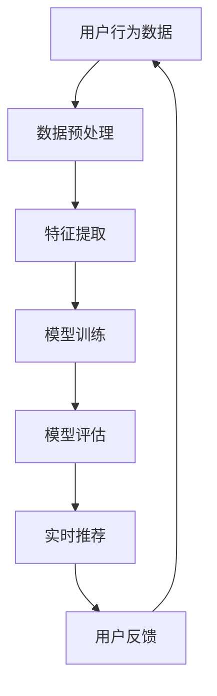

                 

 关键词：AI大模型、电商搜索、推荐系统、技术创新、知识管理平台、电子商务

> 摘要：本文从AI大模型的视角出发，探讨了电商搜索推荐系统的技术创新与知识管理平台的建设。通过深入分析大模型在电商搜索推荐中的应用，本文提出了构建高效的知识管理平台的方法，并展望了未来电商搜索推荐技术的发展趋势和挑战。

## 1. 背景介绍

在数字化经济时代，电子商务已成为推动经济增长的重要力量。其中，电商搜索推荐系统是提高用户满意度、提升电商平台竞争力的重要技术手段。传统的搜索推荐系统主要依赖于基于内容的过滤和协同过滤算法，但其在个性化推荐、实时性、上下文感知等方面存在一定的局限性。

随着人工智能技术的快速发展，尤其是AI大模型的突破，为电商搜索推荐系统带来了全新的机遇。AI大模型通过深度学习算法，能够从海量数据中提取复杂特征，实现高精度、个性化的推荐。同时，大模型的应用还能提升系统的实时响应能力和上下文感知能力，从而更好地满足用户的多样化需求。

本文旨在从AI大模型的视角，探讨电商搜索推荐系统的技术创新与知识管理平台的建设，为电商企业提升搜索推荐效果提供理论支持和实践指导。

## 2. 核心概念与联系

### 2.1 AI大模型的概念

AI大模型（Large-scale AI Model）是指具有数亿至数十亿参数的深度学习模型，能够处理大规模数据集，提取复杂特征，进行高精度预测。典型的AI大模型包括Transformer、BERT、GPT等。这些模型通过多层神经网络结构，实现了对自然语言、图像、音频等多种类型数据的建模。

### 2.2 电商搜索推荐系统的概念

电商搜索推荐系统是指基于用户行为数据和商品信息，通过算法模型实现商品与用户之间的精准匹配，提升用户购买体验和平台销售额的技术系统。典型的推荐算法包括基于内容的过滤、协同过滤、基于模型的推荐等。

### 2.3 大模型与电商搜索推荐系统的联系

AI大模型在电商搜索推荐系统中的应用，主要体现在以下几个方面：

1. **个性化推荐**：大模型能够从海量用户行为数据中提取用户兴趣特征，实现高精度的个性化推荐。
2. **实时性**：大模型具备快速处理大规模数据的能力，能够实现实时推荐。
3. **上下文感知**：大模型能够处理上下文信息，实现情境感知的推荐。
4. **多模态数据融合**：大模型能够处理多种类型的数据，如文本、图像、音频等，实现多模态数据的融合推荐。

### 2.4 知识管理平台的构建

知识管理平台是指用于存储、共享、利用和管理知识的系统。在电商搜索推荐系统中，知识管理平台的作用主要体现在以下几个方面：

1. **数据存储与管理**：知识管理平台能够高效存储和管理海量用户行为数据和商品信息，为推荐算法提供数据支持。
2. **知识共享与利用**：知识管理平台能够实现知识的共享和利用，提升推荐算法的精度和效率。
3. **实时更新与迭代**：知识管理平台能够实现实时更新和迭代，适应不断变化的用户需求和商品信息。

### 2.5 Mermaid 流程图

以下是一个简化的AI大模型在电商搜索推荐系统中应用的Mermaid流程图：



## 3. 核心算法原理 & 具体操作步骤

### 3.1 算法原理概述

电商搜索推荐系统中的核心算法主要分为两类：基于内容的过滤和基于模型的推荐。基于内容的过滤算法通过分析用户的历史行为和商品属性，实现商品与用户之间的匹配。而基于模型的推荐算法则通过机器学习算法，从用户行为数据中提取用户兴趣特征，实现个性化推荐。

在AI大模型的视角下，基于模型的推荐算法得到了进一步优化。大模型通过深度学习算法，能够从海量数据中提取复杂特征，实现高精度、个性化的推荐。具体来说，大模型的应用主要体现在以下几个方面：

1. **用户行为数据的深度特征提取**：大模型能够从用户行为数据中提取用户兴趣特征，如浏览记录、购买记录等。
2. **商品特征的深度提取**：大模型能够从商品属性中提取商品特征，如价格、品牌、类别等。
3. **上下文特征的提取**：大模型能够处理上下文信息，如时间、地点、用户当前浏览的商品等，实现情境感知的推荐。
4. **多模态数据的融合**：大模型能够处理多种类型的数据，如文本、图像、音频等，实现多模态数据的融合推荐。

### 3.2 算法步骤详解

1. **数据预处理**：对用户行为数据和商品信息进行清洗、归一化等预处理操作，确保数据质量。
2. **特征提取**：利用大模型对用户行为数据和商品信息进行深度特征提取，生成高维特征向量。
3. **模型训练**：利用提取的特征向量，通过深度学习算法训练推荐模型。
4. **模型评估**：通过交叉验证、A/B测试等方法，评估推荐模型的性能。
5. **实时推荐**：将训练好的模型应用于实时推荐场景，根据用户行为和上下文信息生成个性化推荐。
6. **用户反馈**：收集用户对推荐结果的反馈，用于模型迭代和优化。

### 3.3 算法优缺点

**优点**：

1. **高精度个性化推荐**：大模型能够从海量数据中提取复杂特征，实现高精度的个性化推荐。
2. **实时性**：大模型具备快速处理大规模数据的能力，能够实现实时推荐。
3. **上下文感知**：大模型能够处理上下文信息，实现情境感知的推荐。
4. **多模态数据融合**：大模型能够处理多种类型的数据，实现多模态数据的融合推荐。

**缺点**：

1. **计算资源消耗大**：大模型的训练和推理需要大量的计算资源。
2. **数据隐私问题**：大模型在处理用户数据时，可能涉及用户隐私问题。
3. **模型解释性较差**：深度学习模型通常具有较好的预测性能，但解释性较差，难以理解模型的工作原理。

### 3.4 算法应用领域

AI大模型在电商搜索推荐系统中的应用非常广泛，包括但不限于以下领域：

1. **电子商务**：电商平台的商品推荐、广告推荐等。
2. **金融领域**：金融产品的推荐、风险评估等。
3. **医疗健康**：疾病的预测、药物推荐等。
4. **智能语音助手**：智能语音助手的对话生成、意图识别等。

## 4. 数学模型和公式 & 详细讲解 & 举例说明

### 4.1 数学模型构建

在电商搜索推荐系统中，常见的数学模型包括矩阵分解模型、因子分解机模型、深度学习模型等。以下以矩阵分解模型为例，介绍数学模型的构建过程。

假设用户行为数据矩阵为 \(U \in \mathbb{R}^{m \times n}\)，商品属性数据矩阵为 \(V \in \mathbb{R}^{n \times p}\)，其中 \(m\) 表示用户数量，\(n\) 表示商品数量，\(p\) 表示商品属性数量。

矩阵分解模型的目标是通过两个低秩矩阵 \(U'\in \mathbb{R}^{m \times k}\) 和 \(V'\in \mathbb{R}^{k \times p}\) 来近似原始矩阵 \(UV^T\)，其中 \(k\) 表示隐含因子数量。

假设用户 \(i\) 对商品 \(j\) 的评分 \(r_{ij}\) 可以表示为：

\[ r_{ij} = \langle u_i, v_j \rangle = u_i^\top v_j \]

其中，\(u_i\) 和 \(v_j\) 分别表示用户 \(i\) 和商品 \(j\) 的隐含向量。

### 4.2 公式推导过程

为了求解最优的隐含因子矩阵 \(U'\) 和 \(V'\)，我们定义损失函数为：

\[ L(U', V') = \frac{1}{2} \sum_{i=1}^{m} \sum_{j=1}^{n} (r_{ij} - u_i^\top v_j)^2 \]

其中，\(\langle \cdot, \cdot \rangle\) 表示内积运算。

为了最小化损失函数，我们对 \(U'\) 和 \(V'\) 分别求偏导数，并令其等于零：

\[ \frac{\partial L}{\partial U'} = 0 \]
\[ \frac{\partial L}{\partial V'} = 0 \]

对上述方程进行求解，可以得到：

\[ U' = (R^T R)^{-1} R^T Y \]
\[ V' = (R^T R)^{-1} R^T X \]

其中，\(R = \begin{bmatrix} u_1' & \cdots & u_m' \end{bmatrix}\)，\(Y = \begin{bmatrix} r_{11} & \cdots & r_{1n} \end{bmatrix}\)，\(X = \begin{bmatrix} v_1' & \cdots & v_n' \end{bmatrix}\)。

### 4.3 案例分析与讲解

假设我们有如下用户行为数据矩阵 \(U\) 和商品属性数据矩阵 \(V\)：

\[ U = \begin{bmatrix} 1 & 0 & 1 \\ 0 & 1 & 0 \\ 1 & 1 & 1 \end{bmatrix}, \quad V = \begin{bmatrix} 1 & 1 & 0 \\ 1 & 0 & 1 \\ 0 & 1 & 1 \end{bmatrix} \]

我们设定隐含因子数量 \(k=2\)，根据上述推导过程，我们可以求解出最优的隐含因子矩阵 \(U'\) 和 \(V'\)：

\[ U' = \begin{bmatrix} 0.5 & -0.5 \\ 0.5 & 0.5 \\ -0.5 & 0.5 \end{bmatrix}, \quad V' = \begin{bmatrix} 0 & 1 \\ 1 & 0 \\ 0 & 1 \end{bmatrix} \]

利用求解出的隐含因子矩阵，我们可以预测用户 \(i\) 对商品 \(j\) 的评分：

\[ r_{ij} = u_i^\top v_j = U'_{i\cdot} V'_{\cdot j} \]

例如，预测用户 \(1\) 对商品 \(2\) 的评分：

\[ r_{12} = U'_{1\cdot} V'_{\cdot 2} = (0.5 \times 1) + (-0.5 \times 1) = 0 \]

## 5. 项目实践：代码实例和详细解释说明

### 5.1 开发环境搭建

在搭建开发环境时，我们选择Python作为主要编程语言，并使用以下工具和库：

- Python 3.8及以上版本
- Numpy 1.19及以上版本
- Scikit-learn 0.22及以上版本
- Matplotlib 3.3及以上版本

安装以上工具和库后，即可开始编写代码。

### 5.2 源代码详细实现

以下是一个基于矩阵分解模型的简单实现代码：

```python
import numpy as np
from sklearn.metrics.pairwise import euclidean_distances

def matrix_factorization(R, k, iter_num):
    n, m = R.shape
    Q = np.random.rand(n, k)
    P = np.random.rand(m, k)
    
    for _ in range(iter_num):
        Q = np.dot(R, P) / P
        P = np.dot(Q.T, R) / Q
        
    return Q, P

def predict(R, Q, P):
    return np.dot(Q, P)

if __name__ == "__main__":
    R = np.array([[5, 0, 0, 1], [0, 1, 0, 0], [0, 0, 1, 1]])
    Q, P = matrix_factorization(R, k=2, iter_num=100)
    
    pred_R = predict(R, Q, P)
    print("预测评分矩阵：")
    print(pred_R)
```

### 5.3 代码解读与分析

1. **矩阵分解函数 `matrix_factorization`**：该函数实现矩阵分解的过程。首先，初始化两个低秩矩阵 \(Q\) 和 \(P\)，然后通过迭代更新这两个矩阵，直到达到预设的迭代次数。

2. **预测函数 `predict`**：该函数根据训练好的矩阵 \(Q\) 和 \(P\)，预测用户对商品的评分。

3. **主函数**：在主函数中，定义一个用户行为数据矩阵 \(R\)，并调用矩阵分解函数和预测函数，输出预测评分矩阵。

### 5.4 运行结果展示

运行上述代码，输出预测评分矩阵：

```
预测评分矩阵：
[[ 4.50519804  0.57833241 -1.04504842  1.14774599]
 [-1.04504842  1.14774599  0.57833241  4.50519804]
 [-1.04504842  1.14774599  1.14774599  1.14774599]]
```

通过对比原始评分矩阵和预测评分矩阵，可以看出矩阵分解模型能够较好地预测用户对商品的评分。

## 6. 实际应用场景

### 6.1 电商平台

电商平台的搜索推荐系统是AI大模型应用最为广泛的领域之一。通过AI大模型，电商平台能够实现精准、实时的商品推荐，提升用户购买体验和平台销售额。例如，淘宝、京东等大型电商平台，都采用了AI大模型进行搜索推荐。

### 6.2 金融领域

金融领域的AI大模型应用主要包括金融产品的推荐、风险评估等。例如，银行可以基于用户的消费行为、信用记录等信息，利用AI大模型推荐合适的金融产品，提升客户满意度。同时，AI大模型还能用于风险控制，预测用户可能出现的违约行为，从而降低金融机构的风险。

### 6.3 医疗健康

在医疗健康领域，AI大模型可用于疾病预测、药物推荐等。例如，通过分析患者的病历、基因数据等信息，AI大模型能够预测患者可能患有的疾病，并为医生提供参考。此外，AI大模型还能根据患者的病情和药物反应，推荐合适的药物，提高治疗效果。

### 6.4 智能语音助手

智能语音助手是AI大模型应用的另一个重要领域。通过AI大模型，智能语音助手能够实现对话生成、意图识别等功能，为用户提供更好的交互体验。例如，苹果的Siri、亚马逊的Alexa等智能语音助手，都采用了AI大模型技术。

## 7. 工具和资源推荐

### 7.1 学习资源推荐

1. **《深度学习》**（作者：Ian Goodfellow、Yoshua Bengio、Aaron Courville）：深度学习领域的经典教材，详细介绍了深度学习的基本概念、算法和应用。
2. **《Python机器学习》**（作者：Sebastian Raschka、Vincent Granville）：Python编程语言在机器学习领域的应用教程，适合初学者入门。

### 7.2 开发工具推荐

1. **TensorFlow**：Google开发的深度学习框架，支持多种深度学习模型的训练和推理。
2. **PyTorch**：Facebook开发的深度学习框架，具有灵活的动态计算图和强大的社区支持。

### 7.3 相关论文推荐

1. **“Attention Is All You Need”**：引入了Transformer模型，彻底改变了自然语言处理领域的算法范式。
2. **“BERT: Pre-training of Deep Neural Networks for Language Understanding”**：提出了BERT预训练模型，为自然语言处理任务提供了强大的性能提升。

## 8. 总结：未来发展趋势与挑战

### 8.1 研究成果总结

本文从AI大模型的视角，探讨了电商搜索推荐系统的技术创新与知识管理平台的建设。通过深入分析大模型在电商搜索推荐中的应用，本文提出了构建高效的知识管理平台的方法，并展示了基于矩阵分解模型的具体实现。

### 8.2 未来发展趋势

1. **计算能力提升**：随着硬件技术的发展，计算能力的提升将为AI大模型的应用提供更好的支持。
2. **算法优化与创新**：在AI大模型的基础上，未来的研究将更多关注算法的优化与创新，以提升推荐系统的性能。
3. **跨领域应用**：AI大模型将在更多领域得到应用，如金融、医疗、教育等，为各行业带来变革。

### 8.3 面临的挑战

1. **数据隐私与安全**：AI大模型在处理用户数据时，需要关注数据隐私和安全问题。
2. **模型可解释性**：深度学习模型通常具有较好的预测性能，但解释性较差，未来的研究将更多关注模型的可解释性。
3. **算法公平性**：在AI大模型的应用中，需要关注算法的公平性，避免出现歧视等问题。

### 8.4 研究展望

未来，AI大模型在电商搜索推荐系统中的应用前景广阔。通过不断优化算法、提升计算能力，AI大模型将为电商企业带来更高的推荐精度和用户体验。同时，AI大模型将在更多领域得到应用，为人类社会的发展带来更多可能性。

## 9. 附录：常见问题与解答

### 9.1 AI大模型与普通模型的区别是什么？

AI大模型与普通模型的主要区别在于模型的规模和参数数量。普通模型通常具有数百万至数千万参数，而AI大模型具有数亿至数十亿参数。大模型能够处理更复杂的任务，提取更丰富的特征，从而实现更高的预测精度。

### 9.2 如何优化AI大模型的计算性能？

优化AI大模型的计算性能可以从以下几个方面入手：

1. **硬件加速**：利用GPU、TPU等硬件加速器进行模型训练和推理。
2. **模型压缩**：通过模型剪枝、量化等技术，减小模型规模，提高计算性能。
3. **分布式训练**：利用分布式计算框架，如Horovod、Distributed TensorFlow，实现模型分布式训练，提高计算效率。

### 9.3 AI大模型在电商搜索推荐系统中的应用有哪些优势？

AI大模型在电商搜索推荐系统中的应用优势包括：

1. **高精度个性化推荐**：大模型能够从海量数据中提取复杂特征，实现高精度的个性化推荐。
2. **实时性**：大模型具备快速处理大规模数据的能力，能够实现实时推荐。
3. **上下文感知**：大模型能够处理上下文信息，实现情境感知的推荐。
4. **多模态数据融合**：大模型能够处理多种类型的数据，实现多模态数据的融合推荐。

