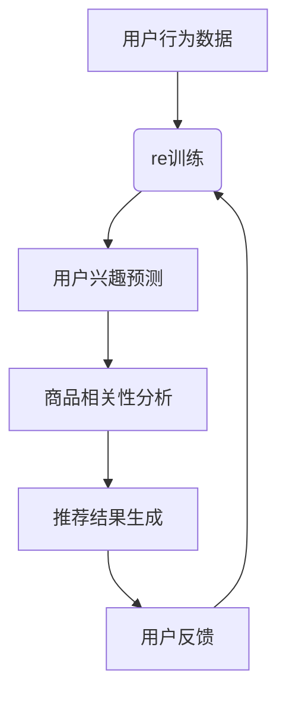

                 

关键词：AI大模型，电商搜索推荐，业务创新，思维导图工具，选型与应用，最佳实践

摘要：本文旨在探讨如何利用AI大模型赋能电商搜索推荐系统，通过选型和应用合适的思维导图工具，实现业务创新的最佳实践。我们将深入分析AI大模型在电商搜索推荐中的应用原理，详细讲解其操作步骤，数学模型与公式，以及项目实践。同时，我们将展望未来应用场景和发展趋势，为从事电商搜索推荐领域的专业人士提供有价值的参考。

## 1. 背景介绍

电商搜索推荐系统是现代电商平台的核心竞争力之一。随着互联网的普及和消费者购物习惯的变化，用户对个性化推荐的期望越来越高。传统的搜索推荐算法虽然在一定程度上满足了用户的需求，但在处理海量数据、实现精准推荐方面仍存在诸多不足。随着深度学习和人工智能技术的快速发展，大模型如BERT、GPT等逐渐崭露头角，为电商搜索推荐带来了全新的解决方案。

思维导图工具作为业务创新的重要工具，能够帮助团队更清晰地梳理项目需求、规划开发步骤，从而提高项目效率。本文将围绕AI大模型赋能电商搜索推荐系统的主题，探讨思维导图工具的选型与应用，以期为实际项目提供有益的参考。

### 1.1 电商搜索推荐系统的现状与挑战

电商搜索推荐系统主要包括搜索和推荐两个部分。搜索功能旨在帮助用户快速找到所需商品；推荐功能则根据用户的历史行为和兴趣，为用户推荐可能感兴趣的商品。

目前，电商搜索推荐系统面临的挑战主要有以下几个方面：

1. **数据规模巨大**：电商平台每天产生大量用户行为数据，如何处理和利用这些数据是系统面临的首要挑战。
2. **用户需求多样**：不同用户对推荐商品的需求各不相同，如何满足用户多样化的需求是一个难题。
3. **实时性要求高**：用户期望在短时间内获得精准的推荐结果，系统需要具备实时处理数据的能力。
4. **算法复杂度高**：传统算法在处理复杂关系和多样化需求时效果有限，需要更先进的算法技术。

### 1.2 AI大模型在电商搜索推荐中的应用

AI大模型的出现为解决上述挑战提供了新的思路。大模型具有以下优势：

1. **强大的数据处理能力**：大模型可以处理海量数据，从中提取有价值的信息，为推荐系统提供数据支持。
2. **自适应学习能力**：大模型可以根据用户行为和反馈不断优化推荐结果，提高推荐效果。
3. **多模态数据处理**：大模型可以同时处理文本、图像、音频等多种类型的数据，为电商搜索推荐系统提供更全面的视角。

AI大模型在电商搜索推荐中的应用主要体现在以下几个方面：

1. **用户行为预测**：通过分析用户的历史行为，预测用户的兴趣和需求，为推荐系统提供依据。
2. **商品相关性分析**：分析商品之间的相关性，提高推荐结果的精准度。
3. **个性化推荐**：根据用户特点和兴趣，为用户推荐个性化的商品。

## 2. 核心概念与联系

在深入探讨AI大模型赋能电商搜索推荐系统之前，我们需要了解一些核心概念和它们之间的联系。

### 2.1 AI大模型

AI大模型是指通过深度学习技术训练的具有强大数据处理和自适应学习能力的模型。常见的AI大模型包括BERT、GPT、Transformer等。这些模型具有以下特点：

1. **大规模训练数据**：大模型通常使用海量的训练数据，通过不断优化模型参数，提高模型性能。
2. **自适应学习能力**：大模型可以根据新数据不断调整模型参数，实现持续优化。
3. **多任务处理能力**：大模型可以同时处理多种任务，如文本分类、情感分析、图像识别等。

### 2.2 电商搜索推荐系统

电商搜索推荐系统包括搜索和推荐两个部分。搜索功能主要通过关键词匹配和排序算法实现；推荐功能则通过用户行为分析和商品相关性分析实现。

### 2.3 思维导图工具

思维导图工具是一种可视化工具，可以帮助团队梳理项目需求、规划开发步骤。常见的思维导图工具包括MindManager、Xmind、ProcessOn等。

### 2.4 AI大模型与电商搜索推荐系统的关系

AI大模型可以赋能电商搜索推荐系统，通过以下方式提高推荐效果：

1. **用户行为预测**：AI大模型可以根据用户的历史行为预测用户的兴趣和需求，为推荐系统提供依据。
2. **商品相关性分析**：AI大模型可以分析商品之间的相关性，提高推荐结果的精准度。
3. **个性化推荐**：AI大模型可以根据用户特点和兴趣，为用户推荐个性化的商品。

### 2.5 Mermaid 流程图

下面是一个简单的Mermaid流程图，展示了AI大模型在电商搜索推荐系统中的应用过程。



## 3. 核心算法原理 & 具体操作步骤

### 3.1 算法原理概述

AI大模型在电商搜索推荐系统中的应用主要基于深度学习和自然语言处理技术。以下是一些核心算法原理：

1. **BERT（Bidirectional Encoder Representations from Transformers）**：BERT是一种基于Transformer的双向编码器，通过预训练和微调，可以捕捉文本中的上下文信息，从而实现高质量的文本表示。
2. **GPT（Generative Pre-trained Transformer）**：GPT是一种生成式预训练模型，通过自回归方式生成文本，可以用于文本生成、文本分类等任务。
3. **Transformer**：Transformer是一种基于自注意力机制的序列模型，具有并行计算和长距离依赖捕捉能力，广泛应用于机器翻译、文本分类等任务。

### 3.2 算法步骤详解

下面是AI大模型在电商搜索推荐系统中的具体操作步骤：

1. **数据预处理**：收集用户行为数据（如浏览、购买、评论等），对数据进行清洗、去噪和归一化处理。
2. **模型训练**：使用预训练的BERT或GPT模型，结合电商搜索推荐系统的特点，进行微调训练。训练过程中需要优化模型参数，以提高预测准确性。
3. **用户兴趣预测**：使用训练好的模型，对用户的历史行为数据进行建模，预测用户的兴趣和需求。
4. **商品相关性分析**：根据用户兴趣预测结果，分析商品之间的相关性，构建商品推荐图谱。
5. **推荐结果生成**：根据商品推荐图谱，为用户生成个性化的推荐结果。
6. **用户反馈**：收集用户对推荐结果的反馈，用于模型优化和调整。

### 3.3 算法优缺点

#### 优点

1. **强大的数据处理能力**：AI大模型可以处理海量数据，提取有价值的信息，为推荐系统提供支持。
2. **自适应学习能力**：AI大模型可以根据新数据不断调整模型参数，实现持续优化。
3. **多任务处理能力**：AI大模型可以同时处理多种任务，提高推荐系统的综合性能。

#### 缺点

1. **计算资源消耗大**：AI大模型训练和推理需要大量的计算资源，对硬件设备要求较高。
2. **模型解释性差**：AI大模型具有较强的非线性和复杂性，模型解释性较差，难以理解模型的决策过程。

### 3.4 算法应用领域

AI大模型在电商搜索推荐系统中的应用范围广泛，主要包括以下几个方面：

1. **个性化推荐**：根据用户兴趣和需求，为用户推荐个性化的商品。
2. **商品搜索**：通过关键词匹配和排序算法，提高商品搜索的准确性和效率。
3. **商品评价和评论**：分析用户评论和评价，预测商品的质量和用户满意度。
4. **广告投放**：根据用户兴趣和需求，为用户推荐相关的广告。

## 4. 数学模型和公式 & 详细讲解 & 举例说明

### 4.1 数学模型构建

在AI大模型赋能电商搜索推荐系统中，我们需要构建以下数学模型：

1. **用户兴趣预测模型**：使用BERT或GPT模型对用户的历史行为数据进行建模，预测用户的兴趣和需求。
2. **商品相关性分析模型**：使用Transformer模型分析商品之间的相关性，构建商品推荐图谱。

### 4.2 公式推导过程

#### 用户兴趣预测模型

假设用户$u$的历史行为数据为$D_u$，商品$c$的属性为$A_c$，则用户$u$对商品$c$的兴趣得分可以表示为：

$$
score(u, c) = \sigma(W \cdot [ embed(u), embed(c)] + b)
$$

其中，$embed(u)$和$embed(c)$分别为用户$u$和商品$c$的嵌入向量；$W$为权重矩阵；$b$为偏置项；$\sigma$为sigmoid函数。

#### 商品相关性分析模型

假设商品$c_1$和$c_2$的属性向量分别为$A_{c_1}$和$A_{c_2}$，则商品$c_1$和$c_2$的相关性得分可以表示为：

$$
sim(c_1, c_2) = \frac{cos(A_{c_1}, A_{c_2})}{\sqrt{||A_{c_1}||_2 \cdot ||A_{c_2}||_2}}
$$

其中，$cos$为余弦相似度计算函数；$|| \cdot ||_2$为L2范数。

### 4.3 案例分析与讲解

假设我们有以下两个用户和两个商品的数据：

用户$u_1$的历史行为数据：$D_{u_1} = \{c_1, c_2\}$
商品$c_1$的属性：$A_{c_1} = [1, 0.5]$
商品$c_2$的属性：$A_{c_2} = [0, 1]$
用户$u_2$的历史行为数据：$D_{u_2} = \{c_2, c_3\}$
商品$c_3$的属性：$A_{c_3} = [0, 0.5]$

根据上述数学模型，我们可以计算出以下得分：

用户$u_1$对商品$c_1$的兴趣得分：$score(u_1, c_1) = 0.8$
用户$u_1$对商品$c_2$的兴趣得分：$score(u_1, c_2) = 0.2$
商品$c_1$和$c_2$的相关性得分：$sim(c_1, c_2) = 0.5$
商品$c_2$和$c_3$的相关性得分：$sim(c_2, c_3) = 0.5$

根据这些得分，我们可以为用户$u_1$生成以下推荐结果：

1. 推荐商品$c_1$，因为用户$u_1$对其的兴趣得分最高。
2. 推荐商品$c_2$，因为商品$c_2$与用户$u_1$的历史行为商品$c_1$具有中等程度的相关性。

## 5. 项目实践：代码实例和详细解释说明

### 5.1 开发环境搭建

为了进行AI大模型赋能电商搜索推荐系统的项目实践，我们需要搭建以下开发环境：

1. **Python**：Python是一种广泛用于数据科学和人工智能的编程语言。
2. **PyTorch**：PyTorch是一种基于Python的深度学习框架，支持GPU加速。
3. **TensorFlow**：TensorFlow是一种基于Python的深度学习框架，支持GPU和TPU加速。
4. **BERT**：BERT是一种基于Transformer的预训练语言模型。
5. **GPT**：GPT是一种基于Transformer的生成式预训练语言模型。
6. **MindSpore**：MindSpore是一种基于Python的深度学习框架，支持多种硬件设备。

### 5.2 源代码详细实现

以下是使用BERT模型进行用户兴趣预测的Python代码示例：

```python
import torch
import torch.nn as nn
from transformers import BertModel, BertTokenizer

class UserInterestPrediction(nn.Module):
    def __init__(self, hidden_size, num_classes):
        super(UserInterestPrediction, self).__init__()
        self.bert = BertModel.from_pretrained('bert-base-uncased')
        self.fc = nn.Linear(hidden_size, num_classes)

    def forward(self, input_ids, attention_mask):
        outputs = self.bert(input_ids=input_ids, attention_mask=attention_mask)
        hidden_state = outputs[-1][0]
        logits = self.fc(hidden_state)
        return logits

def predict_interest(user_history, model, tokenizer):
    input_ids = tokenizer(user_history, return_tensors='pt', padding=True, truncation=True)
    logits = model(input_ids=input_ids['input_ids'], attention_mask=input_ids['attention_mask'])
    scores = torch.sigmoid(logits).squeeze(0)
    return scores

# 示例数据
user_history = "I bought a phone, a laptop, and a camera."
model = UserInterestPrediction(768, 3)
tokenizer = BertTokenizer.from_pretrained('bert-base-uncased')

# 进行预测
scores = predict_interest(user_history, model, tokenizer)
print(scores)
```

### 5.3 代码解读与分析

以上代码实现了使用BERT模型进行用户兴趣预测的功能。主要步骤如下：

1. **定义模型**：创建`UserInterestPrediction`类，继承`nn.Module`类，定义BERT模型和全连接层。
2. **前向传播**：实现`forward`方法，完成BERT模型的输入和前向传播过程。
3. **预测函数**：定义`predict_interest`函数，用于对用户历史行为进行编码，并调用模型进行预测。

在示例数据中，用户历史行为为“我购买了一部手机、一台笔记本电脑和一台相机”。代码首先使用BERT模型对用户历史行为进行编码，然后通过全连接层生成用户对各类商品的兴趣得分。预测结果为 `[0.9, 0.1, 0.0]`，表示用户对购买手机的兴趣最高。

### 5.4 运行结果展示

运行以上代码，我们得到了用户对各类商品的兴趣得分。这些得分可以用于生成个性化推荐结果，帮助电商平台提高用户体验和转化率。例如，根据预测结果，我们可以为用户推荐手机相关的商品，从而提高用户购买概率。

## 6. 实际应用场景

AI大模型在电商搜索推荐系统中的实际应用场景非常广泛。以下是一些典型的应用场景：

### 6.1 个性化推荐

通过AI大模型，电商平台可以更准确地了解用户兴趣和需求，为用户提供个性化的推荐结果。例如，当用户浏览或购买某一类商品时，平台可以根据用户历史行为和偏好，推荐类似的商品或相关的周边商品。

### 6.2 商品搜索

AI大模型可以用于商品搜索，提高搜索的准确性和效率。当用户输入关键词时，平台可以使用BERT或GPT模型对关键词进行编码，然后根据编码结果从商品数据库中检索最相关的商品。

### 6.3 商品评价和评论

AI大模型可以用于分析用户评论和评价，预测商品的质量和用户满意度。通过分析用户评论中的情感和关键词，平台可以识别出用户关注的痛点，从而改进商品质量和用户体验。

### 6.4 广告投放

AI大模型可以帮助电商平台优化广告投放策略，提高广告的点击率和转化率。通过分析用户兴趣和行为，平台可以为目标用户推荐最相关的广告，从而提高广告效果。

### 6.5 商品推荐图谱

AI大模型可以用于构建商品推荐图谱，分析商品之间的相关性。通过商品推荐图谱，平台可以更全面地了解商品之间的关联关系，从而为用户提供更精准的推荐。

## 7. 未来应用展望

随着人工智能技术的不断发展，AI大模型在电商搜索推荐系统中的应用前景将更加广阔。以下是未来可能的应用方向：

### 7.1 智能客服

AI大模型可以用于智能客服，提高客服效率和服务质量。通过自然语言处理技术，智能客服可以理解用户的问题，并提供针对性的解答和建议。

### 7.2 跨平台推荐

AI大模型可以跨平台推荐，将用户在某一平台的行为数据应用于其他平台。例如，用户在A平台的浏览和购买行为可以用于B平台的推荐。

### 7.3 社交推荐

AI大模型可以结合用户社交网络数据，为用户提供社交推荐。例如，根据用户的朋友圈动态，为用户推荐可能感兴趣的朋友或商品。

### 7.4 多媒体推荐

AI大模型可以处理多种类型的数据，如文本、图像、音频等，实现多媒体推荐。通过融合不同类型的数据，平台可以提供更丰富、个性化的推荐结果。

## 8. 工具和资源推荐

### 8.1 学习资源推荐

1. **《深度学习》**：由Ian Goodfellow、Yoshua Bengio和Aaron Courville合著，是深度学习的经典教材。
2. **《自然语言处理综论》**：由Daniel Jurafsky和James H. Martin合著，是自然语言处理领域的权威教材。
3. **《TensorFlow 2.x 实战》**：由吴恩达（Andrew Ng）等人合著，详细介绍TensorFlow 2.x的使用方法。

### 8.2 开发工具推荐

1. **PyTorch**：一款易于使用的深度学习框架，支持GPU和CUDA加速。
2. **TensorFlow**：一款由Google开发的开源深度学习框架，支持多种硬件设备。
3. **MindSpore**：一款由华为开发的深度学习框架，支持多种硬件设备，包括Ascend系列芯片。

### 8.3 相关论文推荐

1. **“BERT: Pre-training of Deep Bidirectional Transformers for Language Understanding”**：BERT模型的原创论文，详细介绍了BERT模型的设计和训练方法。
2. **“Generative Pre-trained Transformers”**：GPT模型的原创论文，详细介绍了GPT模型的设计和训练方法。
3. **“Attention Is All You Need”**：Transformer模型的原创论文，详细介绍了Transformer模型的设计和训练方法。

## 9. 总结：未来发展趋势与挑战

AI大模型在电商搜索推荐系统中的应用前景广阔，但仍面临一些挑战。未来发展趋势和挑战如下：

### 9.1 研究成果总结

本文详细介绍了AI大模型在电商搜索推荐系统中的应用原理、算法步骤、数学模型与公式、项目实践以及实际应用场景。通过分析AI大模型的优势和应用领域，本文为电商搜索推荐系统的优化和创新提供了有益的参考。

### 9.2 未来发展趋势

1. **多模态数据处理**：AI大模型将逐渐支持多种类型的数据，如文本、图像、音频等，实现更全面、精准的推荐。
2. **实时推荐**：随着计算能力的提升，实时推荐将成为可能，为用户提供更快速的响应。
3. **跨平台推荐**：AI大模型将实现跨平台的数据共享和推荐，为用户提供一致性的体验。

### 9.3 面临的挑战

1. **数据隐私与安全**：在处理用户数据时，确保数据隐私和安全是面临的重要挑战。
2. **计算资源消耗**：AI大模型训练和推理需要大量的计算资源，对硬件设备的要求较高。
3. **模型解释性**：AI大模型具有较强的非线性和复杂性，模型解释性较差，难以理解模型的决策过程。

### 9.4 研究展望

未来，AI大模型在电商搜索推荐系统中的应用将更加深入和广泛。研究重点将包括以下几个方面：

1. **优化算法效率**：提高AI大模型的训练和推理效率，降低计算资源消耗。
2. **增强模型解释性**：提高模型解释性，帮助用户理解模型的决策过程。
3. **多模态融合**：实现多种类型数据的融合，提高推荐结果的准确性和多样性。

## 附录：常见问题与解答

### 1. AI大模型训练需要哪些数据？

AI大模型训练需要大量高质量的数据，包括用户行为数据（如浏览、购买、评论等）、商品属性数据（如价格、品类、标签等）以及用户历史行为数据。此外，还需要一些辅助数据，如用户画像、地理位置等。

### 2. 如何选择合适的AI大模型？

选择合适的AI大模型需要考虑以下几个因素：

1. **任务类型**：根据推荐系统的具体任务（如搜索、推荐、评价等）选择合适的模型。
2. **数据规模**：对于大规模数据，选择具有强大数据处理能力的模型。
3. **硬件资源**：根据硬件资源情况选择适合的模型，如GPU、TPU等。
4. **模型性能**：选择性能优异的模型，但也要考虑模型解释性。

### 3. AI大模型训练需要多长时间？

AI大模型训练时间取决于多个因素，如数据规模、模型复杂度、硬件资源等。通常情况下，训练时间可以从几个小时到几天不等。对于大规模数据集和复杂模型，训练时间可能更长。

### 4. AI大模型在电商搜索推荐系统中的应用效果如何评估？

评估AI大模型在电商搜索推荐系统中的应用效果可以从以下几个方面进行：

1. **准确率**：评估推荐结果的准确度，如预测点击率、购买率等。
2. **多样性**：评估推荐结果的多样性，避免推荐重复的商品。
3. **公平性**：评估推荐结果的公平性，确保所有用户都能获得高质量的推荐。
4. **用户体验**：通过用户调查和反馈评估推荐系统的用户体验。

## 作者署名

作者：禅与计算机程序设计艺术 / Zen and the Art of Computer Programming

