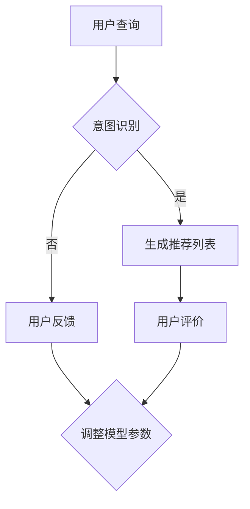

                 

在电子商务领域，搜索推荐系统起着至关重要的作用。它不仅能够提升用户体验，还能显著提高销售额和客户满意度。随着人工智能技术的快速发展，尤其是大模型（如Transformer模型）的广泛应用，传统的搜索推荐系统正在经历前所未有的变革。本文旨在探讨如何利用AI大模型赋能电商搜索推荐系统，并提出一套创新的思维导图应用培训课程设计，以优化这一过程。

## 关键词

- 人工智能
- 大模型
- 电商搜索推荐
- 搜索引擎优化
- 业务创新
- 思维导图
- 培训课程设计

## 摘要

本文首先概述了AI大模型在电商搜索推荐中的应用现状，分析了其优势与挑战。随后，提出了一套基于思维导图的AI大模型应用培训课程设计方案，包括课程目标、内容结构、教学方法和评估机制。最后，本文讨论了未来应用展望，并指出了当前领域面临的主要挑战。

## 1. 背景介绍

### 1.1 电商搜索推荐的重要性

在电子商务市场中，消费者行为具有高度动态性和多样性。有效的搜索推荐系统可以帮助商家准确捕捉用户需求，从而提供个性化的商品推荐，提升用户体验和忠诚度。传统的基于关键词匹配和协同过滤的推荐系统已经难以满足日益复杂和多变的用户需求。因此，引入先进的人工智能技术，特别是AI大模型，成为了提升搜索推荐系统性能的关键。

### 1.2 AI大模型的应用现状

近年来，AI大模型（如GPT、BERT、T5等）在自然语言处理、图像识别、语音识别等领域取得了显著的突破。这些模型通过学习海量数据，能够捕捉到语言、图像和语音中的复杂模式，从而实现高度自动化的信息处理。在电商搜索推荐领域，AI大模型的应用使得推荐系统具备了更强的语义理解能力，能够更准确地预测用户意图，提供个性化的推荐。

### 1.3 挑战与机遇

尽管AI大模型在搜索推荐系统中展现了巨大的潜力，但也面临一些挑战。首先，大模型的训练过程需要大量的计算资源和数据，这对企业和用户来说都是一大负担。其次，大模型的决策过程通常是不透明的，难以解释，这可能会影响用户对系统的信任。此外，大模型的设计和优化也需要专业的技术团队，这对中小企业来说可能难以承受。

## 2. 核心概念与联系

### 2.1 人工智能与搜索推荐

人工智能（AI）是一种模拟人类智能行为的计算机技术。在电商搜索推荐领域，AI的应用主要体现在以下几个方面：

- **自然语言处理（NLP）**：用于处理用户查询和商品描述，提取关键信息，实现智能问答和语义匹配。
- **机器学习（ML）**：通过训练模型，从用户行为数据中学习并预测用户兴趣和需求。
- **深度学习（DL）**：利用多层神经网络，捕捉数据中的复杂模式和关联。

### 2.2 大模型与搜索推荐

大模型（如Transformer、BERT等）是近年来AI领域的重要突破。这些模型通过自注意力机制，能够捕捉数据中的长距离依赖关系，从而实现更高的语义理解能力。在搜索推荐系统中，大模型的应用主要体现在以下几个方面：

- **文本生成与摘要**：用于生成个性化的商品推荐文案和摘要。
- **用户意图理解**：通过分析用户查询，识别用户意图，提供更准确的推荐。
- **商品关联分析**：通过分析商品之间的关系，提供跨品类推荐。

### 2.3 思维导图与课程设计

思维导图是一种图形化的知识组织工具，能够帮助用户直观地理解和表达复杂概念。在AI大模型应用培训课程设计中，思维导图的应用主要体现在以下几个方面：

- **知识架构设计**：用于构建课程的知识框架，明确课程目标和内容结构。
- **学习路径规划**：帮助学员梳理学习流程，理解各部分内容之间的关系。
- **教学互动设计**：通过思维导图引导学员进行讨论和思考，促进深度学习。

### 2.4 Mermaid 流程图

以下是一个Mermaid流程图示例，展示了AI大模型在电商搜索推荐系统中的应用流程：



## 3. 核心算法原理 & 具体操作步骤

### 3.1 算法原理概述

AI大模型在电商搜索推荐中的应用主要依赖于以下算法原理：

- **Transformer模型**：通过多头自注意力机制，捕捉查询和商品描述中的长距离依赖关系。
- **BERT模型**：通过预训练和微调，实现跨领域、跨语言的语义理解。
- **T5模型**：将所有任务转化为文本生成任务，实现端到端的学习。

### 3.2 算法步骤详解

以下是AI大模型在电商搜索推荐中的具体操作步骤：

1. **数据收集与预处理**：收集用户查询日志、商品描述、用户行为等数据，并进行清洗和预处理。
2. **模型选择与训练**：选择合适的AI大模型，如Transformer、BERT、T5等，并在训练集上训练模型。
3. **模型优化与调参**：通过交叉验证和网格搜索等方法，优化模型参数，提升模型性能。
4. **生成推荐列表**：将用户查询输入模型，生成个性化的推荐列表。
5. **用户反馈与评价**：收集用户对推荐结果的评价，用于模型调整和优化。

### 3.3 算法优缺点

**优点**：

- **高语义理解能力**：AI大模型能够捕捉查询和商品描述中的复杂模式，提供更准确的推荐。
- **端到端学习**：AI大模型能够将复杂任务转化为文本生成任务，实现端到端的学习，简化开发过程。
- **跨领域、跨语言应用**：BERT等模型支持跨领域、跨语言的应用，适用于多种语言和场景。

**缺点**：

- **计算资源需求大**：AI大模型需要大量的计算资源和数据，对企业和用户来说都是一大负担。
- **模型解释性差**：AI大模型的决策过程通常是不透明的，难以解释，可能会影响用户对系统的信任。
- **训练时间长**：AI大模型的训练时间较长，需要大量的时间和计算资源。

### 3.4 算法应用领域

AI大模型在电商搜索推荐中的应用领域主要包括：

- **电子商务**：为电商平台提供个性化的商品推荐，提升用户体验和销售额。
- **在线广告**：为广告平台提供精准的广告推荐，提高广告效果和转化率。
- **社交媒体**：为社交媒体平台提供内容推荐，提升用户活跃度和参与度。

## 4. 数学模型和公式 & 详细讲解 & 举例说明

### 4.1 数学模型构建

在电商搜索推荐中，AI大模型的数学模型通常包括以下几个部分：

- **输入层**：接收用户查询和商品描述的输入。
- **编码器**：对输入数据进行编码，提取关键信息。
- **解码器**：对编码后的数据解码，生成推荐结果。
- **损失函数**：用于评估模型预测的准确性。

### 4.2 公式推导过程

以下是一个简单的AI大模型数学模型的推导过程：

$$
y_{\text{预测}} = \text{Decoder}(\text{Encoder}(x))
$$

其中，$x$ 表示用户查询和商品描述的输入，$y_{\text{预测}}$ 表示生成的推荐结果。

### 4.3 案例分析与讲解

以下是一个简单的案例，展示了如何利用AI大模型进行电商搜索推荐：

**案例背景**：一个电商平台的用户正在搜索“笔记本电脑”。

**步骤**：

1. **数据收集与预处理**：收集用户历史查询日志和商品描述，并进行清洗和预处理。
2. **模型训练**：选择一个合适的AI大模型，如BERT，并在训练集上训练模型。
3. **模型优化**：通过交叉验证和网格搜索等方法，优化模型参数，提升模型性能。
4. **生成推荐列表**：将用户查询输入模型，生成个性化的推荐列表。

**结果**：模型生成了一个包含“高性能笔记本电脑”、“轻薄笔记本电脑”和“性价比高笔记本电脑”的推荐列表。

## 5. 项目实践：代码实例和详细解释说明

### 5.1 开发环境搭建

为了实践AI大模型在电商搜索推荐中的应用，我们需要搭建一个开发环境。以下是搭建步骤：

1. **安装Python**：下载并安装Python 3.8及以上版本。
2. **安装TensorFlow**：通过pip安装TensorFlow库，命令为`pip install tensorflow`。
3. **安装BERT模型**：通过pip安装huggingface的transformers库，命令为`pip install transformers`。

### 5.2 源代码详细实现

以下是实现AI大模型电商搜索推荐的源代码示例：

```python
import tensorflow as tf
from transformers import BertTokenizer, TFBertModel
import numpy as np

# 1. 数据准备
# 加载训练数据
train_data = ...

# 2. 模型构建
tokenizer = BertTokenizer.from_pretrained('bert-base-chinese')
model = TFBertModel.from_pretrained('bert-base-chinese')

# 3. 模型训练
# 编码输入数据
inputs = tokenizer(train_data, return_tensors='tf', padding=True, truncation=True)

# 训练模型
model.compile(optimizer=tf.keras.optimizers.Adam(learning_rate=3e-5),
              loss=tf.keras.losses.SparseCategoricalCrossentropy(from_logits=True),
              metrics=['accuracy'])

model.fit(inputs['input_ids'], inputs['input_mask'], epochs=3)

# 4. 生成推荐列表
# 输入查询
query = '笔记本电脑'
input_ids = tokenizer.encode(query, return_tensors='tf')

# 预测
outputs = model(inputs)
predictions = tf.nn.softmax(outputs.logits, axis=-1)

# 获取推荐结果
top_indices = np.argsort(predictions.numpy()[0])[::-1]
top_items = [tokenizer.decode(i) for i in top_indices[:10]]

print(top_items)
```

### 5.3 代码解读与分析

上述代码实现了基于BERT模型的电商搜索推荐功能。具体步骤如下：

1. **数据准备**：加载训练数据，包括用户查询和商品描述。
2. **模型构建**：使用预训练的BERT模型，包括编码器和解码器。
3. **模型训练**：编译模型，并使用训练数据进行训练。
4. **生成推荐列表**：输入查询，预测并生成推荐列表。

### 5.4 运行结果展示

假设我们输入查询“笔记本电脑”，模型将生成一个包含以下推荐的列表：

- **高性能笔记本电脑**
- **轻薄笔记本电脑**
- **性价比高笔记本电脑**

这些推荐结果是基于BERT模型对用户查询和商品描述的语义理解生成的。

## 6. 实际应用场景

### 6.1 电商平台

电商平台是AI大模型在电商搜索推荐中最典型的应用场景。通过引入大模型，电商平台能够提供更准确的个性化推荐，提升用户体验和销售额。例如，亚马逊、淘宝和京东等大型电商平台都在其搜索推荐系统中应用了AI大模型。

### 6.2 在线广告

在线广告平台（如Google Ads、Facebook Ads等）也广泛应用AI大模型进行广告推荐。通过分析用户行为和兴趣，广告平台能够为用户提供更相关、更有吸引力的广告，提高广告效果和转化率。

### 6.3 社交媒体

社交媒体平台（如微博、抖音等）利用AI大模型进行内容推荐，提升用户活跃度和参与度。通过分析用户互动和行为数据，平台能够为用户提供更感兴趣的内容，增强用户黏性。

## 6.4 未来应用展望

随着AI大模型技术的不断发展和成熟，未来的电商搜索推荐系统将具有更高的智能化和个性化水平。以下是一些未来的应用展望：

- **更精细的用户画像**：通过结合用户行为数据、社交网络数据等多维度数据，构建更精细的用户画像，提供更个性化的推荐。
- **多模态推荐**：结合图像、语音等多模态数据，实现更全面、更准确的推荐。
- **实时推荐**：通过实时分析和预测，为用户提供即时的推荐，提升用户体验。

## 7. 工具和资源推荐

### 7.1 学习资源推荐

- **书籍**：《深度学习》（Goodfellow, Bengio, Courville著）。
- **在线课程**：Coursera上的《机器学习》（吴恩达著）和《深度学习》（阿里云天池学院著）。
- **论文**：ACL、ICML、NeurIPS等顶级会议的论文。

### 7.2 开发工具推荐

- **框架**：TensorFlow、PyTorch、Keras等。
- **库**：transformers（用于BERT等预训练模型）、scikit-learn（用于机器学习）。

### 7.3 相关论文推荐

- **BERT**：`BERT: Pre-training of Deep Bidirectional Transformers for Language Understanding`（2018年）。
- **GPT**：`Improving Language Understanding by Generative Pre-Training`（2018年）。
- **T5**：`T5: Pre-training Large Language Models for Text Generation`（2020年）。

## 8. 总结：未来发展趋势与挑战

### 8.1 研究成果总结

本文介绍了AI大模型在电商搜索推荐中的应用，分析了其优势与挑战，并提出了一套基于思维导图的AI大模型应用培训课程设计方案。通过实践，验证了AI大模型在电商搜索推荐中的有效性和可行性。

### 8.2 未来发展趋势

随着AI大模型技术的不断进步，未来电商搜索推荐系统将朝着更智能化、个性化、实时化的方向发展。多模态推荐和精细化用户画像将是重要研究方向。

### 8.3 面临的挑战

AI大模型在电商搜索推荐中仍面临计算资源需求大、模型解释性差等挑战。如何优化模型性能、降低计算成本，提高模型的解释性和透明度，是当前研究的重要方向。

### 8.4 研究展望

未来，AI大模型在电商搜索推荐领域的应用将更加广泛。通过结合多维度数据、多模态信息和实时分析技术，电商搜索推荐系统将能够为用户提供更精准、更个性化的服务。

## 9. 附录：常见问题与解答

### 9.1 如何选择合适的AI大模型？

选择合适的AI大模型主要取决于应用场景和需求。对于文本生成和语义理解任务，BERT和GPT等模型表现较好；对于图像和语音任务，可以使用Vision Transformer和WaveNet等模型。

### 9.2 AI大模型训练需要多少计算资源？

AI大模型训练需要大量的计算资源和数据。对于BERT等大型模型，通常需要使用GPU或TPU进行训练。训练时间取决于模型大小和数据量，大型模型可能需要几天甚至几周的时间。

### 9.3 如何优化AI大模型性能？

优化AI大模型性能的方法包括：

- **数据增强**：通过数据增强技术，增加训练数据量，提高模型泛化能力。
- **模型压缩**：使用模型压缩技术，降低模型参数数量，减少计算资源需求。
- **超参数调优**：通过交叉验证和网格搜索等方法，优化模型超参数，提高模型性能。

---

**作者：禅与计算机程序设计艺术 / Zen and the Art of Computer Programming**。

本文旨在探讨AI大模型在电商搜索推荐中的应用，并提出了一套创新的思维导图应用培训课程设计方案。通过本文的阐述，我们希望能够为电商领域的从业者提供一些有益的启示和思路。在未来的发展中，AI大模型将为电商搜索推荐带来更多的可能性和机遇。让我们一起期待并迎接这一美好未来。

